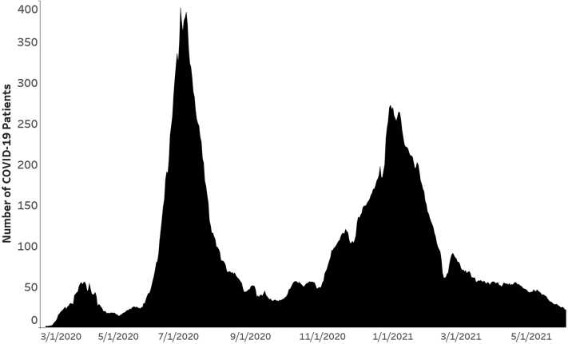
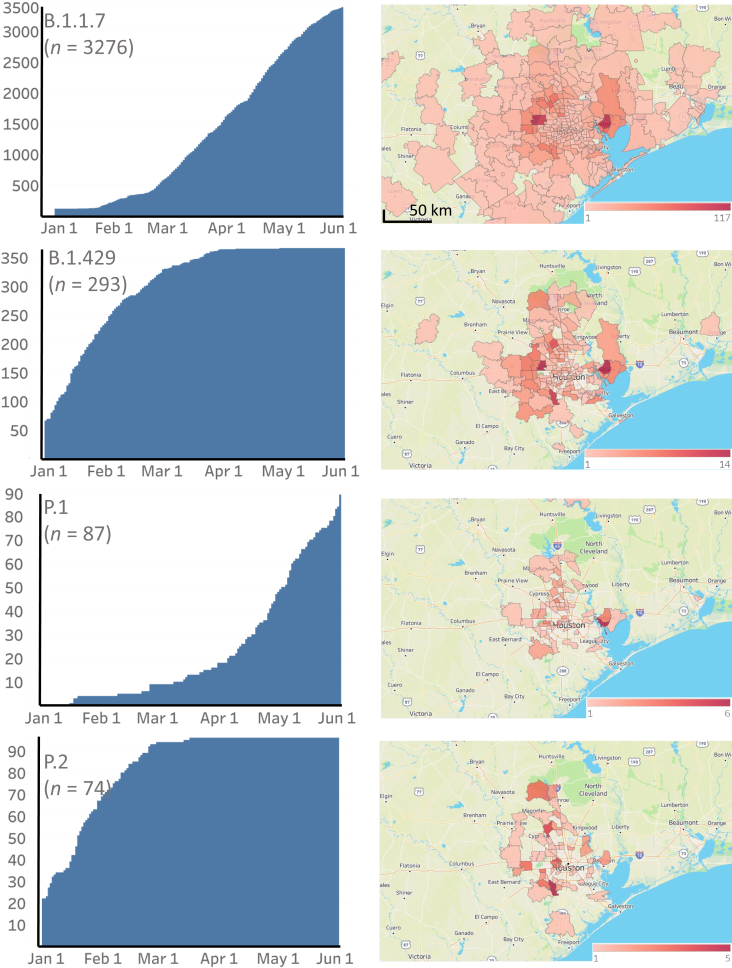
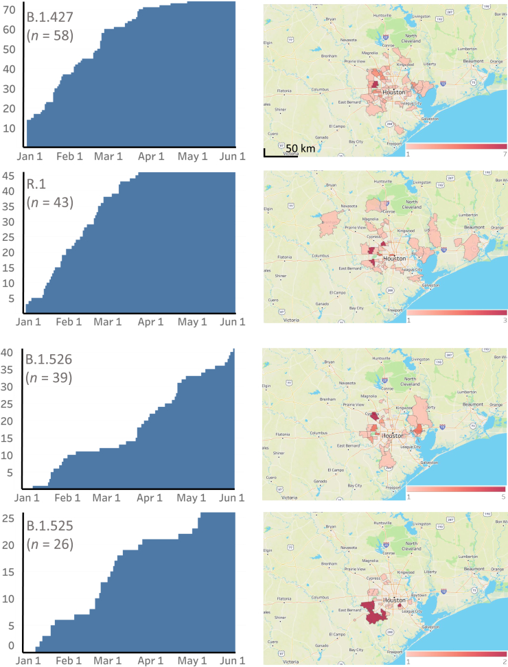
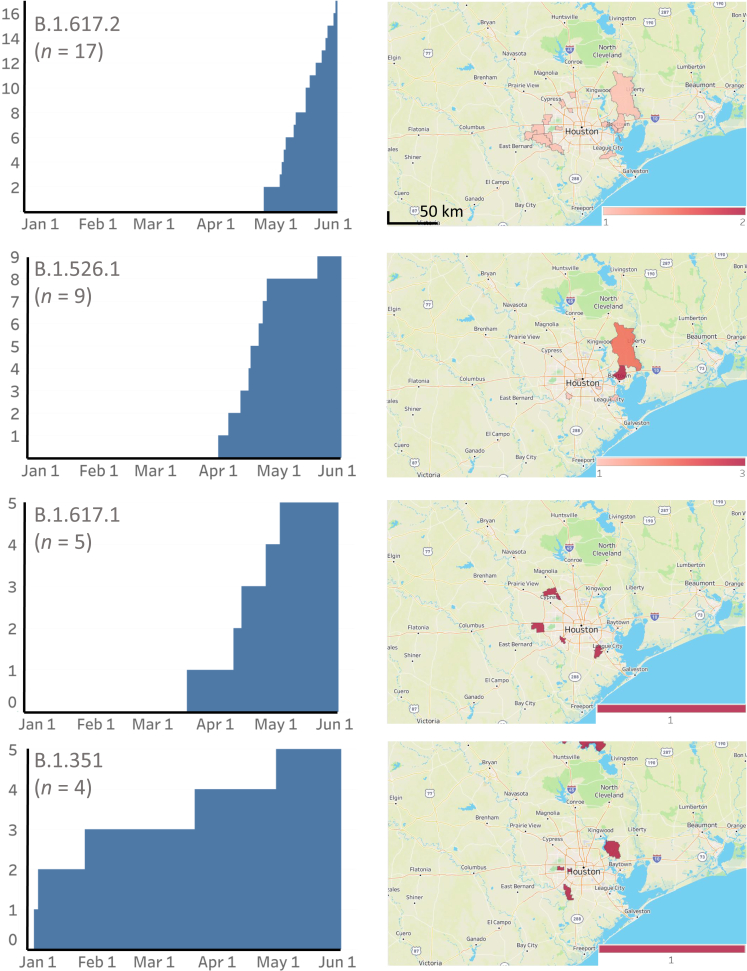
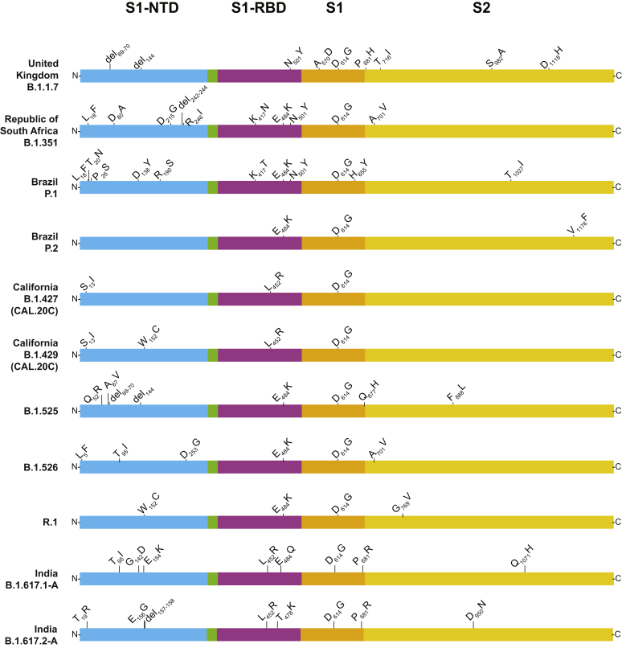
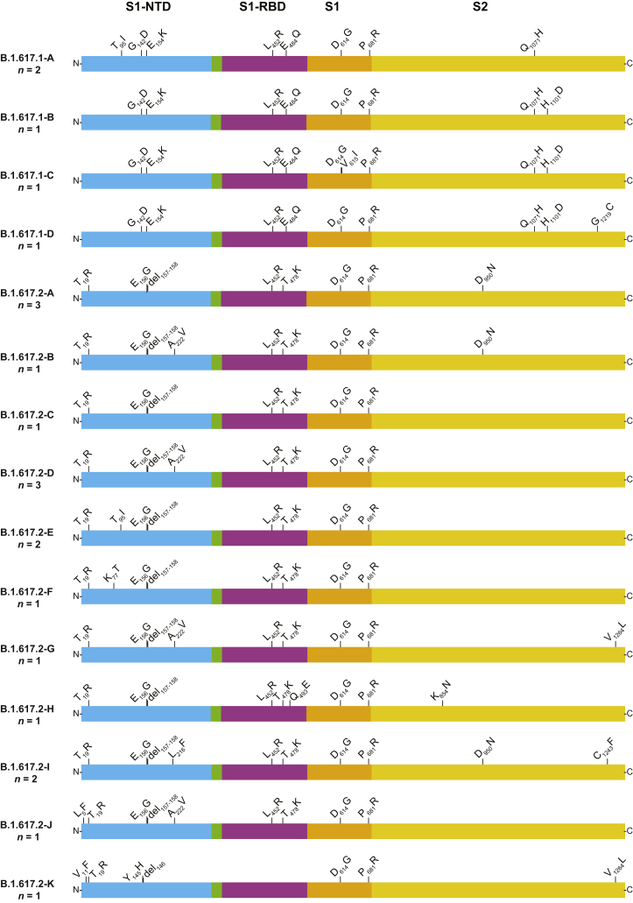
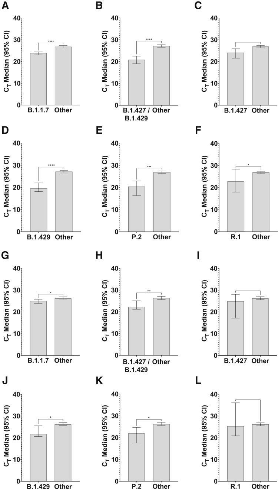
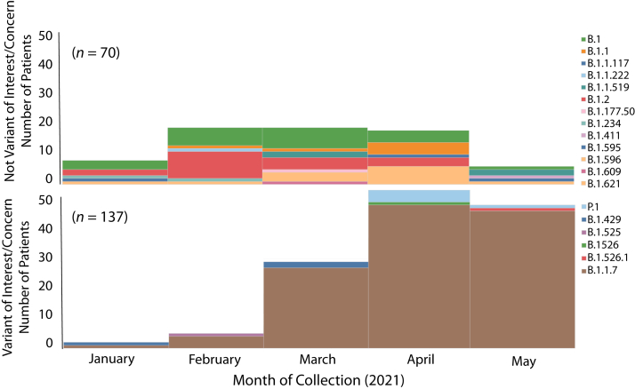

# Trajectory of Growth of Severe Acute Respiratory Syndrome Coronavirus 2 (SARS-CoV-2) Variants in Houston, Texas, January through May 2021, Based on 12,476 Genome Sequences

**Randall J. Olsen, Paul A. Christensen\*, S. Wesley Long\*, Sishir Subedi\*, Parsa Hodjat, Robert Olson, Marcus Nguyen, James J. Davis, Prasanti Yerramilli, Matthew Ojeda Saavedra, Layne Pruitt, Kristina Reppond, Madison N. Shyer, Jessica Cambric, Ryan Gaad, Rashi M. Thakur, Akanksha Batajoo, Ilya J. Finkelstein, Jimmy Gollihar, and James M. Musser** (\* co-authors)

*American Journal of Pathology*, Volume 191, Issue 10, Pages 1754-1773 (2021)

**DOI:** [10.1016/j.ajpath.2021.07.002](https://doi.org/10.1016/j.ajpath.2021.07.002)

---

## Table of Contents

- [Abstract](#abstract)
- [Materials and Methods](#materials-and-methods)
- [Results](#results)
- [Discussion](#discussion)
- [Acknowledgments](#acknowledgments)

---
## Abstract
Certain genetic variants of severe acute respiratory syndrome coronavirus 2 (SARS-CoV-2) are of substantial concern because they may be more transmissible or detrimentally alter the pandemic course and disease features in individual patients. SARS-CoV-2 genome sequences from 12,476 patients in the Houston Methodist health care system diagnosed from January 1 through May 31, 2021 are reported here. Prevalence of the B.1.1.7 (Alpha) variant increased rapidly and caused 63% to 90% of new cases in the latter half of May. Eleven B.1.1.7 genomes had an E484K replacement in spike protein, a change also identified in other SARS-CoV-2 lineages. Compared with non-B.1.1.7-infected patients, individuals with B.1.1.7 had a significantly lower cycle threshold (a proxy for higher virus load) and significantly higher hospitalization rate. Other variants [eg, B.1.429 and B.1.427 (Epsilon), P.1 (Gamma), P.2 (Zeta), and R.1] also increased rapidly, although the magnitude was less than that in B.1.1.7. Twenty-two patients infected with B.1.617.1 (Kappa) or B.1.617.2 (Delta) variants had a high rate of hospitalization. Breakthrough cases (_n_ = 207) in fully vaccinated patients were caused by a heterogeneous array of virus genotypes, including many not currently designated variants of interest or concern. In the aggregate, this study delineates the trajectory of SARS-CoV-2 variants circulating in a major metropolitan area, documents B.1.1.7 as the major cause of new cases in Houston, TX, and heralds the arrival of B.1.617 variants in the metroplex.
* * *
The global pandemic caused by severe acute respiratory syndrome coronavirus 2 (SARS-CoV-2) that began in early 2020 has been challenging for every academic health center and health system, hospital, and public health system in the United States and countries worldwide. [[1](#ref1)], [[2](#ref2)], [[3](#ref3)], [[4](#ref4)], [[5](#ref5)], [[6](#ref6)], [[7](#ref7)] The pandemic has also provided unprecedented opportunities for basic and translational research in all biomedical fields. Molecular population genomics of SARS-CoV-2 were systematically analyzed in the ethnically and socioeconomically diverse metropolitan Houston, TX, area (population 7 million) since the first coronavirus disease 2019 (COVID-19) cases were reported in early March 2020. [[8](#ref8)], [[9](#ref9)], [[10](#ref10)], [[11](#ref11)] These studies are facilitated by a central molecular diagnostic laboratory that comprehensively identifies and retains all COVID-19 diagnostic specimens from our large health care system, which includes eight hospitals, emergency care clinics, and outpatient centers distributed throughout the metropolitan region. In addition, the longstanding interest in pathogen genomics and sequencing infrastructure was leveraged to investigate the spread of SARS-CoV-2 in metropolitan Houston. [[8](#ref8)], [[9](#ref9)], [[10](#ref10)], [[11](#ref11)], [[12](#ref12)], [[13](#ref13)], [[14](#ref14)], [[15](#ref15)], [[16](#ref16)] SARS-CoV-2 viruses causing infections in the earliest phase of the pandemic affecting Houston had substantial genomic diversity and are progeny of strains derived from several continents, including Europe and Asia. [[8](#ref8)],[[9](#ref9)] These findings indicated that SARS-CoV-2 was introduced into our region many times independently by individuals who had traveled from different parts of the country and the world. Subsequently, sequence analysis of 5085 genomes causing the first disease wave and massive second disease wave in Houston showed that all strains in the second wave had a D614G amino acid replacement in the spike protein. [[9](#ref9)] The D614G polymorphism increases human transmission and infectivity _in vitro_ and _in vivo_ in animal infection models. [[17](#ref17)], [[18](#ref18)], [[19](#ref19)], [[20](#ref20)], [[21](#ref21)], [[22](#ref22)] More importantly, this was the first study to analyze the molecular architecture of SARS-CoV-2 in two infection waves in any major metropolitan region.
One of the key goals since the start of the pandemic has been to sequence all positive SARS-CoV-2 specimens from patients in our hospital system and rapidly identify mutations that may be associated with detrimental patient outcome, including therapeutic or vaccine failure. Similarly, with the recognition of an increasing number of SARS-CoV-2 variants of interest (VOIs) and variants of concern (VOCs) by public health agencies, such as the US CDC, World Health Organization, and Public Health England ([_https://www.cdc.gov/coronavirus/2019-ncov/cases-updates/variant-surveillance/variant-info.html_](https://www.cdc.gov/coronavirus/2019-ncov/cases-updates/variant-surveillance/variant-info.html), last accessed June 8, 2021; and [_https://www.gov.uk/government/collections/new-sars-cov-2-variant_](https://www.gov.uk/government/collections/new-sars-cov-2-variant), last accessed June 8, 2021), there is now substantial domestic and international need to identify these virus genotypes rapidly and understand their velocity and patterns of dissemination. In particular, VOC B.1.1.7 (also termed Alpha), first identified in the United Kingdom, is of special interest because it has the ability to transmit effectively, it can spread through populations rapidly, and has been reported to have a significantly higher mortality rate than non-B.1.1.7 infections (Virological, [_https://virological.org/t/preliminary-genomic-characterisation- of-an-emergent-sars-cov-2-lineage-in-the-uk-defined-by-a-novel-set-of-spike-mutations/563_](https://virological.org/t/preliminary-genomic-characterisation-%20of-an-emergent-sars-cov-2-lineage-in-the-uk-defined-by-a-novel-set-of-spike-mutations/563), last accessed June 8, 2021; Public Health England, [_https://assets.publishing.service.gov.uk/government/uploads/system/uploads/attachment_data/file/947048/technical_briefing_voc_sh_njl2_sh2.pdf_](https://assets.publishing.service.gov.uk/government/uploads/system/uploads/attachment_data/file/947048/technical_briefing_voc_sh_njl2_sh2.pdf), last accessed June 8, 2021; New and Emerging Respiratory Virus Threats Advisory Group, [_https://app.box.com/s/3lkcbxepqixkg4mv640dpvvg978ixjtf/file/756963730457_](https://app.box.com/s/3lkcbxepqixkg4mv640dpvvg978ixjtf/file/756963730457), last accessed June 8, 2021; Centre for Mathematical Modelling of Infectious Diseases, [_https://cmmid.github.io/topics/covid19/uk-novel-variant.html_](https://cmmid.github.io/topics/covid19/uk-novel-variant.html), last accessed June 8, 2021; and [_https://virological.org/t/lineage-specific-growth-of-sars-cov-2-b-1-1-7-during-the-english-national-lockdown/575_](https://virological.org/t/lineage-specific-growth-of-sars-cov-2-b-1-1-7-during-the-english-national-lockdown/575), last accessed June 8, 2021). [[23](#ref23)], [[24](#ref24)], [[25](#ref25)], [[26](#ref26)], [[27](#ref27)], [[28](#ref28)], [[29](#ref29)], [[30](#ref30)], [[31](#ref31)], [[32](#ref32)], [[33](#ref33)], [[34](#ref34)], [[35](#ref35)], [[36](#ref36)] VOCs B.1.351 (β) and P.1 (Gamma), found to cause widespread disease in South Africa and Brazil, respectively, have sequence changes in spike protein that make them less susceptible to host and some therapeutic antibodies. [[37](#ref37)], [[38](#ref38)], [[39](#ref39)], [[40](#ref40)] Recently, two additional VOIs, B.1.427 and B.1.429 (Epsilon), were recognized by the CDC in part because of their rapid transmission in many California communities [[41](#ref41)] (Outbreak.info, [_https://outbreak.info/situation-reports?pango=b.1.427_](https://outbreak.info/situation-reports?pango=b.1.427), last accessed June 8, 2021; and [_https://outbreak.info/situation-reports?pango=b.1.4279_](https://outbreak.info/situation-reports?pango=b.1.4279), last accessed June 8, 2021).
Based on sequencing 20,453 SARS-CoV-2 genomes causing COVID-19 disease in Houston, all named VOIs and VOCs are circulating in the metropolitan region, making it the first community to document their presence. [[10](#ref10)] A follow-up study reported rapid increase of VOC UK B.1.1.7 in Houston [[11](#ref11)]; cases infected with the variant were estimated to have a doubling time of approximately 7 days. This rapid B.1.1.7 growth trajectory raised the possibility that this variant would cause nearly all new COVID-19 cases in metropolitan Houston by the end of March or early April 2021, a time frame similar to an estimate made in late January by the CDC. [[33](#ref33)]
This study reports integrated virus genome and patient data for 12,476 unique COVID-19 cases identified between January 1, 2021, and May 31, 2021, including 3276 patients with the B.1.1.7 VOC. In the latter half of May, depending on the day, 63% to 90% of all new COVID-19 cases in metropolitan Houston were caused by B.1.1.7. Linked medical record information, available for virtually all sequenced genomes, was used to study the relationship between virus genotypes and patient phenotypes. Patients infected with B.1.1.7 had significantly lower cycle threshold (CT) values in nasopharyngeal specimens (considered to be a proxy for higher virus load) and a significantly higher hospitalization rate compared with non-B.1.1.7 patients. There was no difference between these two groups in hospital length of stay or mortality. Of the 3276 B.1.1.7 genomes, 11 (0.3%) had an E484K change in spike protein that reduces binding by some neutralizing antibodies. Unexpectedly, five cases of B.1.1.7 were detected from samples collected in early December, resulting in a revised time frame for the introduction of this variant to Houston. Twenty-two patients were identified with COVID-19 caused by B.1.617.1 (Kappa) or B.1.617.2 (Delta) variants reported to be causing widespread disease and extensive public health problems in India, other Southeast Asian countries, and many regions of the United Kingdom (World Health Organization, [_https://www.who.int/publications/m/item/weekly-epidemiological-update-on-covid-19---8-june-2021_](https://www.who.int/publications/m/item/weekly-epidemiological-update-on-covid-19---8-june-2021), last accessed June 9, 2021). [[42](#ref42)], [[43](#ref43)], [[44](#ref44)], [[45](#ref45)], [[46](#ref46)], [[47](#ref47)], [[48](#ref48)], [[49](#ref49)] These patients also had a high rate of hospitalization. Vaccine breakthrough cases (_n_ = 207) were caused by diverse virus genotypes, many of which were not VOCs or VOIs. Our genome data show that VOCs and VOIs now account for the great majority of all new COVID-19 cases in this region, identify B.1.1.7 as the major cause of new cases in Houston, and document the arrival and spread of B.1.617 variants in the Houston metroplex.

## Materials and Methods
### Patient Specimens
Specimens were obtained from registered patients at Houston Methodist hospitals, associated facilities (eg, urgent care centers), and institutions in the Houston metropolitan region that use our laboratory services. Virtually all individuals had signs or symptoms consistent with COVID-19 disease. We analyzed a comprehensive sample of genomes obtained from January 1, 2021, through May 31, 2021. This time frame was chosen for convenience because it represents the period during which, at the onset of the study, we identified an uptick in identification of VOIs and VOCs. The study included all 12,476 unique patients identified in this time frame. The work was approved by the Houston Methodist Research Institute Institutional Review Board (IRB1010-0199).
### SARS-CoV-2 Molecular Diagnostic Testing
Specimens obtained from symptomatic patients with a suspicion for COVID-19 disease were tested in the Molecular Diagnostics Laboratory at Houston Methodist Hospital using assays granted Emergency Use Authorization from the US Food and Drug Administration ([_https://www.fda.gov/medical-devices/emergency-situations-medical-devices/faqs-diagnostic-testing-sars-cov-2#offeringtests_](https://www.fda.gov/medical-devices/emergency-situations-medical-devices/faqs-diagnostic-testing-sars-cov-2#offeringtests), last accessed June 7, 2021). As a hedge against supply chain strictures, multiple molecular testing platforms were used, including the COVID-19 test or RP2.1 test with BioFire Film Array instruments (BioFire Diagnostics, Salt Lake City, Utah), the Xpert Xpress SARS-CoV-2 test using Cepheid GeneXpert Infinity or Cepheid GeneXpert Xpress IV instruments (Cepheid, Sunnyvale, CA), the cobas SARS-CoV-2 & Influenza A/B Assay using the Roche Liat system (Roche Diagnostics, Indianapolis, IN), the SARS-CoV-2 Assay using the Hologic Panther instrument (Hologic, Marlborough, MA), the Aptima SARS-CoV-2 Assay using the Hologic Panther Fusion system (Hologic, Marlborough, MA), the Cobas SARS-CoV-2 test using the Roche 6800 system (Roche Diagnostics, Indianapolis, IN), and the SARS-CoV-2 assay using Abbott Alinity m instruments (Abbott, Abbott Park, IL). The great majority of tests were performed on material obtained from nasopharyngeal swabs immersed in universal transport media; oropharyngeal or nasal swabs, bronchoalveolar lavage fluid, or sputum treated with dithiothreitol was sometimes used. Standardized specimen collection methods were used (Vimeo, [_https://vimeo.com/396996468/2228335d56_](https://vimeo.com/396996468/2228335d56), last accessed June 7, 2021).
### SARS-CoV-2 Genome Sequencing
Libraries for whole virus genome sequencing were prepared according to version 3 of the ARTIC nCoV-2019 sequencing protocol (Artic Network, [_https://artic.network/ncov-2019_](https://artic.network/ncov-2019), last accessed June 7, 2021). We used a semi-automated workflow that employed BioMek i7 liquid handling workstations (Beckman Coulter Life Sciences, Indianapolis, IN) and MANTIS automated liquid handlers (FORMULATRIX, Bedford, MA). Short sequence reads were generated with a NovaSeq 6000 instrument (Illumina, San Diego, CA). For continuity of the epidemiologic analysis in the study period, some genome sequences reported in a recent publication were included. [[10](#ref10)]
### SARS-CoV-2 Genome Sequence Analysis and Identification of Variants
Viral genomes were assembled with the BV-BRC SARS-Cov2 assembly service (The Bacterial and Viral Bioinformatics Resource Center, [ _https://www.bv-brc.org/app/comprehensivesars2analysis_](https://www.bv-brc.org/app/comprehensivesars2analysis), last accessed June 7, 2021, requires registration). The One Codex SARS-CoV-2 variant calling and consensus assembly pipeline was used to assemble all sequences (GitHub, [_https://github.com/onecodex/sars-cov-2.git_](https://github.com/onecodex/sars-cov-2.git), last accessed June 7, 2021) using default parameters and a minimum read depth of three. Briefly, the pipeline uses seqtk version 1.3-r116 for sequence trimming (GitHub, [_https://github.com/lh3/seqtk.git_](https://github.com/lh3/seqtk.git), last accessed June 7, 2021); minimap version 2.1 ([_https://github.com/lh3/minimap2_](https://github.com/lh3/minimap2), last accessed August 09, 2021) for aligning reads against reference genome Wuhan-Hu-1 ([_https://www.ncbi.nlm.nih.gov/nuccore/1798174254_](https://www.ncbi.nlm.nih.gov/nuccore/1798174254); NC_045512.2); samtools version 1.11 ([_http://www.htslib.org_](http://www.htslib.org), last accessed August 09, 2021) for sequence and file manipulation; and iVar version 1.2.2 ([_https://github.com/andersen-lab/ivar/releases_](https://github.com/andersen-lab/ivar/releases), last accessed August 09, 2021) for primer trimming and variant calling. Genetic lineages, VOCs, and VOIs were identified on the basis of genome sequence data and designated by Pangolin version 3.0.5 ([_https://github.com/cov-lineages/pangoLEARN_](https://github.com/cov-lineages/pangoLEARN), last accessed August 09, 2021) with pangoLEARN module 2021 to 06-05 (SARS-CoV-2 lineages, [_https://cov-lineages.org/pangolin.html_](https://cov-lineages.org/pangolin.html), last accessed June 7, 2021).
### Patient Metadata and Geospatial Analysis
Patient metadata (Tables 1 and 2) were acquired from the electronic medical record by standard informatics methods. Patient home address zip codes were used to visualize the geospatial distribution of spread for each VOC and VOI. Figures were generated with Tableau version 2020.3.4 (Tableau Software, LLC, Seattle, WA). A vaccination breakthrough case was defined as a PCR-positive sample from a symptomatic patient obtained >14 days after full vaccination (ie, both doses of the Pfizer or Moderna mRNA vaccines) was completed.
#### Table 1.
Summary of Pertinent Patient Metadata for the 12,476 Unique Patients
Variable | B.1.1.7 variant | Other variants | Total | Statistical analysis
---|---|---|---|---
Patients with data | 3276 (26.3) | 9200 (73.7) | 12,476 |
Patient characteristics | | | |
Median age, years | 49.9 | 53.7 | 52.5 | _P_ < 0.0001 (_U_ -test)
Female sex | 1693 (51.7) | 4880 (53.0) | 6573 (52.7) | _P_ = 0.1854 (Fisher exact test)
Male sex | 1583 (48.3) | 4320 (47.0) | 5903 (47.3) |
Race/ethnicity | | | |
White | 1304 (40.1) | 3720 (40.6) | 5024 (40.5) | _P_ < 0.0001 (χ2 test)
Hispanic or Latino | 945 (29.1) | 2720 (29.7) | 3665 (29.5) |
Black | 748 (23.0) | 1644 (18.0) | 2392 (19.3) |
Asian | 128 (3.9) | 549 (6.0) | 677 (5.5) |
Native American | 16 (0.5) | 28 (0.3) | 44 (0.4) |
Hawaiian/Pacific Islander | 3 (0.1) | 23 (0.3) | 26 (0.2) |
Unavailable | 107 (3.3) | 472 (5.2) | 579 (4.7) |
BMI, kg/m² | | | |
Median | 30.4 | 29.5 | _n_ = 11,009 | _P_ < 0.0001 (_U_ -test)
<18.5 | 48 (1.5) | 140 (1.5) | 188 (1.5) | _P_ < 0.0001 (χ2 test)
18.5-25 | 506 (15.4) | 1608 (17.5) | 2114 (16.9) |
25-30 | 857 (26.2) | 2520 (27.4) | 3377 (27.1) |
30-35 | 740 (22.6) | 1833 (19.9) | 2573 (20.6) |
≥35 | 811 (24.8) | 1946 (21.2) | 2757 (22.1) |
Unknown | 314 (9.6) | 1153 (12.5) | 1467 (11.8) |
Admission data | | | |
Admitted | 1768 (54.0) | 4265 (46.4) | 6033 (48.4) | _P_ < 0.0001 (Fisher exact test) Odds ratio: 1.357 (95% CI, 1.252-1.469)
Not admitted | 1508 (46.0) | 4935 (53.6) | 6443 (51.6) |
Median LOS, days | 5.1 | 5.2 | 5.2 | _P_ = 0.8917 (_U_ -test)
Maximum respiratory support | | | |
ECMO | 8 (0.5) | 17 (0.4) | 25 (0.4) | _P_ = 0.0135 (χ2 test)
Mechanical ventilation | 150 (8.5) | 365 (8.6) | 515 (8.5) |
Noninvasive ventilation | 169 (9.6) | 433 (10.2) | 602 (10.0) |
High-flow oxygen | 358 (20.2) | 696 (16.3) | 1054 (17.5) |
Low-flow oxygen | 734 (41.5) | 1830 (42.9) | 2564 (42.5) |
Room air | 349 (19.7) | 924 (21.7) | 1273 (21.1) |
Mortality | | | |
Alive | 3132 (95.6) | 8760 (95.2) | 11,892 (95.3) | _P_ = 0.3862 (Fisher exact test) Odds ratio: 0.915 (95% CI, 0.755-1.111)
Deceased | 144 (4.4) | 440 (4.8) | 584 (4.7) |
Median PCR CT | | | |
Abbott Alinity | 23.9 (_n_ = 1133) | 26.8 (_n_ = 3344) | _n_ = 4477 | _P_ < 0.0001 (_U_ -test)
Hologic Panther | 25.0 (_n_ = 385) | 26.2 (_n_ = 1574) | _n_ = 1959 | _P_ = 0.0274 (_U_ -test)
Vaccine | | | |
No vaccine | 3023 (92.3) | 8715 (94.7) | 11,738 (94.1) | _P_ < 0.0001 (χ2 test)
>7 Days past first vaccine | 127 (3.9) | 404 (4.4) | 531 (4.3) |
>14 Days past second vaccine | 126 (3.8) | 81 (0.9) | 207 (1.7) |
Data are given as _n_ (%), unless otherwise indicated. Data include 12,476 unique patients with high-quality sequence results between January 1, 2021, and May 31, 2021.
BMI, body mass index; ECMO, extracorporeal membrane oxygenation; LOS, length of stay.
#### Table 2.
Summary of Pertinent Patient Metadata for B.1.617.1/B.1.617.2 Patients (Excluding B.1.1.7 Patients)
Variable | B.1.617 variants | Other variants | Total | Statistical analysis
---|---|---|---|---
Patients with data | 22 (0.2) | 9178 (99.8) | 9200 |
Race/ethnicity | | | |
Asian | 7 (33.3) | 542 (5.9) | 549 (6.0) | _P_ < 0.001 (Fisher exact test) (Asian versus non-Asian) Odds ratio: 7.927 (95% CI, 2.973-19.40)
White | 8 (38.1) | 3712 (40.6) | 3720 (40.6) |
Hispanic or Latino | 3 (14.3) | 2717 (29.7) | 2720 (29.7) |
Black | 0 (0) | 1644 (18.0) | 1644 (18.0) |
Native American | 1 (4.8) | 27 (0.3) | 28 (0.3) |
Hawaiian/Pacific Islander | 1 (4.8) | 22 (0.2) | 23 (0.3) |
Unavailable | 1 (4.8) | 471 (5.2) | 472 (5.2) |
Admission data | | | |
Admitted | 17 (77.3) | 4248 (46.3) | 4265 (46.4) | _P_ = 0.0045 (Fisher exact test) Odds ratio: 3.946 (95% CI, 1.529-9.788)
Not admitted | 5 (22.7) | 4930 (53.7) | 4935 (53.6) |
Median LOS, days | 6.7 | 5.2 | | _P_ = 0.5388 (_U_ -test)
Highest level of care | | | |
ICU | 3 (17.6) | 639 (15.0) | 642 (15.1) | _P_ = 0.5474 (_U_ -test)
IMU | 1 (5.9) | 93 (2.2) | 94 (2.2) |
Other inpatient | 13 (76.5) | 3516 (82.8) | 3529 (82.7) |
Maximum respiratory support | | | |
ECMO | 0 (0) | 17 (0.4) | 17 (0.4) | _P_ > 0.9999 (Fisher exact test) (room air and low-flow oxygen versus other) Odds ratio: 1.006 (95% CI, 0.3803-2.647)
Mechanical ventilation | 3 (17.6) | 362 (8.5) | 365 (8.6) |
Noninvasive ventilation | 1 (5.9) | 432 (10.2) | 433 (10.2) |
High-flow oxygen | 2 (11.8) | 694 (16.3) | 696 (16.3) |
Low-flow oxygen | 8 (47.1) | 1822 (42.9) | 1830 (42.9) |
Room air | 3 (17.6) | 921 (21.7) | 924 (21.7) |
Mortality | | | |
Alive | 20 (90.9) | 8740 (95.2) | 8760 (95.2) | _P_ = 0.2838 (Fisher exact test) Odds ratio: 1.995 (95% CI, 0.459-7.462)
Deceased | 2 (9.1) | 438 (4.8) | 440 (4.8) |
Data are given as _n_ (%), unless otherwise indicated. Data include 9200 unique patients with high-quality sequence results between January 1, 2021, and May 31, 2021.
ECMO, extracorporeal membrane oxygenation; ICU, intensive care unit; IMU, intermediate care unit; LOS, length of stay.

## Results
### Epidemiologic Trajectory and Patient Overview
Metropolitan Houston has experienced three distinct epidemiologic peaks of COVID-19 ([Fig. 1](#fig1)). The timing and shape of the epidemiologic curve for Houston Methodist patients mirrors the curve for the metropolitan region (Harris County Public Health, [_https://covid-harriscounty.hub.arcgis.com/pages/cumulative-data_](https://covid-harriscounty.hub.arcgis.com/pages/cumulative-data), last accessed June 7, 2021). The third wave of COVID-19 started in approximately early November, following a prolonged disease trough occurring after the second wave ([Fig. 1](#fig1)). Approximately 12,476 patients were studied from January 1, 2021, through May 31, 2021, a period during which most of the VOIs and VOCs were initially identified in Houston, and several of them increased substantially (Table 1 and [Figures 2](#fig2), [3](#fig3), and [4](#fig4)).
<figure class="paper-figure" id="fig1">

<figcaption><strong>Figure 1.</strong> Epidemiologic curve showing three waves of SARS-CoV-2 infections in Houston Methodist patients. Daily totals are shown as a +/- 3-day moving average. The figure was generated with Tableau version 2020.3.4.</figcaption>
</figure>
<figure class="paper-figure" id="fig2">

<figcaption><strong>Figure 2.</strong> Cumulative increase in SARS-CoV-2 B.1.1.7, B.1.429, P.1, and P.2 variants and their distribution in metropolitan Houston, TX. The time frame used is January 1, 2021, through May 31, 2021. <b>Left column:</b> The cumulative increase in unique patients with each variant. <b>Right column:</b> The geospatial distribution of these variants based on the home address zip code for each patient. Figures were generated with Tableau version 2020.3.4.</figcaption>
</figure>
<figure class="paper-figure" id="fig3">

<figcaption><strong>Figure 3.</strong> Cumulative increase in SARS-CoV-2 B.1.427, R.1, B.1.526, and B.1.525 variants and their distribution in metropolitan Houston, TX. The time frame used is January 1, 2021, through May 31, 2021. <b>Left column:</b> The cumulative increase in unique patients with each variant. <b>Right column:</b> The geospatial distribution of these variants based on the home address zip code for each patient. Figures were generated with Tableau version 2020.3.4.</figcaption>
</figure>
<figure class="paper-figure" id="fig4">

<figcaption><strong>Figure 4.</strong> Cumulative increase in SARS-CoV-2 B.1.617.2, B.1.526.1, B.1.617.1, and B.1.351 variants and their distribution in metropolitan Houston, TX. The time frame used is January 1, 2021, through May 31, 2021. <b>Left column:</b> The cumulative increase in unique patients with each variant. <b>Right column:</b> The geospatial distribution of these variants based on the home address zip code for each patient. Figures were generated with Tableau version 2020.3.4.</figcaption>
</figure>
The median age of the patients studied was 52.5 years, and 53% were female; 6033 (48.4%) patients required hospitalization. The ethnic distribution of the patients (Table 1) broadly reflects metropolitan Houston, which has a majority-minority population composition. Median length of stay was 5.2 days, and the 28-day mortality rate was 4.7%.
### Occurrence of VOIs and VOCs
The CDC has identified nine VOIs [B.1.427 and B.1.429 (Epsilon), B.1.525 (also termed Eta), B.1.526 and B.1.526.1 (Iota), P.2 (Zeta), B.1.617, B.1.617.1 (Kappa), and B.1.617.3] and four VOCs [B.1.1.7 (Alpha), B.1.617.2 (Delta), P.1 (Gamma), and B.1.351 (Beta)] based on heightened concern about potential or proven threat to public health and individual patients. The following VOIs were identified in our comprehensive sample of 12,476 genome sequences: B.1.427 (_n_ = 58), B.1.429 (_n_ = 293), B.1.525 (_n_ = 26), B.1.526 (_n_ = 39), B.1.526.1 (_n_ = 9), B.1.617.1 (_n_ = 5), and P.2 (_n_ = 74). All four VOCs were found, including B.1.1.7 (_n_ = 3276), P.1 (_n_ = 87), B.1.617.2 (_n_ = 17), and B.1.351 (_n_ = 4) ([Figures 2](#fig2), [3](#fig3), [4](#fig4), and [5](#fig5)). B.1.1.7 rapidly increased in the population and now dominates the new-infection landscape in Houston ([Figures 2](#fig2), [3](#fig3), and [4](#fig4)). In the last half of May, depending on the specific day, the B.1.1.7 variant caused 63% to 90% of new COVID-19 cases. In addition, cases caused by variants P.1, P.2, B.1.429, and the B.1.617 family also increased during the study period, although not to the magnitude of B.1.1.7 infections ([Figures 2](#fig2), [3](#fig3), and [4](#fig4)).
<figure class="paper-figure" id="fig5">

<figcaption><strong>Figure 5.</strong> Structural changes present in spike protein of the major SARS-CoV-2 variants identified in the study, including variants of interest, variants of concern, and variant R.1. The figure is a modified version of one presented previously,<a href="#ref10">[10]</a> with permission from Elsevier. NTD, amino-terminal domain; RBD, receptor-binding domain; S1, S1 domain; S2, S2 domain.</figcaption>
</figure>
### Variants Genetically Related to B.1.617
Although comprehensive data are not available from India, the B.1.617, B.1.617.1, B.1.617.2, and B.1.617.3 variants were recently described as causing widespread COVID-19 disease in that country [[42](#ref42)], [[43](#ref43)], [[44](#ref44)] (World Health Organization, [_https://www.who.int/publications/m/item/weekly-epidemiological-update-on-covid-19---11-may-2021_](https://www.who.int/publications/m/item/weekly-epidemiological-update-on-covid-19---11-may-2021), last accessed May 16, 2021) and have been designated as VOIs or VOCs by the CDC. B.1.617-family variants also have been reported to be prominent causes of new COVID-19 cases in other countries in Southeast Asia and the United Kingdom (World Health Organization, [_https://www.who.int/publications/m/item/weekly-epidemiological-update-on-covid-19---8-june-2021_](https://www.who.int/publications/m/item/weekly-epidemiological-update-on-covid-19---8-june-2021), last accessed June 9, 2021). [[42](#ref42)], [[43](#ref43)], [[44](#ref44)], [[45](#ref45)], [[46](#ref46)], [[47](#ref47)], [[48](#ref48)], [[49](#ref49)] Variant B.1.617 is resistant to the monoclonal antibody bamlanivimab (LY-Cov555), as assessed by an _in vitro_ host-cell entry assay [[45](#ref45)] and B.1.617.1 has been reported to be highly virulent in hamsters following intranasal inoculation. [[44](#ref44)] These two variants are characterized by a core group of amino acid replacements in spike protein: L452R, T478K or E484Q, D614G, and P681R ([Fig. 6](#fig6)). More importantly, genetic variation exists among sequences classified as B.1.617.1 and B.1.617.2. Among these 5 B.1.617.1 and 17 B.1.617.2 variant samples, 4 and 11 distinct subvariants were identified, respectively ([Fig. 6](#fig6)). Two of the patients with B.1.617.1 and three of the patients with B.1.617.2 had a recent travel history to a high-prevalence country. One additional B.1.617.2 patient had a history of recent international travel to an unspecified country. Examination of the metadata available for patients with B.1.617 variants found that relative to non-B.1.617 patients, a higher percentage of cases were of Asian ethnicity, and a lower percentage of patients were Hispanic or Latino (Table 2). In addition, B.1.617 patients had a higher hospitalization rate than non-B.1.617 patients (Table 2).
<figure class="paper-figure" id="fig6">

<figcaption><strong>Figure 6.</strong> Structural changes present in spike protein of B.1.617-family variants. Four subvariants of B.1.617.1 and 10 subvariants of B.1.617.2 were identified. For the purpose of clarity, each subvariant was given an upper-case letter designation. The subvariants are listed (top to bottom) based on their decreasing abundance in The Global Initiative on Sharing Avian Influenza Data (GISAID) as of June 2, 2021. For example, B.1.617.1-A is the most common subvariant of B.1.617.1, and B.1.617.2-A is the most common subvariant of B.1.617.2. The number in parentheses below the subvariant designation denotes the number of patients with each subvariant identified in this study. Note that some annotation methods treat the E156G and del157-158 differently; we have used the GISAID annotation nomenclature. The figure is a modified version of one presented previously,<a href="#ref10">[10]</a> with permission from Elsevier. NTD, amino-terminal domain; RBD, receptor-binding domain; S1, S1 domain; S2, S2 domain.</figcaption>
</figure>
### CT Value Comparison of B.1.1.7 and Non-B.1.1.7 Samples
Early in the pandemic, it was reported that nasopharyngeal samples from patients infected with strains having the spike protein D614G variant have, on average, significantly lower CT values (considered to be a proxy for higher virus loads) on initial diagnosis. [[9](#ref9)],[[17](#ref17)] Most authorities think that higher virus load in the upper respiratory tract is related to enhanced ability to spread and infect others, although there are many factors that contribute to virus transmission and disease. The hypothesis that specimens from patients with B.1.1.7 infections had lower CT values compared with non-B.1.1.7 patients based on data generated by the Abbott Alinity m or Hologic Panther molecular diagnostic assays was tested. Consistent with the hypothesis, patient samples with the B.1.1.7 variant had significantly lower mean CT value (Table 1 and [Fig. 7](#fig7)) on these instruments, and thus likely have higher nasopharyngeal virus loads. Next, the hypothesis that other VOCs and VOIs have significantly lower CT values was tested. B.1.1.7 samples were removed for this analysis because their inclusion would confound the data. The data show that B.1.427/9 samples also had significantly lower CT values; further analysis found that this signal was attributable to the results for the B.1.429 samples ([Fig. 7](#fig7)). CT data for the P.2 and R.1 patient samples were also significantly lower ([Fig. 7](#fig7)). Taken together, these observations are consistent with the idea that, on average, several common SARS-CoV-2 variants have significantly lower CT values, a feature that may make them better able to disseminate and become dominant variants in the population. The sample sizes for the other VOCs and VOIs are not adequate for a meaningful analysis.
<figure class="paper-figure" id="fig7">

<figcaption><strong>Figure 7.</strong> CT value for every SARS-CoV-2 patient sample tested using the Abbott Alinity m (<b>A</b>–<b>F</b>) or Hologic Panther (<b>G</b>–<b>L</b>) assays, as described in Materials and Methods. Data are presented as median (95% CI) (<b>A</b>–<b>L</b>). &#42;<em>P</em> &lt; 0.05, &#42;&#42;<em>P</em> &lt; 0.01, &#42;&#42;&#42;<em>P</em> &lt; 0.001, and &#42;&#42;&#42;&#42;<em>P</em> &lt; 0.0001 (<em>U</em>-test).</figcaption>
</figure>
### Variant Geospatial Distribution
We next examined the geospatial distribution of all VOCs and VOIs in metropolitan Houston. With the exception of the B.1.351, B.1.526.1, B.1.617.1, and B.1.617.2 variants (attributable to small sample sizes), patients infected with all other variants were dispersed broadly throughout metropolitan Houston, a finding consistent with the propensity of SARS-CoV-2 to spread rapidly between individuals ([Figures 2](#fig2), [3](#fig3), and [4](#fig4)).
### E484 Spike Protein Amino Acid Changes and Convergent Evolution
Amino acid replacements at position E484 in spike protein have been of considerable research and public health interest, in part because they can decrease the efficacy of SARS-CoV-2 therapeutic antibodies and vaccine- or infection-induced adaptive immunity. Three hundred and sixty-three samples were identified with changes at E484 (E484K, _n_ = 353; E484Q, _n_ = 9; and E484D, _n_ = 1) that occurred in many genetically diverse SARS-CoV-2 lineages were identified, some of which have not shared a recent common ancestor. For example, E484K polymorphism was found in samples from 69 patients infected with VOI P.2 and 43 patients infected with the newly described variant R.1. [[50](#ref50)], [[51](#ref51)], [[52](#ref52)] R.1 has the following core spike protein amino acid changes: W152L, E484K, D614G, and G769V (Outbreak.info, [_https://outbreak.info/situation-reports?pango=r.1_](https://outbreak.info/situation-reports?pango=r.1), last accessed May 17, 2021). Some R.1 variants also contain R21T, L54F, S254P, or P1162L changes. Of note, 11 patients infected with B.1.1.7 plus the E484K amino acid change, and one patient each infected with B.1.1.7 sample plus either an E484Q or an E484D amino acid change were identified. E484K replacement alters the immunologic profile of SARS-CoV-2 [[38](#ref38)],[[39](#ref39)],[[53](#ref53)], [[54](#ref54)], [[55](#ref55)] and Greaney *et al* [[56](#ref56)] reported that E484Q reduced viral neutralization for some plasma samples.
### N440K Spike Protein Replacement
The N440K amino acid change in spike protein has recently gained interest because samples with this polymorphism have been reported to cause widespread COVID-19 in some states in India, increase viral titer _in vitro_, and have been associated with resistance to some candidate monoclonal antibody therapies. [[57](#ref57)],[[58](#ref58)] Eighteen patients with this N440K replacement were identified, and 10 patients had the identical combination of spike amino acid replacements: L18R, T95I, R158S, N440K, D614G, P681H, A688V, S735A, and T1027I. Two additional patients had SARS-CoV-2 of this same spike protein genotype with an additional T376I amino acid replacement. Pangolin categorized these strains as B.1. These 18 individuals were from 14 different zip codes dispersed throughout five counties in metropolitan Houston (data not shown). Of the 18 patients, 10 required hospitalization, and all were subsequently discharged.
### Unexpected Identification of Samples with the B.1.1.7 Variant in Early December 2020
In work conducted contemporaneously with the present study, all genomes from earlier in the pandemic in Houston were routinely sequenced, including the uptick part of the third wave of disease occurring in November and December 2020 ([Fig. 1](#fig1)). Five patients in the first 10 days of December were identified with infections caused by B.1.1.7, an unexpected result because the first Houston Methodist patient previously documented with this VOC was identified in early January 2021 [[10](#ref10)] and the first Texas patient with B.1.1.7 was announced by state public health authorities on January 7, 2021 (Texas Department of State Health Services, [_https://www.dshs.texas.gov/news/releases/2021/20210107a.aspx_](https://www.dshs.texas.gov/news/releases/2021/20210107a.aspx), last accessed May 17, 2021). Thus, our genome data revise these timelines. Based on genome sequences deposited in The Global Initiative on Sharing Avian Influenza Data (GISAID, [_https://www.gisaid.org_](https://www.gisaid.org), last accessed May 17, 2021), only five B.1.1.7 sequences from the United States were deposited with collection dates before these five Houston B.1.1.7 patients tested positive. Thus, these Houston patients are some of the earliest documented infections caused by the B.1.1.7 VOC in the United States, a finding that further highlights the importance of comprehensive genome sequencing of large populations from metropolitan areas with diverse patient populations.
### Variants and Vaccine Breakthrough COVID-19 Cases
COVID-19 vaccines have remarkably high efficacy in preventing clinical infection caused by SARS-CoV-2, as shown by large randomized-controlled trials. [[59](#ref59)], [[60](#ref60)], [[61](#ref61)] Two mRNA-based vaccines given Emergency Use Authorization by the US Food and Drug Administration have been used widely in the United States ([_https://www.fda.gov/emergency-preparedness-and-response/coronavirus-disease-2019-covid-19/pfizer-biontech-covid-19-vaccine_](https://www.fda.gov/emergency-preparedness-and-response/coronavirus-disease-2019-covid-19/pfizer-biontech-covid-19-vaccine), last accessed May 28, 2021; and [_https://www.fda.gov/emergency-preparedness-and-response/coronavirus-disease-2019-covid-19/moderna-covid-19-vaccine_](https://www.fda.gov/emergency-preparedness-and-response/coronavirus-disease-2019-covid-19/moderna-covid-19-vaccine), last accessed May 28, 2021), and extensively in the Houston Methodist health system. Despite the high efficacy of these two mRNA-based vaccines, a relatively small percentage of individuals who have received all recommended doses developed either asymptomatic or symptomatic SARS-CoV-2 infections. [[62](#ref62)], [[63](#ref63)], [[64](#ref64)] The contributors to vaccine breakthroughs are not fully understood, but there is concern that genetic variants of SARS-CoV-2 may play an outsized role, especially those with structural changes in spike protein that can alter immunologic characteristics. Consistent with this idea, McEwen *et al* [[64](#ref64)] recently reported that all 20 vaccine breakthrough cases identified at the University of Washington were caused by VOCs. In contrast, a nationwide study found that 64% of breakthrough cases were caused by VOCs, although genome data were available from only 5% of reported cases included in the study. [[63](#ref63)]
To test the hypothesis that VOCs and VOIs were overrepresented among post-vaccination breakthrough infections among our COVID-19 cases, metadata available for the 12,476 patients reported herein was examined. Two hundred and twenty-four patients who met the criteria of vaccine breakthrough (ie, infection occurring >14 days after full vaccination was completed) were identified. SARS-CoV-2 genome sequence data were obtained for 207 cases (Table 1), of which, 72 (34.8%) required hospitalization. The 207 patients were infected with a heterogeneous array of variants, only some of which were VOIs or VOCs ([Fig. 8](#fig8)). In the aggregate, there was a significant increase in VOIs or VOCs among the breakthrough cases (_P_ < 0.001) (Table 1). More importantly, the infecting viruses generally reflected the spectrum of SARS-CoV-2 variants circulating in the Houston metropolitan region during the time of diagnosis of the vaccine breakthrough case. For example, in January and February 2021, many diverse variants were causing disease in the metroplex, and reflecting that fact, the viruses causing breakthrough cases were genetically heterogeneous ([Fig. 8](#fig8)). Similarly, as the B.1.1.7 VOC rose to prominence in Houston in March, April, and May, it caused the great majority of vaccine breakthrough cases ([Fig. 8](#fig8)). Of note, five breakthrough cases in April and May were caused by VOC P.1, a variant that was also increasing in disease frequency during this period ([Figures 2](#fig2), [3](#fig3), and [4](#fig4)).
<figure class="paper-figure" id="fig8">

<figcaption><strong>Figure 8.</strong> Number of COVID-19 vaccine breakthrough cases over time, by virus variant. The month of diagnosis and the infecting virus variant based on whole-genome sequencing are shown. A total of 207 vaccine breakthrough cases was identified in patients receiving either the Pfizer [<em>n</em> = 181 (87%)] or Moderna [<em>n</em> = 26 (13%)] vaccine.</figcaption>
</figure>

## Discussion
The molecular population genomics of SARS-CoV-2 occurring in metropolitan Houston were analyzed with a focus on infections occurring early in 2021, from January 1 through May 31. This study was based on genome sequences from 12,476 ethnically, socioeconomically, and geographically diverse patients distributed throughout the metropolitan area. Infections caused by B.1.1.7 increased rapidly, and in the latter half of May caused 63% to 90% of all new cases in the population. Compared with non-B.1.1.7 patients, individuals infected with B.1.1.7 had significantly lower virus CT values and a higher rate of hospitalization, but no difference in length of stay or mortality. Twenty-two patients were infected with B.1.617-family variants, genotypes that are now causing extensive disease in India, elsewhere in Southeast Asia, and several areas of the United Kingdom. [[42](#ref42)], [[43](#ref43)], [[44](#ref44)]
A key finding from this study was the rapid growth trajectory of VOC B.1.1.7 in metropolitan Houston, an area with a population size of approximately 7 million. Patients infected with the B.1.1.7 VOC have significantly lower CT values on initial diagnosis, but this has not been a universal finding. [[11](#ref11)],[[65](#ref65)], [[66](#ref66)], [[67](#ref67)], [[68](#ref68)], [[69](#ref69)], [[70](#ref70)] In the absence of quantitative virus cultures, the CT value is viewed by many as a convenient proxy for virus load. CT value in nasopharyngeal swabs taken from B.1.1.7 patients was significantly decreased compared with that in non-B.1.1.7 patients (Table 1 and [Fig. 7](#fig7)), a result consistent with previous reports. [[11](#ref11)],[[66](#ref66)],[[71](#ref71)], [[72](#ref72)], [[73](#ref73)] Thus, these data are consistent with the potential for enhanced transmissibility of B.1.1.7 because of higher nasopharyngeal virus loads. However, it is clear that there is no uniform relationship between CT value and ability to disseminate. For example, patients infected with B.1.1.7 and high CT values and non-B.1.1.7 patients with low CT values were identified. Many factors contribute to SARS-CoV-2 transmission dynamics, including, but not limited to, behavioral characteristics of human populations, percentage of susceptible individuals, vaccination status, network structure, and biologic variation in the capacity of virus genotypes to survive and be successfully transmitted. Collectively, these findings stress the need for more information about the relationship between CT values, quantitative virus cultures, and specific genotypes of SARS-CoV-2.
A significantly increased hospitalization rate was identified for patients with B.1.1.7 compared with non-B.1.1.7 patients, but no significant difference was observed in the length of hospitalization or 28-day mortality (Table 1). Several studies have examined the relationship between disease severity and B.1.1.7. [[23](#ref23)], [[24](#ref24)], [[25](#ref25)], [[26](#ref26)], [[27](#ref27)], [[28](#ref28)], [[29](#ref29)], [[30](#ref30)], [[31](#ref31)], [[32](#ref32)], [[33](#ref33)], [[34](#ref34)], [[35](#ref35)], [[36](#ref36)] Patone *et al* [[35](#ref35)] estimated the risk of critical care admission and overall mortality associated with B.1.1.7 compared with the original variant circulating in the United Kingdom among a large group of patients. They reported that patients infected with B.1.1.7 have significantly increased risk for critical care admission and mortality compared with patients not infected with B.1.1.7. However, the risk of mortality was linked to receiving critical care, not distinct virus genotype. They concluded that VOC B.1.1.7 causes more severe disease.
In the United Kingdom, at the end of February, the B.1.1.7 variant accounted for 98% of all COVID-19 cases (Wikipedia, [_https://en.wikipedia.org/wiki/lineage_b.1.1.7_](https://en.wikipedia.org/wiki/lineage_b.1.1.7), last accessed June 9, 2021). [[26](#ref26)] A similar rapid increase in B.1.1.7 has been reported in many countries, including Israel, France, Denmark, Norway, and Lebanon (Wikipedia, [_https://en.wikipedia.org/wiki/lineage_b.1.1.7_](https://en.wikipedia.org/wiki/lineage_b.1.1.7), last accessed June 9, 2021). The current data show that this variant increased rapidly in metropolitan Houston since January 2021, and in the second half of May caused 63% to 90% of new COVID-19 cases daily. However, the increase in B.1.1.7 as percentage of new cases has occurred in the context of a substantial decrease in total COVID-19 cases in our metropolitan region ([Fig. 1](#fig1)). Although the precise cause of these seemingly disparate trends is unknown, we hypothesize that a relatively successful early vaccination campaign in the region coupled with heightened public awareness and concern about variants contributed to the decreasing case rate, whereas the increase in percentage of cases caused by B.1.1.7 is attributed to the capacity of this variant to transmit more rapidly than other variants. A contribution of a small but significant ability of B.1.1.7 to evade immunity induced by either natural infection or vaccination cannot be ruled out, and the current data are fully consistent with this idea (Table 1). In this regard, published data shows that B.1.1.7 differs in some immunologic characteristics compared with wild-type SARS-CoV-2. [[74](#ref74)], [[75](#ref75)], [[76](#ref76)], [[77](#ref77)], [[78](#ref78)], [[79](#ref79)], [[80](#ref80)], [[81](#ref81)]
SARS-CoV-2 variants with the E484K amino acid replacement are of particular concern in many areas, including Brazil, South Africa, and India (Center for Infectious Disease Research and Policy, [_https://www.cidrap.umn.edu/news-perspective/2021/02/pfizer-moderna-vaccines-may-be-less-effective-against-b1351-variant_](https://www.cidrap.umn.edu/news-perspective/2021/02/pfizer-moderna-vaccines-may-be-less-effective-against-b1351-variant), last accessed May 17, 2021). Consistent with other studies, this study identified the E484K change in several genetically distinct lineages of the virus, a finding likely attributable to convergent evolution, as noted previously by others. [[38](#ref38)],[[39](#ref39)],[[53](#ref53)], [[54](#ref54)], [[55](#ref55)],[[82](#ref82)] In the United Kingdom, genome sequencing efforts have identified the E484K change in some B.1.1.7 samples, although it remains a minor subpopulation ([_https://www.gov.uk/government/publications/covid-19-variants-genomically-confirmed-case-numbers/variants-distribution-of-cases-data_](https://www.gov.uk/government/publications/covid-19-variants-genomically-confirmed-case-numbers/variants-distribution-of-cases-data), last accessed May 17, 2021). [[83](#ref83)] The B.1.1.7 plus E484K variant has been reported infrequently elsewhere in the United States (Outbreak.info, [_https://outbreak.info/situation-reports?pango=b.1.1.7 &muts=s%3ae484k_](https://outbreak.info/situation-reports?pango%3db.1.1.7&muts%3ds%3ae484k), last accessed May 17, 2021). With the identification of this amino acid change in only 11 (0.3%) of the 3276 B.1.1.7 patients, the current data mirror the UK findings and other US findings.
The R.1 variant was first reported in Arizona in October 2020, and soon thereafter was identified in Canada and Japan ([_https://outbreak.info/situation-reports?pango=r.1_](https://outbreak.info/situation-reports?pango=r.1), last accessed May 17, 2021). [[50](#ref50)], [[51](#ref51)], [[52](#ref52)] Cavanaugh *et al* [[50](#ref50)] recently reported that an R.1 lineage variant was responsible for a COVID-19 outbreak in a skilled nursing facility in Kentucky in March 2021. The first Houston Methodist patient with the variant R.1 was identified in mid-December 2020, and its prevalence increased during the study period ([Figures 2](#fig2), [3](#fig3), and [4](#fig4)). Interestingly, for unknown reasons, its prevalence plateaued by early April ([Figures 2](#fig2), [3](#fig3), and [4](#fig4)).
Two hundred and seven symptomatic patients documented to be fully immunized and with a specimen taken for diagnosis >14 days after receiving their second dose of either the Pfizer [_n_ = 181 patients (87%)] or Moderna [_n_ = 26 patients (13%)] mRNA SARS-CoV-2 vaccine were studied. Because the virus genomes causing the vast majority of Houston Methodist Hospital cases (93%) were sequenced, these vaccine breakthrough cases were discovered to be caused by many diverse SARS-CoV-2 genotypes, including VOIs, VOCs, and many variants not assigned to either of these categories ([Fig. 8](#fig8)). The current results are similar to those reported by the CDC COVID-19 Vaccine Breakthrough Case Investigations Team [[63](#ref63)] but contrast with those reported recently by McEwen *et al* [[64](#ref64)], who found that all 20 breakthrough cases were caused by VOCs. Although the B.1.1.7 VOC caused most of the breakthrough cases from mid-April onward, this prominence reflected the rapid increase and abundance of this variant throughout the Houston area during that period. Clearly, more understanding is needed of the factors underlying vaccine breakthrough infections, and studies are underway to examine potential contributors.
Although extensive genomic data are not available, members of the B.1.617 variant family are contributing to the COVID-19 disease surge in India and other countries in Southeast Asia (World Health Organization, [_https://www.who.int/publications/m/item/weekly-epidemiological-update-on-covid-19---8-june-2021_](https://www.who.int/publications/m/item/weekly-epidemiological-update-on-covid-19---8-june-2021), last accessed June 9, 2021). [[42](#ref42)], [[43](#ref43)], [[44](#ref44)], [[45](#ref45)], [[46](#ref46)], [[47](#ref47)], [[48](#ref48)], [[49](#ref49)] B.1.617 variants also have been documented to be increasing rapidly in many areas of the United Kingdom, and have been estimated to be 60% more transmissible than B.1.1.7, the variant that rapidly rose to dominate new infections in the United Kingdom. [[48](#ref48)],[[49](#ref49)],[[84](#ref84)] In this regard, the identification of 22 patients in the Houston metropolitan area infected with variants B.1.617.1 and B.1.617.2 is concerning. One of the 22 Houston patients was diagnosed in mid-March 2021, which makes it one of the earliest documented cases of this variant in the United States, with only 11 cases identified before this, starting on February 25 (GISAID, [_https://www.gisaid.org_](https://www.gisaid.org), last accessed May 17, 2021). The relatively high number of B.1.617 subvariants (_n_ = 14) was unexpected (Table 2 and [Fig. 6](#fig6)), and likely reflects the large population size of B.1.617-family variants worldwide. In this regard, several of our patients recently traveled outside the United States. The B.1.617-family variants have amino acid changes in spike protein ([Fig. 6](#fig6)) that have been linked to increased transmissibility and resistance to antibodies that are generated by natural infection or vaccination, and altered virulence in some studies. [[42](#ref42)], [[43](#ref43)], [[44](#ref44)],[[46](#ref46)],[[47](#ref47)] It will be important to continue to monitor SARS-CoV-2 genomes from patients in the Houston area to determine the rate of spread of the variants, and assess if new variants that arise have biomedically relevant phenotypes, such as enhanced virulence and immunologic escape.
### Limitations
This study has several limitations. During the January 1 through May 31, 2021, study period, 269,341 cases of COVID-19 were reported in Harris County and its eight contiguous counties (USAFacts, [_https://usafactsstatic.blob.core.windows.net/public/data/covid-19/covid_confirmed_usafacts.csv_](https://usafactsstatic.blob.core.windows.net/public/data/covid-19/covid_confirmed_usafacts.csv), last accessed June 8, 2021). Thus, although 93% of all Houston Methodist cases identified during this period were sequenced, our genome sample represents only 4.6% of all reported cases in the metropolitan region. Our eight hospitals and outpatient clinics are geographically widely dispersed across the metropolitan region and serve patients who are demographically, socioeconomically, and geographically highly diverse. However, unless all SARS-CoV-2 genotypes are equally distributed throughout all populations in the Houston metropolitan region, our sample may underrepresent some SARS-CoV-2 genotypes causing COVID-19 in some populations, such as the homeless and other disenfranchised individuals. Our hospitals and clinics care mainly for adult patients, which means that SARS-CoV-2 variants causing pediatric cases are underrepresented in this study, although overall, the number of cases in this age group is relatively small. Finally, virtually all sequenced SARS-CoV-2 genomes were obtained from symptomatic patients, which may reflect the 48.4% overall hospitalization rate. Thus, our sample may underrepresent genotypes causing only asymptomatic carriage.
### Summary
To summarize, in the latter half of May 2021, 63% to 90% of all new COVID-19 cases among ethnically, geographically, and socioeconomically diverse Houston Methodist health care system patients were caused by the B.1.1.7 variant. Vaccine breakthrough cases were caused by SARS-CoV-2 infections that are genetically diverse and largely reflect the genotypes that are circulating and abundant in the community. Identification of 22 patients with the B.1.617 family of variants and 11 patients with B.1.1.7 plus E484K in metropolitan Houston is cause for heightened concern. Although our sample represents only 4.6% of all reported COVID-19 cases in the Houston area, it is reasonable to extrapolate that B.1.617-family variants have caused ≈400 cases in our region. The rate and extent of spread of these variants should be monitored closely by rapid genome sequencing, coupled with analysis of patient metadata, including disease severity and mortality. This is an especially pressing issue for B.1.617-family variants because B.1.617.2 has become abundant and is outcompeting B.1.1.7 in many areas of the United Kingdom (_Outbreak.info_ , [_https://outbreak.info/location-reports?loc=gbr_](https://outbreak.info/location-reports?loc=gbr), last accessed June 8, 2021; and The Telegraph, [_https://www.telegraph.co.uk/global-health/science-and-disease/indian-variant-covid-coronavirus-uk_](https://www.telegraph.co.uk/global-health/science-and-disease/indian-variant-covid-coronavirus-uk), last accessed June 8, 2021). Moreover, these data show a high rate of hospitalization for patients infected with B.1.617 variants (Table 2), a finding consistent with data recently reported by Public Health England (GOV.UK, [_https://www.gov.uk/government/news/confirmed-cases-of-covid-19-variants-identified-in-uk_](https://www.gov.uk/government/news/confirmed-cases-of-covid-19-variants-identified-in-uk), last accessed June 9, 2021).
---
## Acknowledgments
We thank the many molecular technologists and volunteers in the Molecular Diagnostics Laboratory and Methodist Research Institute for their efforts; Dr. Marc Boom and Dr. Dirk Sostman for support; Houston philanthropists for support to the Houston Methodist Academic Institute Infectious Diseases Fund; Jessica W. Podnar and personnel in the University of Texas Genome Sequencing and Analysis Facility for sequencing some of the genomes in this study; Trina Trinh, Hung-Che Kuo, and G. Nguyen for genome sequencing support; the originating and submitting laboratories of the SARS-CoV-2 genome sequences from The Global Initiative on Sharing Avian Influenza Data (GISAID) EpiFlu Database used in some of the work presented herein; many colleagues for critical reading of the manuscript and suggesting improvements; and Dr. Sasha Pejerrey, Dr. Kathryn Stockbauer, Adrienne Winston, and Dr. Heather McConnell for help with figures, tables, and editorial contributions.

## Author Contributions
J.M.M. conceptualized and designed the project; R.J.O., P.A.C., S.W.L., S.S., R.O., M.N., J.J.D., P.Y., M.O.S., L.P., K.R., M.N.S., R.G., J.C., R.M.T., A.B., I.J.F., and J.G. performed research; all authors wrote the manuscript.

## References

1. Huang C., Wang Y., Li X., Ren L., Zhao J., Hu Y., Zhang L., Fan G., Xu J., Gu X., Cheng Z., Yu T., Xia J., Wei Y., Wu W., Xie X., Yin W., Li H., Liu M., Xiao Y., Gao H., Guo L., Xie J., Wang G., Jiang R., Gao Z., Jin Q., Wang J., Cao B. Clinical features of patients infected with 2019 novel coronavirus in Wuhan, China. Lancet. 2020;395:497–506. [doi:10.1016/S0140-6736(20)30183-5](https://doi.org/10.1016/S0140-6736(20)30183-5)

2. Zhu N., Zhang D., Wang W., Li X., Yang B., Song J., Zhao X., Huang B., Shi W., Lu R., Niu P., Zhan F., Ma X., Wang D., Xu W., Wu G., Gao G.F., Tan W., China Novel Coronavirus I., Research T. A novel coronavirus from patients with pneumonia in China, 2019. N Engl J Med. 2020;382:727–733. [doi:10.1056/NEJMoa2001017](https://doi.org/10.1056/NEJMoa2001017)

3. Chan J.F., Yuan S., Kok K.H., To K.K., Chu H., Yang J., Xing F., Liu J., Yip C.C., Poon R.W., Tsoi H.W., Lo S.K., Chan K.H., Poon V.K., Chan W.M., Ip J.D., Cai J.P., Cheng V.C., Chen H., Hui C.K., Yuen K.Y. A familial cluster of pneumonia associated with the 2019 novel coronavirus indicating person-to-person transmission: a study of a family cluster. Lancet. 2020;395:514–523. [doi:10.1016/S0140-6736(20)30154-9](https://doi.org/10.1016/S0140-6736(20)30154-9)

4. Wu F., Zhao S., Yu B., Chen Y.M., Wang W., Song Z.G., Hu Y., Tao Z.W., Tian J.H., Pei Y.Y., Yuan M.L., Zhang Y.L., Dai F.H., Liu Y., Wang Q.M., Zheng J.J., Xu L., Holmes E.C., Zhang Y.Z. A new coronavirus associated with human respiratory disease in China. Nature. 2020;579:265–269. [doi:10.1038/s41586-020-2008-3](https://doi.org/10.1038/s41586-020-2008-3)

5. Coronaviridae Study Group of the International Committee on Taxonomy of Viruses The species severe acute respiratory syndrome-related coronavirus: classifying 2019-nCoV and naming it SARS-CoV-2. Nat Microbiol. 2020;5:536–544. [doi:10.1038/s41564-020-0695-z](https://doi.org/10.1038/s41564-020-0695-z)

6. Wang C., Horby P.W., Hayden F.G., Gao G.F. A novel coronavirus outbreak of global health concern. Lancet. 2020;395:470–473. [doi:10.1016/S0140-6736(20)30185-9](https://doi.org/10.1016/S0140-6736(20)30185-9)

7. Allel K., Tapia-Munoz T., Morris W. Country-level factors associated with the early spread of COVID-19 cases at 5, 10 and 15 days since the onset. Glob Public Health. 2020;15:1589–1602. [doi:10.1080/17441692.2020.1814835](https://doi.org/10.1080/17441692.2020.1814835)

8. Long S.W., Olsen R.J., Christensen P.A., Bernard D.W., Davis J.R., Shukla M., Nguyen M., Ojeda Saavedra M., Cantu C.C., Yerramilli P., Pruitt L., Subedi S., Hendrickson H., Eskandari G., Kumaraswami M., McLellan J.S., Musser J.M. Molecular architecture of early dissemination and evolution of the SARS-CoV-2 virus in metropolitan Houston, Texas. bioRxiv. 2020;11 doi: 10.1128/mBio.02707-20. e02707-20. [doi:10.1128/mBio.02707-20](https://doi.org/10.1128/mBio.02707-20)

9. Long S.W., Olsen R.J., Christensen P.A., Bernard D.W., Davis J.J., Shukla M., Nguyen M., Saavedra M.O., Yerramilli P., Pruitt L., Subedi S., Kuo H.C., Hendrickson H., Eskandari G., Nguyen H.A.T., Long J.H., Kumaraswami M., Goike J., Boutz D., Gollihar J., McLellan J.S., Chou C.W., Javanmardi K., Finkelstein I.J., Musser J.M. Molecular architecture of early dissemination and massive second wave of the SARS-CoV-2 virus in a major metropolitan area. MBio. 2020;11:e02707–e02720. [doi:10.1128/mBio.02707-20](https://doi.org/10.1128/mBio.02707-20)

10. Long S.W., Olsen R.J., Christensen P.A., Subedi S., Olson R., Davis J.J., Saavedra M.O., Yerramilli P., Pruitt L., Reppond K., Shyer M.N., Cambric J., Finkelstein I.J., Gollihar J., Musser J.M. Sequence analysis of 20,453 severe acute respiratory syndrome coronavirus 2 genomes from the Houston metropolitan area identifies the emergence and widespread distribution of multiple isolates of all major variants of concern. Am J Pathol. 2021;191:983–992. [doi:10.1016/j.ajpath.2021.03.004](https://doi.org/10.1016/j.ajpath.2021.03.004)

11. Musser J.M., Olsen R.J., Christensen P.A., Long S.W., Subedi S., Davis J.J., Gollihar J. Rapid, widespread, and preferential increase of SARS-CoV-2 B.1.1.7 variant in Houston, TX, revealed by 8,857 genome sequences. medRxiv. 2021 [Preprint]. [doi:10.1101/2021.03.16.21253753](https://doi.org/10.1101/2021.03.16.21253753)

12. Long S.W., Olsen R.J., Eagar T.N., Beres S.B., Zhao P., Davis J.J., Brettin T., Xia F., Musser J.M. Population genomic analysis of 1,777 extended-spectrum beta-lactamase-producing Klebsiella pneumoniae isolates, Houston, Texas: unexpected abundance of clonal group 307. MBio. 2017;8:e00489-17. [doi:10.1128/mBio.00489-17](https://doi.org/10.1128/mBio.00489-17)

13. Long S.W., Beres S.B., Olsen R.J., Musser J.M. Absence of patient-to-patient intrahospital transmission of Staphylococcus aureus as determined by whole-genome sequencing. MBio. 2014;5:e01692-14. [doi:10.1128/mBio.01692-14](https://doi.org/10.1128/mBio.01692-14)

14. Wright A.M., Beres S.B., Consamus E.N., Long S.W., Flores A.R., Barrios R., Richter G.S., Oh S.Y., Garufi G., Maier H., Drews A.L., Stockbauer K.E., Cernoch P., Schneewind O., Olsen R.J., Musser J.M. Rapidly progressive, fatal, inhalation anthrax-like infection in a human: case report, pathogen genome sequencing, pathology, and coordinated response. Arch Pathol Lab Med. 2011;135:1447–1459. [doi:10.5858/2011-0362-SAIR.1](https://doi.org/10.5858/2011-0362-SAIR.1)

15. Nasser W., Beres S.B., Olsen R.J., Dean M.A., Rice K.A., Long S.W., Kristinsson K.G., Gottfredsson M., Vuopio J., Raisanen K., Caugant D.A., Steinbakk M., Low D.E., McGeer A., Darenberg J., Henriques-Normark B., Van Beneden C.A., Hoffmann S., Musser J.M. Evolutionary pathway to increased virulence and epidemic group A Streptococcus disease derived from 3,615 genome sequences. Proc Natl Acad Sci U S A. 2014;111:E1768–E1776. [doi:10.1073/pnas.1403138111](https://doi.org/10.1073/pnas.1403138111)

16. Kachroo P., Eraso J.M., Beres S.B., Olsen R.J., Zhu L., Nasser W., Bernard P.E., Cantu C.C., Saavedra M.O., Arredondo M.J., Strope B., Do H., Kumaraswami M., Vuopio J., Grondahl-Yli-Hannuksela K., Kristinsson K.G., Gottfredsson M., Pesonen M., Pensar J., Davenport E.R., Clark A.G., Corander J., Caugant D.A., Gaini S., Magnussen M.D., Kubiak S.L., Nguyen H.A.T., Long S.W., Porter A.R., DeLeo F.R., Musser J.M. Integrated analysis of population genomics, transcriptomics and virulence provides novel insights into Streptococcus pyogenes pathogenesis. Nat Genet. 2019;51:548–559. [doi:10.1038/s41588-018-0343-1](https://doi.org/10.1038/s41588-018-0343-1)

17. Korber B., Fischer W.M., Gnanakaran S., Yoon H., Theiler J., Abfalterer W., Hengartner N., Giorgi E.E., Bhattacharya T., Foley B., Hastie K.M., Parker M.D., Partridge D.G., Evans C.M., Freeman T.M., de Silva T.I., Sheffield C.-G.G., McDanal C., Perez L.G., Tang H., Moon-Walker A., Whelan S.P., LaBranche C.C., Saphire E.O., Montefiori D.C. Tracking changes in SARS-CoV-2 spike: evidence that D614G increases infectivity of the COVID-19 virus. Cell. 2020;182:812–827.e19. [doi:10.1016/j.cell.2020.06.043](https://doi.org/10.1016/j.cell.2020.06.043)

18. Plante J.A., Liu Y., Liu J., Xia H., Johnson B.A., Lokugamage K.G., Zhang X., Muruato A.E., Zou J., Fontes-Garfias C.R., Mirchandani D., Scharton D., Bilello J.P., Ku Z., An Z., Kalveram B., Freiberg A.N., Menachery V.D., Xie X., Plante K.S., Weaver S.C., Shi P.Y. Spike mutation D614G alters SARS-CoV-2 fitness. Nature. 2021;592:116–121. [doi:10.1038/s41586-020-2895-3](https://doi.org/10.1038/s41586-020-2895-3)

19. Daniloski Z., Jordan T.X., Ilmain J.K., Guo X., Bhabha G., tenOever B.R., Sanjana N.E. The spike D614G mutation increases SARS-CoV-2 infection of multiple human cell types. Elife. 2021;10:e65365. [doi:10.7554/eLife.65365](https://doi.org/10.7554/eLife.65365)

20. Zhang L., Jackson C.B., Mou H., Ojha A., Peng H., Quinlan B.D., Rangarajan E.S., Pan A., Vanderheiden A., Suthar M.S., Li W., Izard T., Rader C., Farzan M., Choe H. SARS-CoV-2 spike-protein D614G mutation increases virion spike density and infectivity. Nat Commun. 2020;11:6013. [doi:10.1038/s41467-020-19808-4](https://doi.org/10.1038/s41467-020-19808-4)

21. Volz E., Hill V., McCrone J.T., Price A., Jorgensen D., O'Toole A., Southgate J., Johnson R., Jackson B., Nascimento F.F., Rey S.M., Nicholls S.M., Colquhoun R.M., da Silva Filipe A., Shepherd J., Pascall D.J., Shah R., Jesudason N., Li K., Jarrett R., Pacchiarini N., Bull M., Geidelberg L., Siveroni I., Consortium C.-U., Goodfellow I., Loman N.J., Pybus O.G., Robertson D.L., Thomson E.C., Rambaut A., Connor T.R. Evaluating the effects of SARS-CoV-2 spike mutation D614G on transmissibility and pathogenicity. Cell. 2021;184:64–75.e11. [doi:10.1016/j.cell.2020.11.020](https://doi.org/10.1016/j.cell.2020.11.020)

22. Benton D.J., Wrobel A.G., Roustan C., Borg A., Xu P., Martin S.R., Rosenthal P.B., Skehel J.J., Gamblin S.J. The effect of the D614G substitution on the structure of the spike glycoprotein of SARS-CoV-2. Proc Natl Acad Sci U S A. 2021;118 doi: 10.1073/pnas.2022586118. :e2022586118. [doi:10.1073/pnas.2022586118](https://doi.org/10.1073/pnas.2022586118)

23. Grubaugh N.D., Hodcroft E.B., Fauver J.R., Phelan A.L., Cevik M. Public health actions to control new SARS-CoV-2 variants. Cell. 2021;184:1127–1132. [doi:10.1016/j.cell.2021.01.044](https://doi.org/10.1016/j.cell.2021.01.044)

24. Walensky R.P., Walke H.T., Fauci A.S. SARS-CoV-2 variants of concern in the United States-challenges and opportunities. JAMA. 2021;325:1037–1038. [doi:10.1001/jama.2021.2294](https://doi.org/10.1001/jama.2021.2294)

25. Mascola J.R., Graham B.S., Fauci A.S. SARS-CoV-2 viral variants-tackling a moving target. JAMA. 2021;325:1261–1262. [doi:10.1001/jama.2021.2088](https://doi.org/10.1001/jama.2021.2088)

26. Davies N.G., Abbott S., Barnard R.C., Jarvis C.I., Kucharski A.J., Munday J.D., Pearson C.A.B., Russell T.W., Tully D.C., Washburne A.D., Wenseleers T., Gimma A., Waites W., Wong K.L.M., van Zandvoort K., Silverman J.D., Group C.C.-W., Consortium C.-G.U., Diaz-Ordaz K., Keogh R., Eggo R.M., Funk S., Jit M., Atkins K.E., Edmunds W.J. Estimated transmissibility and impact of SARS-CoV-2 lineage B.1.1.7 in England. Science. 2021;372:eabg3055. [doi:10.1126/science.abg3055](https://doi.org/10.1126/science.abg3055)

27. Volz E., Mishra S., Chand M., Barrett J.C., Johnson R., Geidelberg L., Hinsley W.R., Laydon D.J., Dabrera G., O'Toole Á., Amato R., Ragonnet-Cronin M., Harrison I., Jackson B., Ariani C.V., Boyd O., Loman N.J., McCrone J.T., Gonçalves S., Jorgensen D., Myers R., Hill V., Jackson D.K., Gaythorpe K., Groves N., Sillitoe J., Kwiatkowski D.P., Flaxman S., Ratmann O., Bhatt S., Hopkins S., Gandy A., Rambaut A., Ferguson N.M. Transmission of SARS-CoV-2 lineage B.1.1.7 in England: insights from linking epidemiological and genetic data. medRxiv. 2021 [Preprint]

28. Graham M.S., Sudre C.H., May A., Antonelli M., Murray B., Varsavsky T., Kläser K., Canas L.S., Molteni E., Modat M., Drew D.A., Nguyen L.H., Polidori L., Selvachandran S., Hu C., Capdevila J., Hammers A., Chan A.T., Wolf J., Spector T.D., Steves C.J., Ourselin S. Changes in symptomatology, re-infection and transmissibility associated with SARS-CoV-2 variant B.1.1.7: an ecological study. Lancet Public Health. 2021;6:e335–e345. [doi:10.1016/S2468-2667(21)00055-4](https://doi.org/10.1016/S2468-2667(21)00055-4)

29. Challen R., Brooks-Pollock E., Read J.M., Dyson L., Tsaneva-Atanasova K., Danon L. Risk of mortality in patients infected with SARS-CoV-2 variant of concern 202012/1: matched cohort study. BMJ. 2021;372:n579. [doi:10.1136/bmj.n579](https://doi.org/10.1136/bmj.n579)

30. Lumley S.F., Rodger G., Constantinides B., Sanderson N., Chau K.K., Street T.L. An observational cohort study on the incidence of SARS-CoV-2 infection and B.1.1.7 variant infection in healthcare workers by antibody and vaccination status. Clin Infect Dis. 2021:ciab608. [doi:10.1093/cid/ciab608](https://doi.org/10.1093/cid/ciab608)

31. Washington N.L., Gangavarapu K., Zeller M., Bolze A., Cirulli E.T., Schiabor Barrett K.M. Emergence and rapid transmission of SARS-CoV-2 B.1.1.7 in the United States. Cell. 2021;184:2587–2594.e7. [doi:10.1016/j.cell.2021.03.052](https://doi.org/10.1016/j.cell.2021.03.052)

32. Kissler S.M., Fauver J.R., Mack C., Tai C.G., Breban M.I., Watkins A.E., Samant R.M., Anderson D.J., Ho D.D., Grubaugh N.D., Grad Y.H. Densely sampled viral trajectories suggest longer duration of acute infection with B.1.1.7 variant relative to non-B.1.1.7 SARS-CoV-2. medRxiv [Preprint] 2021 doi: 10.1101/2021.02.16.21251535. doi:. [doi:10.1101/2021.02.16.21251535](https://doi.org/10.1101/2021.02.16.21251535)

33. Galloway S.E., Paul P., MacCannell D.R., Johansson M.A., Brooks J.T., MacNeil A., Slayton R.B., Tong S., Silk B.J., Armstrong G.L., Biggerstaff M., Dugan V.G. Emergence of SARS-CoV-2 B.1.1.7 lineage - United States, December 29, 2020-January 12, 2021. MMWR Morb Mortal Wkly Rep. 2021;70:95–99. [doi:10.15585/mmwr.mm7003e2](https://doi.org/10.15585/mmwr.mm7003e2)

34. Alpert T., Lasek-Nesselquist E., Brito A.F., Valesano A.L., Rothman J., MacKay M.J. Early introductions and community transmission of SARS-CoV-2 variant B.1.1.7 in the United States. medRxiv. 2021 [Preprint]. [doi:10.1101/2021.02.10.21251540](https://doi.org/10.1101/2021.02.10.21251540)

35. Patone M., Thomas K., Hatch R., Tan P.S., Coupland C., Liao W., Mouncey P., Harrison D., Rowan K., Horby P., Watkinson P., Hippisley-Cox J. Analysis of severe outcomes associated with the SARS-CoV-2 variant of concern 202012/01 in England using ICNARC Case Mix Programme and QResearch databases. medRxiv. 2021 [Preprint]. [doi:10.1101/2021.03.11.21253364](https://doi.org/10.1101/2021.03.11.21253364)

36. Piantham C., Linton N.M., Nishiura H., Ito K. Estimating the increased transmissibility of the B.1.1.7 strain over previously circulating strains in England using frequencies of GISAID sequences and the distribution of serial intervals. medRxiv. 2021 [Preprint]. [doi:10.1101/2021.03.17.21253775](https://doi.org/10.1101/2021.03.17.21253775)

37. Naveca F., Nascimento V., Souza V., Corado A., Nascimento F., Silva G., Costa Á., Duarte D., Pessoa K., Gonçalves L., Brandão M.J., Jesus M., Fernandes C., Pinto R., Silva M., Mattos T., Wallau G.L., Siqueira M.M., Resende P.C., Delatorre E., Gräf T., Bello G. Phylogenetic relationship of SARS-CoV-2 sequences from Amazonas with emerging Brazilian variants harboring mutations E484K and N501Y in the spike protein. virological.org. 2021

38. Voloch C.M., Silva F.R.d., de Almeida L.G.P., Cardoso C.C., Brustolini O.J., Gerber A.L., Guimarães A.P.d.C., Mariani D., Costa R.M.d., Ferreira O.C., Cavalcanti A.C., Frauches T.S., de Mello C.M.B., Galliez R.M., Faffe D.S., Castiñeiras T.M.P.P., Tanuri A., de Vasconcelos A.T.R. Genomic characterization of a novel SARS-CoV-2 lineage from Rio de Janeiro, Brazil. J Virol. 2021;95:e00119-21. [doi:10.1128/JVI.00119-21](https://doi.org/10.1128/JVI.00119-21)

39. Tegally H., Wilkinson E., Giovanetti M., Iranzadeh A., Fonseca V., Giandhari J. Emergence and rapid spread of a new severe acute respiratory syndrome-related coronavirus 2 (SARS-CoV-2) lineage with multiple spike mutations in South Africa. medRxiv. 2020 [Preprint]. [doi:10.1101/2020.12.21.20248640](https://doi.org/10.1101/2020.12.21.20248640)

40. Bobeil S.M., Janowska K., McDowell S., Mansouri K., Parks R., Stalls V., Kopp M., Manne K., Li D., Wiehe K., Saunders K., Edwards R., Korber B., Haynes B., Henderson R., Acharya P. Effect of natural mutations of SARS-CoV-2 on spike structure, conformation and antigenicity. Science. 2021;373:eabi6226. [doi:10.1126/science.abi6226](https://doi.org/10.1126/science.abi6226)

41. Zhang W., Davis B.D., Chen S.S., Sincuir Martinez J.M., Plummer J.T., Vail E. Emergence of a novel SARS-CoV-2 variant in southern California. JAMA. 2021;325:1324–1326. [doi:10.1001/jama.2021.1612](https://doi.org/10.1001/jama.2021.1612)

42. Cherian S., Potdar V., Jadhav S., Yadav P., Gupta N., Das M., Rakshit P., Singh S., Abraham P., Panda S. Convergent evolution of SARS-CoV-2 spike mutations, L452R, E484Q and P681R, in the second wave of COVID-19 in Maharashtra, India. bioRxiv. 2021 [Preprint]. [doi:10.1101/2021.04.22.440932](https://doi.org/10.1101/2021.04.22.440932)

43. Yadav P.D., Sapkal G.N., Abraham P., Ella R., Deshpande G., Patil D.Y., Nyayanit D.A., Gupta N., Sahay R.R., Shete A.M., Panda S., Bhargava B., Mohan V.K. Neutralization of variant under investigation B.1.617 with sera of BBV152 vaccinees. Clin Infect Dis. 2021:ciab411. [doi:10.1093/cid/ciab411](https://doi.org/10.1093/cid/ciab411)

44. Yadav P.D., Mohandas S., Shete A.M., Nyayanit D.A., Gupta N., Patil D.Y., Sapkal G.N., Potdar V., Kadam M., Kumar A., Kumar S., Suryavanshi D., Mote C.S., Abraham P., Panda S., Bhargava B. SARS CoV-2 variant B.1.617.1 is highly pathogenic in hamsters than B.1 variant. bioRxiv. 2021 [Preprint]. [doi:10.1101/2021.05.05.442760](https://doi.org/10.1101/2021.05.05.442760)

45. Hoffmann M., Hofmann-Winkler H., Krüger N., Kempf A., Nehlmeier I., Graichen L., Sidarovich A., Moldenhauer A.-S., Winkler M.S., Schulz S., Jäck H.-M., Stankov M.V., Behrens G.M.N., Pöhlmann S. SARS-CoV-2 variant B.1.617 is resistant to bamlanivimab and evades antibodies induced by infection and vaccination. Cell Rep. 2021;36:109415. [doi:10.1016/j.celrep.2021.109415](https://doi.org/10.1016/j.celrep.2021.109415)

46. Ferreira I., Datir R., Kemp S., Papa G., Rakshit P., Singh S., The Indian SARS-CoV-2 Genomics Consortium (INSACOG); The CITIID-NIHR BioResource COVID-19 Collaboration; The Genotype to Phenotype Japan (G2P-Japan) Consortium SARS-CoV-2 B.1.617.2 Delta variant replication, sensitivity to neutralising antibodies and vaccine breakthrough. bioRxiv. 2021 [Preprint]. [doi:10.1101/2021.05.08.443253](https://doi.org/10.1101/2021.05.08.443253)

47. Deng X., Garcia-Knight M.A., Khalid M.M., Servellita V., Wang C., Morris M.K. Transmission, infectivity, and neutralization of a spike L452R SARS-CoV-2 variant. Cell. 2021;184:3426–3437.e8. [doi:10.1016/j.cell.2021.04.025](https://doi.org/10.1016/j.cell.2021.04.025)

48. Challen R., Dyson L., Overton C.E., Guzman-Rincon L.M., Hill E.M., Stage H.B., Brooks-Pollock E., Pellis L., Scarabel F., Pascall D.J., Blomquist P., Tildesley M., Williamson D., Siegert S., Xiong X., Youngman B., Read J.M., Gog J.R., Keeling M.J., Danon L. Early epidemiological signatures of novel SARS-CoV-2 variants: establishment of B.1.617.2 in England. medRxiv. 2021 [Preprint]. [doi:10.1101/2021.06.05.21258365](https://doi.org/10.1101/2021.06.05.21258365)

49. Vöhringer H.S., Sanderson T., Sinnott M., De Maio N., Nguyen T., Goater R., Schwach F., Harrison I., Hellewell J., Ariani C., Gonçalves S., Jackson D., Johnston I., Jung A.W., Saint C., Sillitoe J., Suciu M., Goldman N., Panovska-Griffiths J., The Wellcome Sanger Institute Covid-19 Surveillance Team; The COVID-19 Genomics UK Consortium. Birney E., Volz E., Funk S., Kwiatkowski D., Chand M., Martincorena I., Barrett J.C., Gerstung M. Genomic reconstruction of the SARS-CoV-2 epidemic across England from September 2020 to May 2021. medRxiv. 2021 [Preprint]. [doi:10.1101/2021.05.22.21257633](https://doi.org/10.1101/2021.05.22.21257633)

50. Cavanaugh A.M., Fortier S., Lewis P., Arora V., Johnson M., George K., Tobias J., Lunn S., Miller T., Thoroughman D., Spicer K.B. COVID-19 outbreak associated with a SARS-CoV-2 R.1 lineage variant in a skilled nursing facility after vaccination program - Kentucky, March 2021. MMWR Morb Mortal Wkly Rep. 2021;70:639–643. [doi:10.15585/mmwr.mm7017e2](https://doi.org/10.15585/mmwr.mm7017e2)

51. Hirotsu Y., Omata M. Detection of R.1 lineage severe acute respiratory syndrome coronavirus 2 (SARS-CoV-2) with spike protein W152L/E484K/G769V mutations in Japan. PLOS Pathogens [Epub] 2021. [doi:10.1371/journal.ppat.1009619](https://doi.org/10.1371/journal.ppat.1009619)

52. Tokumasu R., Weeraratne D., Snowdon J., Parida L., Kudo M., Koyama T. Introductions and evolutions of SARS-CoV-2 strains in Japan. medRxiv. 2021 [Preprint]. [doi:10.1101/2021.02.26.21252555](https://doi.org/10.1101/2021.02.26.21252555)

53. Liu Z., VanBlargan L.A., Bloyet L.M., Rothlauf P.W., Chen R.E., Stumpf S., Zhao H., Errico J.M., Theel E.S., Liebeskind M.J., Alford B., Buchser W.J., Ellebedy A.H., Fremont D.H., Diamond M.S., Whelan S.P.J. Identification of SARS-CoV-2 spike mutations that attenuate monoclonal and serum antibody neutralization. Cell Host Microbe. 2021;29:477–488.e4. [doi:10.1016/j.chom.2021.01.014](https://doi.org/10.1016/j.chom.2021.01.014)

54. Liu H., Wei P., Zhang Q., Chen Z., Aviszus K., Downing W., Peterson S., Reynoso L., Downey G.P., Frankel S.K., Kappler J., Marrack P., Zhang G. 501Y.V2 and 501Y.V3 variants of SARS-CoV-2 lose binding to bamlanivimab *in vitro*. MAbs. 2021;13:1919285. [doi:10.1080/19420862.2021.1919285](https://doi.org/10.1080/19420862.2021.1919285)

55. Zhou D., Dejnirattisai W., Supasa P., Liu C., Mentzer A.J., Ginn H.M. Evidence of escape of SARS-CoV-2 variant B.1.351 from natural and vaccine-induced sera. Cell. 2021;184:2348–2361.e6. [doi:10.1016/j.cell.2021.02.037](https://doi.org/10.1016/j.cell.2021.02.037)

56. Greaney A.J., Loes A.N., Crawford K.H.D., Starr T.N., Malone K.D., Chu H.Y., Bloom J.D. Comprehensive mapping of mutations in the SARS-CoV-2 receptor-binding domain that affect recognition by polyclonal human plasma antibodies. Cell Host Microbe. 2021;29:463–476.e6. [doi:10.1016/j.chom.2021.02.003](https://doi.org/10.1016/j.chom.2021.02.003)

57. Tandel D., Gupta D., Sah V., Harinivas Harshan K. N440K variant of SARS-CoV-2 has higher infectious fitness. bioRxiv. 2021 [Preprint]. [doi:10.1101/2021.04.30.441434](https://doi.org/10.1101/2021.04.30.441434)

58. Rani P.R., Imran M., Lakshmi J.V., Jolly B., Jain A., Surekha A., Senthivel V., Chandrasekhar P., Divakar M.K., Srinivasulu D., Bhoyar R.C., Vanaja P.R., Scaria V., Sivasubbu S. Symptomatic reinfection of SARS-CoV-2 with spike protein variant N440K associated with immune escape. J Med Virol. 2021;93:4163–4165. [doi:10.1002/jmv.26997](https://doi.org/10.1002/jmv.26997)

59. Polack F.P., Thomas S.J., Kitchin N., Absalon J., Gurtman A., Lockhart S., Perez J.L., Perez Marc G., Moreira E.D., Zerbini C., Bailey R., Swanson K.A., Roychoudhury S., Koury K., Li P., Kalina W.V., Cooper D., Frenck R.W., Jr., Hammitt L.L., Tureci O., Nell H., Schaefer A., Unal S., Tresnan D.B., Mather S., Dormitzer P.R., Sahin U., Jansen K.U., Gruber W.C., C4591001 Clinical Trial Group Safety and efficacy of the BNT162b2 mRNA Covid-19 vaccine. N Engl J Med. 2020;383:2603–2615. [doi:10.1056/NEJMoa2034577](https://doi.org/10.1056/NEJMoa2034577)

60. Baden L.R., El Sahly H.M., Essink B., Kotloff K., Frey S., Novak R. Efficacy and safety of the mRNA-1273 SARS-CoV-2 vaccine. N Engl J Med. 2021;384:403–416. [doi:10.1056/NEJMoa2035389](https://doi.org/10.1056/NEJMoa2035389)

61. Sadoff J., Gray G., Vandebosch A., Cárdenas V., Shukarev G., Grinsztejn B., Goepfert P.A., Truyers C., Fennema H., Spiessens B., Offergeld K., Scheper G., Taylor K.L., Robb M.L., Treanor J., Barouch D.H., Stoddard J., Ryser M.F., Marovich M.A., Neuzil K.M., Corey L., Cauwenberghs N., Tanner T., Hardt K., Ruiz-Guiñazú J., Le Gars M., Schuitemaker H., Van Hoof J., Struyf F., Douoguih M. Safety and efficacy of single-dose Ad26.COV2.S vaccine against Covid-19. N Engl J Med. 2021;384:2187–2201. [doi:10.1056/NEJMoa2101544](https://doi.org/10.1056/NEJMoa2101544)

62. Hacisuleyman E., Hale C., Saito Y., Blachere N.E., Bergh M., Conlon E.G., Schaefer-Babajew D.J., DaSilva J., Muecksch F., Gaebler C., Lifton R., Nussenzweig M.C., Hatziioannou T., Bieniasz P.D., Darnell R.B. Vaccine breakthrough infections with SARS-CoV-2 variants. N Engl J Med. 2021;384:2212–2218. [doi:10.1056/NEJMoa2105000](https://doi.org/10.1056/NEJMoa2105000)

63. CDC COVID-19 Vaccine Breakthrough Case Investigations Team COVID-19 vaccine breakthrough infections reported to CDC - United States, January 1-April 30, 2021. MMWR Morb Mortal Wkly Rep. 2021;70:792–793. [doi:10.15585/mmwr.mm7021e3](https://doi.org/10.15585/mmwr.mm7021e3)

64. McEwen A.E., Cohen S., Bryson-Cahn C., Liu C., Pergam S.A., Lynch J., Schippers A., Strand K., Whimbey E., Mani N.S., Zelikoff A.J., Makarewicz V.A., Brown E.R., Mohamed Bakhash S.A., Baker N.R., Castor J., Livingston R.J., Huang M.-L., Jerome K.R., Greninger A.L., Roychoudhury P. Variants of concern are overrepresented among post-vaccination breakthrough infections of SARS-CoV-2 in Washington State. Clin Infect Dis. 2021:ciab581. [doi:10.1093/cid/ciab581](https://doi.org/10.1093/cid/ciab581)

65. Falush D., Wirth T., Linz B., Pritchard J.K., Stephens M., Kidd M., Blaser M.J., Graham D.Y., Vacher S., Perez-Perez G.I., Yamaoka Y., Megraud F., Otto K., Reichard U., Katzowitsch E., Wang X., Achtman M., Suerbaum S. Traces of human migrations in Helicobacter pylori populations. Science. 2003;299:1582–1585. [doi:10.1126/science.1080857](https://doi.org/10.1126/science.1080857)

66. Golubchik T., Lythgoe K.A., Hall M., Ferretti L., Fryer H.R., MacIntyre-Cockett G., de Cesare M., Trebes A., Piazza P., Buck D., Todd J.A., Fraser C., Bonsall D. Early analysis of a potential link between viral load and the N501Y mutation in the SARS-COV-2 spike protein. medRxiv. 2021 [Preprint]. [doi:10.1101/2021.01.12.20249080](https://doi.org/10.1101/2021.01.12.20249080)

67. Walker A.S., Vihta K.-D., Gethings O., Pritchard E., Jones J., House T., Bell I., Bell J.I., Newton J.N., Farrar J., Diamond I., Studley R., Rourke E., Hay J., Hopkins S., Crook D., Peto T., Matthews P.C., Eyre D.W., Stoesser N., Pouwels K.B. Increased infections, but not viral burden, with a new SARS-CoV-2 variant. medRxiv. 2021 [Preprint]. [doi:10.1101/2021.01.13.21249721](https://doi.org/10.1101/2021.01.13.21249721)

68. Alizon S., Selinger C., Sofonea M.T., Haim-Boukobza S., Giannoli J.-M., Ninove L., Pillet S., Vincent T., de Rougemont A., Tumiotto C., Solis M., Stephan R., Bressollette-Bodin C., Salmona M., L'Honneur A.-S., Behillil S., Lefeuvre C., Dina J., Hantz S., Hartard C., Veyer D., Delagrèverie H.M., Fourati S., Visseaux B., Henquell C., Lina B., Foulongne V., Burrel S. Epidemiological and clinical insights from SARS-CoV-2 RT-PCR cycle amplification values. medRxiv. 2021 [Preprint]. [doi:10.1101/2021.03.15.21253653](https://doi.org/10.1101/2021.03.15.21253653)

69. Hay J.A., Kennedy-Shaffer L., Kanjilal S., Lennon N.J., Gabriel S.B., Lipsitch M., Mina M.J. Estimating epidemiologic dynamics from cross-sectional viral load distributions. Science. 2021;373:eabh0635. [doi:10.1126/science.abh0635](https://doi.org/10.1126/science.abh0635)

70. Ratcliff J., Nguyen D., Fish M., Rhynne J., Jennings A., Williams S., Al-Beidh F., Bonsall D., Evans A., Golubchik T., Gordon A.C., Lamikanra A., Tsang P., Ciccone N., Leuscher U., Slack W., Laing E., Mouncey P.R., Ziyenge S., Olivera M., Ploeg R., Rowan K.M., Shankar-Hari M., Roberts D.J., Menon D.K., Estcourt L., Simmonds P., Harvala H. Virological and serological characterization of critically ill patients with COVID-19 in the UK: a special focus on variant detection. J Infect Dis. 2021:jiab283. [doi:10.1093/infdis/jiab283](https://doi.org/10.1093/infdis/jiab283)

71. Frampton D., Rampling T., Cross A., Bailey H., Heaney J., Byott M., Scott R., Sconza R., Price J., Margaritis M., Bergstrom M., Spyer M.J., Miralhes P.B., Grant P., Kirk S., Valerio C., Mangera Z., Prabhahar T., Moreno-Cuesta J., Arulkumaran N., Singer M., Shin G.Y., Sanchez E., Paraskevopoulou S.M., Pillay D., McKendry R.A., Mirfenderesky M., Houlihan C.F., Nastouli E. Genomic characteristics and clinical effect of the emergent SARS-CoV-2 B.1.1.7 lineage in London, UK: a whole-genome sequencing and hospital-based cohort study. Lancet Infect Dis. 2021;21:1246–1256. [doi:10.1016/S1473-3099(21)00170-5](https://doi.org/10.1016/S1473-3099(21)00170-5)

72. Lyngse F.P., Mølbak K., Skov R.L., Christiansen L.E., Mortensen L.H., Albertsen M., Møller C.H., Krause T.G., Rasmussen M., Michaelsen T.Y., Voldstedlund M., Fonager J., Steenhard N., Kirkeby C. Increased transmissibility of SARS-CoV-2 lineage B.1.1.7 by age and viral load: evidence from Danish households. medRxiv. 2021. [doi:10.1101/2021.04.16.21255459](https://doi.org/10.1101/2021.04.16.21255459)

73. Kidd M., Richter A., Best A., Cumley N., Mirza J., Percival B., Mayhew M., Megram O., Ashford F., White T., Moles-Garcia E., Crawford L., Bosworth A., Atabani S.F., Plant T., McNally A. S-variant SARS-CoV-2 lineage B1.1.7 is associated with significantly higher viral load in samples tested by TaqPath polymerase chain reaction. J Infect Dis. 2021;223:1666–1670. [doi:10.1093/infdis/jiab082](https://doi.org/10.1093/infdis/jiab082)

74. Supasa P., Zhou D., Dejnirattisai W., Liu C., Mentzer A.J., Ginn H.M. Reduced neutralization of SARS-CoV-2 B.1.1.7 variant by convalescent and vaccine sera. Cell. 2021;184:2201–2211.e7. [doi:10.1016/j.cell.2021.02.033](https://doi.org/10.1016/j.cell.2021.02.033)

75. Emary K.R.W., Golubchik T., Aley P.K., Ariani C.V., Angus B., Bibi S. Efficacy of ChAdOx1 nCoV-19 (AZD1222) vaccine against SARS-CoV-2 variant of concern 202012/01 (B.1.1.7): an exploratory analysis of a randomised controlled trial. Lancet. 2021;397:1351–1362. [doi:10.1016/S0140-6736(21)00628-0](https://doi.org/10.1016/S0140-6736(21)00628-0)

76. Collier D.A., De Marco A., Ferreira I., Meng B., Datir R.P., Walls A.C. Sensitivity of SARS-CoV-2 B.1.1.7 to mRNA vaccine-elicited antibodies. Nature. 2021;593:136–141. [doi:10.1038/s41586-021-03412-7](https://doi.org/10.1038/s41586-021-03412-7)

77. Muik A., Wallisch A.K., Sanger B., Swanson K.A., Muhl J., Chen W., Cai H., Maurus D., Sarkar R., Tureci O., Dormitzer P.R., Sahin U. Neutralization of SARS-CoV-2 lineage B.1.1.7 pseudovirus by BNT162b2 vaccine-elicited human sera. Science. 2021;371:1152–1153. [doi:10.1126/science.abg6105](https://doi.org/10.1126/science.abg6105)

78. Mahase E. Covid-19: where are we on vaccines and variants? BMJ. 2021;372:n597. [doi:10.1136/bmj.n597](https://doi.org/10.1136/bmj.n597)

79. Wang P., Nair M.S., Liu L., Iketani S., Luo Y., Guo Y., Wang M., Yu J., Zhang B., Kwong P.D., Graham B.S., Mascola J.R., Chang J.Y., Yin M.T., Sobieszczyk M., Kyratsous C.A., Shapiro L., Sheng Z., Huang Y., Ho D.D. Increased resistance of SARS-CoV-2 variants B.1.351 and B.1.1.7 to antibody neutralization. bioRxiv. 2021 [Preprint]. [doi:10.1101/2021.05.08.443253](https://doi.org/10.1101/2021.05.08.443253)

80. Edara V.V., Hudson W.H., Xie X., Ahmed R., Suthar M.S. Neutralizing antibodies against SARS-CoV-2 variants after infection and vaccination. JAMA. 2021;325:1896–1898. [doi:10.1001/jama.2021.4388](https://doi.org/10.1001/jama.2021.4388)

81. Wu K., Werner A.P., Moliva J.I., Koch M., Choi A., Stewart-Jones G.B.E., Bennett H., Boyoglu-Barnum S., Shi W., Graham B.S., Carfi A., Corbett K.S., Seder R.A., Edwards D.K. mRNA-1273 vaccine induces neutralizing antibodies against spike mutants from global SARS-CoV-2 variants. bioRxiv. 2021 [Preprint]. [doi:10.1101/2021.01.25.427948](https://doi.org/10.1101/2021.01.25.427948)

82. Altmann D.M., Boyton R.J., Beale R. Immunity to SARS-CoV-2 variants of concern. Science. 2021;371:1103–1104. [doi:10.1126/science.abg7404](https://doi.org/10.1126/science.abg7404)

83. Wise J. Covid-19: the E484K mutation and the risks it poses. BMJ. 2021;372:n359. [doi:10.1136/bmj.n359](https://doi.org/10.1136/bmj.n359)

84. Dagpunar J. Interim estimates of increased transmissibility, growth rate, and reproduction number of the Covid-19 B.1.617.2 variant of concern in the United Kingdom. medRxiv. 2021 [Preprint]. [doi:10.1101/2021.06.03.21258293](https://doi.org/10.1101/2021.06.03.21258293)

