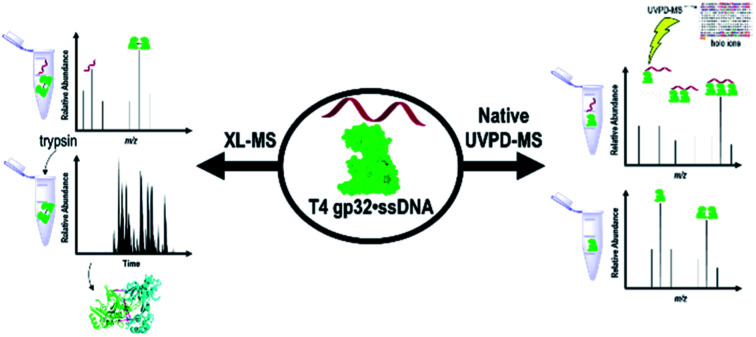
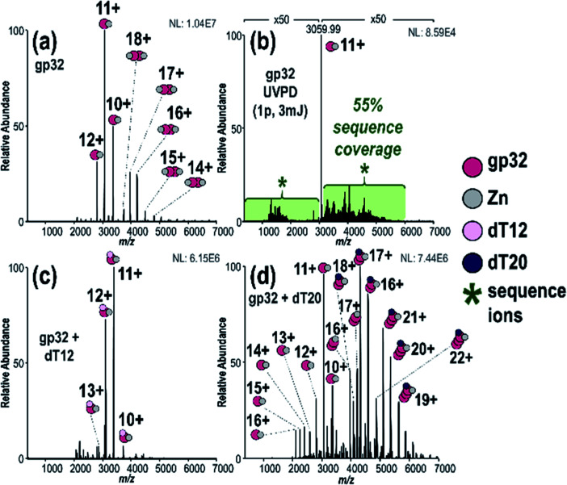
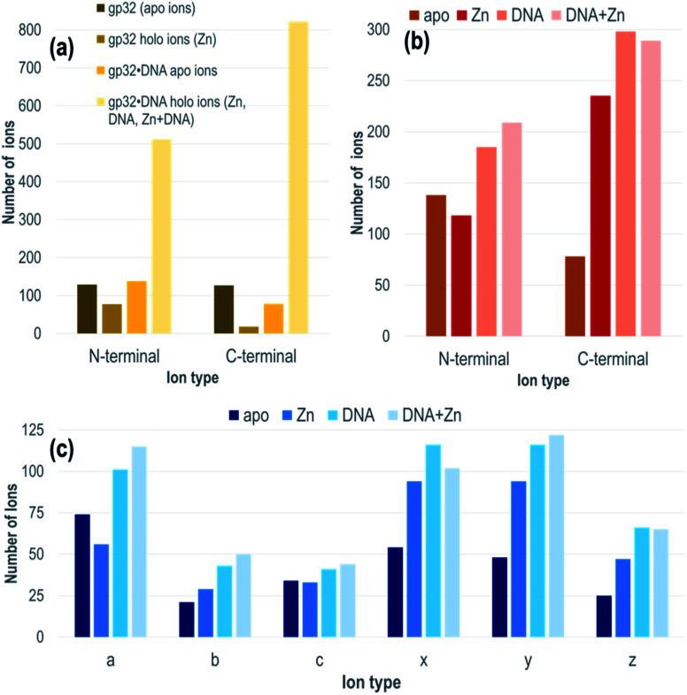
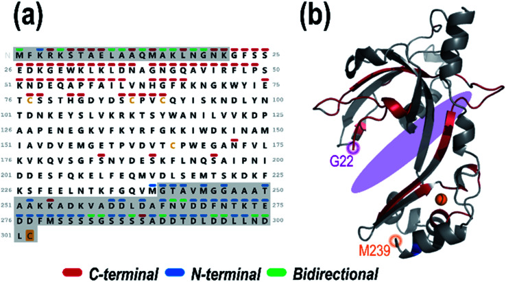
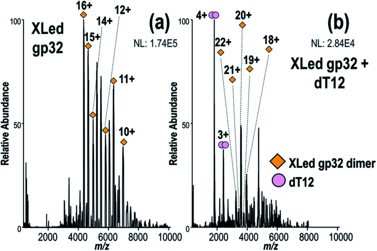
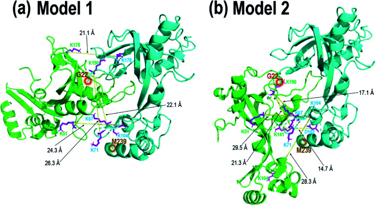

[ Skip to main content ](https://pmc.ncbi.nlm.nih.gov/articles/PMC8549804/#main-content)

##  Abstract
Protein–DNA interactions play crucial roles in DNA replication across all living organisms. Here, we apply a suite of mass spectrometry (MS) tools to characterize a protein-ssDNA complex, T4 gp32·ssDNA, with results that both support previous studies and simultaneously uncover novel insight into this non-covalent biological complex. Native mass spectrometry of the protein reveals the co-occurrence of Zn-bound monomers and homodimers, while addition of differing lengths of ssDNA generates a variety of protein:ssDNA complex stoichiometries (1 : 1, 2 : 1, 3 : 1), indicating sequential association of gp32 monomers with ssDNA. Ultraviolet photodissociation (UVPD) mass spectrometry allows characterization of the binding site of the ssDNA within the protein monomer _via_ analysis of holo ions, _i.e._ ssDNA-containing protein fragments, enabling interrogation of disordered regions of the protein which are inaccessible _via_ traditional crystallographic techniques. Finally, two complementary cross-linking (XL) approaches, bottom-up analysis of the crosslinked complexes as well as MS1 analysis of the intact complexes, are used to showcase the absence of ssDNA binding with the intact cross-linked homodimer and to generate two homodimer gp32 model structures which highlight that the homodimer interface overlaps with the monomer ssDNA-binding site. These models suggest that the homodimer may function in a regulatory capacity by controlling the extent of ssDNA binding of the protein monomer. In sum, this work underscores the utility of a multi-faceted mass spectrometry approach for detailed investigation of non-covalent protein-DNA complexes.
* * *
Ultraviolet photodissociation and native mass spectrometry allow characterization of the formation and binding interactions of protein-ssDNA complexes.
##  Introduction
Protein–DNA interactions are fundamental for transcriptional regulation, DNA repair, and replication.[1,2](https://pmc.ncbi.nlm.nih.gov/articles/PMC8549804/#cit1) The genome is organized in double-stranded DNA (dsDNA); however, genetic information is accessed for transcription or replication as a single-stranded DNA (ssDNA) intermediate. ssDNA is inherently less stable and must be protected to preserve genomic integrity. All organisms, from viruses to humans, have evolved single-stranded DNA binding proteins (SSBs) to protect and stabilize ssDNA intermediates. SSBs bind ssDNA independently of sequence and with high affinity, and are critical for the sequestration and stabilization of ssDNA, which occur in preparation for DNA replication and DNA repair processes.[3–5](https://pmc.ncbi.nlm.nih.gov/articles/PMC8549804/#cit3) The bacteriophage T4 gene protein 32 (also known as T4 gp32) is a prototypical member of this family and is required for viral replication.[3,6](https://pmc.ncbi.nlm.nih.gov/articles/PMC8549804/#cit3)
Gp32 is divided into two subdomains, subdomain I and subdomain II, which are linked through a connecting region.[7](https://pmc.ncbi.nlm.nih.gov/articles/PMC8549804/#cit7) An oligonucleotide/oligosaccharide-binding (OB) fold forms the structural core.[7](https://pmc.ncbi.nlm.nih.gov/articles/PMC8549804/#cit7) An electropositive cleft consisting of aromatic and basic residues within the connecting region facilitates non-specific ssDNA binding.[7–9](https://pmc.ncbi.nlm.nih.gov/articles/PMC8549804/#cit7) Gp32 discriminates between ssDNA and dsDNA based on the hydrophobic interactions that are created between a pocket of aromatic side chains of gp32 within the electropositive cleft and the bases of a ssDNA substrate.[9](https://pmc.ncbi.nlm.nih.gov/articles/PMC8549804/#cit9) An X-ray crystal structure of gp32 revealed a zinc finger consisting of His64, Cys77, Cys87 and Cys90 within the C-terminal tail.[7](https://pmc.ncbi.nlm.nih.gov/articles/PMC8549804/#cit7) This motif maintains the subdomain I structure.[7](https://pmc.ncbi.nlm.nih.gov/articles/PMC8549804/#cit7) To bind to ssDNA, the acidic C-terminal domain of the gp32 protein must undergo a conformational change that exposes the positively-charged region of its core domain, which in turn, interacts with the negatively charged ssDNA backbone.[10,11](https://pmc.ncbi.nlm.nih.gov/articles/PMC8549804/#cit10)
Gp32, and all other SSBs, bind ssDNA transiently.[9](https://pmc.ncbi.nlm.nih.gov/articles/PMC8549804/#cit9) In the apo (unbound) state, gp32 is a mixture of monomers and dimers, owing largely to the inhibitory effect of the C-terminal domain on the binding cleft.[9](https://pmc.ncbi.nlm.nih.gov/articles/PMC8549804/#cit9) Gp32 binds ssDNA in a cooperative manner, in which the binding of one gp32 molecule increases the binding affinity such that additional gp32 monomers bind to the ssDNA substrate in a contiguous process.[9,12](https://pmc.ncbi.nlm.nih.gov/articles/PMC8549804/#cit9) These findings indicate that gp32 binding to ssDNA likely occurs _via_ self-dissociation of gp32 dimers and subsequent monomer-by-monomer binding.[12,13](https://pmc.ncbi.nlm.nih.gov/articles/PMC8549804/#cit12) Subdomain II (N-terminal region) facilitates cooperative binding on ssDNA _via_ electrostatic interactions between the core domains of adjacent gp32 molecules.[9,11](https://pmc.ncbi.nlm.nih.gov/articles/PMC8549804/#cit9)
Here, we re-examine gp32 self-assembly and ssDNA interactions _via_ a suite of advanced mass spectrometry (MS) methods.[14–17](https://pmc.ncbi.nlm.nih.gov/articles/PMC8549804/#cit14) Electrospray ionization (ESI) facilitates the transfer of intact proteins and protein–DNA complexes from the solution into the gas phase for subsequent mass spectrometric interrogation, in many cases preserving both the structure and stoichiometry of the non-covalently bound complexes.[18,19](https://pmc.ncbi.nlm.nih.gov/articles/PMC8549804/#cit18) Many studies have exploited ESI-MS as a means to preserve and facilitate analysis of native interactions, including DNA–small molecule ligand complexes,[20–23](https://pmc.ncbi.nlm.nih.gov/articles/PMC8549804/#cit20) DNA-templated silver clusters,[24–27](https://pmc.ncbi.nlm.nih.gov/articles/PMC8549804/#cit24) DNA duplex and quadruplex complexes,[28–30](https://pmc.ncbi.nlm.nih.gov/articles/PMC8549804/#cit28) and protein–DNA complexes.[31–39](https://pmc.ncbi.nlm.nih.gov/articles/PMC8549804/#cit31) Native ESI-MS studies of DNA complexes have enabled the determination of DNA–ligand stoichiometry,[32,38](https://pmc.ncbi.nlm.nih.gov/articles/PMC8549804/#cit32) ligand selectivity,[21](https://pmc.ncbi.nlm.nih.gov/articles/PMC8549804/#cit21) and DNA-binding pathways.[35](https://pmc.ncbi.nlm.nih.gov/articles/PMC8549804/#cit35) Analyses of native complexes such as these are contingent upon the exceptional performance of high-resolution and high-mass accuracy mass spectrometers.[40](https://pmc.ncbi.nlm.nih.gov/articles/PMC8549804/#cit40) UV-induced cross-linking MS has been developed for interrogation of protein–DNA complexes _via_ bottom-up LC-MS/MS analysis of the DNA–peptide crosslinks after proteolytic digestion.[41](https://pmc.ncbi.nlm.nih.gov/articles/PMC8549804/#cit41) In general, compared to ESI-MS of multiprotein complexes, fewer studies have reported the analysis of protein–DNA complexes.[31–39](https://pmc.ncbi.nlm.nih.gov/articles/PMC8549804/#cit31) Analysis of protein–nucleic acid complexes containing large DNA or RNA strands (>20 nucleotides) in positive-ion mode typically generates spectra that are complicated by the presence of highly heterogeneous ion populations arising from cation adduction.[42](https://pmc.ncbi.nlm.nih.gov/articles/PMC8549804/#cit42) However, the addition of volatile salts (_e.g._ , ammonium acetate) minimizes the prevalence of cation adduction for protein–DNA complexes.[43,44](https://pmc.ncbi.nlm.nih.gov/articles/PMC8549804/#cit43)
While single-stage mass spectrometry (MS1) experiments of native DNA–protein complexes in volatile salt solutions provide basic mass information and binding stoichiometry, MS/MS, often _via_ collisionally activated dissociation (CAD), is typically used to glean more detailed structural information. The use of MS/MS for structural interrogation of oligonucleotide-containing complexes has emerged as useful for a few studies focused on ligand localization and conformational changes.[22,26,28,31,34,45](https://pmc.ncbi.nlm.nih.gov/articles/PMC8549804/#cit22) However, in the case of non-covalent complexes, collisional activation methods, although providing some sequence information, do not afford extensive information related to ligand localization and overall complex structure. To combat these deficits, alternative activation methods that are more suitable for the analysis of non-covalent macromolecular complexes have been developed, including surface-induced dissociation (SID),[46](https://pmc.ncbi.nlm.nih.gov/articles/PMC8549804/#cit46) electron activation methods,[47](https://pmc.ncbi.nlm.nih.gov/articles/PMC8549804/#cit47) and ultraviolet photodissociation (UVPD).[48](https://pmc.ncbi.nlm.nih.gov/articles/PMC8549804/#cit48) The latter uses high-energy UV photons to promote cleavages along multiple positions of the protein backbone, generating a diverse series of fragment ions including _a_ , _a_ + 1, _b_ , _c_ , _x_ , _x_ + 1, _y_ , _y_ − 1, and _z_ ions.[49,50](https://pmc.ncbi.nlm.nih.gov/articles/PMC8549804/#cit49) Through access to these higher-energy fragmentation pathways, UVPD yields both ligand-containing (holo) ions and ligand-free (apo) product ions, thus enabling the determination of ligand-binding sites and revealing conformational re-organization.[51,52](https://pmc.ncbi.nlm.nih.gov/articles/PMC8549804/#cit51)
Complementary to the information generated _via_ UVPD of native protein-ligand complexes is the insight that can be obtained from cross-linking mass spectrometry (XL-MS). XL-MS has been previously utilized to unveil protein–protein interaction networks and to monitor conformational changes of multimeric complexes.[53,54](https://pmc.ncbi.nlm.nih.gov/articles/PMC8549804/#cit53) The covalent linkages created by crosslinking allows mapping of protein–protein binding interfaces,[55](https://pmc.ncbi.nlm.nih.gov/articles/PMC8549804/#cit55) especially when used in conjunction with molecular docking software.[56](https://pmc.ncbi.nlm.nih.gov/articles/PMC8549804/#cit56) Crosslinking of non-covalent protein complexes can be analyzed using traditional bottom-up approaches to gain distance information between neighboring residues, or _via_ analysis of the intact crosslinked complexes to decipher the overall complex stoichiometry of crosslinked subunits.
Herein, we showcase the use of native UVPD-MS data to characterize viral protein–ssDNA complexes comprised of bacteriophage T4 gene product 32 (gp32) and ssDNA substrates (dT12, dT20). Complementary information gathered from native UVPD-MS and XL-MS unravel the unique characteristics of gp32's ssDNA binding mechanism. Using these approaches, we establish with individual amino acid precision how gp32 monomers bind a ssDNA substrate. In addition, we show the non-sequence specific gp32 binding to ssDNA. Integrating insight obtained from bottom-up methods and MS1 analysis of intact crosslinked complexes demonstrates that gp32 does not bind ssDNA as a multimer (_e.g._ dimer or trimer), and rather dissociates into monomers prior to ssDNA binding. Bottom-up XL-MS enables generation of two model dimer structures in which the ssDNA-binding region of each monomer overlaps with the homodimer interface. This work substantiates native MS, UVPD-MS and XL-MS as complementary techniques for probing protein–nucleic acid interactions with unprecedented structural resolution.
##  Experimental
### Materials and reagents
Gp32 (pIF89) and gp32-ΔCTD (amino acids 1–254, pIF898) were cloned with a C-terminal intein–chitin binding domain. pIF89 was transformed into BL21 ArcticExpress _E. coli_ cells (Agilent) and supplemented with 50 μg mL−1 carbenicillin and 20 μg mL−1 gentamycin and grown at 30 °C. Cells were induced with 0.5 mM IPTG and cultured overnight at 12 °C. Resulting pellets were resuspended in resuspension buffer (50 mM Tris–HCl pH 7.5, 500 mM NaCl, 1 mM EDTA, 10% sucrose (w/v), 1 mM PMSF) and sonicated to lyse. Lysate was loaded on 5 mL chitin resin (NEB) equilibrated with buffer A (50 mM Tris pH 7.5, 100 mM NaCl, 1 mM EDTA). Resin was extensively washed with buffer B (50 mM Tris pH 7.5, 1 M NaCl, 1 mM EDTA). Intein cleavage was performed on resin by incubating with buffer B supplemented with 50 mM DTT overnight at 4 °C. Resulting elution was concentrated with a 10 kDa MWCO concentrator (Amicon) and dialyzed in storage buffer (20 mM Tris pH 7.5, 150 mM NaCl, 10% glycerol (v/v)). Protein was flash frozen in liquid nitrogen and stored at −80 °C. Final protein molecular weight is approximately 33.5 or 28.5 kDa based on SDS-PAGE results (Fig. S1[†](https://pmc.ncbi.nlm.nih.gov/articles/PMC8549804/#fn1)). The molecular weight results obtained from SDS-PAGE depend not only on the protein theoretical molecular weight but also on amino acid composition,[57](https://pmc.ncbi.nlm.nih.gov/articles/PMC8549804/#cit57) and are in agreement with gp32 SDS-PAGE results provided by various T4 gp32 protein vendors.
Oligonucleotides were purchased from Integrated DNA Technologies (Coralville, IA, USA). LC solvents including LC-MS-grade water, formic acid, and acetonitrile were acquired from Sigma-Aldrich (St. Louis, MO). Bis(sulfosuccinimidyl)suberate (BS3), DMTMM, MS-grade trypsin, formic acid (99.5+%) and Pierce™ C18 Spin Columns utilized for bottom-up XL-MS sample clean-up were purchased from Thermo-Fisher Scientific (Waltham, MA). LC analytical columns (15 cm, 75 μm inner diameter) containing C18 stationary phase (3 μm diameter) were packed in-house. Micro Bio-Spin™ P-6 Gel Columns (Bio-Rad Laboratories Inc., Hercules, CA) were used for desalting, buffer exchange, and size exclusion chromatography (SEC).
### Sample preparation
For native MS, gp32 and gp32-ΔCTD solutions were diluted to 10 μM in 50 mM ammonium acetate (AmAc), whereas denatured samples were diluted to 10 μM in 50/50 acetonitrile/water with 0.1% formic acid. Similarly, dT12 and dT20 strands were diluted to 10 μM in water and added to the gp32- and gp32-ΔCTD-AmAc solutions for an incubation period of approximately 10 minutes at 25 °C. The resulting gp32 and gp32 + dT solutions were desalted, buffer exchanged, and subjected to SEC using 6 kDa SEC filters. For XL-MS experiments, gp32 was reconstituted to 0.1 mM into a 1× phosphate buffered saline solution at pH 7.2. 10 mM BS3 or 10 mM DMTMM stock was diluted to 5 mM in water and then allowed to react with gp32 at protein/crosslinker molar ratio of 1 : 10 (1 hour incubation at 25 °C) for the samples subjected to proteolytic digestion and bottom-up LCMS/MS analysis, or 1 : 100 (10 minutes incubation at 25 °C) for the MS1 analysis of the intact complexes.[58,59](https://pmc.ncbi.nlm.nih.gov/articles/PMC8549804/#cit58) For the MS1 analysis of the intact complexes, the crosslinking reactions were quenched with 0.5% formic acid after the 10 minute cross-linking reactions to avoid excessive crosslinking. Excess (unreacted) crosslinker and monomer were removed by passing the reaction solution through 30 kDa SEC filters. The cross-linked samples prepared for bottom-up analysis were quenched with AmAc in 50× excess of the cross-linker. In preparation for trypsin digestion, these samples were further diluted with 150 mM ammonium bicarbonate. Trypsin was added at a protein/protease molar ratio of 1 : 40 and incubated for 16 h at 37 °C.[58](https://pmc.ncbi.nlm.nih.gov/articles/PMC8549804/#cit58) Prior to LC separation, samples were cleaned up with C18 spin columns, dried with a SpeedVac, and reconstituted in 2% acetonitrile.
### Direct infusion experiments
Equimolar (∼10 μM each) gp32 or gp32-ΔCTD + ssDNA solutions were loaded into Au/Pd-coated nanospray borosilicate static tips (prepared in-house) for nESI. A heated capillary set to 200 °C was used to desolvate the protein–DNA complexes, aiding their transmission into the gas phase. All direct infusion experiments were conducted on a Thermo Scientific Q Exactive UHMR mass spectrometer customized for the implementation of UVPD as described earlier,[60](https://pmc.ncbi.nlm.nih.gov/articles/PMC8549804/#cit60) except for the MS/MS experiments undertaken on denatured proteins which were performed on a Thermo Orbitrap Elite mass spectrometer, also equipped with a 193 nm excimer laser for UVPD as previously described.[61](https://pmc.ncbi.nlm.nih.gov/articles/PMC8549804/#cit61) The robust sensitivity of the UHMR mass spectrometer to ions of high _m_ /_z_ and its optimized optics for the retention of electrostatic complexes were ideal for analysis of intact complexes and afforded information about the heterogeneity of protein complexes with high molecular weights.[62–64](https://pmc.ncbi.nlm.nih.gov/articles/PMC8549804/#cit62) Modifications made to the higher-energy collisional dissociation (HCD) cell allowed the implementation of UVPD using a 193 nm ArF excimer laser (Excistar, Coherent, Santa Cruz, CA). Modulation of the injection flatapole and interflatapole voltages allowed in-source trapping (IST), enabling front-end collisional activation that improved analysis of native proteins and protein–DNA complexes.[60,65–68](https://pmc.ncbi.nlm.nih.gov/articles/PMC8549804/#cit60) MS1 analysis of intact cross-linked proteins were analyzed on the UHMR instrument. MS1 spectra were collected at _R_ = 1563 and averaged over 25 scans. All HCD and UVPD mass spectra were collected using an isolation width of 5 _m_ /_z_ , a resolution of 200 000 (@_m_ /_z_ 200), a trapping gas value of 1 and IST of −50 V. UVPD was performed with a single pulse at 1–3 mJ per pulse. UVPD conditions were optimized to maximize coverage, and 1 pulse at 3 mJ per pulse was found to provide the highest number of fragment ions (Fig. S2 and S3[†](https://pmc.ncbi.nlm.nih.gov/articles/PMC8549804/#fn1)). All UVPD mass spectra were collected in triplicate for each laser energy condition.
### Bottom-up LC-MS/MS of crosslinked samples
Tryptic digests of cross-linked proteins were separated on a Thermo Scientific Dionex UltiMate 3000 nano-LC system equipped with a house-packed C18 trap (3 cm × 100 μm i. d.) and analytical columns (15 cm, 75 μm i. d.) and analyzed using a Thermo Scientific Orbitrap Fusion Lumos Tribrid mass spectrometer. The resolution was set to 60 000 and 30 000 (@_m_ /_z_ 200) for MS1 and MS2 spectra, respectively. MS/MS data collection was performed at top-speed mode with a 3 s cycle time, 1 × 105 intensity threshold, 50 ms maximum injection time, fixed mode HCD, 25% collision energy, 5 × 104 AGC target, and 2 μscans per scan. Dynamic exclusion was utilized for ions of the same _m_ /_z_ observed 3 times in the MS1 spectra within a rolling 20 s elution window, with an exclusion duration of 20 s and a mass tolerance of 25 ppm. Cross-linked peptides were separated using a gradient of 2% B to 35% B to 90% B over the course of 60 minutes. Mobile phases A and B consisted of 0.1% formic acid in water and 0.1% formic acid in acetonitrile, respectively. A flow rate of 300 nL min−1 was used throughout the 60 minute separation.
### Data analysis
Deconvolution of all high-resolution MS/MS spectra was performed using the Xtract algorithm (Thermo Fisher) at a S/N of 3, while deconvolution of low-resolution MS1 spectra was performed using UniDec.[69](https://pmc.ncbi.nlm.nih.gov/articles/PMC8549804/#cit69) ProSight Lite was used for all sequence coverage analysis using an error tolerance of 10 ppm. Mass shifts of +79.94, +61.91 and +3589.62 Da, +6024.00 Da (with 10 ppm tolerance) and combinations of these mass shifts were used for the C-terminal covalent S2O modification, Zn2+ cofactor (_e.g._ , addition of one Zn atom and loss of two hydrogen atoms), dT12 (Fig. S4a[†](https://pmc.ncbi.nlm.nih.gov/articles/PMC8549804/#fn1)), and dT20 (Fig. S4b[†](https://pmc.ncbi.nlm.nih.gov/articles/PMC8549804/#fn1)), respectively. To determine the backbone cleavage yields generated by UVPD, the abundances of the holo ions and their corresponding apo ion series were collectively summed from triplicate runs acquired using three different UVPD conditions (one laser pulse applied at 1 mJ, 2 mJ or 3 mJ). To allow direct comparison across all spectra, the identified holo/apo ions were normalized to the total ion current of the spectrum, as previously described.[60,70,71](https://pmc.ncbi.nlm.nih.gov/articles/PMC8549804/#cit60) All structural representations of gp32 are based on the X-ray crystal structure produced by Shamoo _et al._ , which contains residues 22–239 of the entire 301 amino acid sequence (PDB 1GPC).[7](https://pmc.ncbi.nlm.nih.gov/articles/PMC8549804/#cit7) Backbone cleavages derived from the identified holo fragment ions were plotted onto the gp32 crystal structure (PDB 1GPC) using UV-POSIT[72](https://pmc.ncbi.nlm.nih.gov/articles/PMC8549804/#cit72) and a series of Python and MATLAB (MathWorks) scripts. For this analysis, backbone cleavages derived from holo ions (containing both Zn2+ and DNA) were included only if seen at least twice within the three sets of UVPD data (obtained from triplicate runs using 1 pulse, 3 mJ per pulse).
Bottom-up XL-MS data were searched against appropriate protein databases using Byonic software (Protein Metrics, San Carlos, CA) with a tolerance of 10 ppm for precursor and fragment ions, a maximum of two missed cleavages, and a 1% FDR cutoff. Strict qualifications were utilized during the K–K and D/E–K crosslink filtering process. In brief, peptides were grouped by unique peptides, filtered with a score cutoff of 300 or higher, and were further substantiated with a Pep2D of 9.9 × 10−5 or lower. The cross-linked peptide hits of the gp32 homodimer were verified using ClusPro 2.0 protein–protein docking software (Boston, MA) in conjunction with PyMOL Molecular Graphics System, Version 2.0 (Schrodinger, LLC). ClusPro-generated gp32 homodimer structures that displayed inter-protein K–K crosslinks of 30 Å or lower and D/E–K crosslinks of 15 Å or lower were selected.
##  Results and discussion
To investigate the stoichiometry, structure and mechanism of this viral protein–ssDNA system, native MS was used to analyze solutions containing gp32 or gp32·ssDNA complexes. These species were characterized using MS/MS, including both HCD and UVPD. Crosslinking experiments were undertaken to explore the gp32 homodimer interface, including: (1) direct infusion of the intact complexes formed _via_ crosslinking of the gp32 homodimer and subsequent incubation with ssDNA, and (2) crosslinking of gp32 followed by a traditional bottom-up workflow with tryptic digestion and LC-MS/MS analysis for identification of cross-linked peptides.
We observed gp32 monomers and homodimer ions _via_ native ESI-MS ([Fig. 1a](https://pmc.ncbi.nlm.nih.gov/articles/PMC8549804/#fig1)), in agreement with a prior FRET study.[10](https://pmc.ncbi.nlm.nih.gov/articles/PMC8549804/#cit10) Each gp32 monomer retained one zinc atom, resulting in 1 : 1 or 2 : 2 gp32·Zn complexes (see Fig. S5[†](https://pmc.ncbi.nlm.nih.gov/articles/PMC8549804/#fn1) for deconvoluted spectrum). Zn(ii) chelation is directly correlated to gp32·ssDNA binding, indicating that gp32 remains folded during MS analysis.[73](https://pmc.ncbi.nlm.nih.gov/articles/PMC8549804/#cit73) MS/MS characterization of the gp32·Zn complex (11+) resulted in 55% sequence coverage by UVPD (1 pulse, 3 mJ) ([Fig. 1b](https://pmc.ncbi.nlm.nih.gov/articles/PMC8549804/#fig1) and S6[†](https://pmc.ncbi.nlm.nih.gov/articles/PMC8549804/#fn1)) and 5% coverage by HCD (Fig. S7[†](https://pmc.ncbi.nlm.nih.gov/articles/PMC8549804/#fn1)) based on production and consideration of both apo sequence ions (no Zn) and holo sequence ions (Zn retained). In agreement with previous studies,[74–76](https://pmc.ncbi.nlm.nih.gov/articles/PMC8549804/#cit74) we observed little change in UVPD sequence coverage based on precursor charge state (Fig. S8a and b[†](https://pmc.ncbi.nlm.nih.gov/articles/PMC8549804/#fn1)). C-terminal modification of gp32 was also identified based on the UVPD mass spectrum and verified _via_ subsequent bottom-up LC-MS/MS analysis (Fig. S9[†](https://pmc.ncbi.nlm.nih.gov/articles/PMC8549804/#fn1)) and additional top-down MS/MS analysis of denatured gp32 (Fig. S10[†](https://pmc.ncbi.nlm.nih.gov/articles/PMC8549804/#fn1)). This C-terminal modification is consistent with incorporation of a disulfur monoxide moiety at Cys302 and is attributed to the intein reaction which occurs during protein purification.
### Fig. 1. (a) MS1 spectrum of gp32 showing both monomer and dimers, (b) 193 nm UVPD spectrum of gp32 monomer (11+) (expanded UVPD spectrum is provided in Fig. S6a[†](https://pmc.ncbi.nlm.nih.gov/articles/PMC8549804/#fn1)), (c) MS1 spectrum of solution containing gp32 + dT12 showing 1 : 1 gp32·dT12 complexes, (d) MS1 spectrum of solution containing gp32 + dT20 showing 2 : 1 and 3 : 1 gp32·dT20 complexes.

We detected a disulfide bond between Cys87 and Cys90 based on the sequence maps derived from the UVPD and HCD mass spectra of denatured gp32 (Fig. S10a–c[†](https://pmc.ncbi.nlm.nih.gov/articles/PMC8549804/#fn1)). Upon addition of the reducing agent TCEP (Fig. S10d[†](https://pmc.ncbi.nlm.nih.gov/articles/PMC8549804/#fn1)), this disulfide bond is disrupted, resulting in the observation of two new backbone cleavages occurring between the two previously linked cysteines (Fig. S10e and f[†](https://pmc.ncbi.nlm.nih.gov/articles/PMC8549804/#fn1)). Additionally, markedly increased sequence coverage was obtained for the disulfide-reduced proteins upon HCD and UVPD (32% and 41% sequence coverage, respectively) (Fig. S10e and f[†](https://pmc.ncbi.nlm.nih.gov/articles/PMC8549804/#fn1)) compared to the non-reduced proteins (HCD 21% sequence coverage, UVPD 33% sequence coverage) (Fig. S10b and c[†](https://pmc.ncbi.nlm.nih.gov/articles/PMC8549804/#fn1)), consistent with previous reports indicating that the presence of disulfide bonds impedes fragmentation of intact proteins.[77](https://pmc.ncbi.nlm.nih.gov/articles/PMC8549804/#cit77) The ion signal originally dispersed among oxidized and reduced proteoforms may be concentrated into the reduced form after addition of the reducing agent, thus increasing the abundance of the precursor ion available for MS/MS analysis. This “concentration” of the precursor into a more homogeneous form likely contributes to the increased sequence coverage observed for the reduced protein compared to the non-reduced protein. These results, along with the notable absence of a disulfide bond in the native protein (Fig. S6b[†](https://pmc.ncbi.nlm.nih.gov/articles/PMC8549804/#fn1)), suggest that the Cys87–90 disulfide bond forms upon denaturation of gp32 and loss of the Zn2+ atom, which is consistent with previous studies which highlight the role of Zn in the coordination of residues Cys87 and Cys90 in the native gp32 protein and stabilization of subdomain I.[73](https://pmc.ncbi.nlm.nih.gov/articles/PMC8549804/#cit73)
We next turned to examination of gp32 in complex with ssDNA oligonucleotides. Addition of ssDNA oligonucleotide, dT12, to the gp32 solution resulted in production of 1 : 1 gp32·dT12 complexes, as observed in several charge states (all containing one Zn as seen in [Fig. 1c](https://pmc.ncbi.nlm.nih.gov/articles/PMC8549804/#fig1) – see Fig. S11a[†](https://pmc.ncbi.nlm.nih.gov/articles/PMC8549804/#fn1) for deconvoluted mass spectrum). Nearly all of the 1 : 1 and 2 : 2 gp32·Zn complexes originally seen in [Fig. 1a](https://pmc.ncbi.nlm.nih.gov/articles/PMC8549804/#fig1) shifted to the ssDNA-bound species. Increasing the oligonucleotide length to dT20 resulted in detection of 2 : 1 and 3 : 1 gp32·dT20 complexes (with two and three Zn, respectively) ([Fig. 1d](https://pmc.ncbi.nlm.nih.gov/articles/PMC8549804/#fig1) and deconvoluted spectrum in Fig. S11b[†](https://pmc.ncbi.nlm.nih.gov/articles/PMC8549804/#fn1)). UVPD mass spectra of the 2 : 1 and 3 : 1 gp32·dT20 complexes are displayed in Fig. S12,[†](https://pmc.ncbi.nlm.nih.gov/articles/PMC8549804/#fn1) both of which show the production of numerous large-size fragment ions, some of which may correspond to portions of two gp32 proteins held together by non-covalent interactions in addition to ones with and without dT20 and Zn. Given the high probability of false positives when searching for ions that include sub-portions of two or more molecules of the same protein, these types of ions were excluded from the searches. Only fragment ions corresponding to sequence ions from apo gp32, gp32 + Zn, gp32 + dT20, or gp32 + Zn + dT20 were considered, as shown in Fig. S12c and f.[†](https://pmc.ncbi.nlm.nih.gov/articles/PMC8549804/#fn1) These results indicate the ability of native MS to monitor the oligomerization of gp32 _via_ binding to ssDNA as the length of the oligonucleotide increases, and are consistent with an approximately 6,7-nucleotide footprint, as reported in previous gp32 studies.[10,78,79](https://pmc.ncbi.nlm.nih.gov/articles/PMC8549804/#cit10) These results likewise establish that native MS can distinguish the stoichiometries of native protein–DNA complexes and reveal the oligomerization of gp32 and its binding to ssDNA as a function of the DNA strand length.
Next, we used UVPD to interrogate the structures of the gp32·ssDNA complexes. UVPD generates both apo (without DNA) and holo (with DNA) fragment ions that enable localization of the gp32·dT12 interactions with individual amino acid precision.[51,52](https://pmc.ncbi.nlm.nih.gov/articles/PMC8549804/#cit51) To minimize mis-assignment of ions, we focused on the holo fragment ions that retained the entire mass of the DNA sequence. Restricting the holo fragment ion searches to only those that retain the entire ssDNA streamlines the searches and fixes the mass shift of the holo fragment ions to a defined value (in this case +3589.62 Da for dT12), much in the same way that searches and localization of specific post-translational modifications are successfully executed in other MS/MS analyses of proteins.[80,81](https://pmc.ncbi.nlm.nih.gov/articles/PMC8549804/#cit80) Prior UVPD studies of other protein–ligand complexes have either not observed fragmentation of the ligand, as the amide backbone of the protein is a significant UV chromophore, or have not undertaken searches for fragment ions containing sub-portions of the ligands owing to the enormous search space and potential for false positives.[52,60,70,71,82,83](https://pmc.ncbi.nlm.nih.gov/articles/PMC8549804/#cit52) In essence, considering only holo fragment ions which contain the entire mass of the ssDNA ligand may exclude the identification of some meaningful ions but importantly avoids increasing the false positive rate for identification of mis-assigned spurious holo fragment ions.
Each gp32·ssDNA complex can generate three types of holo fragment ions: ones containing only Zn (_e.g._ , loss of DNA and retention of Zn), ones containing only DNA (_e.g._ , loss of Zn and retention of DNA), and ones containing both Zn and DNA. Zn-free product ions may arise from backbone cleavages in stretches of the protein remote from the Zn binding site, or may arise from ejection of Zn from Zn-coordinated fragment ions during UVPD. The summed distributions of apo ions and these three types of holo ions were categorized based on whether they contain the N-terminus (all _a_ /_a_ + 1, _b_ , _c_ ions) or C-terminus (all _x_ /_x_ + 1, _y_ /_y_ − 1, _z_ ions) and directly compared to the distribution of apo and holo (Zn) ions produced from the DNA-free gp32 precursor ([Fig. 2a](https://pmc.ncbi.nlm.nih.gov/articles/PMC8549804/#fig2)). While the fragment ion distributions from gp32 (11+) display a nearly equal distribution of apo N- and C-terminal fragment ions, gp32·ssDNA (11+) shows a shift towards preferential production of apo N-terminal ions. With respect to the production of holo fragment ions (_i.e._ , Zn-containing product ions from the gp32 precursor or fragment ions containing Zn, DNA, or DNA + Zn from the gp32·ssDNA complex), the number of holo ions containing the C-terminus is significantly greater than the number of holo ions containing the N-terminus upon UVPD of the gp32·ssDNA complex, whereas gp32 produces more holo fragment ions containing the N-terminus compared to those containing the C-terminus. These results suggest that Zn in gp32 is coordinated closer to the N-terminus, whereas ssDNA is coordinated closer to the C-terminus in the gp32·dT12 complex.
### Fig. 2. Distribution of N-terminal (_a_ ,_b_ ,_c_) and C-terminal (_x_ ,_y_ ,_z_) fragment ions (a) fragment ions without Zn or with Zn from gp32 (_m_ /_z_ 3061, 11+ charge state, containing 1 Zn) or fragment ions containing neither Zn nor DNA or containing Zn, DNA, or Zn + DNA from 1 : 1 gp32·dT12 complex (_m_ /_z_ 3386, 11+ charge state, containing 1 Zn), (b) based on ion type containing neither Zn nor DNA, or containing Zn or DNA or both DNA + Zn from 1 : 1 gp32·dT12 complex (_m_ /_z_ 3386, 11+ charge state, containing 1 Zn), (c) based on specific ion type (_a_ /_a_ + 1, _b_ , _c x_ /_x_ + 1, _y_ /_y_ − 1, _z_) for 1 : 1 gp32·dT12 complex (_m_ /_z_ 3386, 11+ charge state, containing 1 Zn) for fragment ions containing neither Zn nor DNA (apo) or those containing Zn, DNA, or DNA + Zn.

All of the holo ions produced from the 1 : 1 gp32·dT12 complexes were further grouped by holo ion type (_i.e._ , containing DNA, DNA + Zn, or Zn) ([Fig. 2b](https://pmc.ncbi.nlm.nih.gov/articles/PMC8549804/#fig2)) as well as by specific ion type (_a_ /_a_ + 1, _b_ , _c_ , _x_ /_x_ + 1, _y_ /_y_ − 1, _z_) based on the UVPD spectra shown in Fig. S13.[†](https://pmc.ncbi.nlm.nih.gov/articles/PMC8549804/#fn1) In general, the various ions types (_a_ /_a_ + 1, _b_ , _c_ , _x_ /_x_ + 1, _y_ /_y_ − 1, _z_) are observed both with and without retention of Zn, as well as with and without retention of dT12. It is this large array of assignable fragment ions that facilitates localization of dT12 as the gp32·dT12 complexes disassemble and release fragments that retain dT12. These patterns of different holo ions again highlight that dT12 is coordinated closer to the C-terminus, as there are a significantly greater number of C-terminal holo ions than N-terminal holo ions. This contrasts the apo ion data shown in [Fig. 2b](https://pmc.ncbi.nlm.nih.gov/articles/PMC8549804/#fig2) for UVPD of the 1 : 1 gp32·dT12 complexes in which N-terminal apo ions are nearly twice as abundant as C-terminal apo ions. [Fig. 2c](https://pmc.ncbi.nlm.nih.gov/articles/PMC8549804/#fig2) shows an even more detailed breakdown of the various types of fragment ions produced from the gp32·ssDNA complexes – _a_ -type ions are most abundant for the apo fragment ions, whereas _x_ - and _y_ -type ions are most abundant for the various holo ion types. The observed shift towards a higher number of C-terminal ions for the holo fragment ions _vs._ apo fragment ions produced from gp32·ssDNA ([Fig. 2b](https://pmc.ncbi.nlm.nih.gov/articles/PMC8549804/#fig2)) as well as the shifts in distribution of holo and apo fragment ions upon UVPD of gp32 _versus_ gp32·ssDNA ([Fig. 2a](https://pmc.ncbi.nlm.nih.gov/articles/PMC8549804/#fig2)) underscores how the presence of dT12 changes the fragmentation pattern of this protein.
In order to localize the ssDNA ligand binding site, the DNA-containing holo ions (ones containing a portion of the gp32 sequence plus the entire dT12 sequence, with or without retention of Zn) were collectively summed based on the UVPD mass spectra acquired for the 1 : 1 gp32·dT12 complex (11+). This holo ion mapping method with UVPD has been previously used to determine binding sites for protein-small molecule ligand complexes but is here used for the first time to interrogate noncovalent protein–DNA interactions.[52,84](https://pmc.ncbi.nlm.nih.gov/articles/PMC8549804/#cit52) The sequence map that illustrates the backbone cleavage sites that lead to the resulting dT12-containing fragment ions is shown in [Fig. 3a](https://pmc.ncbi.nlm.nih.gov/articles/PMC8549804/#fig3), demarcated based on whether the fragment ions contain the C-terminus (red) or N-terminus (blue), or in some cases complementary N-terminus and C-terminus ions (green). The corresponding sequence coverage map showing all the backbone cleavage sites that generate all the identified DNA-containing holo ions is displayed in Fig. S14.[†](https://pmc.ncbi.nlm.nih.gov/articles/PMC8549804/#fn1) As observed from the map, most of the C-terminal holo ions contain over 200 residues. Most N-terminal holo ions, although few in total, are equally large, containing over 200 amino acids. It is reasonable that these long stretches of the protein would retain the DNA. However, there are also a number of fragment ions whose compositions are consistent with just a few residues of gp32 bound to the entire dT12, such as (_y_ 6·dT12)2+ (a short C-terminal holo ion) and (_a_ 5·dT12)3+ (a short N-terminal holo ion) (see confirmations of these ions _via_ isotopic fits in Fig. S15.[†](https://pmc.ncbi.nlm.nih.gov/articles/PMC8549804/#fn1)).
### Fig. 3. (a) Sequence of gp32 with the backbone cleavage sites leading to N-terminal ((_a_ , _a_ + 1, _b_ , _c_) blue), C-terminal ((_x_ , _x_ + 1, _y_ , _y_ − 1, _z_) red) or bidirectional (green) dT12-containing holo fragment ions generated upon UVPD (combined data from 1 pulse at 3 mJ) of the 1 : 1 gp32·dT12 complex (_m_ /_z_ 3386, 11+ charge state, containing 1 Zn). Greyed out sequence areas correspond to regions of the sequence that are unresolved in the crystal structure but contain many confirmatory backbone cleavages that lead to assignable sequence ions. The C-terminal cysteine is shaded in gold to denote the disulfur monoxide modification. (b) Schematic model of the gp32 crystal structure (PDB ID: 1GPC, residues 22–239) with the residues corresponding to backbone cleavage sites that lead to holo fragment ions shaded in the respective colors (red for backbone cleavages that lead to C-terminal sequence ions, blue for backbone cleavages that lead to N-terminal sequence ions, and green for backbone cleavages that result in both C-terminal and N-terminal ions). The approximate ssDNA binding cleft is shaded in purple.

The backbone cleavage sites from which the C-terminal and N-terminal holo ions originate were plotted onto the gp32 crystal structure (PDB ID: 1GPC)[7](https://pmc.ncbi.nlm.nih.gov/articles/PMC8549804/#cit7) ([Fig. 3b](https://pmc.ncbi.nlm.nih.gov/articles/PMC8549804/#fig3), and sequence motif map in Fig. S16[†](https://pmc.ncbi.nlm.nih.gov/articles/PMC8549804/#fn1)) and color-coded to match the cleavage sites in the companion sequence map. Red, blue and green correspond to the backbone positions marking the C-terminal, N-terminal, and bidirectional DNA-containing holo ions, respectively. An almost continuous series of C-terminal holo ions is observed near the protein N-terminus in addition to a number of N-terminal holo ions at the protein C-terminus, indicating a large breadth of ssDNA contact throughout the entire central structural region of the protein ([Fig. 3](https://pmc.ncbi.nlm.nih.gov/articles/PMC8549804/#fig3)). These results indicate that gp32 binds ssDNA with the majority of residues of subdomain I, the connecting region, and subdomain II.[7](https://pmc.ncbi.nlm.nih.gov/articles/PMC8549804/#cit7) Furthermore, the array of small bidirectional holo ions observed at both the N- and C-terminus of the protein suggests that both the N-terminus and C-terminus of gp32 interact with dT12. Overall, this data sheds new light on the extent and reach of ssDNA binding with gp32, expanding the binding site from the electropositive cleft, and implicates interactions of both the N- and C-terminal tails with dT12, adding new insight to the partially-solved X-ray structure of gp32 (1GPC).[7](https://pmc.ncbi.nlm.nih.gov/articles/PMC8549804/#cit7) These results highlight the ability of MS-based structural methods to interrogate disordered regions of proteins which may be inaccessible _via_ traditional techniques.
Next, we investigated the hypothesis that gp32 homodimers dissociate into monomers prior to binding to ssDNA.[9,12](https://pmc.ncbi.nlm.nih.gov/articles/PMC8549804/#cit9) First gp32 was incubated with Lys–Lys crosslinker BS3, and the resulting MS1 spectrum shown in [Fig. 4a](https://pmc.ncbi.nlm.nih.gov/articles/PMC8549804/#fig4) substantiates that the intact crosslinked products are predominantly dimers with an estimated average of 8 cross-linked and/or dead-end modified lysines per molecule of gp32 (MWexp of intact cross-linked gp32 dimer = 69 755 Da, see deconvoluted spectrum in Fig. S17[†](https://pmc.ncbi.nlm.nih.gov/articles/PMC8549804/#fn1)). The similar mass shifts of each dead-end modification, which add a mass shift of +158 Da, and each crosslink (+138 Da), prevents specific differentiation of the two modifications given the large mass of the dimer and the resolution of the mass spectrometer. The deconvoluted MS1 spectrum (Fig. S17[†](https://pmc.ncbi.nlm.nih.gov/articles/PMC8549804/#fn1)) indicates that the crosslinked dimer contains a maximum of 17 crosslinks (with no dead-ends) or a maximum of 15 dead-ends (no crosslinks), or various combinations of crosslinks and dead-ends between these two extremes. Because of the different possible mass additions related to the crosslinking reactions (_i.e._ , dead-end modification, protein cross-link), it is not possible to determine whether the cross-linked gp32 dimer retains Zn. Given the four crosslinks identified later in [Fig. 5](https://pmc.ncbi.nlm.nih.gov/articles/PMC8549804/#fig5), the cross-linked sample likely contains on average 4 crosslinks and 12 dead-end modifications per dimer. The MS1 spectrum obtained after addition of ssDNA (dT12) to the BS3-crosslinked gp32 solution is displayed in [Fig. 4b](https://pmc.ncbi.nlm.nih.gov/articles/PMC8549804/#fig4). No gp32·dT12 complexes are observed, instead several dT12 dimers and crosslinked gp32 dimers are evident ([Fig. 4b](https://pmc.ncbi.nlm.nih.gov/articles/PMC8549804/#fig4), S18a and b[†](https://pmc.ncbi.nlm.nih.gov/articles/PMC8549804/#fn1)). The inability of the cross-linked gp32 homodimer to form complexes with dT12 suggests that the binding cleft of gp32 is blocked or disrupted upon crosslinking, thus disabling interactions with dT12 in a way that prevents the formation of the gp32·dT12 complexes. Additionally, the charge state distribution of the cross-linked gp32 dimer shifts towards the lower _m_ /_z_ range (higher charge states) upon the addition of dT12 to the solution ([Fig. 4b](https://pmc.ncbi.nlm.nih.gov/articles/PMC8549804/#fig4)). We hypothesize that this shift in the charge state distribution may be due to the relatively high concentration of free dT12 in solution compared to the heterogeneous population of cross-linked gp23 dimers. Cross-linked gp32 dimer was also analyzed in the presence of dT20 (Fig. S19[†](https://pmc.ncbi.nlm.nih.gov/articles/PMC8549804/#fn1)) with similar results, in that no binding was observed between dT20 and the cross-linked gp32 homodimer. In this case, the addition of dT20 did not result in a notable shift in the charge state distribution of the cross-linked gp32 dimer, and free dT20 is not observable in the mass spectrum. The corresponding MS1 spectrum acquired for a denaturing solution containing crosslinked gp32 and dT12 is shown in Fig. S20,[†](https://pmc.ncbi.nlm.nih.gov/articles/PMC8549804/#fn1) showing both denatured gp32 monomer and dimer. The charge state distributions of denatured, cross-linked gp32 dimers in Fig. S20a[†](https://pmc.ncbi.nlm.nih.gov/articles/PMC8549804/#fn1) (∼14+ to 20+) is somewhat broadened relative to the charge state distribution of the native-like non-cross-linked gp32 dimers ([Fig. 1a](https://pmc.ncbi.nlm.nih.gov/articles/PMC8549804/#fig1), ∼14+ to 18+), and the charge state distribution of denatured cross-linked gp32 monomers (∼11+ to 14+ in Fig. S20a[†](https://pmc.ncbi.nlm.nih.gov/articles/PMC8549804/#fn1)) are extremely shifted relative to the charge states of denatured gp32 monomers (Fig. S21,[†](https://pmc.ncbi.nlm.nih.gov/articles/PMC8549804/#fn1) ∼18+ to 31+). The intramolecularly crosslinked gp32 monomers may better maintain a more compact structure, preventing unfolding and charging, in addition to the conversion of the basic lysine side-chains to various less basic hydrolyzed deadend groups.
### Fig. 4. Native MS1 spectra of (a) the solution containing gp32 after BS3 cross-linking and (b) the solution containing gp32 after BS3 cross-linking followed by addition of dT12, showing the absence of gp32·dT12 complexes. Clean-up of the solutions using 30 kDa SEC filters after crosslinking removed most of the monomeric gp32 and unreacted crosslinker.

### Fig. 5. gp32 homodimer models from bottom-up crosslinking data and protein–protein docking results with BS3 (K–K) and DMTMM (D/E–K) crosslinks delineated as magenta residues with yellow lines, with (a) four BS3 crosslinks and (b) four BS3 crosslinks and one DMTMM crosslink. Comparison of these two homodimer models with the gp32-ssDNA structure shown in [Fig. 3b](https://pmc.ncbi.nlm.nih.gov/articles/PMC8549804/#fig3) shows clear overlap of the two homodimer interfaces with the monomeric gp32 ssDNA binding cleft.

In order to localize the crosslinks in the gp32 dimer, a bottom-up LC-MS/MS strategy was used. Gp32 was incubated with either Lys–Lys crosslinker BS3 or Asp/Glu–Lys crosslinker DMTMM. The resulting solutions containing crosslinked gp32 were then subjected to tryptic digestion and MS/MS analysis to map the locations of the crosslinks. The base peak LC-MS chromatograms and the MS/MS spectra of the crosslinked peptides are shown in Fig. S22 and S23.[†](https://pmc.ncbi.nlm.nih.gov/articles/PMC8549804/#fn1) Four BS3-crosslinked peptides were identified, with crosslinks occurring between Lys residues 51 and 104, 104 and 104, 178 and 178, 190 and 67, and 190 and 71, while one DMTMM-crosslinked peptide was identified with the linkage between D102 and K141 (Fig. S23a[†](https://pmc.ncbi.nlm.nih.gov/articles/PMC8549804/#fn1)). The crosslinked peptides were fit to potential gp32 dimer structures generated by protein–protein docking. [Fig. 5](https://pmc.ncbi.nlm.nih.gov/articles/PMC8549804/#fig5) shows the two optimized gp32 homodimer structures based on validation of the five cross-linked peptide assignments. Model 1 incorporates 4 out of the 5 identified BS3 crosslinks, whereas Model 2 incorporates 4 out of the 5 identified BS3 crosslinks plus the DMTMM crosslink (D102-K141). All potential intramolecular crosslinked peptide hits were discarded based on comparing Lys–Lys and Asp/Glu–Lys distances in the model monomer _vs._ dimer structures with BS3 or DMTMM crosslinking distance constraints. Comparison of the two homodimer models in [Fig. 5](https://pmc.ncbi.nlm.nih.gov/articles/PMC8549804/#fig5) to the gp32 crystal structure in [Fig. 3b](https://pmc.ncbi.nlm.nih.gov/articles/PMC8549804/#fig3) reveals overlap of the homodimer interfaces in each of the two models with the gp32 binding cleft, suggesting that a large portion of the gp32 ssDNA-binding cleft is involved in the gp32 homodimer interface. This result implies that the ssDNA binding cleft is not accessible for ssDNA binding when gp32 is homodimeric. Our MS data supports a dimerization model that gp32 dimers are unable to bind ssDNA and that dimer dissociation is required prior to binding. We additionally purified a gp32 construct with a C-terminal tail deletion (gp32-ΔCTD, amino acids 1–254) to test whether the C-terminal acidic tail impacts dimerization, which is unresolved in the gp32 crystal structure. We still observed dimerization in the gp32-ΔCTD constructs _via_ native MS1 (Fig. S24a[†](https://pmc.ncbi.nlm.nih.gov/articles/PMC8549804/#fn1)), but did not observe evidence of ssDNA binding (Fig. S24b[†](https://pmc.ncbi.nlm.nih.gov/articles/PMC8549804/#fn1)). Our data suggests that the acidic tail is dispensable for dimer formation, similar to the T7 phage gp2.5,[85](https://pmc.ncbi.nlm.nih.gov/articles/PMC8549804/#cit85) but is essential for ssDNA binding. We favor a model where the gp32 acidic tail mediates multiple protein–protein interactions, including with T4 gp59.[86](https://pmc.ncbi.nlm.nih.gov/articles/PMC8549804/#cit86)
##  Conclusions
In summary, combining native MS, UVPD-MS and XL-MS expanded our molecular understanding of how T4 gp32 binds ssDNA and how this binding is inhibited for the crosslinked homodimeric gp32 complex. Native UVPD-MS combined with XL-MS provides direct evidence that the gp32 dimer dissociates into monomers prior to binding to ssDNA. The presence of 3 : 1 gp32·dT20 complexes observed in [Fig. 1d](https://pmc.ncbi.nlm.nih.gov/articles/PMC8549804/#fig1) also indicates a sequential association of gp32 monomers with ssDNA owing to the odd number of gp32 molecules that are bound to the ssDNA. Additionally, we characterized the ssDNA binding cleft size and developed a model structure for the ssDNA-inactive gp32 dimer. We conjecture that gp32 dimers act as an inactive storage compartment and may also regulate the extent of ssDNA binding. Cellular processes that sequester gp32 into dimers also prevent ssDNA binding by this protein. Based on the successful characterization of the well-studied T4 gp32–ssDNA complexes, we anticipate that this multi-pronged MS approach will provide further in-depth characterization of other novel protein–DNA systems which may have unsolved structures and unknown binding modes.
##  Data availability
Extensive data is provided as ESI.[†](https://pmc.ncbi.nlm.nih.gov/articles/PMC8549804/#fn1)
##  Author contributions
MSB, IJF, and JSB contributed to conceptualization of this project. JMS and IJF provided T4 gp32 protein constructs (resources), while JSB provided all other resources. JMS performed SDS-PAGE experiments (data curation), while MSB and JNW performed all mass spectrometry experiments (data curation), formal analysis, investigation and methodology. JSB coordinated project administration. JSB and IJF are responsible for funding acquisition for this project. MSB and JSB prepared figures (visualization) and the manuscript (writing – original draft). All authors contributed to the final manuscript (writing – review & editing).
##  Conflicts of interest
There are no conflicts of interest to declare.

##  Acknowledgments
The authors thank M. Rachel Mehaffey and Michael B. Cammarata for their guidance with native MS and XL-MS experiments and data analysis. Funding sources: Welch Foundation (F-1155 to JSB and F-1808 to IJF), NSF-CAREER 1453358 (IJF) and NIH R35GM139658 (JSB).
†
Electronic supplementary information (ESI) available. See DOI: [10.1039/d1sc02861h](https://doi.org/10.1039/d1sc02861h)
