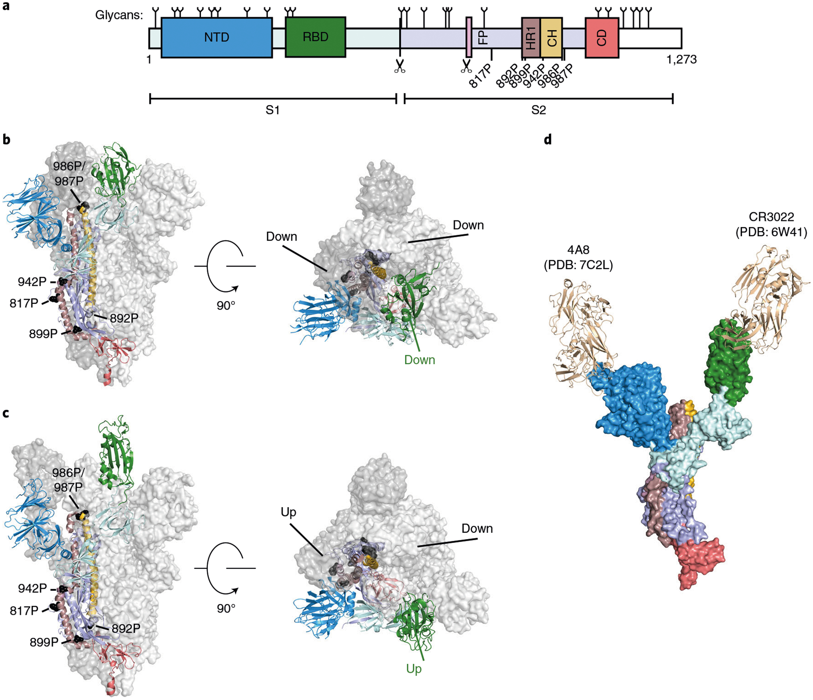
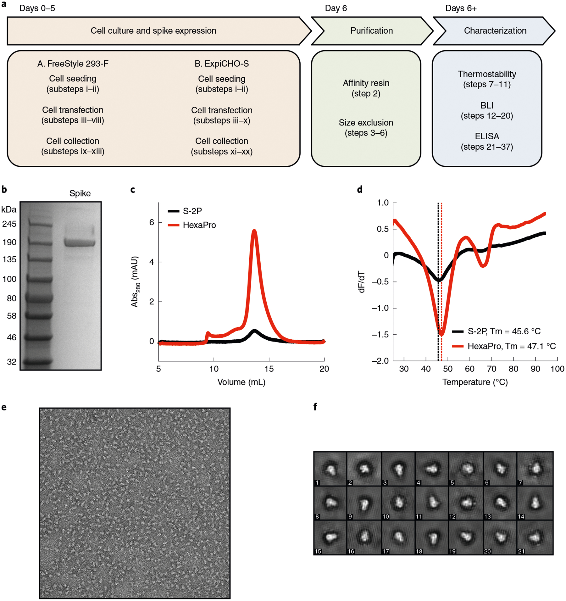
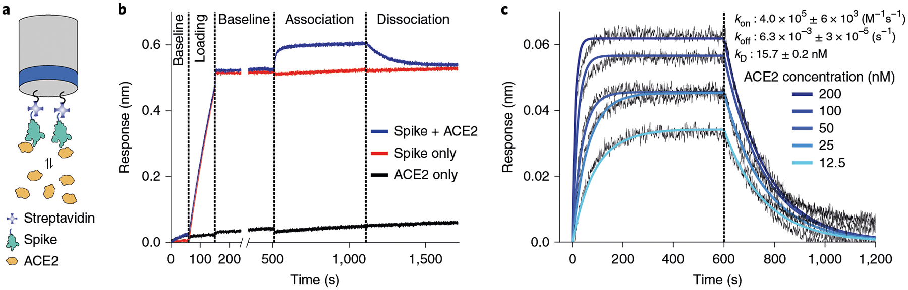
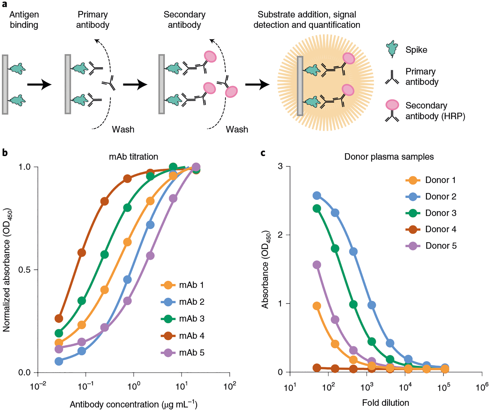

# Expression and characterization of SARS-CoV-2 spike proteins

**Jeffrey M. Schaub\*, Chia-Wei Chou\*, Hung-Che Kuo\*, Kamyab Javanmardi\*, Ching-Lin Hsieh, Jory Goldsmith, Andrea M. DiVenere, Kevin C. Le, Daniel Wrapp, Patrick O. Byrne, Christy K. Hjorth, Nicole V. Johnson, John Ludes-Meyers, Annalee W. Nguyen, Nianshuang Wang, Jason J. Lavinder, Gregory C. Ippolito, Jennifer A. Maynard, Jason S. McLellan, and Ilya J. Finkelstein** (\* co-first authors)

*Nature Protocols*, Volume 16, Issue 11, Pages 5339–5356 (2021)

**DOI:** [10.1038/s41596-021-00623-4](https://doi.org/10.1038/s41596-021-00623-4)

---

## Table of Contents

- [Abstract](#abstract)
- [Introduction](#introduction)
- [Materials](#materials)
- [Procedure](#procedure)
- [Anticipated Results](#anticipated-results)
- [Acknowledgements](#acknowledgements)

---
##  Abstract
The severe acute respiratory syndrome coronavirus 2 spike protein is a critical component of coronavirus disease 2019 vaccines and diagnostics and is also a therapeutic target. However, the spike protein is difficult to produce recombinantly because it is a large trimeric class I fusion membrane protein that is metastable and heavily glycosylated. We recently developed a prefusion-stabilized spike variant, termed HexaPro for six stabilizing proline substitutions, that can be expressed with a yield of >30 mg/L in ExpiCHO cells. This protocol describes an optimized workflow for expressing and biophysically characterizing rationally engineered spike proteins in Freestyle 293 and ExpiCHO cell lines. Although we focus on HexaPro, this protocol has been used to purify over a hundred different spike variants in our laboratories. We also provide guidance on expression quality control, long-term storage, and uses in enzyme-linked immunosorbent assays. The entire protocol, from transfection to biophysical characterization, can be completed in 7 d by researchers with basic tissue cell culture and protein purification expertise.
---
##  Introduction
The coronavirus disease 2019 (COVID-19) pandemic is a global health emergency that has resulted in over four million deaths as of summer 2021. The causative agent of COVID-19 is severe acute respiratory syndrome coronavirus 2 (SARS-CoV-2), a coronavirus-family RNA virus. SARS-CoV-2 encodes at least 12 canonical open reading frames in its ~29.9 kilobase RNA genome[1](https://pmc.ncbi.nlm.nih.gov/articles/PMC9665560/#R1),[2](https://pmc.ncbi.nlm.nih.gov/articles/PMC9665560/#R2). Viral RNA is initially translated into two polyproteins with subsequent expression of multiple subgenomic mRNAs that are further processed into smaller proteins by virally encoded proteases[3](https://pmc.ncbi.nlm.nih.gov/articles/PMC9665560/#R3). Mature virions include spike (S), the nucleocapsid protein (N), an ion channel (E) and an integral membrane protein (M). Spike is the most immunogenic of these proteins in other coronaviruses and is thus a major focus for vaccine, therapeutic and diagnostic development[4](https://pmc.ncbi.nlm.nih.gov/articles/PMC9665560/#R4)–[6](https://pmc.ncbi.nlm.nih.gov/articles/PMC9665560/#R6).
Spike is a transmembrane homotrimeric class I fusion protein. Each virion is decorated with an average of 25–50 spike trimers[7](https://pmc.ncbi.nlm.nih.gov/articles/PMC9665560/#R7)–[10](https://pmc.ncbi.nlm.nih.gov/articles/PMC9665560/#R10) per virion, although other coronaviruses possess ~90 trimers[11](https://pmc.ncbi.nlm.nih.gov/articles/PMC9665560/#R11). Spike mediates host cell entry by binding the cell angiotensin-converting enzyme 2 (ACE2) receptor and by subsequent virion–host membrane fusion. ACE2 is recognized by the spike receptor-binding domain (RBD) in the up conformation, located within the S1 subunit of the spike protein. Membrane fusion is enhanced by spike cleavage at the furin site separating the S1 and S2 domains and further increasing RBD-open states[12](https://pmc.ncbi.nlm.nih.gov/articles/PMC9665560/#R12)–[14](https://pmc.ncbi.nlm.nih.gov/articles/PMC9665560/#R14). Furthermore, cleavage at the furin site increases SARS-CoV-2 infectivity[12](https://pmc.ncbi.nlm.nih.gov/articles/PMC9665560/#R12),[15](https://pmc.ncbi.nlm.nih.gov/articles/PMC9665560/#R15),[16](https://pmc.ncbi.nlm.nih.gov/articles/PMC9665560/#R16). A second cleavage within the S2 subdomain may further enhance infectivity via exposure of the fusion peptide (FP) necessary for viral entry, similar to SARS-CoV-1[17](https://pmc.ncbi.nlm.nih.gov/articles/PMC9665560/#R17),[18](https://pmc.ncbi.nlm.nih.gov/articles/PMC9665560/#R18).
Spike is the first structural SARS-CoV-2 protein to be deposited in the protein data bank[19](https://pmc.ncbi.nlm.nih.gov/articles/PMC9665560/#R19). Early structures provided a glimpse of the prefusion complex in two conformations. In one view, the three RBDs were all pointing down (closed state, [Fig. 1b](#fig1)); and in another view, one RBD was pointing up (partially open state)[20](https://pmc.ncbi.nlm.nih.gov/articles/PMC9665560/#R20). Subsequent structures mapped out the dynamic nature of the three RBD domains ([Fig. 1c](#fig1))[7](https://pmc.ncbi.nlm.nih.gov/articles/PMC9665560/#R7),[21](https://pmc.ncbi.nlm.nih.gov/articles/PMC9665560/#R21). Structures of the isolated RBD alone and trimeric spike in complex with ACE2 were solved shortly thereafter[16](https://pmc.ncbi.nlm.nih.gov/articles/PMC9665560/#R16),[22](https://pmc.ncbi.nlm.nih.gov/articles/PMC9665560/#R22)–[25](https://pmc.ncbi.nlm.nih.gov/articles/PMC9665560/#R25). These structures revealed that ACE2 interacts with the receptor-binding motif, approximately composed of residues 438–508 within the RBD[26](https://pmc.ncbi.nlm.nih.gov/articles/PMC9665560/#R26). SARS-CoV-2 receptor-binding motif has a more pronounced receptor-interacting ridge and stabilizing residues that increase the affinity for ACE2 compared with SARS-CoV-1[27](https://pmc.ncbi.nlm.nih.gov/articles/PMC9665560/#R27). The pace of spike structures deposited in the protein data bank continues to accelerate, with multiple high-resolution structures of spike-binding antibodies and a structure of the post-fusion conformation[18](https://pmc.ncbi.nlm.nih.gov/articles/PMC9665560/#R18). We direct the reader to several reviews summarizing these structural findings[28](https://pmc.ncbi.nlm.nih.gov/articles/PMC9665560/#R28)–[31](https://pmc.ncbi.nlm.nih.gov/articles/PMC9665560/#R31).
***[Figure 1](#fig1).*** Overview of SARS-CoV-2 spike structure and antigenicity. **a** , Schematic of the SARS-CoV-2 spike domains subdivided by color. NTD, N-terminal domain; RBD, receptor-binding domain; FP, fusion peptide; HR1, heptad repeat 1; CH, central helix; CD, connector domain. White region is unresolved in cryo-EM structures of the ectodomain. Glycan positions noted on top of the primary structure as previously reported[63](https://pmc.ncbi.nlm.nih.gov/articles/PMC9665560/#R63). Scissors denote the S1/S2 and S2′ proteolytic cleavage sites. Location of stabilizing HexaPro prolines is denoted. **b** ,**c** , Spike structures in the three RBD down (PDB:6VXX) (**b**) and two RBD up prefusion states (PDB:6X2B) (**c**). Left: front view, Right: top view. HexaPro prolines shown in black. **d** , Composite structure of a spike monomer bound to neutralizing antibodies CR3022 (PDB: 6W41) and 4A8 (PDB:7C2L).

### Development of the protocol
Prefusion spike is the major target for vaccine and therapeutic antibody development. However, prefusion-stabilized spike is difficult to produce recombinantly because it is a large (~141 kDa per monomer), metastable and heavily glycosylated transmembrane protein. Nearly all structural studies of spike have thus focused on the soluble ectodomain ([Fig. 1a](#fig1))[20](https://pmc.ncbi.nlm.nih.gov/articles/PMC9665560/#R20),[28](https://pmc.ncbi.nlm.nih.gov/articles/PMC9665560/#R28),[29](https://pmc.ncbi.nlm.nih.gov/articles/PMC9665560/#R29),[32](https://pmc.ncbi.nlm.nih.gov/articles/PMC9665560/#R32)–[35](https://pmc.ncbi.nlm.nih.gov/articles/PMC9665560/#R35). The first prefusion-stabilized SARS-CoV-2 spike was informed by our structure-based engineering of the Middle East respiratory syndrome (MERS) coronavirus S protein[32](https://pmc.ncbi.nlm.nih.gov/articles/PMC9665560/#R32). We showed that inserting two prolines in a loop between the first heptad repeat (HR1) and the central helix increased the homogeneity and recombinant expression yields of prefusion MERS-CoV S ectodomains[32](https://pmc.ncbi.nlm.nih.gov/articles/PMC9665560/#R32). We and others followed a similar strategy to insert two prolines into the SARS-CoV-2 ectodomain, termed S-2P ([Table 1](#table1))[19](https://pmc.ncbi.nlm.nih.gov/articles/PMC9665560/#R19),[20](https://pmc.ncbi.nlm.nih.gov/articles/PMC9665560/#R20). However, S-2P yield continued to be relatively poor[19](https://pmc.ncbi.nlm.nih.gov/articles/PMC9665560/#R19). Thus, we developed a second-generation prefusion-stabilized SARS-CoV-2 ectodomain by introducing four additional prolines, termed HexaPro (Addgene, 154754), that further stabilized the trimeric spike structure in the prefusion conformation and increased recombinant protein yield by an additional tenfold above spike-2P[36](https://pmc.ncbi.nlm.nih.gov/articles/PMC9665560/#R36). Despite the increased stability of HexaPro, the RBDs continue to sample multiple positions[36](https://pmc.ncbi.nlm.nih.gov/articles/PMC9665560/#R36),[37](https://pmc.ncbi.nlm.nih.gov/articles/PMC9665560/#R37).
#### Table 1 |.
Prefusion-stabilized spike trimer variants and characteristics
Variant | Stabilizing mutations | Rationale | Yield | Cell line | Ref  
---|---|---|---|---|---  
S-2P | K986P, V987P, furin[a](https://pmc.ncbi.nlm.nih.gov/articles/PMC9665560/#TFN1) | Proline | 0.5 mg/L | FreeStyle 293-F | Wrapp et al.[19](https://pmc.ncbi.nlm.nih.gov/articles/PMC9665560/#R19)  
HexaPro | K986P, V987P, F817P, A892P, A899P, A942P, furin[a](https://pmc.ncbi.nlm.nih.gov/articles/PMC9665560/#TFN1) | Proline | 10.5 mg/L (FreeStyle 293-F) 32.5 mg/L (ExpiCHO) | FreeStyle 293-F ExpiCHO | Hsieh et al.[36](https://pmc.ncbi.nlm.nih.gov/articles/PMC9665560/#R36)  
rS2d | K986P, V987P, S383C, D985C, furin[a](https://pmc.ncbi.nlm.nih.gov/articles/PMC9665560/#TFN1) | Disulfide | Not reported | FreeStyle 293-F | Henderson et al.[21](https://pmc.ncbi.nlm.nih.gov/articles/PMC9665560/#R21)  
u1S2q | A570L T572I F855Y N856I (u1S2q) K986P, V987P, A570L, T572I, F855Y, N856I, furin[a](https://pmc.ncbi.nlm.nih.gov/articles/PMC9665560/#TFN1) | Cavity filling | Not reported | FreeStyle 293-F | Henderson et al.[21](https://pmc.ncbi.nlm.nih.gov/articles/PMC9665560/#R21)  
S-R/PP/x1 | K986P, V987P, S383C, D985C, furin[b](https://pmc.ncbi.nlm.nih.gov/articles/PMC9665560/#TFN2) | Disulfide | ~0.4 mg/L | Expi293F | Xiong et al.[57](https://pmc.ncbi.nlm.nih.gov/articles/PMC9665560/#R57)  
S-R/x2 | K986P, G413C, V987C, furin[b](https://pmc.ncbi.nlm.nih.gov/articles/PMC9665560/#TFN2) | Disulfide | ~0.4 mg/L | Expi293F | Xiong et al.[57](https://pmc.ncbi.nlm.nih.gov/articles/PMC9665560/#R57)  
S-closed +Fd | K986P, V987P, D614N, A892P, A942P, V987P, furin[a](https://pmc.ncbi.nlm.nih.gov/articles/PMC9665560/#TFN1) | Cavity filling/proline | Sixfold increased relative to S-2P | Expi293F | Juraszek et al.[53](https://pmc.ncbi.nlm.nih.gov/articles/PMC9665560/#R53)  
2P DS S | K986P, V987P, S383C/D985C, furin[c](https://pmc.ncbi.nlm.nih.gov/articles/PMC9665560/#TFN3) | Disulfide | Tenfold reduced relative to S-2P | FreeStyle 293-F | McCallum et al.[56](https://pmc.ncbi.nlm.nih.gov/articles/PMC9665560/#R56)  
N234A | K986P, V987P, N234A | Glycan deletion | 2.0 mg/L | FreeStyle 293-F | Henderson et al.[58](https://pmc.ncbi.nlm.nih.gov/articles/PMC9665560/#R58)  
VFLIP | F817P, A892P, A899P, A942P, K986P, Y707C, T883C, K986, furin[d](https://pmc.ncbi.nlm.nih.gov/articles/PMC9665560/#TFN4) | Proline, disulfide, linker | 7.1 mg/L (HEK293F) 157 mg/L (ExpiCHO) | HEK293F ExpiCHO | Olmedillas et al.[73](https://pmc.ncbi.nlm.nih.gov/articles/PMC9665560/#R73)  
[Open in a new tab](https://pmc.ncbi.nlm.nih.gov/articles/PMC9665560/table/T1/)
a
S1/S2 furin cleavage site (682RRAR685) mutated to 682GSAS685
b
S1/S2 furin cleavage site mutated to 681PRRAR685.
c
S1/S2 furin cleavage site mutated to 682SGAG685.
d
S1/S2 furin cleavage site mutated to 675GGSGGGS691.
Here, we describe the expression, purification and biophysical characterization of HexaPro, a second-generation prefusion-stabilized SARS-CoV-2 spike glycoprotein from mammalian cells[36](https://pmc.ncbi.nlm.nih.gov/articles/PMC9665560/#R36). In addition to developing HexaPro, we have used this protocol to rapidly screen circulating spike mutants, to develop new spike antigens, and for structure–function studies of spike conformations[37](https://pmc.ncbi.nlm.nih.gov/articles/PMC9665560/#R37)–[40](https://pmc.ncbi.nlm.nih.gov/articles/PMC9665560/#R40). We also describe three widely available assays to characterize recombinant spikes: (1) spike thermostability; (2) affinity for ACE2; and (3) binding by patient sera or monoclonal antibodies. Although beyond the scope of this paper, we also recommend visualizing recombinant spikes via negative-stain electron microscopy to check for monodispersity and the overall distribution of conformations. We anticipate that this protocol will be useful for research groups that need to express and purify spike variants and broadly applicable to studies of other trimeric viral fusion proteins.
### Applications of the method
Structure–function studies of recombinant SARS-CoV-2 spike protein alone and in complex with ACE2 are critical for understanding how the virus infects human cells[2](https://pmc.ncbi.nlm.nih.gov/articles/PMC9665560/#R2),[3](https://pmc.ncbi.nlm.nih.gov/articles/PMC9665560/#R3). Prefusion spike is in a metastable state that undergoes conformational ‘breathing’ of the RBDs[19](https://pmc.ncbi.nlm.nih.gov/articles/PMC9665560/#R19),[37](https://pmc.ncbi.nlm.nih.gov/articles/PMC9665560/#R37). This allows the three RBDs to adopt an open conformation that can interact with the ACE2 cell surface receptors to trigger the post-fusion conformation and viral entry. Binding affinity studies with recombinant SARS-CoV-2 spike showed a higher affinity than SARS-CoV-1 for human ACE2[19](https://pmc.ncbi.nlm.nih.gov/articles/PMC9665560/#R19),[34](https://pmc.ncbi.nlm.nih.gov/articles/PMC9665560/#R34). This interaction is unaffected by the glycan shield near the RBD[41](https://pmc.ncbi.nlm.nih.gov/articles/PMC9665560/#R41).
Recombinant SARS-CoV-2 spike is essential for probing the immune response of convalescent patients and developing monoclonal antibody (mAb) therapeutics. For example, enzyme-linked immunosorbent assays (ELISAs) can detect seroconverted individuals[42](https://pmc.ncbi.nlm.nih.gov/articles/PMC9665560/#R42). While the soluble RBD can be used for some assays[43](https://pmc.ncbi.nlm.nih.gov/articles/PMC9665560/#R43),[44](https://pmc.ncbi.nlm.nih.gov/articles/PMC9665560/#R44), full-length spike is essential for characterizing antibodies that bind outside the RBD, including the N-terminal domain (NTD[45](https://pmc.ncbi.nlm.nih.gov/articles/PMC9665560/#R45),[46](https://pmc.ncbi.nlm.nih.gov/articles/PMC9665560/#R46)) and the S2 stalk[47](https://pmc.ncbi.nlm.nih.gov/articles/PMC9665560/#R47),[48](https://pmc.ncbi.nlm.nih.gov/articles/PMC9665560/#R48). Targeting these regions of the protein is especially important because they provide alternative neutralizing epitopes for antibody therapeutics[40](https://pmc.ncbi.nlm.nih.gov/articles/PMC9665560/#R40),[49](https://pmc.ncbi.nlm.nih.gov/articles/PMC9665560/#R49),[50](https://pmc.ncbi.nlm.nih.gov/articles/PMC9665560/#R50). In addition, serological assays with recombinant spike can measure patient immune response and neutralizing convalescent plasma.
Prefusion spike is a critical antigenic target for eliciting neutralizing antibodies in leading SARS-CoV-2 vaccine candidates[51](https://pmc.ncbi.nlm.nih.gov/articles/PMC9665560/#R51),[52](https://pmc.ncbi.nlm.nih.gov/articles/PMC9665560/#R52). Recombinant production of wild-type MERS and SARS-CoV-1 spikes included a heterogeneous mixture of both pre- and post-fusion conformations[32](https://pmc.ncbi.nlm.nih.gov/articles/PMC9665560/#R32). Class I fusion proteins are inherently unstable, and the SARS-CoV-2 spike dissociates into the S1 and S2 subdomains. Immunization with constructs that adopt post-fusion conformations reduces specific S1 neutralizing or ACE2 blocking antibodies[53](https://pmc.ncbi.nlm.nih.gov/articles/PMC9665560/#R53). Therefore, leading SARS-CoV-2 subunit vaccines, including those from Pfizer, Moderna and NovaVax, are using prefusion-stabilized spikes[51](https://pmc.ncbi.nlm.nih.gov/articles/PMC9665560/#R51),[52](https://pmc.ncbi.nlm.nih.gov/articles/PMC9665560/#R52),[54](https://pmc.ncbi.nlm.nih.gov/articles/PMC9665560/#R54),[55](https://pmc.ncbi.nlm.nih.gov/articles/PMC9665560/#R55). These stabilized constructs display the spike proteins in a trimeric, prefusion conformation with the same glycosylated residues as in the wild-type virus (but possibly different glycan linkages)[20](https://pmc.ncbi.nlm.nih.gov/articles/PMC9665560/#R20),[55](https://pmc.ncbi.nlm.nih.gov/articles/PMC9665560/#R55). Additionally, the stabilized constructs may increase the functional protein yield and further increase vaccine response. Thus, multiple vaccine candidates use stabilized, full-length spike glycoprotein to elicit an immune response.
### Comparison with other methods
Although HexaPro is highly stable with increased yield, the following complementary approaches have been reported to stabilize prefusion coronavirus spike proteins: (1) stabilizing the hinge loop undergoing conformational change to extended helix[32](https://pmc.ncbi.nlm.nih.gov/articles/PMC9665560/#R32); (2) adding disulfide bonds to prevent conformational changes during the pre- to post-fusion states[21](https://pmc.ncbi.nlm.nih.gov/articles/PMC9665560/#R21); (3) introducing salt bridges to neutralize charge imbalances[36](https://pmc.ncbi.nlm.nih.gov/articles/PMC9665560/#R36); (4) point-mutating to hydrophobic residues to fill internal cavities[21](https://pmc.ncbi.nlm.nih.gov/articles/PMC9665560/#R21),[53](https://pmc.ncbi.nlm.nih.gov/articles/PMC9665560/#R53); and (5) changing the surface glycosylation pattern[21](https://pmc.ncbi.nlm.nih.gov/articles/PMC9665560/#R21). [Table 1](#table1) summarizes these approaches applied to the SARS-CoV-2 spike and the reported yields per liter of cell culture. One approach locks the RBD in a closed state via an engineered intermolecular disulfide bond between an RBD residue (S383C) and the hairpin preceding the S2 central helix (D985C) from a neighboring protomer[21](https://pmc.ncbi.nlm.nih.gov/articles/PMC9665560/#R21),[56](https://pmc.ncbi.nlm.nih.gov/articles/PMC9665560/#R56),[57](https://pmc.ncbi.nlm.nih.gov/articles/PMC9665560/#R57). The cryo-electron microscopy (cryo-EM) structure of this variant (rS2d and S-R/PP/x1, [Table 1](#table1)) confirmed that spike is covalently trapped in an all-down conformation[21](https://pmc.ncbi.nlm.nih.gov/articles/PMC9665560/#R21). Conformations favoring the three RBD-down state may limit exposure of cryptic epitopes for antibody neutralization. A single mutation of an N-glycan site (N234A) reduces the population of up-RBD spikes[58](https://pmc.ncbi.nlm.nih.gov/articles/PMC9665560/#R58). This change is attributed to additional occupancy of the cleft formed by the NTD and RBD. Another spike variant increased overall yield five- to sixfold by adding one cavity-filling mutation and five proline substitutions[53](https://pmc.ncbi.nlm.nih.gov/articles/PMC9665560/#R53). Finally, engineering spikes also abolish the furin cleavage site. Furin cleavage between S1 and S2 is pivotal for SARS-CoV-2 pathogenesis[12](https://pmc.ncbi.nlm.nih.gov/articles/PMC9665560/#R12). Mutating the furin cleavage site prevents separation of the S1 and S2 domains and stabilizes the full-length prefusion ectodomain[15](https://pmc.ncbi.nlm.nih.gov/articles/PMC9665560/#R15).
### Limitations
The differences between HexaPro and other stabilized spike constructs may be especially notable in the context of eliciting neutralizing antibodies, as the precise contribution of conformations to stimulating our immune response is unclear. HexaPro, additionally, removes the furin cleavage at the S1/S2 interface. This is crucial for the downstream utilization of stabilized spikes, such as viral uptake assays. The presence of the furin cleavage site is additionally critical for understanding the viral transmissibility in clinical variants such as D614G, where increased furin site accessibility and cleavage may be responsible for increase infectivity[59](https://pmc.ncbi.nlm.nih.gov/articles/PMC9665560/#R59). ELISAs utilizing the HexaPro stabilized trimer showed increased sensitivity for seroconversion compared with individual spike subunits[60](https://pmc.ncbi.nlm.nih.gov/articles/PMC9665560/#R60). Additionally, HexaPro does not transition into the post-fusion conformation, eliminating any newly exposed post-fusion antigenic sites[18](https://pmc.ncbi.nlm.nih.gov/articles/PMC9665560/#R18). Nonetheless, we anticipate that some epitopes may be obscured by prefusion-stabilized HexaPro.
SARS-CoV-2 spike is highly glycosylated with 22 predicted N-linked glycosylated sites and five predicted O-linked glycosylated sites[20](https://pmc.ncbi.nlm.nih.gov/articles/PMC9665560/#R20),[61](https://pmc.ncbi.nlm.nih.gov/articles/PMC9665560/#R61),[62](https://pmc.ncbi.nlm.nih.gov/articles/PMC9665560/#R62). Several cryo-EM structures and mass spectrometry analyses of recombinant spike purified from FreeStyle 293-F cells (HEK293 derivative) confirmed 22 N-linked glycosylated sites, strong occupation of O-linked glycosylation at Thr323, and trace levels of O-linked glycosylation at Thr325[20](https://pmc.ncbi.nlm.nih.gov/articles/PMC9665560/#R20),[62](https://pmc.ncbi.nlm.nih.gov/articles/PMC9665560/#R62),[63](https://pmc.ncbi.nlm.nih.gov/articles/PMC9665560/#R63). Recombinant spike has 89% complex-type and 11% oligomannose/hybrid N-glycans, whereas virus-derived spike has a slight difference, with 79% complex-type and 21% oligomannose/hybrid N-glycans[64](https://pmc.ncbi.nlm.nih.gov/articles/PMC9665560/#R64). Despite minimal large-scale N-glycan change, specific N-glycan sites (for example, Asn61, Asn234 and Asn603) are predominantly underprocessed oligomannose in virus-derived spike. In contrast, Asn234 was mixed complex and oligomannose/hybrid N-glycans, while Asn61 and Asn603 was mostly complex N-glycans in recombinant spike.
Moreover, Thr678 modifications identified on the virus-derived spike are absent on recombinant spike. Interestingly, multiple N-linked glycosylations and Thr323/Thr325 O-linked glycosylations are located on the RBD[64](https://pmc.ncbi.nlm.nih.gov/articles/PMC9665560/#R64). The glycosylation patterns of recombinant spike purified from CHO cells are unexplored[65](https://pmc.ncbi.nlm.nih.gov/articles/PMC9665560/#R65),[66](https://pmc.ncbi.nlm.nih.gov/articles/PMC9665560/#R66). The functional differences in glycosylation patterns between HEK293- or CHO-purified spike are unknown[62](https://pmc.ncbi.nlm.nih.gov/articles/PMC9665560/#R62),[63](https://pmc.ncbi.nlm.nih.gov/articles/PMC9665560/#R63) but should be considered when interpreting differences between binding affinities for ACE2 or mAbs across different constructs.
### Experimental design
This protocol consists of three main segments ([Fig. 2a](#fig2)): cell culture and spike expression (Step 1); spike purification (Steps 2–6); and spike characterization (Steps 7–37). Mammalian cell lines are cultured in a biosafety level 2 or greater laboratory. Maintaining an aseptic environment to avoid contamination is essential because the mammalian cell cultures are not supplemented with antibiotics in this protocol. Institutional guidelines should be followed for handling all biohazards associated with tissue culture and proteins derived from human pathogens.
***[Figure 2](#fig2).*** Purification and characterization of the SARS-CoV-2 spike. **a** , Overview and timeline of the protocol. **b** , SDS-PAGE gel of recombinant spike after elution from the Strep-Tactin column. **c** , Superose-6 traces of S-2P and HexaPro. Note the higher yield for HexaPro. **d** , Differential scanning fluorimetry analysis. **e** , A negative-stain electron micrograph. **f** , 2D class averages of HexaPro.

We present two laboratory-scale protocols for purifying HexaPro from FreeStyle 293-F and ExpiCHO-S cells. The choice of protocol and cell line will depend on the quantity of spike protein and its glycosylation pattern. Smaller-scale expression is useful for producing up to ~0.5 mg of spike in FreeStyle 293-F cells or >1 mg in ExpiCHO-S cells for screening spike variants. Expression of up to ~10 mg/L in FreeStyle 293-F cells or ~30 mg/L in ExpiCHO-S cells is useful for serology, structural biology and other protein-intensive applications. Both cell lines produce trimeric HexaPro spikes with similar affinities for ACE2[36](https://pmc.ncbi.nlm.nih.gov/articles/PMC9665560/#R36). Notably, the glycosylation pattern will differ between the two cell lines. Our early publications included kifunensine[67](https://pmc.ncbi.nlm.nih.gov/articles/PMC9665560/#R67), an endoplasmic reticulum mannosidase I inhibitor, which aids in some structural biology studies but may result in unnaturally large glycosylation chains. Kifunensine prevents the removal of mannose residues from glycoproteins resulting in large mannose-based glycans[68](https://pmc.ncbi.nlm.nih.gov/articles/PMC9665560/#R68). Recent glycomapping studies concluded that viral SARS-CoV-2 spike also contains complex glycans but this pattern is unlikely to match those generated with kifunensine[10](https://pmc.ncbi.nlm.nih.gov/articles/PMC9665560/#R10),[63](https://pmc.ncbi.nlm.nih.gov/articles/PMC9665560/#R63). Adding kifunensine does not impact spike expression or ACE2–spike affinity but may alter antibody binding. For these reasons, and because this is an expensive reagent, we have shifted away from supplementing our cultures with this inhibitor. If a researcher chooses to use kifunensine, it should be added at a final concentration of 5 μM at Step 1A(viii) of the FreeStyle 293-F protocol. For large-scale HexaPro production, we recommend using ExpiCHO cells and omitting kifunensine to reduce the overall costs.
HexaPro ectodomain is expressed with a C-terminal foldon domain with HRV 3C cleavage site and a tandem His8-TwinStrep (2× Strep-tag II) epitope. Removing either affinity epitope does not change spike yield or overall purification quality. Purification with Ni-NTA resin is more cost effective, and yields >90% pure spike protein as assayed by SDS-PAGE. Strep-Tactin-purified spike is slightly purer (>95% pure) and our preferred purification choice for smaller-scale expression. We purify HexaPro via a single-step affinity column at room temperature, followed by size exclusion chromatography at 4 °C. Post-purification, recombinantly produced spikes are stored on ice for immediate experiments or flash frozen in liquid nitrogen and stored at −80 °C. Although HexaPro is exceptionally stable at elevated temperatures, other spike constructs are sensitive to the purification temperature[69](https://pmc.ncbi.nlm.nih.gov/articles/PMC9665560/#R69).
The entire procedure for purifying spike takes 1–2 weeks depending on the cell lines used ([Fig. 2a](#fig2)). This includes the following stages: cell culture and transfection (Step 1), spike purification (Steps 2–6) and biochemical characterization (Steps 7–37, depending on the final goal). Finally, although we focus on the expression, purification and biophysical analysis of the prefusion-stabilized HexaPro variant, we expect that the procedure described herein is broadly applicable for the purification of other prefusion-stabilized or clinically relevant spike variants.
---
##  Materials
### Reagents
#### Cell culture
  * HexaPro expression vector (Addgene, cat. no. 154754)
  * FreeStyle 293-F cells (Gibco, cat. no. [R79007](https://www.ncbi.nlm.nih.gov/nuccore/R79007))
  * FreeStyle 293 expression medium (Gibco, cat. no. 12338026)
  * Opti-MEM I reduced serum medium (Gibco, cat. no. 31985070)
  * Polyethylenimine (PEI), linear, MW 25000, transfection grade (Polysciences, cat. no. 23966-1)
  * Sodium hydroxide (NaOH; EMD Millipore, cat. no. SX0590) **! CAUTION** NaOH is a harmful irritant. Wear protective clothing and equipment.
  * ExpiCHO-S cells (Gibco, cat. no. A29127)
  * ExpiCHO expression medium (Gibco, cat. no. A2910001)
  * ExpiFectamine CHO transfection kit (Gibco, cat. no. A29129) 
    * ExpiFectamine CHO reagent
    * ExpiFectamine CHO enhancer
    * ExpiCHO feed
  * OptiPRO SFM complexation medium (Gibco, cat. no. 12309050)
  * Kifunensine (optional, GlycoFineChem, cat. no. 109944-15-2)
  * Trypan blue solution (Gibco, cat. no. 15250061)

#### Spike purification
  * Tris base (Research Products International, cat. no. [T60040](https://www.ncbi.nlm.nih.gov/nuccore/T60040))
  * Hydrochloric acid (HCl; Fisher Scientific, cat. no. A144) **! CAUTION** HCl is a harmful irritant. Wear protective equipment.
  * Sodium chloride (VWR, cat. no. BDH9286)
  * Ethylenediaminetetraacetic acid (EDTA; Fisher Scientific, cat. no. S312) **! CAUTION** EDTA is a harmful irritant. Wear protective equipment.
  * Sodium azide (Fisher Scientific, cat. no. S2271) **! CAUTION** Sodium azide is toxic. Wear protective equipment.
  * Imidazole (Sigma-Aldrich, cat. no. 792527)
  * d-desthiobiotin (Sigma-Aldrich, cat. no. D1411)
  * 2× Laemmli sample buffer (Biorad, cat. no. 1610737)
  * 2-mercaptoethanol (Fisher Scientific, cat. no. BP176) **! CAUTION** 2-mercaptoethanol is a harmful irritant. Wear protective equipment.

#### Thermostability assay
  * SYPRO orange protein gel stain (Thermo Fisher Scientific, cat. no. S6650)
  * MicroAmp Fast Optical 96-Well Reaction Plate, 0.1 mL (Thermo Fisher Scientific, cat. no. 4346970)

#### Bio-layer interferometry
  * HBS-EP+ Buffer 10× (Cytiva, cat. no. BR100669)
  * Bovine serum albumin (New England Biolabs, cat. no. B9000S)

#### Enzyme-linked immunosorbent assay
  * Phosphate-buffered saline (PBS; Thermo Fisher Scientific, cat. no. 10010023)
  * Tween 20 (Sigma-Aldrich, cat. no. P9416)
  * Nonfat dry milk (Sigma-Aldrich, cat. no. M7409)
  * Anti-spike antibodies, such as mAb CR3022 (Abcam, cat. no. ab273073)
  * Anti-human IgG Fab horseradish peroxidase (HRP) (Sigma-Aldrich, cat. no. A0293)
  * 1-Step Ultra TMB ELISA substrate (Thermo Fisher Scientific, cat. no. 34028)
  * Sulfuric acid (H2SO4; Fisher Scientific, cat. no. 7664-93-9) **! CAUTION** H2SO4 is a harmful irritant. Wear protective equipment.

### Equipment
#### Cell culture
  * Celltron benchtop shaker for CO2 incubators, 25 mm (Infors-HT, cat. no. [I69222](https://www.ncbi.nlm.nih.gov/nuccore/I69222))
  * LUNA-II automated cell counter (Logos Biosystems, cat. no. [L40002](https://www.ncbi.nlm.nih.gov/nuccore/L40002))
  * LUNA cell counting slides (Logos Biosystems, cat. no. L12001)
  * CellXpert C170 CO2 incubator (Eppendorf, cat. no. 6734010015)
  * CO2 gas
  * Laminar flow tissue culture hood
  * Water bath, 37 °C (Thermo Fisher Scientific, cat. no. TSGP05)
  * Nalgene; single-use polyethylene terephthalate (PETG) Erlenmeyer flasks with plain bottom: sterile (Thermo Fisher Scientific, cat. no. 4115-0125)
  * Nalgene; single-use PETG Erlenmeyer flasks with plain bottom: sterile (Thermo Fisher Scientific, cat. no. 4115-0500)
  * Nalgene; single-use PETG Erlenmeyer flasks with plain bottom: sterile (Thermo Fisher Scientific, cat. no. 4115-2800)
  * 0.22 μm syringe tip filter (Genesee Scientific, cat. no. 25-244)
  * Plastic syringes 10 mL and 60 mL (BD, cat. nos. 302995 and 309653)
  * Centrifuge tube, 250 mL (Corning, cat. no. 430776)

#### Protein purification
  * pH probe (Fisher Scientific, cat. no. 01-913-996)
  * Water filtration source (Millipore Sigma)
  * Superose 6 Increase 10/300 GL (GE Healthcare, cat. no. 29091596)
  * SDS-PAGE gels, 4–15% (Biorad, cat. no. 4561084)
  * Electrophoresis equipment, MiniPROTEAN Tetra Cell (Biorad, cat. no. 1658001EDU)
  * Electrophoresis power supply (Biorad, cat. no. 1645050EDU)
  * Color pre-stained protein standard, broad range (NEB, cat. no. P7712S)
  * Electrophoresis gel stain (VWR, cat. no. 82021)
  * 10× Buffer R; Strep-Tactin regeneration buffer with HABA (IBA, cat. No. 2-1002)
  * Strep-Tactin Superflow 50% suspension (IBA, cat. no. 2-1206)
  * Ni-NTA (Thermo Fisher Scientific, cat. no. 88222)
  * Microtubes, 1.7 mL (Genesee Scientific, cat. no. 22-282)
  * Microtubes, 1.7 mL capless (Genesee Scientific, cat. no. 24-282NC)
  * Centrifuge tube, 50 mL (Spectrum Chemical, cat. no. 972-95667)
  * Centrifuge tube, 15 mL (Spectrum Chemical, cat. no. 972-95652)
  * Poly-Prep columns (Bio-Rad, cat. no. 7311550)
  * Amicon Ultra-15 centrifugal filter unit, 30 kDa cutoff (Millipore Sigma, cat. no. UFC9030)
  * Centrifuge for 50 mL conical tubes (Beckman Coulter, Avanti J-26 XP)
  * Microcentrifuge for 1.7 mL tubes, refrigerated (Eppendorf, Centrifuge 5427 R)
  * Fast protein liquid chromatograph, with fraction collector (GE Healthcare, AKTA Pure 25)
  * Scale, mg sensitivity (Fisher Scientific, cat. no. 01-910-200)

#### Bio-layer interferometry
  * Label-free bio-layer interferometry (BLI) detection system (Octet RED96e System, ForteBio)
  * Streptavidin (SA) biosensors (ForteBio, cat. no. 18-5019)

#### ELISA
  * Corning Costar 96-well assay plate (Fisher Scientific, cat. no. 3361).
  * Orbital plate shaker (VWR, cat. no. 10027-120)
  * Plate reader (BioTek; Synergy HTX Multi-Mode Reader)

### Reagent setup
#### PEI (1 mg/mL stock)
Dissolve 1 g of PEI 25K into 900 mL of ddH2O, and titrate to pH <2.0 with HCl. After 3 h, titrate to pH 7.0 with NaOH. Add ddH2O to 1 L. Sterilize through a 0.22 μm filter. Store at −20 °C for up to 1 year.
#### Kifunensine (optional, 5 mM stock)
Dissolve 250 mg of kifunensine in 227 mL of ddH2O while mixing at RT overnight. Sterilize through a 0.22 μm filter. Store at −20 °C for up to 1 year.
#### FreeStyle 293 expression medium
No supplementation is required. Antibiotics are not recommended.
#### ExpiCHO expression medium
No supplementation is required. Antibiotics are not recommended.
#### Growth and maintenance of suspension FreeStyle 293-F cells
Incubate suspension cell cultures in a 37 °C incubator containing a humidified atmosphere of 8% CO2 and rotating continuously at 120–130 rpm for small cultures and 80–90 rpm for large cultures. Subculture cells when the density is ~2–3 × 106 cells/mL. Dilute cells to 2–3 × 105 viable cells/mL in fresh and prewarmed (37 °C) FreeStyle 293 expression medium. Subculture cells every 3–4 d using a new single-use PETG Erlenmeyer flask (sterile).
#### Growth and maintenance of suspension ExpiCHO-S cells
Incubate suspension cell cultures as for FreeStyle 293-F cells. Subculture cells when the density is ~4–6 × 106 cells/mL. Dilute cells to 2–3 × 105 viable cells/mL in fresh and prewarmed (37 °C) ExpiCHO expression medium. Subculture cells every 3–4 d using a new single-use PETG Erlenmeyer flask (sterile).
#### Strep-Tactin wash buffer
Dissolve 12.1 g Tris base, 8.77 g NaCl and 0.29 g EDTA in 900 mL ddH2O. Titrate pH to 8.0 with HCl. Add ddH2O to 1 L. Sterilize through a 0.22 μm filter. Store at 4 °C for up to 1 month.
#### Strep-Tactin elution buffer
Take 50 mL Strep-Tactin wash buffer and add 28 mg of d-desthiobiotin (2.5 mM final concentration). Vortex to mix. Store at 4 °C for up to 1 month.
#### Ni-NTA wash buffer
Dissolve 12.1 g Tris base, 8.77 g NaCl and 1.7 g imidazole (25 mM final) in 900 mL ddH2O. Titrate pH to 8.0 with HCl. Add ddH2O to 1 L. Sterilize through a 0.22 μm filter. Store at 4 °C for up to 1 month. Protect imidazole from excess light.
#### Ni-NTA elution buffer
Dissolve 6.06 g Tris base, 4.38 g NaCl and 8.51 g imidazole (250 mM final) in 500 mL ddH2O. Titrate pH to 8.0 with HCl. Add ddH2O to 500 mL. Sterilize through a 0.22 μm filter. Store at 4 °C for up to 1 month. Protect imidazole from excess light.
#### Superose 6 SEC buffer
Dissolve 0.24 g Tris base, 11.69 g NaCl and 0.2 g sodium azide in 900 mL ddH2O. Titrate pH to 8.0 with HCl. Add ddH2O to 1 L. Sterilize through a 0.22 μm filter. Store at 4 °C for up to 1 month.
#### 2× Laemmli sample buffer preparation
Mix 950 μL 2× Laemmli sample buffer and 50 μL 2-mercaptoethanol. Vortex to mix. Store at RT indefinitely.
#### PBST (0.1%)
Mix 100 mL of PBS pH 7.5 with 100 μL of Tween 20. Sterilize through a 0.22 μm filter. Store at 4 °C for up to 1 month.
#### PBSTM (1%)
Mix 100 mL of PBS pH 7.5 with 50 μL of Tween 20 and 1 g of nonfat dried milk. Sterilize through a 0.22 μm filter. Store at 4 °C for up to 1 week.
#### BLI buffer
Dilute 5 mL of 10× HBS-EP+ buffer to 50 mL. Vortex to mix. Store at RT for up to 1 week.
---
##  Procedure
### Cell culture and spike expression ● Timing 6–14 d
  * 1
Express SARS-CoV-2 spike in either FreeStyle 293-F (option A) or ExpiCHO-S (option B) cells. 
**! CAUTION** Cell cultures are a potential biohazard. Ensure that mammalian cell work is performed in an approved laminar flow hood using aseptic technique. Follow institutional and governmental guidelines for recommended personal protective equipment and waste disposal while working with cell cultures. 
**? TROUBLESHOOTING**
    1. Expression in FreeStyle 293-F cells ● Timing 6 d 
      1. Cell seeding. For small-scale expression, dilute cells to ~5 × 105 cells/mL in a 125 mL single-use PETG Erlenmeyer flask to a total volume of 36 mL (~1.8 × 107 cells) with fresh, prewarmed FreeStyle 293 expression medium. Alternatively, for large-scale expression, dilute cells to ~5 × 105 cell/mL in a 2,800 mL single-use PETG Erlenmeyer flask to a total volume of 900 mL (~4.5 × 108 cells) with fresh, prewarmed FreeStyle 293 expression medium. 
**▲CRITICAL STEP** All cell culture solutions and equipment must be sterile. Culture suspension should not exceed 30–40% of the total flask volume. Ensure that cell viability is always >95%.
      2. Incubate cultures at 37 °C with 8% CO2, shaking (120–130 rpm for small scale or 80–90 rpm for large scale) for 16–20 h.
      3. Cell transfection. Mix 20 μL of seeded culture with 20 μL of trypan blue solution (1:1 ratio), and assess viability and density on a cell counting slide. Ensure that cell density is ~1.0–1.2 × 106 cells/mL and cell viability is >95% for optimal transfection efficiency. 
? TROUBLESHOOTING
      4. For small-scale experiments, add 2 mL of room temperature (RT, 25 °C) OptiMEM to a labeled 15 mL conical tube for each transfection, add 25 μg of plasmid DNA to each tube and mix by vortexing. For large-scale experiments, add 50 mL of RT OptiMEM to a labeled 50 mL conical tube for each transfection, add 1 mg of plasmid DNA to each tube and mix by vortexing.
      5. Create a transfection mix by adding 3 μL PEI per 1 μg plasmid DNA and OptiMEM(2 mL in a 15 mL conical tube per small-scale transfection or 50 mL in a 250 mL conical tube per large-scale transfection) for each transfection. Mix by vortexing.
      6. Filter the OptiMEM/plasmid DNA mix (2 mL for small scale or 50 mL for large scale) through a 0.22 μm syringe filter into the conical tube containing an equal volume of transfection mix. Mix by inversion.
      7. Wait 20 min and slowly add each final transfection mix (4 mL for small scale or 100 mL for large scale) to the cell cultures.
      8. Incubate cultures at 37 °C with 8% CO2, shaking until time for collection. 
**▲CRITICAL STEP** Ensure that the plasmid DNA is endotoxin free and concentrated to >500 ng/μL. Do not syringe filter the transfection master mix or the final transfection mix after the DNA and PEI have been added. This will reduce the transfection efficiency.
      9. Cell collection. Pour cultures into 50 mL (small scale) or 250 mL (large scale) conical tubes.
      10. Centrifuge at 500 _g_ for 10 min at 4 °C to separate cells from the supernatant.
      11. Transfer the supernatant to fresh tubes without disturbing the cell pellet.
      12. Centrifuge supernatants at 10,000 _g_ for 20 min at 4 °C to separate debris from the supernatant. Transfer purified supernatant to fresh conical tubes without disturbing the pellet.
      13. Keep supernatant at 4 °C for same-day protein purification. 
**■PAUSE POINT** Store supernatants at −80 °C for later purification. We did not observe any changes in purified spike quality between supernatants that were frozen at −80 °C and those that were used immediately.
    2. Expression in ExpiCHO-S Cells ● Timing 14 d 
      1. Cell seeding. For small-scale expression, dilute cells to ~4 × 106 cells/mL in a 125 mL single-use PETG Erlenmeyer flask to a total volume of 25 mL (~1 × 108 cells) with fresh, prewarmed ExpiCHO expression medium. For large-scale expression, dilute cells to ~4 × 106 cells/mL in a 2,800 mL single-use PETG Erlenmeyer flask to a total volume of 750 mL (~3 × 109 cells) with fresh, prewarmed ExpiCHO expression medium. 
**▲CRITICAL STEP** Ensure that cell viability is always >95% prior to transfections. Avoid vortexing cells. 
? TROUBLESHOOTING
      2. Incubate cultures at 37 °C with 8% CO2, shaking (120–130 rpm for small scale or 80–90 rpm for large scale) for 16–20 h.
      3. Cell transfection. Mix 20 μL of seeded culture with 20 μL of trypan blue solution (1:1 ratio), and assess viability and density on a cell counting slide. Ensure that cell density is ~7–10 × 106 cells/mL and cell viability is >95% for optimal transfection efficiency. Dilute cultures to 6 × 106 cells/mL by discarding excess cells and diluting with fresh, prewarmed ExpiCHO expression medium back to the original culture volume.
      4. Chill the ExpiFectamine CHO reagent and plasmid DNA to 4 °C.
      5. For small-scale experiments, add 1 mL of OptiPRO medium and 20 μg of plasmid DNA to a 1.5 mL tube for each transfection and mix by inversion. For large-scale experiments, add 30 mL of OptiPRO medium and 600 μg of plasmid DNA to a 50 mL conical tube for each transfection and mix by inversion.
      6. Invert the ExpiFectamine CHO reagent several times prior to use.
      7. For small-scale experiments, add 80 μL of ExpiFectamine CHO reagent to 920 μL of OptiPRO medium in a 1.5 mL tube and mix by inversion. For large-scale experiments, add 2.4 mL of ExpiFectamine CHO reagent to 28 mL of OptiPRO medium in a fresh 250 mL conical tube and mix by inversion.
      8. Add the diluted plasmid DNA from step (v) to the ExpiFectamine CHO solution from step (vii), and mix by inversion.
      9. Incubate ExpiFectamine CHO/plasmid DNA complex at RT for 5 min. Then, slowly add the solution to the diluted cell culture from step (iii), swirling the flask gently during the addition.
      10. Incubate the flask in a humidified atmosphere of 8% CO2 for 18–22 h, shaking at 37 °C. 
**▲CRITICAL STEP** Ensure that stock plasmid DNA concentrations are >500 ng/μL and endotoxin free. Do not add ExpiFectamine CHO/plasmid DNA solution to cells quickly. This will reduce titers.
      11. Adding enhancers. For small-scale experiments, add 150 μL of ExpiFectamine CHO Enhancer and 6 mL of ExpiCHO Feed to each flask, swirling the flask gently during the addition. For large-scale experiments, add 4.5 mL of ExpiFectamine CHO Enhancer and 180 mL of ExpiCHO Feed to each flask, swirling the flask gently during the addition.
      12. Incubate the flask in a humidified atmosphere of 5% CO2, shaking at 32 °C.
      13. First supernatant collection. Pour cultures into labeled conical tubes.
      14. Centrifuge at 500 _g_ for 10 min at 4 °C to separate cells from the supernatant.
      15. Transfer the protein containing supernatant to fresh, labeled conical tubes without disturbing the cell pellet.
      16. Resuspend the cell pellet with fresh, prewarmed ExpiCHO expression medium (29 mL for small-scale experiments and 750 mL for large-scale experiments), and transfer back to the original flask. Add ExpiCHO Feed to the flask (6 mL for small-scale experiments or 180 mL for large-scale experiments), swirling the flask gently during the addition.
      17. Incubate the flask in a humidified atmosphere of 5% CO2, shaking at 32 °C. 
**■PAUSE POINT** The protein containing supernatant from step (xv) can either be stored at −80 °C to be combined with the supernatant from the day 12 collection (see below) or purified immediately. 
**▲CRITICAL STEP** Avoid contamination of cell cultures during supernatant removal by using aseptic technique.
      18. Second supernatant collection. Pour cultures into labeled conical tubes.
      19. Centrifuge at 500 _g_ for 10 min at 4 °C to separate cells from the supernatant.
      20. Transfer the protein containing supernatant to fresh, labeled conical tubes without disturbing the cell pellet. 
**■PAUSE POINT** The protein containing supernatants from Step 1B(xx) can be combined and purified or can be stored long term at −80 °C.

### Spike purification ● Timing 6 h
  * 2
Purify the SARS-CoV-2 spike using either a Strep-Tactin (option A) or a Ni-NTA (option B) resin. 
    1. Purification with Strep-Tactin resin ● Timing 4 h 
      1. Add 2 mL of Strep-Tactin resin 50% slurry to Poly-Prep columns (Biorad). Equilibrate the resin with 5 mL Strep-Tactin wash buffer (five column volumes).
      2. Add cleared supernatant to the column. To improve spike retention, reduce the flow rate to <3 mL min−1.
      3. Wash the column with 5 mL Strep-Tactin wash buffer (five column volumes).
      4. Add 4 mL Strep-Tactin elution buffer for protein elution, and collect eluate in a single tube.
      5. Concentrate the eluate in a 30 kDa cutoff spin concentrator (Amicon Ultra-15) at 4,000 _g_ for 5 min (4 °C) or until concentrated to ~5 mg mL−1 (maximum 10 mg mL−1) or below 500 μL if the protein will be further separated via size exclusion chromatography. Aliquot and store at −80 °C in Superose 6 SEC Buffer, or continue to the size exclusion chromatography step.
    2. Purification with Ni-NTA resin ● Timing 4 h 
      1. Add 2 mL of Ni-NTA resin slurry (50% beads in 30% ethanol) to Poly-Prep Columns (Biorad). Equilibrate the resin with 5 mL Ni-NTA wash buffer (five column volumes).
      2. Supplement cleared supernatant with 10 mM imidazole, and add to the column for protein binding. Reduce the flow rate to <3 mL/min to improve spike retention.
      3. Wash the column with 5 mL Ni-NTA wash buffer (five column volumes).
      4. Add 4 mL Ni-NTA elution buffer for protein elution, and collect eluate.
      5. Concentrate the eluate in a 30 kDa cutoff spin concentrator (Amicon Ultra-15) at 4,000 _g_ for 5 min (4 °C) or until concentrated to ~5 mg mL−1 (maximum 10 mg mL−1) or below 500 μL if the protein will be further separated via size exclusion chromatography. Aliquot and store at −80 °C in Superose 6 SEC Buffer, or continue to the size exclusion chromatography step. 
? TROUBLESHOOTING
  * 3
Equilibrate Superose 6 Column (Superose 6 Increase 10/300 GL, GE) on a fast protein liquid chromatograph with >1 column volume of Superose 6 SEC buffer.
  * 4
Load purified spike protein into a 500 μL loop. Inject the sample at 0.5 mL/min. Collect 0.5 mL fractions.
  * 5
Pool peak fractions based on the chromatogram. Peak fraction should elute between 13 and 14 mL.
  * 6
Concentrate the eluate in a 30 kDa cutoff spin concentrator (Amicon Ultra-15) at 4,000 _g_ for 5 min (4 °C) or until concentrated to ~5 mg mL−1 (maximum 10 mg mL−1). Aliquot and store at −80 °C, or continue to thermostability assay. 
**■PAUSE POINT** Concentrated protein can be flash frozen in liquid nitrogen. Plan to minimize freeze–thaw cycles. We recommend only a single freeze–thaw cycle and to store concentration protein for downstream assays or size exclusion chromatography.

### (Optional) Thermostability assay ● Timing 2 h
  * 7
Dilute spike protein to a final concentration of 0.25 mg/mL, and deposit 15 μL per well into a MicroAmp Fast 96-Well Reaction Plate (0.1 mL). Plan to have enough protein for at least three replicates per sample.
  * 8
Create a SYPRO Orange solution by diluting the 5,000× stock to 20× (0.5 μL in 125 μL buffer). Make sure that your SYPRO Orange dilution buffer matches your protein buffer.
  * 9
Inject 5 μL of 20× SYPRO Orange into each protein-containing well for a final concentration of 1× spike, 5× SYPRO Orange and a volume of 20 μL.
  * 10
Cover the plate using an optical adhesive cover, and gently vortex for ~15 s. Once the plate has been adequately mixed, centrifuge to eliminate any air bubbles (600 rcf for 3 min).
  * 11
Perform continuous fluorescence measurements (_λ_ ex = 465 nm, _λ_ em = 580 nm) on differential scanning fluorimetry, using a ramp rate of 4 °C/min from 25 °C to 95 °C.

### (Optional) Bio-layer interferometry ● Timing 3 h
  * 12
Set instrument parameters with a shaking rate of 1,000 rpm at 25 °C, although higher temperatures can also be used as necessary.
  * 13
Dilute spike variants to 10 nM. Serial dilute ACE2 to 200 nM, 100 nM, 50 nM and 25 nM in buffer. Include a well without ACE2 as a reference.
  * 14
Immerse SA sensor tips in BLI buffer for at least 600 s. 
? TROUBLESHOOTING
  * 15
Immobilize spike variants on the tips until 0.6 response (nm) is achieved, and move to the next step.
  * 16
Equilibrate spike-binding tips in BLI buffer for 60 s.
  * 17
Move the sensor tips to the wells with indicated concentrations of ACE2, and immerse for 600 s for the association step. Include a well with no ACE2 as reference. 
? TROUBLESHOOTING
  * 18
Move the sensor tips to other wells containing BLI buffer and immerse for 600 s as the dissociation step.
  * 19
Subtract all the data with reference sensor, and align curves to the baseline.
  * 20
Fit the curves globally with a 1:1 binding model. Care should be taken to use an appropriate model when fitting antibody binding curves because these also include additional avidity effects. To aid further experiment design, we direct the reader to several excellent BLI reviews and methods[70](https://pmc.ncbi.nlm.nih.gov/articles/PMC9665560/#R70)–[72](https://pmc.ncbi.nlm.nih.gov/articles/PMC9665560/#R72).

### (Optional) Enzyme-linked immunosorbent assays ● Timing 2 d
**! CAUTION** Handle patient serum (or plasma) using universal precautions for the prevention of bloodborne pathogens. Work should be performed in a biosafety level 2 rated laboratory while wearing personal protective equipment such as gloves and safety glasses.
  * 21
Prepare coating antigens (SARS-CoV-2 spike ectodomain and SARS-CoV-2 RBD) at 2 μg/mL in PBS (pH 7.5), and add 50 μL/well to a 96-well assay plate (high-binding polystyrene, Corning, cat. no. 3361).
  * 22
Incubate at 4 °C, shaking at 100 rpm (2 mm orbital shaker) overnight.
  * 23
Discard coating antigen, and blot plate dry on paper towels. Dispense 200 μL/well of 2% milk in PBS, and block plate at RT for 2 h.
  * 24
Wash plate three times with 300 μL/well of PBST (PBS with 0.1% Tween20).
  * 25
Add 50 μL/well PBSMT (1% milk in PBS, 0.05% Tween 20) to blocked plate.
  * 26
Prepare samples, along with a negative serum control (for our study, we used donor GNEG from July 2019) and positive control mAb or serum, in a separate PCR plate by adding 6 μL of serum to 94 μL of PBSMT (1:16.7). Prepare positive control mAb similarly by diluting in PBSMT to desired concentration (for our study, we used mAb CR3022 at 9 μg/mL).
  * 27
Mix samples by pipetting up and down, and spin down plate at RT for 2 min at 4,000 _g_.
  * 28
Serially dilute samples using a multichannel pipette to transfer 25 μL of each sample from PCR plate into the initial dilution series on the ELISA plate (e.g., row A—first dilution at 1:50 serum in PBSMT). Pipette up and down ten times to mix, and transfer 25 μL into the next row, repeating process to serially dilute samples threefold per series across the ELISA plate. 
**▲CRITICAL STEP** Pipette serial dilutions with care to avoid propagating error. Allow HRP substrate to reach RT prior to use. Do not use cold HRP substrate.
  * 29
Incubate plate at RT for 1 h for binding.
  * 30
After binding, wash plate three times with 300 μL/well of PBST.
  * 31
Prepare anti-human IgG Fab HRP (Sigma A0293) at 1:5,000 dilution in PBSTM. Add this secondary antibody working solution to plate at 50 μL/well.
  * 32
Incubate at RT for 30 min. During this incubation, warm up substrate reagent 1-Step Ultra TMB ELISA substrate (Thermo Fisher Scientific, cat. no. 34028) to RT (5 mL substrate/ELISA plate). 
**▲CRITICAL STEP** Allow HRP substrate to reach RT prior to use. Do not use cold HRP substrate.
  * 33
Wash plate three times with 300 μL/well of PBST.
  * 34
Add RT ELISA substrate reagent to plate at 50 μL/well.
  * 35
Develop plate until top dilutions approach dark-blue saturation point (1–5 min typically).
  * 36
Quench plate development by adding 50 μL/well of 4 M H2SO4. 
**! CAUTION** Handle concentrated acid with caution.
  * 37
Immediately transfer plate to a plate reader, and read at 450 nm. 
? TROUBLESHOOTING

---
##  Anticipated results
By following the procedures in this protocol (outlined in [Fig. 2a](#fig2)), users can express, purify and characterize recombinant spike for downstream studies in ~1 week. We routinely produce ~10 mg/L and ~30 mg/L of HexaPro in FreeStyle 293-F and ExpiCHO-S cells, respectively; representing a tenfold increase in expression from S-2P. We quantify spike purity on SDS-PAGE gels ([Fig. 2b](#fig2)). In our experience, a monodisperse peak on a size exclusion column indicates a homogeneous and trimeric spike ([Fig. 2c](#fig2)). Negative-stain electron microscopy images confirmed the trimeric status ([Fig. 2e](#fig2),[f](#fig2)). Recombinant spike and its circulating variants are essential for understanding the basic biology of SARS-CoV-2 ([Fig. 3](#fig3)) and for diagnostic assays ([Fig. 4](#fig4)). More broadly, this protocol will be widely useful to researchers studying other trimeric class 1 fusion proteins.
***[Figure 3](#fig3).*** BLI analysis of spike-ACE2 binding. **a** , Schematic of the BLI experiment. Recombinant spikes with a C-terminal TwinStrep epitope are immobilized on a SA-coated tip. Association and dissociation of ACE2 is measured over time. **b** , Stepwise preparation of the BLI tip. Highest response is visualized with pre-binding spike and challenging with ACE2. **c** , Determination of the association (_k_ on) and dissociation (_k_ off) constants of spike for ACE2.

***[Figure 4](#fig4).*** ELISA of monoclonal antibodies and patient serum. **a** , An indirect ELISA used for spike detection. **b** , Binding profile of five purified mAbs against the spike trimer. **c** , Binding profile of five donor plasma samples against the spike trimer.

##  Troubleshooting
Troubleshooting advice can be found in [Table 2](#table2).
### Table 2 |.
Troubleshooting table
Step | Problem | Possible reason | Possible solution  
---|---|---|---  
1 | Cell culture contamination | Improper aseptic technique | Regularly check cultures for bacterial or fungal contamination. This can be done by observing cultures under a light microscope. Commercial mycoplasma detection kits should be used regularly. To prevent contaminations, use strict aseptic technique  
1A(iii) | Poor transfection efficiency | FreeStyle 293-F suspension are clustering | Vigorously vortex cells for 20–30 s to obtain cultures composed predominantly of single cells  
1B(ii) | Cells appear excessively clumpy or stringy | Cells are in stationary phase or have low viability | Ensure cells are in early log-phase growth (1.5–3 × 105 cells/mL) to avoid long doubling times and low titers  
|  |  | If cells have low viability, thaw out fresh cells and ensure viability is >95%  
2 | No detectable protein after purification | Low protein expression | Run a western blot to detect spike in the supernatant. Confirm that cells have >95% viability. We observe low yields with older cells  
|  | Protein not properly eluted from resin | Boil purification resin in 1× Laemmli buffer, spin down debris, and run the supernatant on an SDS-PAGE gel. If protein is present, increase the concentration of d-desthiobiotin or imidazole. Multiple purification tags on trimeric spike increases affinity for the resin  
14 | No spike loading | Low/inaccurate concentration of spike or the protein has degraded | Increase/remeasure spike concentration. Run an SDS-PAGE to check if full-length spike is expressed  
17 | Nonspecific binding of analytes | Insufficient blocking reagent and detergent | Increase the concentration of BSA and detergent  
37 | Inaccurate or inconsistent plate readings | Precipitate may form over time after H2SO4 addition | Immediately read plate at 450 nm  
[Open in a new tab](https://pmc.ncbi.nlm.nih.gov/articles/PMC9665560/table/T2/)
##  Timing
Step 1, cell culture and spike expression: 6–14 d
  * A, expression in FreeStyle 293-F cells: 6 d 
    * i–ii, cell seeding: 20 min
    * iii–viii, cell transfection: 4 h
    * ix–xiii, cell collection: 1 h
  * B, expression in ExpiCHO-S cells: 14 d 
    * i–ii, cell seeding: 20 min
    * iii–x, cell transfection: 4 h
    * xi–xii, adding enhancers: 20 min
    * xiii–xvii, first supernatant collection: 30 min
    * xviii–xx, second supernatant collection: 30 min

Steps 2–6, spike purification, 6 h
  * A, purification with Strep-Tactin resin: 4 h
  * B, purification with Ni-NTA resin: 4 h

Steps 7–11, thermostability assay, 2 h
Steps 12–20, BLI, 3 h
Steps 21–37, ELISA, 2 d

---
##  Acknowledgements
We thank members of the Maynard, Finkelstein and McLellan Laboratories for providing helpful comments on the manuscript. This work was supported by NIH grant R01-AI127521 (J.S.M.), GM120554 and GM124141 (I.J.F.); the Bill & Melinda Gates Foundation INV-017592 (J.A.M., I.J.F. and J.S.M.); Welch Foundation grants F-1767 (J.A.M.) and F-1808 (I.J.F.); and the NSF 1453358 to (I.J.F.). I.J.F. is a CPRIT Scholar in Cancer Research. This research has been funded in part with federal funds under a contract from the National Institute of Allergy and Infectious Diseases, National Institutes of Health, contract number 75N93019C00050 (G.C.I.). This research was, in part, supported by the National Cancer Institute’s National Cryo-EM Facility at the Frederick National Laboratory for Cancer Research under contract HSSN261200800001E. The Sauer Structural Biology Laboratory is supported by the University of Texas College of Natural Sciences and by award RR160023 from the Cancer Prevention and Research Institute of Texas (CPRIT).

##  Data availability
The data presented in these figures were generated as part of ref.[36](https://pmc.ncbi.nlm.nih.gov/articles/PMC9665560/#R36). Raw files associated with [Fig. 3](#fig3) are available from the corresponding author upon request.

## References

1. Kim, D. et al. The architecture of SARS-CoV-2 transcriptome. *Cell* **181**, 914–921.e10 (2020). [DOI: 10.1016/j.cell.2020.04.011](https://doi.org/10.1016/j.cell.2020.04.011)

2. Finkel, Y. et al. The coding capacity of SARS-CoV-2. *Nature* (2020). [DOI: 10.1038/s41586-020-2739-1](https://doi.org/10.1038/s41586-020-2739-1)

3. Ullrich, S. & Nitsche, C. The SARS-CoV-2 main protease as drug target. *Bioorg. Med. Chem. Lett.* **30**, 127377 (2020). [DOI: 10.1016/j.bmcl.2020.127377](https://doi.org/10.1016/j.bmcl.2020.127377)

4. Buchholz, U. J. et al. Contributions of the structural proteins of severe acute respiratory syndrome coronavirus to protective immunity. *Proc. Natl Acad. Sci. USA* **101**, 9804–9809 (2004). [DOI: 10.1073/pnas.0403492101](https://doi.org/10.1073/pnas.0403492101)

5. Gavor, E., Choong, Y. K., Er, S. Y., Sivaraman, H. & Sivaraman, J. Structural basis of SARS-CoV-2 and SARS-CoV antibody interactions. *Trends Immunol.* **41**, 1006–1022 (2020). [DOI: 10.1016/j.it.2020.09.004](https://doi.org/10.1016/j.it.2020.09.004)

6. Jeyanathan, M. et al. Immunological considerations for COVID-19 vaccine strategies. *Nat. Rev. Immunol.* **20**, 615–632 (2020). [DOI: 10.1038/s41577-020-00434-6](https://doi.org/10.1038/s41577-020-00434-6)

7. Ke, Z. et al. Structures and distributions of SARS-CoV-2 spike proteins on intact virions. *Nature* (2020). [DOI: 10.1038/s41586-020-2665-2](https://doi.org/10.1038/s41586-020-2665-2)

8. Turonova, B. et al. In situ structural analysis of SARS-CoV-2 spike reveals flexibility mediated by three hinges. *Science* (2020). [DOI: 10.1126/science.abd5223](https://doi.org/10.1126/science.abd5223)

9. Klein, S. et al. SARS-CoV-2 structure and replication characterized by in situ cryo-electron tomography. *Nat. Commun.* **11**, 5885 (2020). [DOI: 10.1038/s41467-020-19619-7](https://doi.org/10.1038/s41467-020-19619-7)

10. Yao, H. et al. Molecular architecture of the SARS-CoV-2 virus. *Cell* **183**, 730–738.e13 (2020). [DOI: 10.1016/j.cell.2020.09.018](https://doi.org/10.1016/j.cell.2020.09.018)

11. Neuman, B. W. et al. A structural analysis of M protein in coronavirus assembly and morphology. *J. Struct. Biol.* **174**, 11–22 (2011). [DOI: 10.1016/j.jsb.2010.11.021](https://doi.org/10.1016/j.jsb.2010.11.021)

12. Hoffmann, M., Kleine-Weber, H. & Pohlmann, S. A multibasic cleavage site in the spike protein of SARS-CoV-2 is essential for infection of human lung cells. *Mol. Cell* **78**, 779–784.e5 (2020). [DOI: 10.1016/j.molcel.2020.04.022](https://doi.org/10.1016/j.molcel.2020.04.022)

13. Coutard, B. et al. The spike glycoprotein of the new coronavirus 2019-nCoV contains a furin-like cleavage site absent in CoV of the same clade. *Antivir. Res.* **176**, 104742 (2020). [DOI: 10.1016/j.antiviral.2020.104742](https://doi.org/10.1016/j.antiviral.2020.104742)

14. Wrobel, A. G. et al. SARS-CoV-2 and bat RaTG13 spike glycoprotein structures inform on virus evolution and furin-cleavage effects. *Nat. Struct. Mol. Biol.* **27**, 763–767 (2020). [DOI: 10.1038/s41594-020-0468-7](https://doi.org/10.1038/s41594-020-0468-7)

15. Papa, G. et al. Furin cleavage of SARS-CoV-2 spike promotes but is not essential for infection and cell-cell fusion. *PLoS Pathog.* **17**, e1009246 (2021). [DOI: 10.1371/journal.ppat.1009246](https://doi.org/10.1371/journal.ppat.1009246)

16. Shang, J. et al. Cell entry mechanisms of SARS-CoV-2. *Proc. Natl Acad. Sci. USA* **117**, 11727–11734 (2020). [DOI: 10.1073/pnas.2003138117](https://doi.org/10.1073/pnas.2003138117)

17. Belouzard, S., Chu, V. C. & Whittaker, G. R. Activation of the SARS coronavirus spike protein via sequential proteolytic cleavage at two distinct sites. *Proc. Natl Acad. Sci. USA* **106**, 5871–5876 (2009). [DOI: 10.1073/pnas.0809524106](https://doi.org/10.1073/pnas.0809524106)

18. Cai, Y. et al. Distinct conformational states of SARS-CoV-2 spike protein. *Science* **369**, 1586–1592 (2020). [DOI: 10.1126/science.abd4251](https://doi.org/10.1126/science.abd4251)

19. Wrapp, D. et al. Cryo-EM structure of the 2019-nCoV spike in the prefusion conformation. *Science* **367**, 1260–1263 (2020). [DOI: 10.1126/science.abb2507](https://doi.org/10.1126/science.abb2507)

20. Walls, A. C. et al. Structure, function, and antigenicity of the SARS-CoV-2 spike glycoprotein. *Cell* **181**, 281–292.e6 (2020). [DOI: 10.1016/j.cell.2020.02.058](https://doi.org/10.1016/j.cell.2020.02.058)

21. Henderson, R. et al. Controlling the SARS-CoV-2 spike glycoprotein conformation. *Nat. Struct. Mol. Biol.* **27**, 925–933 (2020). [DOI: 10.1038/s41594-020-0479-4](https://doi.org/10.1038/s41594-020-0479-4)

22. Lan, J. et al. Structure of the SARS-CoV-2 spike receptor-binding domain bound to the ACE2 receptor. *Nature* **581**, 215–220 (2020). [DOI: 10.1038/s41586-020-2180-5](https://doi.org/10.1038/s41586-020-2180-5)

23. Yan, R. et al. Structural basis for the recognition of SARS-CoV-2 by full-length human ACE2. *Science* **367**, 1444–1448 (2020). [DOI: 10.1126/science.abb2762](https://doi.org/10.1126/science.abb2762)

24. Benton, D. J. et al. Receptor binding and priming of the spike protein of SARS-CoV-2 for membrane fusion. *Nature* **588**, 327–330 (2020). [DOI: 10.1038/s41586-020-2772-0](https://doi.org/10.1038/s41586-020-2772-0)

25. Zhou, T. et al. Cryo-EM structures of SARS-CoV-2 spike without and with ACE2 reveal a pH-dependent switch to mediate endosomal positioning of receptor-binding domains. *Cell Host Microbe* **28**, 867–879.e5 (2020). [DOI: 10.1016/j.chom.2020.11.004](https://doi.org/10.1016/j.chom.2020.11.004)

26. Yi, C. et al. Key residues of the receptor binding motif in the spike protein of SARS-CoV-2 that interact with ACE2 and neutralizing antibodies. *Cell Mol. Immunol.* **17**, 621–630 (2020). [DOI: 10.1038/s41423-020-0458-z](https://doi.org/10.1038/s41423-020-0458-z)

27. Shang, J. et al. Structural basis of receptor recognition by SARS-CoV-2. *Nature* **581**, 221–224 (2020). [DOI: 10.1038/s41586-020-2179-y](https://doi.org/10.1038/s41586-020-2179-y)

28. Huang, Y., Yang, C., Xu, X.-F., Xu, W. & Liu, S.-W. Structural and functional properties of SARS-CoV-2 spike protein: potential antivirus drug development for COVID-19. *Acta Pharmacol. Sin.* **41**, 1141–1149 (2020). [DOI: 10.1038/s41401-020-0485-4](https://doi.org/10.1038/s41401-020-0485-4)

29. Sternberg, A. & Naujokat, C. Structural features of coronavirus SARS-CoV-2 spike protein: targets for vaccination. *Life Sci.* **257**, 118056 (2020). [DOI: 10.1016/j.lfs.2020.118056](https://doi.org/10.1016/j.lfs.2020.118056)

30. Chen, J., Gao, K., Wang, R., Nguyen, D. D. & Wei, G.-W. Review of COVID-19 antibody therapies. *Annu. Rev. Biophys.* (2020). [DOI: 10.1146/annurev-biophys-062920-063711](https://doi.org/10.1146/annurev-biophys-062920-063711)

31. Tay, M. Z., Poh, C. M., Renia, L., MacAry, P. A. & Ng, L. F. P. The trinity of COVID-19: immunity, inflammation and intervention. *Nat. Rev. Immunol.* **20**, 363–374 (2020). [DOI: 10.1038/s41577-020-0311-8](https://doi.org/10.1038/s41577-020-0311-8)

32. Pallesen, J. et al. Immunogenicity and structures of a rationally designed prefusion MERS-CoV spike antigen. *Proc. Natl Acad. Sci. USA* **114**, E7348–E7357 (2017). [DOI: 10.1073/pnas.1707304114](https://doi.org/10.1073/pnas.1707304114)

33. Kirchdoerfer, R. N. et al. Pre-fusion structure of a human coronavirus spike protein. *Nature* **531**, 118–121 (2016). [DOI: 10.1038/nature17200](https://doi.org/10.1038/nature17200)

34. Walls, A. C. et al. Cryo-electron microscopy structure of a coronavirus spike glycoprotein trimer. *Nature* **531**, 114–117 (2016). [DOI: 10.1038/nature16988](https://doi.org/10.1038/nature16988)

35. Walls, A. C. et al. Glycan shield and epitope masking of a coronavirus spike protein observed by cryo-electron microscopy. *Nat. Struct. Mol. Biol.* **23**, 899–905 (2016). [DOI: 10.1038/nsmb.3293](https://doi.org/10.1038/nsmb.3293)

36. Hsieh, C.-L. et al. Structure-based design of prefusion-stabilized SARS-CoV-2 spikes. *Science* (2020). [DOI: 10.1126/science.abd0826](https://doi.org/10.1126/science.abd0826)

37. Costello, S. M. et al. The SARS-CoV-2 spike reversibly samples an open-trimer conformation exposing novel epitopes. Preprint at *bioRxiv* (2021). [DOI: 10.1101/2021.07.11.451855](https://doi.org/10.1101/2021.07.11.451855)

38. Huang, Y. et al. Identification of a conserved neutralizing epitope present on spike proteins from all highly pathogenic coronaviruses. Preprint at *bioRxiv* (2021). [DOI: 10.1101/2021.01.31.428824](https://doi.org/10.1101/2021.01.31.428824)

39. Javanmardi, K. et al. Rapid characterization of spike variants via mammalian cell surface display. Preprint at *bioRxiv* (2021). [DOI: 10.1101/2021.03.30.437622](https://doi.org/10.1101/2021.03.30.437622)

40. Long, S. W. et al. Molecular architecture of early dissemination and massive second wave of the SARS-CoV-2 virus in a major metropolitan area. *mBio* **11**, e02707–20 (2020). [DOI: 10.1128/mBio.02707-20](https://doi.org/10.1128/mBio.02707-20)

41. Sun, Z. et al. Mass spectrometry analysis of newly emerging coronavirus HCoV-19 spike protein and human ACE2 reveals camouflaging glycans and unique post-translational modifications. *Engineering (Beijing)* (2020). [DOI: 10.1016/j.eng.2020.07.014](https://doi.org/10.1016/j.eng.2020.07.014)

42. Amanat, F. et al. A serological assay to detect SARS-CoV-2 seroconversion in humans. *Nat. Med.* **26**, 1033–1036 (2020). [DOI: 10.1038/s41591-020-0913-5](https://doi.org/10.1038/s41591-020-0913-5)

43. Crawford, K. H. D. et al. Dynamics of neutralizing antibody titers in the months after SARS-CoV-2 infection. *J. Infect. Dis.* (2020). [DOI: 10.1093/infdis/jiaa618](https://doi.org/10.1093/infdis/jiaa618)

44. Rogers, T. F. et al. Isolation of potent SARS-CoV-2 neutralizing antibodies and protection from disease in a small animal model. *Science* **369**, 956–963 (2020). [DOI: 10.1126/science.abc7520](https://doi.org/10.1126/science.abc7520)

45. Chi, X. et al. A neutralizing human antibody binds to the N-terminal domain of the Spike protein of SARS-CoV-2. *Science* **369**, 650–655 (2020). [DOI: 10.1126/science.abc6952](https://doi.org/10.1126/science.abc6952)

46. Liu, L. et al. Potent neutralizing antibodies against multiple epitopes on SARS-CoV-2 spike. *Nature* **584**, 450–456 (2020). [DOI: 10.1038/s41586-020-2571-7](https://doi.org/10.1038/s41586-020-2571-7)

47. Wec, A. Z. et al. Broad neutralization of SARS-related viruses by human monoclonal antibodies. *Science* **369**, 731–736 (2020). [DOI: 10.1126/science.abc7424](https://doi.org/10.1126/science.abc7424)

48. Zheng, Z. et al. Monoclonal antibodies for the S2 subunit of spike of SARS-CoV-1 cross-react with the newly-emerged SARS-CoV-2. *Euro Surveill.* **25**, 2000291 (2020). [DOI: 10.2807/1560-7917.ES.2020.25.28.2000291](https://doi.org/10.2807/1560-7917.ES.2020.25.28.2000291)

49. Starr, T. N. et al. Deep mutational scanning of SARS-CoV-2 receptor binding domain reveals constraints on folding and ACE2 binding. *Cell* **182**, 1295–1310.e20 (2020). [DOI: 10.1016/j.cell.2020.08.012](https://doi.org/10.1016/j.cell.2020.08.012)

---

For the complete references list, please see the [full text](https://pmc.ncbi.nlm.nih.gov/articles/PMC9665560/) on PubMed Central.
