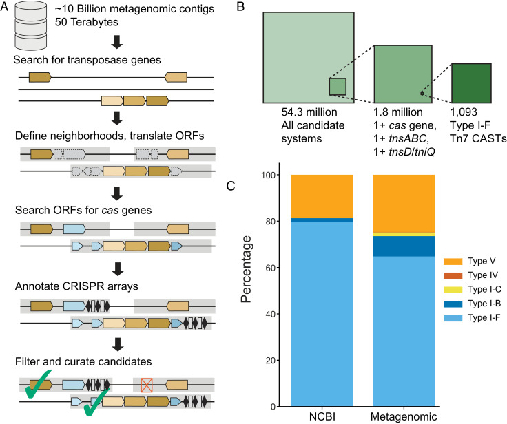
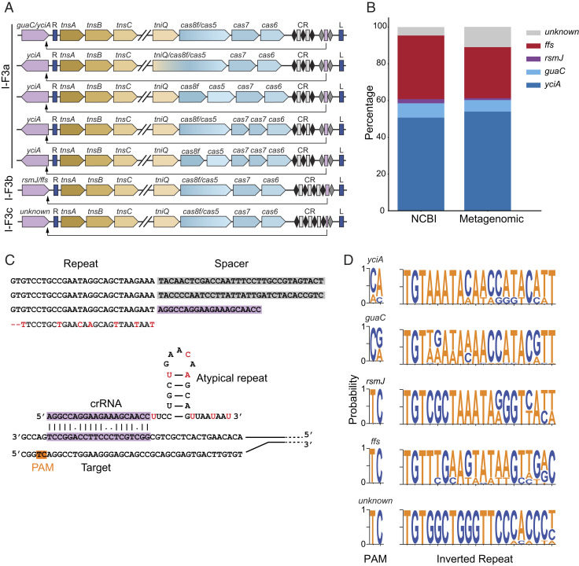
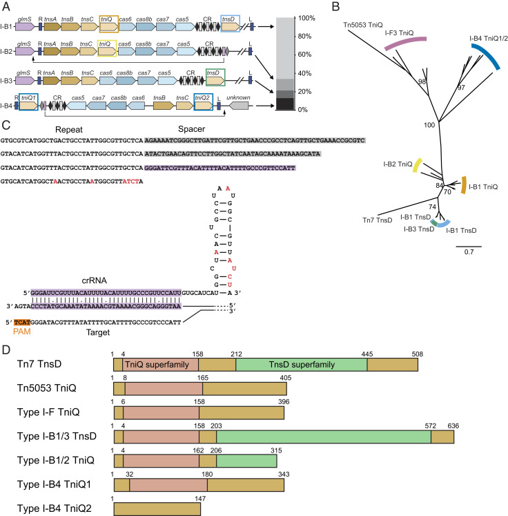
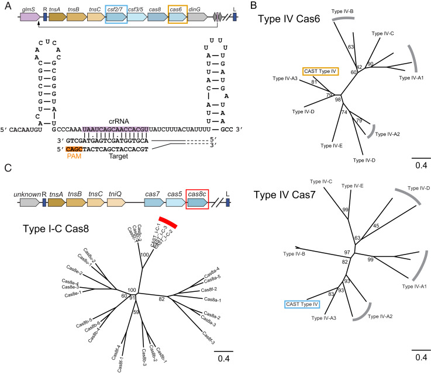
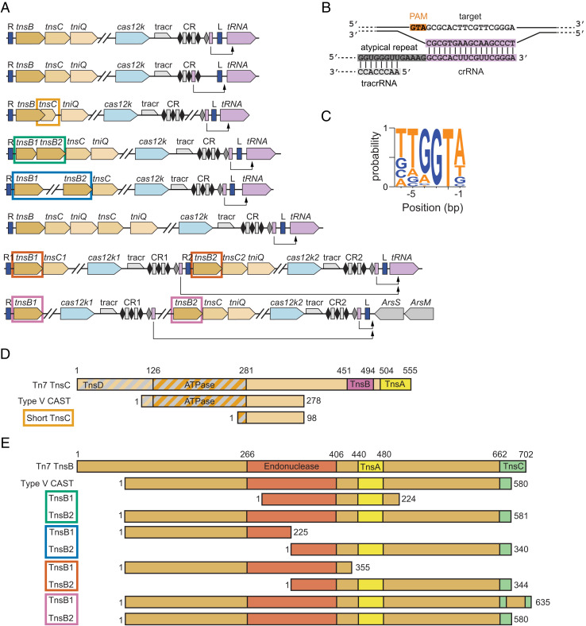
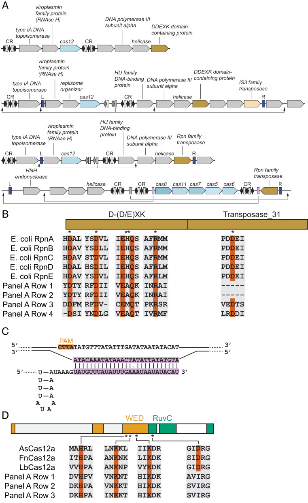

# Metagenomic discovery of CRISPR-associated transposons

**James R. Rybarski\*, Kuang Hu\*, Alexis M. Hill\*, Claus O. Wilke, and Ilya J. Finkelstein** (\* co-first authors)

*PNAS*, Volume 118, Issue 49, e2112279118 (2021)

**DOI:** [10.1073/pnas.2112279118](https://doi.org/10.1073/pnas.2112279118)

---

## Table of Contents

- [Abstract](#abstract)
- [Results](#results)
- [Discussion](#discussion)
- [Materials and Methods](#materials-and-methods)
- [Acknowledgments](#acknowledgments)

---
##  Abstract
CRISPR-associated Tn7 transposons (CASTs) co-opt _cas_ genes for RNA-guided transposition. CASTs are exceedingly rare in genomic databases; recent surveys have reported Tn7-like transposons that co-opt Type I-F, I-B, and V-K CRISPR effectors. Here, we expand the diversity of reported CAST systems via a bioinformatic search of metagenomic databases. We discover architectures for all known CASTs, including arrangements of the Cascade effectors, target homing modalities, and minimal V-K systems. We also describe families of CASTs that have co-opted the Type I-C and Type IV CRISPR-Cas systems. Our search for non-Tn7 CASTs identifies putative candidates that include a nuclease dead Cas12. These systems shed light on how CRISPR systems have coevolved with transposases and expand the programmable gene-editing toolkit.
* * *
CRISPR-associated transposons (CASTs) are transposons that have delegated their insertion site selection to a nuclease-deficient CRISPR-Cas system. All currently known CASTs derive from Tn7-like transposons and retain the core transposition genes _tnsB_ and _tnsC_ but dispense with _tnsE_ , and often _tnsD_ , which mediate target selection ([1](https://pmc.ncbi.nlm.nih.gov/articles/PMC8670466/#r1), [2](https://pmc.ncbi.nlm.nih.gov/articles/PMC8670466/#r2)). Tn7 transposons site specifically insert themselves at a single chromosomal locus (the attachment or _att_ site) via the TnsD/TniQ family of DNA-binding proteins while TnsE promotes horizontal gene transfer onto mobile genetic elements. In contrast, Class 1 CASTs replace TnsD and TnsE with a CRISPR RNA (crRNA)–guided TniQ-Cascade effector complex ([3](https://pmc.ncbi.nlm.nih.gov/articles/PMC8670466/#r3)–[6](https://pmc.ncbi.nlm.nih.gov/articles/PMC8670466/#r6)). These CASTs can use the TniQ-Cascade complexes for both vertical and horizontal gene transfer ([5](https://pmc.ncbi.nlm.nih.gov/articles/PMC8670466/#r5)). One notable exception is a family of Type I-B CASTs that retains TnsD for vertical transmission but co-opts TniQ-Cascade for horizontal transmission ([7](https://pmc.ncbi.nlm.nih.gov/articles/PMC8670466/#r7)). Similarly, Class 2 CASTs use the Cas12k effector to transpose to the _att_ sites or to mobile genetic elements ([8](https://pmc.ncbi.nlm.nih.gov/articles/PMC8670466/#r8), [9](https://pmc.ncbi.nlm.nih.gov/articles/PMC8670466/#r9)). CASTs also dispense with the spacer acquisition and DNA interference genes found in traditional CRISPR-Cas operons ([2](https://pmc.ncbi.nlm.nih.gov/articles/PMC8670466/#r2)). In short, these systems have merged the core transposition activities with crRNA-guided DNA targeting.
CASTs are exceedingly rare; only three subfamilies of Tn7-associated CASTs have been reported bioinformatically and experimentally ([2](https://pmc.ncbi.nlm.nih.gov/articles/PMC8670466/#r2), [5](https://pmc.ncbi.nlm.nih.gov/articles/PMC8670466/#r5), [7](https://pmc.ncbi.nlm.nih.gov/articles/PMC8670466/#r7), [9](https://pmc.ncbi.nlm.nih.gov/articles/PMC8670466/#r9), [10](https://pmc.ncbi.nlm.nih.gov/articles/PMC8670466/#r10)). These studies have identified that many, but not all, CASTs encode a homing spacer flanked by atypical (privileged) direct repeats ([11](https://pmc.ncbi.nlm.nih.gov/articles/PMC8670466/#r11)). However, the prevalence of such atypical repeats, the diversity of homing strategies, and the molecular mechanisms of why CASTs have evolved these repeats remain unresolved. Moreover, all CASTs that have been identified to date have a minimal CRISPR array with as few as two spacers. These systems are also missing the Cas1–Cas2 adaptation machinery, raising the question of how CASTs target other mobile genetic elements for horizontal gene transfer. Another open question is whether non-Tn7 transposons have adapted CRISPR-Cas systems to mobilize their genetic information.
CASTs are also a promising tool for inserting DNA into diverse cells. CASTs have already been used to simultaneously insert large cargos at multiple genomic loci ([12](https://pmc.ncbi.nlm.nih.gov/articles/PMC8670466/#r12)–[14](https://pmc.ncbi.nlm.nih.gov/articles/PMC8670466/#r14)), build mutant libraries in vivo ([15](https://pmc.ncbi.nlm.nih.gov/articles/PMC8670466/#r15)), and edit the genomes of uncultivated members of a bacterial community ([16](https://pmc.ncbi.nlm.nih.gov/articles/PMC8670466/#r16)). The characterization of as-yet-undiscovered systems with diverse capabilities may spur additional applications for CASTs in engineering both prokaryotic and eukaryotic cells as had occurred for CRISPR-Cas nucleases. For example, although Cas9 and Cas12a both seemingly catalyze the same reaction—crRNA-guided cleavage of a double-stranded DNA—these enzymes have been harnessed for different biotechnological applications owing to their differing nuclease domain architectures. Cas9 nickases can be readily created by inactivating either the HNH or RuvC nuclease domain, leading to applications such as prime editing ([17](https://pmc.ncbi.nlm.nih.gov/articles/PMC8670466/#r17), [18](https://pmc.ncbi.nlm.nih.gov/articles/PMC8670466/#r18)). Cas12a, in contrast, can cleave nonspecific single-stranded DNA after binding its specific target sequence ([19](https://pmc.ncbi.nlm.nih.gov/articles/PMC8670466/#r19)). This activity has been harnessed for a suite of nucleic acid detection technologies ([20](https://pmc.ncbi.nlm.nih.gov/articles/PMC8670466/#r20)). We reasoned that an expanded catalog of CASTs may shed light on the many unresolved questions regarding their biological mechanisms and future biotechnological applications.
Here, we have systematically surveyed CASTs across metagenomic databases using a custom-built computational pipeline that identifies both Tn7 and non-Tn7 CASTs. Using this pipeline, we have identified unique architectures for Type I-B, I-F, and V CASTs. Type I-F CASTs show the greatest diversity in _cas_ genes, including _tniQ-cas8/5_ fusions, split _cas7_ s, and even split _cas5_ genes. Some I-F CASTs likely assemble a Cascade around a short crRNA for homing from a noncanonical spacer. Type I-B CASTs frequently encode two _tniQ/tnsD_ homologs, one of which is used for homing via a crRNA-independent mechanism ([7](https://pmc.ncbi.nlm.nih.gov/articles/PMC8670466/#r7)). Remarkably, we have also found I-B systems that encode two _tniQ_ homologs and a homing crRNA, suggesting additional unexplored targeting mechanisms. In addition, we have observed Type I-C and Type IV family Tn7-like CASTs with unique gene architectures. Both of these subfamilies lack canonical CRISPR arrays, suggesting that CASTs use distal CRISPR arrays, perhaps from active CRISPR-Cas systems, for horizontal gene transfer. We have identified multiple self-insertions and gene loss in Type V systems, indicating that target immunity—a mechanism that prevents transposons from multiple self-insertions at an attachment site—is frequently weakened. Finally, we have found a set of Cas12-associated recombination-promoting nuclease/transposase (Rpn) family transposases that may participate in crRNA-guided horizontal gene transfer. We anticipate that these findings will shed additional light on how CASTs have co-opted CRISPR-Cas systems and further expand the CRISPR gene-editing toolbox.
---
##  Results
### A Bioinformatic CAST Discovery Pipeline.
We developed a bioinformatics pipeline that first searches metagenomic contigs for transposases using protein BLAST (BLASTP) and a curated transposase database with a permissive e-value threshold of 10−3 ([21](https://pmc.ncbi.nlm.nih.gov/articles/PMC8670466/#r21)) ([Fig. 1a](#fig1)). All possible open reading frames (ORFs) in a 25-kilobase pair (kbp) neighborhood up- and downstream of each putative transposase are translated and searched with BLASTP using a second curated database of all Cas proteins. Contigs without _cas_ genes are not analyzed further. The remaining contigs contain both a transposase and at least one _cas_ gene. We identify CRISPR arrays in these contigs using a modified version of PILER-CR that can locate arrays with as few as two repeats ([22](https://pmc.ncbi.nlm.nih.gov/articles/PMC8670466/#r22)). A final round of protein annotation searches for accessory transposase subunits (i.e., TnsC/D/E for the Tn7 family) and genetic elements that are near common attachment sites ([23](https://pmc.ncbi.nlm.nih.gov/articles/PMC8670466/#r23), [24](https://pmc.ncbi.nlm.nih.gov/articles/PMC8670466/#r24)). Finally, we filter the contigs by constraints (detailed in later sections) that are designed to isolate novel CASTs.
#### [Fig. 1](#fig1).

CAST detection and classification. (_A_) A bioinformatic pipeline for the discovery of CASTs. Brown: transposase genes; blue: _cas_ genes; dotted: ORFs; gray: gene neighborhoods. Neighborhoods satisfying initial search criteria are marked with a green check. Red “x” denotes a neighborhood that does not match the initial search criteria (e.g., no detected _cas_ genes). (_B_) A summary of the stepwise filtering strategy to identify high-confidence Type I-F Tn7 CASTs. (_C_) The distribution of Tn7-associated CAST subtypes in the NCBI microbial genome and EMBL metagenomic databases.
To test this pipeline, we searched for all previously discovered CASTs in the National Center for Biotechnology Information (NCBI) repository of bacterial genomes ([2](https://pmc.ncbi.nlm.nih.gov/articles/PMC8670466/#r2), [25](https://pmc.ncbi.nlm.nih.gov/articles/PMC8670466/#r25), [26](https://pmc.ncbi.nlm.nih.gov/articles/PMC8670466/#r26)). We downloaded 951,491 partial and complete bacterial genomes from the NCBI FTP server on May 5, 2021. Using these genomes as input, we identified regions with at least one _cas_ gene within an ∼25-kbp neighborhood of a transposase. We filtered for contigs that encoded either a Type I or Type V effector and at least one member of the TniQ/TnsD family of Tn7-associated proteins. As expected, we reidentified previously published systems ([2](https://pmc.ncbi.nlm.nih.gov/articles/PMC8670466/#r2), [25](https://pmc.ncbi.nlm.nih.gov/articles/PMC8670466/#r25)) along with previously unannotated Type V systems. These results confirm that the bioinformatics pipeline is sufficiently sensitive to discover these rare CRISPR-transposon systems in large genomic databases.
Next, we searched the repository of metagenomic sequencing reads from the European Molecular Biology Laboratory (EMBL)–European Bioinformatics Institute for novel CASTs ([27](https://pmc.ncbi.nlm.nih.gov/articles/PMC8670466/#r27)). This repository is the largest collection of sequenced DNA from diverse microbiomes, aquatic, manmade, and soil environments. We downloaded >1 petabyte of non-16S ribosomal RNA reads ([Fig. 1b](#fig1) and see _Materials and Methods_). These reads were assembled into ∼10 billion high-quality contigs (∼30 terabytes). Contigs were annotated for transposases and _cas_ genes. Approximately 54 million contigs (∼150 gigabytes) met the twin criteria of having at least one transposase and one _cas_ gene. After the deduplication of nearly identical contigs, we searched for putative CAST systems ([Fig. 1b](#fig1)). Using Class 1 Tn7-associated CASTs as an example, we filtered for contigs that included at least one _cas_ gene, _tnsD/tniQ_ , and had at least one of the core Tn7 genes: _tnsA_ , _tnsB_ , or _tnsC_ (∼1.8M contigs). These systems were additionally filtered by selecting only systems in which two of the Tn7 genes were less than 1,500 bp apart and in which three of the core Class 1 _cas_ genes (_cas5_ , _cas6_ , _cas7_ , and _cas8_) were also less than 1,500 bp apart (1,167 systems). Of these, 1,093 systems were identified as being Type I-F CASTs. The remaining high-confidence systems included Type I-B, I-C, IV, and V systems ([Fig. 1c](#fig1)). To increase the confidence of our annotations and to annotate unknown ORFs, we re-BLASTed all possible reading frames against the UniProtKB/TrEMBL database of high-quality computationally annotated protein variants ([28](https://pmc.ncbi.nlm.nih.gov/articles/PMC8670466/#r28)). We assigned high-confidence systems to specific subtypes by re-BLASTing the _cas_ genes against a database of subtype-specific effector proteins and by manually reviewing the operon architecture. After removing nearly redundant systems, we found 1,476 high-confidence CRISPR-Tn7 CASTs. Notably, we detected founding members of the Type I-C and IV CASTs in the metagenomic but not NCBI database. All of these systems were missing the interference (_cas3_) and adaptation (_cas1_ /_2_) genes in agreement with the “guns for hire” hypothesis for how CRISPR-Cas systems have been co-opted for diverse cellular functions ([29](https://pmc.ncbi.nlm.nih.gov/articles/PMC8670466/#r29)).
### Diversity of Type I-F CASTs.
We identified 1,093 nonredundant I-F subsystems with the prototypical gene arrangement of _tnsA-tnsB-tnsC_ separated from _tniQ-cas8/cas5-cas7-cas6_ by a large cargo region ([Fig. 2a](#fig2)). Tn7 cargo genes are unrelated to the transposition mechanism and often include antibiotic resistance genes ([30](https://pmc.ncbi.nlm.nih.gov/articles/PMC8670466/#r30)). Type I-F3a systems, defined as using the conserved genes _guaC_ or _yciA_ as their _att_ site, comprise ∼61% of all I-F CASTs ([Fig. 2b](#fig2)). I-F3b systems, which use the _rsmJ_ or _ffs att_ site, comprise ∼34% of I-F CASTs ([11](https://pmc.ncbi.nlm.nih.gov/articles/PMC8670466/#r11)). The remaining 5% of I-F systems form a distinct group, termed I-F3c, with a unique _att_ site and homing mechanism.
#### [Fig. 2](#fig2).

A summary of Type I-F CASTs. (_A_) The gene architectures of Type I-F3a, I-F3b, and I-F3c systems. Unique gene architectures include _tniQ-cas8_ fusions, split _cas8_ and _cas5_ , and dual _cas7_ systems. Purple: _att_ site; blue: left and right transposon ends. Black diamonds: canonical direct repeats; gray diamonds: atypical direct repeats. Rectangles: spacers; purple rectangle: homing spacer. The arrow indicates the target site. The slanted gapped lines indicate elided cargo regions. (_B_) The distribution of _att_ site genes in the NCBI and the metagenomic databases. (_C_ , _Top_) The sequence of a CRISPR array with a short, atypical spacer (purple) that may assemble a mini Cascade. The red bases are those that differ from the consensus repeat sequence. (_Bottom_) A schematic of an atypical crRNA and its target DNA sequence. (_D_) Web logos of the PAM and right inverted repeat adjacent to each _att_ site. The TnsB-binding site and the homing PAMs are conserved within subsystems.
The most common gene arrangement in our dataset for all three subtypes encodes the _tnsA-C_ genes in one operon and the _tniQ_ and _cas_ genes in a second operon that is adjacent to the CRISPR repeats. A large cargo spanning ∼10 to 20 kbp either separates these operons or is present downstream of the _cas_ genes. The stoichiometry of the Cascade effector has been previously reported to be (Cas6)1: (Cas7)6: (Cas8/Cas5)1: crRNA1: TniQ2 based on cryogenic electron microscopy of Type I-F CAST complexes ([3](https://pmc.ncbi.nlm.nih.gov/articles/PMC8670466/#r3), [4](https://pmc.ncbi.nlm.nih.gov/articles/PMC8670466/#r4), [6](https://pmc.ncbi.nlm.nih.gov/articles/PMC8670466/#r6), [31](https://pmc.ncbi.nlm.nih.gov/articles/PMC8670466/#r31)). In these studies, TniQ interacts with Cas7 and is structurally distant from Cas8/Cas5. However, in two of our I-F3a systems, TniQ is expressed as an N-terminal fusion with Cas8/Cas5. Four distinct I-F3a systems also have a split Cas7, and in one system, both the Cas5 and Cas7 proteins are split into two distinct polypeptides.
All I-F3 systems that we identified appear to use a crRNA-guided homing mechanism that directs Cascade near the _att_ site ([11](https://pmc.ncbi.nlm.nih.gov/articles/PMC8670466/#r11)). The homing crRNA is either in the leader distal position of the CRISPR array or 80 to 85 nt away from the CRISPR array as reported previously ([11](https://pmc.ncbi.nlm.nih.gov/articles/PMC8670466/#r11)). These homing crRNAs are flanked by an atypical direct repeat that has several substitutions relative to the direct repeats within the CRISPR array. I-F3c CASTs attach upstream of a protein of unknown function that encodes seven putative transmembrane regions (see _Materials and Methods_). This _att_ site has not been previously reported for any Tn7 family transposon. To determine how Type I-F3c systems use crRNA-guided transposition, we aligned the region around the CRISPR array with the sequence 500 bp upstream of _tnsA_. This identified a short 20-bp sequence immediately after the final canonical CRISPR repeat that matched the region ∼64 bp upstream of the transposon end. This short, atypical spacer is followed by an atypical repeat ([Fig. 2c](#fig2)) akin to the I-F3a and I-F3b systems.
Type I-F systems recognize a dinucleotide protospacer adjacent motif (PAM) ([32](https://pmc.ncbi.nlm.nih.gov/articles/PMC8670466/#r32)). Our analysis of the homing PAMs highlighted that they vary with the _att_ site and CAST subfamily ([Fig. 2d](#fig2)). Next, we analyzed the sequence composition of the inverted repeats that span Tn7. Tn7 transposon ends consist of a short direct repeat, a larger inverted repeat, and several noncontiguous TnsB-binding sites ([33](https://pmc.ncbi.nlm.nih.gov/articles/PMC8670466/#r33)). The right inverted repeat starts with a universally conserved 5′TGT that is recognized by the essential TnsB recombinase ([34](https://pmc.ncbi.nlm.nih.gov/articles/PMC8670466/#r34)). The rest of this repeat varies but is most similar between CASTs that have the same attachment site ([Fig. 2d](#fig2)). These results further confirm that I-F3c systems cluster into a distinct CAST subtype.
### Type I-B CASTs Encode Multiple Integration Mechanisms.
We found four families of Type I-B CASTs that lack interference and adaptation genes. These systems either encode a single _tniQ_ or a _tniQ_ and _tnsD_ ([Fig. 3a](#fig3)). Systems with dual _tniQ/tnsD_ genes comprise 79% of all identified systems. The most common Type I-B system (I-B1) encodes a _tniQ_ between _tnsC_ and a _cas_ gene, while _tnsD_ is on the distal end of the CRISPR array ([Fig. 3a](#fig3), _Top_ and [Fig. 3b](#fig3)). Systems with a single _tniQ_ homolog (I-B2 and I-B3) have two distinct gene architectures and homing modalities. In I-B2 systems, where _tniQ_ is sandwiched between _tnsC_ and _cas6_ , we identified a homing spacer that was complementary to a region downstream of _glmS_ ([Fig. 3a](#fig3), _Middle_). However, we did not find any homing spacers in I-B3 systems, where _tnsD_ is between the CRISPR array and cargo genes. In addition, this _tnsD_ is nearly double the length of the shorter _tniQ_ s found between _tnsC_ and _cas6_ , bears a strong resemblance to the _tnsD_ encoded in canonical Tn7 systems, and has recently been shown to recognize the CAST _att_ site (third row, [Fig. 3a](#fig3)) ([7](https://pmc.ncbi.nlm.nih.gov/articles/PMC8670466/#r7)).
#### [Fig. 3](#fig3).

An analysis of Type I-B CASTs. (_A_ , _Left_) The gene architectures of Type I-B systems. Systems can dispense with either the first or the second _tniQ/tnsD_ , suggesting alternative targeting lifestyles. Type I-B4 systems have a unique architecture that most resembles Type V CASTs. Colored rectangles correspond to phylogenetic groups in _B_. (_Right_) The distribution of Type I-B subsystems in the metagenomic database. (_B_) A phylogenetic tree with TniQ/TnsD variants from Type I-B and I-F CASTs as well as from the canonical Tn7 and Tn5053 transposons. The values at branch points are bootstrap support percentages. (_C_ , _Top_) The sequence of a Type I-B4 CRISPR array with a short, atypical spacer. (_Bottom_) A schematic of an atypical crRNA base paired with a target DNA sequence. The red bases are those that differ from the consensus repeat sequence. (_D_) Domain maps of TniQ/TnsD proteins. Regions homologous to the TniQ superfamily and the TnsD superfamily are indicated in pink and light green, respectively. The Type I-B4 system encodes the shortest TniQ variant.
We identified an atypical Type I-B CAST (I-B4) that had a unique gene architecture and homing mechanism (last row, [Fig. 3a](#fig3)). This system encodes _tnsB_ and _tnsC_ but lacks the _tnsA_ gene, akin to Type V systems ([8](https://pmc.ncbi.nlm.nih.gov/articles/PMC8670466/#r8), [9](https://pmc.ncbi.nlm.nih.gov/articles/PMC8670466/#r9)). Phylogenetic analysis of TnsB and TnsC shows that this CAST clusters more closely to Tn5053 (which also lacks TnsA) than to Tn7 ([_SI Appendix_ , Fig. 1](https://www.pnas.org/lookup/suppl/doi:10.1073/pnas.2112279118/-/DCSupplemental)). Two _tniQ_ homologs of unequal length are immediately adjacent to the inverted repeats but distal from the cas operon. _TniQ 1_ is sandwiched between the right transposon end and a short CRISPR array; _tniQ 2_ is only ∼450 bp long and is located between _tnsC_ and the left transposon end. This short TniQ2 can be aligned against the N terminus of traditional CAST-associated TniQs ([Fig. 3d](#fig3)). Notably, this is the only dual _tniQ_ CAST that encodes a homing spacer with near-perfect complementarity to a region of DNA just outside the transposon. The _att_ site is adjacent to a gene of unknown function near the left transposon end ([Fig. 3a](#fig3)), akin to the _att_ sites in Type V CASTs. The homing spacer is flanked by an atypical direct repeat and is also 6 to 23 bp shorter than the other spacers in the CRISPR array ([Fig. 3c](#fig3)). Based on these findings and our observation of Type I-F CASTs with short homing spacers, we propose that Type I-B systems can also assemble homing mini Cascades.
To better understand the roles of multiple TniQ/TnsD homologs in Type I-B CASTs, we constructed a phylogenetic tree of Type I-B, I-F3a, and I-F3b TniQs along with TnsD from Tn7 and TniQ from Tn5053 transposons ([Fig. 3b](#fig3)). Compared to the cluster of TniQ, the short TniQ from Type I-B1 and B2 systems are closer to TniQ from other CASTs, while the Type I-B1 TnsD clusters with canonical Tn7 TnsD. These results are consistent with a recent report that the CAST TnsD serves the same role as Tn7 TnsD, namely that it is a sequence-specific DNA-binding protein that directs transposition downstream of _glmS_ ([7](https://pmc.ncbi.nlm.nih.gov/articles/PMC8670466/#r7)). We note that both TniQ1 and TniQ2 in Type I-B4 CASTs cluster closely with other TniQ homologs. These CASTs also encode a homing spacer, suggesting that these homologs mediate CRISPR-guided target selection.
### Type I-C and IV CASTs from Metagenomic Sources.
Our analysis of the metagenomic contigs revealed a Type IV CAST ([Fig. 4a](#fig4)). Type IV systems are primarily encoded by plasmid-like elements to mediate interplasmid conflicts ([35](https://pmc.ncbi.nlm.nih.gov/articles/PMC8670466/#r35), [36](https://pmc.ncbi.nlm.nih.gov/articles/PMC8670466/#r36)). Phylogenetic trees of Cas6 and Cas7 independently placed this CAST within the Type IV-A3 subfamily ([Fig. 4b](#fig4)). These systems frequently shed their CRISPR repeats instead of using distal CRISPR arrays ([35](https://pmc.ncbi.nlm.nih.gov/articles/PMC8670466/#r35)). Although we did not find any CRISPR repeats in this system using Crass or PILER-CR, we detected a spacer-like DNA segment with strong complementarity to the C terminus of _glmS_ , the likely _att_ site. This putative homing spacer is adjacent to two hairpins, both of which resemble the direct repeats in other Type IV CRISPR-Cas systems ([Fig. 4a](#fig4), _Bottom_). We conclude that this minimal spacer–repeat motif directs homing by the Type IV system. Horizontal transfer may still occur via a distal CRISPR array akin to the interference mechanism in other Type IV CRISPR-Cas systems ([35](https://pmc.ncbi.nlm.nih.gov/articles/PMC8670466/#r35)).
#### [Fig. 4](#fig4).

New Tn7 CASTs from metagenomic databases. (_A_ , _Top_) The gene architecture of a Type IV CAST. This system lacks a CRISPR array but encodes a homing spacer. The genes highlighted by colored rectangles correspond to genes in _B_. (_Bottom_) A schematic of a short, homing spacer base paired with its target DNA sequence. (_B_) Phylogenetic trees of Cas6 and Cas7 indicate that the Type IV CAST most closely resembles Type IV-A3 CRISPR-Cas systems. The values at branch points are bootstrap support percentages. (_C_ , _Top_) The gene architecture of Type I-C systems. We did not detect any CRISPR arrays or atypical homing spacers. (_Bottom_) A phylogenetic tree of Cas8 confirms that this system is closely related to Type I-C Cascades. The values at branch points are bootstrap support percentages.
We found nine nonredundant Type I-C CASTs with _cas5_ , _cas7_ , and _cas8_ downstream of _tnsABC_ and _tniQ_ ([Fig. 4c](#fig4)). _TniQ_ is immediately adjacent to _tnsABC_ rather than the _cas_ genes. A phylogenetic analysis of Cas8 showed close similarity to Cas8c ([Fig. 4c](#fig4), _Right_). We did not detect a CRISPR array via CRASS or PILER-CR. We also did not detect any transfer RNA (tRNA) or common Tn7-associated _att_ sites near either the left or right transposon ends, precluding a detailed analysis of the homing mechanism. We cannot rule out that these systems use a minimal leader–spacer array that was below the threshold of our detection software. Alternatively, these systems may use a distal CRISPR array in _trans_. Further bioinformatic and experimental analyses will be required to delineate the mechanisms of homing and horizontal transfer in these systems.
### Architectural Diversity and Homing in Type V CASTs.
Type V CASTs were likely formed when a Tn7-like transposon co-opted a _cas12_ gene for RNA-guided DNA targeting ([10](https://pmc.ncbi.nlm.nih.gov/articles/PMC8670466/#r10), [25](https://pmc.ncbi.nlm.nih.gov/articles/PMC8670466/#r25)). Most Type V CASTs contain _tnsB_ , _tnsC_ , and _tniQ_ at one end of the transposon with _cas12k_ , a small CRISPR array, and an atypical repeat–spacer on the other end. Cargo genes spanning 2 to 23 kb of additional DNA sequences are sandwiched between _tniQ_ and _cas12k_ ([Fig. 5a](#fig5)). In contrast to Class 1 systems, all metagenomic Type V systems lacked _tnsA_ , consistent with the proposal that _cas12k_ was captured by a Tn5053 family transposon, which contains _tnsB_ , _tnsC_ , and _tniQ_ homologs but also lacks _tnsA_ ([37](https://pmc.ncbi.nlm.nih.gov/articles/PMC8670466/#r37), [38](https://pmc.ncbi.nlm.nih.gov/articles/PMC8670466/#r38)). The _trans_ -activating CRISPR RNA (tracrRNA) is upstream of the canonical CRISPR array with homology to the atypical repeat. The crRNA usually has good homology to the target DNA, with 98% of systems containing one or zero mismatches in the first 10 bps ([Fig. 5b](#fig5)). As previously observed ([8](https://pmc.ncbi.nlm.nih.gov/articles/PMC8670466/#r8)), atypical spacers generally targeted tRNA genes immediately adjacent to the transposon. We also found one system that attaches 104 bp downstream of _arsS_ , which codes for an arsenosugar biosynthesis radical _S_ -adenosylmethionine protein. An analysis of the DNA upstream of the homing spacer revealed 5′-TGGTA as the most common PAM, with some variability in the −5, −4, and −1 positions. ([Fig. 5c](#fig5)). Experimental evidence for two CASTs showed a preference for a smaller 5′-GTN PAM ([9](https://pmc.ncbi.nlm.nih.gov/articles/PMC8670466/#r9)). Whether the broader set of Cas12k proteins have more stringent PAM requirements will require experimental validation. Overall, this architecture and preference for tRNA attachment sites corroborate previous bioinformatic and experimental observations ([7](https://pmc.ncbi.nlm.nih.gov/articles/PMC8670466/#r7)–[9](https://pmc.ncbi.nlm.nih.gov/articles/PMC8670466/#r9), [25](https://pmc.ncbi.nlm.nih.gov/articles/PMC8670466/#r25)).
#### [Fig. 5](#fig5).

An analysis of Type V CASTs. (_A_) The gene architectures of Type V CASTs, including dual-insertion systems (_Bottom_ two rows). The colored rectangles around genes correspond to alignments in _D_ and _E_. (_B_) A schematic of interactions between the target site DNA, a homing crRNA, and a tracrRNA. (_C_) A web logo of PAM sequences found adjacent to spacer targets. (_D_) Aligned domain maps of truncated TnsC variants. Gray diagonal stripes indicate the TnsD-interacting region. Truncated TnsCs lack the TnsA- and TnsB-interacting domains but generally retain the ATPase domain and most of the TnsD-interacting domain. The shortest TnsC has also lost its ATPase domain. (_E_) Aligned domain maps of truncated TnsB variants. Type V CAST TnsB is shorter than Tn7 TnsB but contains the functionally annotated domains. In some dual TnsB systems, the first _tnsB_ encodes the N-terminal region, and the second encodes the C-terminal portion.
We also found Type V CASTs with unusual _tnsC_ and _tnsB_ arrangements. Notably, all Type V TnsC proteins lack the canonical TnsA- and TnsB-interacting domains and have partial truncations of the TniQ-interacting domain ([39](https://pmc.ncbi.nlm.nih.gov/articles/PMC8670466/#r39)–[41](https://pmc.ncbi.nlm.nih.gov/articles/PMC8670466/#r41)). The shortest CAST—only 6.6 kbp in total, including the cargo—encodes a 98-amino acid _tnsC_ fragment whose sequence overlaps with _tnsB_ by 115 bp ([Fig. 5a and d](#fig5)). In addition to losing the TniQ-, TnsB-, and TnsA-interacting domains, this TnsC has also lost its ATPase domain ([39](https://pmc.ncbi.nlm.nih.gov/articles/PMC8670466/#r39), [41](https://pmc.ncbi.nlm.nih.gov/articles/PMC8670466/#r41)). We hypothesize that the minimal _tnsC_ encodes uncharacterized TnsB- and TniQ-interaction motifs. Because of its compact organization, this CAST is also a prime candidate for gene-editing applications.
Multiple CASTs split _tnsB_ into separate ORFs that encode just the _N_ or C terminus. Alternatively, a full-length _tnsB_ is encoded next to a _tnsB_ fragment containing most of the catalytic domain ([Fig. 5e](#fig5)). Strikingly, two unrelated systems encode the same N-terminal region of _tnsB_. We speculate that these split TnsBs form a heterodimeric TnsB1:TnsB2 transposition complex. These heterodimeric complexes retain the catalytic core while also maintaining the requisite TnsC interaction motifs via the longer TnsB subunit.
We also observed multiple contigs with two CASTs inserted at the same attachment site (_Bottom_ rows, [Fig. 5a](#fig5)). Tn7 transposons can prevent reinsertion at the attachment site by TnsB-mediated dissociation of TnsC from target DNA ([42](https://pmc.ncbi.nlm.nih.gov/articles/PMC8670466/#r42), [43](https://pmc.ncbi.nlm.nih.gov/articles/PMC8670466/#r43)). However, more distant Tn7 family transposases may still insert at a single attachment site, resulting in several transposons that are situated adjacent to each other ([41](https://pmc.ncbi.nlm.nih.gov/articles/PMC8670466/#r41)). Consistent with this idea, the dual-insertion Type V CASTs have distinct cargos, unique gene architectures, and divergent _cas12k_ sequences. In one contig, the tRNA distal CAST encoded an N-terminal _tnsB_ truncation and lost _tniQ_ (seventh row, [Fig. 5a](#fig5)). The tRNA proximal CAST from the same organism encoded the C-terminal _tnsB_ fragment and had a complete Type V family _tniQ_. A second dual CAST system had lost both _tnsC_ and _tniQ_ from the tRNA distal transposon (last row, [Fig. 5 _A_](#fig5)). Both systems encode a homing spacer and a full _cas12k_ gene, suggesting that they are both still active.
Tn7 insertion results in the hallmark duplication of several bps flanking the inverted repeats ([44](https://pmc.ncbi.nlm.nih.gov/articles/PMC8670466/#r44)). We identified similar direct repeats in the dual-insertion CASTs. In the first such system (seventh row, [Fig. 5a](#fig5)), a 5′-GGACA repeat flanks R2 and L, while R1 is not bound by the direct repeat. Such an outcome may have occurred if R1 was the original right transposon end but was degraded over time. Insertion of another transposon bound by R2 and L would then generate the observed repeat. The second system (eighth row, [Fig. 5a](#fig5)) was bounded by direct repeats of 5′-GTACA. This is consistent with a functional CAST that was formed by dual insertion followed by the loss of the upstream _tnsC_ and _tniQ_ and the formation of a heterodimeric _tnsB_.
### Phylogenetic Analysis of Tn7-CASTs.
To clarify the evolutionary relationship between Tn7-CASTs, we built phylogenetic trees of the TnsB ([_SI Appendix_ , Fig. 1 _A_](https://www.pnas.org/lookup/suppl/doi:10.1073/pnas.2112279118/-/DCSupplemental)) and TnsC ([_SI Appendix_ , Fig. 1 _B_](https://www.pnas.org/lookup/suppl/doi:10.1073/pnas.2112279118/-/DCSupplemental)) proteins from all known CAST subtypes as well as Tn7 family transposons (see _Materials and Methods_). The phylogenetic relationships between subsystems were nearly identical for both TnsB and TnsC, suggesting that these proteins are coevolving as a system. We omitted TnsA from this analysis because Type I-B4 and all Type V Tn7-CASTs lack this gene. We confirmed that all metagenomic Type V CASTs are phylogenetically closer to the Tn5053 transposon than Tn7. In contrast, Type I-B1-3, I-C, and IV CASTs are phylogenetically close to Tn7. Such limited evolutionary drift may suggest a relatively recent co-opting of this CRISPR-Cas system. Type I-B4 CASTs are a notable exception because these systems lack _tnsA_ and cluster closer to Tn5053 than to the reference Tn7. Type I-F CASTs are highly divergent from both Tn7 and Tn5053, with a large phylogenetic separation between the I-F3a and I-F3b subtypes. The diversity of Tn7 family transposases and CRISPR subsystems that have coevolved suggests that we will continue to find new CAST families as metagenomic databases expand, and detection sensitivity increases.
### Non-Tn7 CASTs that Co-Opt Cas12 and Type I-E Cascade.
While transposons other than Tn7 may have co-opted CRISPR-Cas systems for _att_ site recognition, this has never been reported. To explore this possibility, we identified contigs that encode 1) at least one non-Tn7 transposase gene (see _Materials and Methods_), 2) a CRISPR array containing at least two spacers, and 3) Class 1 or Class 2 DNA-binding effectors (i.e., _cas9_ , _cas12_ , or any three of _cas5/6/7/8_). We excluded contigs that encode interference (i.e., _cas3_ or _cas10_) or acquisition machinery (i.e., _cas1_ or _cas2_). Class 2 nucleases were additionally filtered by size to exclude truncated genes (see _Materials and Methods_). We prioritized Type II, V, and VI systems in which the catalytic nuclease domain residues are mutated or deleted, as these enzymes cannot participate in adaptive immunity. We detected nuclease-inactivating mutations or deletions in 25% of _cas9_ genes (in one or both nuclease domains) and 8% of _cas12_ genes.
We found 40 nonredundant examples of a nuclease-inactive _cas12_ or a Type I-E Cascade near a putative Rpn-like gene ([Fig. 6a](#fig6)). Rpn family proteins were originally investigated because of their close homology to the catalytic domain of transposase_31 ([45](https://pmc.ncbi.nlm.nih.gov/articles/PMC8670466/#r45)). These proteins contain a PDDEXK nuclease domain first discovered in restriction endonucleases but also observed in T7 TnsA and other diverse DNA-processing enzymes ([46](https://pmc.ncbi.nlm.nih.gov/articles/PMC8670466/#r46)–[48](https://pmc.ncbi.nlm.nih.gov/articles/PMC8670466/#r48)) ([Fig. 6b](#fig6)). _Escherichia coli_ RpnA promotes RecA-independent gene transfer in cells and is a Ca2+-stimulated DNA nuclease in vitro ([45](https://pmc.ncbi.nlm.nih.gov/articles/PMC8670466/#r45)). The mechanism of how RpnA promotes horizontal gene transfer is unknown.
#### [Fig. 6](#fig6).

A family of putative non-Tn7 CASTs. (_A_) The defining features of this family of systems are an Rpn family (PDDEXK domain-containing) nuclease/transposase near a nuclease-dead Cas12 or a Type I-E Cascade complex. The operon is enriched for nucleic acid–processing proteins. We also observed homing spacers (magenta, black arrows) and short inverted repeats (blue) in some systems. (_B_) Multiple sequence alignment of Rpn proteins with the putative transposases from these systems. Residues critical for DNA cleavage in the PDDEXK domain are highlighted in red. The D165A mutant in RpnA more than doubles recombination in vivo; this aspartic acid is highlighted in red below the transposase_31 domain. (_C_) A schematic of an atypical homing spacer and its DNA target. The PAM is highlighted. (_D_) Multiple sequence alignment of nuclease-active Cas12a and putative CAST Cas12 proteins. Putative CAST Cas12 proteins retain the conserved residues in the WED domain that are essential for crRNA processing but lack an aspartic residue in the RuvC domain that is essential for DNA cleavage.
The genetic context around _cas12_ in our systems is highly enriched with nucleic acid–interacting proteins, including a topoisomerase, a ribonuclease, a DNA polymerase subunit, and one or two helicases. Likewise, the Cascade system encodes a helicase and an HNH endonuclease. Three Cas12 systems encode an HU family DNA-binding protein, and one of those also contains a protein with homology to a phage replisome organizer ([49](https://pmc.ncbi.nlm.nih.gov/articles/PMC8670466/#r49)). We detected three systems with putative atypical homing spacers adjacent to a canonical CRISPR array ([Fig. 6a](#fig6)). In the Cas12 systems, the homing spacer is complementary to two or four nearby targets, all of which are positioned at intergenic sequences. The closest targets of these homing sequences are adjacent to a 5′-CTTA PAM, which is recognized by conventional Cas12a nucleases ([Fig. 6c](#fig6)) ([50](https://pmc.ncbi.nlm.nih.gov/articles/PMC8670466/#r50), [51](https://pmc.ncbi.nlm.nih.gov/articles/PMC8670466/#r51)). There are 9-bp inverted repeats (with one mismatch) that flank _cas12_ , the Rpn family protein, and several other genes.
The Cas12 proteins encoded by these systems cover 90% of the well-characterized AsCas12a sequence (∼24% amino acid identity), including the crRNA-processing, DNA-binding, and DNA nuclease domains ([52](https://pmc.ncbi.nlm.nih.gov/articles/PMC8670466/#r52)). A phylogenetic tree of Cas12 family members also places this protein closest to the Cas12a family ([_SI Appendix_ , Fig. 3](https://www.pnas.org/lookup/suppl/doi:10.1073/pnas.2112279118/-/DCSupplemental)). Cas12a can process its own pre-crRNA via a dedicated RNase domain ([53](https://pmc.ncbi.nlm.nih.gov/articles/PMC8670466/#r53)). Three residues in this domain have been identified as critical for precrRNA processing; all are conserved in Rpn-associated Cas12 variants ([Fig. 6d](#fig6)) ([53](https://pmc.ncbi.nlm.nih.gov/articles/PMC8670466/#r53)). Cas12a degrades double-stranded DNA by first cleaving the nontarget strand followed by the target strand in its single RuvC nuclease active site ([54](https://pmc.ncbi.nlm.nih.gov/articles/PMC8670466/#r54)–[57](https://pmc.ncbi.nlm.nih.gov/articles/PMC8670466/#r57)). Phosphate bond scission is catalyzed by two magnesium ions, one of which is coordinated by a critical aspartic residue (position 908 in _Acidaminococcus_ [_As_] Cas12a). This residue is mutated to isoleucine in all Rpn-associated systems ([Fig. 6 _D_](#fig6) and [_SI Appendix_ , Fig. 2](https://www.pnas.org/lookup/suppl/doi:10.1073/pnas.2112279118/-/DCSupplemental)). Similarly, the Rpn-associated Type I-E system encodes all the Cascade subunits but does not have _cas3_ or c _as1_ – _cas2_. We conclude that these systems bear striking resemblance to Tn7-associated CASTs and may also mobilize genomic information for crRNA-guided horizontal transfer.
---
##  Discussion
CASTs are rare in fully sequenced prokaryotic genomes and are likely to be missed by traditional CRISPR detection pipelines due to their unusual operon structures and short CRISPR arrays. To address this gap, we have developed a set of Python libraries that allow users to efficiently use BLAST to search for co-occurring genes and to perform subsequent searches for arbitrary gene architectures. We examined ∼50 terabytes of metagenomic contigs to identify ∼1,476 high-confidence CASTs, including Type IV and Type I-C systems as well as a Type I-B4 CRISPR system that coevolved with a Tn5053-like element, a member of the Tn7 family of transposons that lacks _tnsA_. We have also discovered systems that include a putative nuclease-inactive Cas12 and a non-Tn7 transposase-like recombinase. The DNA sequences for all CASTs discovered here are available via our git repository (see _Materials and Methods_). The diversity of CRISPR subtypes that have been co-opted by transposons will likely increase as metagenomic databases and sensitive detection pipelines continue to improve ([58](https://pmc.ncbi.nlm.nih.gov/articles/PMC8670466/#r58), [59](https://pmc.ncbi.nlm.nih.gov/articles/PMC8670466/#r59)). More broadly, the abundance of nuclease-inactive CRISPR-Cas operons may suggest that the scope of cellular processes that have co-opted CRISPR-Cas systems is wider than is currently known.
In the NCBI and metagenomic databases, the most abundant Tn7-associated CASTs are those that co-opt Class 1 CRISPR systems. Of these, Type I-F subsystems are the most structurally diverse. Notably, we found that some I-F CASTs encode _tniQ-cas8/cas5_ fusions, duplicate _cas5_ s, and duplicate _cas7_ s. We speculate that gene duplication of the _cas5_ and/or _cas7_ allowed one of the paralogs to form a protein–protein interface with TniQ. The second paralog may have been subsequently lost. The remaining paralog resulted in the streamlined I-F CASTs that are most frequently found in bacterial genomes. The short atypical precrRNA in some I-F CASTs also suggests that these systems assemble a shortened Cascade for homing. The size of Type I-E and I-F Cascades can be tuned by the length of the crRNA ([60](https://pmc.ncbi.nlm.nih.gov/articles/PMC8670466/#r60)–[64](https://pmc.ncbi.nlm.nih.gov/articles/PMC8670466/#r64)). Intriguingly, short I-F Cascades cannot recruit Cas3 but are still able to bind the target DNA, making them an ideal system for directed Tn7 transposition ([63](https://pmc.ncbi.nlm.nih.gov/articles/PMC8670466/#r63)). Short Cascades, along with the atypical direct repeats, may differentiate homing CASTs from those undergoing horizontal gene transfer in the I-F3c system.
Type I-B CASTs encode one or two _tniQ/tnsD_ homologs. A recent report has uncovered that homing in some systems proceeds via TnsD, whereas horizontal transfer is crRNA guided ([7](https://pmc.ncbi.nlm.nih.gov/articles/PMC8670466/#r7)). We also identified atypical systems that encode two short _tniQ_ homologs along with a homing spacer. Both homologs in the atypical dual-_tniQ_ systems are related to the I-F CAST _tniQ_. Based on this observation, along with the crRNA-directed homing and the alignment of TniQ2 to the N terminus of TniQ1, we propose that this CAST assembles a heterodimeric Cascade consisting of a single repeat of each subunit. Alternatively, this system may assemble TniQ1- and TniQ2-only Cascades for homing and horizontal transfer. Additional studies will be required to decipher the role of TniQ2 in the atypical I-B systems with a homing spacer.
How do CASTs target mobile genetic elements with minimal CRISPR arrays? We did not find any systems that retained the Cas1/Cas2 acquisition machinery, suggesting that strong evolutionary pressure is preventing the CAST-associated CRISPR arrays from expanding. CASTs encode CRISPR arrays that are significantly shorter than the corresponding canonical CRISPR-Cas systems, and these arrays may also be transcriptionally silenced via _xre_ elements that are frequently found adjacent to these arrays in CASTs ([11](https://pmc.ncbi.nlm.nih.gov/articles/PMC8670466/#r11)). Moreover, we could not identify any CRISPR arrays in Type IV and I-C CASTs. We propose that CASTs use CRISPR arrays that occur elsewhere in the genome—perhaps in functional CRISPR-Cas systems—for horizontal gene transfer. Evidence for such in _trans_ CRISPR array usage has already been documented for a large set of canonical CRISPR-Cas systems ([65](https://pmc.ncbi.nlm.nih.gov/articles/PMC8670466/#r65), [66](https://pmc.ncbi.nlm.nih.gov/articles/PMC8670466/#r66)). CRISPR arrays that are associated with active interference machinery serve as an ever-updating record of the most likely mobile genetic elements that the CAST can use for horizontal gene transfer ([67](https://pmc.ncbi.nlm.nih.gov/articles/PMC8670466/#r67)). A second possibility is that Cas1/2/4 from an active CRISPR-Cas system can act in _trans_ to add spacers to the CAST CRISPR array. This may be an important secondary mechanism when horizontal transfer places the CAST into a host that lacks a compatible CRISPR array.
Our search revealed _cas12_ genes associated with Rpn family transposases, two of which appear to have atypical spacers that target two sites up- and downstream of _cas12_. This curious arrangement could be the result of a duplication of the target site that is originally present in only a single copy. We note that the HU family DNA-binding protein is only present in systems with putative homing spacers and that a homolog of this protein is essential in bacteriophage Mu for transpososome assembly ([68](https://pmc.ncbi.nlm.nih.gov/articles/PMC8670466/#r68)). Two other genes of viral origin —a replisome organizer and a ribonuclease—are also found near _cas12_ in a self-targeting system, hinting at an intriguing evolutionary path for the creation of this putative system. Whether these genes function as bona fide CASTs or other aspects of DNA metabolism will require extensive experimental follow-up. In sum, the CAST identification pipeline and diversity of new systems described herein add to our understanding of CRISPR transposons, expand the gene-editing toolkit, and hints at the possibility that nuclease-inactive _cas_ genes may play additional roles in cellular DNA metabolism.
---
##  Materials and Methods
We developed a Python library, Opfi (short for Operon Finder), to search genomic or metagenomic sequence data for putative CRISPR transposons. This library consists of two modules, Gene Finder and Operon Analyzer. The Gene Finder module enables the user to use BLAST to identify genomic neighborhoods that contain specific sets of genes such as _cas9_ or _tnsA_. It can also identify CRISPR repeats. The Operon Analyzer module further filters the output from Gene Finder by imposing additional user-defined constraints on the initial hits. For example, Operon Analyzer can be used to find all genomic regions that contain a transposase and at least two _cas_ genes but no _cas3_.
We used Gene Finder to locate genomic regions of interest using the following logic. First, we located all regions containing at least one transposase gene. Within those regions, we next searched for _cas_ genes located no more than 25 kb away from a transposase. Transposase-containing regions without at least one nearby _cas_ gene were discarded from further analysis. Finally, the remaining regions were further annotated for Tn7 accessory genes (_tnsC-tnsE_ and _tniQ_) and CRISPR arrays.
We further processed and categorized the Gene Finder hits using Operon Analyzer. To identify Tn7-like CRISPR transposons, we required each putative operon to contain _tnsA_ , _tnsB_ , _tnsC_ , and at least one _cas_ gene from _cas5-13_ ; the distance between _tnsA_ , _tnsB_ , and _tnsC_ needed to be less than 500 bp; the _cas_ genes needed to be downstream of _tnsA/B/C_ ; and the distance between any _cas_ gene and _tnsB_ needed to be less than 15 kbp. We classify this dataset into putative Class 1 systems and Class 2 systems based on their _cas_ signature genes. Class 1 systems were manually reviewed to confirm the loss of adaptation (_cas1_ and _cas2_) and interference (_cas3_) genes.
To identify non-Tn7 CRISPR transposons, we required each putative operon to contain a CRISPR array, a transposase, and at least one _cas_ gene from _cas5-12_. We also excluded systems containing Tn7 genes, _cas1_ , or _cas2_. We then partitioned this dataset into putative Class 1 systems (defined as loci with any three of _cas5/6/7/8_) or Class 2 systems (_cas9_ or _cas12_). For Class 1 systems, we further excluded those containing _cas3_ or _cas10_. To eliminate systems with fragments of effector proteins or poor matches to unrelated proteins, we required that _cas9_ have a size of 2 to 6 kbp and _cas12_ a size of 3 to 6 kbp. We eliminated Class 2 systems that were nucleolytically active and finally clustered all systems using mmseqs easy cluster with a minimum sequence identity of 0.95 ([69](https://pmc.ncbi.nlm.nih.gov/articles/PMC8670466/#r69)) to simplify manual curation.
[_SI Appendix_ , _Materials and Methods_](https://www.pnas.org/lookup/suppl/doi:10.1073/pnas.2112279118/-/DCSupplemental) includes additional details.

---
##  Acknowledgments
We are grateful to the staff of the Texas Advanced Computing Center for providing computational resources and to members of the I.J.F. and C.O.W. laboratories for helpful discussions. This work was supported by the National Institute of General Medical Sciences Grants R01GM124141 (to I.J.F.) and R01GM088344 (to C.O.W.), the Welch Foundation Grant F-1808 (to I.J.F.), and the College of Natural Sciences Catalyst Award for seed funding.

##  Data Availability
All CAST DNA sequences, protein family databases, processed data, and analysis scripts are available on GitHub at <https://github.com/wilkelab/Metagenomics_CAST>. An archival snapshot of the git repository has been deposited on Zenodo and is publicly available (DOI: [10.5281/zenodo.5498160](https://dx.doi.org/10.5281/zenodo.5498160)). The analysis scripts make use of the Gene Finder and Operon Analyzer modules of the Opfi package ([70](https://pmc.ncbi.nlm.nih.gov/articles/PMC8670466/#r70)), publicly available on the Python Package Index: <https://pypi.org/project/opfi/>. The Opfi source code is available on GitHub at <https://github.com/wilkelab/Opfi>. An archival snapshot of the git repository has been deposited on Zenodo and is publicly available (DOI: [10.5281/zenodo.5497939](https://dx.doi.org/10.5281/zenodo.5497939)).

---

## References

1. Peters J. E., "Targeted transposition with Tn7 elements: Safe sites, mobile plasmids, CRISPR/Cas and beyond." Mol. Microbiol. 112, 1635–1644 (2019). DOI: 10.1111/mmi.14383
2. Peters J. E., Makarova K. S., Shmakov S., Koonin E. V., "Recruitment of CRISPR-Cas systems by Tn7-like transposons." Proc. Natl. Acad. Sci. U.S.A. 114, E7358–E7366 (2017). DOI: 10.1073/pnas.1709035114
3. Halpin-Healy T. S., Klompe S. E., Sternberg S. H., Fernández I. S., "Structural basis of DNA targeting by a transposon-encoded CRISPR-Cas system." Nature 577, 271–274 (2020). DOI: 10.1038/s41586-019-1849-0
4. Jia N., Xie W., de la Cruz M. J., Eng E. T., Patel D. J., "Structure-function insights into the initial step of DNA integration by a CRISPR-Cas-Transposon complex." Cell Res. 30, 182–184 (2020). DOI: 10.1038/s41422-019-0272-2
5. Klompe S. E., Vo P. L. H., Halpin-Healy T. S., Sternberg S. H., "Transposon-encoded CRISPR-Cas systems direct RNA-guided DNA integration." Nature 571, 219–225 (2019). DOI: 10.1038/s41586-019-1323-z
6. Wang B., Xu W., Yang H., "Structural basis of a Tn7-like transposase recruitment and DNA loading to CRISPR-Cas surveillance complex." Cell Res. 30, 185–187 (2020). DOI: 10.1038/s41422-020-0274-0
7. Saito M., et al., "Dual modes of CRISPR-associated transposon homing." Cell 184, 2441−2453 (2021). DOI: 10.1016/j.cell.2021.03.006
8. Hsieh S.-C., Peters J. E., "Tn7-CRISPR-Cas12K elements manage pathway choice using truncated repeat-spacer units to target tRNA attachment sites." bioRxiv [Preprint] (2021). DOI: 10.1101/2021.02.06.429022
9. Strecker J., et al., "RNA-guided DNA insertion with CRISPR-associated transposases." Science 365, 48–53 (2019). DOI: 10.1126/science.aax9181
10. Makarova K. S., et al., "Evolutionary classification of CRISPR-Cas systems: A burst of class 2 and derived variants." Nat. Rev. Microbiol. 18, 67–83 (2020). DOI: 10.1038/s41579-019-0299-x
11. Petassi M. T., Hsieh S.-C., Peters J. E., "Guide RNA categorization enables target site choice in Tn7-CRISPR-Cas transposons." Cell 183, 1757–1771.e18 (2020). DOI: 10.1016/j.cell.2020.11.005
12. Zhang Y., et al., "Multicopy chromosomal integration using CRISPR-associated transposases." ACS Synth. Biol. 9, 1998–2008 (2020). DOI: 10.1021/acssynbio.0c00073
13. Vo P. L. H., et al., "CRISPR RNA-guided integrases for high-efficiency, multiplexed bacterial genome engineering." Nat. Biotechnol. 39, 480–489 (2021). DOI: 10.1038/s41587-020-00745-y
14. Yang S., et al., "Orthogonal CRISPR-associated transposases for parallel and multiplexed chromosomal integration." Nucleic Acids Res. 49, 10192−10202 (2021). DOI: 10.1093/nar/gkab752
15. Chen W., et al., "Targeted genetic screening in bacteria with a Cas12k-guided transposase." Cell Rep. 36, 109635 (2021). DOI: 10.1016/j.celrep.2021.109635
16. Rubin B. E., et al., "Targeted genome editing of bacteria within microbial communities." bioRxiv [Preprint] (2020). DOI: 10.1101/2020.07.17.209189
17. Jinek M., et al., "A programmable dual-RNA-guided DNA endonuclease in adaptive bacterial immunity." Science 337, 816–821 (2012). DOI: 10.1126/science.1225829
18. Anzalone A. V., et al., "Search-and-replace genome editing without double-strand breaks or donor DNA." Nature 576, 149–157 (2019). DOI: 10.1038/s41586-019-1711-4
19. Chen J. S., et al., "CRISPR-Cas12a target binding unleashes indiscriminate single-stranded DNase activity." Science 360, 436–439 (2018). DOI: 10.1126/science.aar6245
20. Mustafa M. I., Makhawi A. M., "SHERLOCK and DETECTR: CRISPR-Cas systems as potential rapid diagnostic tools for emerging infectious diseases." J. Clin. Microbiol. 59, e00745-e20 (2021). DOI: 10.1128/JCM.00745-20
21. Camacho C., et al., "BLAST+: Architecture and applications." BMC Bioinformatics 10, 421 (2009). DOI: 10.1186/1471-2105-10-421
22. Edgar R. C., "PILER-CR: Fast and accurate identification of CRISPR repeats." BMC Bioinformatics 8, 18 (2007). DOI: 10.1186/1471-2105-8-18
23. Burrus V., Pavlovic G., Decaris B., Guédon G., "Conjugative transposons: The tip of the iceberg." Mol. Microbiol. 46, 601–610 (2002). DOI: 10.1046/j.1365-2958.2002.03191.x
24. Osborn A. M., Böltner D., "When phage, plasmids, and transposons collide: Genomic islands, and conjugative- and mobilizable-transposons as a mosaic continuum." Plasmid 48, 202–212 (2002). DOI: 10.1016/s0147-619x(02)00117-8
25. Faure G., et al., "CRISPR-Cas in mobile genetic elements: Counter-defence and beyond." Nat. Rev. Microbiol. 17, 513–525 (2019). DOI: 10.1038/s41579-019-0204-7
26. NCBI Resource Coordinators, "Database resources of the National Center for Biotechnology Information." Nucleic Acids Res. 46, D8–D13 (2018). DOI: 10.1093/nar/gkx1095
27. Mitchell A. L., et al., "MGnify: The microbiome analysis resource in 2020." Nucleic Acids Res. 48, D570–D578 (2020). DOI: 10.1093/nar/gkz1035
28. UniProt Consortium, "UniProt: A worldwide hub of protein knowledge." Nucleic Acids Res. 47, D506–D515 (2019). DOI: 10.1093/nar/gky1049
29. Koonin E. V., Makarova K. S., Wolf Y. I., Krupovic M., "Evolutionary entanglement of mobile genetic elements and host defence systems: Guns for hire." Nat. Rev. Genet. 21, 119–131 (2020). DOI: 10.1038/s41576-019-0172-9
30. Parks A. R., Peters J. E., "Tn7 elements: Engendering diversity from chromosomes to episomes." Plasmid 61, 1–14 (2009). DOI: 10.1016/j.plasmid.2008.09.008
31. Li Z., Zhang H., Xiao R., Chang L., "Cryo-EM structure of a type I-F CRISPR RNA guided surveillance complex bound to transposition protein TniQ." Cell Res. 30, 179–181 (2020). DOI: 10.1038/s41422-019-0268-y
32. Rollins M. F., Schuman J. T., Paulus K., Bukhari H. S. T., Wiedenheft B., "Mechanism of foreign DNA recognition by a CRISPR RNA-guided surveillance complex from Pseudomonas aeruginosa." Nucleic Acids Res. 43, 2216–2222 (2015). DOI: 10.1093/nar/gkv094
33. Arciszewska L. K., Craig N. L., "Interaction of the Tn7-encoded transposition protein TnsB with the ends of the transposon." Nucleic Acids Res. 19, 5021–5029 (1991). DOI: 10.1093/nar/19.18.5021
34. Choi K. Y., Li Y., Sarnovsky R., Craig N. L., "Direct interaction between the TnsA and TnsB subunits controls the heteromeric Tn7 transposase." Proc. Natl. Acad. Sci. U.S.A. 110, E2038–E2045 (2013). DOI: 10.1073/pnas.1305716110
35. Pinilla-Redondo R., et al., "Type IV CRISPR-Cas systems are highly diverse and involved in competition between plasmids." Nucleic Acids Res. 48, 2000–2012 (2020). DOI: 10.1093/nar/gkz1197
36. Taylor H. N., et al., "Positioning diverse type IV structures and functions within class 1 CRISPR-Cas systems." Front. Microbiol. 12, 671522 (2021). DOI: 10.3389/fmicb.2021.671522
37. Strecker J., Ladha A., Makarova K. S., Koonin E. V., Zhang F., "Response to comment on 'RNA-guided DNA insertion with CRISPR-associated transposases'." Science 368, eabb2920 (2020). DOI: 10.1126/science.abb2920
38. Kholodii G. Y., et al., "Four genes, two ends, and a res region are involved in transposition of Tn5053: A paradigm for a novel family of transposons carrying either a mer operon or an integron." Mol. Microbiol. 17, 1189–1200 (1995). DOI: 10.1111/j.1365-2958.1995.mmi_17061189.x
39. Choi K. Y., Spencer J. M., Craig N. L., "The Tn7 transposition regulator TnsC interacts with the transposase subunit TnsB and target selector TnsD." Proc. Natl. Acad. Sci. U.S.A. 111, E2858–E2865 (2014). DOI: 10.1073/pnas.1409869111
40. Park J.-U., et al., "Structural basis for target site selection in RNA-guided DNA transposition systems." bioRxiv [Preprint] (2021). DOI: 10.1101/2021.05.25.445634
41. Peters J. E., "Tn7" in Mobile DNA III, N. L. Craig, Ed. (John Wiley & Sons, Ltd, 2015), pp. 647–667.
42. Stellwagen A. E., Craig N. L., "Avoiding self: Two Tn7-encoded proteins mediate target immunity in Tn7 transposition." EMBO J. 16, 6823–6834 (1997). DOI: 10.1093/emboj/16.22.6823
43. Skelding Z., Queen-Baker J., Craig N. L., "Alternative interactions between the Tn7 transposase and the Tn7 target DNA binding protein regulate target immunity and transposition." EMBO J. 22, 5904–5917 (2003). DOI: 10.1093/emboj/cdg551
44. Bainton R., Gamas P., Craig N. L., "Tn7 transposition in vitro proceeds through an excised transposon intermediate generated by staggered breaks in DNA." Cell 65, 805−816 (1991). DOI: 10.1016/0092-8674(91)90388-f
45. Kingston A. W., Ponkratz C., Raleigh E. A., "Rpn (YhgA-like) proteins of Escherichia coli K-12 and their contribution to RecA-independent horizontal transfer." J. Bacteriol. 199, e00787-16 (2017). DOI: 10.1128/JB.00787-16
46. Aggarwal A. K., "Structure and function of restriction endonucleases." Curr. Opin. Struct. Biol. 5, 11–19 (1995). DOI: 10.1016/0959-440x(95)80004-k
47. Hickman A. B., et al., "Unexpected structural diversity in DNA recombination: The restriction endonuclease connection." Mol. Cell 5, 1025–1034 (2000). DOI: 10.1016/s1097-2765(00)80267-1
48. Steczkiewicz K., Muszewska A., Knizewski L., Rychlewski L., Ginalski K., "Sequence, structure and functional diversity of PD-(D/E)XK phosphodiesterase superfamily." Nucleic Acids Res. 40, 7016–7045 (2012). DOI: 10.1093/nar/gks382
49. Missich R., et al., "The replisome organizer (G38P) of Bacillus subtilis bacteriophage SPP1 forms specialized nucleoprotein complexes with two discrete distant regions of the SPP1 genome." J. Mol. Biol. 270, 50–64 (1997). DOI: 10.1006/jmbi.1997.1060
50. Jacobsen T., et al., "Characterization of Cas12a nucleases reveals diverse PAM profiles between closely-related orthologs." Nucleic Acids Res. 48, 5624–5638 (2020). DOI: 10.1093/nar/gkaa272
51. Leenay R. T., et al., "Identifying and visualizing functional PAM diversity across CRISPR-Cas systems." Mol. Cell 62, 137–147 (2016). DOI: 10.1016/j.molcel.2016.02.031
52. Yamano T., et al., "Crystal structure of Cpf1 in complex with guide RNA and target DNA." Cell 165, 949–962 (2016). DOI: 10.1016/j.cell.2016.04.003
53. Fonfara I., Richter H., Bratovič M., Le Rhun A., Charpentier E., "The CRISPR-associated DNA-cleaving enzyme Cpf1 also processes precursor CRISPR RNA." Nature 532, 517–521 (2016). DOI: 10.1038/nature17945
54. Jeon Y., et al., "Direct observation of DNA target searching and cleavage by CRISPR-Cas12a." Nat. Commun. 9, 2777 (2018). DOI: 10.1038/s41467-018-05245-x
55. Singh D., et al., "Real-time observation of DNA target interrogation and product release by the RNA-guided endonuclease CRISPR Cpf1 (Cas12a)." Proc. Natl. Acad. Sci. U.S.A. 115, 5444–5449 (2018). DOI: 10.1073/pnas.1718686115
56. Strohkendl I., Saifuddin F. A., Rybarski J. R., Finkelstein I. J., Russell R., "Kinetic basis for DNA target specificity of CRISPR-Cas12a." Mol. Cell 71, 816–824.e3 (2018). DOI: 10.1016/j.molcel.2018.06.043
57. Swarts D. C., Jinek M., "Mechanistic insights into the cis- and trans-acting DNase activities of Cas12a." Mol. Cell 73, 589–600.e4 (2019). DOI: 10.1016/j.molcel.2018.11.021
58. Shmakov S. A., et al., "Systematic prediction of functionally linked genes in bacterial and archaeal genomes." Nat. Protoc. 14, 3013–3031 (2019). DOI: 10.1038/s41596-019-0211-1
59. Shmakov S. A., Makarova K. S., Wolf Y. I., Severinov K. V., Koonin E. V., "Systematic prediction of genes functionally linked to CRISPR-Cas systems by gene neighborhood analysis." Proc. Natl. Acad. Sci. U.S.A. 115, E5307–E5316 (2018). DOI: 10.1073/pnas.1803440115
60. Gleditzsch D., et al., "Modulating the Cascade architecture of a minimal Type I-F CRISPR-Cas system." Nucleic Acids Res. 44, 5872–5882 (2016). DOI: 10.1093/nar/gkw469
61. Kuznedelov K., et al., "Altered stoichiometry Escherichia coli Cascade complexes with shortened CRISPR RNA spacers are capable of interference and primed adaptation." Nucleic Acids Res. 44, 10849–10861 (2016). DOI: 10.1093/nar/gkw914
62. Songailiene I., et al., "Decision-making in Cascade complexes harboring crRNAs of altered length." Cell Rep. 28, 3157–3166.e4 (2019). DOI: 10.1016/j.celrep.2019.08.033
63. Tuminauskaite D., et al., "DNA interference is controlled by R-loop length in a type I-F1 CRISPR-Cas system." BMC Biol. 18, 65 (2020). DOI: 10.1186/s12915-020-00799-z
64. Luo M. L., et al., "The CRISPR RNA-guided surveillance complex in Escherichia coli accommodates extended RNA spacers." Nucleic Acids Res. 44, 7385–7394 (2016). DOI: 10.1093/nar/gkw421
65. Hoikkala V., "Cooperation between different CRISPR-Cas types enables adaptation in an RNA-targeting system." mBio 12, e03338-20 (2021). DOI: 10.1128/mBio.03338-20
66. Vink J. N., Baijens J. H., Brouns S. J., "Comprehensive PAM prediction for CRISPR-Cas systems reveals evidence for spacer sharing, preferred strand targeting and conserved links with CRISPR repeats." bioRxiv [Preprint] (2021). DOI: 10.1101/2021.05.04.442622
67. Amitai G., Sorek R., "CRISPR-Cas adaptation: Insights into the mechanism of action." Nat. Rev. Microbiol. 14, 67–76 (2016). DOI: 10.1038/nrmicro.2015.14
68. Lavoie B. D., Chaconas G., "Site-specific HU binding in the Mu transpososome: Conversion of a sequence-independent DNA-binding protein into a chemical nuclease." Genes Dev. 7, 2510–2519 (1993). DOI: 10.1101/gad.7.12b.2510
69. Steinegger M., Söding J., "MMseqs2 enables sensitive protein sequence searching for the analysis of massive data sets." Nat. Biotechnol. 35, 1026–1028 (2017). DOI: 10.1038/nbt.3988
70. Hill A., Rybarski J., Hu K., Finkelstein I., Wilke C., "Opfi: A Python package for identifying gene clusters in large genomics and metagenomics data sets." J. Open Source Softw. 6, 3678 (2021). DOI: 10.21105/joss.03678

---

For the complete references list, please see the [full text](https://pmc.ncbi.nlm.nih.gov/articles/PMC8670466/) on PubMed Central.
