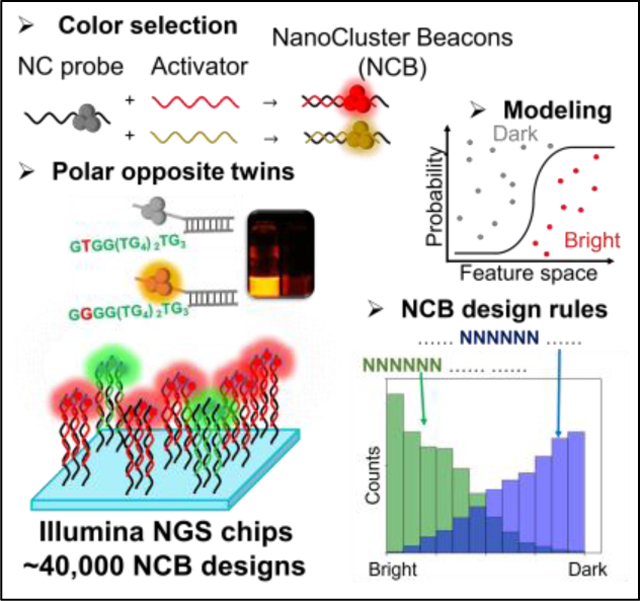
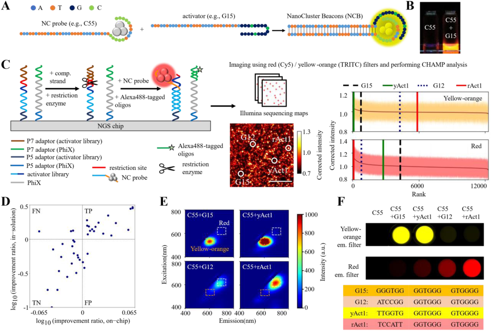
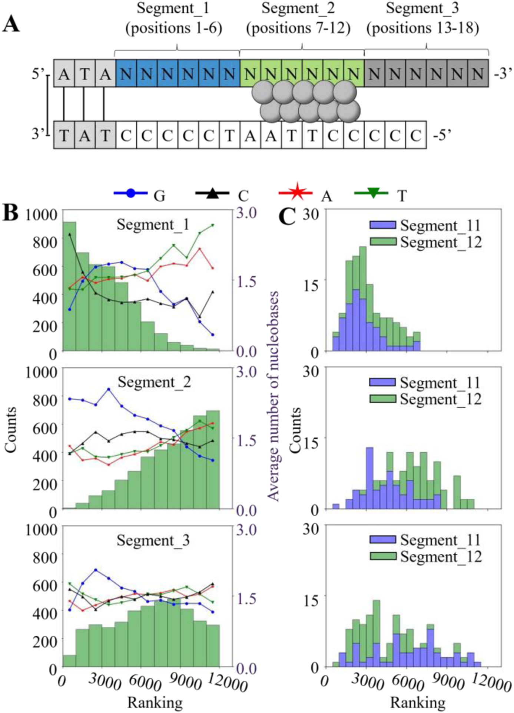
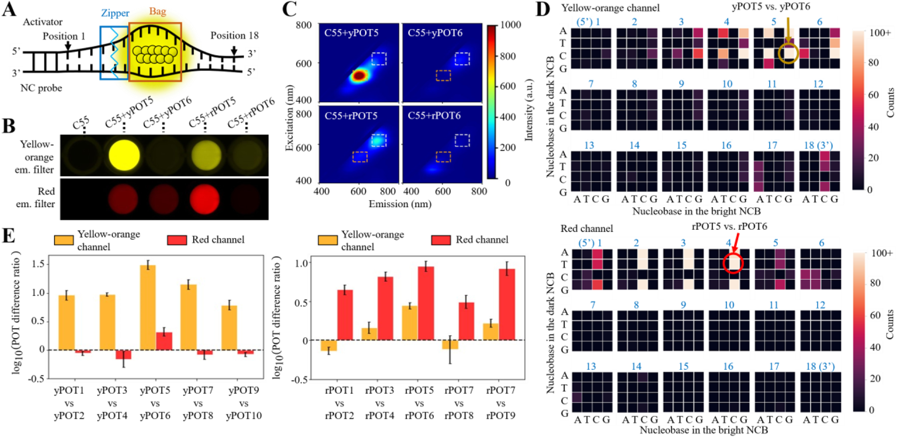
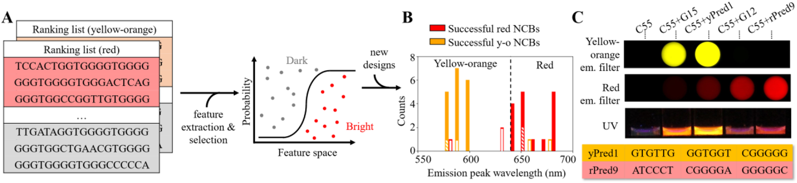

# Massively Parallel Selection of NanoCluster Beacons

**Yu-An Kuo, Cheulhee Jung, Yu-An Chen, Hung-Che Kuo, Oliver S. Zhao, Truong D. Nguyen, James R. Rybarski, Soonwoo Hong, Yuan-I Chen, Dennis C. Wylie, John A. Hawkins, Jada N. Walker, Samuel W. Shields, Jennifer S. Brodbelt, Jeffrey T. Petty, Ilya J. Finkelstein, and Hsin-Chih Yeh**

*Advanced Materials*, Volume 34, Issue 41, e2204957 (2022)

**DOI:** [10.1002/adma.202204957](https://doi.org/10.1002/adma.202204957)

---

## Table of Contents

- [Abstract](#abstract)
- [1. Introduction](#1-introduction)
- [2. Results](#2-results)
- [3. Discussion](#3-discussion)
- [4. Conclusion](#4-conclusion)
- [5. Experimental Section](#5-experimental-section)
- [Acknowledgements](#acknowledgements)

---
##  Abstract
NanoCluster Beacons (NCBs) are multicolor silver nanocluster probes whose fluorescence can be activated or tuned by a proximal DNA strand called the activator. While a single-nucleotide difference in a pair of activators can lead to drastically different activation outcomes, termed the polar opposite twins (POTs), it is difficult to discover new POT-NCBs using the conventional low-throughput characterization approaches. Here we report a high-throughput selection method that takes advantage of repurposed next-generation-sequencing (NGS) chips to screen the activation fluorescence of ~40,000 activator sequences. We find the nucleobases at positions 7–12 of the 18-nucleotide-long activator are critical to creating bright NCBs and positions 4–6 and 2–4 are hotspots to generate yellow-orange and red POTs, respectively. Based on these findings, we propose a “zipper bag model” that could explain how these hotspots lead to the creation of distinct silver cluster chromophores and alter the chromophore chemical yields. Combining high-throughput screening with machine learning algorithms, we establish a pipeline to design bright and multicolor NCBs _in silico_.
**Keywords:** NanoCluster Beacons, silver nanoclusters, fluorescent nanomaterials, high-throughput screening, next-generation sequencing
##  Graphical Abstract

We screen ~40,000 distinct NanoCluster Beacons (NCBs) on repurposed next-generation sequencing chips and identify new NCBs that outperform the known best NCBs. We observe dramatic fluorescence changes by substituting a single nucleotide in an NCB, which could be explained by our proposed zipper-bag model. Combining the chip-based high-throughput screening with machine learning algorithms, we successfully design bright and multicolor NCBs _in silico_.
---
##  1. Introduction
Activatable and multicolor fluorescent probes are indispensable tools in analytical chemistry and quantitative biology as they enable sensitive detection of analytes and diagnostic imaging of biomarkers in complex environments.[[1](https://pmc.ncbi.nlm.nih.gov/articles/PMC9588665/#R1)] Whereas activatable probes have greatly simplified the assays by eliminating the need to remove unbound probes, the development of new activatable probes is largely constrained by the scarce activation mechanisms (e.g., FRET), the limited activation colors (e.g., existing FRET pairs) and the poor enhancement ratios (e.g., 10- to 60-fold for a typical molecular beacon).[[2](https://pmc.ncbi.nlm.nih.gov/articles/PMC9588665/#R2)] NanoCluster Beacons (NCBs)[[3](https://pmc.ncbi.nlm.nih.gov/articles/PMC9588665/#R3)] are a unique class of activatable probes as they provide a palette of activation colors from the same dark origin[[4](https://pmc.ncbi.nlm.nih.gov/articles/PMC9588665/#R4)] (not via FRET) and achieve fluorescence enhancement ratios as high as 1,500[[5](https://pmc.ncbi.nlm.nih.gov/articles/PMC9588665/#R5)] to 2,400-fold.[[6](https://pmc.ncbi.nlm.nih.gov/articles/PMC9588665/#R6)] The core of an NCB is a few-atom silver nanocluster[[7](https://pmc.ncbi.nlm.nih.gov/articles/PMC9588665/#R7)] (e.g., Ag8, Ag10 or Ag16) whose fluorescence can be tuned by its surrounding nucleobases.[[7b](https://pmc.ncbi.nlm.nih.gov/articles/PMC9588665/#R7), [7c](https://pmc.ncbi.nlm.nih.gov/articles/PMC9588665/#R7), [8](https://pmc.ncbi.nlm.nih.gov/articles/PMC9588665/#R8)] To create an NCB, a dark AgNC is first synthesized in a C-rich DNA host (termed the NC probe), and a G-rich overhang (termed the activator) is brought into close proximity of the AgNC (via target-probe hybridization, [Figure S1](https://pmc.ncbi.nlm.nih.gov/articles/PMC9588665/#SD1)) to activate its fluorescence ([Figure 1A](https://pmc.ncbi.nlm.nih.gov/articles/PMC9588665/#F1)–[B](https://pmc.ncbi.nlm.nih.gov/articles/PMC9588665/#F1)).[[3](https://pmc.ncbi.nlm.nih.gov/articles/PMC9588665/#R3)–[5](https://pmc.ncbi.nlm.nih.gov/articles/PMC9588665/#R5), [8a](https://pmc.ncbi.nlm.nih.gov/articles/PMC9588665/#R8), [8d](https://pmc.ncbi.nlm.nih.gov/articles/PMC9588665/#R8)] Being a low-cost probe that can be easily prepared in a single-pot reaction at room temperature,[[7a](https://pmc.ncbi.nlm.nih.gov/articles/PMC9588665/#R7)] NCBs have been applied to the detection of nucleic acids,[[8a](https://pmc.ncbi.nlm.nih.gov/articles/PMC9588665/#R8), [8d](https://pmc.ncbi.nlm.nih.gov/articles/PMC9588665/#R8), [9](https://pmc.ncbi.nlm.nih.gov/articles/PMC9588665/#R9)] proteins,[[10](https://pmc.ncbi.nlm.nih.gov/articles/PMC9588665/#R10)] small molecules,[[11](https://pmc.ncbi.nlm.nih.gov/articles/PMC9588665/#R11)] enzyme activities[[8c](https://pmc.ncbi.nlm.nih.gov/articles/PMC9588665/#R8)] and cancer cells.[[12](https://pmc.ncbi.nlm.nih.gov/articles/PMC9588665/#R12)]
***Figure 1***.

Massively parallel selection of NanoCluster Beacons (NCBs) using _MiSeq_ chips. A) The interactions between a silver nanocluster (AgNC, left) and a proximal guanine-rich activator (middle) activate the fluorescence of AgNC by hundreds to thousands fold, creating an activated NCB (right). Here, a common C55 nanocluster (NC) probe is used for NCB selection and optimization. G15 is the canonical activator for yellow-orange NCB. B) C55 NC probe before and after activation by G15 activator, under UV excitation (365 nm). C) Workflow of our high-throughput NCB selection on a next-generation sequencing chip (NGS; _MiSeq_ , Illumina). After sequencing a library of activators (> 12,000) on the _MiSeq_ chip, unwanted adapter sequence above the activator was cleaved by a restriction enzyme. The Alexa488-tagged fiducial marker probes and the C55 probes were then injected into the chip to hybridize with the PhiX markers and the library, and imaged sequentially under an epi-fluorescence microscope. A custom bioinformatics and imaging processing pipeline was employed to identify activator sequences behind each activated NCB spot. After ranking all activators based on their median intensity (baseline corrected) on the chip surface, we could clearly differentiate strong activators from weak ones in the yellow-orange (Ex/Em: 535/50, 605/70 nm) and red (Ex/Em: 620/60, 700/75 nm) emission channels. Here G15 and G12 were the standards (the known best NCBs) for the yellow-orange and red NCB comparisons, respectively. G15 and G12 were both ranked within top 7% among the yellow-orange and red NCBs in library_1. D) Twenty activators from the 827 activators that were brighter than G12 (ranked 828th) and twenty activators from the 11,458 activators that were darker than G12 were investigated in test tubes using traditional florometry. The _MiSeq_ results were 85% accurate in both true positive (TP) and true negative (TN) selections. Definition of the improvement ratio can be found in the [methods](https://pmc.ncbi.nlm.nih.gov/articles/PMC9588665/#SD1). E) 2D spectra of the four representative NCBs in the yellow-orange (orange dashed box) and red (white dashed box) emission channels. Through florometry characterization, we found yAct1 2.03-fold brighter than G15 and rAct1 2.94-fold brighter than G12. Intensities were calculated based on a volumetric integral shown in [Figure S2](https://pmc.ncbi.nlm.nih.gov/articles/PMC9588665/#SD1). F) Plate-reader images acquired using yellow-orange (top) and red (bottom) excitation/emission filter sets, and the sequences of the four representative bright NCBs.
Whereas new applications of NCBs are emerging across a broad range of disciplines, it is unclear what sequence features of the activators ultimately control the enhancement ratio and activation color of an NCB. To answer this fundamental question and to unleash the power of NCB in biosensing, we design and study “polar opposite twin” NCBs (hereafter, denoted as POT-NCBs). POTs are similar in appearance (i.e., sequence), but with very different personalities. In NCBs, POTs refer to a pair of NCBs that differ only by a single nucleotide in their activators, but have drastically distinct activation intensities or colors. Whereas POTs hold the key to understanding the NCB activation processes, there is no effective way to rapidly scan the vast activator sequence space and identify the most extreme POT-NCBs.
Here we repurpose the next-generation sequencing (NGS) chips for high-throughput screening of fluorescent nanomaterials. In a single experiment, more than 104 activator mutations can be evaluated based on their capabilities in fluorescence activation of a common NC probe (C55 in [Figure 1A](https://pmc.ncbi.nlm.nih.gov/articles/PMC9588665/#F1)). Although the fluorescence properties of tens to hundreds of silver nanocluster species templated in short DNA strands can be studied in DNA microarrays[[13](https://pmc.ncbi.nlm.nih.gov/articles/PMC9588665/#R13)] and robotic plates,[[8b](https://pmc.ncbi.nlm.nih.gov/articles/PMC9588665/#R8)] less than 3,000 DNA hosts have been investigated as of today using these methods. While NGS chips are repurposed for studying protein-nucleic acid interactions,[[14](https://pmc.ncbi.nlm.nih.gov/articles/PMC9588665/#R14)] they have never been used for study, selection, and optimization of fluorescent nanomaterials. By screening more than 40,000 activator sequences on three Illumina _MiSeq_ chips, we not only discover new NCBs that are brighter than the known best NCBs (G15 and G12) but also identify the positions of nucleobases that are key to stabilizing bright AgNC chromophores (termed the critical zone). In the search for the most extreme POTs, the chip platform helps pinpoint the single-nucleotide substitution hotspots for generating yellow-orange and red POT-NCBs, reaching 31-fold and 9-fold differences in the enhancement ratios, respectively (563 vs. 18 for a pair of yellow-orange POTs and 285 vs. 32 for a pair of red POTs). Based on the findings of the critical zone for hosting bright chromophores (positions 7–12) and the hotspots for generating POTs (positions 4–6 for yellow-orange POTs and positions 2–4 for red POTs), we propose a “zipper bag model” that could explain how POT hotspots lead to the creation of distinct AgNC chromophores and alter the chromophore chemical yields. In addition, with proper selection of the sequence features, we build machine learning models that can design yellow-orange and red NCBs _in silico_. NCBs designed using these tools are 8.5 and 2 times more likely to be bright yellow-orange and red, respectively, as compared to the ones with random activator sequences. Our high-throughput screening and machine learning design pipeline is not only accelerating the discovery of new NCBs for diverse applications, but also providing insights into the chemical yield and the emitter brightness controlled by the sequence features.
---
##  2. Results
### 2.1. High-throughput selection of red and yellow-orange NCBs on NGS chips
In our first library design (library_1), the 18-nt-long canonical activator G15[[3](https://pmc.ncbi.nlm.nih.gov/articles/PMC9588665/#R3)–[4](https://pmc.ncbi.nlm.nih.gov/articles/PMC9588665/#R4), [8a](https://pmc.ncbi.nlm.nih.gov/articles/PMC9588665/#R8), [8d](https://pmc.ncbi.nlm.nih.gov/articles/PMC9588665/#R8)] (GGGTGG GGTGGG GTGGGG) was divided into three 6-nt-long segments, and each segment was separately randomized to create 3×46−2 = 12,286 activator mutations (two were G15 duplicates in the 3×46 combinations, [Table S1](https://pmc.ncbi.nlm.nih.gov/articles/PMC9588665/#SD1) and [Methods](https://pmc.ncbi.nlm.nih.gov/articles/PMC9588665/#SD1)). This approach significantly reduced the library size from 418 (the entire ligand composition space) down to ~104 in a single experiment. After mixing with the fiducial markers (PhiX), the library sequences were immobilized, bridge amplified and sequenced on a Illumina _MiSeq_ chip. As the sequencing-needed barcodes and adapters (i.e., SP2/barcode/P7 adapter, [Table S1](https://pmc.ncbi.nlm.nih.gov/articles/PMC9588665/#SD1)) could suppress or alter the NCB fluorescence ([Figure S3](https://pmc.ncbi.nlm.nih.gov/articles/PMC9588665/#SD1)), they were removed using a restriction enzyme, leaving behind 20-nt-long activators (the library) that were only 2 nt (a pair of CG dinucleotides) longer than the activators used in the traditional low-throughput test-tube selections[[3](https://pmc.ncbi.nlm.nih.gov/articles/PMC9588665/#R3)–[4](https://pmc.ncbi.nlm.nih.gov/articles/PMC9588665/#R4), [8a](https://pmc.ncbi.nlm.nih.gov/articles/PMC9588665/#R8), [8d](https://pmc.ncbi.nlm.nih.gov/articles/PMC9588665/#R8)] ([Figure 1C](https://pmc.ncbi.nlm.nih.gov/articles/PMC9588665/#F1) and [Table S1](https://pmc.ncbi.nlm.nih.gov/articles/PMC9588665/#SD1)). After enzymatic cleavage, the quality of the library was checked by staining the library with an Atto647N-labeled probe, before using the library for NCB selections ([Figure S4](https://pmc.ncbi.nlm.nih.gov/articles/PMC9588665/#SD1)).
We first aimed to discover new activators that light up the common C55 NC probe (CCCCCTTAATCCCCC, which hosts a dark AgNC) more intensely than G15 in yellow-orange emission (within 570–640 nm). We also searched for activators that give distinct emission colors (e.g., red emission within 663–738 nm). The yellow-orange and the red emissions here were simply defined by the filter cubes (i.e., TRITC and Cy5) commonly used for fluorescence imaging. Our color channel definitions were different from those used by other AgNC researches,[[15](https://pmc.ncbi.nlm.nih.gov/articles/PMC9588665/#R15)] where the color definitions were due to some structural factors. Once the complementary AT sequences on the C55 probe and the activators hybridized, AgNC emission developed.[[4](https://pmc.ncbi.nlm.nih.gov/articles/PMC9588665/#R4)–[5](https://pmc.ncbi.nlm.nih.gov/articles/PMC9588665/#R5)] In the traditional test-tube experiments, the NC probe-activator mixtures were heated to 90–95°C for a minute and gradually cooled down to room temperature to allow hybridzation.[[3](https://pmc.ncbi.nlm.nih.gov/articles/PMC9588665/#R3)–[4](https://pmc.ncbi.nlm.nih.gov/articles/PMC9588665/#R4)] On the _MiSeq_ chip, a constant temperature of 40°C was maintained to enable hybridization ([Figure S6](https://pmc.ncbi.nlm.nih.gov/articles/PMC9588665/#SD1); [Methods](https://pmc.ncbi.nlm.nih.gov/articles/PMC9588665/#SD1)). This relatively low hybridization temperature extended the life of the chip, allowing us to go through at least 20 rounds of activation experiments on a single chip (hybridized with C55 probes, washed and imaged, and then removed C55 probes using an alkaline solution) without showing any degradation, thus providing highly reproducible selection results (Spearman’s ρ = 0.93 ± 0.005 for the red NCBs and 0.88 ± 0.024 for the yellow-orange NCBs, [Figure S12](https://pmc.ncbi.nlm.nih.gov/articles/PMC9588665/#SD1)–[S13](https://pmc.ncbi.nlm.nih.gov/articles/PMC9588665/#SD1)). We emphasize that when using 40°C and 40 minutes for NCB hybridization in test tubes, the resulting fluorescence activation was indistinguishable from that carried out at 90 °C for one minute ([Figure S16](https://pmc.ncbi.nlm.nih.gov/articles/PMC9588665/#SD1)–[S17](https://pmc.ncbi.nlm.nih.gov/articles/PMC9588665/#SD1) and [Table S3](https://pmc.ncbi.nlm.nih.gov/articles/PMC9588665/#SD1)–[S4](https://pmc.ncbi.nlm.nih.gov/articles/PMC9588665/#SD1)).
After injecting the common C55 NC probes into the _MiSeq_ chip, the chip was scanned using a wide-field fluorescence microscope equipped with a metal halide illuminator, a sCMOS camera and an xyz translation stage. The activated NCBs were sequentially imaged using the filter cubes designed for conventional red emitters (e.g., Cy5, Ex/Em: 620/60, 700/75 nm) and yellow-orange emitters (e.g., TRITC, Ex/Em: 535/50, 605/70 nm). These two filter cubes were selected due to their popularity in fluorescence imaging. A custom bioinformatics and imaging processing pipeline[[14d](https://pmc.ncbi.nlm.nih.gov/articles/PMC9588665/#R14)] was employed to identify activator sequences behind each activated NCB spot ([Figure 1C](https://pmc.ncbi.nlm.nih.gov/articles/PMC9588665/#F1)). By ranking the activators based on their median intensity (baseline corrected; [Methods](https://pmc.ncbi.nlm.nih.gov/articles/PMC9588665/#SD1)) on the chip surface (each activator had 457 ± 308 polonies on the _MiSeq_ chip; [Methods](https://pmc.ncbi.nlm.nih.gov/articles/PMC9588665/#SD1)), we could clearly distinguish strong activators from weak activators in the two emission channels ([Figure 1C](https://pmc.ncbi.nlm.nih.gov/articles/PMC9588665/#F1) right).
Compared to other high-throughput screening methods that rely on fluorescence from single molecules for characaterization,[[16](https://pmc.ncbi.nlm.nih.gov/articles/PMC9588665/#R16)] photobleaching is not a severe issue in our approach, as each activator polony contains hundreds of activated NCBs. Polony is a contraction of “polymerase colony,” which is a small colony of DNA amplified from a library sequence. By employing an auto-scan algorithm and shutter control ([Methods](https://pmc.ncbi.nlm.nih.gov/articles/PMC9588665/#SD1)), the excitation dose to each polony is precisely regulated, avoiding any uneven photobleaching and ensuring consistent imaging results. By acquiring a fluorescence image every 200 ms, an intensity time trace of each polony is obtained, which can be fitted with a single-exponential decay. After one second of wide-field illumination (~10 W/cm2), polony intensity decreases by ~20% at most ([Figure S10](https://pmc.ncbi.nlm.nih.gov/articles/PMC9588665/#SD1)).
Based on the chip screening results, we randomly select 20 activators from the 827 activators that are brighter than G12 (ranked 828th) and 20 activators from the 11,458 activators that are darker than G12 for further investigation in test tubes by fluorometry. Using the G12 activator (ATCCGGGGTGGGGTGGGG) as the standard for red NCB comparison, the _MiSeq_ chip screening results were 85% accurate in both true positive and true negative selections (brighter or darker than G12 in chip screening and confirmed in fluorometry, [Figure 1D](https://pmc.ncbi.nlm.nih.gov/articles/PMC9588665/#F1), [Figure S14](https://pmc.ncbi.nlm.nih.gov/articles/PMC9588665/#SD1)–[S15](https://pmc.ncbi.nlm.nih.gov/articles/PMC9588665/#SD1), and [Table S2](https://pmc.ncbi.nlm.nih.gov/articles/PMC9588665/#SD1)). In particular, rAct1 (TCCATTGGTGGGGTGGGG) was found 2.94-fold brighter than G12 in the red channel (enhancement ratios were 1,292 vs. 439, [Figure 1E](https://pmc.ncbi.nlm.nih.gov/articles/PMC9588665/#F1), [Figure S14](https://pmc.ncbi.nlm.nih.gov/articles/PMC9588665/#SD1) and [Table S2](https://pmc.ncbi.nlm.nih.gov/articles/PMC9588665/#SD1)). We then evaluated the “spectral purity” of selected NCBs by computing the intensity ratio between the two colors. For the selected bright red NCBs, 70% of them were spectrally pure in red emission as their integrated intensity under the red window (663–738 nm) was at least 3.5-fold larger than that under the yellow-orange window (570–640 nm). When comparing the chip screening results with the test-tube results, a coefficient of determination of 0.50 was obtained ([Figure 1D](https://pmc.ncbi.nlm.nih.gov/articles/PMC9588665/#F1)). We noticed the intensity differences found on _MiSeq_ chips were substantially smaller than those found in test tubes (e.g., 1.20-fold red-emission difference was found between rAct1 and G12 NCBs on a _MiSeq_ chip, but it became 2.94-fold in test tubes). The underestimation was attributed to the relatively higher fluorescence background on _MiSeq_ chips and the variations in polony numbers among the library sequences (for instance, ~240 activators had less than 30 polonies in library_1). Out of the twelve yellow-orange candidates, we found yAct1 (TTGGTGGGTGGGGTGGGG) 2.03-fold brighter than G15 (the standard for yellow-orange NCB comparison) in activating C55 in the yellow-orange channel (enhancement ratios were 1125 vs. 553, [Figure S17](https://pmc.ncbi.nlm.nih.gov/articles/PMC9588665/#SD1) and [Table S4](https://pmc.ncbi.nlm.nih.gov/articles/PMC9588665/#SD1)). We emphasize that the small-scale investigations carried out in test tubes, such as single-nucleotide substitutions from G15 at each nucleobase position (totally 3×18 = 54 variants), would lead to an activator that is only 44% brighter than G15 ([Figure S18](https://pmc.ncbi.nlm.nih.gov/articles/PMC9588665/#SD1)).
### 2.2. Identification of critical nucleobases in stabilizing bright AgNC chromophores
The screening results from library_1 ([Table 1](https://pmc.ncbi.nlm.nih.gov/articles/PMC9588665/#T1)) clearly indicated that segment_2 prefers to be conserved (GGTGGG) in order to maintain NCB brightness ([Figure 2B](https://pmc.ncbi.nlm.nih.gov/articles/PMC9588665/#F2)). In contrast, randomizing segment_1 still produced many bright red NCBs, especially when segment_1 became C-rich. The effect of segment_3 was diverse, suggesting an indirect activation role. The 6-segment interrogation further revealed that segment_22 (positions 10–12) is more important than segment_21 (positions 7–9) in creating bright red NCBs ([Figure 2C](https://pmc.ncbi.nlm.nih.gov/articles/PMC9588665/#F2) and [Figure S20](https://pmc.ncbi.nlm.nih.gov/articles/PMC9588665/#SD1)). Independent investigations using library_2 and library_3 (~28,000 frame-shifted activators, [Table S1](https://pmc.ncbi.nlm.nih.gov/articles/PMC9588665/#SD1)) also confirmed that the nucleobases in positions 10–12 are critical in C55 activation ([Figure S20](https://pmc.ncbi.nlm.nih.gov/articles/PMC9588665/#SD1)). These results indicated that bright AgNC chromophores are most likely “clamped” by the two strands at positions 7–12 ([Figure 2A](https://pmc.ncbi.nlm.nih.gov/articles/PMC9588665/#F2)), possibly forming silver-mediated pairs between the two strands.[[17](https://pmc.ncbi.nlm.nih.gov/articles/PMC9588665/#R17)]
#### Table 1.
Sequence designs in library_1. In library_1, the 18-nt-long canonical activator G15 was divided into three 6-nt-long segments and each segment was separately randomized, creating a library with total 12,286 activators. “N” represents the canonical nucleobase A, T, G and C. Consequently, each of the segment_1, segment_2 and segment_3 comprised of 4,096 variants, while each of the segment_11 to segment_32 comprised of 64 variants. Red-colored Ns represent the randomized nucleobases in Segment_1, Segment_2 and Segment_3. Blue-colored Ns represent the randomized nucleobases in Segment_11, Segment_21 and Segment_31. Green-colored Ns represent the randomized nucleobases in Segment_12, Segment_22 and Segment_32.
Canonical | 5’ – GGGTGGGGTGGGGTGGGG – 3’  
---|---  
Segment_1, library_1 |  **NNNNNN** GGTGGGGTGGGG | Segment_11 |  **NNN** TGGGGTGGGGTGGGG  
Segment_12 | GGG**NNN** GGTGGGGTGGGG  
Segment_2, library_1 | GGGTGG**NNNNNN** GTGGGG | Segment_21 | GGGTGG**NNN** GGGGTGGGG  
Segment_22 | GGGTGGGGT**NNN** GTGGGG  
Segment_3, library_1 | GGGTGGGGTGGG**NNNNNN** | Segment_31 | GGGTGGGGTGGG**NNN** GGG  
Segment_32 | GGGTGGGGTGGGGTG**NNN**  
[Open in a new tab](https://pmc.ncbi.nlm.nih.gov/articles/PMC9588665/table/T1/)
#### Figure 2.

Influence of activator mutations on red NCB brightness. A) Schematic of NCB construct and definition of nucleobase positions in the activator. B) Histograms of the brightness rankings corresponding to the mutated segments and the average numbers of the 4 nucleobases in the mutated segments. The library_1 results clearly indicated that, to make a bright NCB, segment_2 (the middle 6 nucleobases, positions 7–12) prefers the canonical G-rich sequence, as randomizing segment_2 (while keeping segment_1 and _3 canonical) leads to many low-ranking NCBs in both emission channels. Each histogram here contained 4,096 activators. C) Stacked histograms further demonstrated that segment_22 (positions 10–12) is more important than segment_21 (positions 7–9) in creating bright red NCBs.
Drawing from the [Table 1](https://pmc.ncbi.nlm.nih.gov/articles/PMC9588665/#T1) and [Figure 2](https://pmc.ncbi.nlm.nih.gov/articles/PMC9588665/#F2) results, one possible design rule for creating bright red NCBs on C55 is to develop an activator with a C-rich segment_1, a GC-rich segment_21, a G-rich segment_22, and a TC-rich segment_3. Nevertheless, the activator CCCCCCGCGGGGTTTCCC (termed G5) actually had a low red enhancement ratio (39, as compared to 439 for G12; [Figure S22](https://pmc.ncbi.nlm.nih.gov/articles/PMC9588665/#SD1) and [Table S9](https://pmc.ncbi.nlm.nih.gov/articles/PMC9588665/#SD1)). This result clearly indicated that segments do not work alone – cooperativities among the segments determine the activation color and intensity of an NCB. Whereas previous investigations showed that more guanines in the activator generally lead to brighter red emission,[[3](https://pmc.ncbi.nlm.nih.gov/articles/PMC9588665/#R3)] our large-scale investigations revealed a different design rule – brighter red NCBs can be achieved with fewer numbers of guanines (e.g., 10G_5 in [Figure S23](https://pmc.ncbi.nlm.nih.gov/articles/PMC9588665/#SD1) and [Table S5](https://pmc.ncbi.nlm.nih.gov/articles/PMC9588665/#SD1)). As the results from our high-throughput screening could not be easily transformed into simple design rules, we trained machine learning algorithms on the dataset and used them to design bright NCBs _in silico_.
### 2.3. Discovery of polar opposite twins using NGS chips
Taking advantage of the chip screening platform, we searched for POT-NCBs that have the most extreme color or intensity differences ([Figure 3A](https://pmc.ncbi.nlm.nih.gov/articles/PMC9588665/#F3)–[C](https://pmc.ncbi.nlm.nih.gov/articles/PMC9588665/#F3)). Although NCBs were previously used for single-nucleotide polymorphism detection,[[4](https://pmc.ncbi.nlm.nih.gov/articles/PMC9588665/#R4), [8a](https://pmc.ncbi.nlm.nih.gov/articles/PMC9588665/#R8)] only tens of activators were tested, providing little information on the rules to design POTs. In contrast, library_1 alone contained more than 110,000 pairs of twin NCBs ([Figure S24](https://pmc.ncbi.nlm.nih.gov/articles/PMC9588665/#SD1)), where the top 2,000 pairs were readily candidates for POTs. Upon examining these 2,000 pairs of twin NCBs ([Figure 3D](https://pmc.ncbi.nlm.nih.gov/articles/PMC9588665/#F3)), it was clear that the nucleobases in positions 4–6 are critical for creating yellow-orange POTs (e.g., bright (x-axis)→dark (y-axis) conversion by G/T→C/A substitution at position 5 and G→C substitution at positions 4 and 6), while the positions 2–4 are critical for creating red POTs (bright→dark conversion by C→ATG substitution). Fifteen top POT pairs were further investigated in test tubes. The most extreme yellow-orange and red POTs had 31-fold (yPOT5-yPOT6 with G→C substitution at position 5) and 9-fold (rPOT5-rPOT6 with C→T substitution at position 4) differences in their enhancement ratios, respectively ([Figure 3E](https://pmc.ncbi.nlm.nih.gov/articles/PMC9588665/#F3)). For the ease of comparison, we termed the difference in the enhancement ratios in a pair of POT the “POT difference ratio” ([Figure S25](https://pmc.ncbi.nlm.nih.gov/articles/PMC9588665/#SD1)–[S26](https://pmc.ncbi.nlm.nih.gov/articles/PMC9588665/#SD1) and [Table S7](https://pmc.ncbi.nlm.nih.gov/articles/PMC9588665/#SD1)–[S8](https://pmc.ncbi.nlm.nih.gov/articles/PMC9588665/#SD1)), where the pair with the largest POT difference ratio is the most extreme POT.
#### Figure 3.

_S_ ubstitution hotspots to generate polar opposite twins (POTs) revealed by _MiSeq_ chip selection. A) Schematic of the zipper bag model. The blue box represents the “zipper” location (e.g., positions 4–6 for yellow-orange POTs) and the gray box represents the “bag” location (i.e., the critical zone at positions 7–12). When the zipper does not seal well, the bag is leaky, thus leading to a low chemical yield and dimmer NCB. B) Plate-reader images acquired using yellow-orange (top) and red (bottom) excitation/emission filter sets and the sequences of the representative POTs. Large differences in fluorescence enhancement ratios were seen in these twin NCBs (C55+yPOT5 vs. C55+yPOT6 for yellow-orange channel, and C55+rPOT5 vs. C55+rPOT6 for red channel), making them POTs. yPOT5: CAGTGAGGTGGGGTGGGG; yPOT6: CAGTCAGGTGGGGTGGGG; rPOT5: AATCCTGGTGGGGTGGGG; rPOT6: AATTCTGGTGGGGTGGGG. C) 2D spectra of the representative POTs in the yellow-orange (orange dashed box) and red (white dashed box) emission channels. D) Heat maps of the top 2,000 twin NCB pairs in library_1. Here the x-axis and the y-axis represent bright to dark conversion in these twin NCBs. These heat maps clearly indicated that the nucleobases in positions 4–6 are critical for creating yellow-orange POTs, while the positions 2–4 are critical for creating red POTs. E) The POT difference ratios of five representative yellow-orange (left) and red (right) pairs of POTs in the two emission channels. Through fluorometry characterization, the yPOT5-yPOT6 pair and the rPOT5-rPOT6 pair were identified as the most extreme yellow-orange and red POTs, respectively, reaching POT difference ratios as high as 31 and 9. Definition of the POT difference ratio can be found in the [methods](https://pmc.ncbi.nlm.nih.gov/articles/PMC9588665/#SD1). Error bars: mean ± s.d. in logarithmic scale, with 3 repeats for each pair of POTs.
The POT difference ratio reflected the sample brightness difference at the ensemble level, which is equal to the product of “chromophore chemical yield ratio” and “single-emitter brightness ratio”. Using fluorescence correlation spectroscopy (FCS),[[18](https://pmc.ncbi.nlm.nih.gov/articles/PMC9588665/#R18)] we found the chromophore chemical yield of rPOT5 NCB 5.46-fold higher than that of rPOT6 NCB (24.41% vs. 4.47%), and the single-emitter brightness of rPOT5 1.64-fold higher than that of rPOT6 (5.67 kHz vs. 3.45 kHz, [Figure S27](https://pmc.ncbi.nlm.nih.gov/articles/PMC9588665/#SD1)). The product of the 5.46× chromophore chemical yield ratio and the 1.64× single-emitter brightness ratio was indeed the 9× POT difference ratio measured by fluorometry. Similarly, the chromophore chemical yield of yPOT5 NCB was 16.33-fold higher than that of yPOT6 NCB (25.80% vs. 1.58%) and the single-emitter brightness of yPOT5 NCB was 2.19-fold higher than that of yPOT6 NCB (7.04 kHz vs. 3.22 kHz, [Figure S28](https://pmc.ncbi.nlm.nih.gov/articles/PMC9588665/#SD1)). The product of the 16.33× chromophore chemical yield ratio and the 2.19× single-emitter brightness ratio was close to the 31× POT difference ratio measured at the ensemble level. Our investigation of POTs led to two important findings. First, the red AgNCs in rPOT5 and rPOT6 were actually different species as their excitation peak wavelengths (610 vs. 605 nm, [Figure S25A](https://pmc.ncbi.nlm.nih.gov/articles/PMC9588665/#SD1)), absorption spectra (a clear peak at 610 nm in rPOT5 NCBs spectrum but no clear peak in rPOT6 NCBs spectrum, [Figure S29C](https://pmc.ncbi.nlm.nih.gov/articles/PMC9588665/#SD1)), and single-emitter brightness were all different. Second, the chemical yield of AgNC chromophores could be significantly altered by substituting single nucleobases at positions (2–6 in [Figure 3D](https://pmc.ncbi.nlm.nih.gov/articles/PMC9588665/#F3)) outside the critical zone (7–12 in [Figure 2A](https://pmc.ncbi.nlm.nih.gov/articles/PMC9588665/#F2)). Based on these findings, we proposed a zipper bag model that could explain the mechanism behind POT formation ([Figure 3A](https://pmc.ncbi.nlm.nih.gov/articles/PMC9588665/#F3)).
---
##  3. Discussion
### 3.1. Investigation of the zipper bag model
In our zipper bag model, the bag is the critical zone (positions 7–12) that holds the AgNC chromophore while the zipper is the POT hotspot that seals the bag. A subtle change in the zipper can alter the sealing condition of the zipper bag, which perturbs the short-range ligand environment around the AgNC inside the bag and possibly changes its binding footprint with the bag ([Figure 3A](https://pmc.ncbi.nlm.nih.gov/articles/PMC9588665/#F3)). We have previously shown that by slightly shifting the position of the activator with respect to the NC probe, a new ligand environment can be created around the AgNC that alters its emission spectrum,[[8a](https://pmc.ncbi.nlm.nih.gov/articles/PMC9588665/#R8), [8d](https://pmc.ncbi.nlm.nih.gov/articles/PMC9588665/#R8)] and we believe such a nucleobase-AgNC interaction is within a short range (≤ 1 nm)[[8a](https://pmc.ncbi.nlm.nih.gov/articles/PMC9588665/#R8)]. When studying AgNC structures using 193 nm activated-electron photodetachment mass spectrometry (a-EPD MS), we have previously found two Ag10 clusters can be completely distinct chromophores due to very different binding footprints in their DNA hosts.[[19](https://pmc.ncbi.nlm.nih.gov/articles/PMC9588665/#R19)] The earlier structural studies by extended X-ray absorption fine structure (EXAFS) spectra complemented the a-EPD MS footprint results.[[7d](https://pmc.ncbi.nlm.nih.gov/articles/PMC9588665/#R7), [20](https://pmc.ncbi.nlm.nih.gov/articles/PMC9588665/#R20)] Here by using FCS, we further demonstrated that a change in zipper may result in not only a distinct AgNC chromophore in the bag but also a different chemical yield of the chromophore, thus providing a basis for POT formation.
Why are the zipper locations different for the yPOT5-yPOT6 pair (at position 5) and the rPOT5-rPOT6 pair (at position 4)? One possibility is red AgNC chromophores have higher silver stoichiometries and larger footprints in the bag, pushing the zipper locations (positions 2–4) further away from the bag (positions 7–12, [Figure S25B](https://pmc.ncbi.nlm.nih.gov/articles/PMC9588665/#SD1)). Using electrospray ionization mass spectrometry (ESI-MS), Gwinn’s group has previously shown a general trend for yellow chromophores having a smaller core (Ag10–Ag11) while red chromophores having a larger core (Ag14–Ag16).[[7c](https://pmc.ncbi.nlm.nih.gov/articles/PMC9588665/#R7)] According to their rod-shaped model,[[7b](https://pmc.ncbi.nlm.nih.gov/articles/PMC9588665/#R7)] red chromophores are expected to have larger footprints in their DNA hosts. However, in Gwinn _’_ s experiments, their AgNC chromophores are most likely stabilized inside dimers of 10-mers, whose ligand environments are different from our activator/NC probe systems.
To investigate the silver stoichiometries of the two major chromophores in our POT experiments, we purified yPOT5, yPOT6, rPOT5 and rPOT6 NCB samples using 20% native polyacrylamide gel electrophoresis (native PAGE) ([Figure S30](https://pmc.ncbi.nlm.nih.gov/articles/PMC9588665/#SD1); [Methods](https://pmc.ncbi.nlm.nih.gov/articles/PMC9588665/#SD1)) and analyzed the purified samples by ESI-MS ([Figure S31](https://pmc.ncbi.nlm.nih.gov/articles/PMC9588665/#SD1)). Since our NCB constructs were much larger (45-nt long for the NC probe strand and 48-nt long for the activator strand) than the constructs used in previous studies involving ESI-MS analysis[[7c](https://pmc.ncbi.nlm.nih.gov/articles/PMC9588665/#R7), [21](https://pmc.ncbi.nlm.nih.gov/articles/PMC9588665/#R21)] (10- to 26-nt-long), extensive cationic metal adduction during the ESI process prevented us from deciphering the exact silver stoichiometries in purified NCB samples. To circumvent this issue, an ion-pairing reagent, octylamine, was added to the ESI samples to suppress salt adduct formation.[[22](https://pmc.ncbi.nlm.nih.gov/articles/PMC9588665/#R22)] Although the number of adducts was reduced, the addition of octylamine destabilized the duplex NCB structures. This generated highly polydisperse MS spectra that only provided us with rough estimates of silver stoichiometries in NCB duplexes ([Figure S31](https://pmc.ncbi.nlm.nih.gov/articles/PMC9588665/#SD1)). Without knowing the exact silver stoichiometries and AgNC binding sites in a pair of POT, the proposed zipper bag model is just one of the many possibilities behind POT formation (see [Discussion](https://pmc.ncbi.nlm.nih.gov/articles/PMC9588665/#SD1) section in [Supplementary Information](https://pmc.ncbi.nlm.nih.gov/articles/PMC9588665/#SD1)). Our future work is to continue investigating binding footprints and silver stoichiometries in purified NCB samples.
### 3.2. _In silico_ design of bright NCBs using chip screening results and machine learning models
Since the results from our high-throughput screening ([Table 1](https://pmc.ncbi.nlm.nih.gov/articles/PMC9588665/#T1)) cannot be easily transformed into simple design rules, we take advantage of machine learning algorithms to classify NCBs and uncover sequence features that give bright NCBs. Machine learning approaches have previously helped identify sequence features in DNA hosts that preferentially stabilize bright AgNCs, establishing the first statistical model for rational design of AgNCs with desired colors.[[8b](https://pmc.ncbi.nlm.nih.gov/articles/PMC9588665/#R8), [15a](https://pmc.ncbi.nlm.nih.gov/articles/PMC9588665/#R15)] However, such a model was built upon the emission properties of ~2,000 AgNCs sandwiched between two identical strands (8-mers to 16-mers).[[15b](https://pmc.ncbi.nlm.nih.gov/articles/PMC9588665/#R15)] Our AgNCs were different, as each of them was stabilized within an 18-nt long activator and a 15-nt long C55. Although both robotic-well-plate studies[[15b](https://pmc.ncbi.nlm.nih.gov/articles/PMC9588665/#R15)] (2,000 short strands) and NGS screening (40,000 NCBs in this report) covered only a small fraction of the overall ligand composition spaces (10-mers and 18-mers, respectively), statistical models could be built based on these small fractions of data.
We extracted sequence features (which include motifs and motif locations) only from the bright activators in library_1. As the ranking of activators in the yellow-orange channel was quite different from that in the red channel ([Figure S32A](https://pmc.ncbi.nlm.nih.gov/articles/PMC9588665/#SD1)), we performed separate trainings on yellow-orange and red NCBs. Following the approach proposed by Copp and Gwinn,[[8b](https://pmc.ncbi.nlm.nih.gov/articles/PMC9588665/#R8), [15a](https://pmc.ncbi.nlm.nih.gov/articles/PMC9588665/#R15), [15b](https://pmc.ncbi.nlm.nih.gov/articles/PMC9588665/#R15)] the top 30% NCBs (3,600) were labeled as the “bright” class and the bottom 30% were labeled as the “dark” class. 339 and 567 features from the bright and dark classes in the yellow-orange channel (denoted as bright yellow-orange and dark yellow-orange features) and 402 and 1,164 features from the bright and dark classes in the red channel (denoted as bright red and dark red features) were separately identified by MERCI.[[23](https://pmc.ncbi.nlm.nih.gov/articles/PMC9588665/#R23)] To decrease the chance of overfitting, we further narrowed down to a set of the most discriminative features with 61 bright yellow-orange, 121 dark yellow-orange, 103 bright red and 112 dark red features using Weka[[24](https://pmc.ncbi.nlm.nih.gov/articles/PMC9588665/#R24)] ([Table S14](https://pmc.ncbi.nlm.nih.gov/articles/PMC9588665/#SD1)–[S15](https://pmc.ncbi.nlm.nih.gov/articles/PMC9588665/#SD1); [Methods](https://pmc.ncbi.nlm.nih.gov/articles/PMC9588665/#SD1)). A feature vector was employed to describe the location of each activator in the high-dimensional space for classification model development ([Figure 4A](https://pmc.ncbi.nlm.nih.gov/articles/PMC9588665/#F4)).
#### Figure 4.

_In silico_ design of bright yellow-orange and red NCBs based on machine learning results. A) From the chip selection results, we labeled the top 30% NCBs as ‘bright’ class and the bottom 30% as ‘dark’ class. The sequence features of these selected NCBs were then extracted by MERCI and selected by Weka. The resulting feature vectors thus defined the location of individual activators in the high-dimensional space. Several machine learning models were tested for activator classification, among which the logistic regression had the best performance. B) Forty new activators were designed _in silico_ and tested by fluorometry. Using 640 nm as the cutoff, the stacked histogram of NCB emission peaks showed two color bands. While three out of the 20 yellow-orange NCB candidates (y-o NCBs) showed low emission (enhancement ratio less than 66, [Table S11](https://pmc.ncbi.nlm.nih.gov/articles/PMC9588665/#SD1) and [Table S12B](https://pmc.ncbi.nlm.nih.gov/articles/PMC9588665/#SD1)) or red emission (achieving 85% test-tube validation accuracy), five out of the 20 red NCB candidates showed either low emission (enhancement ratio less than 145, [Table S10](https://pmc.ncbi.nlm.nih.gov/articles/PMC9588665/#SD1) and [Table S12A](https://pmc.ncbi.nlm.nih.gov/articles/PMC9588665/#SD1)) or yellow-orange emission peak. Hatched bars represent the failed designs with low emission. Empty bars represent the failed designs with wrong emission peaks. Dashed vertical line represents 640 nm. C) Plate-reader images acquired using yellow-orange (top) and red (bottom) excitation/emission filter sets, and the activator sequences of the two successfully predicted NCBs.
A number of models were established for classifying the chip screening results, based on algorithms such as logistic regression (LR), linear discriminant analysis (LDA), decision tree (DT), AdaBoost (ADA), and support vector machines (SVM) ([Table S13](https://pmc.ncbi.nlm.nih.gov/articles/PMC9588665/#SD1)). All models were built on “bright yellow-orange vs. dark yellow-orange” or “bright red vs. dark red” classification. To evaluate the model performance, we defined the accuracy of the model (Acc) as (TB + TD)/(TB + FB + TD + FD), where TB is the number of true predictions that the model makes for bright activators, TD and FD are the numbers of true and false dark predictions, and FB is the number of false bright predictions. In other words, Acc represented the fraction of test sequences that the model correctly identifies as “bright” or “dark” activators. We found the model built on LR has the best performance, achieving an average accuracy of 0.89 and 0.87 in the yellow-orange and red emission classification, respectively. In our model development process, the categorized dataset was divided into a training set (80% of the selected sequences) and a test set (20% of the selected sequences). The selection process iterated 5 times while rotating the training set and the test set, resulting in a 5-fold cross-validation (CV) that guarantees the model consistency ([Figure S32B](https://pmc.ncbi.nlm.nih.gov/articles/PMC9588665/#SD1)–[C](https://pmc.ncbi.nlm.nih.gov/articles/PMC9588665/#SD1)). As expected, the propensity of an activator to be “bright” is not only determined by having “bright” motifs within the activator but also by positioning these motifs at proper locations.
Separately, based on the most discriminative features identified by Weka,[[24](https://pmc.ncbi.nlm.nih.gov/articles/PMC9588665/#R24)] 1,000 bright yellow-orange and 1,000 bright red activator candidates were designed _in silico_ ([Figure S33](https://pmc.ncbi.nlm.nih.gov/articles/PMC9588665/#SD1); [Methods](https://pmc.ncbi.nlm.nih.gov/articles/PMC9588665/#SD1)). In the high-dimensional space, we employed the minimal “edit distance”[[15b](https://pmc.ncbi.nlm.nih.gov/articles/PMC9588665/#R15), [25](https://pmc.ncbi.nlm.nih.gov/articles/PMC9588665/#R25)] to identify the “closest” activator sequence in the library_1 dataset for each of the candidates. Consequently, when the closest library sequence was not among the top 200 bright activators screened, the candidate was discarded. Besides, when the candidate sequence had less than 3 or more than 5 single-base mutations, they were also discarded to restrict our search space. After going through these candidate refining steps, we were down to 100 bright yellow-orange and 54 bright red candidates. Among these candidates, the LR model classified 85 and 41 of them as bright yellow-orange and red activators, respectively. From these most promising candidates, 20 were randomly selected, synthesized, hybridized with the C55 probes in test tubes, and measured by a fluorometers.
Compared to the randomly generated activator sequences ([Figure S34](https://pmc.ncbi.nlm.nih.gov/articles/PMC9588665/#SD1) and [Table S9](https://pmc.ncbi.nlm.nih.gov/articles/PMC9588665/#SD1)), our design and classification pipeline produced new activators that were 8.5 times (85% vs. 10%) and 1.9 times (75% vs. 40%) more likely to be bright yellow-orange and red, respectively ([Figure S35](https://pmc.ncbi.nlm.nih.gov/articles/PMC9588665/#SD1)–[S36](https://pmc.ncbi.nlm.nih.gov/articles/PMC9588665/#SD1) and [Table S10](https://pmc.ncbi.nlm.nih.gov/articles/PMC9588665/#SD1)–[S11](https://pmc.ncbi.nlm.nih.gov/articles/PMC9588665/#SD1)). Besides, the average enhancement ratio of _in silico_ designed yellow-orange and red activators were 22 times and twice higher than that of random sequences, respectively ([Table S9](https://pmc.ncbi.nlm.nih.gov/articles/PMC9588665/#SD1)). Moreover, while all random sequences gave more or less red emission, our pipeline successfully produced NCBs with yellow-orange emission ([Figure 4B](https://pmc.ncbi.nlm.nih.gov/articles/PMC9588665/#F4)). In particular, among all bright candidates tested, we identified a new yellow-orange activator (yPred1: GTGTTGGGTGGTCGGGGG, with only 12 guanines) and a new red activator (rPred9: ATCCCTCGGGGAGGGGGC, with only 9 guanines) that were 2.13-fold and 1.30-fold brighter than the gold standards G15 and G12 in activating the C55 NC probe in test tubes, respectively ([Figure 4C](https://pmc.ncbi.nlm.nih.gov/articles/PMC9588665/#F4), [Table S10](https://pmc.ncbi.nlm.nih.gov/articles/PMC9588665/#SD1)–[S11](https://pmc.ncbi.nlm.nih.gov/articles/PMC9588665/#SD1)).
---
##  4. Conclusion
We have performed high-throughput screening on more than 40,000 activators using repurposed NGS chips. Not only did we discover new NCBs (yAct1 and rAct1) that are 2–3 times brighter than the known best NCBs (G15 and G12, [Figure 1](https://pmc.ncbi.nlm.nih.gov/articles/PMC9588665/#F1)), but we also identified a critical zone in the activator (positions 7–12) that stabilizes bright AgNC chromophores ([Figure 2](https://pmc.ncbi.nlm.nih.gov/articles/PMC9588665/#F2)). In the search for the most extreme POT-NCBs, the chip platform helped identify a red pair (rPOT5-rPOT6) and a yellow-orange pair (yPOT5-yPOT6) with POT difference ratios as high as 9 and 31, respectively ([Figure 3](https://pmc.ncbi.nlm.nih.gov/articles/PMC9588665/#F3)). By probing the NCBs at the near single-molecule level, we confirmed the observed brightness difference at the ensemble level is attributed to the differences in the single-emitter brightness and the chromophore chemical yield ([Figure S27](https://pmc.ncbi.nlm.nih.gov/articles/PMC9588665/#SD1)–[S28](https://pmc.ncbi.nlm.nih.gov/articles/PMC9588665/#SD1)). Based on the findings of the critical zone (positions 7–12) and the POT hotspots (positions 2–4 for the red POTs and positions 4–6 for the yellow-orange POTs), we proposed a zipper bag model that could explain how POT hotspots lead to the creation of distinct AgNC chromophores and alter the chromophore chemical yields ([Figure 3](https://pmc.ncbi.nlm.nih.gov/articles/PMC9588665/#F3)). We emphasize that our zipper bag model is only one of many possibilities. Further investigation on silver stoichiometries and AgNC footprints in purified NCBs using ESI-MS and a-EPD MS[[19](https://pmc.ncbi.nlm.nih.gov/articles/PMC9588665/#R19)] is necessary to prove the zipper bag model.
As the results from high-throughput screening could not be easily converted into simple rules for designing bright NCBs, we employed machine learning algorithms to classify the screening results and built a pipeline to design bright NCBs _in silico_. Forty new NCBs were generated by the pipeline, clearly showing two designated color bands ([Figure 4](https://pmc.ncbi.nlm.nih.gov/articles/PMC9588665/#F4)). We also found brighter NCBs could be achieved with fewer numbers of guanine bases in the activators. Although the overall sequence space investigated in this report (~40,000 variants) represents a small fraction of the entire 18-mer space (418 variants), our NGS platform has the scalability to broaden the search space by another one to three orders of magnitudes (by using a _NextSeq_ or _NovaSeq_ chip), thus leading to a more expansive machine learning model in the future.
Our chip screening platform can facilitate the development of new chemical sensors based on DNA-templated AgNCs[[26](https://pmc.ncbi.nlm.nih.gov/articles/PMC9588665/#R26)] or the study of other metal nanoclusters templated in DNA.[[27](https://pmc.ncbi.nlm.nih.gov/articles/PMC9588665/#R27)] The chemical repertoire of natural nucleic acids can be expanded by connecting functional moieties to the alkyne-modified C5 site on dU[[28](https://pmc.ncbi.nlm.nih.gov/articles/PMC9588665/#R28)], thus allowing us to study the interactions between a wide variety of functional moieties and AgNCs on NGS chips. The discoveries of critical zones and interaction hotspots lead to the zipper bag model, which provides us with a picture how surrounding nucleobases can interact with the AgNCs encapsulated in NCBs and control their chemical yields and emission properties. Moreover, the knowledge of POTs can be directly applied to design new sensors for single-nucleotide polymorphism detection. To our knowledge, this article is the first report that NGS chips are repurposed for high-throughput screening of fluorescent nanomaterials. Our high-throughput screening and machine-learning-based design pipeline is not only accelerating the discovery of new NCBs for diverse applications, but also providing insights into the chemical yield and the emitter brightness controlled by the sequence features. We anticipate new NCB-based sensors and new fluorescence barcodes will soon be developed based on the design strategy that we lay out in this report.
---
##  5. Experimental Section
### Statistical analysis:
Fluorescence images collected for high-throughput screening were first aligned using CHAMP program[[14d](https://pmc.ncbi.nlm.nih.gov/articles/PMC9588665/#R14)] and alignment results were further analyzed using customized Python script. Fluorimetry results were analyzed by customized Python script. POT results were expressed as mean ± standard deviation (SD) with 3 repeats. The statistical significance relating to NGS chip imaging results was performed by Mann-Whitney U-test. Differences were ranked significant when *P < 0.05, **P < 0.01, ***P < 0.001.

---
##  Acknowledgements
This work was supported by the Welch Foundation to J.S.B. (F-1155), H.-C.Y. (F-1833), and I.J.F (F-1808), the Texas 4000 to H.-C.Y., National Institutes of Health to H.-C.Y. and I.J.F. (GM129617), and National Science Foundation to H.-C.Y. (CBET2041345) and J.S.B. (CBET2029266), and a UT-Austin Catalyst Grant to I.J.F.

##  Data availability
CHAMP program is available at <https://github.com/finkelsteinlab/champ>. All other relevant raw/analyzed data are available from the corresponding authors upon reasonable request.

---

*Archived from [PubMed Central (PMC9588665)](https://pmc.ncbi.nlm.nih.gov/articles/PMC9588665/) on 2025-07-19.*
