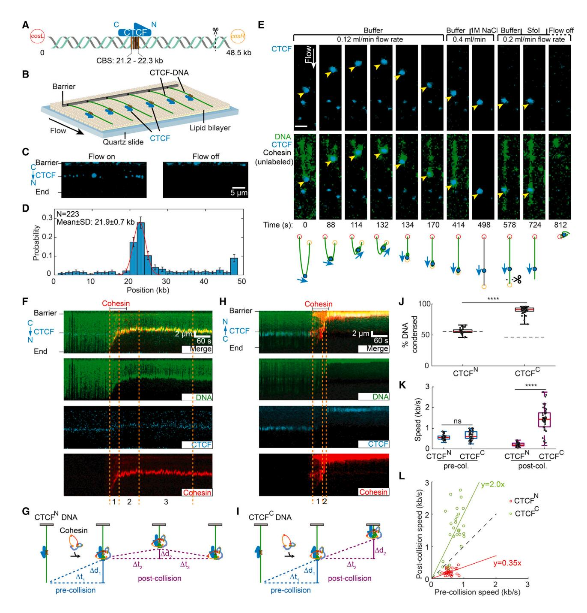
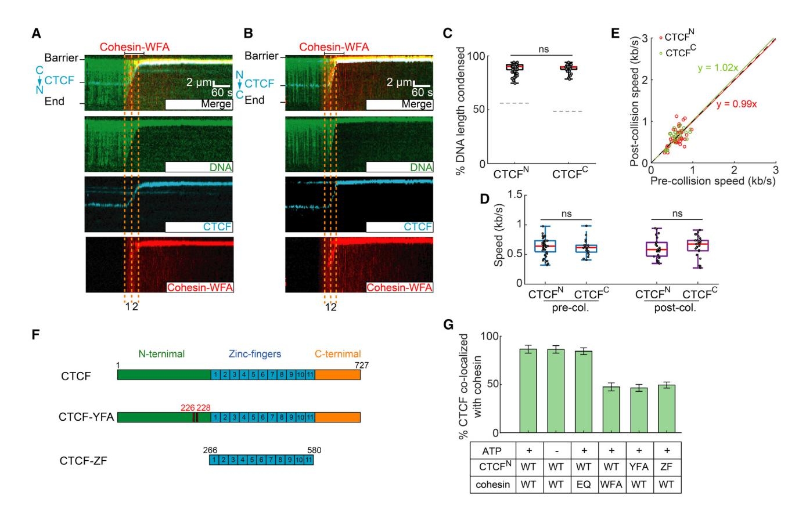
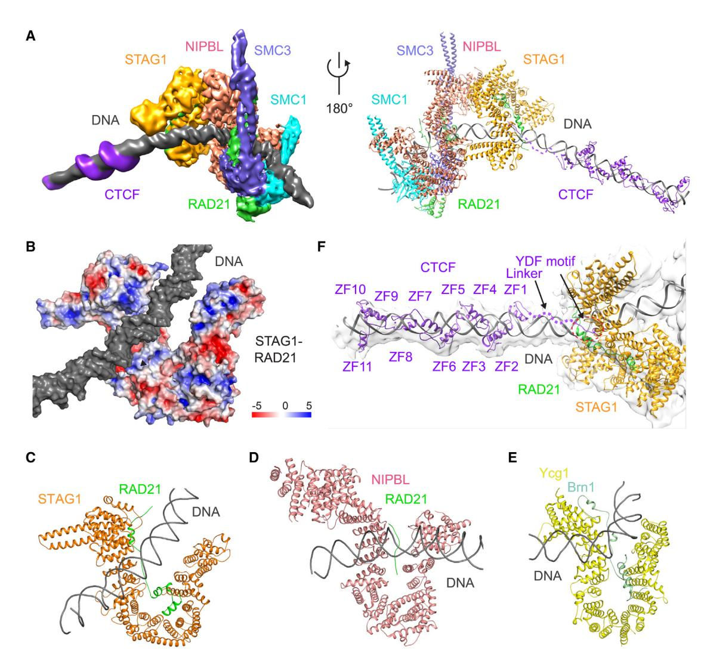
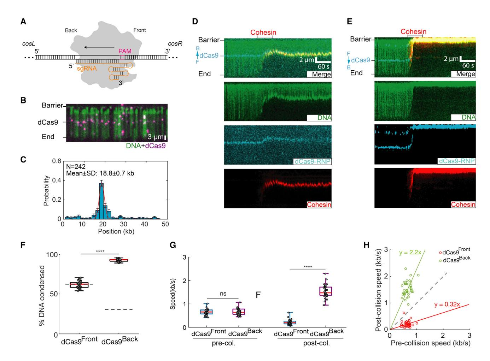
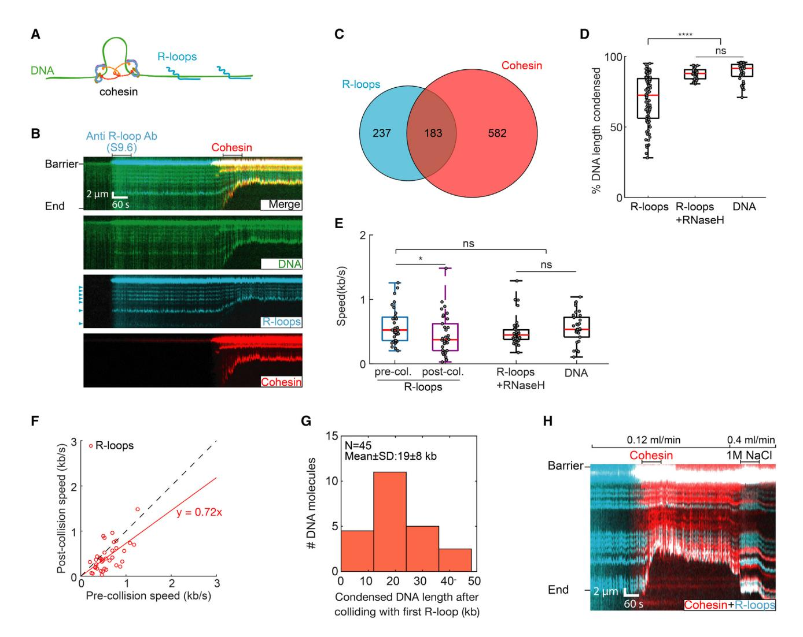
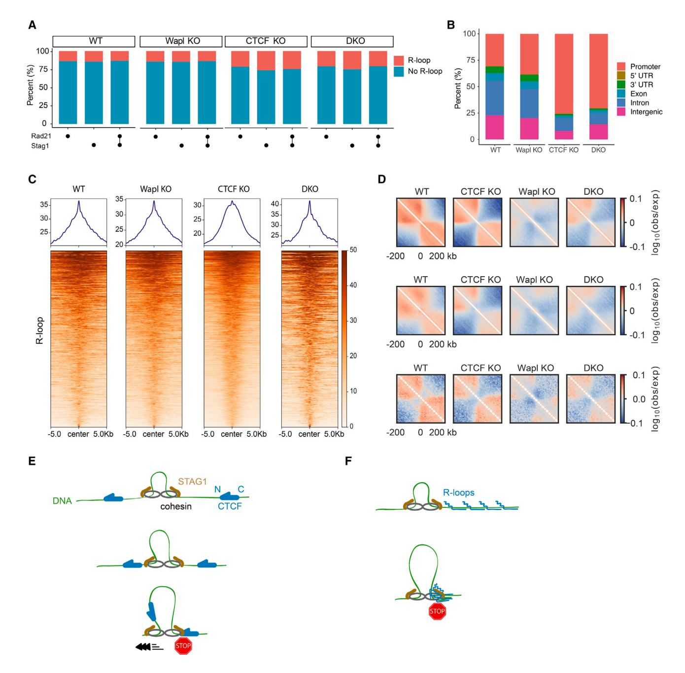

**Hongshan Zhang\*, Zhubing Shi\*, Edward J. Banigan, Yoori Kim, Hongtao Yu†, Xiao-chen Bai†, Ilya J. Finkelstein† (\* co-first authors) († co-corresponding)**

*Molecular Cell, Vol. 83, Issue 16, Pages 2856–2871.e8, 2023*

DOI: [10.1016/j.molcel.2023.07.006](https://doi.org/10.1016/j.molcel.2023.07.006)

---

## Table of Contents

- [Summary](#summary)
- [Introduction](#introduction)
- [Results](#results)
- [Discussion](#discussion)
- [Limitations of the Study](#limitations)
- [STAR+Methods](#methods)
- [Acknowledgments](#acknowledgments)
- [References](#references)

---

## Summary {#summary}

Cohesin and CCCTC-binding factor (CTCF) are key regulatory proteins of three-dimensional (3D) genome organization. Cohesin extrudes DNA loops that are anchored by CTCF in a polar orientation. Here, we present direct evidence that CTCF binding polarity controls cohesin-mediated DNA looping. Using single-molecule imaging, we demonstrate that a critical N-terminal motif of CTCF blocks cohesin translocation and DNA looping. The cryo-EM structure of the cohesin-CTCF complex reveals that this CTCF motif ahead of zinc fingers can only reach its binding site on the STAG1 cohesin subunit when the N terminus of CTCF faces cohesin. Remarkably, a C-terminally oriented CTCF accelerates DNA compaction by cohesin. DNA-bound Cas9 and Cas12a ribonucleoproteins are also polar cohesin barriers, indicating that stalling may be intrinsic to cohesin itself. Finally, we show that RNA-DNA hybrids (R-loops) block cohesin-mediated DNA compaction *in vitro* and are enriched with cohesin subunits *in vivo*, likely forming TAD boundaries.

---

## Introduction {#introduction}

Higher eukaryotes fold their genomes into topologically associating domains (TADs).[1–5](#ref1) DNA sequences within a TAD interact frequently with each other but are insulated from adjacent TADs. The cohesin complex, which is constituted of SMC1, SMC3, RAD21, and either STAG1 or STAG2, and CCCTC-binding factor (CTCF) are both enriched at TAD boundaries.[1–3,6–12](#ref1) Depleting CTCF or cohesin disrupts chromosomal looping and insulation between most TADs.[13–17](#ref13) CTCF defines TAD boundaries by blocking the loop extrusion activity of cohesin via an incompletely understood mechanism.[18,19](#ref18) TADs are also established via CTCF-independent mechanisms, including transcription and replication activities that restrict cohesin loop extrusion.[20–23](#ref20) The mechanisms underlying cohesin regulation at these roadblocks remain unclear. Here, we explore the mechanisms of CTCF-dependent and -independent cohesin arrest during loop extrusion to shape the three-dimensional (3D) genome.

CTCF arrests cohesin in an orientation-specific manner in most higher eukaryotes.[10,11,24–26](#ref10) TAD boundaries are marked by CTCF-binding sites (CBSs) in a convergent arrangement. Deleting genomic CBSs abrogates TAD boundaries[11,24,25](#ref11) and induces aberrant gene activation.[27–29](#ref27) An interaction between an N-terminal CTCF peptide with a Tyr-Asp-Phe (YDF) motif and cohesin STAG1/2 subunit is essential for polar cohesin arrest and for maintaining TAD boundaries *in vivo*.[19](#ref19) However, the mechanisms regulating polar cohesin arrest remain poorly explored due to the difficulty of reconstituting these biochemical activities for structure-function studies.

Topological boundaries are also established via non-CTCF mechanisms such as replication and transcription. Notably, CTCF demarcates <10% of TADs in fruit flies in an orientation-independent manner.[3,6,30,31](#ref3) Fly TADs are depleted in active chromatin marks and separated by regions of active chromatin.[30](#ref30) The minichromosome maintenance (MCM) complex can impede the formation of CTCF-anchored cohesin loops and TADs in a cell-cycle-specific manner.[23](#ref23) Chromosome-bound RNA polymerases are also capable of acting as barriers to cohesin translocation both in human and yeast.[20,21](#ref20) Moreover, transcribing RNA polymerases are not stationary; rather, they translocate and relocalize cohesin, which generates characteristic patterns of spatial organization around active genes.[20](#ref20) Transcription products, like RNA-DNA loops (R-loops), are also postulated to reinforce TADs.[22](#ref22) Whether R-loops can interact with cohesin and regulate loop extrusion is unknown. These studies all point to the intriguing possibility that not only CTCF, but also additional proteins and DNA structures, organize our 3D genomes.

Here, we use a combination of single-molecule studies and cryo-electron microscopy (cryo-EM) to show that CTCF and R-loops both block cohesin-mediated loop extrusion. CTCF-binding polarity controls cohesin-mediated DNA looping. Cohesin that encounters the non-permissive CTCF N terminus is blocked from further translocation and loop extrusion. The cryo-EM structure of the intact cohesin-CTCF complex reveals that this CTCF motif ahead of zinc fingers (ZFs) can only reach its binding site on the STAG1 cohesin subunit when the N terminus of CTCF faces cohesin. Remarkably, a C-terminally oriented CTCF accelerates cohesin translocation, causing increased DNA compaction. This suggests that CTCF shapes the 3D genome even when positioned in a permissive orientation relative to cohesin. DNA-bound Cas9 and Cas12a ribonucleoproteins (RNPs) are also polar cohesin barriers, indicating that cohesin stalling is intrinsic to this DNA motor and may be triggered by diverse proteins and/or DNA structures. Finally, we show that RNA-DNA hybrids (R-loops) are enriched with cohesin subunits *in vivo*. R-loops form insulating boundaries in the absence of CTCF and efficiently block cohesin-mediated DNA compaction *in vitro*. These results provide the first direct evidence that CTCF orientation and R-loops shape the 3D genome by directly regulating cohesin.

---

## Results {#results}

### CTCF is a polar barrier to cohesin translocation on U-shaped DNA

We directly visualized cohesin-mediated looping and compaction of DNA bound with CTCF ([Figure 1](#fig1)). CTCF assembles into clusters of 2–8 molecules on CBSs.[32,33](#ref32) We reconstituted this arrangement by inserting four co-directional CBSs into a 48.5 kb DNA substrate (see STAR Methods).[34,35](#ref34) These CTCF motifs position the CTCF N terminus toward the right side of the DNA substrate, termed *cosR*. Full-length CTCF purified with a C-terminal maltose-binding protein (MBP)-FLAG tag forms a stable complex with double-stranded DNA (dsDNA) (Figures S1A and S1B). We fluorescently labeled CTCF with Alexa 488-conjugated anti-FLAG antibodies. CTCF binding was visualized on aligned arrays of DNA molecules suspended above a lipid bilayer surface via total internal reflection fluorescence microscopy (Figures 1B and 1C; and see video data in STAR Methods).[36](#ref36) Turning buffer flow off retracted both DNA and CTCF to the barrier, confirming that CTCF is bound to the DNA ([Figure 1](#fig1)C). Nearly all CTCF molecules on DNA are bound to the CBSs (Figures 1C and 1D). The half-life of CTCF bound on the CBSs is 670 ± 60 s (t½ ± 95% confidence interval [CI]; n = 31), which is ~5.2-fold longer than its half-life on nonspecific DNA sites (Figure S1C). Fewer than four CBSs significantly reduced CTCF occupancy relative to non-specific DNA binding (Figure S1D). We estimate that the four CBSs bind 2 ± 1 (mean ± SD; n = 233) CTCF molecules, as indicated by the CTCF fluorescent intensity at the CBSs relative to the CTCF on nonspecific DNA (Figures S1E and S1F).

CTCF is a polar boundary for cohesin-mediated loop extrusion.[10,11,25,37,38](#ref10) Cohesin that encounters CTCF from its non-permissive, N-terminal side is proposed to stop extrusion. Whether encounters from the permissive, C-terminal side of CTCF (CTCFC) can regulate cohesin is unknown. To determine how CTCF regulates cohesin, we directly observed loop extrusion on U-shaped CTCF-DNA. In these assays, both ends of the DNA substrate are biotinylated and tethered to the flowcell surface.[36,39](#ref36) DNA is visualized via the intercalating dye SYTOX Orange. Alexa 488-labeled CTCF is injected into the flowcell before unlabeled cohesin-Nipped-B-like (NIPBL)C (hereafter referred to as cohesin in all single-molecule experiments) in the imaging buffer (Figures 1E and S2; see video data in STAR Methods). After cohesin is added, a representative DNA molecule shows gradual compaction of its right arm, indicating cohesin-mediated DNA looping ([Figure 1](#fig1)E).[36,40](#ref36) Notably, the left arm of DNA is not compacted completely, suggesting that CTCF acts as a polar boundary to arrest cohesin. The right end of the molecule detached at 134 s, resulting in the linearization of the looped DNA molecule. While the left arm of the DNA was gradually extended, the right arm of the DNA stayed looped. This confirms cohesin-mediated looping of the right arm of the U-shaped DNA.

Since both ends of the U-shaped DNA substrate are biotinylated, these molecules are tethered with a random CBS orientation relative to the direction of cohesin translocation. We used *in situ* optical restriction enzyme mapping to determine the polarity of the CBSs. We first washed off cohesin by injecting a high-salt buffer at an increased flow rate ([Figure 1](#fig1)E). After this stringent wash, CTCF remained bound at the target site, but DNA loop was disrupted, and DNA was re-extended. The restriction enzyme SfoI cuts at a single site 2.8 kb away from the *cosR* end (Figures 1A and S2A). When injected into the flowcell, SfoI cut the DNA molecule at what was formerly the right arm, indicating that this was the *cosR* side of the DNA substrate. Thus, cohesin compacted the *cosR*-proximal DNA arm and the encounter of cohesin with the CTCF N terminus arrested loop extrusion of the left DNA arm (Figures 1E, S2B, and S2C, blue arrows). Consistent with the random tethering of U-shaped DNAs, we observed that 58% (n = 42/72) of the molecules underwent complete compaction in both arms, as would be expected for a permissive CTCF-cohesin encounter (Figure S2D). The salt wash in Figure 1E indicates that cohesin remained bound to the CBS throughout DNA compaction. Furthermore, additional experiments on U-shaped DNA showed examples where cohesin compacted both arms of the U-shaped DNA without displacing CTCF from the CBS (Figure S2E). We also did not see CTCF displaced by cohesin from the CBS in any of the single-molecule experiments (n = 67). Overall, these experiments show that cohesin bypasses CTCF in the permissive orientation, but cannot displace CTCF from the CBS. These results suggest that CTCF acts as a boundary for cohesin-mediated DNA looping when the N terminus of CTCF is oriented toward cohesin.

<figure class="paper-figure" id="fig1">
  
  <figcaption>
    <strong>Figure 1. CTCF is a polar boundary for cohesin translocation</strong>
    
(A) Schematic of the DNA substrate. The location of the four CTCF-binding sites (CBSs) and the orientation of CTCF are shown in yellow boxes and a blue arrow, respectively. The black dashed line indicates the cutting site of restriction enzyme SfoI on DNA.

    
(B) An illustration of the DNA curtain assay where the <em>cosL</em> DNA end is anchored to the flowcell surface.

    
(C) Left: image showing Alexa 488-labeled CTCF binding to the DNA substrate. Right: turning off buffer flow retracts the DNA and CTCF to the barrier, confirming that CTCF is bound to the DNA.

    
(D) CTCF binding distribution on the DNA substrate. Red line: Gaussian fit. Error bars were generated by bootstrapping.

    
(E) Real-time visualization of CTCF stopping cohesin on U-shaped DNA. Both DNA ends are tethered to the flowcell surface. DNA is visualized with SYTOX Orange (green), and CTCF is labeled with an Alexa 488-conjugated antibody (blue). Upon cohesin injection, the DNA segment between the CTCF and right tether is compacted. At 134 s, the right tether detaches from the surface, causing the left DNA segment to extend by the buffer flow. A high-salt (1 M NaCl) wash at 498 s disrupts the looped DNA and washes out the SYTOX Orange stain. The DNA was restained by reinjecting imaging buffer. To identify the <em>cosR</em> end, we injected the restriction enzyme SfoI, which cleaves near <em>cosR</em> at 724 s. Yellow arrows show the positions of CTCF. Scale bars: 3 μm.

    
(F) Representative 3-color kymograph showing that CTCF (labeled with Alexa 488) arrests cohesin (labeled with Alexa 647) in the non-permissive (CTCFN) orientation. Dashed lines indicate the pre- and post-collision time points depicted in (G).

    
(G) A schematic of cohesin-mediated compaction on a non-permissive CTCF-containing DNA and its analysis. Pre-collision: DNA is first condensed a distance Δd1 for Δt1 s. Post-collision: the DNA is further compacted (Δd2) for a short time (Δt2). The small DNA loop generated during Δt2 is eventually dissipated (Δt3), as seen by the CTCF/cohesin complex returning to the pre-collision position.

    
(H) Representative 3-color kymograph showing that CTCF permits further compaction after cohesin encounters at the permissive (CTCFC) orientation. Dashed lines indicate the pre- and post-collision outcomes depicted in (I).

    
(I) A schematic of cohesin-mediated compaction on a permissive CTCF-containing DNA and its analysis for the pre-/post-collision. DNA continues to be compacted a distance Δd2 for Δt2 s after the collision.

    
(J) Quantification of the percentage of CTCFN-DNA and CTCFC-DNA condensed by cohesin. At least 32 DNA molecules were measured for each condition. The dashed lines indicate the CTCF-binding positions on DNA substrates.

    
(K) DNA compaction speed for the pre- and post-collisions with CTCFN and CTCFC. Boxplots indicate the median and quartiles. p values are obtained from two-tailed t test: ****p &lt; 0.0001; ns, not significant.

    
(L) A comparison of the speed of individual cohesins before and after colliding with CTCFN (red) or CTCFC (green). The dashed line with a slope of 1 is included for reference.

  </figcaption>
</figure>

### CTCF can either block or accelerate cohesin translocation

We next used a three-color single-tethered DNA curtain assay to directly visualize how CTCF regulates cohesin translocation ([Figure 1](#fig1)F). The DNA was tethered to the flowcell via a streptavidin-biotin linkage on either the *cosL* side (termed CTCFN-DNA) or the *cosR* side (CTCFC-DNA). The DNA, CTCF, and cohesin (via its STAG1 subunit) were labeled with different fluorophores that could be simultaneously imaged. Consistent with our prior observations, cohesin loads near the free DNA end and rapidly compacts the substrate.[36](#ref36) Upon colliding with the N-terminal side of CTCF (CTCFN), cohesin slowed drastically and translocated a few kb upstream of the CBS. The CTCF-cohesin complex then returned to the CBS, likely via force-induced dissipation of the DNA loop (Figures 1F and 1G; see video data in STAR Methods). All cohesin molecules stopped translocating after encountering CTCFN (n = 32) ([Figure 1](#fig1)J).

Collisions of cohesin with the CTCFC produced drastically different results. Collisions with CTCFC accelerated cohesin and compacted the entire DNA molecule (n = 51) (Figures 1I and 1J; see video data in STAR Methods). We compared cohesin translocation speeds before and after CTCF collisions in both orientations ([Figure 1](#fig1)K). Before colliding with CTCF, cohesin speeds were indistinguishable in either CBS orientation (mean ± SD: 0.56 ± 0.13 kb s−1 for cohesin-CTCFN; 0.61 ± 0.21 kb s−1 for cohesin-CTCFC; N > 32 for both orientations). Non-permissive (CTCFN) collisions slowed cohesin to a velocity of 0.2 ± 0.09 bp s−1. Strikingly, permissive (CTCFC) collisions increased the cohesin velocity to 1.42 ± 0.70 bp s−1. This trend was also observed for changes in the velocity of individual molecules: non-permissive collisions slowed cohesin ~3-fold whereas permissive collisions accelerated it by ~2-fold ([Figure 1](#fig1)L). We confirmed that wild-type (WT) CTCF that was not fluorescently labeled also blocked cohesin from the N-terminal side, indicating that this behavior is not induced by the fluorescent label (Figures S1G–S1J). Therefore, CTCF can arrest cohesin translocation when its N terminus is oriented toward cohesin. With its C terminus facing cohesin, CTCF accelerates cohesin after collision, possibly to reinforce domain boundaries.

### Polar cohesin arrest requires the unstructured CTCF N-terminal domain

CTCF physically interacts with the STAG2-RAD21 cohesin subcomplex through its conserved N-terminal YDF motif.[19,41,42](#ref19) Cells with CTCF(Y226A/F228A) have fewer loops and weaker domain boundaries than WT CTCF.[19](#ref19) To determine whether this CTCF-cohesin interaction was required for blocking cohesin, we first characterized the ability of CTCF to arrest recombinant cohesin with STAG1(W337A/F347A; termed cohesin-WFA), which is deficient in binding the CTCF YDF motif[19](#ref19) (Figures 2A–2E). Cohesin-WFA did not stop after colliding with either CTCFN or CTCFC, and compacted DNA in both orientations (n = 66 and 30 for CTCFN and CTCFC, respectively). The pre- and post-collision velocities were also indistinguishable in either orientation (Figures 2D and 2E). We next tested CTCF(Y226A/F228A; CTCF-YFA) and a truncation mutant that only includes the 11 ZFs (CTCF-ZF) ([Figure 2](#fig2)F). All CTCF mutants retained a high affinity for the CBS (Figures S3A and S3B). Strikingly, both CTCF-YFA (Figures S3C–S3G) and CTCF-ZF (Figures S3H–S3L) lost their functions as polar barriers of cohesin translocation. Thus, the interaction between STAG1 and the CTCF YDF motif is required for polar cohesin blockade.

CTCF-YFA and CTCF-ZF both reduced cohesin's speed and DNA compaction in an orientation-independent manner (Figure S3). This observation suggests that other regions of CTCF, including the ZFs, can partially block cohesin. We thus quantified the physical interactions between cohesin and CTCF mutants. To capture potential interactions between cohesin and CTCF mutants without DNA compaction, we increased the applied laminar force to 0.7 pN. At this force, cohesin remains bound to the DNA but cannot translocate on it.[36](#ref36) The vast majority of WT CTCFN foci co-localized with cohesin (n = 338/380 molecules) ([Figure 2](#fig2)G). This co-localization pattern was identical without ATP and with the ATP hydrolysis-deficient cohesin SMC1A(E1157Q)/SMC3(E1144Q) mutant (cohesin-EQ). In contrast, both CTCFN-YFA and CTCFN-ZF co-localized with less than ~50% of WT cohesin molecules (n = 150/333 and 195/397 for CTCFN-YFA and CTCFN-ZF, respectively) ([Figure 2](#fig2)G). Only 47% (n = 105/224) of the WT CTCFN foci retained cohesin-WFA. Switching the DNA orientation to CTCFC resulted in a similar co-localization defect (Figure S3M). Thus, the CTCF YDF motif is required for strong cohesin-CTCF binding. However, CTCF also physically interacts with cohesin via an internal region.

<figure class="paper-figure" id="fig2">
  
  <figcaption>
    <strong>Figure 2. An interaction between STAG1 and the CTCF N-terminal region are essential for polar cohesin arrest</strong>
    
(A and B) Representative kymographs showing that cohesin-STAG1(W337A/F347A), termed cohesin-WFA, can completely compact DNA pre-bound with (A) CTCFN and (B) CTCFC.

    
(C) Quantification of the CTCFN-DNA and CTCFC-DNA condensed by cohesin-WFA. The dashed lines indicate the CTCF-binding positions on DNA substrates.

    
(D) Cohesin-WFA speed pre- and post-collisions with CTCFN or CTCFC.

    
(E) Correlation between the speeds of individual cohesins before and after colliding with CTCFN (red) or CTCFC (green). The dashed line is a guide with a slope of 1.

    
(F) Schematic of wild-type CTCF, CTCF Y226A/F228A mutant (CTCF-YFA), and the zinc-finger truncation (CTCF-ZF).

    
(G) Percent of CTCF or its mutants co-localized with cohesin variants on CTCFN-DNA. At least 30 DNA molecules were measured for each experiment. p values are obtained from two-tailed t test; ns, not significant.

  </figcaption>
</figure>

### Structure of the cohesin-NIPBLC-CTCF-DNA complex

To understand the mechanism by which CTCF blocks cohesin in an orientation-specific manner, we solved the structure of cohesin-NIPBLC in complex with CTCF using cryo-EM. The complex was reconstituted on a 118-base pair (bp) dsDNA that included a 41-bp CBS at one end. Cohesin-NIPBLC remained associated with CTCF-bound dsDNA in the presence of ADP·BeF3 (Figures S4A and S4B). We further stabilized this complex via mild cross-linking with BS3 before sucrose gradient ultracentrifugation and single-particle cryo-EM analysis.

3D classification and refinement generated three cryo-EM maps of the complex in distinct conformations, only one of which contained one CTCF molecule bound to the cohesin-NIPBL-DNA complex (Figures S4C–S4I; Table S1). The map of this conformation had an overall resolution of 6.5 Å, which allowed unambiguous rigid-body docking of the models of cohesin-NIPBL and CTCF ZFs with DNA to produce the structure of the cohesin-NIPBL-CTCF-DNA complex[43–45](#ref43) (Figures 3A and S4J). The CTCF N and C termini are predicted to be unstructured, and accordingly, are invisible in the map. Previous crystal structure showed that the YDF motif of CTCF interacts with STAG2 and RAD21.[19](#ref19) To visualize the density of YDF motif in our cryo-EM structure, we performed focused refinement on the STAG1-RAD21-CTCF-DNA part in three maps of the complex structures (Figures S4M–S4O). The density corresponding to the YDF motif is clearly present in two of the three maps of the complex (Figures S4M and S4N). Extra density that corresponds to the YDF motif is also present on the surface of STAG1-RAD21 in the map for cohesin-NIPBL-CTCF-DNA (Figure S4O), albeit the density is not as good as in the other two maps due to the limited resolution.

In the complex, one end of the DNA molecule is captured by SMC1-SMC3 heterodimer and NIPBL, similar to the cohesin-NIPBL-DNA complex without CTCF ([Figure 3](#fig3)A).[43,46,47](#ref43) The middle region of DNA is bound by STAG1 ([Figure 3](#fig3)B). Previous studies have shown that the huntington, elongation factor 3, a subunit of protein phosphatase 2A and TOR1 (HEAT) repeat proteins of SMC complexes, including STAG1/2 in cohesin, NIPBL, and in chromosome-associated proteins (CAP) CAP-D and CAP-G (Ycg1 in yeast) in condensin, participate in DNA binding. Unlike NIPBL that contacts DNA via its left and right arms on one side of the U structure, STAG1 binds to DNA through both the bottom of the left arm and the tops of both arms (Figures 3C and 3D).[43](#ref43) These DNA recognition regions in STAG1 are enriched in positively charged residues ([Figure 3](#fig3)B). DNA traverses between the tops of the U-shaped STAG1, which is similar to the DNA-binding mode by yeast condensin subunit Ycg1 ([Figure 3](#fig3)E).[48,49](#ref48) However, STAG1 possesses a wider central cleft than Ycg1, resulting in a relatively loose binding of STAG1 to DNA, which might be an intrinsic property of cohesin. It is also possible that other unidentified factors can strengthen STAG1-DNA interactions at domain boundaries.

CTCF binds to the CBS at the other end of the DNA molecule, with its N terminus pointing toward cohesin. The structure thus captures the extrusion-blocking collision complex of cohesin-CTCF. The conserved YDF motif of CTCF binds to the previously characterized site on the STAG1-RAD21 subcomplex[19](#ref19) ([Figure 3](#fig3)F). In addition to the N terminus, zinc finger 1 (ZF1) of CTCF contributes to cohesin positioning at CBSs, boundary insulation, and loop formation.[41,42,50,51](#ref41) However, cohesin does not directly contact CTCF ZFs (Figures 3A and 3F). Thus, CTCF-ZF1 regulates cohesin via an indirect mechanism.

The YDF motif that directly binds STAG1 is conserved in CTCF proteins of various species, including *Drosophila* (Figure S5A). Yet, CTCF is not enriched at TAD boundaries and loop anchors in *Drosophila*,[52–54](#ref52) suggesting that *Drosophila* CTCF cannot block cohesin. A sequence alignment of vertebrate CTCFs shows that the N-terminal region contains a patch of lysine residues close to ZF1 that may interact with DNA (Figure S5A). We also observed additional weak density adjacent to human CTCF ZFs on the surface of DNA in the locally refined maps ([Figure 3](#fig3)F), indicating that this basic linker binds to DNA and may be important for blocking DNA compaction by cohesin. Interestingly, this basic linker is missing in *Drosophila* CTCF (Figure S5A), which could provide a possible explanation for the inability of *Drosophila* CTCF to stop cohesin. To demonstrate this possibility, we purified a chimeric CTCF with residues 261–264 replaced by the corresponding *Drosophila melanogaster* linker (CTCF-DM[251–264]) (Figure S5B). CTCF-DM(251–264) cannot block cohesin translocation compared with WT human CTCF (Figures S5C and S5D), indicating that the linker constitutes a key functional difference between human and fly CTCFs.

<figure class="paper-figure" id="fig3">
  
  <figcaption>
    <strong>Figure 3. Structure of the human cohesin-NIPBL-CTCF-DNA complex</strong>
    
(A) Cryo-EM map (left) and model (right) of human cohesin-NIPBL-CTCF-DNA complex. DNA is captured by cohesin and NIPBL at one end and by CTCF at the other end, while its middle region contacts the top of both sides of U-shaped STAG1.

    
(B) Surface electrostatic potential of STAG1-RAD21 subcomplex. DNA contacts positively charged regions in STAG1 and RAD21.

    
(C–E) Structural comparison of HEAT repeat proteins STAG1 (C), NIPBL (D), and Ycg1 (E) binding to DNA duplex.

    
(F) Locally refined map of the STAG1-CTCF-DNA subcomplex. The models of STAG1, STAG1-bound RAD21 region, DNA, and CTCF YDF motif and ZFs are shown. The CTCF linker region flanked by the YDF motif and ZFs contacts DNA.

  </figcaption>
</figure>

### Polar arrest of cohesin by Cas9 and Cas12a ribonucleoproteins

To further probe the mechanism of cohesin arrest, we used *S. pyogenes* Cas9 as a model roadblock with a defined polarity. Nuclease-dead Cas9 (dCas9) RNP was reconstituted by mixing 3xFLAG-dCas9 with a single-guide RNA (sgRNA). The protospacer adjacent motif (PAM) of the sgRNA faces the *cosR* end of the target DNA strand ([Figure 4](#fig4)A). As expected, the dCas9 RNP labeled with a fluorescent Alexa 488-anti-FLAG antibody bound to its DNA target (Figures 4B and 4C).[55](#ref55) When the DNA is tethered via its *cosL* end, cohesin collides with dCas9 from its PAM-proximal side (named dCas9Front) and when the DNA is tethered via its *cosR* end, cohesin encounters the PAM-distal side (dCas9Back; see [Figure 4](#fig4)A).

Cohesin compacts the DNA until it encounters dCas9 in either orientation. Strikingly, we observed different behaviors with dCas9Front and dCas9Back (Figures 4D and 4E; see video data in STAR Methods). dCas9Front slowed cohesin ~3-fold relative to its pre-collision speed (0.61 ± 0.12 kb/s; n = 40) and eventually arrested cohesin at the collision site (Figures 4F and 4G). In contrast, collisions with dCas9Back increased cohesin's speed ~2.2-fold (1.52 ± 0.27 kb/s; n = 41) and led to nearly complete DNA compaction (Figures 4F–4H). Thus, dCas9 recapitulates the polar cohesin arrest and acceleration that we observed with CTCF ([Figure 1](#fig1)). Our surprising finding that dCas9 arrests cohesin in a polar fashion explains a recent *in vitro* report that gold nanoparticle attached to dCas9-RNP only blocks 50% of cohesins.[56](#ref56) This partial effect is likely due to the unresolved collision polarity in that study. More importantly, our results also explain how dCas9 establishes TADs in mammalian cells.[57](#ref57)

We next observed cohesin's collisions with the nuclease-inactive *Acidaminococcus* sp. Cas12a (dCas12a) RNP. Cas12a and Cas9 are structurally and biochemically divergent RNA-guided nucleases. dCas12a recognizes its PAM on the 3′ side of the target DNA strand (the PAM-proximal side is named dCas12aFront; the PAM-distal side is named dCas12aBack; Figure S5E), which is opposite to dCas9 ([Figure 4](#fig4)A). Fluorescently labeled dCas12a efficiently bound its target site (Figures S5F and S5G).[58](#ref58) dCas12a slowed and eventually stopped cohesin but only when cohesin approached from the dCas12aFront side (Figures S5H–S5L). Collisions with dCas12aBack accelerated cohesin ~1.8-fold (n = 53). Similar to CTCF, the fluorescent label did not affect cohesin translocation in these assays (Figures S5M–S5R). To investigate whether a specific interaction in STAG1 is required for polar arrest by CRISPR nucleases, we performed additional experiments with cohesin-WFA (Figures S5S–S5X). As with WT complexes, cohesin-WFA is also arrested by dCas9Front but not by dCas9Back (Figures S5S–S5U). Similar results were observed for dCas12a (Figures S5V–S5X).

Together, although the mechanisms are different, CTCF, dCas9, and dCas12a can all arrest or accelerate cohesin, depending on the polarity of the encounter. Polar arrest is a general feature of cohesin's translocation cycle that can be elicited by diverse roadblocks.

<figure class="paper-figure" id="fig4">
  
  <figcaption>
    <strong>Figure 4. Cas9 is a polar cohesin barrier</strong>
    
(A) Schematic of Cas9 binding its target DNA site. sgRNA is in orange. The direction of R-loop formation is indicated with an arrow. The Cas9 protospacer adjacent motif (PAM) faces the <em>cosR</em> DNA end, termed dCas9Front; PAM-distal side is termed dCas9Back.

    
(B) Image of Alexa 488-labeled dCas9 binding its target DNA.

    
(C) Binding distribution of dCas9 on the DNA substrate. Red line: Gaussian fit.

    
(D) Representative kymographs showing that dCas9 blocks cohesin when cohesin collides with the PAM-proximal dCas9 face (dCas9Front). For these experiments, the DNA is tethered via its <em>cosL</em> end. F, front; B, back.

    
(E) When cohesin collides with the PAM-distal dCas9 face (dCas9Back), its post-collision speed increases.

    
(F) Quantification of the percentage of dCas9Front-DNA and dCas9Back-DNA condensed by cohesin (N &gt; 40 for each condition).

    
(G) Comparison of the pre- and post-collision cohesin speeds for dCas9Front and dCas9Back. p values are obtained from two-tailed t test: ****p &lt; 0.0001; ns, not significant.

    
(H) A scatterplot showing the relationship for individual cohesin speed before and after collision with dCas9Front (red) and dCas9Back (green). The dashed line is for a reference (slope = 1).

  </figcaption>
</figure>

### R-loops act as barriers to cohesin translocation

Target-bound Cas9 and Cas12a both form an RNA:DNA hybrid (R-loop) with a displaced single-stranded DNA. R-loops also form genome-wide during transcription via hybridization of the nascent transcript with the template DNA strand. Cohesin binds RNA via its STAG1/2 subunits *in vitro*,[59](#ref59) and STAG1/2 proteins are enriched at R-loops in cells.[60](#ref60) Moreover, apo-Cas9 doesn't block cohesin translocation, suggesting that R-loops may impede cohesin directly.

We generated stable R-loops *in vitro* and observed their impact on cohesin translocation ([Figure 5](#fig5); see video data in STAR Methods). R-loops were assembled via concatemerization of a plasmid encoding the mouse *Airn* gene, followed by *in vitro* transcription and RNase A treatment (Figure S6A).[59,61](#ref59) R-loops from the *Airn* gene are stable both in cells and *in vitro*.[59,61](#ref59) The DNA concatemers varied in length from 17 to 110 kb (Figure S6B). Transcription did not appreciably change the distribution of DNA lengths (Figure S6C). We estimate 3 ± 2 R-loops per DNA molecule by fluorescently imaging these structures with the S9.6 antibody conjugated with Alexa 488 (Figures 5B and S6D). R-loops were separated by multiples of 4 kb, as expected for a DNA substrate that is generated via multicopy ligation of the same 4 kb long plasmid (Figure S6E). These DNA molecules were biotinylated and injected into the flowcell for single-molecule imaging. About 44% of the R-loops bound cohesin, confirming a physical interaction, likely with STAG1 (Figures 5C and S6F).[59](#ref59) Cohesin did not fully compact DNA in the presence of R-loops and slowed ~0.7-fold (0.42 ± 0.31 kb/s; N = 37) (Figures 5D–5F). In contrast, cohesin completely compacted non-transcribed DNA or transcribed substrates that had been digested with RNase H to remove the R-loops (Figures 5D, S6G, and S6H). As expected, R-loop substrates that were pre-treated with RNase H did not slow cohesin ([Figure 5](#fig5)E). We ruled out that the S9.6 antibody caused cohesin to stall by first imaging the R-loop collisions and then labeling R-loops after the experiment was complete (Figures S6I and S6J). We obtained similar results with both R-loop labeling approaches, indicating that R-loops indeed slow cohesin on their own. Cohesin stalled 19 ± 8 kb after colliding with the first R-loop (n = 45), indicating that a single encounter was insufficient to halt translocation. We estimate that complete cohesin arrest required 5 ± 2 R-loop collisions on average (Figures 5G and S6K). A stringent 1 M NaCl wash re-extended partially looped DNA molecules, but did not disrupt the tight cohesin-R-loop interaction ([Figure 5](#fig5)H). In contrast, 1 M NaCl is sufficient to remove cohesin from naked DNA. Although we could not distinguish the direction of cohesin and R-loop collisions in these assays, our results indicate that multiple R-loops are sufficient to stall cohesin translocation *in vitro*, even in the absence of all transcription machinery.

<figure class="paper-figure" id="fig5">
  
  <figcaption>
    <strong>Figure 5. R-loops interact with cohesin and slow its translocation</strong>
    
(A) Schematic of cohesin translocation on the R-loops DNA substrate.

    
(B) Representative kymographs showing cohesin colliding with R-loops. An Alexa 488-conjugated S9.6 antibody is used to image the R-loops prior to cohesin injection. R-loops are indicated by arrows.

    
(C) Venn diagram showing co-localization of R-loops and cohesin (n = 110 DNA molecules).

    
(D) R-loops significantly decrease DNA compaction, as compared with R-loops pre-treated with RNase H and non-transcribed DNA. N &gt; 38 DNA molecules for each condition.

    
(E) After colliding with an R-loop, cohesin slows its DNA compaction. N &gt; 38 for all conditions. p values are obtained from two-tailed t test: *p &lt; 0.05; ns, not significant.

    
(F) Individual cohesin molecules slow upon colliding with their first R-loop. Dashed line is a guide with a slope of 1.

    
(G) The counts of DNA molecules showing cohesin continues to compact DNA for 20 kb after colliding with the first R-loop.

    
(H) Kymograph showing that a high-salt (1 M NaCl) wash disrupts the compacted DNA. However, cohesin remains associated with the R-loop.

  </figcaption>
</figure>

### R-loops are enriched for cohesin complexes and insulate genomic contacts in cells

To test whether R-loops also act as cohesin barriers in cells, we analyzed published chromatin immunoprecipitation sequencing (ChIP-seq) and DNA-RNA immunoprecipitation sequencing (DRIP-seq) datasets in mouse embryonic fibroblasts (MEFs)[62,63](#ref62) (Table S4). We analyzed chromatin localization patterns for the cohesin subunits Rad21 and Stag1 as proxies for the entire cohesin complex ([Figure 6](#fig6); Table S4). Peak overlaps were determined using the BEDTools suite with default parameters,[64](#ref64) and they were deemed significant by BEDTools fisher, ChIPseeker and Genomic HyperBrowser (see STAR Methods; Table S5). Fifteen percent of cohesin subunit peaks overlap with R-loop peaks in WT MEFs ([Figure 6](#fig6)A; Table S5). Overlaps between R-loops and Rad21 or Stag1 were nearly identical, indicating that these signals likely represent a complete cohesin complex. Knocking out the cohesin-release factor Wapl did not change the cohesin and R-loop overlap genome-wide. However, the cohesin-R-loop overlap increases to 26% in CTCF-depleted cells and CTCF/Wapl double-knockout (DKO) cells, suggesting that more cohesins interact with R-loops when CTCF is ablated. Cohesin and R-loop overlap is enriched at promoter and intronic regions, consistent with the pervasive presence of R-loops between the transcription start site (TSS) and the first exon-intron junction.[65](#ref65) This enrichment is significantly enhanced in CTCF or CTCF/Wapl KO cell lines, indicating that R-loops provide a secondary signal for 3D genome organization ([Figure 6](#fig6)B). To further confirm the significance of the overlap between cohesin and R-loop peaks, we mapped R-loop prevalence in a 5 kb region upstream/downstream of the cohesin-R-loop overlapped region. R-loops are prevalent around the cohesin-R-loop overlap region ([Figure 6](#fig6)C) but not a few kb away from the overlaps. We also repeated this bioinformatic analysis for WT HeLa and K562 human cell lines, where both DRIP-seq and cohesin ChIP-seq datasets are publicly available.[63,66–68](#ref63) Human cell lines also showed strong cohesin enrichment near R-loops, with the strongest enrichment at promoters and intron regions (Figures S6L–S6N; Tables S6 and S7). We conclude that cohesin and R-loops occupy the same genomic sites, and that R-loops are additional barriers for cohesin translocation in cells.

Next, we analyzed genomic contacts in the vicinity of R-loops using publicly available high-throughput chromosome conformation capture (Hi-C)[20](#ref20) and DRIP-seq datasets in MEFs.[63](#ref63) A map of chromosome contact enrichment averaged over and centered on oriented R-loops indicates that R-loops act as insulators for upstream and downstream contacts in WT MEFs ([Figure 6](#fig6)D, top). Insulation at R-loops depends on cohesin since the enrichment of genomic contacts vanishes in *Smc3* KO cells (Figure S6O). Knocking out CTCF somewhat increases the strength of the insulation, presumably because cohesin no longer accumulates at CTCF boundaries. When Wapl is depleted, R-loops are not insulating. This is likely because cohesin accumulates along the entire genome and has more time to traverse R-loops. A double CTCF and Wapl KO (DKO) partially restores insulation, further demonstrating that R-loops can help shape the 3D genome. Both R-loops and RNA polymerase are enriched at promoters, and RNA polymerase generates insulation through its interactions with cohesin,[20](#ref20) partially confounding our analysis. To avoid the possible effects from non-R-loop factors in promoter regions, we piled up Hi-C maps centered on R-loops but excluded those that are found within 10 kb of a TSS ([Figure 6](#fig6)D, middle). As an even more stringent analysis, we considered only intergenic regions while also excluding R-loops within 10 kb of a TSS ([Figure 6](#fig6)D, bottom). These analyses confirm insulation near intergenic R-loops and R-loops away from TSSs, with a somewhat attenuated signal compared with the average over all R-loops. Taken together, the *in vitro* and *in vivo* analyses indicate that R-loops can act as barriers for cohesin translocation to shape the 3D genome.

<figure class="paper-figure" id="fig6">
  
  <figcaption>
    <strong>Figure 6. R-loops act as barriers to cohesin-mediated loop extrusion in cells</strong>
    
(A) Cohesin subunit Rad21 and Stag1 peak positions overlap with R-loops in WT, Wapl knockout (KO), CTCF KO, and CTCF/Wapl double KO (DKO) MEFs, as defined by ChIP-seq and DRIP-seq, respectively. Both previously published datasets were collected in mouse embryonic fibroblasts (MEFs).

    
(B) Genomic features of overlapping regions of Rad21, Stag1, and R-loop peaks in the indicated MEFs.

    
(C) Read-density profiles and heatmaps of R-loop reads across overlaps of Rad21, Stag1, and R-loop in the indicated MEFs.

    
(D) Average maps of chromosome contact enrichment ("observed-over-expected"; see supplemental information) in MEFs (WT and mutants) in the vicinity of all R-loops (top; n = 39,680; R-loops centered at 0 kb). To minimize effects of transcription start sites (TSSs) and RNA polymerase, we recomputed the maps excluding R-loops located within 10 kb of a transcription start site (middle; n = 27,542). Intergenic R-loops (n = 5,392) also generated insulation (bottom) in WT and mutant MEFs.

    
(E) A summary of cohesin regulation by CTCF. Cohesin is blocked by the N terminus of CTCF through its interaction with STAG1 but increases its velocity when it encounters the C terminus of CTCF.

    
(F) A summary of the effect of R-loop clusters on cohesin translocation.

  </figcaption>
</figure>

---

## Discussion {#discussion}

Here, we provide direct evidence that CTCF is a polar barrier to cohesin-mediated DNA loop extrusion. Our structure of the cohesin-NIPBL-CTCF-DNA complex represents the extrusion-arrested state. In this state, cohesin adopts a fully folded conformation, with STAG1/2 engaging the N-terminal YDF motif of CTCF. This arrangement strongly suggests that as cohesin translocates on DNA, STAG1/2 is positioned in the front end of the complex. When cohesin approaches the N terminus of CTCF, the YDF motif in the N-terminal region of CTCF can interact with STAG1/2, thus blocking cohesin translocation (Figures 6E and S6P). Our structure thus explains the molecular basis of the polar cohesin arrest by CTCF.

Cohesin translocation on DNA is accelerated when it first encounters the C terminus of CTCF ([Figure 6](#fig6)F). Such acceleration further improves cohesin's processivity and may be important for reinforcing domain boundaries in cells. This acceleration requires the interaction between STAG1/2 and the YDF motif of CTCF. However, the extrusion-arrested structure reported here suggests that the N-terminal CTCF linker, which directly contacts DNA region ahead of ZF-binding site, may not allow the YDF motif to reach STAG1/2 when cohesin approaches from the C terminus of CTCF (Figures S6Q and S6R). We speculate that CTCF might interact with STAG1/2 in an actively extruding cohesin-NIPBL complex and that this interaction further activates cohesin translocation. The molecular basis for the increased cohesin velocity is unclear. One possibility is that CTCF suppresses cohesin's tendency to slip on DNA, especially at higher applied forces.[36,40](#ref36) By directly interacting with STAG1/2, CTCF may act as a processivity factor that prevents microscopic cohesin slipping during its translocation cycle to reinforce cohesin's loop extrusion at high tensions in mammalian cells. Additional structural and biochemical studies are needed to fully elucidate how cohesin extrudes loops and how CTCF reinforces this process.

Remarkably, both Cas9 and Cas12a RNPs can recapitulate polar cohesin arrest and acceleration, suggesting that CTCF is not unique in this regard. We only observed polar arrest/acceleration for the RNP but not the apo-Cas9/Cas12a complexes, suggesting that the protein-generated R-loop is important for this activity. Although cohesin has not evolved to interact with such RNPs *in vivo*, this result hints that *S. pombe*, *S. cerevisiae*, *C. elegans*, and *A. thaliana* may not need a CTCF homolog to organize their genomes. These organisms can form distinct chromatin domains reminiscent of TADs seen in humans.[69](#ref69) Moreover, *Drosophila* CTCF performs fundamentally different functions from the human homolog, and its chromosome contact domains can form without stabilized point-to-point border interactions between CTCF sites.[31,70](#ref31) Thus, cohesin must recognize additional CTCF-independent signals to form TADs, and these may include unidentified DNA-binding proteins or nucleic-acid structures. Even in human cells, some TAD boundary elements are not CTCF-dependent, suggesting that additional principles can also establish chromosome contact domains.[10](#ref10)

While this paper was in revision, another group used a similar single-molecule imaging approach to demonstrate that CTCF blocks loop-extruding cohesin in an orientation-dependent manner.[71](#ref71) Notably, they reported that CTCF is an active regulator of cohesin-mediated loop extrusion that can be modulated by DNA tension. They did not observe significant changes in the rate of loop extrusion before and after cohesin-CTCF collision and found that dCas9 weakly arrests cohesin, which is contrary to other reports *in vitro* and *in vivo*.[56,57](#ref56) The reasons for the discrepancies may be related to multiple differences between our studies. First, we co-purified the recombinant cohesin-NIPBLC complex that was expressed in insect cells. In contrast, Davidson et al. used both HeLa and insect cells to express cohesin and NIPBL-MAU2 subcomplexes. In that study, cohesin and NIPBL-MAU2 were preincubated at various ratios right before injecting into the flowcell. We also used 48 kb long DNA substrates with four CBSs, whereas the second study only had a single CBS on a much shorter DNA molecule. Finally, the experiments described herein are primarily from single-tethered DNA molecules, whereas the second study observed cohesin translocation on double-tethered DNA experiments. When both ends of the DNA are tethered, tension accumulates because of cohesin looping as opposed to the constant application of buffer flow. Additional studies will be required to dissect the mechanistic details that lead to these small discrepancies, as well as to the mechanisms of cohesin arrest by other roadblocks.

Here, we show that R-loops can arrest cohesin, and that cohesin is enriched at R-loops *in vivo*. Our *in vivo* co-localization and Hi-C analyses are correlative and cannot rule out an indirect mechanism for R-loop-associated cohesin and contact enrichment, possibly via RNA polymerase-mediated insulation at these sites. Future experiments will be required to directly test this hypothesis. Additional evidence for the importance of R-loops includes the formation of fine-scale chromatin loops connecting the promoter, the enhancer, and downstream exon regions soon after induction of transcription.[72](#ref72) Interestingly, RNase H1 destroys these formed loops and eliminates cohesin binding to these sites, suggesting that these chromatin loops depend on R-loops and cohesin. Moreover, accumulation of RNA-DNA hybrids flanking CBSs decreases CTCF binding to CBSs in DIS3 deficient B cells and disorganizes cohesin localization, negatively impacting the integrity of the TAD containing the immunoglobulin heavy-chain (*Igh*) locus.[73](#ref73) Active transcription also limits cohesin-mediated loop extrusion during recombination-activating gene (RAG) scanning.[57](#ref57) We conclude that R-loops can arrest cohesin-catalyzed DNA looping both *in vitro* and *in vivo* with broad implications for the roles of R-loops and other roadblocks in shaping 3D genome organization in cells.

---

## Limitations of the Study {#limitations}

The optical resolution of the fluorescence microscope used in these studies is constrained by the diffraction limit and the Brownian motion of the DNA and protein particles. This limits our ability to see the molecular details of how cohesin interacts with roadblocks with nanometer precision. The DNA molecules are stretched by the application of buffer flow (0.2 pN of applied force). This extends the DNA such that it can be imaged but can affect cohesin and CTCF.[71](#ref71) In the cell, cohesin moves on a highly chromatinized DNA that also includes both R-loops, CTCF, and a plethora of other DNA-binding proteins and RNA molecules. Biochemical reconstitutions can only capture a small subset of these interactions in a purified system. We determined the structure of the cohesin complex stalled by CTCF on DNA. In our structures, STAG1 binding is highly flexible. Recent studies suggest that the acetyltransferase ESCO1 and the HEAT repeat protein PDS5 are required for the formation of loops and the maintenance of the convergent rules of CBSs.[17,74,75](#ref17) Future work will explore how these factors interact with cohesin and CTCF at TAD boundaries and thus contribute to loop formation.

---

## STAR+Methods {#methods}

Detailed methods are provided in the online version of this paper and include the following:

- KEY RESOURCES TABLE
- RESOURCE AVAILABILITY
  - Lead contact
  - Materials availability
  - Data and code availability
- EXPERIMENTAL MODEL AND STUDY PARTICIPANT DETAILS
  - Bacterial strains
  - Insect cell lines
  - FreeStyle 293-F cell culture
- METHOD DETAILS
  - Protein expression and purification
  - Recombineering lambda DNA containing CTCF binding sites
  - Single-molecule fluorescence microscopy
  - Cryo-electron microscopy
- QUANTIFICATION AND STATISTICAL ANALYSIS
  - Fluorescent image analysis
  - ChIP-seq and DRIP-seq analysis
  - Hi-C analysis

---

## Acknowledgments {#acknowledgments}

We thank the members of Finkelstein, Yu, and Bai labs for useful discussion and the staff of the Cryo-Electron Microscopy Facility at University of Texas Southwestern Medical Center (UTSW) for technical support. This study was supported by the Cancer Prevention and Research Institute of Texas (CPRIT) (RP160667-P2 to H.Y. and RP160082 to X.-c.B.); the National Institutes of Health (GM124096 to H.Y., GM143158 to X.-c.B., and GM120554 to I.J.F.); the National Natural Science Foundation of China (32271264 to Z.S. and 32130053 to H.Y.); the Welch Foundation (I-1441 to H.Y., I-1944 to X.-c.B., and F-1808 to I.J.F.); the Westlake Education Foundation (to Z.S. and H.Y); and the National Research Foundation of Korea (NRF) and the Korea government (2021R1F1A1050252, 2021020001, and 2022R1C1C100537811 to Y.K.). E.J.B. is supported by the NIH Common Fund 4D Nucleome Program (UM1HG011536). I.J.F. is a CPRIT Scholar in Cancer Research. The UTSW Cryo-EM Facility is funded by CPRIT Core Facility Support Award RP170644.

**Author Contributions:** H.Y., X.-c.B., and I.J.F. co-supervised and designed the project. H.Z. designed and performed all single-molecule assays and analyzed single-molecule and DRIP/ChIP-seq data. Z.S. performed protein purification. Z.S. and X.-c.B. performed cryo-EM studies. Y.K. contributed to project design and protein purification. E.J.B. performed the Hi-C analysis. All authors contributed to the writing of the manuscript.

**Declaration of Interests:** The authors declare no competing interests.

---

## References {#references}

1. Dixon, J.R., Selvaraj, S., Yue, F., Kim, A., Li, Y., Shen, Y., Hu, M., Liu, J.S., and Ren, B. (2012). Topological domains in mammalian genomes identified by analysis of chromatin interactions. *Nature* **485**, 376–380. https://doi.org/10.1038/nature11082.

2. Nora, E.P., Lajoie, B.R., Schulz, E.G., Giorgetti, L., Okamoto, I., Servant, N., Piolot, T., van Berkum, N.L., Meisig, J., Sedat, J., et al. (2012). Spatial partitioning of the regulatory landscape of the X-inactivation centre. *Nature* **485**, 381–385. https://doi.org/10.1038/nature11049.

3. Sexton, T., Yaffe, E., Kenigsberg, E., Bantignies, F., Leblanc, B., Hoichman, M., Parrinello, H., Tanay, A., and Cavalli, G. (2012). Three-dimensional folding and functional organization principles of the Drosophila genome. *Cell* **148**, 458–472. https://doi.org/10.1016/j.cell.2012.01.010.

4. Dekker, J., and Mirny, L. (2016). The 3D genome as moderator of chromosomal communication. *Cell* **164**, 1110–1121. https://doi.org/10.1016/j.cell.2016.02.007.

5. Wang, S., Su, J.H., Beliveau, B.J., Bintu, B., Moffitt, J.R., Wu, C.T., and Zhuang, X. (2016). Spatial organization of chromatin domains and compartments in single chromosomes. *Science* **353**, 598–602. https://doi.org/10.1126/science.aaf8084.

6. Hou, C., Li, L., Qin, Z.S., and Corces, V.G. (2012). Gene density, transcription, and insulators contribute to the partition of the Drosophila genome into physical domains. *Mol. Cell* **48**, 471–484. https://doi.org/10.1016/j.molcel.2012.08.031.

7. Sofueva, S., Yaffe, E., Chan, W.C., Georgopoulou, D., Vietri Rudan, M., Mira-Bontenbal, H., Pollard, S.M., Schroth, G.P., Tanay, A., and Hadjur, S. (2013). Cohesin-mediated interactions organize chromosomal domain architecture. *EMBO J.* **32**, 3119–3129. https://doi.org/10.1038/emboj.2013.237.

8. Zuin, J., Dixon, J.R., van der Reijden, M.I.J.A., Ye, Z., Kolovos, P., Brouwer, R.W.W., van de Corput, M.P.C., van de Werken, H.J.G., Knoch, T.A., van IJcken, W.F.J., et al. (2014). Cohesin and CTCF differentially affect chromatin architecture and gene expression in human cells. *Proc. Natl. Acad. Sci. USA* **111**, 996–1001. https://doi.org/10.1073/pnas.1317788111.

9. Phillips-Cremins, J.E., Sauria, M.E.G., Sanyal, A., Gerasimova, T.I., Lajoie, B.R., Bell, J.S.K., Ong, C.-T., Hookway, T.A., Guo, C., Sun, Y., et al. (2013). Architectural protein subclasses shape 3-D organization of genomes during lineage commitment. *Cell* **153**, 1281–1295. https://doi.org/10.1016/j.cell.2013.04.053.

10. Rao, S.S.P., Huntley, M.H., Durand, N.C., Stamenova, E.K., Bochkov, I.D., Robinson, J.T., Sanborn, A.L., Machol, I., Omer, A.D., Lander, E.S., et al. (2014). A 3D map of the human genome at kilobase resolution reveals principles of chromatin looping. *Cell* **159**, 1665–1680. https://doi.org/10.1016/j.cell.2014.11.021.

11. Guo, Y., Xu, Q., Canzio, D., Shou, J., Li, J., Gorkin, D.U., Jung, I., Wu, H., Zhai, Y., Tang, Y., et al. (2015). CRISPR inversion of CTCF sites alters genome topology and enhancer/promoter function. *Cell* **162**, 900–910. https://doi.org/10.1016/j.cell.2015.07.038.

12. Merkenschlager, M., and Nora, E.P. (2016). CTCF and cohesin in genome folding and transcriptional gene regulation. *Annu. Rev. Genomics Hum. Genet.* **17**, 17–43. https://doi.org/10.1146/annurev-genom-083115-022339.

13. Haarhuis, J.H.I., van der Weide, R.H., Blomen, V.A., Yáñez-Cuna, J.O., Amendola, M., van Ruiten, M.S., Krijger, P.H.L., Teunissen, H., Medema, R.H., van Steensel, B., et al. (2017). The cohesin release factor WAPL restricts chromatin loop extension. *Cell* **169**, 693–707.e14. https://doi.org/10.1016/j.cell.2017.04.013.

14. Nora, E.P., Goloborodko, A., Valton, A.L., Gibcus, J.H., Uebersohn, A., Abdennur, N., Dekker, J., Mirny, L.A., and Bruneau, B.G. (2017). Targeted degradation of CTCF decouples local insulation of chromosome domains from genomic compartmentalization. *Cell* **169**, 930–944.e22. https://doi.org/10.1016/j.cell.2017.05.004.

15. Rao, S.S.P., Huang, S.-C., Hilaire, G.St.B., Engreitz, J.M., Perez, E.M., Kieffer-Kwon, K.-R., Sanborn, A.L., Johnstone, S.E., Bascom, G.D., et al. (2017). Cohesin loss eliminates all loop domains. *Cell* **171**, 305–320.e24. https://doi.org/10.1016/j.cell.2017.09.026.

16. Schwarzer, W., Abdennur, N., Goloborodko, A., Pekowska, A., Fudenberg, G., Loe-Mie, Y., Fonseca, N.A., Huber, W., Haering, C.H., Mirny, L., et al. (2017). Two independent modes of chromatin organization revealed by cohesin removal. *Nature* **551**, 51–56. https://doi.org/10.1038/nature24281.

17. Wutz, G., Várnai, C., Nagasaka, K., Cisneros, D.A., Stocsits, R.R., Tang, W., Schoenfelder, S., Jessberger, G., Muhar, M., Hossain, M.J., et al. (2017). Topologically associating domains and chromatin loops depend on cohesin and are regulated by CTCF, WAPL, and PDS5 proteins. *EMBO J.* **36**, 3573–3599. https://doi.org/10.15252/embj.201798004.

18. Ghirlando, R., and Felsenfeld, G. (2016). CTCF: making the right connections. *Genes Dev.* **30**, 881–891. https://doi.org/10.1101/gad.277863.116.

19. Li, Y., Haarhuis, J.H.I., Sedeño Cacciatore, Á., Oldenkamp, R., van Ruiten, M.S., Willems, L., Teunissen, H., Muir, K.W., de Wit, E., Rowland, B.D., et al. (2020). The structural basis for cohesin–CTCF-anchored loops. *Nature* **578**, 472–476. https://doi.org/10.1038/s41586-019-1910-z.

20. Banigan, E.J., Tang, W., van den Berg, A.A., Stocsits, R.R., Wutz, G., Brandão, H.B., Busslinger, G.A., Peters, J.M., and Mirny, L.A. (2023). Transcription shapes 3D chromatin organization by interacting with loop extrusion. *Proc. Natl. Acad. Sci. USA* **120**, e221048012. https://doi.org/10.1073/pnas.2210480120.

21. Jeppsson, K., Sakata, T., Nakato, R., Milanova, S., Shirahige, K., and Björkegren, C. (2022). Cohesin-dependent chromosome loop extrusion is limited by transcription and stalled replication forks. *Sci. Adv.* **8**, eabn7063. https://doi.org/10.1126/sciadv.abn7063.

22. Luo, H., Zhu, G., Eshelman, M.A., Fung, T.K., Lai, Q., Wang, F., Zeisig, B.B., Lesperance, J., Ma, X., Chen, S., et al. (2022). HOTTIP-dependent R-loop formation regulates CTCF boundary activity and TAD integrity in leukemia. *Mol. Cell* **82**, 833–851.e11. https://doi.org/10.1016/j.molcel.2022.01.014.

23. Dequeker, B.J.H., Scherr, M.J., Brandão, H.B., Gassler, J., Powell, S., Gaspar, I., Flyamer, I.M., Lalic, A., Tang, W., Stocsits, R., et al. (2022). MCM complexes are barriers that restrict cohesin-mediated loop extrusion. *Nature* **606**, 197–203. https://doi.org/10.1038/s41586-022-04730-0.

24. Sanborn, A.L., Rao, S.S.P., Huang, S.C., Durand, N.C., Huntley, M.H., Jewett, A.I., Bochkov, I.D., Chinnappan, D., Cutkosky, A., Li, J., et al. (2015). Chromatin extrusion explains key features of loop and domain formation in wild-type and engineered genomes. *Proc. Natl. Acad. Sci. USA* **112**, E6456–E6465. https://doi.org/10.1073/pnas.1518552112.

25. de Wit, E., Vos, E.S.M., Holwerda, S.J.B., Valdes-Quezada, C., Verstegen, M.J.A.M., Teunissen, H., Splinter, E., Wijchers, P.J., Krijger, P.H.L., and de Laat, W. (2015). CTCF binding polarity determines chromatin looping. *Mol. Cell* **60**, 676–684. https://doi.org/10.1016/j.molcel.2015.09.023.

26. Tang, Z., Luo, O.J., Li, X., Zheng, M., Zhu, J.J., Szalaj, P., Trzaskoma, P., Magalska, A., Wlodarczyk, J., Ruszczycki, B., et al. (2015). CTCF-mediated human 3D genome architecture reveals chromatin topology for transcription. *Cell* **163**, 1611–1627. https://doi.org/10.1016/j.cell.2015.11.024.

27. Flavahan, W.A., Drier, Y., Liau, B.B., Gillespie, S.M., Venteicher, A.S., Stemmer-Rachamimov, A.O., Suvà, M.L., and Bernstein, B.E. (2016). Insulator dysfunction and oncogene activation in IDH mutant gliomas. *Nature* **529**, 110–114. https://doi.org/10.1038/nature16490.

28. Hnisz, D., Day, D.S., and Young, R.A. (2016). Insulated neighborhoods: structural and functional units of mammalian gene control. *Cell* **167**, 1188–1200. https://doi.org/10.1016/j.cell.2016.10.024.

29. Lupiáñez, D.G., Kraft, K., Heinrich, V., Krawitz, P., Brancati, F., Klopocki, E., Horn, D., Kayserili, H., Opitz, J.M., Laxova, R., et al. (2015). Disruptions of topological chromatin domains cause pathogenic rewiring of gene-enhancer interactions. *Cell* **161**, 1012–1025. https://doi.org/10.1016/j.cell.2015.04.004.

30. Ulianov, S.V., Khrameeva, E.E., Gavrilov, A.A., Flyamer, I.M., Kos, P., Mikhaleva, E.A., Penin, A.A., Logacheva, M.D., Imakaev, M.V., Chertovich, A., et al. (2016). Active chromatin and transcription play a key role in chromosome partitioning into topologically associating domains. *Genome Res.* **26**, 70–84. https://doi.org/10.1101/gr.196006.115.

31. Kaushal, A., Mohana, G., Dorier, J., Özdemir, I., Omer, A., Cousin, P., Semenova, A., Taschner, M., Dergai, O., Marzetta, F., et al. (2021). CTCF loss has limited effects on global genome architecture in Drosophila despite critical regulatory functions. *Nat. Commun.* **12**, 1011. https://doi.org/10.1038/s41467-021-21366-2.

32. Hansen, A.S., Pustova, I., Cattoglio, C., Tjian, R., and Darzacq, X. (2017). CTCF and cohesin regulate chromatin loop stability with distinct dynamics. *eLife* **6**, e25776. https://doi.org/10.7554/eLife.25776.

33. Gu, B., Comerci, C.J., McCarthy, D.G., Saurabh, S., Moerner, W.E., and Wysocka, J. (2020). Opposing effects of cohesin and transcription on CTCF organization revealed by super-resolution imaging. *Mol. Cell* **80**, 699–711.e7. https://doi.org/10.1016/j.molcel.2020.10.001.

34. Kim, Y., de la Torre, A., Leal, A.A., and Finkelstein, I.J. (2017). Efficient modification of λ-DNA substrates for single-molecule studies. *Sci. Rep.* **7**, 2071. https://doi.org/10.1038/s41598-017-01984-x.

35. Davidson, I.F., Goetz, D., Zaczek, M.P., Molodtsov, M.I., Huis In 't Veld, P.J., Weissmann, F., Litos, G., Cisneros, D.A., Ocampo-Hafalla, M., Ladurner, R., et al. (2016). Rapid movement and transcriptional re-localization of human cohesin on DNA. *EMBO J.* **35**, 2671–2685. https://doi.org/10.15252/embj.201695402.

36. Kim, Y., Shi, Z., Zhang, H., Finkelstein, I.J., and Yu, H. (2019). Human cohesin compacts DNA by loop extrusion. *Science* **366**, 1345–1349. https://doi.org/10.1126/science.aaz4475.

37. Gómez-Marín, C., Tena, J.J., Acemel, R.D., López-Mayorga, M., Naranjo, S., de la Calle-Mustienes, E., Maeso, I., Beccari, L., Aneas, I., Vielmas, E., et al. (2015). Evolutionary comparison reveals that diverging CTCF sites are signatures of ancestral topological associating domains borders. *Proc. Natl. Acad. Sci. USA* **112**, 7542–7547. https://doi.org/10.1073/pnas.1505463112.

38. Vietri Rudan, M., Barrington, C., Henderson, S., Ernst, C., Odom, D.T., Tanay, A., and Hadjur, S. (2015). Comparative Hi-C reveals that CTCF underlies evolution of chromosomal domain architecture. *Cell Rep.* **10**, 1297–1309. https://doi.org/10.1016/j.celrep.2015.02.004.

39. Ganji, M., Shaltiel, I.A., Bisht, S., Kim, E., Kalichava, A., Haering, C.H., and Dekker, C. (2018). Real-time imaging of DNA loop extrusion by condensin. *Science* **360**, 102–105. https://doi.org/10.1126/science.aar7831.

40. Davidson, I.F., Bauer, B., Goetz, D., Tang, W., Wutz, G., and Peters, J.M. (2019). DNA loop extrusion by human cohesin. *Science* **366**, 1338–1345. https://doi.org/10.1126/science.aaz3418.

41. Nora, E.P., Caccianini, L., Fudenberg, G., So, K., Kameswaran, V., Nagle, A., Uebersohn, A., Hajj, B., Saux, A.L., Coulon, A., et al. (2020). Molecular basis of CTCF binding polarity in genome folding. *Nat. Commun.* **11**, 5612. https://doi.org/10.1038/s41467-020-19283-x.

42. Pugacheva, E.M., Kubo, N., Loukinov, D., Tajmul, M., Kang, S., Kovalchuk, A.L., Strunnikov, A.V., Zentner, G.E., Ren, B., and Lobanenkov, V.V. (2020). CTCF mediates chromatin looping via N terminal domain-dependent cohesin retention. *Proc. Natl. Acad. Sci. USA* **117**, 2020–2031. https://doi.org/10.1073/pnas.1911708117.

43. Shi, Z., Gao, H., Bai, X.C., and Yu, H. (2020). Cryo-EM structure of the human cohesin-NIPBL-DNA complex. *Science* **368**, 1454–1459. https://doi.org/10.1126/science.abb0981.

44. Yin, M., Wang, J., Wang, M., Li, X., Zhang, M., Wu, Q., and Wang, Y. (2017). Molecular mechanism of directional CTCF recognition of a diverse range of genomic sites. *Cell Res.* **27**, 1365–1377. https://doi.org/10.1038/cr.2017.131.

45. Hashimoto, H., Wang, D., Horton, J.R., Zhang, X., Corces, V.G., and Cheng, X. (2017). Structural basis for the versatile and methylation-dependent binding of CTCF to DNA. *Mol. Cell* **66**, 711–720.e3. https://doi.org/10.1016/j.molcel.2017.05.004.

46. Collier, J.E., Lee, B.G., Roig, M.B., Yatskevich, S., Petela, N.J., Metson, J., Voulgaris, M., Gonzalez Llamazares, A., Löwe, J., and Nasmyth, K.A. (2020). Transport of DNA within cohesin involves clamping on top of engaged heads by Scc2 and entrapment within the ring by Scc3. *eLife* **9**, e59560. https://doi.org/10.7554/eLife.59560.

47. Higashi, T.L., Eickhoff, P., Sousa, J.S., Locke, J., Nans, A., Flynn, H.R., Snijders, A.P., Papageorgiou, G., O'Reilly, N., Chen, Z.A., et al. (2020). A structure-based mechanism for DNA entry into the cohesin ring. *Mol. Cell* **79**, 917–933.e9. https://doi.org/10.1016/j.molcel.2020.07.013.

48. Kschonsak, M., Merkel, F., Bisht, S., Metz, J., Rybin, V., Hassler, M., and Haering, C.H. (2017). Structural basis for a safety-belt mechanism that anchors condensin to chromosomes. *Cell* **171**, 588–600.e24. https://doi.org/10.1016/j.cell.2017.09.008.

49. Shaltiel, I.A., Datta, S., Lecomte, L., Hassler, M., Kschonsak, M., Bravo, S., Stober, C., Ormanns, J., Eustermann, S., and Haering, C.H. (2022). A hold-and-feed mechanism drives directional DNA loop extrusion by condensin. *Science* **376**, 1087–1094. https://doi.org/10.1126/science.abm4012.

50. Saldaña-Meyer, R., Rodriguez-Hernaez, J., Escobar, T., Nishana, M., Jácome-López, K., Nora, E.P., Bruneau, B.G., Tsirigos, A., Furlan-Magaril, M., Skok, J., et al. (2019). RNA interactions are essential for CTCF-mediated genome organization. *Mol. Cell* **76**, 412–422.e5. https://doi.org/10.1016/j.molcel.2019.08.015.

51. Nishana, M., Ha, C., Rodriguez-Hernaez, J., Ranjbaran, A., Chio, E., Nora, E.P., Badri, S.B., Kloetgen, A., Bruneau, B.G., Tsirigos, A., et al. (2020). Defining the relative and combined contribution of CTCF and CTCFL to genomic regulation. *Genome Biol.* **21**, 108. https://doi.org/10.1186/s13059-020-02024-0.

52. Cubeñas-Potts, C., Rowley, M.J., Lyu, X., Li, G., Lei, E.P., and Corces, V.G. (2017). Different enhancer classes in Drosophila bind distinct architectural proteins and mediate unique chromatin interactions and 3D architecture. *Nucleic Acids Res.* **45**, 1714–1730. https://doi.org/10.1093/nar/gkw1114.

53. Ramírez, F., Bhardwaj, V., Arrigoni, L., Lam, K.C., Grüning, B.A., Villaveces, J., Habermann, B., Akhtar, A., and Manke, T. (2018). High-resolution TADs reveal DNA sequences underlying genome organization in flies. *Nat. Commun.* **9**, 189. https://doi.org/10.1038/s41467-017-02525-w.

54. Wang, Q., Sun, Q., Czajkowsky, D.M., and Shao, Z. (2018). Sub-kb Hi-C in D. melanogaster reveals conserved characteristics of TADs between insect and mammalian cells. *Nat. Commun.* **9**, 188. https://doi.org/10.1038/s41467-017-02526-9.

55. Sternberg, S.H., Redding, S., Jinek, M., Greene, E.C., and Doudna, J.A. (2014). DNA interrogation by the CRISPR RNA-guided endonuclease Cas9. *Nature* **507**, 62–67. https://doi.org/10.1038/nature13011.

56. Pradhan, B., Barth, R., Kim, E., Davidson, I.F., Bauer, B., van Laar, T., Yang, W., Ryu, J.K., van der Torre, J., Peters, J.M., et al. (2022). SMC complexes can traverse physical roadblocks bigger than their ring size. *Cell Rep.* **41**, 111491. https://doi.org/10.1016/j.celrep.2022.111491.

57. Zhang, Y., Zhang, X., Ba, Z., Liang, Z., Dring, E.W., Hu, H., Lou, J., Kyritsis, N., Zurita, J., Shamim, M.S., et al. (2019). The fundamental role of chromatin loop extrusion in physiological V(D)J recombination. *Nature* **573**, 600–604. https://doi.org/10.1038/s41586-019-1547-y.

58. Calcines-Cruz, C., Finkelstein, I.J., and Hernandez-Garcia, A. (2021). CRISPR-guided programmable self-assembly of artificial virus-like nucleocapsids. *Nano Lett.* **21**, 2752–2757. https://doi.org/10.1021/acs.nanolett.0c04640.

59. Pan, H., Jin, M., Ghadiyaram, A., Kaur, P., Miller, H.E., Ta, H.M., Liu, M., Fan, Y., Mahn, C., Gorthi, A., et al. (2020). Cohesin SA1 and SA2 are RNA binding proteins that localize to RNA containing regions on DNA. *Nucleic Acids Res.* **48**, 5639–5655. https://doi.org/10.1093/nar/gkaa284.

60. Porter, H., Li, Y., Neguembor, M.V., Beltran, M., Varsally, W., Martin, L., Cornejo, M.T., Pezic, D., Bhamra, A., Surinova, S., et al. (2023). Cohesin-independent STAG proteins interact with RNA and R-loops and promote complex loading. *eLife* **12**, e79386. https://doi.org/10.7554/eLife.79386.

61. Stolz, R., Sulthana, S., Hartono, S.R., Malig, M., Benham, C.J., and Chedin, F. (2019). Interplay between DNA sequence and negative superhelicity drives R-loop structures. *Proc. Natl. Acad. Sci. USA* **116**, 6260–6269. https://doi.org/10.1073/pnas.1819476116.

62. Busslinger, G.A., Stocsits, R.R., van der Lelij, P., Axelsson, E., Tedeschi, A., Galjart, N., and Peters, J.M. (2017). Cohesin is positioned in mammalian genomes by transcription, CTCF and Wapl. *Nature* **544**, 503–507. https://doi.org/10.1038/nature22063.

63. Sanz, L.A., Hartono, S.R., Lim, Y.W., Steyaert, S., Rajpurkar, A., Ginno, P.A., Xu, X., and Chédin, F. (2016). Prevalent, dynamic, and conserved R-loop structures associate with specific epigenomic signatures in mammals. *Mol. Cell* **63**, 167–178. https://doi.org/10.1016/j.molcel.2016.05.032.

64. Quinlan, A.R., and Hall, I.M. (2010). BEDTools: a flexible suite of utilities for comparing genomic features. *Bioinformatics* **26**, 841–842. https://doi.org/10.1093/bioinformatics/btq033.

65. Dumelie, J.G., and Jaffrey, S.R. (2017). Defining the location of promoter-associated R-loops at near-nucleotide resolution using bisDRIP-seq. *eLife* **6**, e28306. https://doi.org/10.7554/eLife.28306.

66. Hamperl, S., Bocek, M.J., Saldivar, J.C., Swigut, T., and Cimprich, K.A. (2017). Transcription-replication conflict orientation modulates R-loop levels and activates distinct DNA damage responses. *Cell* **170**, 774–786.e19. https://doi.org/10.1016/j.cell.2017.07.043.

67. Holzmann, J., Politi, A.Z., Nagasaka, K., Hantsche-Grininger, M., Walther, N., Koch, B., Fuchs, J., Dürnberger, G., Tang, W., Ladurner, R., et al. (2019). Absolute quantification of cohesin, CTCF and their regulators in human cells. *eLife* **8**, e46269. https://doi.org/10.7554/eLife.46269.

68. Pope, B.D., Ryba, T., Dileep, V., Yue, F., Wu, W., Denas, O., Vera, D.L., Wang, Y., Hansen, R.S., Canfield, T.K., et al. (2014). Topologically associating domains are stable units of replication-timing regulation. *Nature* **515**, 402–405. https://doi.org/10.1038/nature13986.

69. Rowley, M.J., and Corces, V.G. (2016). The three-dimensional genome: principles and roles of long-distance interactions. *Curr. Opin. Cell Biol.* **40**, 8–14. https://doi.org/10.1016/j.ceb.2016.01.009.

70. Rowley, M.J., Nichols, M.H., Lyu, X., Ando-Kuri, M., Rivera, I.S.M., Hermetz, K., Wang, P., Ruan, Y., and Corces, V.G. (2017). Evolutionarily conserved principles predict 3D chromatin organization. *Mol. Cell* **67**, 837–852.e7. https://doi.org/10.1016/j.molcel.2017.07.022.

71. Davidson, I.F., Barth, R., Zaczek, M., van der Torre, J., Tang, W., Nagasaka, K., Janissen, R., Kerssemakers, J., Wutz, G., Dekker, C., et al. (2023). CTCF is a DNA-tension-dependent barrier to cohesin-mediated loop extrusion. *Nature* **616**, 822–827. https://doi.org/10.1038/s41586-023-05961-5.

72. Pezone, A., Zuchegna, C., Tramontano, A., Romano, A., Russo, G., de Rosa, M., Vinciguerra, M., Porcellini, A., Gottesman, M.E., and Avvedimento, E.V. (2019). RNA stabilizes transcription-dependent chromatin loops induced by nuclear hormones. *Sci. Rep.* **9**, 3925. https://doi.org/10.1038/s41598-019-40123-6.

73. Laffleur, B., Lim, J., Zhang, W., Chen, Y., Pefanis, E., Bizarro, J., Batista, C.R., Wu, L., Economides, A.N., Wang, J., et al. (2021). Noncoding RNA processing by DIS3 regulates chromosomal architecture and somatic hypermutation in B cells. *Nat. Genet.* **53**, 230–242. https://doi.org/10.1038/s41588-020-00772-0.

74. Wutz, G., Ladurner, R., St Hilaire, B.G., Stocsits, R.R., Nagasaka, K., Pignard, B., Sanborn, A., Tang, W., Várnai, C., Ivanov, M.P., et al. (2020). ESCO1 and CTCF enable formation of long chromatin loops by protecting cohesin-STAG1 from WAPL. *eLife* **9**, e52091. https://doi.org/10.7554/eLife.52091.

75. van Ruiten, M.S., van Gent, D., Sedeño Cacciatore, Á., Fauster, A., Willems, L., Hekkelman, M.L., Hoekman, L., Altelaar, M., Haarhuis, J.H.I., Brummelkamp, T.R., et al. (2022). The cohesin acetylation cycle controls chromatin loop length through a PDS5A brake mechanism. *Nat. Struct. Mol. Biol.* **29**, 586–591. https://doi.org/10.1038/s41594-022-00773-z.

76. Jones, S.K., Hawkins, J.A., Johnson, N.V., Jung, C., Hu, K., Rybarski, J.R., Chen, J.S., Doudna, J.A., Press, W.H., and Finkelstein, I.J. (2021). Massively parallel kinetic profiling of natural and engineered CRISPR nucleases. *Nat. Biotechnol.* **39**, 84–93. https://doi.org/10.1038/s41587-020-0646-5.

77. Strohkendl, I., Saifuddin, F.A., Rybarski, J.R., Finkelstein, I.J., and Russell, R. (2018). Kinetic basis for DNA target specificity of CRISPR-Cas12a. *Mol. Cell* **71**, 816–824.e3. https://doi.org/10.1016/j.molcel.2018.06.043.

78. Langmead, B., and Salzberg, S.L. (2012). Fast gapped-read alignment with Bowtie 2. *Nat. Methods* **9**, 357–359. https://doi.org/10.1038/nmeth.1923.

79. Li, H., Handsaker, B., Wysoker, A., Fennell, T., Ruan, J., Homer, N., Marth, G., Abecasis, G., and Durbin, R.; 1000 Genome Project Data Processing Subgroup (2009). The Sequence Alignment/Map format and SAMtools. *Bioinformatics* **25**, 2078–2079. https://doi.org/10.1093/bioinformatics/btp352.

80. Afgan, E., Baker, D., Batut, B., van den Beek, M., Bouvier, D., Cech, M., Chilton, J., Clements, D., Coraor, N., Grüning, B.A., et al. (2018). The Galaxy platform for accessible, reproducible and collaborative biomedical analyses: 2018 update. *Nucleic Acids Res.* **46**, W537–W544. https://doi.org/10.1093/nar/gky379.

81. Mastronarde, D.N. (2005). Automated electron microscope tomography using robust prediction of specimen movements. *J. Struct. Biol.* **152**, 36–51. https://doi.org/10.1016/j.jsb.2005.07.007.

82. Zivanov, J., Nakane, T., Forsberg, B.O., Kimanius, D., Hagen, W.J., Lindahl, E., and Scheres, S.H. (2018). New tools for automated high-resolution cryo-EM structure determination in RELION-3. *eLife* **7**, e42166. https://doi.org/10.7554/eLife.42166.

83. Zheng, S.Q., Palovcak, E., Armache, J.P., Verba, K.A., Cheng, Y., and Agard, D.A. (2017). MotionCor2: anisotropic correction of beam-induced motion for improved cryo-electron microscopy. *Nat. Methods* **14**, 331–332. https://doi.org/10.1038/nmeth.4193.

84. Zhang, K. (2016). Gctf: real-time CTF determination and correction. *J. Struct. Biol.* **193**, 1–12. https://doi.org/10.1016/j.jsb.2015.11.003.

85. Wagner, T., Merino, F., Stabrin, M., Moriya, T., Antoni, C., Apelbaum, A., Hagel, P., Sitsel, O., Raisch, T., Prumbaum, D., et al. (2019). SPHIRE-crYOLO is a fast and accurate fully automated particle picker for cryo-EM. *Commun. Biol.* **2**, 218. https://doi.org/10.1038/s42003-019-0437-z.

86. Waterhouse, A., Bertoni, M., Bienert, S., Studer, G., Tauriello, G., Gumienny, R., Heer, F.T., de Beer, T.A.P., Rempfer, C., Bordoli, L., et al. (2018). SWISS-MODEL: homology modelling of protein structures and complexes. *Nucleic Acids Res.* **46**, W296–W303. https://doi.org/10.1093/nar/gky427.

87. Adams, P.D., Afonine, P.V., Bunkóczi, G., Chen, V.B., Davis, I.W., Echols, N., Headd, J.J., Hung, L.W., Kapral, G.J., Grosse-Kunstleve, R.W., et al. (2010). PHENIX: a comprehensive Python-based system for macromolecular structure solution. *Acta Crystallogr. D Biol. Crystallogr.* **66**, 213–221. https://doi.org/10.1107/S0907444909052925.

88. Afonine, P.V., Poon, B.K., Read, R.J., Sobolev, O.V., Terwilliger, T.C., Urzhumtsev, A., and Adams, P.D. (2018). Real-space refinement in PHENIX for cryo-EM and crystallography. *Acta Crystallogr. D Struct. Biol.* **74**, 531–544. https://doi.org/10.1107/S2059798318006551.

89. Emsley, P., Lohkamp, B., Scott, W.G., and Cowtan, K. (2010). Features and development of coot. *Acta Crystallogr. D Biol. Crystallogr.* **66**, 486–501. https://doi.org/10.1107/S0907444910007493.

90. Pettersen, E.F., Goddard, T.D., Huang, C.C., Couch, G.S., Greenblatt, D.M., Meng, E.C., and Ferrin, T.E. (2004). UCSF Chimera–a visualization system for exploratory research and analysis. *J. Comput. Chem.* **25**, 1605–1612. https://doi.org/10.1002/jcc.20084.

91. Goddard, T.D., Huang, C.C., Meng, E.C., Pettersen, E.F., Couch, G.S., Morris, J.H., and Ferrin, T.E. (2018). UCSF ChimeraX: meeting modern challenges in visualization and analysis. *Protein Sci.* **27**, 14–25. https://doi.org/10.1002/pro.3235.

92. Jinek, M., Chylinski, K., Fonfara, I., Hauer, M., Doudna, J.A., and Charpentier, E. (2012). A programmable dual-RNA–guided DNA endonuclease in adaptive bacterial immunity. *Science* **337**, 816–821. https://doi.org/10.1126/science.1225829.

93. Zhang, H., Schaub, J.M., and Finkelstein, I.J. (2020). RADX condenses single-stranded DNA to antagonize RAD51 loading. *Nucleic Acids Res.* **48**, 7834–7843. https://doi.org/10.1093/nar/gkaa559.

94. Scheres, S.H.W. (2012). RELION: implementation of a Bayesian approach to cryo-EM structure determination. *J. Struct. Biol.* **180**, 519–530. https://doi.org/10.1016/j.jsb.2012.09.006.

95. Scheres, S.H.W., and Chen, S. (2012). Prevention of overfitting in cryo-EM structure determination. *Nat. Methods* **9**, 853–854. https://doi.org/10.1038/nmeth.2115.

96. Afonine, P.V., Klaholz, B.P., Moriarty, N.W., Poon, B.K., Sobolev, O.V., Terwilliger, T.C., Adams, P.D., and Urzhumtsev, A. (2018). New tools for the analysis and validation of cryo-EM maps and atomic models. *Acta Crystallogr. D Struct. Biol.* **74**, 814–840. https://doi.org/10.1107/S2059798318009324.

97. Williams, C.J., Headd, J.J., Moriarty, N.W., Prisant, M.G., Videau, L.L., Deis, L.N., Verma, V., Keedy, D.A., Hintze, B.J., Chen, V.B., et al. (2018). MolProbity: more and better reference data for improved all-atom structure validation. *Protein Sci.* **27**, 293–315. https://doi.org/10.1002/pro.3330.

98. Leinonen, R., Sugawara, H., and Shumway, M.; International Nucleotide Sequence Database Collaboration (2011). The sequence read archive. *Nucleic Acids Res.* **39**, D19–D21. https://doi.org/10.1093/nar/gkq1019.

99. Danecek, P., Bonfield, J.K., Liddle, J., Marshall, J., Ohan, V., Pollard, M.O., Whitwham, A., Keane, T., McCarthy, S.A., Davies, R.M., et al. (2021). Twelve years of SAMtools and BCFtools. *GigaScience* **10**, giab008. https://doi.org/10.1093/gigascience/giab008.

100. Feng, J., Liu, T., Qin, B., Zhang, Y., and Liu, X.S. (2012). Identifying ChIP-seq enrichment using MACS. *Nat. Protoc.* **7**, 1728–1740. https://doi.org/10.1038/nprot.2012.101.

101. Yu, G., Wang, L.G., and He, Q.Y. (2015). ChIPseeker: an R/Bioconductor package for ChIP peak annotation, comparison and visualization. *Bioinformatics* **31**, 2382–2383. https://doi.org/10.1093/bioinformatics/btv145.

102. Ramírez, F., Ryan, D.P., Grüning, B., Bhardwaj, V., Kilpert, F., Richter, A.S., Heyne, S., Dündar, F., and Manke, T. (2016). deepTools2: a next generation web server for deep-sequencing data analysis. *Nucleic Acids Res.* **44**, W160–W165. https://doi.org/10.1093/nar/gkw257.

103. Sandve, G.K., Gundersen, S., Rydbeck, H., Glad, I.K., Holden, L., Holden, M., Liestøl, K., Clancy, T., Ferkingstad, E., Johansen, M., et al. (2010). The Genomic HyperBrowser: inferential genomics at the sequence level. *Genome Biol.* **11**, R121. https://doi.org/10.1186/gb-2010-11-12-r121.

104. Abdennur, N., and Mirny, L.A. (2020). Cooler: scalable storage for Hi-C data and other genomically labeled arrays. *Bioinformatics* **36**, 311–316. https://doi.org/10.1093/bioinformatics/btz540.

105. Imakaev, M., Fudenberg, G., McCord, R.P., Naumova, N., Goloborodko, A., Lajoie, B.R., Dekker, J., and Mirny, L.A. (2012). Iterative correction of Hi-C data reveals hallmarks of chromosome organization. *Nat. Methods* **9**, 999–1003. https://doi.org/10.1038/nmeth.2148.

106. Frankish, A., Diekhans, M., Jungreis, I., Lagarde, J., Loveland, J.E., Mudge, J.M., Sisu, C., Wright, J.C., Armstrong, J., Barnes, I., et al. (2021). GENCODE 2021. *Nucleic Acids Res.* **49**, D916–D923. https://doi.org/10.1093/nar/gkaa1087.

---
