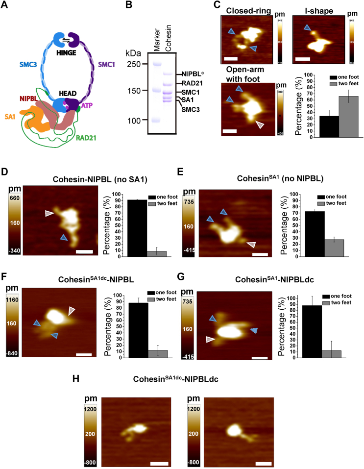
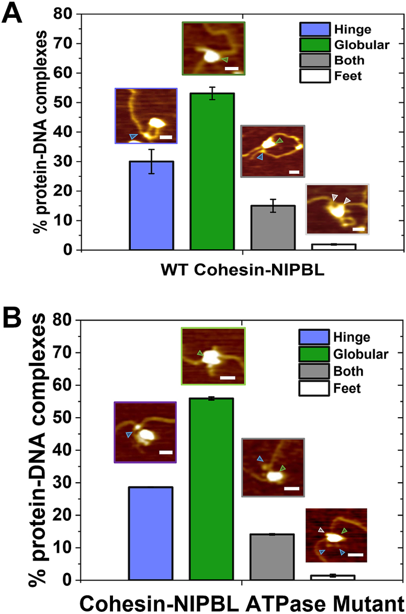
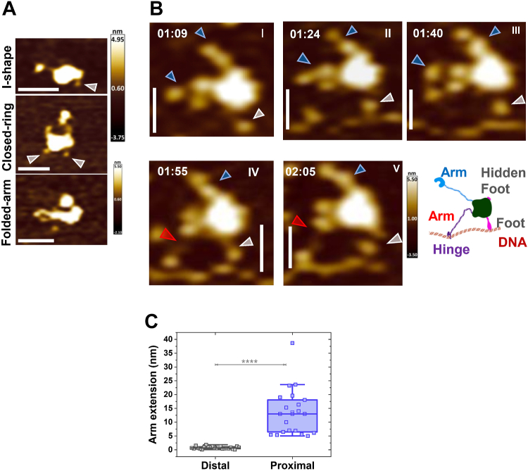
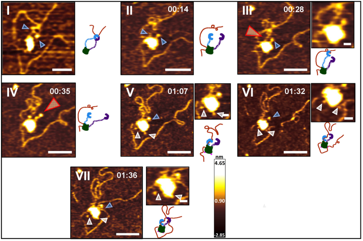
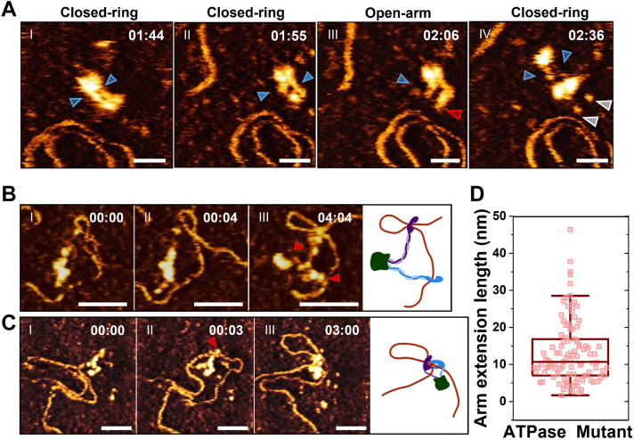
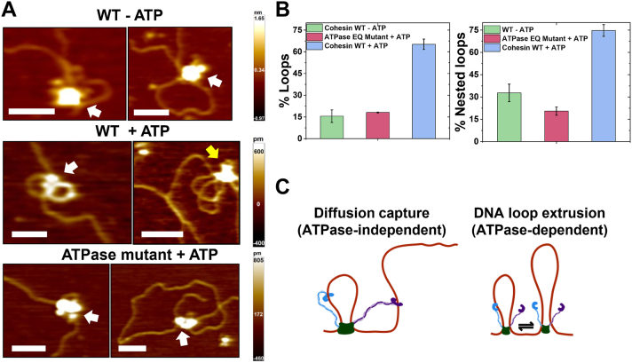
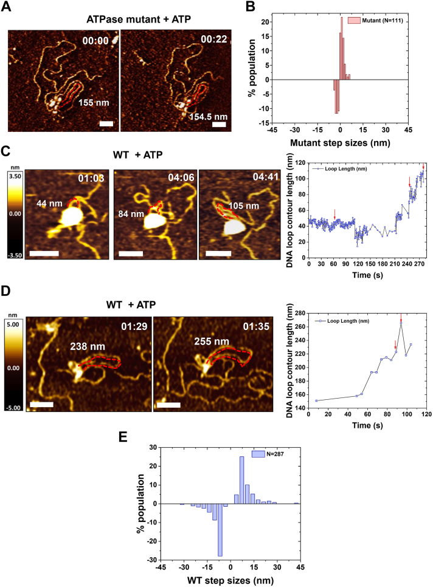
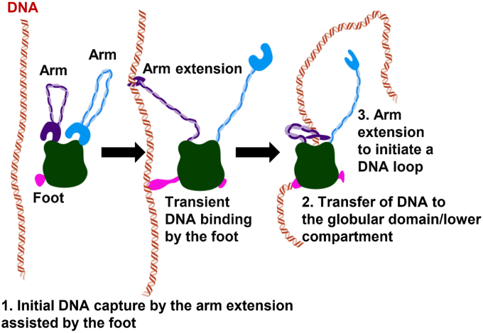

# High-speed AFM imaging reveals DNA capture and loop extrusion dynamics by cohesin-NIPBL

**Parminder Kaur†, Xiaotong Lu, Qi Xu, Elizabeth Marie Irvin, Colette Pappas, Hongshan Zhang, Ilya J. Finkelstein, Zhubing Shi, Yizhi Jane Tao, Hongtao Yu, and Hong Wang†** († co-corresponding)

*Journal of Biological Chemistry*, Volume 299, Issue 11, Pages 105296 (2023)

**DOI:** [10.1016/j.jbc.2023.105296](https://doi.org/10.1016/j.jbc.2023.105296)

---

## Table of Contents

- [Abstract](#abstract)
- [Results](#results)
- [Discussion](#discussion)
- [Experimental Procedures](#experimental-procedures)

---
##  Abstract
3D chromatin organization plays a critical role in regulating gene expression, DNA replication, recombination, and repair. While initially discovered for its role in sister chromatid cohesion, emerging evidence suggests that the cohesin complex (SMC1, SMC3, RAD21, and SA1/SA2), facilitated by NIPBL, mediates topologically associating domains and chromatin loops through DNA loop extrusion. However, information on how conformational changes of cohesin-NIPBL drive its loading onto DNA, initiation, and growth of DNA loops is still lacking. In this study, high-speed atomic force microscopy imaging reveals that cohesin-NIPBL captures DNA through arm extension, assisted by feet (shorter protrusions), and followed by transfer of DNA to its lower compartment (SMC heads, RAD21, SA1, and NIPBL). While binding at the lower compartment, arm extension leads to the capture of a second DNA segment and the initiation of a DNA loop that is independent of ATP hydrolysis. The feet are likely contributed by the C-terminal domains of SA1 and NIPBL and can transiently bind to DNA to facilitate the loading of the cohesin complex onto DNA. Furthermore, high-speed atomic force microscopy imaging reveals distinct forward and reverse DNA loop extrusion steps by cohesin-NIPBL. These results advance our understanding of cohesin by establishing direct experimental evidence for a multistep DNA-binding mechanism mediated by dynamic protein conformational changes.
**Keywords:** high-speed AFM imaging, cohesin DNA binding and loop extrusion, protein–DNA interaction dynamics, multisubunit protein complexes, protein conformational changes
* * *
Large-scale spatial segregation of open and closed chromatin compartments and topologically associating domains (TADs), sub-TADs, and loops fold the genome in interphase ([1](https://pmc.ncbi.nlm.nih.gov/articles/PMC10656236/#bib1), [2](https://pmc.ncbi.nlm.nih.gov/articles/PMC10656236/#bib2), [3](https://pmc.ncbi.nlm.nih.gov/articles/PMC10656236/#bib3), [4](https://pmc.ncbi.nlm.nih.gov/articles/PMC10656236/#bib4), [5](https://pmc.ncbi.nlm.nih.gov/articles/PMC10656236/#bib5)). TADs that contain continuous regions of enriched contact frequencies play essential roles in the timing of DNA replication ([6](https://pmc.ncbi.nlm.nih.gov/articles/PMC10656236/#bib6)), regulation of enhancer-promoter contacts, gene expression, DNA repair, and recombination ([7](https://pmc.ncbi.nlm.nih.gov/articles/PMC10656236/#bib7), [8](https://pmc.ncbi.nlm.nih.gov/articles/PMC10656236/#bib8), [9](https://pmc.ncbi.nlm.nih.gov/articles/PMC10656236/#bib9), [10](https://pmc.ncbi.nlm.nih.gov/articles/PMC10656236/#bib10)). The structural maintenance of chromosomes (SMC) protein family, including cohesin and condensin complexes, play critical roles in 3D chromatin organization in all living organisms ([11](https://pmc.ncbi.nlm.nih.gov/articles/PMC10656236/#bib11), [12](https://pmc.ncbi.nlm.nih.gov/articles/PMC10656236/#bib12), [13](https://pmc.ncbi.nlm.nih.gov/articles/PMC10656236/#bib13)). The core cohesin complex includes SMC1, SMC3, RAD21Scc1, and SA1/SA2Scc3 (humanyeast, [Fig. 1](https://pmc.ncbi.nlm.nih.gov/articles/PMC10656236/#fig1) _A_). SMC proteins (SMC1 and SMC3) form long antiparallel coiled coils (arms), each with a dimerization (hinge) domain at one end and an ABC-type ATPase (head) domain at the other. RAD21Scc1 interconnects the head domains. In addition, SA1 and SA2 (STAG1 and STAG2) directly interact with the CCCTC-binding factor (CTCF), a ubiquitous zinc-finger protein that specifically localizes to CTCF-binding sites along the genome ([14](https://pmc.ncbi.nlm.nih.gov/articles/PMC10656236/#bib14)). Though initially identified as an essential complex to hold sister chromatids together ([15](https://pmc.ncbi.nlm.nih.gov/articles/PMC10656236/#bib15)), numerous studies demonstrated that cohesin is also crucial in mediating 3D chromatin organization during interphase ([16](https://pmc.ncbi.nlm.nih.gov/articles/PMC10656236/#bib16), [17](https://pmc.ncbi.nlm.nih.gov/articles/PMC10656236/#bib17), [18](https://pmc.ncbi.nlm.nih.gov/articles/PMC10656236/#bib18), [19](https://pmc.ncbi.nlm.nih.gov/articles/PMC10656236/#bib19), [20](https://pmc.ncbi.nlm.nih.gov/articles/PMC10656236/#bib20), [21](https://pmc.ncbi.nlm.nih.gov/articles/PMC10656236/#bib21)). Greater than 80% of long-range looping interactions are mediated by some combinations of cohesin, CTCF, and the mediator complex. Cohesin and CTCF are enriched at TAD boundaries and corner peaks that indicate strong interactions at TAD borders ([2](https://pmc.ncbi.nlm.nih.gov/articles/PMC10656236/#bib2), [5](https://pmc.ncbi.nlm.nih.gov/articles/PMC10656236/#bib5)). Furthermore, NIPBL significantly stimulates cohesin's DNA binding and ATPase activities ([22](https://pmc.ncbi.nlm.nih.gov/articles/PMC10656236/#bib22)). RAD21 or NIPBL depletion leads to significantly reduced TADs and corner peaks.

***Figure 1.***

**AFM imaging in air shows diverse conformations and foot structures of cohesin-NIPBL.**_A_ , schematic representation of cohesinSA1-NIPBL based on the cryo-EM structure. _B_ , SDS-PAGE of cohesinSA1-NIPBLc showing individual subunits. _C_ , example AFM images and analysis of the foot structure of WT cohesinSA1-NIPBLc (N = 50). _D_ – _H_ , AFM images (_left_ panels) and analysis of the foot structure (_right_ panels) on the following: cohesin-NIPBL (_D_ , no SA1, N = 114), cohesinSA1 (_E_ , no NIPBL, N = 142), cohesinSA1dc-NIPBL containing SA1 with C-terminal truncation (_F_ , N = 70), cohesinSA1-NIPBLdc containing NIPBL with C-terminal truncation (_G_ , N = 85), and example AFM images of cohesinSA1dc-NIPBLdc monomers (_H_). cohesinSA1dc-NIPBLdc monomers were selected using a cut-off molecular weight of 1020 KDa calculated from measured AFM volumes (Kaur _et al_. 2016 <https://doi.org/10.1038/srep20513>). Scale bar represents 50 nm. The foot structures (_gray arrows_) are identified as the shortest of the protrusions on the same complex, with longer ones as arms (_blue arrows_). N is the number of protein complexes showing foot structures, which are ∼40% to 65% of the total complexes analyzed. Each data set was from two to three repeats. Error bars: SD.
A large body of literature supports a model that cohesin-NIPBL mediates TAD and chromatin loop formation through DNA loop extrusion ([23](https://pmc.ncbi.nlm.nih.gov/articles/PMC10656236/#bib23), [24](https://pmc.ncbi.nlm.nih.gov/articles/PMC10656236/#bib24), [25](https://pmc.ncbi.nlm.nih.gov/articles/PMC10656236/#bib25), [26](https://pmc.ncbi.nlm.nih.gov/articles/PMC10656236/#bib26)). The DNA loop extrusion model posits that cohesin creates DNA loops by actively extruding DNA until they are stabilized by CTCF bound at converging CTCF-binding sites ([27](https://pmc.ncbi.nlm.nih.gov/articles/PMC10656236/#bib27), [28](https://pmc.ncbi.nlm.nih.gov/articles/PMC10656236/#bib28)). Importantly, single-molecule fluorescence imaging studies, including ours, demonstrated that cohesin-NIPBL is capable of DNA loop extrusion in an ATPase-dependent manner ([22](https://pmc.ncbi.nlm.nih.gov/articles/PMC10656236/#bib22), [23](https://pmc.ncbi.nlm.nih.gov/articles/PMC10656236/#bib23)). Several unique features of the cohesin-NIPBL structure have implications in its mechanism of action. Cohesin-NIPBL contains DNA-binding sites on multiple subunits with DNA-binding affinities that differ by two orders of magnitudes ([25](https://pmc.ncbi.nlm.nih.gov/articles/PMC10656236/#bib25)). Previous high-speed atomic force microscopy (HS-AFM) imaging also showed that cohesin and condensin are capable of significant conformational changes. These include SMC ring opening and closing, alignment of the SMC arms, elbow bending, and SMC head engagement and disengagement ([25](https://pmc.ncbi.nlm.nih.gov/articles/PMC10656236/#bib25), [29](https://pmc.ncbi.nlm.nih.gov/articles/PMC10656236/#bib29), [30](https://pmc.ncbi.nlm.nih.gov/articles/PMC10656236/#bib30), [31](https://pmc.ncbi.nlm.nih.gov/articles/PMC10656236/#bib31), [32](https://pmc.ncbi.nlm.nih.gov/articles/PMC10656236/#bib32), [33](https://pmc.ncbi.nlm.nih.gov/articles/PMC10656236/#bib33)). To achieve DNA loop extrusion, cohesin-NIPBL in solution needs first to capture DNA, followed by anchoring onto DNA while still capable of reeling in DNA to enlarge the DNA loop. Observations from single-molecule fluorescence imaging did not provide information on protein conformational changes that drive DNA binding and loop extrusion and could miss intermediate DNA loop extrusion steps by cohesin ([22](https://pmc.ncbi.nlm.nih.gov/articles/PMC10656236/#bib22)). Hence, because of technical challenges in studying dynamic multisubunit cohesin–NIPBL complexes, the mechanism of DNA binding and loop extrusion by cohesin is still under intense debate ([25](https://pmc.ncbi.nlm.nih.gov/articles/PMC10656236/#bib25), [26](https://pmc.ncbi.nlm.nih.gov/articles/PMC10656236/#bib26), [33](https://pmc.ncbi.nlm.nih.gov/articles/PMC10656236/#bib33), [34](https://pmc.ncbi.nlm.nih.gov/articles/PMC10656236/#bib34), [35](https://pmc.ncbi.nlm.nih.gov/articles/PMC10656236/#bib35), [36](https://pmc.ncbi.nlm.nih.gov/articles/PMC10656236/#bib36)). Several key questions remain unanswered regarding DNA binding and loop extrusion by cohesin-NIPBL, such as the following: (1) How do each DNA-binding site and protein conformational change contribute to initial DNA binding and loop extrusion? (2) What sequential steps lead to DNA binding and initiation of a DNA loop? (3) What are the DNA loop extrusion step sizes?
Here, we applied traditional AFM imaging in air and HS-AFM imaging in liquids to reveal the structure and dynamics of cohesin-NIPBL–mediated DNA binding and loop extrusion. Our AFM studies show that cohesin-NIPBL uses arm extension to capture DNA and initiate DNA loops independent of ATPase hydrolysis. Surprisingly, foot-like protrusions on cohesin-NIPBL can transiently bind to DNA and facilitate the loading of the cohesin–NIPBL complex onto DNA. Furthermore, HS-AFM imaging reveals distinct forward and reverse DNA loop extrusion steps. These results shed new light on the cohesin-mediated DNA loop extrusion mechanism and provide new directions for future investigation of diverse biological functions of cohesin.
---
##  Results
### Diverse cohesin-NIPBL conformations and foot structures
Recent studies demonstrated that cohesin-NIPBL contains multiple DNA-binding sites, including the ones on the interface between SMC1 and SMC3 hinges, SMC heads, SA1/SA2 ([37](https://pmc.ncbi.nlm.nih.gov/articles/PMC10656236/#bib37)), and NIPBL ([25](https://pmc.ncbi.nlm.nih.gov/articles/PMC10656236/#bib25)). These DNA-binding sites are essential for DNA loop extrusion ([25](https://pmc.ncbi.nlm.nih.gov/articles/PMC10656236/#bib25)). Despite these new discoveries, our understanding of how each DNA-binding domain on cohesin-NIPBL contributes to cohesin loading onto DNA is limited. To directly address this question, we purified WT cohesinSA1-NIPBLc ([Fig. 1](https://pmc.ncbi.nlm.nih.gov/articles/PMC10656236/#fig1) _B_) ([22](https://pmc.ncbi.nlm.nih.gov/articles/PMC10656236/#bib22), [38](https://pmc.ncbi.nlm.nih.gov/articles/PMC10656236/#bib38)), which was shown to be active in DNA loop extrusion and contains SA1 and the C-terminal HEAT repeat domain of NIPBL ([22](https://pmc.ncbi.nlm.nih.gov/articles/PMC10656236/#bib22)). We applied AFM imaging in air and HS-AFM imaging in liquids ([39](https://pmc.ncbi.nlm.nih.gov/articles/PMC10656236/#bib39)) to investigate the structure and dynamics of cohesinSA1-NIPBLc alone and in complexes with DNA. Consistent with the previous literature ([25](https://pmc.ncbi.nlm.nih.gov/articles/PMC10656236/#bib25)), AFM images of the cohesinSA1-NIPBLc collected in the air (+2.5 mM ATP, [Fig. 1](https://pmc.ncbi.nlm.nih.gov/articles/PMC10656236/#fig1) _C_) showed monomers with SMC arms (blue arrows, [Fig. 1](https://pmc.ncbi.nlm.nih.gov/articles/PMC10656236/#fig1) _C_) distinguishable from the globular domain, that is, the lower compartment that includes SMC heads, RAD21, SA1, and NIPBLc. Based on their distinct arm features, cohesinSA1-NIPBLc monomers (Ntotal = 127) can be categorized into several classes ([Fig. 1](https://pmc.ncbi.nlm.nih.gov/articles/PMC10656236/#fig1) _C_), including closed-ring (18.1%), I-shape with closely aligned SMC arms (23.8%), open-arm (21.3%), and those unclassifiable (36.8%). These data suggest that the SMC1/SMC3 hinge interface is highly dynamic, switching between open-arm and closed-ring conformations. Importantly, hinge opening is consistent with the recent discovery of the SMC1/SMC3 hinge interface as one of the DNA entry gates for yeast cohesin ([40](https://pmc.ncbi.nlm.nih.gov/articles/PMC10656236/#bib40)).
Unexpectedly, in addition to arms, a subpopulation of WT cohesinSA1-NIPBLc molecules (∼40% to 65% from three protein preparations) showed short protrusions (feet). Among cohesinSA1-NIPBLc molecules showing the foot structure, approximately 34.0% displayed one foot and 66.0% displayed two feet ([Fig. 1](https://pmc.ncbi.nlm.nih.gov/articles/PMC10656236/#fig1) _C_). Relative to arms, the feet were positioned at the opposite side of the globular domain/lower compartment and displayed shorter lengths (25 nm ± 7 nm, N = 50) than the SMC1/SMC3 arms (51 nm ± 15 nm, N = 50). We hypothesized that each cohesinSA1–NIPBLc complex contains two feet, with the possibility of either one or two feet hidden under the globular domain in AFM images. We speculated that the foot structures are the C-terminal domains of SA1 and NIPBL, which were disordered in the cryo-EM structure of cohesinSA1-NIPBLc ([38](https://pmc.ncbi.nlm.nih.gov/articles/PMC10656236/#bib38)). To test this hypothesis, we imaged five additional complexes, including cohesin-NIPBLc no SA1, cohesinSA1 no NIPBLc, cohesinSA1dc-NIPBL (containing SA1 1–1054 AAs without its C terminus), cohesinSA1-NIPBLdc (containing NIPBL1163-2603 AAs without its C terminus), and cohesinSA1dc-NIPBLdc. In AFM images, cohesin-NIPBLc no SA1, cohesinSA1 alone no NIPBLc, cohesinSA1dc-NIPBL, and cohesinSA1-NIPBLdc all displayed predominantly one foot ([Fig. 1](https://pmc.ncbi.nlm.nih.gov/articles/PMC10656236/#fig1), _D_ – _G_). We speculated that the small percentage of cohesin complexes showing two feet without either the SA1/NIPBL subunit or their C-terminal domains might be due to SA1 and NIPBL self-dimerization. Consistent with this hypothesis, while most of SA1dc existed as monomers, a small percentage of molecules displayed AFM volumes greater than SA1dc monomers ([Fig. S1](https://pmc.ncbi.nlm.nih.gov/articles/PMC10656236/#appsec1), _A_ and _B_). For NIPBLdc alone, while the formation of large protein aggregations (∼50% of the total complexes) complicated the interpretation of the results, AFM image analysis also showed complexes displayed AFM volumes greater than NIPBL monomers ([Fig. S1](https://pmc.ncbi.nlm.nih.gov/articles/PMC10656236/#appsec1) _C_). While the biological relevance of higher-order SA1 and NIPBL oligomers is unknown, these results suggest that cohesinSA1dc-NIPBL and cohesinSA1-NIPBLdc showing two feet could be due to the oligomerization of NIPBL and SA1, respectively, in a small population of cohesin complexes _in vitro_. Due to the aggregation of NIPBLdc alone, for cohesinSA1dc-NIPBLdc, we analyzed complexes with globular domain AFM volumes consistent with monomers, based on a previously established standard curve relating AFM volume and molecular weight ([41](https://pmc.ncbi.nlm.nih.gov/articles/PMC10656236/#bib41)). This analysis revealed that cohesinSA1dc-NIPBLdc predominantly (∼95%, N = 70) showed no foot ([Fig. 1](https://pmc.ncbi.nlm.nih.gov/articles/PMC10656236/#fig1) _H_). The small percentages of cohesinSA1dc-NIPBLdc molecules showing either one (4%) or two (1%) additional protrusions might be due to arms from oligomerized complexes. In summary, AFM imaging in air shows that foot structures are distinct from SMC1/SMC3 arms and suggests that each C-terminal domain of SA1 and NIPBL contributes to one foot.
A recent study identified three dsDNA-binding patches on SA1, including Patch 1 (K92, K95, K172, and K173), 2 (K555, K558, and R564), and 3 (K969, R971, K1013, and R1016) ([25](https://pmc.ncbi.nlm.nih.gov/articles/PMC10656236/#bib25)). However, DNA binding by the C-terminal domains of SA1/SA2 and NIPBL, which were disordered in the cryo-EM structure of cohesin-NIPBL ([38](https://pmc.ncbi.nlm.nih.gov/articles/PMC10656236/#bib38)), has not been investigated. SA1 and SA2 are highly similar, with approximately 70% sequence identity ([42](https://pmc.ncbi.nlm.nih.gov/articles/PMC10656236/#bib42)). To further establish DNA-binding domains on SA1/SA2, we purified WT full-length SA2 (1–1231 AAs) and SA2 fragments, including the N-terminal (1–301 AAs or 1–450 AAs) and C-terminal (1052–1231 AAs) domains ([Fig. S2](https://pmc.ncbi.nlm.nih.gov/articles/PMC10656236/#appsec1) _A_) ([43](https://pmc.ncbi.nlm.nih.gov/articles/PMC10656236/#bib43)). Fluorescence anisotropy measurements using a fluorescently labeled dsDNA substrate (45 bp) revealed that SA2 contains extensive DNA-binding surfaces. Compared to the full-length SA2 (Kd = 63.5 nM ± 1.1 nM), the highest binding affinity is contributed by its N-terminal domain (1–302 AAs: Kd = 110.2 nM ± 7.1 nM; 1–450 AAs: Kd = 55.7 nM ± 0.4 nM) and its C-terminal domain binds to dsDNA weakly (1052–1231 AAs: Kd = 1500.2 nM ± 0.02 nM, [Fig. S2](https://pmc.ncbi.nlm.nih.gov/articles/PMC10656236/#appsec1), _B_ – _E_). Consistent with these results, we showed previously that deletion of the C-terminal domain of SA2 reduces its binding affinity for dsDNA ([44](https://pmc.ncbi.nlm.nih.gov/articles/PMC10656236/#bib44)). Thus, these results from fluorescence anisotropy suggest that the C-terminal domain of SA1/SA2 has the potential to bind DNA. Indeed, the C-terminal domain of SA1/SA2 can easily get cleaved during protein purification ([43](https://pmc.ncbi.nlm.nih.gov/articles/PMC10656236/#bib43)), suggesting that this domain has an extended structure, consistent with the foot-like feature observed in AFM images.
### DNA binding and loop initiation by cohesin-NIPBL
To study DNA binding by cohesin-NIPBL, we first employed AFM imaging in air to examine samples of cohesinSA1-NIPBLc and dsDNA (5.19 kb) deposited onto a mica surface (+2.5 mM ATP). Furthermore, to determine if ATPase activity changes DNA-binding modes, we purified the ATP-binding proficient and ATPase-deficient SMC1A-E1157Q/SMC3-E1144Q (EQ) cohesinSA1-NIPBLc mutant. Both WT and ATPase mutant cohesinSA1–NIPBLc complexes were randomly distributed on internal sites along dsDNA ([Fig. S3](https://pmc.ncbi.nlm.nih.gov/articles/PMC10656236/#appsec1)). AFM images revealed different DNA-binding modes by WT cohesinSA1-NIPBLc, as seen previously for condensin ([33](https://pmc.ncbi.nlm.nih.gov/articles/PMC10656236/#bib33)). WT cohesinSA1-NIPBLc molecules bound to DNA through the arm-hinge ([Fig. 2](https://pmc.ncbi.nlm.nih.gov/articles/PMC10656236/#fig2) _A_ , 30.0% ± 4.1%), the globular domain (53.0% ± 2.1%), both the arm-hinge and globular domains (15.0% ± 2.2%), or the foot (1.9% ± 0.2%). We observed similar DNA-binding modes by the ATPase-deficient EQ cohesinSA1-NIPBLc mutant in AFM images (+ATP, [Fig. 2](https://pmc.ncbi.nlm.nih.gov/articles/PMC10656236/#fig2) _B_). These results suggest that ATP hydrolysis is not needed for cohesinSA1-NIPBLc loading onto DNA. It is worth noting that a previous AFM study reported DNA binding through the globular and hinge domains of condensin ([33](https://pmc.ncbi.nlm.nih.gov/articles/PMC10656236/#bib33)).
#### Figure 2.

**DNA binding by WT and ATPase mutant cohesin-NIPBL revealed by AFM imaging in air.**_A_ and _B_ , percentages of WT (_A_) and ATPase mutant (_B_) cohesinSA1–NIPBLc–DNA complexes with the arm-hinge, globular, both arm-hinge and globular domains, or foot binding to DNA. Inserts: example AFM images of cohesinSA1-NIPBLc binding to DNA. DNA: 5.19 kb; + 2.5 mM ATP. WT cohesinSA1-NIPBLc molecules (N = 105) bound to DNA through the arm-hinge (30.0% ± 4.1%), the globular domain (53.0% ± 2.1%), both the arm-hinge and globular domains (15.0% ± 2.2%), or the foot (1.9% ± 0.2%). The ATPase mutant cohesinSA1–NIPBLc complexes (N = 157) bound to DNA through the arm-hinge (28.6% ± 0.1%), the globular domain (55.9% ± 0.5%), both the arm-hinge and globular domains (14.1% ± 0.2%), or the foot (1.4% ± 0.4%). XY scale bar represents 50 nm. _Blue arrow_ : arm; _green arrow_ : globular domain; _gray arrow_ : foot. At least two independent experiments are performed. Error bars: SD.
To further study how cohesin-NIPBL dynamically loads onto DNA and initiates a DNA loop, we applied HS-AFM imaging of WT or ATPase mutant cohesinSA1-NIPBLc in the presence of dsDNA. We recently developed robust sample deposition conditions on a 1-(3-Aminopropyl)silatrane (APS)-treated mica (APS-mica) surface ([45](https://pmc.ncbi.nlm.nih.gov/articles/PMC10656236/#bib45)). This development enabled us to observe real-time domain protrusion by Twinkle helicase during initial DNA loading ([46](https://pmc.ncbi.nlm.nih.gov/articles/PMC10656236/#bib46)). We first deposited WT cohesinSA1-NIPBLc (30 nM) with DNA (3 nM, 5.19 kb) onto an APS-mica surface after 16-fold dilution and scanned the sample in a buffer containing ATP (+4 mM ATP) using either a Cypher VRS or JPK NanoWizard HS-AFM at a scan rate of 0.4 to 2.3 frames/s. Importantly, under our sample deposition and imaging conditions, both proteins and DNA were mobile on the APS-mica surface. In time-lapse HS-AFM images, cohesinSA1-NIPBLc displayed similar conformations as observed in the static images collected in air ([Fig. 1](https://pmc.ncbi.nlm.nih.gov/articles/PMC10656236/#fig1)), including I-shape, closed-ring, and folded-arm with some complexes showing protruding feet ([Fig. 3](https://pmc.ncbi.nlm.nih.gov/articles/PMC10656236/#fig3) _A_). CohesinSA1-NIPBLc was highly dynamic in the presence of DNA ([Fig. 3](https://pmc.ncbi.nlm.nih.gov/articles/PMC10656236/#fig3) _B_). [Figure 3](https://pmc.ncbi.nlm.nih.gov/articles/PMC10656236/#fig3) _B_ shows one example of a monomeric WT cohesinSA1-NIPBLc molecule with two arms and a bent elbow extending its arm-hinge domain to capture DNA in proximity (red arrows, [Fig. 3](https://pmc.ncbi.nlm.nih.gov/articles/PMC10656236/#fig3) _B_). The contact between the hinge domain and DNA was validated in the AFM height profile analysis, which demonstrated the height continuity between the hinge domain and DNA ([Fig. S4](https://pmc.ncbi.nlm.nih.gov/articles/PMC10656236/#appsec1) _A_). Both arms from this cohesinSA1-NIPBLc molecule attempted to capture the DNA nearby ([Video S1](https://pmc.ncbi.nlm.nih.gov/articles/PMC10656236/#appsec1)). Interestingly, a foot was also visible on this cohesinSA1-NIPBLc molecule (gray arrow, [Fig. 2](https://pmc.ncbi.nlm.nih.gov/articles/PMC10656236/#fig2) _B_), which transiently interacted with the DNA. The foot structure connected to the cohesin-NIPBL can be differentiated from small free particles (likely due to degradations) based on their height profile continuity from the globular domain ([Fig. S4](https://pmc.ncbi.nlm.nih.gov/articles/PMC10656236/#appsec1), _B_ and _C_). In HS-AFM images, approximately 60% of cohesin SA1-NIPBLc molecules (N = 50) showed either one foot or two feet.
#### Figure 3.

**Real-time HS-AFM imaging in liquids reveals that WT cohesin-NIPBL captures DNA through the extension of the arm-hinge domain.**_A_ , HS-AFM images showing diverse conformations of WT cohesinSA1-NIPBLc in liquids (+4 mM ATP). _B_ , DNA capture by the extension of the arm-hinge domain on WT cohesinSA1-NIPBLc (+4 mM ATP). DNA substrate: 5.19 kb. Also see [Video S1](https://pmc.ncbi.nlm.nih.gov/articles/PMC10656236/#appsec1). _Blue arrow_ : arm; _red arrow_ : arm extension; _gray arrow_ : foot. Time: min:s. XY scale bar represents 50 nm. _C_ , box-plot of arm extension lengths for WT cohesinSA1-NIPBLc at a distal (>500 nm distance, N = 24 events) or proximal (<50 nm distance, N = 21 events) location from the DNA. Total: three experiments; 0.4 to 2.3 frame/s. Error bars: SD. ∗∗∗∗ _p_ < 10−8. HS-AFM, high-speed atomic force microscopy.
To investigate whether the presence of DNA drives arm extension, we further analyzed the change in arm lengths measured between consecutive HS-AFM image frames for WT cohesinSA1-NIPBLc when the protein complex was either close to (<50 nm distance) or far from (>500 nm distance) DNA. Strikingly, the arm-hinge extended significantly (_p_ < 2.5 × 10−9) longer for cohesinSA1-NIPBLc proximal to the DNA (Nproximal = 21, 13.6 nm ± 8.4 nm) than protein complexes distal to the DNA (Ndistal = 24, 0.8 nm ± 0.5 nm, [Fig. 3](https://pmc.ncbi.nlm.nih.gov/articles/PMC10656236/#fig3) _C_).
Furthermore, we observed sequential events showing DNA being captured by the arm-hinge domain, followed by the transfer of DNA to the globular domain on WT cohesinSA1-NIPBLc ([Fig. 4](https://pmc.ncbi.nlm.nih.gov/articles/PMC10656236/#fig4) and [Video S2](https://pmc.ncbi.nlm.nih.gov/articles/PMC10656236/#appsec1)). This example in [Figure 4](https://pmc.ncbi.nlm.nih.gov/articles/PMC10656236/#fig4) shows a WT cohesinSA1-NIPBLc monomer with a closed-ring configuration that was initially proximal to the DNA ([Fig. 4](https://pmc.ncbi.nlm.nih.gov/articles/PMC10656236/#fig4) _I_). The DNA was bent while being captured by the arm-hinge domain ([Fig. 4](https://pmc.ncbi.nlm.nih.gov/articles/PMC10656236/#fig4) _I_) and then transferred to the globular domain ([Fig. 4](https://pmc.ncbi.nlm.nih.gov/articles/PMC10656236/#fig4)II). During the time interval when DNA was bound to the globular domain, the arm-hinge domains were open and extended out, trying to capture the nearby DNA at the top (red arrow, [Fig. 4](https://pmc.ncbi.nlm.nih.gov/articles/PMC10656236/#fig4)III) or on the right (red arrow, [Fig. 4](https://pmc.ncbi.nlm.nih.gov/articles/PMC10656236/#fig4)IV). Notably, two feet were visible in some frames (gray arrows, [Fig. 4](https://pmc.ncbi.nlm.nih.gov/articles/PMC10656236/#fig4), _V_ , VI, and VII), which appeared to interact with DNA transiently ([Fig. 4](https://pmc.ncbi.nlm.nih.gov/articles/PMC10656236/#fig4)VI). Finally, a DNA loop was initiated after the capture of the nearby DNA segment by its arm-hinge domain ([Fig. 4](https://pmc.ncbi.nlm.nih.gov/articles/PMC10656236/#fig4)VII). Transient DNA binding by the foot is a recurring feature observed in HS-AFM imaging for both WT and ATPase mutant cohesinSA1-NIPBLc (N = 14 molecules).
#### Figure 4.

**HS-AFM imaging in liquids shows sequential DNA-binding events and the initiation of a DNA loop by WT cohesin-NIPBL.** Time-lapse HS-AFM images (_left panels_) and models (_right panels_) showing initial DNA capture by the arm-hinge domain (I), transfer of DNA binding to the globular domain (II), arm extension (III and IV), and the initiation of a DNA loop by the arm-hinge domain on WT cohesinSA1-NIPBLc (VII); + 4 mM ATP. Also see [Video S2](https://pmc.ncbi.nlm.nih.gov/articles/PMC10656236/#appsec1). Panel I is from an earlier time-lapse series of the same molecule. Images on top of the models: zoomed images. DNA substrate: 5.19 kb. _Blue arrow_ : arm; _red arrow_ : arm extension; _gray arrow_ : foot. Time: min:s. XY scale bar represents 50 nm in large images and represents 10 nm in Zoomed images. HS-AFM, high-speed atomic force microscopy.
While cohesinSA1-NIPBLc EQ ATPase mutant is expected to retain nucleotide-binding activity, it displays minimal ATPase catalytic activity in the presence of DNA and NIPBLc ([22](https://pmc.ncbi.nlm.nih.gov/articles/PMC10656236/#bib22)). If initial DNA capture by the cohesin arm-hinge domain depends on ATPase hydrolysis, the cohesinSA1-NIPBLc EQ ATPase mutant would be defective in arm extension. However, the cohesinSA1-NIPBLc ATPase mutant displayed initial DNA capture processes similar to WT cohesinSA1-NIPBLc ([Fig. 5](https://pmc.ncbi.nlm.nih.gov/articles/PMC10656236/#fig5)). [Figure 5](https://pmc.ncbi.nlm.nih.gov/articles/PMC10656236/#fig5) _A_ shows an example of a cohesinSA1-NIPBLc ATPase mutant monomer with two arms displaying dynamic conformational changes before binding to DNA, including closed-ring and open-arm with bent elbows ([Fig. 5](https://pmc.ncbi.nlm.nih.gov/articles/PMC10656236/#fig5) _A_ and [Video S3](https://pmc.ncbi.nlm.nih.gov/articles/PMC10656236/#appsec1)) ([25](https://pmc.ncbi.nlm.nih.gov/articles/PMC10656236/#bib25)). Similar to the WT complex, cohesinSA1-NIPBLc ATPase mutant captured DNA through dramatic conformational changes and extension of the arm-hinge domain (red arrows in [Fig. 5](https://pmc.ncbi.nlm.nih.gov/articles/PMC10656236/#fig5), _B_ and C and [Videos S4](https://pmc.ncbi.nlm.nih.gov/articles/PMC10656236/#appsec1) and [S5](https://pmc.ncbi.nlm.nih.gov/articles/PMC10656236/#appsec1)). The average length of arm extension for the cohesinSA1-NIPBLc ATPase mutant proximal to the DNA was measured to be 13.2 (±8.6) nm ([Fig. 5](https://pmc.ncbi.nlm.nih.gov/articles/PMC10656236/#fig5) _D_), comparable to the WT cohesin complex ([Fig. 3](https://pmc.ncbi.nlm.nih.gov/articles/PMC10656236/#fig3) _C_). Importantly, arm extension events were in random directions relative to the scan direction of the AFM tip. These observations rule out the assumption that arm extension is triggered by AFM tips dragging the protein. Interestingly, HS-AFM imaging revealed diffusion (walking) of the cohesinSA1-NIPBLc ATPase mutant on DNA using short protrusions ([Fig. S5](https://pmc.ncbi.nlm.nih.gov/articles/PMC10656236/#appsec1) and [Videos S3](https://pmc.ncbi.nlm.nih.gov/articles/PMC10656236/#appsec1) and [S4](https://pmc.ncbi.nlm.nih.gov/articles/PMC10656236/#appsec1)).
#### Figure 5.

**HS-AFM imaging in liquids demonstrates that the cohesin-NIPBL ATPase mutant captures DNA through the extension of the arm-hinge domain.**_A_ , conformational changes of cohesinSA1-NIPBLc ATPase mutant ([Video S3](https://pmc.ncbi.nlm.nih.gov/articles/PMC10656236/#appsec1)). _B_ and _C_ , DNA capture through arm extension by the cohesinSA1-NIPBLc ATPase mutant (_B_ : [Video S4](https://pmc.ncbi.nlm.nih.gov/articles/PMC10656236/#appsec1); _C_ : [Video S5](https://pmc.ncbi.nlm.nih.gov/articles/PMC10656236/#appsec1)). The buffer contains 4 mM ATP. _Right panels_ in _B_ and _C_ : models. _Blue arrow_ : arm; _red arrow_ : arm extension; _gray arrow_ : foot. XY scale bar represents 50 nm. Time: min:s. _D_ , box plot showing arm extension lengths (13.2 nm ± 8.6 nm, N = 102 events) on the cohesinSA1-NIPBLc ATPase mutant at proximal (<50 nm distance) location from DNA. HS-AFM, high-speed atomic force microscopy.
HS-AFM imaging in liquids relies on an intricate balance to keep protein and DNA molecules partially anchored onto a surface while still being mobile. A previous HS-AFM study hinted that a bare mica surface is not suitable for studying the dynamics of DNA binding by cohesin-NIPBL ([25](https://pmc.ncbi.nlm.nih.gov/articles/PMC10656236/#bib25)). By tuning the APS concentration on a mica surface ([45](https://pmc.ncbi.nlm.nih.gov/articles/PMC10656236/#bib45)), we were able to observe cohesin with diverse motion on the surface, from mobile arms to a whole cohesin molecule randomly diffusing on a surface to capture nearby DNA ([Fig. 5](https://pmc.ncbi.nlm.nih.gov/articles/PMC10656236/#fig5) _A_ and [Video S3](https://pmc.ncbi.nlm.nih.gov/articles/PMC10656236/#appsec1)). In summary, HS-AFM imaging might not capture each protein complex’s full range of motion and the complete process from DNA loading to loop extrusion. However, by gathering information from HS-AFM images of many dynamic molecules, HS-AFM imaging provides a unique window into sequential events and protein conformational changes during DNA binding. Furthermore, it is worth noting that in HS-AFM images, cohesinSA1-NIPBLc molecules might display transient extra “small domains” on the arms ([Fig. 3](https://pmc.ncbi.nlm.nih.gov/articles/PMC10656236/#fig3) _B_ III) in addition to the previously reported hinge and elbow. These extra “domains” in HS-AFM images are likely due to the dynamic nature of the arms and transient surface anchoring at these regions. In addition, DNA might display missing regions due to temporary detachment from the surface ([Fig. 4](https://pmc.ncbi.nlm.nih.gov/articles/PMC10656236/#fig4)VI). These features are intrinsic to an “active” complex on an APS-mica surface.
### ATPase-independent and ATPase-dependent cohesin-NIPBL mediated DNA looping and bending
HS-AFM imaging shows that both WT and ATPase mutant cohesinSA1-NIPBLc can form DNA loops through diffusion capture of DNA segments in proximity ([Figs. 4](https://pmc.ncbi.nlm.nih.gov/articles/PMC10656236/#fig4) and [5](https://pmc.ncbi.nlm.nih.gov/articles/PMC10656236/#fig5)). Next, we directly compared the DNA looping efficiency and loop structures mediated by WT and ATPase mutant cohesinSA1-NIPBLc. AFM images (collected in air) of WT (±ATP) and ATPase mutant (+ATP) cohesinSA1-NIPBLc (30 nM) in the presence of dsDNA (5.19 kb, 6 nM) showed distinct protein-mediated DNA loops ([Fig. 6](https://pmc.ncbi.nlm.nih.gov/articles/PMC10656236/#fig6)). On incubating WT (-ATP) or ATPase mutant cohesinSA1-NIPBLc (+ATP) with the linear dsDNA, 15.6% (±4.3%) and 18.1% (±0.3%) of dsDNA molecules, respectively, contained protein-mediated DNA loops ([Fig. 6](https://pmc.ncbi.nlm.nih.gov/articles/PMC10656236/#fig6) _B_). For WT cohesinSA1-NIPBLc, the addition of ATP (+2.5 mM ATP) significantly increased (_p_ < 0.05) the population of DNA molecules with protein-mediated loops to 65.2% (±3.6%, [Fig. 6](https://pmc.ncbi.nlm.nih.gov/articles/PMC10656236/#fig6) _B_). Furthermore, AFM imaging revealed cohesinSA1-NIPBLc–mediated nested DNA loops (a loop within a loop, yellow arrows in [Fig. 6](https://pmc.ncbi.nlm.nih.gov/articles/PMC10656236/#fig6) _A_). Nested DNA loops can be generated when cohesin-NIPBL at an existing DNA loop captures an additional DNA segment (ATPase-independent) or two separate cohesin-NIPBL molecules on the same DNA collide after DNA loop extrusion (ATPase-dependent, [Fig. 6](https://pmc.ncbi.nlm.nih.gov/articles/PMC10656236/#fig6) _C_) ([47](https://pmc.ncbi.nlm.nih.gov/articles/PMC10656236/#bib47)). The population of nested DNA loops out of total DNA loops observed for WT cohesinSA1-NIPBLc in the presence of ATP (74.7% ± 4.0%) was significantly (_p_ < 0.05) greater than that observed for either WT cohesinSA1-NIPBLc without ATP (32.8% ± 5.9%) or the ATPase mutant (20.6% ± 2.8%, [Fig. 6](https://pmc.ncbi.nlm.nih.gov/articles/PMC10656236/#fig6) _B_). In comparison, less than 5% of DNA alone (N = 100) without cohesinSA1-NIPBL showed loop structures. This result supported the notion that DNA loops in the presence of cohesinSA1-NIPBL were not due to the capture of existing DNA loops by proteins. Instead, these results collectively suggest that cohesin-NIPBL mediates DNA loops through two distinct mechanisms: ATPase-independent diffusion capture of DNA segments in proximity and ATPase-dependent DNA loop extrusion ([Fig. 6](https://pmc.ncbi.nlm.nih.gov/articles/PMC10656236/#fig6) _C_). Furthermore, compared to the WT cohesinSA1-NIPBL, the absence of the C-terminal domains of either SA1 or NIPBL significantly reduced the percentage of cohesinSA1-NIPBL–DNA complex binding on DNA ([Fig. S6](https://pmc.ncbi.nlm.nih.gov/articles/PMC10656236/#appsec1), _A_ – _C_). This result suggested that the C-terminal domains of SA1 and NIPBL (the foot structures) directly contribute to the loading of cohesin–NIPBL complex onto DNA. In comparison, the percentages of DNA loops and nested loops were only slightly reduced ([Fig. S6](https://pmc.ncbi.nlm.nih.gov/articles/PMC10656236/#appsec1), _D_ and _E_).
#### Figure 6.

**AFM imaging in air reveals cohesin-NIPBL–mediated DNA loops.**_A_ , representative AFM images of DNA loops mediated by WT cohesinSA1-NIPBLc in the absence (_top_) and presence of ATP (_middle_) and the cohesinSA1-NIPBLc ATPase mutant in the presence of ATP (_bottom_) on linear DNA. CohesinSA1-NIPBLc: 30 nM; DNA (5.19 kb): 6 nM; ATP: 2.5 mM. _White arrow_ : single loop; _Yellow arrow_ : nested loop. XY scale bar represents 100 nm. _B_ , quantification of the percentages of DNA molecules containing protein-mediated total DNA loops (_left panel_ , N = 155 DNA) and nested loops out of total DNA loops (_right panel_). Error bars: SD. Two experiments for each condition. _C_ , a model representing mechanisms of ATPase-independent diffusion capture of an additional DNA segment (_left panel_) and ATPase-dependent DNA loop extrusion by cohesin-NIPBL that might lead to nested DNA loops (_right panel_).
In addition to DNA loops, AFM imaging in air revealed cohesinSA1-NIPBLc–induced DNA bending ([Fig. S7](https://pmc.ncbi.nlm.nih.gov/articles/PMC10656236/#appsec1)). While DNA alone showed slight bending (27.5o ± 26.0o, +ATP), WT cohesinSA1-NIPBLc in the absence of ATP (43.7o ± 20.5o) and cohesinSA1-NIPBLc ATPase mutant (+ATP, 47.3o ± 41.0o) induced significantly (_p_ < 0.05) higher degrees of DNA bending ([Fig. S7](https://pmc.ncbi.nlm.nih.gov/articles/PMC10656236/#appsec1), _A_ – _D_). Furthermore, compared to DNA binding by WT cohesinSA1-NIPBLc without ATP, the presence of ATP further augmented (_p_ < 0.05) the DNA bending (57.2o ± 27.6o, [Fig. S7](https://pmc.ncbi.nlm.nih.gov/articles/PMC10656236/#appsec1) _D_). Additionally, we compared the DNA bending angles induced by either the globular or the hinge domain. The globular domain on WT and ATPase mutant cohesinSA1-NIPBLc induced comparable DNA bending, which was significantly (_p_ < 0.05) higher than what was induced by the hinge domains ([Fig. S7](https://pmc.ncbi.nlm.nih.gov/articles/PMC10656236/#appsec1) _E_). In summary, these results from AFM imaging demonstrate that cohesin-NIPBL bends DNA at different DNA-binding steps, which is independent of ATP hydrolysis and could facilitate DNA looping.
### HS-AFM imaging in liquids reveals DNA loop extrusion dynamics by cohesin-NIPBL
AFM imaging in air revealed that WT cohesinSA1-NIPBLc in the presence of ATP induced a higher percentage of DNA loops than the WT protein complex without ATP or the ATPase mutant ([Fig. 6](https://pmc.ncbi.nlm.nih.gov/articles/PMC10656236/#fig6)). This result is consistent with the notion that WT cohesinSA1-NIPBLc is capable of DNA loop extrusion in an ATP hydrolysis–dependent manner. A recent study using magnetic tweezers with a resolution of ∼10 nm revealed a broad distribution of DNA looping step sizes by condensin ([48](https://pmc.ncbi.nlm.nih.gov/articles/PMC10656236/#bib48)). We expected that real-time HS-AFM imaging of cohesinSA1-NIPBLc with DNA (+ATP) would directly reveal DNA extrusion steps. Because DNA movement during imaging could contribute to slight DNA length fluctuations without DNA loop extrusion, we first carried out control experiments using HS-AFM imaging to measure DNA loop length changes for the cohesinSA1-NIPBLc ATPase mutant (+ATP, [Figs. 7](https://pmc.ncbi.nlm.nih.gov/articles/PMC10656236/#fig7) _A_ and [S8](https://pmc.ncbi.nlm.nih.gov/articles/PMC10656236/#appsec1) _A_). The DNA loop length changes (step sizes) measured between HS-AFM image frames fluctuated slightly with small forward (increased, 1.2 nm ± 1.1 nm) and reverse (decreased, −1.34 nm ± 1.0 nm) changes (normalized to per second, [Fig. 7](https://pmc.ncbi.nlm.nih.gov/articles/PMC10656236/#fig7) _B_). In stark contrast, DNA loop lengths mediated by WT cohesinSA1-NIPBLc (+ATP) showed forward and reverse step sizes, significantly higher than the background fluctuation observed for the ATPase mutant ([Figs. 7](https://pmc.ncbi.nlm.nih.gov/articles/PMC10656236/#fig7), _C_ and _D_ , [S8](https://pmc.ncbi.nlm.nih.gov/articles/PMC10656236/#appsec1) _B_ , and [Videos S6](https://pmc.ncbi.nlm.nih.gov/articles/PMC10656236/#appsec1) and [S7](https://pmc.ncbi.nlm.nih.gov/articles/PMC10656236/#appsec1)). Thus, the large DNA loop length changes mediated by WT cohesinSA1-NIPBLc in the presence of ATP were not due to DNA detachment from or reattachment to the APS-mica surface. If this were true, we would obtain comparable DNA loop length changes for WT and the ATPase mutant under the same imaging conditions. In addition, DNA loop expansion events were in random directions relative to the direction of the scan by the AFM tip. These observations rule out artifacts from the scanning tip dragging DNA. The distribution of the DNA looping step size mediated by WT cohesinSA1-NIPBLc greater than the background fluctuation (>5 nm) displayed forward steps at 13.2 nm (±16.1 nm) and reverse steps at −12.0 nm (±9.8 nm, [Fig. 7](https://pmc.ncbi.nlm.nih.gov/articles/PMC10656236/#fig7) _E_). Collectively, HS-AFM imaging demonstrates active DNA loop extrusion by WT cohesin-NIPBL in the presence of ATP with distinct DNA loop extrusion step sizes. The DNA looping step size measured from HS-AFM images (∼13 nm or 42 bp) for cohesinSA1-NIPBLc is slightly lower than the step size of condensin (∼20–40 nm) under DNA stretching forces from 1 to 0.2 pN ([48](https://pmc.ncbi.nlm.nih.gov/articles/PMC10656236/#bib48)).
#### Figure 7.

**DNA loop extrusion revealed by HS-AFM imaging of cohesin–NIPBL–DNA complexes.**_A_ , representative time-lapse HS-AFM images of the cohesinSA1-NIPBLc ATPase mutant on a linear dsDNA (5.19 kb) in a buffer containing 4 mM ATP. _B_ , histogram of the forward (1.2 nm ± 1.1 nm, N = 60 events) and reverse (−1.34 nm ± 1.0 nm, N = 51 events) DNA loop changes (per second) for ATPase mutant cohesinSA1-NIPBLc, measured based on frame-to-frame loop length changes in HS-AFM images (seven DNA loops). _C_ and _D_ , _left panels_ : time-lapse AFM images showing DNA loop length changes mediated by WT cohesinSA1-NIPBLc on a linear dsDNA (5.19 kb) in a buffer containing 4 mM ATP. _Right panels_ : the DNA loop contour lengths over time with the _red arrows_ marking the image frames shown in the corresponding _left_ panels. Also see [Videos S6](https://pmc.ncbi.nlm.nih.gov/articles/PMC10656236/#appsec1) and [S7](https://pmc.ncbi.nlm.nih.gov/articles/PMC10656236/#appsec1). _Dotted red lines_ mark the DNA loops and the numbers in nm indicate DNA loop lengths. Time: min:s. XY scale bar represents 50 nm; 1 to 2.3 frames/s. _E_ , histogram of the forward (13.2 nm ± 16.1 nm, N = 115 events) and reverse (−12.0 nm ± 9.8 nm, N = 107 events) DNA loop extrusion step size (per second) for WT cohesinSA1-NIPBLc (18 DNA loops, four experiments). Step sizes in panels B and E were collected using the same procedure by measuring DNA loop length changes between HS-AFM image frames. Background fluctuation of DNA length (<5 nm) based on the measurement for the cohesinSA1-NIPBLc ATPase mutant (panel _B_) was excluded in panel _E_. HS-AFM, high-speed atomic force microscopy.
---
##  Discussion
While recent single-molecule fluorescence studies demonstrated DNA loop extrusion by cohesin-NIPBL, the mechanisms of DNA capture and DNA loop initiation by cohesin-NIPBL are still under intense debate ([49](https://pmc.ncbi.nlm.nih.gov/articles/PMC10656236/#bib49), [50](https://pmc.ncbi.nlm.nih.gov/articles/PMC10656236/#bib50), [51](https://pmc.ncbi.nlm.nih.gov/articles/PMC10656236/#bib51)). Several competing models have been proposed to explain the steps driving DNA loop extrusion without reaching a consensus. These models include the tethered inchworm ([34](https://pmc.ncbi.nlm.nih.gov/articles/PMC10656236/#bib34)), DNA-DNA-segment-capture ([35](https://pmc.ncbi.nlm.nih.gov/articles/PMC10656236/#bib35)), hold-and-feed ([52](https://pmc.ncbi.nlm.nih.gov/articles/PMC10656236/#bib52)), scrunching ([33](https://pmc.ncbi.nlm.nih.gov/articles/PMC10656236/#bib33)), “swing” and “clamp” ([25](https://pmc.ncbi.nlm.nih.gov/articles/PMC10656236/#bib25)), and Brownian ratchet models ([26](https://pmc.ncbi.nlm.nih.gov/articles/PMC10656236/#bib26)). However, direct experimental evidence to fully support or discriminate against these models is still lacking. We did not directly aim to approve or disapprove certain DNA loop extrusion models. Instead, our main goal was to define the role of cohesin subunits and protein conformational changes in driving DNA binding and loop extrusion initiation.
The crystal structure of the SMC1-SMC3 hinge heterodimer contains a short ssDNA bound to the outer surface of the SMC1 hinge, suggesting its role in DNA binding ([38](https://pmc.ncbi.nlm.nih.gov/articles/PMC10656236/#bib38)). Previously, we solved two structures of the SMC1/SMC3 hinge heterodimer that adopt different open conformations, suggesting that the interface between SMC1-SMC3 hinges is highly dynamic ([38](https://pmc.ncbi.nlm.nih.gov/articles/PMC10656236/#bib38)). Furthermore, a recent report from the Nasmyth group showed that yeast cohesin contains two DNA entry gates, one at the SMC3/Scc1 interface and a second one at the SMC1/SMC3 hinge ([40](https://pmc.ncbi.nlm.nih.gov/articles/PMC10656236/#bib40)). In this study, AFM in air and HS-AFM imaging in liquids establish that cohesinSA1-NIPBLc displays closed-ring and open-arm configurations. These results provide direct experimental evidence that SMC1/SMC3 hinge–hinge interaction is dynamic and can switch between open and closed states. It is worth noting that the length of SMC1/SMC3 arms measured in AFM images collected in the air shows a relatively broad distribution (51 nm ± 15 nm). This is likely due to the bending of the arm at the elbow. Furthermore, HS-AFM imaging in liquids reveals DNA capture by the cohesin arm-hinge domain. Strikingly, HS-AFM imaging shows that the arm-hinge of WT and ATPase mutant cohesinSA1-NIPBLc can extend ∼14 nm to capture DNA in proximity. Since cohesinSA1-NIPBLc ATPase mutant displays the same DNA capture process through the arm-hinge domain as the WT complex, it suggests that arm extension is not directly driven by ATP hydrolysis. The SMC hinge domains contain positively charged patches ([25](https://pmc.ncbi.nlm.nih.gov/articles/PMC10656236/#bib25)). Likely, the electrostatic interaction between the hinge domain and negatively charged DNA backbone targets the hinge domain to DNA. This model is consistent with previous findings that mutations at three conserved lysine residues on the lumen of the yeast cohesin abolished the loading of cohesin onto the chromatin ([53](https://pmc.ncbi.nlm.nih.gov/articles/PMC10656236/#bib53)). Based on these observations, the Nasmyth group suggested that the positive charges normally hidden inside the SMC hinge's lumen are transiently exposed to DNA through significant conformational changes at the arm-hinge domain ([53](https://pmc.ncbi.nlm.nih.gov/articles/PMC10656236/#bib53)). Both protein and DNA molecules could be mobile during HS-AFM imaging and their interaction is an intricate “dance”. Therefore, there is an uncertainty in using HS-AFM to determine the precise distance between cohesin and DNA that activates arm extension through electrostatic interactions. It is worth noting that in coarse-grained molecular dynamics modeling based on the Debye-Huckel theory, the cutoff distance for electrostatic interactions between proteins and DNA is typically at ∼3 to 5 nm for an ionic concentration of 150 mM ([54](https://pmc.ncbi.nlm.nih.gov/articles/PMC10656236/#bib54), [55](https://pmc.ncbi.nlm.nih.gov/articles/PMC10656236/#bib55), [56](https://pmc.ncbi.nlm.nih.gov/articles/PMC10656236/#bib56)).
Consistent with previous studies ([25](https://pmc.ncbi.nlm.nih.gov/articles/PMC10656236/#bib25)), in our AFM images, SMC1 and SMC3 heads, RAD21, SA1, and NIPBLc (lower compartment) collectively show up as a globular domain. DNA-binding surfaces on these subunits have been revealed by cryo-EM structures of cohesinSA1-NIPBLc and DNA-binding assays ([25](https://pmc.ncbi.nlm.nih.gov/articles/PMC10656236/#bib25), [38](https://pmc.ncbi.nlm.nih.gov/articles/PMC10656236/#bib38)). Upon initial DNA binding through the SMC arm-hinge domain, DNA is transferred to the globular domain ([Fig. 4](https://pmc.ncbi.nlm.nih.gov/articles/PMC10656236/#fig4)), for which our recent cryo-EM structure of cohesinSA1-NIPBLc provides additional detail on DNA binding ([38](https://pmc.ncbi.nlm.nih.gov/articles/PMC10656236/#bib38)). Specifically, this structure showed that cohesinSA1-NIPBLc binds DNA at the top of the engaged SMC1/SMC3 heads with NIPBL and SA1 wrapping around DNA, creating a central channel ([38](https://pmc.ncbi.nlm.nih.gov/articles/PMC10656236/#bib38)). It was suggested that ATP binding opens the head gate to complete the DNA entry, and head engagement leads to a DNA "gripping/clamping" state ([51](https://pmc.ncbi.nlm.nih.gov/articles/PMC10656236/#bib51)). Results from HS-AFM imaging from this study do not contradict this model. Instead, observations from this study support a comprehensive model in which transient DNA binding by the arm-hinge precedes the DNA "gripping/clamping" state at the globular domain ([Fig. 8](https://pmc.ncbi.nlm.nih.gov/articles/PMC10656236/#fig8)). Our AFM and previously reported studies revealed that cohesin adopts multiple conformations, including the closed ring, I-shaped rod and folded state. In our previous cryo-EM structure of cohesin-NIPBL–DNA complex in the DNA loading or gripping state ([38](https://pmc.ncbi.nlm.nih.gov/articles/PMC10656236/#bib38)), the hinge directly contacts SA1 and is close to NIPBL. This structure indicates that the hinge after the initial DNA binding can reach the global domain following the bending of coiled-coils. Two DNA entry gates, the hinge and the SMC3–RAD21 interface, have been proposed ([40](https://pmc.ncbi.nlm.nih.gov/articles/PMC10656236/#bib40), [51](https://pmc.ncbi.nlm.nih.gov/articles/PMC10656236/#bib51)). Consistent with these previous observations, we propose two possible pathways for DNA entry after the initial hinge-DNA contact. In our previous cryo-EM structure, the hinge is partially opened in one of two interfaces. This may either allow DNA entrance into the cohesin ring once the hinge is fully opened or DNA release, followed by the transfer of DNA to SA1 and/or NIPBL that are close to the hinge in the DNA loading or gripping state. In the latter case, when DNA is transiently detached from the hinge domain, stronger electrostatic interactions between the DNA and the globular domain (supported by positively charged surfaces on SMC heads, SA1, and NIPBL) will attract DNA to it. It is worth noting that NIPBL in the complex is adjacent to the SMC3-RAD21 gate and may enable the stabilization of DNA to the globular domain after passing this gate.
### Figure 8.

**Multistep DNA binding and loop initiation model for cohesin-NIPBL.** DNA capture by arm extension followed by transferring of DNA to the globular domain in an ATPase-independent manner. While not shown in the diagram, the SMC1/SMC3 arm-hinge is dynamic and capable of switching between the closed-ring and open-arm configurations. SMC, structural maintenance of chromosome.
Unexpectedly, in addition to arms, some cohesinSA1-NIPBLc molecules display short protrusions (feet) from the globular domain. We also observed a random walk of cohesinSA1-NIPBLc on DNA through short protrusions (likely feet), possibly driven by thermal energy ([Fig. S5](https://pmc.ncbi.nlm.nih.gov/articles/PMC10656236/#appsec1) and [Video S3](https://pmc.ncbi.nlm.nih.gov/articles/PMC10656236/#appsec1)) ([Fig. S3](https://pmc.ncbi.nlm.nih.gov/articles/PMC10656236/#appsec1) and [Video S3](https://pmc.ncbi.nlm.nih.gov/articles/PMC10656236/#appsec1)). The presence of DNA-binding foot structures on cohesinSA1-NIPBLc is supported by the following: (1) both AFM imaging in air and HS-AFM imaging in liquids show that foot structures are unique in length compared to the SMC1/SMC3 arms; (2) cohesin-NIPBL without either SA1, NIPBL, or the C-terminal domains of SA1/NIPBL displays predominantly one foot; (3) foot structures transiently bind to DNA and contribute to the formation of cohesin-NIPBL–DNA complex; (4) the C-terminal domain of SA2 (1051–1231 AAs) directly binds to DNA. Furthermore, sequence alignment shows that the C-terminal domain of NIPBL contains numerous conserved positively charged residues ([Fig. S9](https://pmc.ncbi.nlm.nih.gov/articles/PMC10656236/#appsec1)). Thus, we argue that the feet structures are likely the C-terminal domains of SA1 and NIPBL (∼200 AAs), which were unstructured in the cohesinSA1-NIPBLc cryo-EM structures ([38](https://pmc.ncbi.nlm.nih.gov/articles/PMC10656236/#bib38)).
Importantly, AFM imaging of cohesin–NIPBL complexes from this study demonstrates that cohesin-NIPBL promotes DNA looping through two distinct mechanisms. WT cohesinSA1-NIPBLc without ATP and the ATPase mutant are both capable of capturing DNA loops. These results show that cohesin-NIPBL can sequentially capture two DNA segments in proximity through Brownian motion (diffusion capture) independent of ATP hydrolysis. Secondly, WT cohesinSA1-NIPBLc in the presence of ATP further increases the percentage of DNA molecules displaying loops and nested loops, likely through ATPase-dependent DNA loop extrusion ([Fig. 6](https://pmc.ncbi.nlm.nih.gov/articles/PMC10656236/#fig6) _C_). Multiple previous studies strongly support the physiological relevance of ATPase-independent DNA loops mediated by SMC family proteins: (1) when cohesin is depleted and resupplied to human cells, small and large DNA loops can form with similar dynamics, which is more consistent with diffusion capture than gradual ATPase-dependent DNA loop growth ([57](https://pmc.ncbi.nlm.nih.gov/articles/PMC10656236/#bib57)); (2) molecular dynamics simulations demonstrated that a combination of diffusion capture and loop extrusion recapitulates condensin-dependent mitotic chromatin contact changes ([58](https://pmc.ncbi.nlm.nih.gov/articles/PMC10656236/#bib58)); (3) importantly, STORM imaging reveals condensin clusters with various sizes, which are consistent with diffusion capture ([58](https://pmc.ncbi.nlm.nih.gov/articles/PMC10656236/#bib58)). These two DNA looping pathways could also function collaboratively through ATPase-dependent DNA loop extrusion after diffusion capture of DNA by cohesin-NIPBL. Furthermore, capturing the second DNA segment by the arm-hinge of cohesin could contribute to the bridging of sister chromatids and cohesion. Consistent with this notion, mutations in the yeast SMC1 and SMC3 hinge domains that neutralize a positively charged channel led to sister chromatin cohesion defects ([59](https://pmc.ncbi.nlm.nih.gov/articles/PMC10656236/#bib59)).
Despite recent experimental demonstrations of DNA loop extrusion by cohesin and condensin _in vitro_ and _in cellulo_ ([22](https://pmc.ncbi.nlm.nih.gov/articles/PMC10656236/#bib22), [23](https://pmc.ncbi.nlm.nih.gov/articles/PMC10656236/#bib23), [25](https://pmc.ncbi.nlm.nih.gov/articles/PMC10656236/#bib25), [47](https://pmc.ncbi.nlm.nih.gov/articles/PMC10656236/#bib47), [60](https://pmc.ncbi.nlm.nih.gov/articles/PMC10656236/#bib60), [61](https://pmc.ncbi.nlm.nih.gov/articles/PMC10656236/#bib61), [62](https://pmc.ncbi.nlm.nih.gov/articles/PMC10656236/#bib62), [63](https://pmc.ncbi.nlm.nih.gov/articles/PMC10656236/#bib63)), we have not reached a consensus regarding the molecular mechanism of DNA loop extrusion ([36](https://pmc.ncbi.nlm.nih.gov/articles/PMC10656236/#bib36)). HS-AFM imaging in this study demonstrates that once DNA is bound to the globular domain in the DNA "gripping/clamping" state ([25](https://pmc.ncbi.nlm.nih.gov/articles/PMC10656236/#bib25)), the SMC arm-hinge domain of both WT and ATPase mutant cohesinSA1-NIPBLc is free to search and capture the next DNA fragment through arm extension ([Fig. 8](https://pmc.ncbi.nlm.nih.gov/articles/PMC10656236/#fig8)), leading to the initiation of a DNA loop. These results show that it is not the ATP hydrolysis or power stroke that drives arm extension and capture of the DNA segment. The conformational change of cohesin-NIPBL that drives DNA loop growth is still hotly debated. The Brownian ratchet model postulates that loop growth depends on the stochastic Brownian motion of the Scc3-hinge domain, followed by DNA slipping along the Scc2-head domain ([26](https://pmc.ncbi.nlm.nih.gov/articles/PMC10656236/#bib26)). The “swing” and “clamp” model posits that DNA translocation and loop growth is through the synchronization of the head-disengagement/engagement driven by the ATPase cycle and arm-hinge swing/DNA clamping ([25](https://pmc.ncbi.nlm.nih.gov/articles/PMC10656236/#bib25)). While HS-AFM imaging does not provide detail on relative movements of the SMC head domains, SA1, and NIPBL during DNA loop extrusion, it shows DNA loop extrusion with cohesinSA1-NIPBLc partially anchored to a surface. This result suggests a mechanism that relies on cohesin-NIPBL switching between DNA gripping and slipping states where DNA can slide across the cohesin-NIPBL globular domain/lower compartment, leading to DNA loop growth.
It is known that tension on DNA reduces the DNA loop extrusion step size ([48](https://pmc.ncbi.nlm.nih.gov/articles/PMC10656236/#bib48)). Consistent with this notion, in HS-AFM imaging, since DNA was partially anchored onto a surface that likely generates tension, we observed "bursts" of DNA loop extrusion events when the tension on DNA was favorable. Consistent with the presence of tension on DNA, the DNA looping step size measured from HS-AFM images (∼13 nm or 42 bp) is considerably lower than what is estimated by combining the loop extrusion speed (∼0.5–1 kb/s) and ATPase rate (2 ATP/s) ([22](https://pmc.ncbi.nlm.nih.gov/articles/PMC10656236/#bib22), [23](https://pmc.ncbi.nlm.nih.gov/articles/PMC10656236/#bib23)). Meanwhile, it is worth noting that the DNA loop extension step size by cohesin-NIPBL measured using HS-AFM is slightly smaller than that of condensin under DNA stretching forces from 1 to 0.2 pN (∼20–40 nm) ([48](https://pmc.ncbi.nlm.nih.gov/articles/PMC10656236/#bib48)). In addition, HS-AFM imaging shows both forward and reserve steps, suggesting that cohesin-NIPBL can switch DNA strands during DNA loop extrusion. It is highly likely that surface anchoring of DNA and cohesin-NIPBL during HS-AFM imaging increases the frequency of strand switching and DNA loop extrusion pausing ([64](https://pmc.ncbi.nlm.nih.gov/articles/PMC10656236/#bib64), [65](https://pmc.ncbi.nlm.nih.gov/articles/PMC10656236/#bib65), [66](https://pmc.ncbi.nlm.nih.gov/articles/PMC10656236/#bib66), [67](https://pmc.ncbi.nlm.nih.gov/articles/PMC10656236/#bib67), [68](https://pmc.ncbi.nlm.nih.gov/articles/PMC10656236/#bib68), [69](https://pmc.ncbi.nlm.nih.gov/articles/PMC10656236/#bib69), [70](https://pmc.ncbi.nlm.nih.gov/articles/PMC10656236/#bib70), [71](https://pmc.ncbi.nlm.nih.gov/articles/PMC10656236/#bib71), [72](https://pmc.ncbi.nlm.nih.gov/articles/PMC10656236/#bib72)).
In summary, HS-AFM imaging reveals dynamic conformational changes of cohesin-NIPBL that drive DNA loading and loop initiation. This study uncovers critical missing links in our understanding of cohesin-NIPBL DNA binding and DNA loop extrusion ([73](https://pmc.ncbi.nlm.nih.gov/articles/PMC10656236/#bib73), [74](https://pmc.ncbi.nlm.nih.gov/articles/PMC10656236/#bib74)).
---
##  Experimental procedures
### Protein purification
WT, SMC1A-E1157Q/SMC3-E1144Q (EQ) ATPase mutant cohesinSA1-NIPBLc (SA1 containing cohesin with the C-terminal HEAT repeat domain of NIPBL 1163-2804 AAs), cohesin-NIPBLc without SA1, cohesinSA1 without NIPBLc, cohesinSA1-NIPBL with SA1 C-terminal truncation (SA1 1-1054 AAs, cohesinSA1dc-NIPBL), cohesinSA1-NIPBL with NIPBL C-terminal truncation (NIPBL 1163-2630 AAs, cohesinSA1-NIPBLdc), and cohesinSA1dc-NIPBLdc were purified according to the same protocols published previously ([22](https://pmc.ncbi.nlm.nih.gov/articles/PMC10656236/#bib22)). The full complex was formed by mixing purified subcomplex containing SMC1, SMC3, RAD21, and NIPBL subunits with separately purified SA1. Purification of full-length SA1/SA2 and SA2 fragments (1–301, 1–450, and 1052–1231 AAs) was described previously ([37](https://pmc.ncbi.nlm.nih.gov/articles/PMC10656236/#bib37), [43](https://pmc.ncbi.nlm.nih.gov/articles/PMC10656236/#bib43), [44](https://pmc.ncbi.nlm.nih.gov/articles/PMC10656236/#bib44), [64](https://pmc.ncbi.nlm.nih.gov/articles/PMC10656236/#bib64)).
### DNA substrates
pG5E4-5S plasmid (5190 bp, a gift from the Williams lab at UNC-Chapel Hill) was linearized using NdeI restriction enzyme (NEB) and purified using the Qiagen PCR purification kit. The 45 bp duplex DNA for fluorescence anisotropy was prepared as described previously ([44](https://pmc.ncbi.nlm.nih.gov/articles/PMC10656236/#bib44)).
### AFM imaging in air
Purified linear dsDNA (6 nM, 5190 bp) was incubated with WT or mutant cohesinSA1-NIPBLc (30 nM) in cohesin buffer (40 mM Tris pH 8, 50 mM NaCl, 2 mM MgCl2, 1 mM DTT) either without or with ATP (2.5 mM) for 1 min at room temperature. All samples were diluted 16-fold in AFM imaging buffer (20 mM Hepes pH 7.6, 100 mM NaCl, and 10 mM Mg (C2H3O2)2) and immediately deposited onto a freshly cleaved mica surface. The deposited samples were washed with deionized water and dried under nitrogen gas streams before AFM imaging. AFM imaging in air was carried out using the AC mode on an MFP-3D-Bio AFM (Asylum Research, Oxford Instruments) with Pointprobe PPP-FMR probes (Nanosensors, spring constants at ∼2.8 N/m). All images were captured at scan sizes of 1 × 1 μm2 to 3 × 3 μm2, a scan rate of 1 to 2 Hz, and a resolution of 512 × 512 pixels. AFM images were first flattened to first order polynomial. Protein binding positions on DNA were measured using the “Section” function in the “Analyze Panel” in the Asylum Research AFM (<https://support.asylumresearch.com/articles/software-downloads>) software. DNA bending angle analysis was done using Image J (<https://imagej.nih.gov/ij/download.html>) software. Volume Analysis was done using the Particle Analysis module in the Asylum Research AFM (<https://support.asylumresearch.com/articles/software-downloads>) software. All particles in the edge of AFM images were ignored for analysis.
### HS-AFM imaging in liquids
WT or ATPase mutant cohesinSA1-NIPBLc (30 nM) was incubated with the linear dsDNA substrate (3 nM) in cohesin buffer for 1 min at room temperature, followed by a 1 min incubation with ATP (4 mM). The incubated sample was diluted 20-fold in cohesin buffer and deposited onto a freshly prepared APS-treated mica surface ([45](https://pmc.ncbi.nlm.nih.gov/articles/PMC10656236/#bib45)). APS was synthesized in-house to ensure high purity (a gift from the Erie lab at UNC-Chapel Hill), using a protocol provided by the Lyubchenko group (University of Nebraska). The protein-DNA sample was further incubated on the APS-mica surface for 2 min, followed by washing with cohesin buffer (500 μl). The washed sample was scanned in cohesin buffer containing ATP on either a Cypher VRS AFM (Asylum Research) using BioLever fast (AC10DS) cantilevers or JPK NanoWizard 4 using USC-F0.3-k0.3 cantilevers. For Cypher VRS, we used BlueDrive Photothermal Excitation to drive the cantilever. The images were scanned at 0.4 to 2.3 frames/s.
All high-speed AFM data from Cypher VRS and JPK systems were analyzed using Asylum or JPK image analysis software, respectively. Movies were separated into individual frames using the Asylum and JPK image analysis software. The DNA loop lengths and cohesin arm extension were measured by tracing the DNA or arm using the “Analyze Panel” in Asylum MFP3D software through cross-section analysis or through tracing the molecules using Image J software for images collected on JPK. Arm extension and DNA loop extrusion step size were calculated based on the SMC arm or DNA loop length changes between consecutive HS-AFM image frames.
### Fluorescence anisotropy
His6-tagged full-length SA2 and SA2 fragments in DNA-binding buffer (20 mM Hepes, pH 7.5, 0.1 mM MgCl2, 0.5 mM DTT, 100 mM KCl) were titrated into the binding solution containing fluorescein-labeled DNA substrates (6 nM, 45 bp) using a Tecan Spark Multimode plate reader (Tecan Group Ltd) ([64](https://pmc.ncbi.nlm.nih.gov/articles/PMC10656236/#bib64)). The data obtained from fluorescence anisotropy were analyzed by using the equation _P_ = ((_P_ bound− _P_ free)[protein]/(_K_ d + [protein])) + _P_ free, where _P_ is the polarization measured at a given total protein concentration, _P_ free is the initial polarization of fluorescein-labeled DNA without protein binding, _P_ bound is the maximum polarization of DNA due to binding of proteins, and [protein] is the total protein concentration. The average equilibrium dissociation constant (Kd) was based on three measurements.
### Statistical analysis
All WT and mutant cohesin data were from two to three independent protein preparations. Data from AFM imaging in air were pooled from at least two to three independent experiments. HS-AFM in liquids data were from multiple sample depositions (5 for WT and 2 for EQ mutant). Arm extension and loop extrusion step sizes were analyzed from 18 videos and 611 image frames. Statistical analysis was carried out using OriginPro (OriginLab). Unless stated otherwise, the error bars represent SD. The _p_ -value was calculated by Student's _t_ test, and the statistically significant level was set at _p_ < 0.05.
##  Data availability
All data within the article will be shared upon request (corresponding authors).
##  Supporting information
This article contains [supporting information](https://pmc.ncbi.nlm.nih.gov/articles/PMC10656236/#appsec1) ([41](https://pmc.ncbi.nlm.nih.gov/articles/PMC10656236/#bib41)).
##  Conflict of interest
The authors declare that they have no conflicts of interest with the contents of this article.Figure Legends
##  Acknowledgments
We would like to thank Ryan Fuierer and Keith Jones at Asylum Research and Dorothy Erie at the University of North Carolina at Chapel Hill for access to HS-AFM and technical support.
### Author contributions
P. K., H. Z., I. J. F., Y. J. T., H. Y., and H. W. conceptualization; P. K., X. L., Q. X., E. M. I., C. P., and Z. S. data curation; P. K. methodology; P. K., X. L., Q. X., E. M. I., C. P., and Z. S. formal analysis; H. Z., I. J. F., Y. J. T., H. Y., and H. W. supervision; H. Z., I. J. F., Y. J. T., H. Y., and H. W. writing–original draft; H. Z., I. J. F., Y. J. T., H. Y., and H. W. writing–review and editing.
### Funding and additional information
This work was supported by the National Institutes of Health [P01CA092584 to I. J. F.], Welch Foundation [C-1565 to Y. J. T. and F-1808 to I. J. F.], National Natural Science Foundation of China [Projects 32271264 to Z. S. and 32130053 to H. Y.], and Westlake Education Foundation [to Z. S. and H. Y.]
Reviewed by members of the JBC Editorial Board. Edited by Patrick Sung

##  Supporting information
Supplemental data
[mmc1.pdf](https://pmc.ncbi.nlm.nih.gov/articles/instance/10656236/bin/mmc1.pdf) (787.1KB, pdf) 
Video S1
[Download video file](https://pmc.ncbi.nlm.nih.gov/articles/instance/10656236/bin/mmc2.mp4) (3.1MB, mp4) 
Video S2
[Download video file](https://pmc.ncbi.nlm.nih.gov/articles/instance/10656236/bin/mmc3.mp4) (6.2MB, mp4) 
Video S3
[Download video file](https://pmc.ncbi.nlm.nih.gov/articles/instance/10656236/bin/mmc4.mp4) (7.4MB, mp4) 
Video S4
[Download video file](https://pmc.ncbi.nlm.nih.gov/articles/instance/10656236/bin/mmc5.mp4) (3.1MB, mp4) 
Video S5
[Download video file](https://pmc.ncbi.nlm.nih.gov/articles/instance/10656236/bin/mmc6.mp4) (4.1MB, mp4) 
Video S6
[Download video file](https://pmc.ncbi.nlm.nih.gov/articles/instance/10656236/bin/mmc7.mp4) (2.6MB, mp4) 
Video S7
[Download video file](https://pmc.ncbi.nlm.nih.gov/articles/instance/10656236/bin/mmc8.mp4) (1.1MB, mp4)

---

*Archived from [PubMed Central (PMC10656236)](https://pmc.ncbi.nlm.nih.gov/articles/PMC10656236/) on 2025-07-19.*
