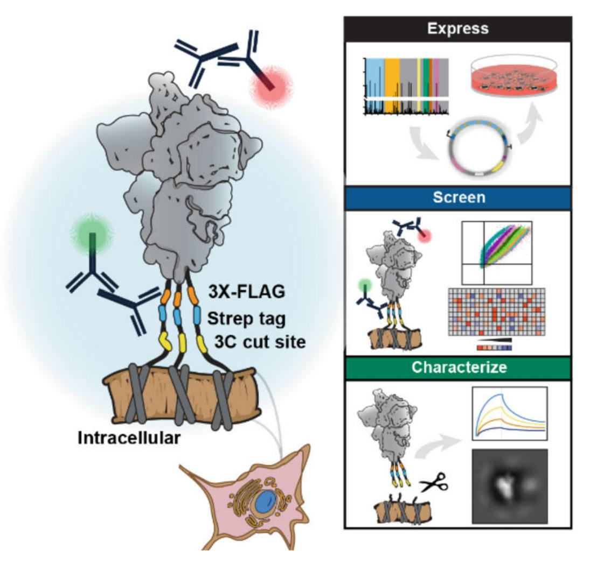
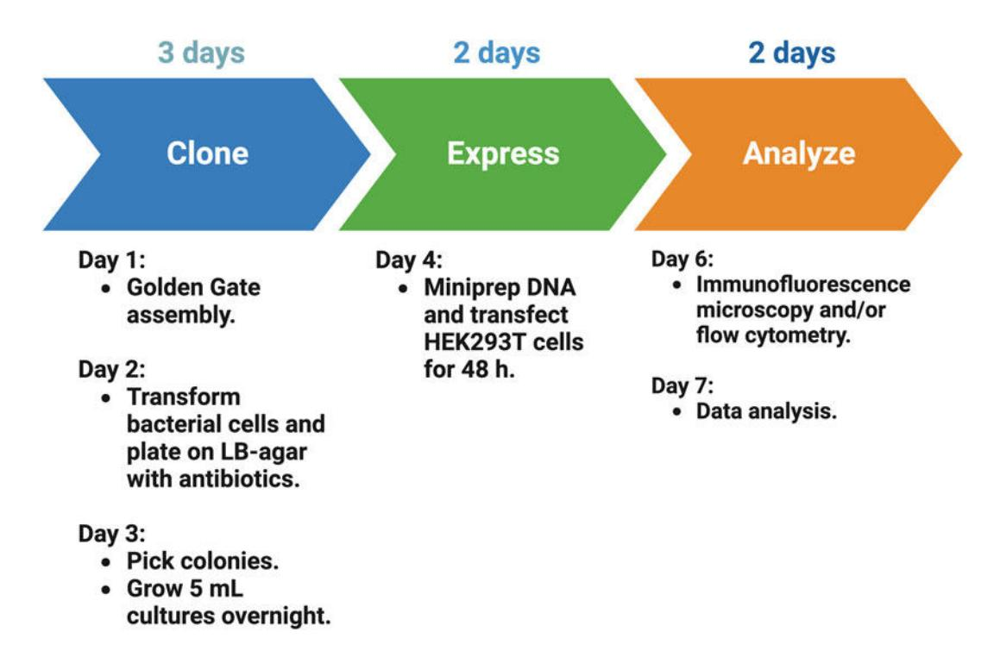
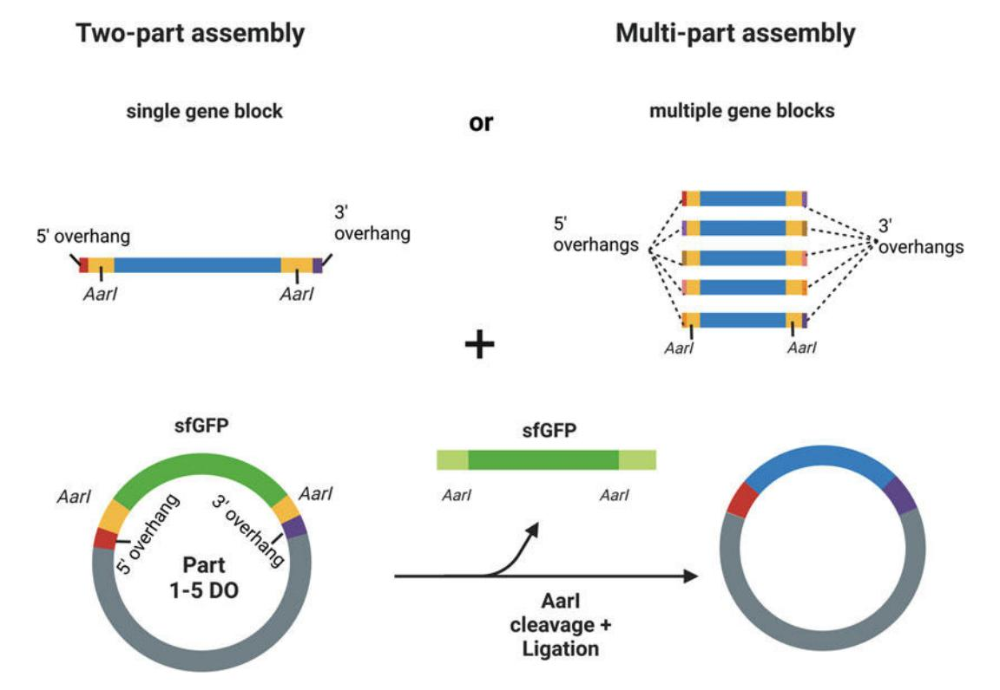
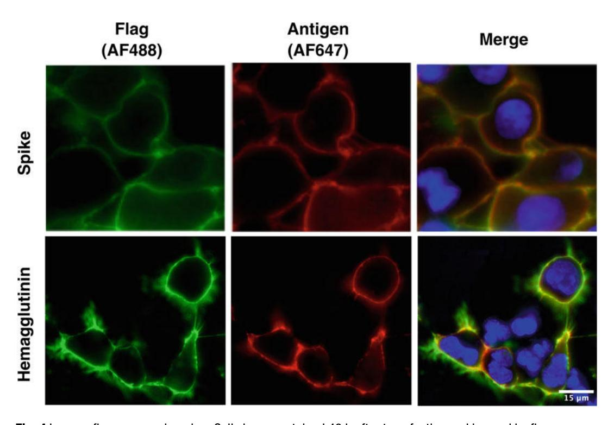
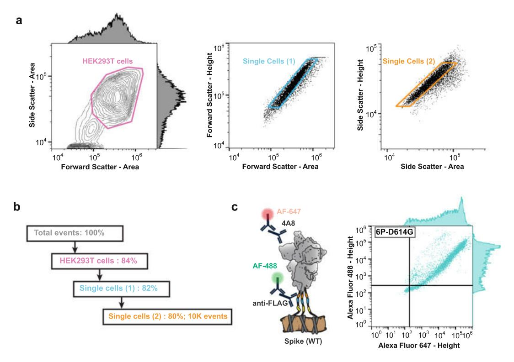
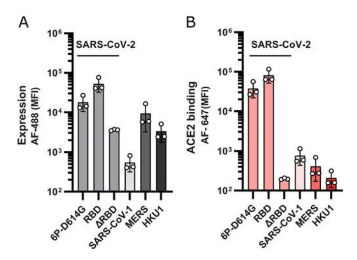
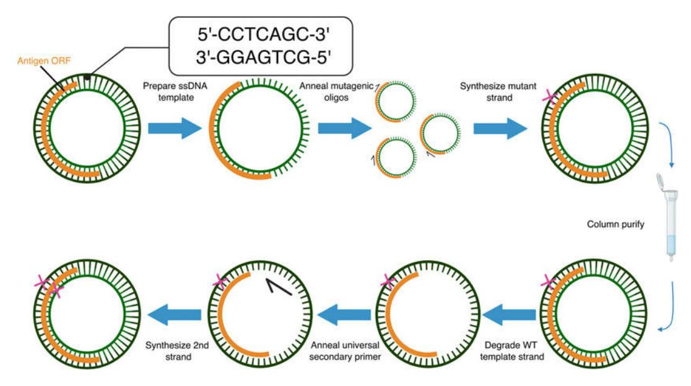
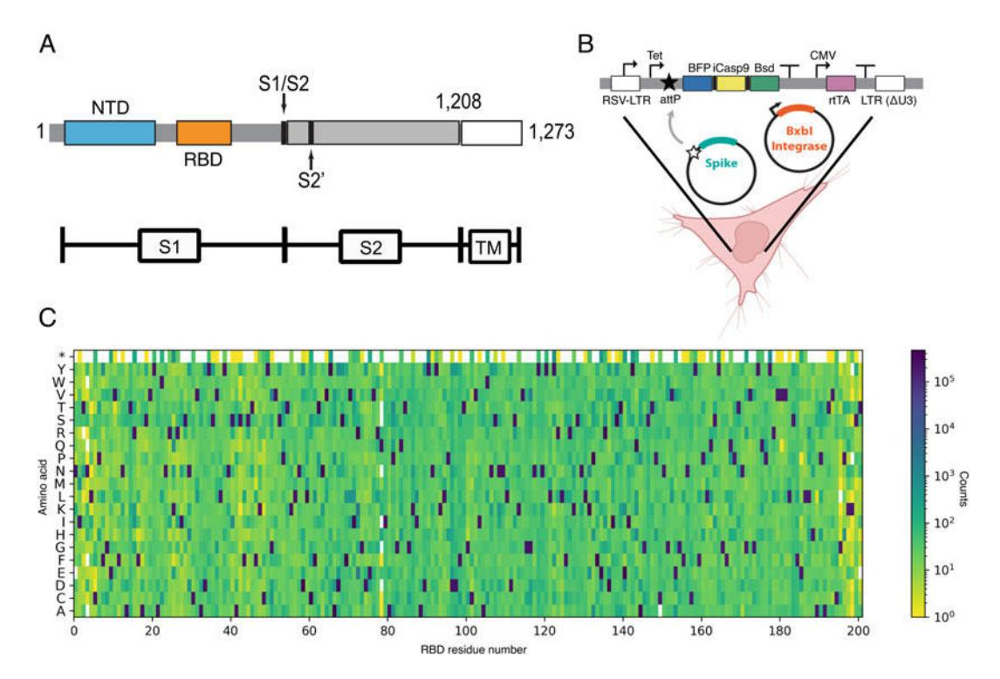

# Mammalian Antigen Display for Pandemic Countermeasures

**Andrea Quezada#, Ankur Annapareddy#, Kamyab Javanmardi, John Cooper, and Ilya J. Finkelstein**

#These authors contributed equally to this work.

*Methods in Molecular Biology, Vol. 2762, pp. 191–216, 2024*

**DOI:** [10.1007/978-1-0716-3666-4_12](https://doi.org/10.1007/978-1-0716-3666-4_12)

---

## Table of Contents

- [Abstract](#abstract)
- [1 Introduction](#1-introduction)
- [2 Materials](#2-materials)
  - [2.1 Media, Strains, Plasmids](#21-media-strains-plasmids)
  - [2.2 Generating Antigen Libraries](#22-generating-antigen-libraries)
  - [2.3 Expression of Surface-Displayed Antigens](#23-expression-of-surface-displayed-antigens)
  - [2.4 Immunofluorescence Microscopy](#24-immunofluorescence-microscopy)
  - [2.5 Cleavage and Purification of Surface-Expressed Antigens](#25-cleavage-and-purification-of-surface-expressed-antigens)
  - [2.6 Flow Cytometry](#26-flow-cytometry)
  - [2.7 Fluorescence-Assisted Cell Sorting](#27-fluorescence-assisted-cell-sorting)
  - [2.8 Data Analysis](#28-data-analysis)
- [3 Methods](#3-methods)
  - [3.1 Generating Antigen Libraries](#31-generating-antigen-libraries)
  - [3.2 Antigen Expression](#32-antigen-expression)
  - [3.3 Immunofluorescence Microscopy](#33-immunofluorescence-microscopy)
  - [3.4 Cleavage and Purification of Surface-Expressed Antigens](#34-cleavage-and-purification-of-surface-expressed-antigens)
  - [3.5 Flow Cytometry](#35-flow-cytometry)
  - [3.6 Flow Cytometry Analysis and FACS](#36-flow-cytometry-analysis-and-facs)
- [4 Notes](#4-notes)
- [References](#references)

---

## Abstract

Pandemic countermeasures require the rapid design of antigens for vaccines, profiling patient antibody responses, assessing antigen structure-function landscapes, and the surveillance of emerging viral lineages. Cell surface display of a viral antigen or its subdomains can facilitate these goals by coupling the phenotypes of protein variants to their DNA sequence. Screening surface-displayed proteins via flow cytometry also eliminates time-consuming protein purification steps. Prior approaches have primarily relied on yeast as a display chassis. However, yeast often cannot express large viral glycoproteins, requiring their truncation into subdomains. Here, we describe a method to design and express antigens on the surface of mammalian HEK293T cells. We discuss three use cases, including screening of stabilizing mutations, deep mutational scanning, and epitope mapping. The mammalian antigen display platform described herein will accelerate ongoing and future pandemic countermeasures.

**Key words:** Surface display, Antigen, Spike, Hemagglutinin, Influenza, Coronavirus, Flow cytometry

---

## 1 Introduction

Pandemics are becoming more frequent due to increased encroachment into zoonotic reservoirs and climate change. By one estimate, the probability of observing extreme pandemics like COVID-19 in one's lifetime—currently 38%—may double in coming decades [[1](#ref1)]. The rapid development of subunit vaccines is the most important pandemic countermeasure, as highlighted by the record-breaking speed of SARS-CoV-2 vaccine deployment [[2](#ref2)]. Subunit vaccines include only the components, or antigens, that best stimulate the immune system to create a durable immunological memory of a specific pathogen. Additional pandemic countermeasures include mapping the humoral immune responses of convalescent and immunized patients and tracking the emergence of new variants. Accelerating these countermeasures using modern molecular biology approaches is imperative for minimizing the global disruption from future viral threats.

Antiviral subunit vaccines focus the immune system on viral entry glycoproteins. Targeting the pre-fusion conformation of these glycoproteins can produce potent neutralizing antibodies that prevent viral entry [[3](#ref3)–[10](#ref10)]. Structure-guided antigen design is the leading approach for developing subunit vaccine antigens [[11](#ref11), [12](#ref12)]. However, structure-guided protein engineering requires the relatively low-throughput expression, purification, and biochemical characterization of antigen candidates. Machine learning and other computational engineering approaches can accelerate antigen development by predicting stabilizing mutations [[13](#ref13)–[16](#ref16)]. However, these candidates must still be validated using the same laborious biochemical approaches. In short, antigen design is bottlenecked by the need to individually express, purify, and test each protein candidate. Accelerating the antigen design-build-test cycle is a central plank of future pandemic countermeasures.

A second key plank in future pandemic preparedness is the ability to map the binding sites of antigen-specific monoclonal antibodies (mAbs). Understanding how mAbs bind and neutralize viruses improves our understanding of conserved epitopes, sheds light on neutralization mechanisms, and anticipates viral escape potential. For example, understanding which conserved and rare epitopes lead to potent and broad-spectrum neutralizations may lead to the design of antigens that are protective against emerging viral lineages, such as the SARS-CoV-2 variants of concern. More broadly, such approaches can lead to the development of vaccines that protect against multiple viral clades or even entire viral families, recently demonstrated for pan-influenza pan-coronavirus vaccine candidates [[17](#ref17)–[21](#ref21)].

Cell surface display is a high-throughput approach for antigen design and antibody epitope mapping. Tethering antigens (or their subdomains) to cells bypasses the need for biochemical purifications and can be used to pool antigen variants in a single experiment. The most common cell surface display approaches leverage the budding yeast *S. cerevisiae* [[22](#ref22)]. *S. cerevisiae* has been used for epitope mapping and deep mutational scanning of influenza hemagglutinins and the SARS-CoV-2 spike receptor binding domain (RBD) [[23](#ref23)–[28](#ref28)]. These experiments provide valuable insight into the mechanisms for viral evolution and immune escape but also face several limitations. First, yeast is unable to produce many full-length antigens (e.g., the SARS-CoV-2 spike ectodomain). The humoral immune response to SARS-CoV-2 produces potent anti-spike neutralizing antibodies that target the N-terminal domain as well as the S2 stalk [[29](#ref29)–[34](#ref34)]. These domains are outside the RBD and cannot be addressed via yeast display. Second, antigens produced in yeast do not recapitulate mammalian glycosylation [[35](#ref35)]. These differences may alter a protein's antigenicity toward cell receptors and antibodies [[36](#ref36)]. To overcome these limitations, we developed a mammalian cell surface display platform that measures antigen expression and antibody binding on the surface of mammalian cells.

Mammalian antigen display is designed for phenotypic screening of full-length viral glycoproteins on the surface of mammalian cells ([Fig. 1](#fig1)). As a proof of principle, we displayed the SARS-CoV-2 spike protein and the influenza hemagglutinin (HA) on the surface of human embryonic kidney (HEK293T) cells [[37](#ref37), [38](#ref38)]. Although we have tested this approach in HEK293Ts, the protocols are general and can be adapted to any cell type in about a week ([Fig. 2](#fig2)). Mammalian cell lines express viral proteins with glycosylation patterns comparable to those found from bona fide viruses [[39](#ref39), [40](#ref40)]. We focus on the SARS-CoV-2 spike ectodomain coding sequence (residues 1–1208) containing six pre-fusion stabilizing prolines and a mutated furin cleavage site to improve spike stability and expression [[41](#ref41), [42](#ref42)]. The promoters, chimeric introns, and terminators are also optimized to further boost protein expression in mammalian cells. Combinations of N-terminal secretion tags and C-terminal linkers ensure high surface display density. Due to the variability of plasmid transfections in mammalian cell cultures, we included a triple FLAG epitope tag as a proxy for expression levels and as an internal control for signal normalization. Transfected cells expressing antigens are immunostained and analyzed by imaging or flow cytometry ([Fig. 4](#fig4)). A 3C protease cleavage site and a Strep II tag are included in the C-terminal linker to enable the cleavage and rapid purification of surface-displayed antigens. Cleaving the antigen from cell surfaces for conventional biochemical and biophysical methods can save time and laborious recombinant purification. These features make mammalian antigen display a valuable tool for the current and future pandemic countermeasures [[43](#ref43), [44](#ref44)].

<figure class="paper-figure" id="fig1">

<figcaption><strong>Figure 1.</strong> Overview of the antigen display platform. The platform consists of a rapid cloning pipeline, flow cytometry, immunofluorescence microscopy, and antigen cleavage for further biophysical characterization. The antigen is tethered to the cell via a short transmembrane domain and a flexible linker. The linker encodes a 3C protease cut site which enables cleavage and purification of displayed antigens (yellow), a StrepTactin purification tag (blue), and a 3×FLAG epitope tag for immunostaining. A Golden Gate (GG) cloning pipeline facilitates high-throughput antigen cloning (right, top). Flow cytometry enables high-throughput screening (right, middle). Downstream biophysical characterizations, such as bio-layer interferometry (BLI) and negative stain electron microscopy (nsEM), can be performed on cleaved antigens (right, bottom).</figcaption>
</figure>

<figure class="paper-figure" id="fig2">

<figcaption><strong>Figure 2.</strong> Antigen display timeline. The full procedure requires 7 days. Gene blocks encoding antigen variants are assembled into the drop-out vector (3 days). The assembled plasmids are transfected into HEK293T cells and expressed for 48 h. Immunofluorescence microscopy and flow cytometry take two additional days.</figcaption>
</figure>

---

## 2 Materials

### 2.1 Media, Strains, Plasmids

1. DH5-alpha competent *E. coli*.
2. Mix & Go competent cells strain Zymo 10B (Zymo Research T3019).
3. Superior Broth.
4. DMEM, high glucose, pyruvate.
5. Fetal Bovine Serum (FBS).
6. Opti-MEM I reduced serum medium, GlutaMAX Supplement.
7. pcDNA5/FRT/TO/intron/GFP [[45](#ref45)] (Addgene #113547).

### 2.2 Generating Antigen Libraries

1. T7 DNA Ligase.
2. 10× CutSmart buffer (NEB B6004).
3. 10 mM ATP.
4. DNA Miniprep Kit.
5. Microcentrifuge.
6. Thermocycler.

#### 2.2.1 Golden Gate Assemblies

1. Gene blocks for antigen mutagenesis.
2. AarI and activating oligo.
3. Drop-out plasmid (AddGene #172726).

#### 2.2.2 Saturation Mutagenesis Library Generation

1. Template plasmid containing gene segment to be mutagenized, and BbvCI restriction enzyme cut site.
2. Mutagenic oligo mixture (IDT).
3. T4 Polynucleotide Kinase and buffer.
4. Universal secondary primer (IDT).
5. Exonuclease III.
6. Exonuclease I.
7. Nt.BbvCI.
8. Nb.BbvCI.
9. 100 mM DTT.
10. 50 mM NAD⁺.
11. 10 mM dNTPs.
12. Phusion HiFi DNA polymerase (NEB M0530).
13. 5× Phusion HiFi buffer (NEB B0518).
14. Taq DNA Ligase.
15. DpnI.
16. Zymo clean and concentrate kit (Zymo D4005).

### 2.3 Expression of Surface-Displayed Antigens

#### 2.3.1 Transient Transfection of HEK293Ts

1. HEK293T cell line (ATCC CRL-3216).
2. Dulbecco Modified Eagle Medium (DMEM).
3. Fetal Bovine Serum (FBS).
4. Penicillin-Streptomycin.
5. Trypsin-EDTA (0.25%), Phenol Red.
6. Opti-MEM Reduced Serum medium.
7. Lipofectamine 3000.
8. Mycoplasma detection kit.
9. Incubator at 37 °C and 5% CO₂.
10. 10 cm polystyrene-coated plates.
11. 6-well polystyrene-coated plates.

### 2.4 Immunofluorescence Microscopy

1. Glass-bottom imaging dishes.
2. BlockAid blocking solution.
3. Mouse anti-FLAG M2 antibody.
4. Antigen-specific antibody.
5. Goat anti-Mouse IgG(H+L), human ads-Alexa Fluor 488.
6. Goat anti-Human IgG Fc-Alexa Fluor 647.
7. PBS-BSA (1% BSA, 1× PBS, 2 mM EDTA pH 7.4).
8. Hoechst stain.
9. Widefield or confocal microscope equipped with visible and violet light sources and fluorescent filter cubes at 375/28, 480/30, 620/50.

### 2.5 Cleavage and Purification of Surface-Expressed Antigens

1. Expi293 cell line (Thermo Fisher A14527).
2. Expi293 Expression System Kit (Thermo Fisher A14635).
3. Incubator at 37 °C and 8% CO₂.
4. StrepTactin Superflow purification column (IBA 2-1206-025).
5. Superose 6 Increase 10/300 GL gel-filtration column (GE29-0915-96).
6. Protein storage buffer (2 mM Tris pH 8.0, 200 mM NaCl, 0.02%).
7. 3C Protease.
8. Wash buffer (100 mM Tris/HCl pH 8.0, 150 mM NaCl, 1 mM EDTA).
9. Elution buffer (100 mM Tris/HCl pH 8.0, 150 mM NaCl, 1 mM EDTA, 2.5 mM desthiobiotin).

### 2.6 Flow Cytometry

1. PBS.
2. Cell counter (e.g., Logos Biosystems L40002).
3. PBS-BSA buffer (1% BSA, 1× PBS, 2 mM EDTA pH 7.4).
4. Deep well grow blocks, 2 mL.
5. Microplate shaker.
6. Swinging bucket rotor.
7. Spectral cell analyzer (e.g., SONY SA3800).
8. Mouse anti-FLAG M2 antibody.
9. Goat anti-Mouse IgG(H+L), Human ads-Alexa Fluor 488.
10. Goat anti-Human IgG Fc-Alexa Fluor 647.

### 2.7 Fluorescence-Assisted Cell Sorting

1. PBS.
2. PBS-BSA buffer (1% BSA, 1× PBS, 2 mM EDTA pH 7.4).
3. Goat anti-Mouse IgG(H+L), Human ads-Alexa Fluor 488.
4. Goat anti-Human IgG Fc-Alexa Fluor 647.
5. Cell counter (e.g., Logos Biosystems L40002).
6. Deep well grow blocks, 2 mL.
7. Microplate shaker.
8. Swinging bucket rotor.
9. Cell sorter (e.g., Sony SH800S).

### 2.8 Data Analysis

1. Image analyzer software (e.g., FIJI [[46](#ref46)]).
2. Flow cytometer analyzer packages (e.g., FlowCytometryTools [[47](#ref47)]).

---

## 3 Methods

### 3.1 Generating Antigen Libraries

Below, we present two methods for generating antigen libraries ([Fig. 3](#fig3)). The first method, termed Golden Gate (GG) assemblies, uses synthetic gene blocks to rapidly assemble antigens with defined mutations. This method is useful for antigen engineering, epitope mapping, and characterizing clinical variants with multiple mutations scattered throughout the protein. The second method generates saturating mutagenesis libraries for deep mutational scanning (DMS) [[48](#ref48)]. DMS is useful for understanding antigen stability, molecular epistasis between mutations, and epitope mapping [[38](#ref38)]. This method requires mutagenic primers and a pooled nickase-based primer extension [[49](#ref49)].

#### 3.1.1 Golden Gate Assemblies

Gene blocks that encode antigen fragments are ordered as double-stranded DNA gene blocks containing flanking AarI cut sites and unique overhangs matching the entry vector. For example, our entry vectors for SARS-CoV-2 spike include AarI cut sites and overhangs matching the spike ectodomain sequence (*see* **Note 1**). Alternatively, the antigen sequence can be divided into sub-regions to reduce the cost of long gene block synthesis. In this case, unique Golden Gate overhangs will be necessary for each segment of the antigen. To ease cloning, this entry vector also includes a superfolder GFP (sfGFP) bacterial expression cassette that is removed when the spike DNA is ligated between the AarI sites. This allows rapid screening for colonies that have lost the sfGFP cassette (see below).

<figure class="paper-figure" id="fig3">

<figcaption><strong>Figure 3.</strong> Golden Gate assembly. An entry vector with a super-folder GFP (sfGFP in green) dropout cassette and AarI cut sites (yellow) is assembled with one or more gene blocks (blue) containing AarI cut sites and matching 5′ and 3′ overhangs. For a two-part assembly, the overhangs must match those of the entry vector. For a multi-part assembly, overhangs matching each part and the dropout cassette must be designed. The entire process can be automated using liquid handling robots for high-throughput experiments.</figcaption>
</figure>

1. Design one or multiple gene blocks with specific overhangs matching the entry vector (*see* **Note 2**).
2. Assemble the GG reaction in PCR tubes with the gene blocks and dropout vector:
   - (a) Golden Gate assembly mix
     - (i) 0.25 μL T7 DNA Ligase.
     - (ii) 0.25 μL AarI.
     - (iii) 0.2 μL AarI oligo [or 1 μL AarI oligo (1:5 dilution)].
     - (iv) 1 μL 10× CutSmart buffer.
     - (v) 1 μL 10 mM ATP.
     - (vi) 10 ng of a single gene block or 10 ng/gblock in case of a multi-part assembly.
     - (vii) 20–30 ng dropout plasmid.
     - (viii) Final volume: 10 μL.
   - (b) Thermocycling (two-part assemblies)
     - (i) 25 cycles: 37 °C for 1 min (digestion) and 16 °C for 2 min (ligation).
     - (ii) 37 °C for 30 min (final digestion).
     - (iii) 80 °C for 20 min (heat inactivation).
     - (iv) 4 °C hold.
   - (c) Thermocycling (multi-part assemblies)
     - (i) 35 cycles: 37 °C for 2 min (digestion) and 16 °C for 4 min (ligation).
     - (ii) 37 °C for 60 min (final digestion).
     - (iii) 80 °C for 20 min (heat inactivation).
     - (iv) 4 °C hold.
3. Transformations:
   - (a) Mix 4 μL of each GG reaction with 10 μL of NEB 5-alpha competent cells aliquoted into 1.5 mL Eppendorf tubes and incubate on ice for 30 min.
   - (b) Heat shock at 42 °C for 30 s and incubate on ice for 5 min.
   - (c) Add 200 μL of Superior Broth and incubate at 37 °C in the shaking incubator for 1 h.
   - (d) Spin down cells at 2000 rcf for 1 min.
   - (e) Remove the media and resuspend in 50 μL of fresh media.
   - (f) Plate on 10 cm LB-agar plates with carbenicillin (100 μg/mL). Let the plates dry and keep them at 37 °C overnight.
   - (g) Use a blue light to select colonies that have lost sfGFP. Colonies still containing the sfGFP drop-out gene will be fluorescent under blue light and should not be picked.
   - (h) Grow picked colonies in 5 mL of LB with carbenicillin (100 μg/mL) at 37 °C overnight with continuous shaking.
   - (i) Collect cells at 3000 rcf for 5 min and extract the plasmid DNA.

#### 3.1.2 Saturation Mutagenesis Libraries

We generate saturating mutagenesis libraries via the protocol described in Wrenbeck et al. [[49](#ref49)] ([Fig. 7](#fig7)). That protocol outlines how to generate libraries with single amino acid substitutions. In our testing, increasing the mutagenic oligo to template ratio and increasing the number of PCR cycles generates libraries with more than one mutation per antigen. In addition to amino acid substitutions, deletions and insertions can be introduced into the template plasmid with similar efficiency by deleting or inserting the desired amino acid in the mutagenic oligos.

Mutagenic oligos are designed to contain the desired mutations and complement the wild-type template strand on either side of the programmed mutation. As part of this protocol, we provide a Python script for developing mutagenic oligo pools (https://github.com/finkelsteinlab/mutagenic-primer-design). Mutagenic oligos can be purchased as synthetic pools (IDT or Twist), or if a more limited library is required, purchased individually and pooled by hand.

1. Phosphorylate oligos:
   - (a) Resuspend mutagenic oligo pool to a final concentration of 0.1 μM.
   - (b) Combine in a PCR tube:
     - (i) 20 μL 0.1 mM mutagenic oligo mixture.
     - (ii) 2.4 μL T4 Polynucleotide Kinase buffer.
     - (iii) 1 μL 10 mM ATP.
     - (iv) 1 μL T4 Polynucleotide Kinase (10 U/μL).
   - (c) Into a separate PCR tube add:
     - (i) 18 μL H₂O.
     - (ii) 3 μL T4 Polynucleotide Kinase buffer.
     - (iii) 7 μL 100 μM secondary primer.
     - (iv) 1 μL 10 mM ATP.
     - (v) 1 μL T4 Polynucleotide Kinase (10 U/μL).
   - (d) Incubate both tubes at 37 °C for 1 h.
   - (e) Store phosphorylated oligos at −20 °C. The day of mutagenesis, dilute phosphorylated mutagenic oligo pool 1:10 and secondary primer 1:20 in H₂O.
2. Single-stranded DNA (ssDNA) template strand preparation:
   - (a) Add the following into PCR tube(s):
     - (i) 0.76 pmol template plasmid.
     - (ii) 2 μL 10× CutSmart buffer.
     - (iii) 1 μL 1:10 diluted Exonuclease III (10 U/μL).
     - (iv) 1 μL Nt.BbvCI (10 U/μL).
     - (v) 1 μL Exonuclease I (20 U/μL).
     - (vi) H₂O to 20 μL.
   - (b) Thermocycling conditions:
     - (i) 37 °C for 1 h.
     - (ii) 80 °C for 20 min.
     - (iii) 4 °C hold.
   - (c) Degraded template plasmid can be kept at 4 °C overnight if needed.
3. Comprehensive codon mutagenesis strand 1 (top strand):
   - (a) Add the following into each tube (100 μL final volume):
     - (i) 36.7 μL H₂O.
     - (ii) 20 μL 5× Phusion HiFi buffer.
     - (iii) 4.3 μL 1:10 diluted phosphorylated mutagenic oligos.
     - (iv) 10 μL 100 mM DTT.
     - (v) 1 μL 50 mM NAD⁺.
     - (vi) 2 μL 10 mM dNTPs.
     - (vii) 1 μL Phusion HiFi polymerase (2 U/μL).
     - (viii) 5 μL Taq DNA Ligase (40 U/μL).
   - (b) Thermocycling conditions (×15 cycles for steps ii–iv; add additional 4.3 μL of oligo mixture at the beginning of cycles 6 and 11):
     - (i) 98 °C for 2 min.
     - (ii) 98 °C for 30 s.
     - (iii) 55 °C for 45 s.
     - (iv) 72 °C for 1 min/kb of template plasmid.
     - (v) 45 °C for 40 min.
     - (vi) 4 °C hold.
4. Purify the DNA with a Zymo Clean and Concentrate kit. Follow the manufacturer's instructions. Elute with 15 μL of H₂O.
5. Degrade template strand:
   - (a) Transfer 14 μL of the purified DNA product to a PCR tube and add (20 μL final volume):
     - (i) 2 μL 10× CutSmart buffer.
     - (ii) 2 μL 1:50 diluted Exonuclease III (2 U/μL).
     - (iii) 1 μL 1:10 diluted Nb.BbvCI (1 U/μL).
     - (iv) 1 μL Exonuclease I (20 U/μL).
   - (b) Thermocycling conditions:
     - (i) 37 °C for 1 h.
     - (ii) 80 °C for 20 min.
     - (iii) 4 °C hold.
6. Synthesize complementary mutagenic strand:
   - (a) To the PCR tube from step 5 add (100 μL final volume):
     - (i) 37.7 μL H₂O.
     - (ii) 20 μL 5× Phusion HiFi buffer.
     - (iii) 3.3 μL 1:20 diluted phosphorylated secondary primer.
     - (iv) 10 μL 100 mM DTT.
     - (v) 1 μL 50 mM NAD⁺.
     - (vi) 2 μL 10 mM dNTPs.
     - (vii) 1 μL Phusion HiFi Polymerase (2 U/μL).
     - (viii) 5 μL Taq DNA Ligase (40 U/μL).
   - (b) Thermocycling conditions:
     - (i) 98 °C for 30 s.
     - (ii) 55 °C for 45 s.
     - (iii) 72 °C for 5 min.
     - (iv) 45 °C for 40 min.
     - (v) 4 °C hold.
7. Column purification using Zymo Clean and Concentrate kit. Elute with 6 μL H₂O.
8. DpnI digest (20 μL final volume):
   - (a) 5 μL cleaned plasmid from the previous step.
   - (b) 2 μL DpnI.
   - (c) 2 μL rCutSmart (10× buffer).
9. Thermocycling conditions:
   - (a) 37 °C for 2 h.
   - (b) 80 °C for 15 min.
   - (c) 4 °C hold.
10. Column purification using Zymo Clean and Concentrate kit.

### 3.2 Antigen Expression

#### 3.2.1 Transient Transfection of HEK293Ts

Handling cell lines requires aseptic conditions and a horizontal laminar flow cabinet. HEK293T cells should be cultured and maintained according to the manufacturer's protocol. Upon arrival, vials are stored at temperatures below −130 °C and only thawed when they are ready to use. The entire protocol can be completed in about a week ([Fig. 2](#fig2)).

1. Culturing cells:
   - (a) Immediately after thawing, transfer cells into a 15 mL tube containing 9 mL Dulbecco's Modified Eagle's Medium supplemented with 10% FBS and 2% Penicillin-Streptomycin (complete medium). Spin down at 125 rcf for 5 min (*see* **Note 3**).
   - (b) Resuspend the pellet in complete medium. The amount of medium depends on the size of the culturing vessel (i.e., 10 cm plates, 25 or 75 cm² culture flasks). Maintain the vessel in an incubator with 5% CO₂ and 37 °C.
   - (c) Passage cells when they reach 80 to 90% confluency. Cells are ready to seed for transfection after two passages showing a consistent growing behavior.
   - (d) Cells grown up to 60–90% confluency into 10 cm plates can be frozen for future usage.
2. Seeding cells for transfection:
   - (a) 24 h before transfection, aspirate the medium from a 10 cm plate containing 80% confluent cells.
   - (b) Slowly pour 6–10 mL of PBS through the plate wall, trying not to disturb the cell monolayer adhered to the bottom.
   - (c) Gently shake the plate and aspirate the PBS.
   - (d) Add 2 mL of Trypsin-EDTA and incubate at 37 °C for 5 min.
   - (e) Add 8 mL of complete medium and transfer cells into a centrifuge tube. Spin down at 125 rcf for 5 min.
   - (f) Resuspend the pellet with 10 mL complete medium and count the cells using an automated cell counter.
   - (g) Seed cells at a density of 0.2 × 10⁶ cells into 6-well plates containing 2 mL per well of complete medium for flow cytometry. For microscopy, seed cells into 2 mL glass-bottom dishes.
   - (h) Incubate at 37 °C and 5% CO₂ for 24 h.
3. Transfection:
   - (a) Prepare a master mix containing 200 μL of OPTI-MEM per tube/sample and 3 μg of Lipofectamine 3000 per μg of DNA.
   - (b) For each sample/plasmid set up a sterile Eppendorf tube with 200 μL of Opti-MEM and add 1 μg of DNA per mL of culture (i.e., 2 μg of DNA for a 2 mL well in a 6-well plate).
   - (c) Add 200 μL of the master mix into each tube and gently mix by turning the tubes upside down or vortex at low speed. Vigorous vortexing is sometimes associated with low transfection efficiency and increased cytotoxicity.
   - (d) Incubate at room temperature for 15–20 min.
   - (e) Add each sample to the appropriate wells (6-well plates or glass-bottom dishes) and return plates to the 37 °C incubator. Wait 48 h before collecting cells.

### 3.3 Immunofluorescence Microscopy

#### 3.3.1 Cell Preparation for Immunostaining

1. 48 h after transfection, aspirate the medium from the imaging dishes and gently wash with PBS without detaching the cell monolayer adhered to the bottom ([Fig. 4](#fig4)).
2. Incubate the plates with 2 mL of freshly prepared 4% paraformaldehyde for 10 min at room temperature (*see* **Note 4**).

<figure class="paper-figure" id="fig4">

<figcaption><strong>Figure 4.</strong> Immunofluorescence imaging. Cells immunostained 48 h after transfection and imaged by fluorescence microscopy. REGN10933 [[50](#ref50)] and CR9114 [[51](#ref51)] were used for SARS-CoV-2 spike and hemagglutinin, respectively.</figcaption>
</figure>

3. To avoid non-specific background signal, the cells must be blocked for 30 min at room temperature with PBS-BSA buffer or with BlockAid blocking solution.
4. Wash cells with PBS before immunostaining.

#### 3.3.2 Multi-color Immunostaining and Imaging

Since the primary antibodies are from different hosts, a simultaneous incubation with the unlabeled antibodies can be done in order to save time. Likewise, a simultaneous incubation with the secondary antibodies will speed up the process.

1. Prepare a dilution of 1 μg/mL anti-FLAG M2 antibody and the same concentration of an anti-antigen antibody suitable for microscopy (i.e., REGN10933 [[50](#ref50)] for SARS-CoV-2 spike or CR9114 [[51](#ref51)] for HA) into PBS-BSA or BlockAid solution.
2. Aspirate the blocking solution from the imaging plates and add the antibody solution. For a 2 mL plate, add between 1 and 2 mL of the solution. Incubate at room temperature for 1 h.
3. Wash cells with PBS-BSA.
4. Dilute secondary antibodies (anti-mouse Alexa Fluor 488 and anti-human Alexa Fluor 647) at 10 μg/mL in PBS-BSA or BlockAid solution. Incubate in the dark at room temperature for 1 h.
5. Wash cells with PBS-BSA and add 1:10,000 of Hoechst stain diluted in PBS-BSA. Incubate at room temperature for 15 min.
6. Wash cells with PBS-BSA once and add 1 mL of PBS-BSA or BlockAid solution before imaging.
7. Acquire images using fluorescent filter cubes at 375/28 (Hoechst), 480/30 (Alexa Fluor 488), and 620/50 (Alexa Fluor 647).

### 3.4 Cleavage and Purification of Surface-Expressed Antigens

1. Transfect plasmids encoding antigens in HEK293Ts cells using Lipofectamine as suggested by the manufacturer's protocol and previously described [[41](#ref41)].
2. Wash cells once 48 h after transfection with PBS. Resuspend to a density of 3–4 × 10⁶ cells/mL in 3C cleavage buffer (150 mM NaCl, 50 mM Tris-HCl pH 8.0). Use five units of 3C protease/mL of resuspended cells.
3. Incubate mixture on a shaker at room temperature and 900 rpm for 1 h to cleave antigens from the cell surface.
4. Collect the antigen-containing supernatant by spinning tubes at 16,000 rcf for 1 min and transfer supernatant to a fresh tube. Supernatant can be kept on ice until analysis.
5. For electron microscopy imaging, further purify supernatant with 0.5 mL StrepTactin (IBA) column.
6. Wash column with base buffer (100 mM Tris/HCl pH 8.0, 150 mM NaCl, 1 mM EDTA).
7. Elute with 1 mL of elution buffer (100 mM Tris/HCl pH 8.0, 150 mM NaCl, 1 mM EDTA, 2.5 mM desthiobiotin).
8. Spikes can be further purified by size-exclusion chromatography using a Superose 6 Increase 10/300 column as previously described [[42](#ref42)].

### 3.5 Flow Cytometry

#### 3.5.1 Collect Cells

1. To collect cells 48 h after transfection, aspirate the medium from the 6-well plates and wash with 1 mL PBS without detaching the cell monolayer.
2. Resuspend the cells with 1 mL of PBS by gently pipetting until the cells are monodispersed. Transfer into 1.5 mL Eppendorf tubes.
3. Determine the cell density with an automated cell counter.
4. Spin down the cells for 1 min at 200 rcf. Aspirate the supernatant and add 1 mL of chilled PBS-BSA to a density of 3.5 × 10⁶ cells/mL. Keep tubes on ice.

#### 3.5.2 Immunostaining

1. Prepare grow blocks with 450 μL of PBS-BSA and a predetermined concentration of the primary antibody per well. We recommend simultaneously incubating with anti-FLAG and anti-antigen antibodies to reduce incubation times and washing steps.
2. Add 50 μL of the resuspended cells (~1.5 × 10⁵ cells) to each well.
3. Incubate at room temperature on a microplate shaker at 950 rpm for 1 h.
4. Spin down the blocks at 400 rcf for 5 min in a swinging bucket rotor.
5. Carefully decant the supernatant and wash cells by adding 450 μL of PBS-BSA to each well. Spin down again at 400 rcf for 5 min and repeat the washing step.
6. Incubate with 450 μL of the secondary antibody solution (5 μg/mL for Alexa Fluor 488 and 10 μg/mL of Alexa Fluor 647).
7. Incubate the plate at 950 rpm in a microplate shaker in a dark cold room at 4 °C for 25 min.
8. Spin down and wash with PBS-BSA twice.
9. Resuspend the cells with 300 μL of PBS-BSA and take them to the cell analyzer.

### 3.6 Flow Cytometry Analysis and FACS

1. HEK293T cells are used to establish forward scatter-area (FSC-A) and side scatter-area (SSC-A) gating. Singlet discrimination is established with forward scatter-height (FSC-H) vs forward scatter-area (FSC-A) and side scatter-height (SSC-H) vs side scatter-area (SSC-A) gates. Singlets reaching a minimum of 10 K counts are set as a stop condition ([Fig. 5](#fig5)).

<figure class="paper-figure" id="fig5">

<figcaption><strong>Figure 5.</strong> Flow cytometry. (a) HEK293T cells are selected by gating the side scatter area vs. forward scatter area (left). Doublets are excluded with additional gating on the forward scatter height vs. forward scatter area (middle) and side scatter height vs. side scatter area (right). We recommend 10 K counts after gating. (b) Alexa Fluor 488 (AF-488) and Alexa Fluor 647 (AF-647) are used to measure antigen expression and antigenicity, respectively. (c) Schematic of a two color flow cytometry experiment (left). The anti-FLAG and anti-spike 4A8 antibodies are fluorescently labeled with secondary antibodies. Right: a typical flow cytometry dataset from this experiment. The spike gene includes six stabilizing prolines, along with the globally prevalent D614G mutation to increase expression and stability.</figcaption>
</figure>

2. The singlet HEK293T cells are further analyzed in two fluorescent channels, Alexa Fluor 488 (AF488) and Alexa Fluor 647 (AF647), using manufacturer-recommended excitation and detection settings. The AF488 channel is used to measure antigen expression and AF647 is used to measure its antigenicity ([Fig. 5](#fig5)).
3. Spectral unmixing should be applied to all data to reduce the effect of spectral spillover and autofluorescence on downstream calculations.

#### 3.6.1 Flow Cytometry Analysis

Transient transfection efficiency varies among experiments. We normalize the data across multiple experiments to minimize day-to-day variation in transfection efficiency and cell quality. Our approach is to calculate the relative expression of all antigen variants against the wild-type antigen ([Fig. 6](#fig6)). For example, the normalized expression of a spike variant is calculated by taking the median height of the AF-488 channel, *M*ₓ⁴⁸⁸, and dividing it by the same value obtained for wild type (wt) spike, *M*_wt⁴⁸⁸:

Normalized expression = log₂(*M*ₓ⁴⁸⁸ / *M*_wt⁴⁸⁸)

Some antigen variants will also have altered expression compared to the parental wild-type sequence. For example, pre-fusion stabilizing mutations will increase expression and stability, whereas destabilizing mutations may cause loss of expression. We apply a second round of normalization to correct for this by using the anti-FLAG signal to correct for changes in transfection efficiency and antigen expression when measuring antibody binding:

Normalized binding = log₂((*M*ₓ⁶⁴⁷/*M*ₓ⁴⁸⁸) / (*M*_wt⁶⁴⁷/*M*_wt⁴⁸⁸))

In this case, the median signal measured by AF-647, *M*ₓ⁶⁴⁷, is divided by the respective AF-488 signal for each sample and all samples are divided by this value obtained for the wild-type antigen.

<figure class="paper-figure" id="fig6">

<figcaption><strong>Figure 6.</strong> Characterization of surface displayed coronavirus spikes. (a) Surface-expressed spikes are stained with anti-FLAG antibodies and fluorescent secondary antibodies. This signal is a proxy for protein expression levels. ΔRBD denotes a construct that lacks the entire RBD (residues 319–541 [[63](#ref63)]) and serves as a negative control for ACE2 binding. (b) The same constructs are incubated with ACE2 and a fluorescent anti-ACE2 secondary antibody. Flow cytometry is used to measure ACE2 binding. As expected, spike-ΔRBD and the spike from HKU1 show the weakest signal. This serves as a measure of background fluorescence in these assays. All measurements are an average of three biological replicates. Error bars: S.D. of three replicates. (Data adapted from [[37](#ref37)])</figcaption>
</figure>

#### 3.6.2 Fluorescence-Assisted Cell Sorting (FACS)

Pooled antigen libraries can be analyzed via FACS, followed by next-generation sequencing (NGS). Transient transfection is not suitable for these experiments because individual cells can receive multiple plasmids, confounding the genotype-to-phenotype linkage. Instead, we recommend integrating antigen libraries into the genome, either via lentiviral integration, CRISPR knock-in, or via a serine integrase [[52](#ref52)–[55](#ref55)]. Lentiviral integration is a mature technology but suffers from slow viral amplification and selection. In addition, random integration into highly transcribed regions can lead to variable antigen expression levels. We prefer integration into an engineered landing pad in the AAVS1 locus ([Fig. 8](#fig8)) [[56](#ref56)]. This system uses BxbI integrase for efficient genomic insertion, followed by selection. Our lab routinely uses the engineered HEK-LLP cell lines described in Matreyek et al. to ensure single-copy integration and to reduce background noise. In order to integrate, antigen plasmids will need to contain the attL and attR attachment sites. The HEK-LLP cell line encodes iCasp9 for negative selection [[57](#ref57), [58](#ref58)]. iCasp9 is a fusion between Caspase 9 and the inducible dimerization domain FKBP1A. Cells that fail to integrate the donor plasmid will still contain iCasp9 in their active site, and will express the protein when induced. The small molecule AP1903 will trigger dimerization of expressed iCasp9 and will cause cell death through apoptosis [[58](#ref58)]. We've observed integration efficiencies of 90% following negative selection. Integration, selection, and expansion of the HEK-LLP cells generally take 2 weeks.

<figure class="paper-figure" id="fig7">

<figcaption><strong>Figure 7.</strong> Saturation mutagenesis library generation. Mutagenesis libraries are prepared via a one-pot protocol. The desired mutations are introduced through a pair of polymerase chain reactions using a mutagenic oligo pool. The parental plasmid encodes a seven basepair BbvCI restriction site that is sequentially nicked by Nt and Nb.BbvCI. First, the top strand is nicked by Nt.BbvCI and degraded. This strand is regenerated via primary PCR with the mutagenic oligo pool to introduce mutations into the top strand. Following a column purification, the bottom strand is nicked by Nb.BbvCI and degraded. Secondary PCR with a universal primer regenerates the bottom strand and fixes all mutation(s) that are now incorporated into the top strand. (This protocol is adapted from [[49](#ref49)])</figcaption>
</figure>

<figure class="paper-figure" id="fig8">

<figcaption><strong>Figure 8.</strong> Recombinase mediated integration and SARS-CoV-2 RBD mutagenesis. (a) SARS-CoV-2 spike domain map. SARS-CoV-2 spike protein is comprised of two domains S1 (residues 14–685) and S2 (residues 686–1273). S1 mediates receptor binding and contains the N-terminal domain (NTD) and the receptor binding domain (RBD) while S2 contains the fusion peptides required for membrane fusion. We only display the ectodomain, which lacks the transmembrane (TM) region (residues 1209–1273). (b) Schematic of BxbI recombinase-mediated integration of antigen construct to the AAVS1 locus of HEK293T-LLP cells. (Adapted from [[56](#ref56)]). The integration cassette at the AAVS1 locus contains a Tet inducible promoter, a blasticidin resistance (Bsd) gene, a blue fluorescent protein (BFP) for positive selection, and iCasp9 for negative selection. rtTA is the reverse Tet transactivator. LTR is a lentiviral long terminal repeat [[56](#ref56)]. The AAVS1 locus contains a BxbI attP recombination sequence. Similarly, the donor plasmid contains the corresponding attL and attR recombination sites that direct the BxbI-mediated integration. (c) Heatmap of a saturating single amino-acid library created with nicking mutagenesis for 200 residues of the SARS-CoV-2 RBD. The wild-type sequence is dark blue.</figcaption>
</figure>

#### 3.6.3 Collect Cells

1. Collect integrated cells expressing antigen libraries 72 h after selection, when they have become confluent. To collect cells, aspirate the media from the flask and resuspend in an equal volume of PBS.
2. Transfer resuspended cells to a 50 mL conical tube and spin down for 4 min at 400 rcf.
3. Aspirate PBS and resuspend cells again in fresh PBS. Pipette gently to monodisperse the cells.
4. Passage the cells at a 1:10 ratio of resuspended cells to fresh media into a new flask to maintain antigen libraries.
5. Spin down the remaining cells for 4 min at 400 rcf.
6. Aspirate the supernatant but leave a thin layer of PBS above the cells so they don't dry out. Keep cells on ice.

#### 3.6.4 Immunostaining

1. Make primary staining master mix with PBS-BSA and 1 μg/mL primary antibody. We recommend simultaneously incubating with anti-FLAG and anti-antigen antibodies to save time. This can only be done if you've previously determined that your primary antibodies do not cross-react with each other.
2. Resuspend antigen libraries with primary staining master mix to a concentration of 8.0 × 10⁶ cells/mL.
3. Incubate resuspended cells at room temperature on a microplate shaker at 950 rpm for 1 h. If needed, primary staining can be performed overnight at 4 °C.
4. While cells are staining chill a centrifuge with a swinging bucket rotor to 4 °C.
5. After primary staining is complete spin cells down in the pre-chilled centrifuge at 400 rcf for 5 min in a swinging bucket rotor.
6. Aspirate the supernatant.
7. Resuspend cells with 5 mL PBS-BSA and spin again at 400 rcf for 5 min.
8. Repeat the previous two steps and aspirate the supernatant.
9. Make secondary staining master mix with PBS-BSA and secondary antibodies (5 μg/mL of AF-488 and 10 μg/mL of AF-647 antibodies).
10. Resuspend cells with secondary staining master mix to a concentration of 1.6 × 10⁷ cells/mL.
11. Incubate cells at 4 °C on a microplate shaker at 950 rpm for 20 min.
12. Spin cells down. Aspirate supernatant. Wash with 3 mL PBS-BSA.

#### 3.6.5 Cell Sorting

1. Define the fluorescent channels and set gates to isolate single cells as described in [Section 3.6](#36-flow-cytometry-analysis-and-facs).
2. The cell binning strategy is dependent on the type of experiment and the expected dynamic range, which must be calibrated ahead of time (see below). For example, when assessing antibody binding to a library of antigens, we use a four-bin sort. Each of the bins is defined as follows. Bin 1: cells with background fluorescence; bin 2: low affinity binding; bin 3: wild type-like binding; bin 4: antigens that bind the antibody with higher affinity than wt antigen. Bins are set using antigen mutants with lower and higher affinity than wild-type to the antibody. To calibrate these values, cells expressing these mutants should be expressed and stained in parallel with antigen libraries, following the same protocol. To anticipate low-affinity antigens, we routinely perform a limited alanine scan of the expected epitope prior to performing bigger sorts.
3. Spin down sorted cells at max speed for 4 min. Aspirate supernatant.
4. Use Promega Wizard Genomic DNA purification kit to isolate genomic DNA (gDNA).
5. PCR amplifies the necessary region of gDNA for NGS. PCR amplifications should be limited to 17–20 cycles to minimize bias.

#### 3.6.6 Data Analysis

Raw paired-end FASTQ files from NGS are processed and merged using fastp [[59](#ref59)]. Illumina adapters are removed from all reads, then forward and reverse reads are paired and merged when they overlap by ≥30 bases and both reads contain fewer than 40% of bases with phred score less than 15. Extract barcodes (UMIs) by specifying their length at both the 5′ and 3′ ends of the merged reads.

Align nucleotide sequences of merged reads to the wild-type sequence using bowtie2 [[60](#ref60)] and output to SAM files using samtools [[61](#ref61)]. To identify amino acid mutations from wild-type sequence, translate the query sequence from the longest contiguous alignment to amino acids and compare to wild-type sequence. To measure changes in antigen expression or anti-antigen mAb binding first calculate each variant's mean fluorescent intensity based on its distribution across the bins, then normalize against the wild-type distribution [[62](#ref62)].

---

## 4 Notes

1. The entry vector (Addgene #172726) was designed for SARS-CoV-2 spike display. When adapting this workflow for different antigens, modify the overhangs to match the sequence of your antigen.
2. We recommend optimizing codon usage for expression in human cells. Take care to remove all AarI cut sites in all DNA blocks. Some antigens may include a native transmembrane domain. As the entry vector also contains a transmembrane (TM) domain and a linker with an anti-FLAG epitope, we recommend that the antigen's native TM domain is entirely removed. Removing the native TM domain will avoid artifacts due to unanticipated tethering of the antigen, leading to occluded anti-FLAG epitopes.
3. Cells should be tested for Mycoplasma contamination before use and regularly thereafter. Immortalized cell lines (such as HEK293T) are more prone to be genetically unstable. Therefore, discard the plates and flasks after 4–6 weeks of passaging. Performing experiments with cells that have been passaged more than 20 times is not recommended due to the genotypic and phenotypic drift that might arise from the selective pressure of culture conditions.
4. Fixation with PFA or methanol will partially permeabilize the cell membrane, resulting in antibodies entering the cell and staining intracellular antigens. Skip the fixation step to stain only the antigens displayed on the cell surface. Extra care must be taken while manipulating the cells, especially during the washing steps. These cells are prone to dissociating from the surface and may be decanted along with the aspirated liquids.

**Author Contributions:** A.A., A.Q., K.J., and I.J.F. conceived the project. A.Q., A.A., and K.J. performed all experiments, analyzed the data, and prepared figures. J.C. wrote the bioinformatics processing pipeline and analyzed some data. I.J.F. secured funding and supervised the project. A.A., A.Q., and I.J.F. wrote the manuscript with input from all co-authors.

**Inclusion and Diversity Statement:** The Finkelstein lab is committed to elevating people of underrepresented geographical locations, ethnicities, genders, abilities, and other forms of diversity in science. A.Q. self-identifies as part of underrepresented gender and ethnic groups in STEM.

**Funding:** This work was supported by the Welch Foundation grant F-1808 to I.J.F., the Bill & Melinda Gates Foundation (INV-034714 to I.J.F.), and NIST (70NANB22H017 to I.J.F.).

---

## References

1. Marani M, Katul GG, Pan WK, Parolari AJ (2021) Intensity and frequency of extreme novel epidemics. Proc Natl Acad Sci 118(35):e2105482118. https://doi.org/10.1073/pnas.2105482118

2. Bok K, Sitar S, Graham BS, Mascola JR (2021) Accelerated COVID-19 vaccine development: milestones, lessons, and prospects. Immunity 54(8):1636–1651

3. Weldon WC, Wang B-Z, Martin MP, Koutsonanos DG, Skountzou I, Compans RW (2010) Enhanced immunogenicity of stabilized trimeric soluble influenza hemagglutinin. PLoS One 5(9):e12466. https://doi.org/10.1371/journal.pone.0012466

4. Sanders RW et al (2013) A next-generation cleaved, soluble HIV-1 env trimer, BG505 SOSIP.664 gp140, expresses multiple epitopes for broadly neutralizing but not non-neutralizing antibodies. PLoS Pathog 9(9):e1003618. https://doi.org/10.1371/journal.ppat.1003618

5. Lu Y, Welsh JP, Swartz JR (2013) Production and stabilization of the trimeric influenza hemagglutinin stem domain for potentially broadly protective influenza vaccines. Proc Natl Acad Sci 111(1):125–130. https://doi.org/10.1073/pnas.1308701110

6. Krarup A et al (2015) A highly stable prefusion RSV F vaccine derived from structural analysis of the fusion mechanism. Nat Commun 6(1). https://doi.org/10.1038/ncomms9143

7. Pallesen J et al (2017) Immunogenicity and structures of a rationally designed prefusion MERS-CoV spike antigen. Proc Natl Acad Sci 114(35). https://doi.org/10.1073/pnas.1707304114

8. Battles MB et al (2017) Structure and immunogenicity of pre-fusion-stabilized human metapneumovirus F glycoprotein. Nat Commun 8(1). https://doi.org/10.1038/s41467-017-01708-9

9. Crank MC et al (2019) A proof of concept for structure-based vaccine design targeting RSV in humans. Science 365(6452):505–509. https://doi.org/10.1126/science.aav9033

10. Hsieh C-L et al (2022) Structure-based design of prefusion-stabilized human metapneumovirus fusion proteins. Nat Commun 13(1). https://doi.org/10.1038/s41467-022-28931-3

11. Byrne PO, McLellan JS (2022) Principles and practical applications of structure-based vaccine design. Curr Opin Immunol 77:102209

12. Sanders RW, Moore JP (2021) Virus vaccines: proteins prefer prolines. Cell Host Microbe 29(3):327–333

13. Peleg Y et al (2021) Community-wide experimental evaluation of the PROSS stability-design method. J Mol Biol 433(13):166964. https://doi.org/10.1016/j.jmb.2021.166964

14. Campeotto I et al (2017) One-step design of a stable variant of the malaria invasion protein RH5 for use as a vaccine immunogen. Proc Natl Acad Sci 114(5):998–1002. https://doi.org/10.1073/pnas.1616903114

15. Goldenzweig A et al (2016) Automated structure- and sequence-based design of proteins for high bacterial expression and stability. Mol Cell 63(2):337–346. https://doi.org/10.1016/j.molcel.2016.06.012

16. Shroff R et al (2020) Discovery of novel gain-of-function mutations guided by structure-based deep learning. ACS Synth Biol 9(11):2927–2935. https://doi.org/10.1021/acssynbio.0c00345

17. Impagliazzo A et al (2015) A stable trimeric influenza hemagglutinin stem as a broadly protective immunogen. Science 349(6254):1301–1306. https://doi.org/10.1126/science.aac7263

18. Nachbagauer R et al (2020) A chimeric hemagglutinin-based universal influenza virus vaccine approach induces broad and long-lasting immunity in a randomized, placebo-controlled phase I trial. Nat Med 27(1):106–114. https://doi.org/10.1038/s41591-020-1118-7

19. Liao H-Y et al (2020) Chimeric hemagglutinin vaccine elicits broadly protective CD4 and CD8 T cell responses against multiple influenza strains and subtypes. Proc Natl Acad Sci 117(30):17757–17763. https://doi.org/10.1073/pnas.2004783117

20. Martinez DR et al (2021) Chimeric spike mRNA vaccines protect against sarbecovirus challenge in mice. Science 373(6558):991–998. https://doi.org/10.1126/science.abi4506

21. Cohen AA et al (2022) Mosaic RBD nanoparticles protect against challenge by diverse sarbecoviruses in animal models. Science 377(6606). https://doi.org/10.1126/science.abq0839

22. Boder ET, Wittrup KD (1997) Yeast surface display for screening combinatorial polypeptide libraries. Nat Biotechnol 15(6):553–557. https://doi.org/10.1038/nbt0697-553

23. Han T et al (2011) Fine epitope mapping of monoclonal antibodies against hemagglutinin of a highly pathogenic H5N1 influenza virus using yeast surface display. Biochem Biophys Res Commun 409(2):253–259. https://doi.org/10.1016/j.bbrc.2011.04.139

24. Gaiotto T, Hufton SE (2016) Cross-neutralising nanobodies bind to a conserved pocket in the hemagglutinin stem region identified using yeast display and deep mutational scanning. PLoS One 11(10):e0164296. https://doi.org/10.1371/journal.pone.0164296

25. Gaiotto T et al (2021) Nanobodies mapped to cross-reactive and divergent epitopes on a (H7N9) influenza hemagglutinin using yeast display. Sci Rep 11(1). https://doi.org/10.1038/s41598-021-82356-4

26. Greaney AJ et al (2021) Mapping mutations to the SARS-CoV-2 RBD that escape binding by different classes of antibodies. Nat Commun 12(1):4196. https://doi.org/10.1038/s41467-021-24435-8

27. Starr TN et al (2021) Prospective mapping of viral mutations that escape antibodies used to treat COVID-19. Science 371(6531):850–854. https://doi.org/10.1126/science.abf9302

28. Francino-Urdaniz IM et al (2021) One-shot identification of SARS-CoV-2 S RBD escape mutants using yeast screening. Cell Rep 36(9). https://doi.org/10.1016/j.celrep.2021.109627

29. Brouwer PJM et al (2020) Potent neutralizing antibodies from COVID-19 patients define multiple targets of vulnerability. Science 369(6504):643–650. https://doi.org/10.1126/science.abc5902

30. Liu L et al (2020) Potent neutralizing antibodies against multiple epitopes on SARS-CoV-2 spike. Nature 584(7821):450–456. https://doi.org/10.1038/s41586-020-2571-7

31. Rogers TF et al (2020) Isolation of potent SARS-CoV-2 neutralizing antibodies and protection from disease in a small animal model. Science 369(6506):956–963. https://doi.org/10.1126/science.abc7520

32. Wang C et al (2021) A conserved immunogenic and vulnerable site on the coronavirus spike protein delineated by cross-reactive monoclonal antibodies. Nat Commun 12(1). https://doi.org/10.1038/s41467-021-21968-w

33. Voss WN et al (2021) Prevalent, protective, and convergent IgG recognition of SARS-CoV-2 non-RBD spike epitopes. Science 372(6546):1108–1112. https://doi.org/10.1126/science.abg5268

34. Silva RP et al (2023) Identification of a conserved S2 epitope present on spike proteins from all highly pathogenic coronaviruses. eLife 12. https://doi.org/10.7554/elife.83710

35. Hamilton SR et al (2003) Production of complex human glycoproteins in yeast. Science 301(5637):1244–1246. https://doi.org/10.1126/science.1088166

36. Grant OC, Montgomery D, Ito K, Woods RJ (2020) Analysis of the SARS-CoV-2 spike protein glycan shield reveals implications for immune recognition. Sci Rep 10(1):14991. https://doi.org/10.1038/s41598-020-71748-7

37. Javanmardi K et al (2021) Rapid characterization of spike variants via mammalian cell surface display. Mol Cell 81(24):5099–5111.e8. https://doi.org/10.1016/j.molcel.2021.11.024

38. Javanmardi K et al (2022) Antibody escape and cryptic cross-domain stabilization in the SARS-CoV-2 Omicron spike protein. Cell Host Microbe 30(9):1242–1254.e6. https://doi.org/10.1016/j.chom.2022.07.016

39. Allen JD et al (2021) Site-specific steric control of SARS-CoV-2 spike glycosylation. Biochemistry 60(27):2153–2169. https://doi.org/10.1021/acs.biochem.1c00279

40. Yao H et al (2020) Molecular architecture of the SARS-CoV-2 virus. Cell 183(3):730–738.e13. https://doi.org/10.1016/j.cell.2020.09.018

41. Hsieh C-L et al (2020) Structure-based design of prefusion-stabilized SARS-CoV-2 spikes. Science 369(6510):1501–1505. https://doi.org/10.1126/science.abd0826

42. Schaub JM et al (2021) Expression and characterization of SARS-CoV-2 spike proteins. Nat Protoc 16(11):5339–5356. https://doi.org/10.1038/s41596-021-00623-0

43. Tan TJ et al (2023) High-throughput identification of prefusion-stabilizing mutations in SARS-CoV-2 spike. Nat Commun 14(1):2003

44. Ouyang WO et al (2022) Probing the biophysical constraints of SARS-CoV-2 spike N-terminal domain using deep mutational scanning. Sci Adv 8(47):eadd7221

45. Shelton SB, Shah NM, Abell NS, Devanathan SK, Mercado M, Xhemalçe B (2018) Crosstalk between the RNA methylation and histone-binding activities of MePCE regulates P-TEFb activation on chromatin. Cell Rep 22(6):1374–1383. https://doi.org/10.1016/j.celrep.2018.01.028

46. Schindelin J et al (2012) Fiji: an open-source platform for biological-image analysis. Nat Methods 9(7):676–682. https://doi.org/10.1038/nmeth.2019

47. Yurtsev E, Friedman J, Gore J (2015) FlowCytometryTools: version 0.4.5. Zenodo. https://doi.org/10.5281/ZENODO.32991

48. Fowler DM, Fields S (2014) Deep mutational scanning: a new style of protein science. Nat Methods 11(8):801–807. https://doi.org/10.1038/nmeth.3027

49. Wrenbeck EE, Klesmith JR, Stapleton JA, Adeniran A, Tyo KEJ, Whitehead TA (2016) Plasmid-based one-pot saturation mutagenesis. Nat Methods 13(11):928–930. https://doi.org/10.1038/nmeth.4029

50. Hansen J et al (2020) Studies in humanized mice and convalescent humans yield a SARS-CoV-2 antibody cocktail. Science 369(6506):1010–1014. https://doi.org/10.1126/science.abd0827

51. Dreyfus C et al (2012) Highly conserved protective epitopes on influenza B viruses. Science 337(6100):1343–1348. https://doi.org/10.1126/science.1222908

52. Elegheert J et al (2018) Lentiviral transduction of mammalian cells for fast, scalable and highly-level production of soluble and membrane proteins. Nat Protoc 13(12):2991–3017. https://doi.org/10.1038/s41596-018-0075-9

53. Yarnall MTN et al (2022) Drag-and-drop genome insertion of large sequences without double-strand DNA cleavage using CRISPR-directed integrases. Nat Biotechnol 41(4):500–512. https://doi.org/10.1038/s41587-022-01527-4

54. Anzalone AV et al (2021) Programmable deletion, replacement, integration and inversion of large DNA sequences with twin prime editing. Nat Biotechnol 40(5):731–740. https://doi.org/10.1038/s41587-021-01133-w

55. Durrant MG et al (2022) Systematic discovery of recombinases for efficient integration of large DNA sequences into the human genome. Nat Biotechnol 41(4):488–499. https://doi.org/10.1038/s41587-022-01494-w

56. Matreyek KA, Stephany JJ, Chiasson MA, Hasle N, Fowler DM (2019) An improved platform for functional assessment of large protein libraries in mammalian cells. Nucleic Acids Res. https://doi.org/10.1093/nar/gkz910

57. Gargett T, Brown MP (2014) The inducible caspase-9 suicide gene system as a "safety switch" to limit on-target, off-tumor toxicities of chimeric antigen receptor T cells. Front Pharmacol 5. https://doi.org/10.3389/fphar.2014.00235

58. Ramos CA et al (2010) An inducible caspase 9 suicide gene to improve the safety of mesenchymal stromal cell therapies. Stem Cells 28(6):1107–1115. https://doi.org/10.1002/stem.433

59. Chen S, Zhou Y, Chen Y, Gu J (2018) Fastp: an ultra-fast all-in-one FASTQ preprocessor. Bioinformatics 34(17):i884–i890. https://doi.org/10.1093/bioinformatics/bty560

60. Langmead B, Salzberg SL (2012) Fast gapped-read alignment with Bowtie 2. Nat Methods 9(4):357–359. https://doi.org/10.1038/nmeth.1923

61. Danecek P et al (2021) Twelve years of SAMtools and BCFtools. GigaScience 10(2). https://doi.org/10.1093/gigascience/giab008

62. Starr TN et al (2020) Deep mutational scanning of SARS-CoV-2 receptor binding domain reveals constraints on folding and ACE2 binding. Cell 182(5):1295–1310.e20. https://doi.org/10.1016/j.cell.2020.08.012

63. Huang Y, Yang C, Xu X, Xu W, Liu S (2020) Structural and functional properties of SARS-CoV-2 spike protein: potential antivirus drug development for COVID-19. Acta Pharmacol Sin 41(9):1141–1149. https://doi.org/10.1038/s41401-020-0485-4

---

*Archived from the published PDF on 2026-04-15.*
