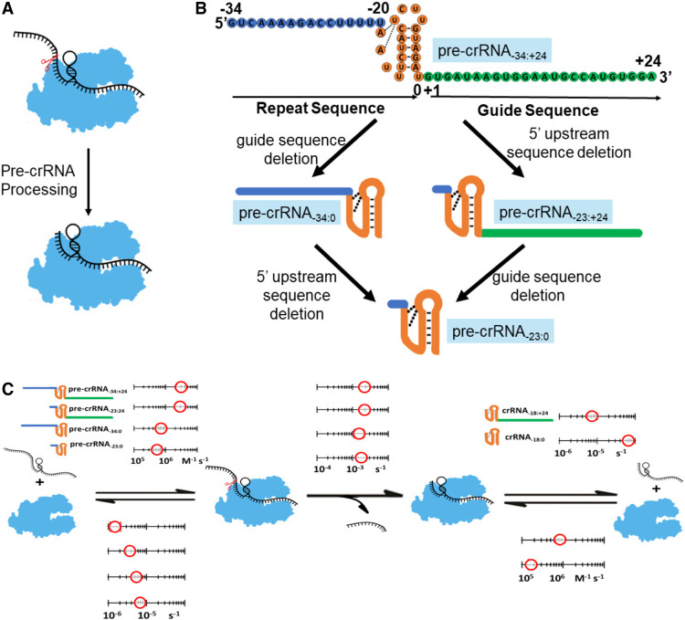
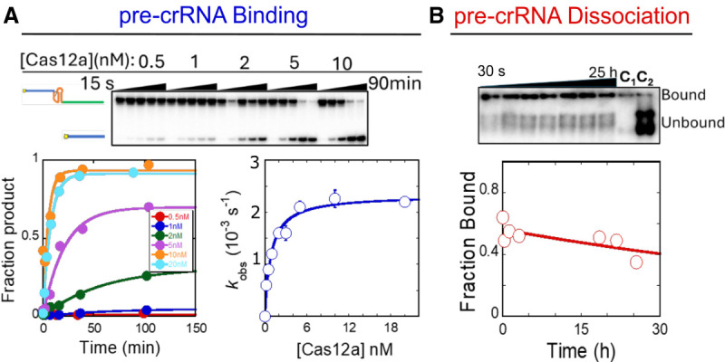
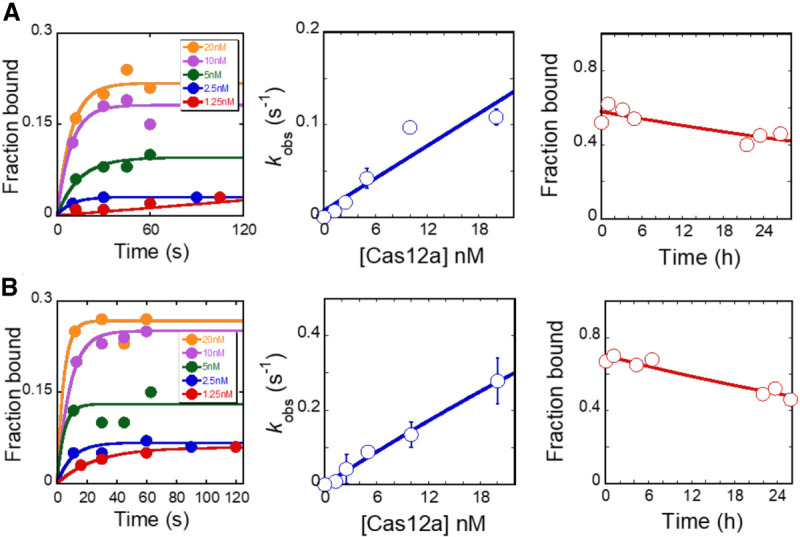
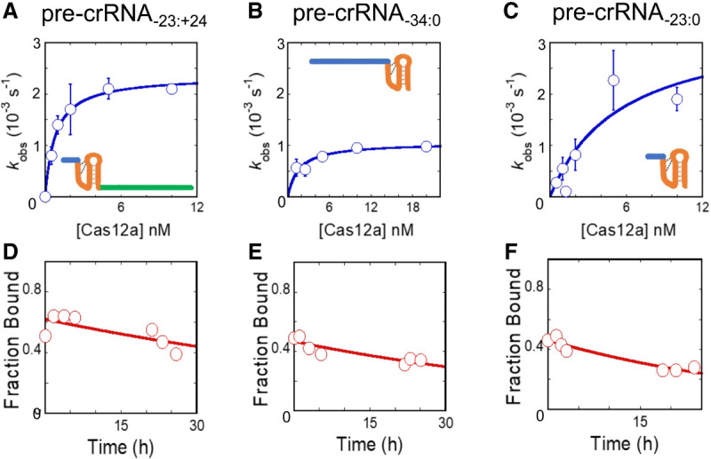
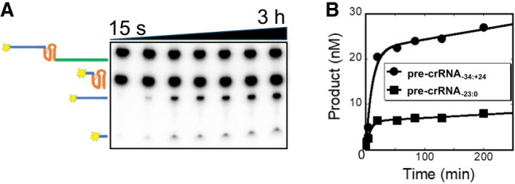
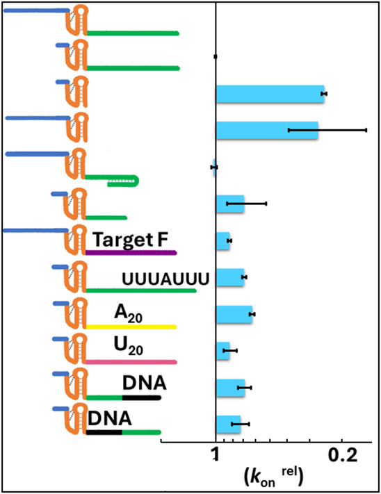
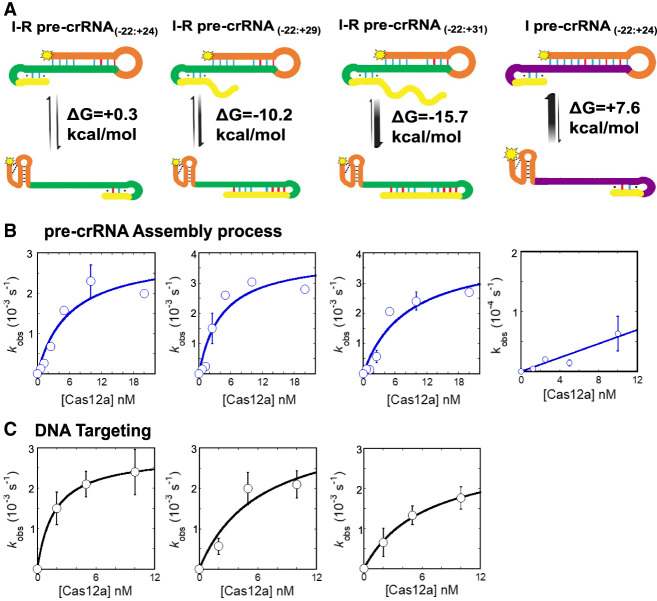

# Kinetic dissection of pre-crRNA binding and processing by CRISPR–Cas12a

**Selma Sinan, Nathan M. Appleby, Chia-Wei Chou, Ilya J. Finkelstein, and Rick Russell†** († corresponding)

*RNA*, Volume 30, Issue 10, Pages 1345–1355 (2024)

**DOI:** [10.1261/rna.080088.124](https://doi.org/10.1261/rna.080088.124)

---

## Table of Contents

- [Abstract](#abstract)
- [Results](#results)
- [Discussion](#discussion)
- [Materials and Methods](#materials-and-methods)
- [Acknowledgments](#acknowledgments)

---
##  Abstract
CRISPR–Cas12a binds and processes a single pre-crRNA during maturation, providing a simple tool for genome editing applications. Here, we constructed a kinetic and thermodynamic framework for pre-crRNA processing by Cas12a in vitro, and we measured the contributions of distinct regions of the pre-crRNA to this reaction. We find that the pre-crRNA binds rapidly and extraordinarily tightly to Cas12a (_K_ d = 0.6 pM), such that pre-crRNA binding is fully rate limiting for processing and therefore determines the specificity of Cas12a for different pre-crRNAs. The guide sequence contributes 10-fold to the binding affinity of the pre-crRNA, while deletion of an upstream sequence has no significant effect. After processing, the mature crRNA remains very tightly bound to Cas12a with a comparable affinity. Strikingly, the affinity contribution of the guide region increases to 600-fold after processing, suggesting that additional contacts are formed and may preorder the crRNA for efficient DNA target recognition. Using a direct competition assay, we find that pre-crRNA-binding specificity is robust to changes in the guide sequence, addition of a 3′ extension, and secondary structure within the guide region. However, stable secondary structure in the guide region can strongly inhibit DNA targeting, indicating that care should be taken in crRNA design. Together, our results provide a quantitative framework for pre-crRNA binding and processing by Cas12a and suggest strategies for optimizing crRNA design in genome editing applications.
**Keywords:** AsCas12a, CRISPR–Cas system, RNA folding, RNA-guided nuclease, rate-limiting binding
* * *
Class II CRISPR–Cas endonucleases have revolutionized genome editing and a broad range of research applications because of their ability to selectively target DNA sequences through complementarity with their crRNA ([Wang and Doudna 2023](#ref20)). Of the class II enzymes, Cas12a is thought to have particularly strong potential, because it targets linear or supercoiled DNA with very high specificity and is extraordinarily simple, processing its own pre-crRNA to a mature crRNA form by endonucleolytic cleavage to generate the 5′ end of the mature form ([Fig. 1](#fig1)A,C; [Fonfara et al. 2016](#ref4); [Swarts et al. 2017](#ref17); [Zetsche et al. 2017](#ref22); [Strohkendl et al. 2018](#ref15); [van Aelst et al. 2019](#ref19); [Nguyen et al. 2022](#ref11)). This self-processing enables a simple strategy for multiplexing in genome applications, with multiple pre-crRNAs produced in a single transcript for processing by Cas12a ([Zetsche et al. 2017](#ref22)). In addition to genome editing in cells, Cas12a has been used for applications including base editing and _trans_ -gene integration ([Kleinstiver et al. 2019](#ref9); [Mohr et al. 2023](#ref10)).

<figure class="paper-figure" id="fig1">

<figcaption><strong>Figure 1.</strong> Kinetic framework for full-length and truncated pre-crRNA variants. (A) Processing reaction of pre-crRNA by Cas12a. For further information on the chemical mechanism of pre-crRNA cleavage, see <a href="#ref17">Swarts et al. (2017)</a>. (B) Sequence of the full-length pre-crRNA (pre-crRNA−34:+24), with the nucleotide numbering convention from <a href="#ref17">Swarts et al. (2017)</a>. The repeat sequence is divided conceptually into a leader sequence (blue) and pseudoknot (orange). The guide sequence is green. Deletion constructs used herein are schematized below the pre-crRNA sequence. (C) Binding, dissociation, and cleavage steps and rate constants of the full-length pre-crRNA and the truncated forms tested herein. Binding and dissociation rate constants for the corresponding mature crRNA products are shown at the right. Uncertainties were typically 10%−30% and are listed in Table 1.</figcaption>
</figure>
The pre-crRNA can be divided into three major regions ([Fig. 1](#fig1)B). At the 5′ end, there is a leader sequence that is removed by endonucleolytic cleavage by Cas12a and is not part of the functional crRNA. Downstream from the leader is the "repeat" sequence, which forms a pseudoknot structure and is critical for stable Cas12a binding ([Fonfara et al. 2016](#ref4)). Following the repeat sequence is the guide sequence, known historically as the "spacer," which forms an approximately 20-bp R-loop with the target strand DNA and is therefore responsible for much of the specificity in DNA targeting. In addition, there can be a fourth region comprised of any additional nucleotides downstream from the guide sequence, which are not removed by Cas12a and have been suggested to augment its function in certain cases ([Bin Moon et al. 2018](#ref1)).
Analyses of the key features of the pre-crRNA for binding and processing have focused primarily on the pseudoknot region. When the RNA binds Cas12a to form an RNA-protein complex (RNP), the pseudoknot binds into a cleft between domains of Cas12a and is further stabilized by coordinating two hydrated Mg2+ ions ([Swarts et al. 2017](#ref17)). Processing of the pre-crRNA occurs just upstream of the pseudoknot sequence and depends strongly on sequence and structural features of the pseudoknot ([Fonfara et al. 2016](#ref4)). The chemical step does not itself require Mg2+ and is carried out by attack of the 2′-OH of nucleotide U(­–19) on the adjacent phosphoryl group, resulting in the formation of a 2′, 3′-cyclic phosphate on the 5′ leader, which is released, and the mature crRNA, which remains tightly bound ([Swarts et al. 2017](#ref17)). Although the affinity of the pre-crRNA has not been measured previously, it is known that binding of the processed crRNA is quite tight, with reported _K_ d values in the low nM range ([Dong et al. 2016](#ref3); [Fonfara et al. 2016](#ref4)).
Because the functional properties of mature Cas12a RNP are largely controlled by the bound crRNA, extensive efforts have been made to engineer the crRNA for enhanced target specificity and other desirable properties. Modifications have included additional nucleotides at the 5′ end ([Park et al. 2018](#ref12)) or the 3′ end ([Bin Moon et al. 2018](#ref1); [Wu et al. 2018](#ref21)), splitting the crRNA into two RNA molecules ([Jedrzejczyk et al. 2022](#ref5); [Shebanova et al. 2022](#ref14)), substituting segments of the crRNA with DNA nucleotides ([Kim et al. 2020](#ref7), [2022](#ref8)), and designing structures to compete against nonnative structure involving the pseudoknot region ([Creutzburg et al. 2020](#ref2); [Kim et al. 2020](#ref7), [2022](#ref8)). Despite the utility of these efforts and some successes in cell-based assays, it can be difficult to generalize the effects or understand their molecular origin, and it is typically not known whether the functional effects reflect changes only in the properties of the Cas12a RNP itself or also reflect alterations in the interactions with other cellular components.
Here, we construct a kinetic and thermodynamic framework for pre-crRNA recognition and processing by Cas12a. We find that binding of the pre-crRNA is extraordinarily tight (0.6 pM) and is fully rate-limiting for cleavage under subsaturating conditions. The 5′ leader sequence makes little or no contribution to pre-crRNA affinity, whereas the guide region contributes 10-fold and makes an even larger, 600-fold contribution to affinity of the processed crRNA. Secondary structure in pre-crRNA that competes with the conserved pseudoknot can inhibit pre-crRNA assembly, and secondary structure involving the guide region can inhibit DNA targeting, suggesting that these potential complications should be considered in crRNA design for genome editing applications.
---
##  RESULTS
### Kinetic and thermodynamic framework for pre-crRNA binding and processing
To probe the kinetic mechanism of pre-crRNA recognition and processing by Cas12a and to provide a foundation for experiments using pre-crRNA variants, we established a kinetic framework for pre-crRNA binding and processing by AsCas12a. We started by using a radiolabeled "full-length" pre-crRNA (pre-crRNA−34:+24) consisting of a 35 nt repeat sequence, including the pseudoknot structure, and a 24 nt guide sequence ([Fig. 1](#fig1)B, top; Supplemental Fig. S1). For each reaction step, we used polyacrylamide gel electrophoresis (PAGE) to separate the starting material from the “product” of the reaction step being measured.
We first performed single-turnover pre-crRNA processing reactions under conditions of saturating or subsaturating Cas12a to measure the maximal rate constant (_k_ max) and second-order rate constant (_k_ cat/_K_ M), respectively. For these measurements, we added a trace amount of radiolabeled pre-crRNA to various concentrations of Cas12a, and we used denaturing PAGE to measure the time dependence of Cas12a processing to produce the shorter mature crRNA. With saturating Cas12a, the observed rate constant was 2.3 (±0.3) × 10−3 sec−1 ([Fig. 2](#fig2)A; results summarized in [Fig. 1](#fig1)C; Table 1), which reflects the rate constant for pre-crRNA cleavage from the bound complex. With subsaturating Cas12a concentrations, the dependence of the observed rate constant on concentration gave a _k_ cat/_K_ M value of 2.9 (±0.2) × 106 M−1 sec−1 ([Fig. 2](#fig2)A). Experiments described below indicate that this value reflects the rate constant for pre-crRNA binding to Cas12a (_k_ on).
<figure class="paper-figure" id="fig2">

<figcaption><strong>Figure 2.</strong> Cas12a binding and dissociation of pre-crRNA−34:+24. (A) Binding and pre-crRNA cleavage kinetics. The top image shows a representative gel, with the indicated Cas12a concentrations, trace radiolabeled pre-crRNA−34:+24, and time points from 30 sec to 90 min. Data from the gel are shown as time courses with fits by pseudo-first-order rate equations (lower left), and observed rate constants from these and additional experiments are plotted against Cas12a concentration to give the second-order rate constant and maximal first-order rate constant indicated from a fit by a hyperbolic equation (lower right). The value of k on was 2.9 (±0.2) × 106 M−1 sec−1, reflecting the average and SEM of fits to data from three independent experiments. (B) Dissociation kinetics. Trace radiolabeled −19d,pre-crRNA−34:+24 was bound to Cas12a and chased off a 10-fold excess of unlabeled −19d,pre-crRNA−34:+24. The additional bands visible just above the free substrate in the gel image (top) were consistently observed in the presence of the chase oligonucleotide and probably reflect fortuitous interactions of two molecules of −19d,pre-crRNA−34:+24. The lane C1 shows a reaction performed in the absence of chase oligonucleotide. The lane C2 shows a reaction in which the labeled and unlabeled pre-crRNA was mixed together and then added to Cas12a. The plot (bottom) shows results from the gel image, with the best fit by a first-order rate equation. The value of k off was 1.6 (±0.5) × 10−6 sec−1, reflecting the average and SEM of fits to data from five independent experiments.</figcaption>
</figure>
#### TABLE 1.
Kinetic parameters of AsCas12a pre-crRNA processing
|  _k_ _on_ (M−1 sec−1) |  _k_ _off_ (sec−1)b |  _K_ _d_ (pM) |  _k_ _c_ (sec−1)  
---|---|---|---|---  
pre-crRNA(−34:+24) | 2.9 (±0.2) × 106 | 1.6 (±0.5) × 10−6 | 0.56 (±0.18) | 2.3 (±0.3) × 10−3  
pre-crRNA(−23:+24) | 2.6 (±0.2) × 106 | 3.6 (±0.3) × 10−6 | 1.4 (±0.2) | 2.3 (±0.2) × 10−3  
pre-crRNA(−34:0) | 6.7 (±0.3) × 105 | 5.3 (±0.7) × 10−6 | 7.2 (±1.4) | 1.6 (±0.5) × 10−3  
pre-crRNA(−23:0) | 6.2 (±1.2) × 105 | 6.7 (±0.5) × 10−6 | 5.0 (±1.3) | 1.8 (±0.15) × 10−3  
*crRNA(−18:+24) | 5.9 (±0.7) × 106 | 4.5 (±0.3) × 10−6 | 0.76 (±0.09) | NA  
crRNA(−18:+24)*a | 1.4 (±0.3) × 107 | 7.4 (±0.2) × 10−6 | 0.53 (±0.12) | NA  
crRNA(−18:+24) | ND | 2.2 (±0.3) × 10−5c | ND | NA  
crRNA(−18:0)a | 1.7 (±0.2) × 105 | 6.7 (±0.2) × 10−5 | 390 (±50) | NA  
Open in a new tab
aFor crRNA variants, the asterisk indicates whether the radiolabel is at the 5′ end (*crRNA) or the 3′ end (crRNA*).
bFor the determination of the pre-cRNA dissociation rate constants, we used a pre-crRNA substrate containing dU at position −19 to prevent Cas12a-mediated cleavage.
cMeasured using excess pre-crRNA(−34: + 24) in multiple turnover reactions.
(NA) Not applicable, (ND) not determined.
Next, we measured the dissociation rate constant of pre-crRNA. For these experiments, the pre-crRNA included a deoxyuridine (dU) at position −19 to prevent its cleavage by Cas12a (Supplemental Fig. S2; [Swarts et al. 2017](#ref17)). This dU substitution did not substantially impact binding of the pre-crRNA, as it gave at most a small decrease in the association rate constant (Supplemental Fig. S3). To measure dissociation, we performed a pulse-chase procedure by pre-incubating Cas12a with a trace amount of radiolabeled pre-crRNA to allow complete binding of the pre-crRNA and then initiating dissociation reactions by adding excess unlabeled pre-crRNA ([Fig. 2](#fig2)B). At various times thereafter, we resolved bound and free pre-crRNA using native PAGE. Dissociation was very slow, giving a _k_ off value of 1.6 (±0.5) × 10−6 sec−1 ([Fig. 2](#fig2)B). This rate constant is 1000-fold lower than that for RNA processing by Cas12a, indicating that RNA binding is functionally irreversible and therefore that the _k_ cat/_K_ M value measured above reflects the rate constant for pre-crRNA binding, _k_ on. From the _k_ on and _k_ off values, we calculated an equilibrium constant value (_K_ d) for pre-crRNA binding of 0.56 (±0.18) pM (_k_ off/_k_ on). This value reflects much tighter binding than the low nM value that was determined previously for binding of the mature crRNA by the related LbCas12a ([Dong et al. 2016](#ref3)).
### Mg2+ ion accelerates processing and slows dissociation of pre-crRNA
Although early work indicated that divalent cations promote pre-crRNA processing by FnCas12a ([Fonfara et al. 2016](#ref4)), later work showed that Mg2+ is not absolutely required for processing by LbCas12a, although Mg2+ or other divalent cations increased the extent of RNA cleavage ([Swarts et al. 2017](#ref17)). To more fully understand how Mg2+ participates in pre-crRNA processing, we determined the effects of Mg2+ concentration on AsCas12a binding and processing of the full-length pre-crRNA (pre-crRNA−34:+24). We found that the cleavage rate constant was unaffected by Mg2+ concentration from 1 to 10 mM, and it decreased by only fivefold in the absence of Mg2+ (Supplemental Fig. S4). These results support the conclusion that pre-crRNA cleavage proceeds through nucleophilic attack by the 2′-hydroxyl group of the upstream ribonucleotide on the scissile phosphate ([Swarts et al. 2017](#ref17)), and they indicate that one or more tightly bound Mg2+ ions play a minor but detectable role in the catalytic reaction, perhaps by binding and stabilizing the pseudoknot structure ([Swarts et al. 2017](#ref17)) or by contributing to positioning of the substrate in the nuclease active site.
We also used native PAGE to measure the pre-crRNA binding and dissociation rate constants in the absence of Mg2+. The binding rate constant was minimally impacted by removing Mg2+ (1.4 [±0.4] × 106 M−1 sec−1), but dissociation was accelerated 20-fold to 3.2 (±1.5) × 10−5 sec−1 (Supplemental Fig. S5). Thus, the _K_ d value is 24 (±13) pM in the absence of Mg2+, 40-fold weaker than in its presence. This result is consistent with previous findings that Mg2+ promotes ordering of the crRNA pseudoknot and increases the RNA-binding affinity of FnCas12a ([Dong et al. 2016](#ref3); [Fonfara et al. 2016](#ref4)). Nevertheless, pre-crRNA binding by Cas12a remains very tight in the absence of Mg2+, with affinity in the pM range.
### Kinetics and thermodynamics of the Cas12a complex with mature crRNA
We also determined rate and equilibrium constants for interaction of Cas12a with the mature, processed crRNA (crRNA−18:+24). We used native PAGE to measure the binding and dissociation rate constants of the mature crRNA ([Fig. 3](#fig3)A). For the 5′-labeled crRNA, pulse-chase experiments analogous to those above gave a _k_ on value of 5.9 (±0.7) × 106 M−1 sec−1 and a _k_ off value of 4.5 (±0.3) × 10−6 sec−1 (_t_ 1/2 = 43 h). These values gave an equilibrium constant of 0.76 (±0.09) pM, indistinguishable from the affinity for the pre-crRNA. Thus, mature crRNA continues to bind very tightly to Cas12a and does not readily dissociate.
<figure class="paper-figure" id="fig3">

<figcaption><strong>Figure 3.</strong> Binding and dissociation kinetics for mature crRNA. (A) Binding (left and center) and dissociation (right) kinetics of the mature crRNA−18:+24 with a 5′ label. In the center plot, binding data are shown as the average and SEM from three independent measurements. Values of k on and k off were 5.9 (±0.7) × 106 M−1 sec−1 and 4.5 (±0.3) × 10−6 sec−1, respectively. (B) Binding (left and center) and dissociation (right) kinetics of the mature crRNA−18:+24 with a 3′ label. In the center plot, binding data are shown as the average and SEM from three independent measurements. Values of k on and k off were 1.4 (±0.3) × 107 M−1 sec−1 and 7.4 (±0.2) × 10−6 sec−1, respectively. In both panels, the binding time courses are fit by pseudo-first-order rate equations (left), the concentration dependences are fit by a line (middle), and the dissociation time courses are fit by a first-order rate equation (right).</figcaption>
</figure>
To test whether the binding properties of the crRNA were affected by the presence of the 5′-phosphate label, which would mimic the scissile phosphate but would be absent in the natural processed crRNA, we also used a 3′-labeled crRNA. The binding properties were similar to the 5′-labeled crRNA (_k_ on = 1.4 [±0.3] × 107 M−1 sec−1 and _k_ off = 7.4 [±0.2] × 10−6 sec−1) ([Fig. 3](#fig3)B). We also measured crRNA dissociation by performing multiple-turnover pre-crRNA processing reactions, with a small excess of pre-crRNA over Cas12a (Supplemental Fig. S6). With either 5′-labeled or 3′-labeled pre-crRNA, we observed a relatively rapid burst of product formation and then a slow phase of further product formation, which we infer reflects the slow release of the product crRNA. The rate constant for this slow phase was 2.2 (±0.3) × 10−5 sec−1 for the 5′-labeled substrate and 1.1 (±0.1) × 10−5 sec−1 for the 3′-labeled substrate. For the former substrate, the label dissociates rapidly with the 5′ leader sequence after pre-crRNA cleavage, and thus the crRNA product whose rate is followed is unlabeled. Thus, we conclude that the radiolabel at either the 5′ or 3′ end contributes little to crRNA binding (less than or equal to twofold).
Together, the results indicate that Cas12a binds the mature crRNA with an equilibrium constant of ∼0.6 pM and a lifetime of hours. It seems likely that the extraordinarily tight grip of Cas12a on the mature crRNA functions to ensure that it does not dissociate before the complex reaches its DNA target. To test the generality of this conclusion, we also measured binding to LbCas12a and FnCas12a. Specifically, we measured the rate constants for pre-crRNA binding and crRNA dissociation (Supplemental Figs. S7 and S8), finding that both were similar to the corresponding values for AsCas12a. Thus, we conclude that Cas12a binds its RNA very tightly, both before and after processing, with affinities in the low pM range.
### Dissection of the regions within pre-crRNA
An early study established the importance of the pseudoknot structure for pre-crRNA processing ([Fonfara et al. 2016](#ref4)), but there is little knowledge of how other regions of the pre-crRNA contribute to assembly and processing by Cas12a. Therefore, we generated pre-crRNA variants with deletions of the 5′ upstream sequence (pre-crRNA−23:+24), the guide region (pre-crRNA−34:0), or both regions (pre-crRNA−23:0) (see [Fig. 1](#fig1)).
We first measured pre-crRNA cleavage at saturating or near-saturating concentrations and found that none of these deletions gave large effects on the rate constant for pre-crRNA cleavage after assembly, as all three truncated versions gave the same rate constant (within twofold) as the full-length pre-crRNA−34:+24 ([Fig. 4](#fig4)A–C; see also [Fig. 1](#fig1)C). Next, from the dependence of the observed rate constant on subsaturating Cas12a concentrations, we found that deletion of the guide region slowed Cas12a binding by twofold to fourfold (compare pre-crRNA−34:0 with pre-crRNA−34:+24; also compare pre-crRNA−23:0 with pre-crRNA−23:+24), while deletion of the upstream region had little or no effect on the binding rate constant (less than twofold). Deletion of the guide region also increased the dissociation rate constant by twofold to threefold ([Fig. 4](#fig4)D–F; see also [Fig. 1](#fig1)C). Together, these effects resulted in a calculated equilibrium constant (_K_ d) of 5.0 (±1.3) pM for the double deletion construct, ∼10-fold weaker binding than the full-length pre-crRNA. The variant pre-crRNA−34:0 gave approximately the same _K_ d value (7.2 [±1.4] pM), underscoring the conclusions that the guide region contributes an order of magnitude to binding affinity and the upstream sequence has little or no effect on binding.
<figure class="paper-figure" id="fig4">

<figcaption><strong>Figure 4.</strong> Binding and dissociation kinetics for truncated pre-crRNA variants. ((A) – (C)) Binding kinetics measurements for (A) pre-crRNA−23:+24, (B) pre-crRNA−34:0, (C) pre-crRNA−23:0. Binding rate constants (average ± SEM) were determined from the results of fits of each of four independent data sets to a hyperbolic equation. Rate constants were 2.6 (±0.2) × 106 M−1 sec−1 for pre-crRNA−23:+24, 6.7 (±0.3) × 105 M−1 sec−1 for pre-crRNA−34:0, and 6.2 (±1.2) × 105 M−1 sec−1 for pre-crRNA−23:0. ((D) – (F)) Representative dissociation kinetics measurements for the Cas12a variants shown in (A) – (C) , respectively. Rate constants were calculated as the average and SEM from at least three independent measurements, with each data set fit by a first-order rate equation. Values of k off were 3.6 (±0.3) × 10−6 sec−1 for pre-crRNA−23:+24, 5.3 (±0.7) × 10−6 sec−1 for pre-crRNA−34:0, and 6.7 (±0.5) × 10−6 sec−1 for pre-crRNA−23:0.</figcaption>
</figure>
### Contribution of the guide region to crRNA-binding affinity increases after processing
We also examined the effect of the guide region on binding of the mature crRNA, the product of Cas12a processing. By measuring the binding and dissociation rate constants for a truncated crRNA (crRNA−18:0), we found that the guide region makes a much larger contribution to the affinity of the mature crRNA product, as its removal slows binding by 60-fold and accelerates dissociation by 11-fold to give an overall decrease in affinity of more than 600-fold (Supplemental Fig. S9). This is substantially larger than the ∼10-fold contribution of the guide region to affinity in the context of the pre-crRNA and suggests that additional contacts between the protein and the guide region may form as a consequence of pre-crRNA processing.
### Pre-crRNA-binding specificity is robust to changes in length, sequence, and structural features of the guide region
We were particularly interested in the finding above that the presence of the guide region accelerates binding of the pre-crRNA because the binding rate constant controls the overall efficiency of Cas12a loading. Thus, the impacts of the guide region might influence the relative loading efficiencies of different pre-crRNAs in multiplex genome editing applications as well as in nature. To further explore this possibility, we investigated how the guide sequence, length, and secondary structure impact the binding rate constant. To increase the sensitivity of detection for changes in the binding rate constant and to directly reflect the potential competitive environment in multiplex applications, we used a direct competition method in which each reaction included a reference pre-crRNA (either pre-crRNA−34:+24 or pre-crRNA−23:+24) and a given pre-crRNA variant, each in modest excess of Cas12a ([Fig. 5](#fig5)). We expected that as Cas12a performed a fast, single round of pre-crRNA binding and processing, the amount of product produced from the pre-crRNA variant, relative to the amount of product from the reference pre-crRNA, would reflect its relative binding rate constant.
<figure class="paper-figure" id="fig5">

<figcaption><strong>Figure 5.</strong> Competition experiment for Cas12a binding by pre-crRNA−34:+24 and pre-crRNA−23:0. (A) Denaturing gel image showing the substrates and products for both pre-crRNAs. The reaction included 50 nM of each pre-crRNA and 30 nM Cas12a. (B) Progress curves depicting cleavage of each pre-crRNA variant. Because Cas12a binding is rate-limiting for cleavage, the relative amplitudes of the "burst" phase of product accumulation correspond to the relative rate constants for binding of the two pre-crRNA variants. Data are fit by an equation with an exponential term, reflecting cleavage of the first round of pre-crRNA, and a linear term, reflecting slow additional rounds of processing that are limited in rate by crRNA release from Cas12a.</figcaption>
</figure>
To ensure that the direct competition method gave results consistent with binding measurements, we first measured the effect of deleting the guide region. The amount of products, relative to the full-length, reference pre-crRNA product, were 0.25 (± 0.08) for pre-crRNA−23:0 and 0.27 (± 0.12) for pre-crRNA−34:0 ([Fig. 5](#fig5); Supplemental Fig. S10), in good agreement with the expected values of 0.21 (± 0.04) and 0.26 (± 0.02) from the binding rate constant measurements above (see [Fig. 1](#fig1)). Also as expected, the pre-crRNA variant lacking the 5′-leader sequence (pre-crRNA−23:+24) competed equally with the full-length pre-crRNA−34:+24, with a value of 1.0 (±0.1), consistent with the value of 0.87 (±0.09) from the rate constant measurements ([Fig. 5](#fig5)).
Having established the competition method, we next investigated potential effects of the RNA sequence within the guide region by competing the pre-crRNA−34:+24 against variants with large changes in sequence; specifically the all-purine sequence A20 or the all-pyrimidine sequence U20. These variants gave relative binding rate constants of 0.63 ± 0.02 and 0.83 ± 0.07, respectively ([Fig. 6](#fig6); Supplemental Fig. S10). These small effects in response to very large changes in sequence and base structure suggest that Cas12a is relatively insensitive to sequence changes in the guide region, despite the importance of its presence. We also investigated how the length of the guide impacts the Cas12a binding rate constant. A pre-crRNA with a 10 nt guide sequence gave a value of 0.69 ± 0.17, indicating a minimal decrease in binding rate constant. Likewise, a pre-crRNA with eight uracil nucleotides (U8) appended to the 3′ end of the guide sequence gave a value of 0.69 ± 0.02. Because previous work indicated enhanced functionality in cell-based applications for a crRNA with U8 at the 3′ end of the guide region, we also measured dissociation of the processed form via multiple turnover experiments. We determined a rate constant of 2.16 (±0.03) × 10−5 sec−1, which is the same as that for pre-crRNA−34:+24, indicating that the lifetime of the crRNA-Cas12a complex is unaltered by the U8 addition. Together, our results suggest the absence of large effects of the sequence or length of the guide region on the Cas12a binding rate constant, although complete removal of the guide region reduces the binding rate constant by approximately fourfold.
<figure class="paper-figure" id="fig6">

<figcaption><strong>Figure 6.</strong> Relative Cas12a assembly rate constants measured by direct competition. Each pre-crRNA variant tested is shown in the cartoon at the left , and the corresponding bar at the right shows the rate constant relative to the reference pre-crRNA. The pre-crRNA−34:+24 (top) is assigned a relative rate constant of 1 by definition. Binding of the second variant, pre-crRNA−23:+24, was measured and found to be equivalent in rate, as indicated by the absence of a bar to its right. All of the variants below were measured using one of these two pre-crRNAs as a reference, whichever one differed in length of the 5′ leader sequence from the variant being tested and therefore could be distinguished by the length of the labeled cleavage product. Bars reflect the average ± SEM from three independent measurements.</figcaption>
</figure>
Last, we measured the effects on binding rate constant of additional changes to the guide region with potential utility or consequences in cell-based applications. To probe the effect of secondary structure within the guide region, we measured competition of a pre-crRNA with a guide sequence that can form a 7 bp hairpin structure. This variant competed equally with the full-length pre-crRNA−34:+24, giving a ratio of 1.02 ± 0.04 ([Fig. 6](#fig6)). The Cas12a RNP loaded with this crRNA was strongly inhibited for DNA targeting (DNA binding and/or nontarget strand cleavage; Supplemental Fig. S11), suggesting that the secondary structure of the crRNA remains formed in the mature Cas12a RNP. We also measured competition of pre-crRNA variants with chimeric, RNA–DNA guide regions in which DNA replaced nt 1–10 or 11–20 of the guide region. These variants gave competition values of 0.73 ± 0.06 and 0.69 ± 0.04, respectively, suggesting that DNA regions of the guide region have at most small effects on the binding rate constant. Because such chimeric guides are suggested to be useful for applications by increasing specificity of DNA recognition, we also measured the lifetimes of these chimeric crRNAs after processing, again using multiple turnover reactions. The dissociation rate constants were 4.3 (±0.9) × 10−5 sec−1 and 2.6 (±1.3) × 10−5 sec−1 for the variants with DNA in the proximal or distal positions, respectively. These values are at most modestly larger than the value of 2.2 (±0.3) × 10−5 sec−1 measured for the standard crRNA, indicating that the substitution of up to 10 DNA nucleotides does not compromise the lifetime of the crRNA-bound complex significantly.
### Competition between upstream and downstream structures in pre-crRNA
Intrigued by the potential for complex interplay between competing secondary structures within pre-crRNA that might inhibit Cas12a loading or DNA targeting, we measured both of these processes for a series of pre-crRNAs using design principles outlined previously ([Creutzburg et al. 2020](#ref2)). This series features a guide sequence with potential to base pair with upstream nucleotides, inhibiting formation of the conserved pseudoknot structure that is required for assembly with Cas12a ([Fig. 7](#fig7)). It also includes sequences downstream from the guide with potential to form competing base pairs with the guide sequence, potentially rescuing inhibition of Cas12a assembly by liberating the conserved pseudoknot while also potentially inhibiting DNA targeting by sequestering the guide nucleotides.
<figure class="paper-figure" id="fig7">

<figcaption><strong>Figure 7.</strong> Pre-crRNA misfolding and rescue by downstream secondary structure. (A) Schematics showing alternative secondary structures and corresponding predicted free energy differences (<a href="#ref13">Serra and Turner 1995</a>). See Supplemental Figure S1 for pre-crRNA sequences. (B) Cas12a assembly kinetics. Rate constants were measured by following pre-crRNA processing using the indicated Cas12a concentrations and trace radiolabeled pre-crRNA. Each plot shows results from the corresponding pre-crRNA above it. Data are shown as the average ± SEM of three independent measurements and are fit by a hyperbola to give k on values (left to right) of 5.6 (±0.1) × 105 M−1 sec−1, 9.8 (±0.5) × 105 M−1 sec−1, 6.4 (±0.1) × 105 M−1 sec−1, and 6.8 (±0.8) × 103 M−1 sec−1. The maximal rate constants for the I-R constructs were (left to right) 2.9 (±0.6) × 10−3 sec−1, 3.8 (±0.7) × 10−3 sec−1, and 4.1 (±1.0) × 10−3 sec−1. (C) Kinetics of DNA targeting. Rate constants were measured by following cleavage of radiolabeled NTS at the indicated Cas12a concentrations. Data were fit by a hyperbola to give the DNA binding and NTS cleavage rate constants. Each plot shows results from the corresponding pre-crRNA above it. The pre-crRNA at the right was not measured for DNA binding because it blocked Cas12a assembly of the pre-cRNA. Second-order rate constants were (left to right) 1.6 (±0.4) × 106 M−1 sec−1, 4.8 (±0.6) × 105 M−1 sec−1, and 2.5 (±0.1) × 105 M−1 sec−1 (average ± SEM from three independent experiments).</figcaption>
</figure>
The first construct, which showed less than maximal activity in the previous study ([Creutzburg et al. 2020](#ref2)), was predicted by nearest neighbor rules to display a modest preference (0.3 kcal/mol) for the misfolded conformation ([Fig. 7](#fig7)A; Supplemental Fig. S12; [Serra and Turner 1995](#ref13)). Cas12a assembled with this pre-crRNA with a rate constant of 5.6 (±0.1) × 105 M−1 sec−1, fivefold lower than that for the standard pre-crRNA. Once bound, the pre-crRNA was processed with a similar rate constant, as evidenced by the plateau in observed rate constant with increasing Cas12a concentration. Despite the presence of three potential base pairs between the PAM-distal part of the guide region and the flanking RNA, this crRNA mediated efficient DNA targeting. However, when this base-pairing potential was extended to 8 or 10 bp, we expected that the native conformation would be favored, such that assembly with Cas12a would proceed efficiently. Indeed, efficient assembly was observed, although the rate constants remained modestly lower than for the standard pre-crRNA ([Fig. 7](#fig7)). In addition, the more extensive base-pairing between the guide sequence and the flanking sequence might be expected to interfere with DNA targeting. Consistent with this expectation, these constructs gave progressively lower rate constants for DNA targeting, although the changes were smaller than predicted by nearest neighbor rules.
The results from the constructs above were qualitatively consistent with expectations from the predicted relative stabilities of the secondary structures, but none were strongly inhibitory to Cas12a assembly. To test whether further stabilizing the misfolded pre-crRNA structure would indeed inhibit assembly, we modified the guide sequence to hyper-stabilize this inhibitory structure by creating a continuous, 12 bp helix. Indeed, we found that this construct gave a substantially decreased assembly rate constant with Cas12a (∼10-fold), such that we were unable to generate a homogeneous population of assembled Cas12a RNP. Taken together, these results indicate that misfolded structures that compete against pseudoknot formation or sequester the guide sequence can inhibit Cas12a assembly or DNA targeting by Cas12a, respectively.
---
##  DISCUSSION
Our systematic kinetic analysis of the pre-crRNA binding and processing reaction provides insights into how Cas12a recognizes RNA and suggests strategies for improving Cas12a properties in some gene editing applications. We find that association of pre-crRNA with Cas12a is efficient and functionally irreversible, as processing occurs much faster than dissociation. The guide region of the pre-crRNA contributes significantly to binding affinity, both by increasing the pre-crRNA-binding rate and decreasing the dissociation rate, while our work provides no evidence for effects of additional nucleotides upstream from the conserved pseudoknot.
While previous work established that the pseudoknot region is a key determinant of crRNA affinity for Cas12a, contributions of other regions of the crRNA had not been systematically analyzed. Our finding that deletion of the guide region results in decreases in affinity, both in the pre-crRNA and in the mature crRNA, implies that there are contacts formed with Cas12a by this region. The crystal structure of FnCas12a with a mature crRNA revealed contacts between positions 1–5 of the crRNA backbone (i.e., the 5′ portion of the guide sequence) and amino acids in the WED and REC1 domains ([Swarts et al. 2017](#ref17)). Interestingly, most of the 10-fold increase in affinity for the pre-crRNA complex arises from an acceleration of binding, suggesting that contacts formed with the guide region are formed early in the binding process, before attainment of the rate-limiting transition state for binding. Recent structural and computational work indicates that the overall process of pre-crRNA assembly can include a large-scale conformational change of Cas12a from an open to a closed complex ([Jianwei et al. 2023](#ref6); [Sudhakar et al. 2023](#ref16)). Our finding that the affinity contribution of the guide region increases from 10- to 600-fold after the processing step implies that some of these contacts are not fully formed until after pre-crRNA processing. A previous analysis also detected a contribution of the guide region to crRNA affinity, although the measured difference was substantially smaller ([Dong et al. 2016](#ref3)). Biologically, the increased contacts in the mature crRNA complex may contribute to the pre-orientation of the PAM-proximal region of the guide for DNA targeting ([Jianwei et al. 2023](#ref6); [Sudhakar et al. 2023](#ref16)), and it may also enhance rejection of crRNAs with absent or severely truncated guide regions.
Apart from deletions of the guide region, we found that the binding properties of the pre-crRNA to Cas12a are remarkably robust. Adding nucleotides to the 3′ end of the guide region or 5′ of the cleavage site, or replacing segments with DNA, did not significantly impact the kinetics or equilibrium binding properties. Likewise, varying the sequence of the guide region gave no detectable effect on Cas12a binding. Even pre-crRNAs whose guide regions are predicted to form stable internal secondary structure bind Cas12a with essentially the same binding rate constant, and the inability of the resulting RNPs to efficiently target their cognate DNA indicate that the hairpin is indeed formed in the RNP. These results suggest that a crRNA with a guide region with self-complementarity would serve as an effective inhibitor, because it would bind readily to Cas12a, competing with other crRNAs, but would presumably be unable to recognize target DNA ([Thyme et al. 2016](#ref18)).
On the other hand, misfolded pre-crRNA structure that interferes with native folding of the pseudoknot region can interfere with pre-crRNA binding, as suggested previously ([Creutzburg et al. 2020](#ref2)). This interference presents a limitation for crRNA design because many sequences will have partial complementarity to the pseudoknot region. The interference can be rescued by including a downstream sequence with complementarity to the portion of the guide sequence that forms these inhibitory base pairs. However, this secondary structure has the potential to inhibit DNA targeting. Together, our results suggest that considerable care should be taken in designing crRNAs to ensure that they do not form internal secondary structures that may inhibit Cas12a assembly or DNA targeting.
---
##  MATERIALS AND METHODS
### Cas12a expression and purification
AsCas12a was expressed as a fusion protein with a cleavable His6/Twin-Strep/SUMO N-terminal tag and purified as described ([Strohkendl et al. 2018](#ref15)). Plasmids harboring full-length LbCas12a and FnCas12a were obtained from Addgene (catalog numbers 113431 and 113432, respectively) and cloned into pET19-based expression vectors (pIF162 and pIF1042 for LbCas12a and FnCas12a, respectively). The proteins were expressed as fusion proteins with a cleavable His6/Twin-Strep/SUMO N-terminal tag and purified as described for AsCas12a. After purification, small aliquots were flash-frozen in liquid nitrogen and stored at −80°C. Protein concentrations were determined by the Bradford assay (Bio-Rad) using bovine serum albumin as a standard.
### Measurement of pre-crRNA cleavage rates
Pre-crRNA was 5′-radiolabeled with [γ-32P] ATP (PerkinElmer) using T4 polynucleotide kinase (New England Biolabs). For some measurements, mature crRNAs were 3′-radiolabeled by using T4 polynucleotide kinase to label cytidine 3′-monophosphate with [γ−32P] ATP followed by ligation to the 3′ end of the crRNA with T4 RNA ligase. Radiolabeled oligonucleotides were purified by PAGE, eluted in TE buffer (10 mM Tris-Cl, pH 8.0, 1 mM EDTA), and stored at −20°C. Pre-crRNA cleavage reactions were performed using various Cas12a concentrations in 50 mM Na-MOPS, pH 7.0, 120 mM NaCl, 5 mM MgCl2, 2 mM DTT, and 0.2 mg/ml BSA and were initiated of a trace amount of labeled pre-crRNA. At various times, 2 μL samples were quenched in 4 μL of denaturing quench (20 mM EDTA, 90% formamide, 0.01% bromophenol blue, and 0.04% xylene cyanol). Samples were analyzed by denaturing PAGE (20% acrylamide, 7 M urea). Gels were exposed to a phosphorimager screen overnight, scanned using a Typhoon FLA 9500 (GE Healthcare), and quantified using ImageQuant 5.2 (GE Healthcare).
### Measurement of pre-crRNA-binding kinetics to Cas12a
Pre-crRNA binding was initiated by the addition of a trace amount of radiolabeled pre-crRNA to various concentrations of Cas12a (0.5–10 nM). Reactions were performed in 50 mM Na-MOPS, pH 7.0, 120 mM NaCl, 5 mM MgCl2, 2 mM DTT, and 0.2 mg/mL BSA as described for the cleavage reactions. At various time points, 2 μL aliquots were withdrawn and added to 4 μL of ice-cold chase solution (reaction conditions plus [fina] 100 nM unlabeled pre-crRNA, 15% glycerol, and 0.01% xylene cyanol) and placed on ice. Control reactions in which the chase pre-crRNA and labeled pre-crRNA were mixed and then added to Cas12a under identical conditions ensured that the chase solution adequately competed effectively against the labeled pre-crRNA. After being added to the chase solution, aliquots were placed on ice and then loaded on a 15% native gel run at 4°C. Gels were exposed overnight and analyzed as described above. Binding reactions in the absence of Mg2+ were performed as above but with 5 mM EDTA and no Mg2+. Values of _k_ on were determined from the slope of the dependence of the observed rate constant on Cas12a concentration.
### Measurement of pre-crRNA dissociation kinetics to Cas12a
For the determination of the dissociation rate constant, we used a 5′-radiolabeled pre-crRNA with dU at position −19 to prevent Cas12a-mediated cleavage. Cas12a was mixed with a trace amount of substrate for 1 h at 25°C to allow complete binding of the pre-crRNA. Dissociation reactions were performed at 10 nM Cas12a and initiated by addition of the unlabeled pre-crRNA in large (10-fold) excess over the protein concentration. Aliquots (2 μL) were withdrawn over ∼24 h, mixed with 4 μL of chase quench (reaction conditions with 15% glycerol, 0.01% xylene cyanol), and stored at 4°C. Samples were electrophoresed on a 15% native gel at 4°C, imaged with a phosphorimager, and analyzed as described above. Experiments were performed at 5 mM Mg2+ or in the absence of Mg2+. For experiments in the absence of Mg2+, Cas12a was assembled with the pre-crRNA as described above, and then Mg2+ was chelated by addition of 10 mM EDTA.
### Quantitation and statistical analysis
All binding, dissociation, and cleavage reactions were performed at least three times at the indicated enzyme concentration. All gel-based assays were analyzed using ImageQuant 5.2 (GE Healthcare), and all data fitting was performed using KaleidaGraph.
For experiments measuring RNA binding or cleavage, time courses performed at various concentrations of Cas12a were fit by a single exponential equation (i.e., a first-order rate equation) to determine an observed rate constant. With lower Cas12a concentrations, reactions typically did not proceed to completion, instead reaching an apparent end point representing reaction of a fraction of the labeled pre-crRNA. Observed rate constants for these reactions were calculated by using the equation [_k_ obs = _k_ raw (rxn range/full range)], where _k_ raw is the uncorrected rate constant returned from the fitting, rxn range is the extent of reaction (i.e., end point—starting point), and full range is the equivalent extent for a reaction that reaches completion, which was typically observed at higher Cas12a concentrations. This normalization corrects for the incomplete reaction by using a model in which there is a time-dependent loss of activity. We favor this model over an alternative model in which there are heterogeneous populations of pre-crRNA in slow exchange (e.g., a fraction of misfolded pre-crRNA), because the latter model would predict that the end point would not depend on Cas12a concentration, while we observed that higher Cas12a concentrations yielded higher end points. These observed rate constants were plotted against Cas12a concentration and fit by a hyperbolic function to yield a second-order rate constant and a maximal rate constant. Reported values reflect the mean ± SEM of these parameters, determined from three to five independent experiments. For figures, the observed rate constants at each Cas12a concentration were averaged, with error bars representing the SEM, and these averaged data were fit by the same hyperbolic function. The fit parameters from this analysis were in good agreement with those generated from analysis of the individual experiments.
Dissociation rate constants are shown as the mean ± SEM of the rate constants determined from time courses fit by an exponential decrease. For reactions in which limited dissociation occurred over the observation time, the data were fit by a single exponential decrease with the end point set to a value corresponding to the degree of excess of unlabeled oligonucleotide over active Cas12a-RNA complex, typically 10-fold (i.e., an end point of 0.1). For reactions in which only a small amount of dissociation was observed on the experimental timescale, we cannot rule out the possibility of more complex behavior with two or more subpopulations of Cas12a-RNA complex with multiple lifetimes. However, under conditions that accelerate dissociation, we observe the complete reaction with good agreement to a model with a single rate constant (most clearly seen in Supplemental Fig. S9C). Therefore, we adopt the simplest model of a single rate constant for all RNA dissociation reactions.
Equilibrium dissociation constant values (_K_ d) were calculated using the equation _K_ d = _k_ off/_k_ on, with uncertainty propagated as the square root of the sum of the squares of the relative uncertainties from the _k_ off and _k_ on values.
##  SUPPLEMENTAL MATERIAL
Supplemental material is available for this article.
---
##  ACKNOWLEDGMENTS
The work was supported by grants from the National Institutes of Health (R35 GM131777 to R.R.), the Global Health Labs (to I.J.F.), and the Welch Foundation (F-1808 to I.J.F.). S.S. was supported in part by a fellowship from the Institute for International Education's Scholar Rescue Fund (IIE-SRF).

##  MEET THE FIRST AUTHOR
### SELMA SINAN.

**_Meet the First Author(s)_ is an editorial feature within _RNA_ , in which the first author(s) of research-based papers in each issue have the opportunity to introduce themselves and their work to readers of _RNA_ and the RNA research community. Selma Sinan is the first author of this paper, “Kinetic dissection of pre-crRNA binding and processing by CRISPR–Cas12a.” Selma completed her BA, MA, and PhD degrees in Biology Education, Biology, and Biochemistry at Balikesir University, Turkey, and then joined Dr. Rick Russell's research team at the University of Texas at Austin, Department of Molecular Biosciences, as a researcher. After receiving her professorship in the Department of Molecular Biology at Balikesir University, Selma returned to Dr. Russell's lab. During this time, she also collaborated with Dr. Ilya J. Finkelstein's research team at the University of Texas. Selma is currently working with Dr. Finkelstein's team.**
**What are the major results described in your paper and how do they impact this branch of the field?**
Our study establishes a kinetic framework for understanding Cas12a's recognition and processing of pre-crRNA. We highlight the critical importance of the guide region, which significantly enhances both the binding efficiency of pre-crRNA and its affinity post-processing. This discovery provides insights into optimizing guide sequences for more effective and precise gene editing, which is crucial for advancing CRISPR–Cas12a-based applications in biotechnology and medicine.
**What led you to study RNA or this aspect of RNA science?**
I focused on enzyme kinetics during my graduate studies. After graduation, I joined Dr. Rick Russell's lab to work on ribozymes. Dr. Russell introduced me to the world of RNA research. Later, my journey in RNA continued with CRISPR, exploring the interplay between RNA and proteins.
**If you were able to give one piece of advice to your younger self, what would that be?**
If I were to send a message to my younger self, I would definitely recommend doing my PhD under the supervision of Dr. Rick Russell or Dr. Ilya Finkelstein.
**Are there specific individuals or groups who have influenced your philosophy or approach to science?**
During my graduate studies, I was looking for more scientific fulfillment and wanted to be part of an international research project. Meeting Dr. Rick Russell was a turning point for me. His scientific approach, rigor in experiments, emphasis on critical thinking, and kind personality deeply influenced my scientific journey. Similarly, the vision, work discipline, and excellent personality of Dr. Ilya J. Finkelstein, with whom I am currently working, enriched my scientific perspective and deeply influenced me.
##  REFERENCES
1. Bin Moon S, Lee JM, Kang JG, Lee NE, Ha DI, Kim DY, Kim SH, Yoo K, Kim D, Ko JH, et al. 2018. Highly efficient genome editing by CRISPR-Cpf1 using CRISPR RNA with a uridinylate-rich 3′-overhang. Nat Commun 9: 3651. 10.1038/s41467-018-06129-w [[DOI](https://doi.org/10.1038/s41467-018-06129-w)]
2. Creutzburg SCA, Wu WY, Mohanraju P, Swartjes T, Alkan F, Gorodkin J, Staals RHJ, van der Oost J. 2020. Good guide, bad guide: spacer sequence-dependent cleavage efficiency of Cas12a. Nucleic Acids Res 48: 3228–3243. 10.1093/nar/gkz1240  [[DOI](https://doi.org/10.1093/nar/gkz1240)]
3. Dong D, Ren K, Qiu X, Zheng J, Guo M, Guan X, Liu H, Li N, Zhang B, Yang D, et al. 2016. The crystal structure of Cpf1 in complex with CRISPR RNA. Nature 532: 522–526. 10.1038/nature17944  [[DOI](https://doi.org/10.1038/nature17944)]
4. Fonfara I, Richter H, Bratovič M, Le Rhun A, Charpentier E. 2016. The CRISPR-associated DNA-cleaving enzyme Cpf1 also processes precursor CRISPR RNA. Nature 532: 517–521. 10.1038/nature17945  [[DOI](https://doi.org/10.1038/nature17945)]
5. Jedrzejczyk DJ, Poulsen LD, Mohr M, Damas ND, Schoffelen S, Barghetti A, Baumgartner R, Weinert BT, Warnecke T, Gill RT. 2022. CRISPR-Cas12a nucleases function with structurally engineered crRNAs: SynThetic trAcrRNA. Sci Rep 12: 12193. 10.1038/s41598-022-15388-z  [[DOI](https://doi.org/10.1038/s41598-022-15388-z)]
6. Jianwei L, Jobichen C, Machida S, Meng S, Read RJ, Hongying C, Jian S, Yuan YA, Sivaraman J. 2023. Structures of apo Cas12a and its complex with crRNA and DNA reveal the dynamics of ternary complex formation and target DNA cleavage. PLoS Biol 21: e3002023. 10.1371/journal.pbio.3002023  [[DOI](https://doi.org/10.1371/journal.pbio.3002023)]
7. Kim H, Lee WJ, Oh Y, Kang SH, Hur JK, Lee H, Song W, Lim KS, Park YH, Song BS, et al. 2020. Enhancement of target specificity of CRISPR-Cas12a by using a chimeric DNA-RNA guide. Nucleic Acids Res 48: 8601–8616. 10.1093/nar/gkaa605  [[DOI](https://doi.org/10.1093/nar/gkaa605)]
8. Kim H, Lee WJ, Kim CH, Oh Y, Gwon LW, Lee H, Song W, Hur JK, Lim KS, Jeong KJ, et al. 2022. Highly specific chimeric DNA-RNA-guided genome editing with enhanced CRISPR-Cas12a system. Mol Ther Nucleic Acids 28: 353–362. 10.1016/j.omtn.2022.03.021  [[DOI](https://doi.org/10.1016/j.omtn.2022.03.021)]
9. Kleinstiver BP, Sousa AA, Walton RT, Tak YE, Hsu JY, Clement K, Welch MM, Horng JE, Malagon-Lopez J, Scarfò I, et al. 2019. Engineered CRISPR-Cas12a variants with increased activities and improved targeting ranges for gene, epigenetic and base editing. Nat Biotechnol 37: 276–282. 10.1038/s41587-018-0011-0  [[DOI](https://doi.org/10.1038/s41587-018-0011-0)]
10. Mohr M, Damas N, Gudmand-Høyer J, Zeeberg K, Jedrzejczyk D, Vlassis A, Morera-Gómez M, Pereira-Schoning S, Puš U, Oliver-Almirall A, et al. 2023. The CRISPR-Cas12a platform for accurate genome editing, gene disruption, and efficient transgene integration in human immune cells. ACS Synth Biol 12: 375–389. 10.1021/acssynbio.2c00179  [[DOI](https://doi.org/10.1021/acssynbio.2c00179)]
11. Nguyen GT, Dhingra Y, Sashital DG. 2022. Miniature CRISPR-Cas12 endonucleases - programmed DNA targeting in a smaller package. Curr Opin Struct Biol 77: 102466. 10.1016/j.sbi.2022.102466  [[DOI](https://doi.org/10.1016/j.sbi.2022.102466)]
12. Park HM, Liu H, Wu J, Chong A, Mackley V, Fellmann C, Rao A, Jiang F, Chu H, Murthy N, et al. 2018. Extension of the crRNA enhances Cpf1 gene editing in vitro and in vivo. Nat Commun 9: 3313. 10.1038/s41467-018-05641-3  [[DOI](https://doi.org/10.1038/s41467-018-05641-3)]
13. Serra MJ, Turner DH. 1995. Predicting thermodynamic properties of RNA. Methods Enzymol 259: 242–261. 10.1016/0076-6879(95)59047-1  [[DOI](https://doi.org/10.1016/0076-6879\(95\)59047-1)]
14. Shebanova R, Nikitchina N, Shebanov N, Mekler V, Kuznedelov K, Ulashchik E, Vasilev R, Sharko O, Shmanai V, Tarassov I, et al. 2022. Efficient target cleavage by Type V Cas12a effectors programmed with split CRISPR RNA. Nucleic Acids Res 50: 1162–1173. 10.1093/nar/gkab1227  [[DOI](https://doi.org/10.1093/nar/gkab1227)]
15. Strohkendl I, Saifuddin FA, Rybarski JR, Finkelstein IJ, Russell R. 2018. Kinetic basis for DNA target specificity of CRISPR-Cas12a. Mol Cell 71: 816–824.e3. 10.1016/j.molcel.2018.06.043  [[DOI](https://doi.org/10.1016/j.molcel.2018.06.043)]
16. Sudhakar S, Barkau CL, Chilamkurthy R, Barber HM, Pater AA, Moran SD, Damha MJ, Pradeepkumar PI, Gagnon KT. 2023. Binding to the conserved and stably folded guide RNA pseudoknot induces Cas12a conformational changes during ribonucleoprotein assembly. J Biol Chem 299: 104700. 10.1016/j.jbc.2023.104700  [[DOI](https://doi.org/10.1016/j.jbc.2023.104700)]
17. Swarts DC, van der Oost J, Jinek M. 2017. Structural basis for guide RNA processing and seed-dependent DNA targeting by CRISPR-Cas12a. Mol Cell 66: 221–233.e4. 10.1016/j.molcel.2017.03.016  [[DOI](https://doi.org/10.1016/j.molcel.2017.03.016)]
18. Thyme SB, Akhmetova L, Montague TG, Valen E, Schier AF. 2016. Internal guide RNA interactions interfere with Cas9-mediated cleavage. Nat Commun 7: 11750. 10.1038/ncomms11750  [[DOI](https://doi.org/10.1038/ncomms11750)]
19. van Aelst K, Martínez-Santiago CJ, Cross SJ, Szczelkun MD. 2019. The effect of DNA topology on observed rates of R-loop formation and DNA strand cleavage by CRISPR-Cas12a. Genes (Basel) 10: 169. 10.3390/genes10020169  [[DOI](https://doi.org/10.3390/genes10020169)]
20. Wang JY, Doudna JA. 2023. CRISPR technology: a decade of genome editing is only the beginning. Science 379: eadd8643. 10.1126/science.add8643  [[DOI](https://doi.org/10.1126/science.add8643)]
21. Wu H, Liu Q, Shi H, Xie J, Zhang Q, Ouyang Z, Li N, Yang Y, Liu Z, Zhao Y, et al. 2018. Engineering CRISPR/Cpf1 with tRNA promotes genome editing capability in mammalian systems. Cell Mol Life Sci 75: 3593–3607. 10.1007/s00018-018-2810-3  [[DOI](https://doi.org/10.1007/s00018-018-2810-3)]
22. Zetsche B, Heidenreich M, Mohanraju P, Fedorova I, Kneppers J, DeGennaro EM, Winblad N, Choudhury SR, Abudayyeh OO, Gootenberg JS, et al. 2017. Multiplex gene editing by CRISPR-Cpf1 using a single crRNA array. Nat Biotechnol 35: 31–34. 10.1038/nbt.3737  [[DOI](https://doi.org/10.1038/nbt.3737)]

* * *
Articles from RNA are provided here courtesy of **The RNA Society**

