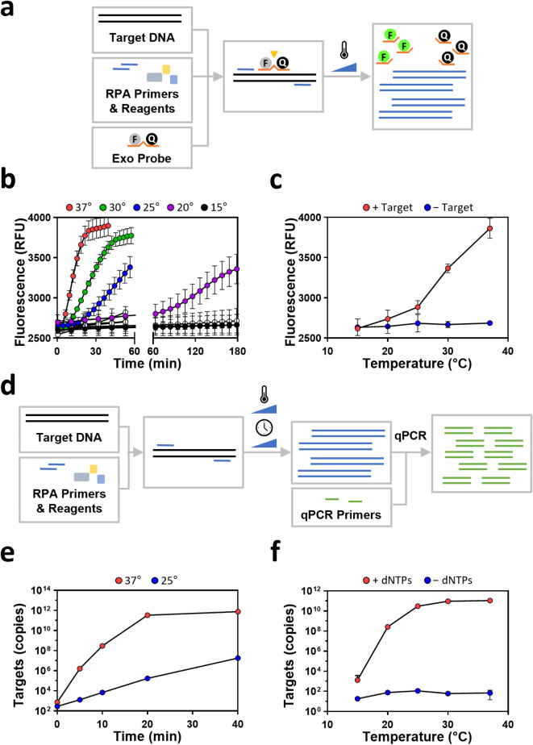
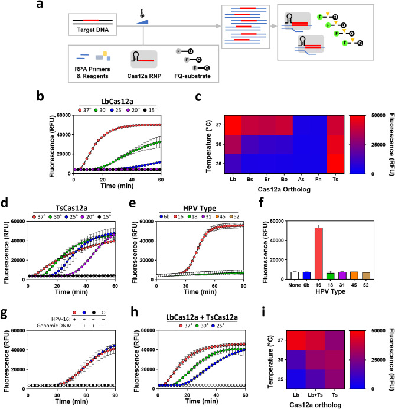
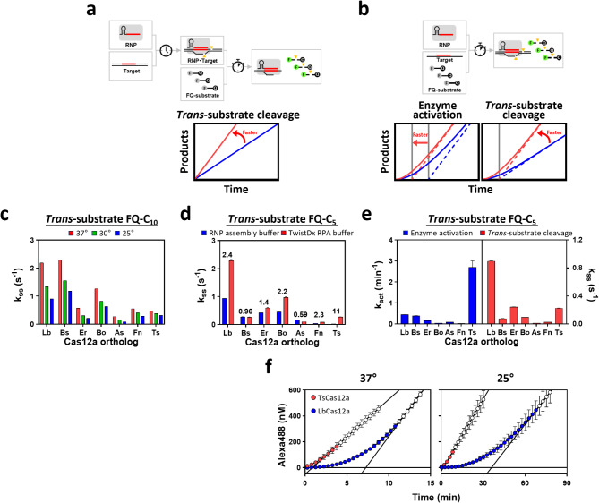
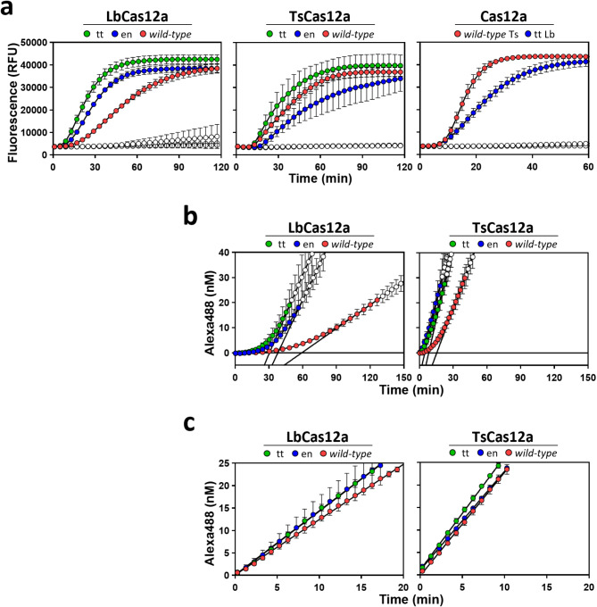
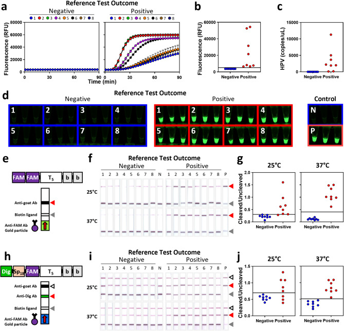

# Room temperature CRISPR diagnostics for low-resource settings

**Eric A. Nalefski, Selma Sinan, Jason L. Cantera, Anastasia G. Kim, Remy M. Kooistra, Rafael E. Rivera, Jordyn P. Janshen, Sanchita Bhadra, Joshua D. Bishop, Andrew D. Ellington, Ilya J. Finkelstein, and Damian Madan**

*Scientific Reports*, Volume 15, Issue 1, Pages 3909 (2025)

**DOI:** [10.1038/s41598-025-86373-5](https://doi.org/10.1038/s41598-025-86373-5)

---

## Table of Contents

- [Abstract](#abstract)
- [Introduction](#introduction)
- [Materials and Methods](#materials-and-methods)
- [Results](#results)
- [Discussion](#discussion)
- [References](#references)

---

## Abstract

Maintaining elevated reaction temperatures and multi-step sample preparations increases the costs and complexity of diagnostics, impeding their deployment in low-resource settings. Here, we develop a one-pot, room temperature recombinase polymerase amplification (RPA)-CRISPR reaction that removes these critical challenges. We show that RPA amplification is reduced by several orders of magnitude at 25 °C as compared to 37 °C. Similarly, when coupled to RPA, the performance of multiple Cas12a orthologs, including the widely used LbCas12a, is severely compromised at temperatures below 37 °C. To mitigate these limitations, we identify the ortholog TsCas12a as a highly active nuclease at 25 °C and develop a single-protocol RPA-Cas12a detection reaction with this enzyme. A quantitative kinetic analysis reveals that fast nuclease activation is more critical than higher steady-state _trans_-cleavage activity for room temperature diagnostic applications. RPA-TsCas12a reactions performed at 25 °C effectively detected HPV-16 in crudely prepared cervical swab samples with high sensitivity and specificity using both optical and lateral flow readouts. The reactions developed herein reduce the complexity and equipment requirements for affordable diagnostics in low- and middle-income countries.

**Subject terms:** Hydrolases, Lab-on-a-chip, Laboratory techniques and procedures

---

## Introduction

Resource constraints often limit the deployment of medical diagnostics in low- and middle-income countries (LMIC). To address this challenge, the World Health Organization has highlighted the need for diagnostic platforms that adhere to the ASSURED criteria: Affordable, sensitive, specific, user-friendly, rapid and robust, equipment-free, and deliverable to end users[1],[2]. PCR-based diagnostics, while highly sensitive and specific, fail to meet these criteria due to their reliance on sophisticated thermal cycling equipment.

Isothermal nucleic acid amplification technologies (IATs) provide a promising alternative by amplifying targets at constant temperatures[3],[4]. When optimal temperatures and conditions are used, IATs massively amplify target sequences such that even samples with low target abundance can reliably produce signal levels that exceed detection thresholds for affordable and user-friendly approaches such as turbidity measurements, visual readouts on lateral flow assays, intercalating dyes, and activation of fluorescently labeled probes[3],[4]. However, while the equipment and energy usage costs for IATs are more affordable than PCR, they can still be substantial, limiting their uptake[5],[6].

CRISPR-associated enzymes (Cas) such as Cas12a and Cas13a also provide high and specific isothermal signal amplification in diagnostic applications[7]–[10]. This is due to the ability of a target sequence to activate the multi-turnover _trans_-nuclease activity of the Cas/guide ribonucleoprotein (RNP)[7],[9]. However, pre-amplification is necessary in most diagnostic scenarios[8],[10],[11]. Coupling CRISPR detection with IATs, like recombinase polymerase amplification (RPA), is a proven strategy, which can be implemented in multistep workflows where each reaction operates under optimal conditions to maximize performance[8]. However, multistep approaches introduce challenges such as increased workflow complexity, longer time to result, and higher risk of contamination during sample handling.

One-pot RPA-CRISPR reactions, which combine amplification and detection into a single reaction, simplify workflows and reduce contamination risks[8]. These systems are a promising step toward meeting the ASSURED criteria. However, their reliance on elevated reaction temperatures still necessitates specialized equipment, limiting their accessibility and utility in resource-limited settings[8],[10].

Here, we establish conditions for room temperature IAT coupled with an optimized Cas detection scheme. Our one-pot RPA-Cas12a system detected attomolar levels of target sequences at a wide range of room temperatures, and, using simple and affordable lysis and detection methodologies, identified human papillomavirus (HPV)−16 in cervical swab samples with high sensitivity and specificity. These findings provide a proof of principle for an instrument-free platform that will enable development of affordable diagnostics for LMICs.

---

## Materials and Methods

### Reagents

Plasmids encoding HPV genomes (**Supplementary Table 1**) were used as templates for PCR and RPA reactions. DNA concentration was determined using Qubit dsDNA Quantification Assay kit (ThermoFisher Scientific, Waltham, MA). RPA primers, qPCR primers and probes, and Cas12a _trans_-substrates (**Supplementary Tables 2** and **3**) were purchased from Integrated DNA Technologies (IDT; Coralville, IA), and RPA exo probes were from LGC Biosearch Technologies (Petaluma, CA). Synthetic crRNAs (**Supplementary Table 3**) were purchased from Synthego (Redwood City, CA). Synthetic nucleic acids were quantified using absorbance spectroscopy based on manufacturer's specified extinction coefficients. EnGen® Lba Cas12a (cat. no. M0653S), purchased from New England Biolabs (Ipswich, MA), was used as a source of LbCas12a in experiments not involving orthologs (**Supplementary Methods**). Human genomic DNA (cat. no. G1521) was purchased from Promega (Madison, WI).

### RPA exonuclease assay

Two probes and 10 RPA primers (**Supplementary Table 2**) were designed according to guidelines for RPA assay development ([www.twistdx.co.uk](http://www.twistdx.co.uk)). Based on optimized primers and probe pairings (**Supplementary Methods**), exonuclease assays were performed using 0.42 μM each of forward and reverse primers, 0.12 μM probe, 0.45 μM dNTP mix, 14 mM magnesium acetate (MgOAc), 1× each of Probe E-mix, Core reaction mix, exonuclease III, and supplied reaction buffer on 10⁵ copies of HPV plasmid at varied temperatures to test the effect of temperature on RPA performance ([Fig. 1b, c](#fig1)). RPA reactions were monitored in real-time via fluorescent detection for FAM using a CFX96 Touch real-time PCR detection system (Bio-Rad, Hercules, CA).

***Figure 1.*** RPA inefficiently amplifies target below 37 °C. (**a**) Schematic of experiment monitoring RPA amplification efficiency using an exonuclease-sensitive probe. (**b**) RPA reaction progress across a range of temperatures was monitored using the exonuclease probe assay depicted in (**a**). Symbols represent mean (± SD) fluorescence signals of replicates (n = 3). Filled symbols indicate reactions conducted in the presence of target. Control reactions carried out in the absence of HPV-16 target (open symbols) are mostly obscured. (**c**) Fluorescence signals (mean ± SD) observed at 30 min from time course in (**b**) are displayed. (**d**) Schematic of experiment using qPCR on quenched RPA reactions to monitor RPA amplification efficiency. (**e**) RPA reaction progress at the indicated temperatures was monitored using the qPCR assay depicted in (**d**). Symbols represent mean (± SD) copies of replicates (n = 3). (**f**) RPA amplicon generation was quantified by qPCR for RPA reactions quenched after 30 min of incubation at the indicated temperatures. Reactions conducted in the absence of dNTPs reflect input target concentrations. Symbols represent mean (± SD) copies of replicates (n = 3).

### Quantifying efficiency of amplicon production by RPA

Time and temperature dependence of RPA amplicon generation ([Fig. 1e](#fig1)) was tested at 25 and 37 °C using 2 × 10⁴ copies of HPV-16 plasmid in triplicate 15.0 μL reactions. At varied time points, 2.0 μL aliquots were removed and were terminated by tenfold dilution into 10 mM Tris–HCl, pH 7.5, 5.0 mM EDTA. Quenched reactions were diluted fivefold into water, and 5.0 μL of this was subjected to qPCR in triplicate using Applied Biosystems™ TaqMan™ Gene Expression Master Mix (ThermoFisher, cat. no. 4369016) with HPV-16 plasmid DNA serving as calibration standard.

RPA amplicon generation across temperatures ([Fig. 1f](#fig1)) was performed on 2 × 10⁴ copies of HPV-16 plasmid in the absence or presence of dNTPs in triplicate 15.0 μL reactions at temperatures ranging from 15–37 °C. After 30 min, reactions were terminated by rapid freezing, aliquots were pooled, diluted into tenfold water, and 5.0 μL of this subjected to qPCR in triplicate as described above.

### RNP assembly

Cas12a (300 nM) was reacted with crRNA (150 nM) for 30 min at room temperature in Cas assembly buffer composed of 10 mM Tris–HCl, pH 7.5, 10 mM MgCl2, 1.0 mM 3,3′,3′′-phosphanetriyltripropanoic acid, 0.01% Igepal CA-630, 40 μg/mL bovine serum albumin. Immediately before use, RNP was diluted into the buffer specified for the assay below.

### One-pot RPA-Cas reaction

One-pot RPA-Cas reactions were optimized using TwistAmp Liquid Basic components combined with Cas12a detection in the same reaction (**Supplementary Methods**). The final 15.0 μL reaction consisted of 3.1 μL sample, 0.4 μM (each) forward and reverse RPA primer, 1.0 μM _trans_-substrate FQ-C5, 0.3 mM dNTPs, 24 mM MgOAc, 10 nM RNP, and 1X RPA components. Upon assembly of the reaction, reactions were immediately incubated at the specified temperature and monitored in real-time via fluorescent detection as described above for the RPA exonuclease assay.

RPA-Cas reactions were conducted with the varied Cas12a orthologs (**Supplementary Methods**) and Cas substrate FQ-C5 in the absence or presence of 10⁶ copies of HPV-16 plasmid ([Fig. 2b, d, h](#fig2), [Fig. 4a](#fig4), and **Supplementary Fig. 2**). Cross-reactivity with other HPV types ([Fig. 2e, f](#fig2)) was tested using RPA-TsCas12a reactions at 25 °C in the absence or presence of 10⁴ copies of plasmids encoding various HPV genomes. Interference by human genomic DNA was tested using RPA-TsCas12a reactions performed at 25 °C on 10⁴ copies of HPV-16 plasmid containing 3.0 ng human genomic DNA ([Fig. 2g](#fig2)).

***Figure 2.*** Wild-type TsCas12a performs optimally in RPA reactions across a broad temperature window. (**a**) Schematic of one-pot RPA-Cas12a reaction. (**b**) RPA-Cas12a reactions were conducted with LbCas12a at varied temperatures. Symbols represent mean (± SD) fluorescence values for replicates (n = 3) in the absence (open symbols) or presence (filled symbols) of HPV-16 plasmid. Control reactions carried out in the absence of target are obscured. (**c**) RPA-Cas12a reactions were conducted with different Cas12a orthologs at varied temperatures in the absence or presence of HPV-16 plasmid, and fluorescence signals were recorded (**Supplementary Fig. 2**). Heat-map represents average values observed at 60 min in response to target. (**d**) RPA-Cas12a reactions were conducted with TsCas12a as in (**b**). (**e, f**) RPA-Cas reactions were conducted with TsCas12a at 25 °C in the absence (open symbols) or presence (filled symbols) of plasmids encoding genomes of various HPV types. Symbols (**e**) represent mean (± SD) fluorescence values of replicates (n = 3), with bars (**f**) representing those recorded at 60 min. (**g**) RPA-Cas reactions were conducted with TsCas12a at 25 °C in the absence or presence of 3.0 ng of human genomic DNA and HPV-16 plasmid. Symbols represent mean (± SD) fluorescence values of replicates (n = 3). (**h**) RPA-Cas12a reactions were conducted with a 1:1 mixture of Lb and TsCas12a as in (**b**). (**i**) Heat-map represents average values observed at 30 min for RPA-Cas reactions using Lb and TsCas12a, alone or combined, in response to target from panels (**b**), (**d**), and (**h**).

RPA-Cas assay performance was assessed on one-pot reactions conducted with Cas substrate FQ-C5 and Cas12a orthologs at the indicated temperatures with varying amounts of HPV-16 plasmid (**Supplementary Fig. 4a-g**). Analytical limits of detection (LODs) and 95% confidence intervals were calculated at each time point based on four-parameter logistic fit of raw fluorescence values (**Supplementary Fig. 4h, j**). Figure of merit (FOM) was calculated as LOD × time (**Supplementary Fig. 4i, k**).

### Activation and steady-state time courses

The time course for steady-state _trans_-substrate cleavage was measured by reacting temperature-equilibrated RNP, pre-activated by incubation with synthetic target for various times, with _trans_-substrate ([Fig. 3a](#fig3)). Time t = 0 represents the time at which RNP-target complexes were mixed with _trans_-substrate. The time course for appearance of _trans_-substrate cleavage activity was measured by reacting temperature-equilibrated RNP with a mixture of synthetic target and _trans_-substrate ([Fig. 3b](#fig3)). Time t = 0 represents the time at which RNP was mixed with target and _trans_-substrate. The synthetic target, representing the amplicon produced by RPA, was generated as described in **Supplementary Methods**. Control reactions for background correction were carried out in parallel reactions lacking target. Fluorescence was recorded on a BioTeK Synergy H1 fluorescence plate reader using λex 490 nm and λem 525 nm or in the FAM channel as described for the RPA exonuclease assay. Fluorescence values were converted to molarity of reporter Alexa488 by interpolating values on a standard curve generated from Cas12a-digested _trans_-substrates as described[12]. Rate constants were determined by curve-fitting on GraphPad Prism (v.10) with constants represented as values (± SE). See **Supplementary Methods** for further details.

***Figure 3.*** Faster target activation accounts for better performance of Ts in RPA-Cas reaction at 25 °C. (**a**) Schematic of assay measuring steady-state cleavage of _trans_-substrate by RNPs pre-activated with target. At t = 0, RNPs pre-activated with target are reacted with _trans_-substrate, and the resulting linear accumulation of product enables determination of steady-state _trans_-substrate cleavage rates. (Bottom) Schematic time courses for two RNPs showing that increase in steady-state rate of _trans_-substrate cleavage increases rate of product accumulation. (**b**) Schematic of assay measuring the time course of target-activated _trans_-substrate cleavage by RNPs. At t = 0, RNPs are reacted with a mixture of activating target and _trans_-substrate, and the resulting accumulation of product enables determination of rates for both enzyme activation and steady-state _trans_-substrate cleavage. (Bottom) Schematic time courses for two RNPs (solid red and blue lines) under differing scenarios: (left) identical steady-state rates of _trans_-substrate cleavage but differing activation rates; (right) identical activation rates but differing steady-state rates of _trans_-substrate cleavage. The lag phase represents the target-induced activation of RNP nuclease enabling _cis_- and _trans_-cleavage, and the subsequent linear phase represents steady-state cleavage of _trans_-substrate by the activated RNP-target complex. Dashed lines indicate steady state for cleavage of _trans_-substrate, whose slopes provide rates of cleavage (kss), and when back extrapolated intersect the x-axis at the activation time (1/kact), indicated by vertical grey lines. Increases in rates of either enzyme activation (left) or steady-state _trans_-substrate cleavage (right) increase rates of product accumulation. (**c**) Steady-state cleavage of _trans_-substrate FQ-C10 by RNPs pre-reacted with activating target was conducted at varied temperatures, as depicted in (**a**), in RNP assembly buffer. Bars represent mean (± SE) steady-state turnover (kss) of _trans_-substrate calculated from slopes of time courses (**Supplementary Fig. 3a**) normalized to the concentration of activating target serving as a proxy for activated enzyme. Error bars are too small to be visible. (**d**) Steady-state cleavage of _trans_-substrate FQ-C5 by RNPs pre-reacted with target was conducted at 37 °C, as depicted in (**a**), in RNP assembly buffer or Mg²⁺-supplemented RPA buffer from the TwistDx kit. Bars represent mean (± SE) steady-state turnover (kss) of _trans_-substrate calculated from slopes of time courses (**Supplementary Fig. 3b**) normalized to the concentration of activating target. In some cases, error bars are too small to be visible. The ratio of rates measured in RPA buffer to RNP assembly buffer is indicated above the bars. (**e**) Parameters for target-induced activation of _trans_-substrate cleavage conducted under the activation scheme depicted in (**b**). Solutions containing Cas12a ortholog RNPs were reacted with a mixture of activating target and _trans_-substrate FQ-C5 at 37 °C in Mg²⁺-supplemented RPA buffer from the TwistDx kit. Bars represent mean (± SE) rate of _trans_-nuclease activation (kact) or steady-state turnover (kss) of _trans_-substrate calculated from time courses (**Supplementary Fig. 3c**). In some cases, error bars are too small to be visible. (**f**) Time courses for target-induced activation of _trans_-substrate cleavage conducted under the activation scheme depicted in (**b**). Reactions containing _wild-type_ Ts and LbCas12a and _trans_-substrate FQ-C5 were performed at 37 °C or 25 °C in Mg²⁺-supplemented RPA buffer from the TwistDx kit, using an activating target. Symbols represent mean (± SD) reporter values for replicates (n = 3) after subtraction of signals recorded in the absence of target. Open symbols represent data in the linear range. Solid diagonal lines represent linear fitting of steady-state phase used to calculate activation parameters (**Supplementary Fig. 5a**).

***Figure 4.*** Enzyme engineering does not improve performance of RPA-Cas reactions. (**a**) RPA-Cas12a reactions were conducted with the indicated _wild-type_ or variant LbCas12a or TsCas12a at 25 °C. Symbols represent mean (± SD) fluorescence values for replicates (n = 3) in the absence (open symbols) or presence (filled symbols) of HPV-16 plasmid. A direct comparison between ttLbCas12a and _wild-type_ TsCas12a was performed at 25 °C (right). (**b**) Time courses for target-induced activation of _trans_-substrate FQ-C5 cleavage conducted under the activation scheme depicted in [Fig. 3b](#fig3) were performed with _wild-type_ or variant forms of LbCas12a or TsCas12a at 25 °C in buffer intended to mimic commercial RPA buffer but lacking primers, dNTPs and RPA enzymes. Symbols represent mean (± SD) reporter values for replicates (n = 3) after subtraction of signals recorded in the absence of target. Open symbols represent data in the linear range. Solid diagonal lines represent linear fitting to calculate activation parameters (**Supplementary Fig. 5c**). (**c**) Steady-state cleavage of _trans_-substrate by pre-activated RNPs as depicted by [Fig. 3a](#fig3). Reactions containing _wild-type_ or variant forms of LbCas12a or TsCas12a, pre-reacted with target, were conducted at 25 °C with _trans_-substrate FQ-C5 in same buffer as in (**b**). Symbols represent mean (± SD) reporter values for replicates (n = 3) after subtraction of signals recorded in the absence of target. Solid lines represent linear fitting to calculate substrate turnover (**Supplementary Fig. 5c**).

### Specimen collection and analysis

Cervical samples were collected at the Instituto Nacional de Enfermedades Neoplásicas (INEN), Lima, Peru and Surquillo Health Center, Lima, Peru. The study was approved by the Comité Revisor de Protocolos del Departamento de Investigación del INEN. All research was performed in accordance with relevant guidelines/regulations and in accordance with the Declaration of Helsinki. After written, informed consent was given, two cervical samples were collected during physician pelvic examination using PurFlock swab (Puritan Medical Products, Guilford, ME). One swab from each participant was sent for reference testing using Cobas (Roche) following the manufacturer's recommended handling protocol, enabling classification of HPV-16 positivity status. The other swab was swirled in 7.5 mL of solution containing 10 mM Tris–HCl, pH 8.0, and 1 mM EDTA and stored at −80 °C until further use. Samples were thawed on ice and 100 µL aliquots were heated to 95 °C for 10 min and used without further processing. 1.0 µL of samples were diluted fivefold into water and subjected to qPCR ([Fig. 5c](#fig5)) in triplicate as described above. 3.1 µL of samples was incubated in RPA-TsCas12a reactions containing fluorescent FQ-C5 ([Fig. 5a](#fig5)) or LFA Cas substrates (**Supplementary Table 3**) FAM2-T5-Biotin2 and Dig-Sp18-FAM-T5-Biotin2 ([Fig. 5f, i](#fig5)). 1.0 µL of RPA-Cas reactions were diluted into 100 µL of LFA buffers in wells of microtiter plates. LFA strips, Milenia HybriDetect two-line and three-line 2T strips (cat. no. MGDS and MGDS2A), were dipped into the wells and run until all liquid had entered the strips, upon which strips were photographed. Analysis of photographs was performed as described in the **Supplementary Methods** to obtain intensities of lines corresponding to uncleaved and cleaved substrate, from which ratios were calculated ([Fig. 5g, j](#fig5)). Thresholds were obtained by performing ROC analysis (**Supplementary Fig. 6**) and selecting the lowest threshold that yielded 100% specificity, from which sensitivity was reported.

***Figure 5.*** Detection of RPA-Cas reactions performed on crude cervical swab sample preparations. RPA-Cas reactions were performed on crude lysates from cervical swab samples collected from 16 participants, classified as positive or negative based on the outcome of reference testing. The reactions utilized TsCas12a and were analyzed using either fluorescent or lateral flow assay (LFA) substrates. (**a, b**) RPA-Cas reactions were conducted at 25 °C using Cas reporter FQ-C5. Symbols represent mean (± SD) fluorescence signal from replicates (n = 3) recorded continuously (**a**) or after 30 min (**b**). Solid horizontal line in (**b**) represents assay threshold yielding 100% specificity and sensitivity. (**c**) Measured copies of HPV in crude lysates of cervical swab samples from 16 participants, as determined by qPCR. (**d**) Reaction tubes from RPA-Cas reactions performed in (**a**) were monitored after 90 min by trans-illumination. Controls include reactions on 0 (N) and 10⁷ (P) copies of HPV-16 plasmid. (**e**) Schematic of Cas reporter FAM2-T5-Biotin2 and two-line LFA strips used to analyze RPA-Cas reactions. Red arrowhead indicates test line on which cleaved substrate is captured. Grey arrowheads indicate depletion line on which uncleaved substrate is captured via the biotin ("b") moiety. Products appearing on lines are detected with anti-FAM Ab-conjugated gold nanoparticles. Arrow indicates direction of flow. (**f**) RPA-Cas reactions were performed on crude cervical swab samples at 25 and 37 °C using LFA Cas reporter FAM2-T5-Biotin2. After 60 min, reactions were terminated by quick freezing, and aliquots were applied to two-line LFA strips. Red arrowheads indicate test line detecting cleaved substrate. Grey arrowheads indicate line detecting uncleaved substrate. (**g**) Densitometric analysis of captured and uncaptured material from strips presented in (**f**), where symbols represent the ratio of cleaved to uncleaved signals. Solid horizontal lines indicate the lowest threshold yielding 100% specificity based on ROC analysis (**Supplementary Fig. 6a**), yielding 87.5% (25 °C) or 100% (37 °C) sensitivity. (**h**) Schematic of Cas reporter Dig-Sp18-FAM-T5-Biotin2 and three-line LFA strips used to analyze RPA-Cas reactions. Red arrowhead indicates test line on which cleaved substrate is captured via the digoxigenin ("Dig") moiety. Grey arrowheads indicate depletion line on which uncleaved substrate is captured via biotin. Products appearing on lines are detected with anti-FAM Ab-conjugated gold nanoparticles. Open arrowhead indicates detection of unbound nanoparticles, serving as flow control. Arrow indicates direction of flow. (**i**) RPA-Cas reactions were performed on crude cervical swab samples at 25 and 37 °C using LFA Cas reporter Dig-Sp18-FAM-T5-Biotin2. After 60 min, reactions were terminated by quick freezing, and aliquots were applied to three-line LFA strips. Red arrowheads indicate test line detecting cleaved substrate. Grey arrowheads indicate line detecting uncleaved substrate. Open arrowheads indicate detection of flow control. (**j**) Densitometric analysis of captured and uncaptured material from strips presented in (**i**), where symbol represents the ratio of cleaved to uncleaved signals. Solid horizontal lines indicate the lowest threshold yielding 100% specificity based on ROC analysis (**Supplementary Fig. 6b**), yielding 62.5% (25 °C) or 100% (37 °C) sensitivity.

---

## Results

### Effect of suboptimal temperature on RPA performance

We first sought to assess the effects of ambient reaction temperatures on RPA efficiency. We targeted a sequence within HPV-16, the virus type responsible for more than half of all cervical cancers, a disease that predominantly affects LMIC[13]. RPA reactions were carried out at varying temperatures, and reaction progress was monitored using an exonuclease-sensitive probe that increases fluorescence intensity as the target is amplified ([Fig. 1a](#fig1)), a signal-generation approach commonly used for stand-alone RPA platforms[14]. We observed strong signal at 37 °C, but the time to initial signal appearance and the rate of signal increase over time were progressively impaired as reaction temperature was decreased ([Fig. 1b, c](#fig1)). Quantitative PCR (qPCR) measurements of amplicon copy number in quenched RPA reactions confirmed that the speed and efficiency of amplicon generation decreased considerably at reduced temperatures ([Fig. 1e, f](#fig1)).

### Effect of suboptimal temperature on RPA coupled to Cas12a-mediated signal generation

We next determined whether coupling RPA to Cas12a-mediated signal generation could recover signal ([Fig. 2a](#fig2)). We used the Cas12a ortholog _Lachnospiraceae bacterium_ (LbCas12a), which is commonly used in diagnostic assays, and a reporter substrate molecule composed of AlexaFluor488 and a fluorescence quencher separated by five cytosine residues[7], which showed superior performance to a longer one (**Supplementary Fig. 1a**). After optimization of one-pot RPA-LbCas12a reactions (**Supplementary Fig. 1b-d**), robust signal generation was observed when reactions were incubated at 37 °C ([Fig. 2b](#fig2)). However, lowering the temperature to 30 °C and below again delayed the initiation of signal generation and decreased rates of signal accumulation.

We hypothesized that alternative Cas12a orthologs might outperform LbCas12a in one-pot RPA-Cas12a reactions at lower temperatures. We assessed six Cas12a orthologs that were previously reported to show _trans_-nuclease activity[15]: _Butyrivibrio sp._ NC3005 (BsCas12a), _Bacteroidetes oral_ taxon 274 (BoCas12a), _Eubacterium rectale_ (ErCas12a), _Francisella novicida_ U112 (FnCas12a), _Thiomicrospira sp._ XS5 (TsCas12a) and _Acidaminococcus sp._ BV3L6 (AsCas12a). All but TsCas12a failed to function or offered no benefit over LbCas12a in one-pot RPA-Cas12a reactions at the assessed temperatures ([Fig. 2c](#fig2)). Remarkably, TsCas12a exhibited high efficiency from 20 °C to 37 °C, characterized by reduced latency of activation and faster accumulation of signal ([Fig. 2d](#fig2)). The limits of detection (LOD) for this enzyme ranged from 740 (20 °C) to 65 (37 °C) copies per reaction (7.2–82 aM) after 60 min (Table 1). In contrast, LbCas12a exhibited LODs of 2,300 and 144 copies per reaction at 25 °C and 37 °C, respectively, after 60 min.

**Table 1.** Analytical limits of detection (LOD) for RPA-Cas reactions.

| Cas12a | Temperature (°C) | LOD (copies)ᵃ 30 min | LOD (copies)ᵃ 60 min | Figure |
|---|---|---|---|---|
| Lb | 20 | > 1,000,000ᵇ | > 1,000,000ᵇ | 2b |
| | 25 | > 340,000ᶜ | 2300 (± 400) | S4a, h |
| | 30 | 1400 (± 300) | 490 (± 80) | S4b, h |
| | 37 | 196 (± 5) | 144 (± 2) | S3c, h |
| Ts | 20 | > 150,000ᶜ | 740 (± 70) | S4d, j |
| | 25 | 290 (± 150) | 98 (± 7) | S4e, j |
| | 30 | 165 (± 14) | 184 (± 1) | S4f, j |
| | 37 | 89 (± 9) | 65 (± 1) | S4g, j |

ᵃLOD expressed as value (mean ± SD) obtained over 5 min windows at 30 and 60 min from data presented in the indicated figures.
ᵇLower-limit based on copies used in experiment where no signal was observed above background.
ᶜLower-limit reported from the earliest value obtained.

To assess the specificity of room-temperature RPA-TsCas12a, reactions targeting HPV-16 were tested for cross-reactivity against other HPV types. Signal with HPV-16, but not HPV types 6b, 18, 31, 45, and 52, was observed ([Fig. 2e, f](#fig2)). Adding up to 3 ng of human genomic DNA did not cause spurious activation (no false positives) in the absence of HPV-16 DNA ([Fig. 2g](#fig2)). Collectively, these findings suggest that RPA-TsCas12a is sensitive and specific, and that room temperature, one-pot RPA-TsCas12a reactions are suitable for further development as diagnostics.

### Enzyme combinations widen the effective temperature window

We hypothesized that a combination of TsCas12a and LbCas12a might improve performance across the temperature window. A cocktail of equal concentrations of the two enzymes resulted in better performance at 25 and 30 °C compared to LbCas12a alone and better performance at 37 °C compared to TsCas12a alone ([Fig. 2h, i](#fig2)). Although the combination exhibited reduced performance relative to both LbCas12a and TsCas12a alone at their respective temperature optima, 37 and 25 °C, this is likely due to suboptimal RNP concentrations when the enzymes were combined (**Supplementary Fig. 1d**). Specifically, the RNP concentrations for TsCas12a and LbCas12a were each set at 5 nM in the mixture, compared to 10 nM used in single-enzyme experiments. With further optimization of assay conditions, including fine-tuning the relative RNP concentrations, enzyme combinations have the potential to unlock even greater performance and versatility across diverse temperature conditions.

### Effect of temperature on enzyme activation and steady state _trans_ cleavage activity

We sought to better understand the relationship between kinetic properties of Cas12a and its performance in one-pot RPA-Cas reactions. Previously, we found that differences in Cas12a end-point signal measurements resulted from variations in steady-state, _trans_-nuclease turnover rates as well as from differences in rates of _trans_-nuclease activation[16], as illustrated in [Fig. 3a, b](#fig3). Using a similar approach, we first monitored steady-state _trans_-substrate cleavage by target-activated enzymes in RNP assembly buffer at various temperatures ([Fig. 3c](#fig3)). All enzymes were capable of cleaving _trans_-substrate FQ-C10 over 25–37 °C, and turnover rates varied between orthologs, decreasing, as expected, with temperature.

Next, we recorded cleavage of _trans_-substrate FQ-C5, the substrate used in the RPA-Cas reaction, by target-activated enzymes at 37 °C in RNP assembly buffer or commercial RPA buffer, but without any RPA amplification ([Fig. 3d](#fig3)). We expected that enzyme activity might differ in both buffers, as the RPA buffer contains high salt concentrations and crowding agents not present in the assembly buffer. All enzymes showed capacity to cleave _trans_-substrate in either buffer. For TsCas12a, _trans_-substrate turnover was enhanced by 11-fold in RPA buffer, an enhancement greater than that for all other orthologs (0.59–2.4-fold). Notably, the five enzymes (Lb, Bs, Er, Bo, and TsCas12a) that functioned well in one-pot RPA-Cas12a reactions at 37 °C (see [Fig. 2c](#fig2)) displayed the highest rates of target-activated cleavage of FQ-C5 in RPA buffer, indicating that performance in the RPA-Cas reactions requires a relatively high turnover of the _trans_-substrate.

We then recorded the time course for activation of the RNP nuclease by target using _trans_-substrate FQ-C5 at 37 °C in the commercial RPA buffer ([Fig. 3e](#fig3)). Again, Lb, Bs, Er, Bo, and TsCas12a displayed the highest steady-state rates of _trans_-substrate cleavage. Unexpectedly, TsCas12a was activated at a rate (2.7 min⁻¹) 6.0-fold faster than the rate for LbCas12a (0.45 min⁻¹), despite turning over _trans_-substrate at a 4.0-fold lower rate. Together, these results show that effectiveness of Cas12a in one-pot RPA reactions, as in other assays, depends on both rates of enzyme activation and steady-state turnover of _trans_-substrate, which are influenced by components of the RPA buffer.

Next, we investigated the mechanism underlying the superior performance of TsCas12a in the one-pot RPA-Cas reaction at reduced temperature under assay conditions employed in the reaction. Comparable to before, at 37 °C activation of TsCas12a by target was nearly 10-times faster than that of LbCas12a, but steady-state _trans_-nuclease activity was roughly 50% slower ([Fig. 3f](#fig3) and **Supplementary Fig. 5a**). When reactions were carried out at 25 °C, reaction rates slowed as expected, but TsCas12a was again activated considerably faster than LbCas12a, and the steady-state turnover rate was slightly higher. Dissection of the reaction buffer suggested that polyethylene glycol (PEG) and potassium acetate, two buffer additives that enhance RPA, also accelerate Cas12a kinetic properties in these reactions (**Supplementary Fig. 5b**).

### Enzyme engineering does not improve performance

Structure-guided protein engineering was reported to improve gene editing efficiencies of AsCas12a and LbCas12a at room temperatures, with enLbCas12a (D156R/G532R/K538R) and ttLbCas12a (D156R) exhibiting the best performance[17],[18]. We hypothesized that the same substitutions would improve the detection capabilities in our assays. In one-pot RPA-Cas12a reactions at 25 °C, enLbCas12a outperformed its _wild-type_ counterpart, and ttLbCas12a outperformed enLbCas12a ([Fig. 4a](#fig4)). We also tested TsCas12a(E177R) and TsCas12a(E177R/S574R/K580R), termed enTsCas12a and ttTsCas12a, respectively. However, these mutations did not improve TsCas12a performance at low temperatures. The tripartite substitutions in enTsCas12a delayed signal acquisition relative to _wild-type_ TsCas12a, while the single mutation in ttCas12a mirrored, within error, the responsiveness of _wild-type_ TsCas12a. The best LbCas12a-derived enzyme (ttLbCas12a) did not perform as well as _wild-type_ TsCas12a, generating a shallower signal response with time despite providing a similar time to respond.

As before, we investigated activation time courses of the substitution variants to determine whether and which kinetic properties were altered. For both TsCas12a and LbCas12a, the single or triple substitutions increased the rate of _trans_-nuclease activation, but only minimally affected steady-state _trans_-nuclease cleavage rates ([Fig. 4b, c](#fig4) and **Supplementary Fig. 5c**). Single mutants behaved similarly to triple mutants, consistent with the observation that the E174R substitution in AsCas12a is responsible for the majority of the improvements for gene editing at lower temperatures[17].

### Monitoring crude clinical samples

Next, we conducted an analysis on cervical swab samples comprising an equal number of HPV-16 positive and HPV-16 negative specimens, as determined by clinical reference testing. Sample preparation was intentionally limited to just one step: boiling for 10 min. The minimally processed samples were subjected to RPA-TsCas12a reactions at 25 °C. Within 30 min, a strong fluorescence signal was present in all HPV-16 positive samples, differentiating them clearly from negative samples ([Fig. 5a, b](#fig5)). This result is noteworthy given the broad range of HPV-16 DNA concentrations present in the positive samples, with amounts registering as low as 120 copies/μL ([Fig. 5c](#fig5)). Expanding our approach to detect signal using UV-light transillumination as a fluorescence excitation source, we again distinguished HPV-16 positive samples from negatives with 100% sensitivity and 100% specificity ([Fig. 5d](#fig5)).

Next, we analyzed reactions on lateral flow strips using LFA _trans_-substrates consisting of reporter and capture moieties separated by polythymidine, which was substituted for polycytosine to increase synthetic yields. For a substrate designed for use on two-line Milenia HD strips, seven out of eight positive samples gave test line intensities greater than those for negative sample reactions performed at 25 °C ([Fig. 5e-g](#fig5)), an assay sensitivity of 87.5%, based on thresholds chosen to yield 100% specificity (**Supplementary Fig. 6a**). The presence of some background signal on the test line of the no target control as well as all HPV-16 negative patient samples suggests that the streptavidin line imperfectly captures all uncleaved substrate or the Cas substrate preparation contains impurities mimicking cleaved substrates. Finally, we designed a _trans_-substrate for use on three-line Milenia HD 2T strips, where the third line provides an important flow control. From reactions performed at 25 °C, five of eight positive samples gave significant signals above background ([Fig. 5h-j](#fig5)), an assay sensitivity of 62.5%, based on thresholds chosen to yield 100% specificity (**Supplementary Fig. 6b**), despite there being even greater test line reactivity in negative controls for these strips. These results show that RPA-TsCas12a is able to distinguish between positive and negative samples, and that further LFA optimization will yield even greater sensitivity.

---

## Discussion

Here, we demonstrate a room temperature RPA-TsCas12a system with excellent sensitivity and specificity when applied to real-world samples. Notably, we conducted minimal sample preparation, requiring only ten minutes at 100 °C. While this step does require energy input, water functions as a phase-change material at this temperature allowing for a range of unsophisticated energy input solutions. Lysis without external energy inputs may also be feasible and will be the subject of further study.

### Kinetic factors governing diagnostic performance

Surprisingly, the superior performance of TsCas12a at ambient temperatures is primarily due to rapid activation of its _trans_-nuclease. At these temperatures, even the low concentration of RPA-generated amplicons activates sufficient TsCas12a to produce signal in reasonable diagnostic timeframes. As the temperature is raised, both enzyme activation and steady-state cleavage rates increase for both TsCas12a and LbCas12a. The performances of these reactions eventually converge both because the differences in kinetic properties of TsCas12a and LbCas12a become less drastic and because RPA amplification efficiency increases by orders of magnitude. Nevertheless, across all temperatures tested (up to 37 °C), TsCas12a outperforms LbCas12a, achieving lower LODs in shorter times, as demonstrated by its superior figure of merit (FOM) (**Supplementary Fig. 4i, k**).

The combined use of LbCas12a and TsCas12a expands the temperature range for RPA-Cas reactions. Rapid initial activation by TsCas12a compensates for slower activation by LbCas12a at lower temperatures, while efficient cleavage by LbCas12a offsets slower cleavage by TsCas12a at higher temperatures. Together, these results illustrate that signal generation in one-pot RPA-Cas12a reactions is affected by a complex relationship between target amplification efficiency, _trans_-nuclease activation, and steady-state _trans_-nuclease rate[19].

The ability of TsCas12a to activate rapidly may be tied to its evolutionary origins. Its faster activation kinetics may arise from higher rates of PAM-assisted binding of RNP to the activating target or the ensuing conformational changes in the enzyme associated with R-loop formation and _cis_-cleavage of the target[16]. The faster activation kinetics of TsCas12a at lower temperatures and its greater tolerance to crowding agents and salt concentrations of the RPA buffer may be consonant with it being derived from a bacterium found in a brine-sea water interface at ~22 °C[20],[21]. We speculate that kinetic properties of the enzyme may reflect adaptations enabling it to perform immune surveillance in the presence of the high concentrations of salt or osmotic compatible solutes within bacterial cells growing in high salinity environments[22]. In contrast, the slower kinetics of LbCas12a at lower temperatures may simply reflect its adaptation for fast activation in bacteria at the higher temperatures and lower salt conditions of mammalian digestive tracts in which they reside.

Our kinetic analyses suggest that the sensitivity of one-pot RPA-Cas12a reactions is predominantly influenced by the _cis_-cleavage rates of Cas12a. Rapid _cis_-cleavage, as seen in RNPs with canonical protospacer adjacent motifs (PAMs), often underperforms due to premature degradation of target molecules[19]. Conversely, RNPs with slow _cis_-cleavage rates exhibit poor overall reaction performance. Optimal sensitivity is achieved with RNPs that strike a balance, exhibiting intermediate target cleavage rates. In this context, wild-type TsCas12a demonstrates an ideal balance of activation and cleavage kinetics. At 25 °C, TsCas12a activates more rapidly than all tested LbCas12a variants, enabling it to outperform these alternatives in one-pot reactions. Interestingly, engineered TsCas12a variants with modifications designed to further accelerate target recognition and cleavage (e.g., "en" and "tt" substitutions) do not enhance performance and may even reduce efficiency. This likely occurs due to premature degradation of amplicons, disrupting the early stages of amplification.

### Diagnostic performance and practical implications

The one-pot RPA-wild-type TsCas12a reaction displays an impressive LOD of 98 copies/15 μL reaction (11 aM) at 60 min, resulting in a FOM corresponding to 650 aM min, a value well within the range (72–3200 aM min) demonstrated for 23 other comparable reactions relying on fluorescence detection[23]. We expect performance would be improved with Cas12a modifications that increase the steady-state turnover rate while maintaining rapid _trans_-nuclease activation. Surveying additional Cas12a orthologs, especially from psychrophilic organisms, may also lead to enzymes possessing such properties.

Despite the achievement of high sensitivity across temperatures, there was a considerable influence of temperature on the temporal component of assay performance as evidenced by differences in FOM (**Supplementary Fig. 4i, k**). Specifically, decreasing temperature led to increasing delays in the time at which signals rose to achieve high sensitivity, mainly due to the progressive decrease in efficiency of amplicon generation by RPA at lower temperatures, rather than performance of TsCas12a. Thus, the greatest impact on improving overall assay performance, including overcoming the limitation imposed by delayed signal generation, could be achieved by increasing target amplification efficiency by RPA at lower temperatures. A practical solution for current applications is to recommend performing reactions at or above a specified temperature and allowing a minimum incubation period before reading results. This approach parallels practices in rapid antigen tests, where results are valid only after a specified incubation time, despite signals often appearing earlier.

### Fieldable diagnostics and lateral flow integration

The compatibility of RPA-TsCas12a with lateral flow addresses a long-standing issue for fieldable diagnostics. When RPA is performed at optimal temperatures, a huge amount of amplicon is generated, making these open assay structures subject to the risk of carry-over contamination, especially for reactions with extremely low analytical LODs. This risk is especially concerning in clinical settings where assays are often run in a limited number of dedicated spaces[24],[25]. Since high rates of false positivity are untenable for most clinical applications, commercial PCR and IAT platforms resort to integrated design features—such as enclosed housings—to address the issue. However, these features add to assay cost and complexity and limiting uptake, especially in LMIC[24],[26]. Using a nonoptimized IAT coupled to a Cas-based reporter system could provide a "Goldilocks" solution: The slight increase in target quantity provides sufficient Cas12a activation to produce detectable signals, while only modestly increasing the risk of carryover contamination in open assay formats. Risk of carry over contamination leading to false positivity in our RPA-TsCas12a system is also diminished by these reactions having analytical LODs in the tens to hundreds of copies per reaction, as opposed to single copy analytical LOD. Further optimization of LFA conditions, including substrate purity to limit background signals, will result in a highly sensitive, low-cost nucleic acid detection platform for diverse applications.

---

**Supplementary Information:** [Supplementary Information](https://pmc.ncbi.nlm.nih.gov/articles/instance/11785965/bin/41598_2025_86373_MOESM1_ESM.pdf) (1.9 MB, pdf).

**Author contributions:** Conceptualization, EAN, DM. Data collection, EAN, SS, JLC, AGK, RMK, RER, JPJ. Supervision, EAN, ADE, IJF, DM. Writing—original draft, EAN and DM. Writing—review and editing, all authors.

**Data availability:** The datasets used and/or analysed during the current study are available from the corresponding author on reasonable request.

---

*Archived from [PubMed Central (PMC11785965)](https://pmc.ncbi.nlm.nih.gov/articles/PMC11785965/) on 2025-07-19.*

---

## References

1. Land, K. J., Boeras, D. I., Chen, X.-S., Ramsay, A. R. & Peeling, R. W. REASSURED diagnostics to inform disease control strategies, strengthen health systems and improve patient outcomes. *Nat. Microbiol.* **4**, 46–54 (2019). [DOI: 10.1038/s41564-018-0295-3](https://doi.org/10.1038/s41564-018-0295-3)

2. Mabey, D., Peeling, R. W., Ustianowski, A. & Perkins, M. D. Diagnostics for the developing world. *Nat. Rev. Microbiol.* **2**, 231–240 (2004). [DOI: 10.1038/nrmicro841](https://doi.org/10.1038/nrmicro841)

3. Oliveira, B. B., Veigas, B. & Baptista, P. V. Isothermal amplification of nucleic acids: The race for the Next "Gold Standard". *Front. Sens.* **2**, 752600 (2021).

4. García-Bernalt Diego, J., Fernández-Soto, P. & Muro, A. The future of point-of-care nucleic acid amplification diagnostics after COVID-19: Time to walk the walk. *Int. J. Mol. Sci.* **23**, 14110 (2022). [DOI: 10.3390/ijms232214110](https://doi.org/10.3390/ijms232214110)

5. Cantera, J. L. et al. Assessment of eight nucleic acid amplification technologies for potential use to detect infectious agents in low-resource settings. *PLOS ONE* **14**, e0215756 (2019). [DOI: 10.1371/journal.pone.0215756](https://doi.org/10.1371/journal.pone.0215756)

6. LaBarre, P. et al. A simple, inexpensive device for nucleic acid amplification without electricity—toward instrument-free molecular diagnostics in low-resource settings. *PLoS ONE* **6**, e19738 (2011). [DOI: 10.1371/journal.pone.0019738](https://doi.org/10.1371/journal.pone.0019738)

7. Chen, J. S. et al. CRISPR-Cas12a target binding unleashes indiscriminate single-stranded DNase activity. *Science* **360**, 436–439 (2018). [DOI: 10.1126/science.aar6245](https://doi.org/10.1126/science.aar6245)

8. Ghouneimy, A., Mahas, A., Marsic, T., Aman, R. & Mahfouz, M. CRISPR-based diagnostics: Challenges and potential solutions toward point-of-care applications. *ACS Synth. Biol.* **12**, 1–16 (2023). [DOI: 10.1021/acssynbio.2c00496](https://doi.org/10.1021/acssynbio.2c00496)

9. Gootenberg, J. S. et al. Nucleic acid detection with CRISPR-Cas13a/C2c2. *Science* **356**, 438–442 (2017). [DOI: 10.1126/science.aam9321](https://doi.org/10.1126/science.aam9321)

10. Kaminski, M. M., Abudayyeh, O. O., Gootenberg, J. S., Zhang, F. & Collins, J. J. CRISPR-based diagnostics. *Nat. Biomed. Eng.* **5**, 643–656 (2021). [DOI: 10.1038/s41551-021-00760-7](https://doi.org/10.1038/s41551-021-00760-7)

11. Li, H. et al. Amplification-free CRISPR/Cas detection technology: Challenges, strategies, and perspectives. *Chem. Soc. Rev.* **52**, 361–382 (2023). [DOI: 10.1039/d2cs00594h](https://doi.org/10.1039/d2cs00594h)

12. Nalefski, E. A. et al. Kinetic analysis of Cas12a and Cas13a RNA-Guided nucleases for development of improved CRISPR-based diagnostics. *iScience* **24**, 102996 (2021). [DOI: 10.1016/j.isci.2021.102996](https://doi.org/10.1016/j.isci.2021.102996)

13. Smith, J. S. et al. Human papillomavirus type distribution in invasive cervical cancer and high-grade cervical lesions: A meta-analysis update. *Int. J. Cancer* **121**, 621–632 (2007). [DOI: 10.1002/ijc.22527](https://doi.org/10.1002/ijc.22527)

14. Daher, R. K., Stewart, G., Boissinot, M. & Bergeron, M. G. Recombinase polymerase amplification for diagnostic applications. *Clin. Chem.* **62**, 947–958 (2016). [DOI: 10.1373/clinchem.2015.245829](https://doi.org/10.1373/clinchem.2015.245829)

15. Nguyen, L. T. et al. Harnessing noncanonical crRNAs to improve functionality of Cas12a orthologs. *Cell Rep.* **43**, 113777 (2024). [DOI: 10.1016/j.celrep.2024.113777](https://doi.org/10.1016/j.celrep.2024.113777)

16. Nalefski, E. A. et al. Determinants of CRISPR Cas12a nuclease activation by DNA and RNA targets. *Nucl. Acid. Res.* **52**, 4502–4522 (2024). [DOI: 10.1093/nar/gkae152](https://doi.org/10.1093/nar/gkae152)

17. Kleinstiver, B. P. et al. Engineered CRISPR–Cas12a variants with increased activities and improved targeting ranges for gene, epigenetic and base editing. *Nat. Biotechnol.* **37**, 276–282 (2019). [DOI: 10.1038/s41587-018-0011-0](https://doi.org/10.1038/s41587-018-0011-0)

18. Schindele, P. & Puchta, H. Engineering CRISPR/*Lb*Cas12a for highly efficient, temperature-tolerant plant gene editing. *Plant. Biotechnol. J.* **18**, 1118–1120 (2020). [DOI: 10.1111/pbi.13275](https://doi.org/10.1111/pbi.13275)

19. Lu, S. et al. Fast and sensitive detection of SARS-CoV-2 RNA using suboptimal protospacer adjacent motifs for Cas12a. *Nat. Biomed. Eng.* **6**, 286–297 (2022). [DOI: 10.1038/s41551-022-00861-x](https://doi.org/10.1038/s41551-022-00861-x)

20. Zhang, G., Fauzi Haroon, M., Zhang, R., Hikmawan, T. & Stingl, U. Draft genome sequences of two *Thiomicrospira* strains isolated from the brine-seawater interface of Kebrit Deep in the Red Sea. *Genome Announc.* **4**, e00110-16 (2016). [DOI: 10.1128/genomeA.00110-16](https://doi.org/10.1128/genomeA.00110-16)

21. Eder, W., Jahnke, L. L., Schmidt, M. & Huber, R. Microbial diversity of the brine-seawater interface of the Kebrit Deep, Red Sea, studied via 16S rRNA gene sequences and cultivation methods. *Appl. Environ. Microbiol.* **67**, 3077–3085 (2001). [DOI: 10.1128/AEM.67.7.3077-3085.2001](https://doi.org/10.1128/AEM.67.7.3077-3085.2001)

22. Gunde-Cimerman, N., Plemenitaš, A. & Oren, A. Strategies of adaptation of microorganisms of the three domains of life to high salt concentrations. *FEMS Microbiol. Rev.* **42**, 353–375 (2018). [DOI: 10.1093/femsre/fuy009](https://doi.org/10.1093/femsre/fuy009)

23. Nouri, R., Dong, M., Politza, A. J. & Guan, W. Figure of merit for CRISPR-based nucleic acid-sensing systems: Improvement strategies and performance comparison. *ACS Sens.* **7**, 900–911 (2022). [DOI: 10.1021/acssensors.2c00024](https://doi.org/10.1021/acssensors.2c00024)

24. Aslanzadeh, J. Preventing PCR amplification carryover contamination in a clinical laboratory. *Ann. Clin. Lab. Sci.* **34**, 389–396 (2004).

25. Borst, A., Box, A. T. A. & Fluit, A. C. False-positive results and contamination in nucleic acid amplification assays: Suggestions for a prevent and destroy strategy. *Eur. J. Clin. Microbiol. Infect. Dis.* **23**, 289–299 (2004). [DOI: 10.1007/s10096-004-1100-1](https://doi.org/10.1007/s10096-004-1100-1)

26. Bissonnette, L. & Bergeron, M. G. Next revolution in the molecular theranostics of infectious diseases: Microfabricated systems for personalized medicine. *Expert. Rev. Mol. Diagn.* **6**, 433–450 (2006). [DOI: 10.1586/14737159.6.3.433](https://doi.org/10.1586/14737159.6.3.433)
