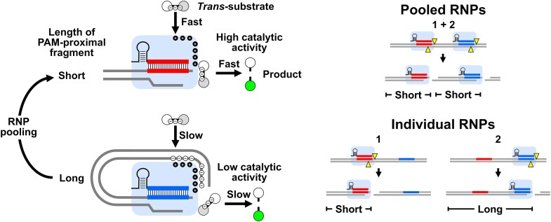
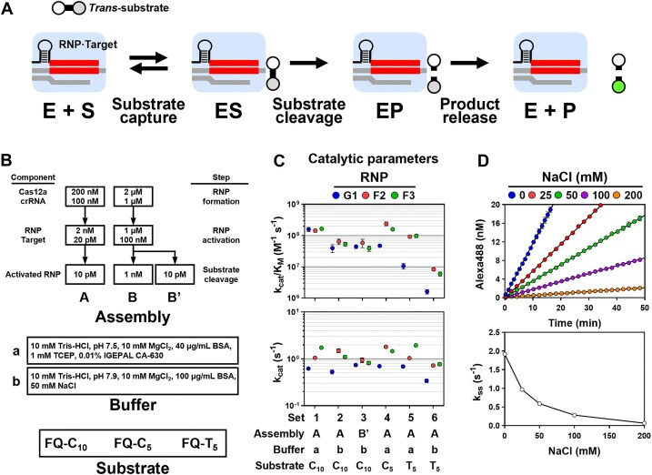
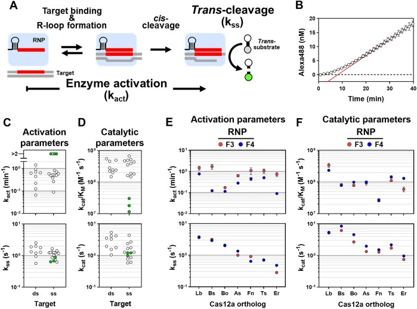
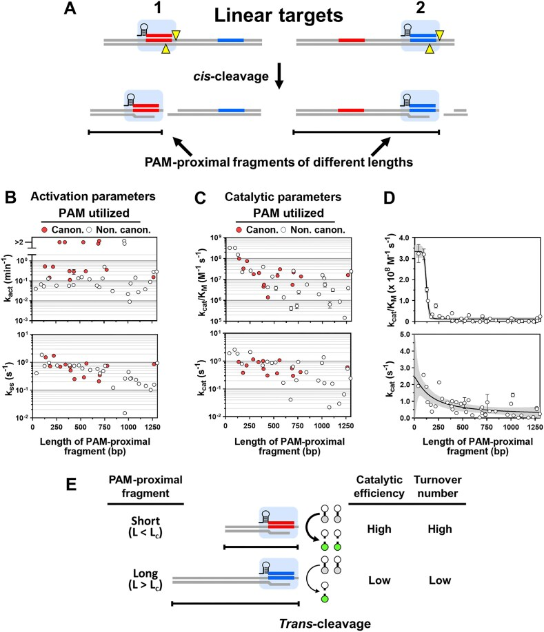
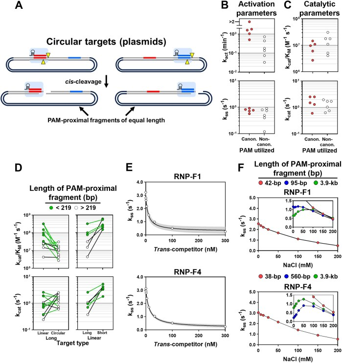
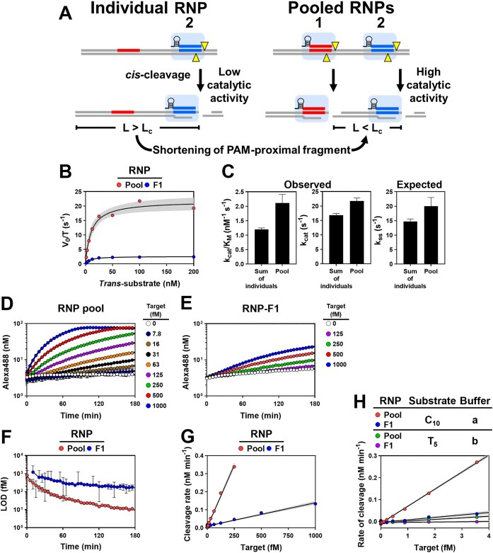
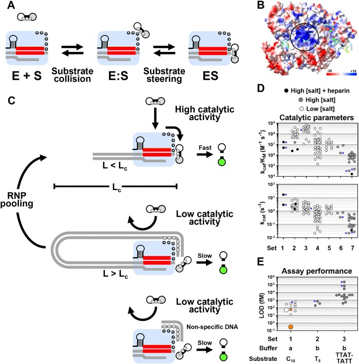

# Unleashing high *trans*-substrate cleavage kinetics of Cas12a for nucleic acid diagnostics

**Eric A. Nalefski, Samantha Hedley, Karunya Rajaraman, Remy M. Kooistra, Ishira Parikh, Selma Sinan, Ilya J. Finkelstein, and Damian Madan**

*Nucleic Acids Research*, Volume 53, Issue 14, gkaf712 (2025)

**DOI:** [10.1093/nar/gkaf712](https://doi.org/10.1093/nar/gkaf712)

---

## Table of Contents

- [Abstract](#abstract)
- [Graphical Abstract](#graphical-abstract)
- [Introduction](#introduction)
- [Materials and Methods](#materials-and-methods)
  - [Reagents](#reagents)
  - [Expression and purification of Cas12a orthologs](#expression-and-purification-of-cas12a-orthologs)
  - [RNP assembly and pre-activation](#rnp-assembly-and-pre-activation)
  - [Determination of activation parameters](#determination-of-activation-parameters)
  - [Determination of steady-state parameters](#determination-of-steady-state-parameters)
  - [Inhibition of *trans*-cleavage by increasing ionic strength and *trans*-competitors](#inhibition-of-trans-cleavage-by-increasing-ionic-strength-and-trans-competitors)
  - [Assessment of assay performance](#assessment-of-assay-performance)
  - [Quantification of *trans*-substrate cleavage products](#quantification-of-trans-substrate-cleavage-products)
  - [Statistics and modeling](#statistics-and-modeling)
- [Results](#results)
  - [Conditions that promote Cas12a high catalytic efficiency *trans*-substrate cleavage](#conditions-that-promote-cas12a-high-catalytic-efficiency-trans-substrate-cleavage)
  - [Increasing ionic strength impairs *trans*-cleavage activity](#increasing-ionic-strength-impairs-trans-cleavage-activity)
  - [High catalytic activity improves target detection sensitivity](#high-catalytic-activity-improves-target-detection-sensitivity)
  - [High catalytic efficiency and substrate turnover are generally observed for target-activated Cas12a](#high-catalytic-efficiency-and-substrate-turnover-are-generally-observed-for-target-activated-cas12a)
  - [Multiple Cas12a orthologs demonstrate high catalytic efficiency and substrate turnover](#multiple-cas12a-orthologs-demonstrate-high-catalytic-efficiency-and-substrate-turnover)
  - [Catalytic activity is attenuated by long PAM-proximal fragments](#catalytic-activity-is-attenuated-by-long-pam-proximal-fragments)
  - [Lengthening PAM-proximal fragments reduces catalytic activity](#lengthening-pam-proximal-fragments-reduces-catalytic-activity)
  - [Shortening PAM-proximal fragments increases catalytic activity](#shortening-pam-proximal-fragments-increases-catalytic-activity)
  - [Double-stranded DNA potently inhibits catalytic activity in *trans*](#double-stranded-dna-potently-inhibits-catalytic-activity-in-trans)
  - [Increasing ionic strength partially overcomes catalytic attenuation by long targets](#increasing-ionic-strength-partially-overcomes-catalytic-attenuation-by-long-targets)
  - [RNP pooling overcomes catalytic attenuation by long targets](#rnp-pooling-overcomes-catalytic-attenuation-by-long-targets)
- [Discussion](#discussion)
  - [Importance of electrostatics in *trans*-substrate cleavage](#importance-of-electrostatics-in-trans-substrate-cleavage)
  - [Implications for diagnostics](#implications-for-diagnostics)
  - [Implications for enzyme mechanism](#implications-for-enzyme-mechanism)
- [Conclusion](#conclusion)
- [Acknowledgements](#acknowledgements)
- [Funding](#funding)

---

## Abstract

CRISPR (clustered regularly interspaced short palindromic repeats)-based nucleic acid diagnostics enable rapid, sensitive pathogen detection. Cas12a is frequently used in these assays because target-activated *trans* cleavage of a reporter molecule generates an easily detectable signal. However, variable activity across assays suggests that the catalytic potential of Cas12a has been limited via unknown mechanisms. Here, we show that Cas12a *trans*-nuclease activity is auto-inhibited by long PAM-proximal DNA (>120 bp) following *cis*-cleavage of targets. Short targets (<100 bp), optimized *trans* cleavage substrates, and low salt buffers unleash high catalytic efficiency (≈10⁸ M⁻¹ s⁻¹) and turnover (≈1 s⁻¹) across Cas12a orthologs. Pooling multiple Cas12a ribonucleoproteins (RNPs) targeting clustered protospacers overcomes *cis*-cleavage auto-inhibition, further boosting sensitivity. Optimized CRISPR RNA pools enable sub-femtomolar sensitivity for target detection without any pre-amplification. This mechanistic insight and mitigation strategy broaden the application of CRISPR–Cas enzymes for nucleic acid diagnostics.

---

## Graphical Abstract

---

## Introduction

Bacterial and archaeal CRISPR (clustered regularly interspaced short palindromic repeats) systems provide adaptive immunity against invading genetic elements [1]. CRISPR-associated (Cas) nucleases, such as Cas12a, bind CRISPR RNA (crRNA) to form ribonucleoproteins (RNPs) that are activated by protospacer sequences of both double-stranded DNA (dsDNA), single-stranded DNA (ssDNA), and RNA targets that hybridize to 20-nt spacer sequences within the crRNA. This activation leads to single-turnover cleavage, in *cis*, of specific targets as well as multiple-turnover nonspecific cleavage, in *trans*, of ss- and dsDNA and RNA [2–10]. Though not yet shown to play a physiological role in bacteria [11–13], such *trans*-substrate cleavage has been coopted for analyte detection in diagnostic assays, serving in signal generation for targets directly (nonamplified) or indirectly (via prior nucleic acid amplification) [14, 15].

Performance of Cas12a in diagnostic assays hinges on the timing and efficiency of two target-induced steps: activation of the *trans*-nuclease and cleavage of the *trans*-substrate itself [5]. Several studies have measured the two fundamental steady-state parameters for Cas12a *trans*-substrate catalysis, catalytic efficiency (*k*cat/*K*M), and turnover number (*k*cat), using RNPs activated with short synthetic ds- and ssDNA targets [16]. These values vary widely, and there is no consensus of the catalytic potential of the enzyme or how the catalytic parameters compare to typical enzymes. Some studies have observed high catalytic rates arising from catalytic efficiencies that approach the diffusion-controlled limit [3, 5, 6], whereas others have measured considerably lower catalytic rates arising from smaller turnover numbers and catalytic efficiencies several orders of magnitude lower [17–21]. These unresolved discrepancies have led to conflicting interpretations of the catalytic potential of Cas12a RNPs in diagnostic assays [16, 22].

Most studies have measured catalytic properties of RNPs activated by relatively short, synthetic targets (<100 bp) comprising protospacers and only immediately adjacent sequences, and such model systems may suitably reflect activation of Cas12a by amplicons generated for indirect detection of targets. However, actual targets encountered by Cas12a in amplification-free reactions, such as viral or bacterial genomes, are typically longer (>>100 bp), and little information about the catalytic properties of RNPs activated by these more realistic targets exists. As protospacer context, including target length, influences the kinetics of RNP target search and *trans*-substrate cleavage [5], characterizing RNPs activated by long targets will likely provide a more accurate picture of RNP performance in amplification-free diagnostic assays.

In this report, we systematically investigate experimental conditions that promote high *trans*-substrate cleavage activity by Cas12a RNPs targeting short DNA sequences. We identify conditions giving rise to optimal enzyme performance, enabling catalytic efficiencies on the order of 10⁸ M⁻¹ s⁻¹, turnover numbers of ~1 s⁻¹, and limits of detection (LOD) in the femtomolar range. These catalytic parameters are consistent across RNPs activated by both ds- and ssDNA targets and are observed widely across Cas12a orthologs. Conversely, suboptimal conditions, including higher ionic strength buffers combined with shorter *trans*-substrates, lower catalytic activity by reducing catalytic efficiency and turnover number. When investigating long DNA targets that more closely resemble those encountered in amplification-free diagnostic assays, we find that RNPs bound to long protospacer adjacent motif (PAM)-proximal fragments (PPFs) after *cis*-cleavage display considerably lower catalytic activity arising from both impaired catalytic efficiency and turnover. To overcome this limitation, we use concerted *cis*-cleavage by multiple, pooled RNPs specific to clustered protospacers within targets to shorten PPFs, which boosts catalytic activity and assay sensitivity. Together, these results offer greater insight into the catalytic mechanism of the enzyme and how it can be better exploited for diagnostic applications.

---

## Materials and Methods

### Reagents

*Lachnospiraceae bacterium* Cas12a (Cpf1), purchased from NEB (cat. no. M0653T), was used as a source of enzyme for all experiments except those comparing performance of orthologs (described below). Synthetic crRNA was purchased from Synthego and quantified via absorbance spectroscopy. HPLC-purified short DNA targets and *trans*-substrates and 1.3-kb DNA corresponding to IS*2404*, synthesized as a gBlock, were purchased from IDT and quantified with absorbance spectroscopy using extinction coefficients calculated at <https://molbiotools.com/>. The 3.9-kb circular plasmid containing IS*2404* inserted into a pUC57-kan plasmid was obtained from Genewiz, purified from *Escherichia coli* using a QIAprep Miniprep Kit (Qiagen), and quantified via absorbance spectroscopy. Genomic DNA from *Mycobacterium ulcerans* strain NCTC 10417 (ATCC, cat. no. 19423) was purified as described [6]. NEB Buffer 2.1 (Buffer-b) was purchased from NEB (cat. no. B7202S).

### Expression and purification of Cas12a orthologs

Plasmids harboring full-length Cas12a orthologs (Supplementary Table S17), described previously [23], consisted of inserts cloned into pET19-based vectors for expression as N-terminal His₆-TwinStrep-SUMO fusion proteins. Expression and purification were conducted as described previously [23]. Briefly, *E. coli* harboring the plasmids were induced with isopropyl β-D-thiogalactopyranoside and lysed, and recombinant protein in supernatant was purified by passage over a StrepTactin Superflow gravity column (IBA Life Sciences), cleavage with SUMO protease, and gel filtration over a HiLoad 16/600 Superdex 200 column (GE Healthcare). Peak fractions were combined, flash frozen in liquid nitrogen, and stored at −80°C until further use. Protein concentrations were assessed via a Bradford assay (Bio-Rad) with bovine serum albumin employed as a standard.

### RNP assembly and pre-activation

For most experiments, 100 nM RNP was assembled under Condition-A, whereby 200 nM Cas12a was incubated with 100 nM crRNA at room temperature for 30 min in Buffer-a (10 mM Tris–HCl, pH 7.5, 10 mM MgCl₂, 1.0 mM TCEP, 0.01% IGEPAL CA-630, and 40 μg/ml BSA). In specified experiments, Buffer-b was used for Condition-A. RNPs assembled by Condition-A were diluted to 2 nM with the appropriate buffer and reacted with 20 pM of target at 37°C for 30 min prior to steady-state analysis. For activating RNPs with the 1.3-kb linear or 3.9-kb circular plasmid targets, incubation times were set at 5 × 1/*k*act based on activation time courses (see below).

In some experiments, 1 μM RNP was assembled under Condition-B [17, 24], whereby 2 μM Cas12a was reacted with 1 μM crRNA at 37°C for 30 min in Buffer-b, and RNPs were then reacted with 100 nM target at 37°C for 30 min in Buffer-b and diluted for steady-state analysis. RNPs are named according to their corresponding target sequence: Target E corresponds to a region within the HPV E6-E7 gene, Target-F represents the *M. ulcerans* IS*2404* gene, and Target-G represents others (Supplementary Table S16).

### Determination of activation parameters

RNPs were assembled under Condition-A with Buffer-a as described above. Reactants were temperature equilibrated, after which RNP was mixed with an equal volume of a solution containing target DNA and 200 nM *trans*-substrate at time (*t*) = 0. Activation was performed with 10 pM of linear targets or 80 pM of circular plasmids. Fluorescence values were background-corrected by subtracting values recorded in the absence of target and converted to molarity. Time (*t*) dependence of product accumulation was best fitted with:

>  &nbsp;&nbsp;&nbsp; **(1)**

Here, [*T*₀] represents the target concentration, serving as a proxy for activated RNP, *k*ss represents an apparent turnover of *trans*-substrate during the steady-state, such that the product [*T*₀] *k*ss equals the steady-state rate of substrate cleavage, *k*act represents the rate of RNP activation by target, and *Y*₀ represents an offset, typically close to 0. In cases where activation lags were absent, i.e. activation rates too fast to determine with precision, time courses were best fitted with a linear equation to determine *k*ss:

>  &nbsp;&nbsp;&nbsp; **(2)**

### Determination of steady-state parameters

RNPs were activated as described above, and after temperature equilibration, were reacted with varied concentrations of *trans*-substrate at *t* = 0. Preliminary experiments showed that for 1 nM RNPs assembled under Condition-B, representing steady-state conditions employed elsewhere [17, 24], cleavage was too rapid for accurate determination of initial velocities (see text). Consequently, 10 pM of activated RNP, or 16 pM in the case of plasmid-activated RNPs, was reacted with *trans*-substrate, yielding acceptable results, as we have previously shown [5, 6].

Fluorescence values recorded at each substrate concentration were background-corrected by subtracting values recorded in the absence of target and converted to molarity. Time courses were best fitted with linear equations to obtain slopes representing initial velocity (*V*₀). Initial velocities were normalized to target concentrations serving as proxies for activated enzyme and plotted against total substrate [*S*₀]. Substrate-dependence was best fitted to Johnson's modified Michaelis–Menten equation [25]:

>  &nbsp;&nbsp;&nbsp; **(3)**

where *E*₀ represents the concentration of activated enzyme; *k*sp, the specificity constant, represents catalytic efficiency (*k*cat/*K*M), and *k*cat is the turnover number for *trans*-substrate. The expected turnover in the presence of 100 nM substrate (Exp. *k*ss) was calculated from *k*sp and *k*cat using Eq. 3.

The quantity *γ*, a metric assessing the self-consistency between the kinetic parameters obtained and the experimental conditions used to determine them [17], was calculated as:

>  &nbsp;&nbsp;&nbsp; **(4)**

where *t*lin represents the linear time range over which the steady-state measurements were made. Self-consistency is validated when *γ* ≤ 1, which was generally observed in this study.

### Inhibition of *trans*-cleavage by increasing ionic strength and *trans*-competitors

To test the effect of NaCl on *trans*-substrate cleavage, RNPs were assembled under Condition-A with Buffer-a as described above and reacted with their short cognate dsDNA targets for 30 min at 37°C. The activated enzyme–target complex was diluted into Buffer-a supplemented with increasing concentrations of NaCl, then reacted at 10 pM with 100 nM *trans*-substrate FQ-T5 or FQ-C10 diluted in matching buffer at *t* = 0.

For inhibition of RNPs activated with 1.3-kb linear or 3.9-kb circular plasmid targets, activation was performed with 5-fold higher target concentrations for times specified by activation analysis. Fluorescence values recorded at each salt concentration were background-corrected by subtracting values recorded in the absence of target and converted to molarity. Time courses were best fit with linear equations (Eq. 2) to obtain *k*ss.

For inhibition by *trans*-competitor, after temperature equilibration, 10 pM activated RNP F1 and F4 were reacted with 100 nM *trans*-substrate FQ-C10 containing increasing concentrations of the nonspecific 55-bp Target-F23 at *t* = 0, and data were collected and processed as above. Inhibitor (*I*) dependence of turnover was best fitted with:

>  &nbsp;&nbsp;&nbsp; **(5)**

where *k*ss,max and *k*ss,min represent turnover at 0 and infinite inhibitor, respectively, and IC₅₀ represents the concentration of competitor at half-maximal turnover.

### Assessment of assay performance

RNP, a dilution series of target, and *trans*-substrate were mixed at *t* = 0, and fluorescence signals were recorded over 3 h at 37°C. Signals recorded at each time point, weighted with 1/signal², were fitted to a four-parameter logistic equation, and LODs were calculated [26]. Figure of merit (FOM) was calculated as LOD × time [27]. Linear rates of product formation were plotted against target concentration to obtain apparent substrate turnover from slopes as indicated above (Eq. 2).

### Quantification of *trans*-substrate cleavage products

Fluorescence was recorded in 384-well plates using λex = 490 nm and λem = 525 nm on an Agilent BioTek Synergy microplate reader. Where indicated, fluorescence signals of control traces, recorded in solutions of RNP and *trans*-substrate in the absence of target, were subtracted from test traces. Fluorescence signals were converted to molarity of *trans*-substrate product by interpolation on standard curves recorded from dilution series of Cas12a-cleaved *trans*-substrates.

### Statistics and modeling

Modeling was performed using least-squares fitting of the dependence of individual parameters of interest (*k*cat/*K*M and *k*cat) on PPF length (*L*) using equations of increasing complexity.

**1-parameter model** — representing length-independence of the parameter (*P*) of interest:

>  &nbsp;&nbsp;&nbsp; **(6)**

**2-parameter model** — representing direct dependence of the parameter with length:

>  &nbsp;&nbsp;&nbsp; **(7)**

where *P*max represents the value at *L* = 0 and *k* represents a constant of proportionality.

**3-parameter logistic model** — representing hyperbolic dependence of the parameter with length:

>  &nbsp;&nbsp;&nbsp; **(8)**

where *P*min represents the value of the parameter at infinite length, and *L*1/2 represents the length yielding a value at the midpoint between *P*max and *P*min.

**4-parameter logistic model** — introducing steepness into the hyperbola:

>  &nbsp;&nbsp;&nbsp; **(9)**

where *H*, the Hill coefficient, reflects the steepness about the midpoint.

Values for the parameters at *L* = 1298 bp, the maximal length of the linear target used, were calculated by interpolation using the equations given. Stepwise comparisons between models of increasing complexity were performed by calculating *F*-ratios and *P*-values, with the preferred, minimal model identified when there was no significant improvement in fitting (see [28]).

---

## Results

### Conditions that promote Cas12a high catalytic efficiency *trans*-substrate cleavage

In earlier work, we used pools of LbCas12a RNPs for quantitative, amplification-free detection of pathogen nucleic acids in patient samples [6]. We observed wide variability in catalytic activities of individual RNPs, prompting us to investigate whether this variation arose from differences in the kinetics of enzyme activation or rates of substrate cleavage. In a follow-up study, we examined a panel of 120 LbCas12a RNPs targeting protospacers within six large synthetic DNA regions from different pathogens (targets A–F) and found that at least some of this variability is due to differences in kinetics of RNP activation [5]. In both studies, we measured catalytic constants for *trans*-substrate cleavage, catalytic efficiency (*k*cat/*K*M) and turnover number (*k*cat), that differed from some published values by as much as four orders of magnitude [16]. In the present report, we continue use of RNPs from the panel to investigate experimental conditions that promote high *trans*-substrate cleavage activity, with the goal of gaining deeper insight into the catalytic mechanism of Cas12a and identifying parameters that can be better exploited for diagnostic applications.

We used *trans*-substrates possessing fluorophore-quencher pairs (Fig. 1A), commonly employed to measure catalytic activity of the enzyme, to evaluate three components of the *trans*-substrate cleavage reaction—steps in assay assembly, composition of assay buffer, and sequence and length of the *trans*-substrate (Fig. 1B)—as differences in these may account for the wide disparities in reported catalytic parameters (Supplementary Table S1). Initial attempts to measure reaction kinetics using 1.0 nM activated enzyme via Assembly-B revealed that kinetics were too rapid for accurate determination of initial velocities (Supplementary Fig. S1A–C), prompting us to reduce enzyme concentrations 100-fold (Assembly-B′). These conditions allowed accurate determination of initial velocities at 10-fold lower *trans*-substrate concentrations (Supplementary Fig. S1D–F). All subsequent measurements were performed using 10 pM activated enzyme (Fig. 1C; Supplementary Fig. S2 and Supplementary Table S2).

We tested two buffers: **Buffer-a**, a low-salt buffer lacking NaCl or KCl that has been shown to enhance catalytic activity [5, 6], and **Buffer-b**, a commercially available higher-salt buffer (NEB r2.1), associated with lower catalytic activity but widely used in the literature [17, 24].

***Figure 1.** Conditions that promote high catalytic efficiency and turnover of *trans*-substrate by Cas12a. **(A)** Cleavage of synthetic *trans*-substrates (S) by Cas12a RNP (E), activated by dsDNA target (gray), generates a fluorescence signal (green) from cleaved products (P). Hybridized spacer-protospacer sequences are indicated in red. RNPs are denoted by the targets to which they are directed—e.g. RNP-F1 is specific to a protospacer within Target F, the IS2404 gene. **(B)** *Trans*-cleavage conditions, including assembly steps leading up to steady-state measurements, assay buffers of differing composition, and fluorophore-quencher (FQ) *trans*-substrates differing in length and sequence. Assembly-A, Buffer-a, and long substrates are associated with high catalytic activity, whereas Assembly-B, Buffer-b, and shorter T-rich substrates are linked to low catalytic activity. Assembly-B′ (10 pM activated RNP) was used in place of Assembly-B (1 nM activated RNP) to provide more accurate initial velocities. **(C)** Cas12a RNPs were activated with short dsDNA targets, and catalytic parameters (±SE) for *trans*-substrate cleavage were determined. Efficiency is reduced by as much as 100-fold for T5 in higher-salt Buffer-b (Set-6) with lesser effect on turnover number. **(D)** (Top) Cleavage of *trans*-substrate FQ-T5 by RNP-F2 activated with a short dsDNA target measured in Buffer-a supplemented with NaCl. (Bottom) Steady-state turnover (*k*ss) calculated from velocities.*

Using *trans*-substrate C10 (Fig. 1C, top), all three RNPs displayed high catalytic efficiency, on the order of 10⁸ M⁻¹ s⁻¹, with Assembly-A and low salt Buffer-a (Set-1). Use of Assembly-A with higher-salt Buffer-b (Set-2) reduced catalytic efficiency ~3-fold as did combining Assembly-B′ with Buffer-b (Set-3). Together, these results indicate that both assembly conditions (A and B′) produce comparable levels of activated enzyme, but the use of higher-salt Buffer-b is a major factor in reducing catalytic efficiency.

We then tested the influence of *trans*-substrate length and composition, since previous studies using C10 reported high catalytic activity and those using shorter T-rich substrates reported low activity [16]. With Assembly-A and low-salt Buffer-a, shortening C10 to C5 and substituting T5 for C5 reduced catalytic efficiency 1.6–1.7-fold for RNPs F2 and F3 but 15-fold for RNP G1 (Sets-4 and 5). Combining suboptimal Buffer-b with T5 further reduced catalytic efficiency 17–100-fold across all three RNPs compared to the reference condition of Set-1 (Assembly-A, Buffer-a, C10). Under these suboptimal conditions, catalytic efficiencies ranged from 10⁶ to 10⁷ M⁻¹ s⁻¹.

We then assessed the influence of assembly, buffer and *trans*-substrate composition on substrate turnover (Fig. 1C, bottom). Turnover number was relatively indifferent to these altered conditions, tightly clustering around ~1 s⁻¹ and deviating in all cases from the reference condition by <2-fold. Together, these experiments indicate that suboptimal buffers and *trans*-substrates diminish catalytic efficiency up to 100-fold. These results account for some, but not all, of the vast differences between catalytic parameters measured in the literature.

### Increasing ionic strength impairs *trans*-cleavage activity

Having suspected ionic strength partly accounts for the lower catalytic activities observed using Buffer-b, we tested the effect of NaCl concentration on *trans*-substrate cleavage for one of the RNPs (F2) whose catalytic parameters we had measured. RNP-F2, pre-activated with its short dsDNA target in Buffer-a, was then reacted with *trans*-substrate FQ-T5 in Buffer-a containing increasing concentrations of NaCl (Fig. 1D). As expected, *trans*-substrate turnover decreased with increasing NaCl concentrations, confirming the importance of ionic strength in *trans*-substrate catalysis, suggesting that electrostatic interactions play an important role in substrate capture.

### High catalytic activity improves target detection sensitivity

We then tested the effect of buffer and *trans*-substrate on assay performance. We calculated analytical LODs and FOMs from endpoint fluorescence values (Supplementary Table S3 and Supplementary Fig. S3). Reactions required at least 30 min for stabilization, likely for temperature equilibration. By 60 min, all three RNPs exhibited *trans*-substrate turnover near values predicted by steady-state analysis (Supplementary Table S3 and Supplementary Fig. S3D–I).

LODs from 60-minute endpoints for all three RNPs reached 110–530 fM using *trans*-substrate C10 in Buffer-a and 190–680 fM using *trans*-substrate T5 in Buffer-b. Despite >3-fold faster cleavage of C10 compared to T5, background fluorescence was higher for C10, partially offsetting its superior turnover (Supplementary Fig. S3A–C). LODs were consistently better than those reported elsewhere under low catalytic activity conditions [24]. The FOM reached relatively constant values from 30 to 120 min, indicating catalytic activity persists at a high level for at least 2 h (Supplementary Fig. S3P–R).

### High catalytic efficiency and substrate turnover are generally observed for target-activated Cas12a

Using conditions that promote high catalytic activity, we measured catalytic constants for 23 other Cas12a RNPs activated by short ds- or ssDNA targets. First, we tested whether the enzymes employed in the steady-state measurements had been fully activated—i.e. undergone complete target-induced conversion of the RNP from an inactive to active *trans*-nuclease (Fig. 2A)—a pre-condition often assumed but until recently not rigorously demonstrated [5]. Immediately after reacting RNP with a mixture of target and *trans*-substrate, cleaved products accumulate slowly during a lag phase representing enzyme activation, which is then followed by a steeper linear phase representing steady-state cleavage of *trans*-substrate [5]. Rate constants (*k*act and *k*ss) governing both phases of the reaction can be obtained by curve fitting (Fig. 2B) to establish the minimal amount of time to fully activate the RNP with target, roughly equivalent to 5/*k*act [5].

***Figure 2.** Slow target activation and high catalytic efficiency and turnover are generally observed for Cas12a RNPs activated by short DNA targets. **(A)** Two-step mechanism for formation of *trans*-cleavage products. Enzyme activation—target-induced conversion of Cas12a RNP from an inactive to active *cis*- and *trans*-nuclease—unfolds at a rate *k*act and is manifested as a lag phase in time courses. This leads to steady-state cleavage of *trans*-substrate at a linear rate yielding an apparent turnover *k*ss. **(B)** Time course for target-induced activation of RNP *trans*-cleavage, showing lag (activation) and linear (steady-state) phases. Solid black line represents best-fit with Eq. 1 yielding both activation rate (*k*act) and apparent turnover (*k*ss). Diagonal line represents back extrapolation of the steady-state phase, whose slope represents the steady-state rate and *x*-intercept represents 1/*k*act. **(C)** Activation parameters for RNPs activated by short ds- and ssDNA targets (*n* = 9 and 15, respectively). Four RNPs show activation rates faster than can be measured, three of which (green) show low catalytic efficiency (panel D). **(D)** Catalytic parameters for *trans*-cleavage by Cas12a activated by short ds- and ssDNA targets (*n* = 9 and 14, respectively). **(E–F)** Activation (E) and catalytic (F) parameters (±SE) for two RNPs formed from each of seven different Cas12a orthologs activated by short dsDNA targets.*

We measured the time course for activation of 9 RNPs by 45–55-bp dsDNA and 15 RNPs by 39–40-nt ssDNA targets (Fig. 2C; Supplementary Table S4 and Supplementary Fig. S4). Cas12a activation is generally slow relative to that of *trans*-substrate turnover, with rates 0.065–1.4 min⁻¹, reflecting activation times on the order of minutes (Fig. 2C, top). For four RNPs activated by ssDNA, activation exceeds an upper limit estimated at 2 min⁻¹ for this experimental system. Turnover of *trans*-substrate cleavage was similar for RNPs activated by either type of DNA target (Fig. 2C, bottom, and Supplementary Table S5), consistent with previous findings that RNPs activated with short ds- and ssDNA targets containing identical TS show similar catalytic parameters [5, 17, 24]. No correlation was observed between rates of activation and *trans*-substrate turnover (Supplementary Table S4).

We then measured the steady-state kinetic parameters for 23 RNPs pre-reacted with their ds- or ssDNA targets over time scales required for full activation (Fig. 2D; Supplementary Table S6 and Supplementary Fig. S5). As shown above, catalytic efficiency of Cas12a is generally high (>10⁸ M⁻¹ s⁻¹), varying over the narrow range of 1.5–6.7 × 10⁸ M⁻¹ s⁻¹ (Fig. 2D, top), with three exceptions. Likewise, *k*cat varies over a narrow range of 0.58–5.3 s⁻¹ (Fig. 2D, bottom). The catalytic properties for RNPs activated by either ds- or ssDNA targets are similar (Supplementary Table S5). For three RNPs, catalytic efficiency was reduced while turnover was comparable to all other RNPs.

### Multiple Cas12a orthologs demonstrate high catalytic efficiency and substrate turnover

We compared activation times and steady-state parameters for LbCas12a and six other orthologs previously shown to display highly variable levels of *trans*-cleavage activity *in vitro* [23, 29]. These seven orthologs are 36% identical over an average length of 1266 amino acids and derive from bacteria adapted to widely different environments. They include *Butyrivibrio sp.* NC3005 (BsCas12a), *Bacteroidetes oral* taxon 274 (BoCas12a), *Eubacterium rectale* (ErCas12a), *Francisella novicida* U112 (FnCas12a), and *Acidaminococcus sp.* BV3L6 (AsCas12a), all of which are mammalian microbiota, and *Thiomicrospira sp.* XS5 (TsCas12a), isolated from a brine–sea water interface. We tested each ortholog with two different RNP-target combinations using the C10 *trans*-substrate (Fig. 2E and F).

As with LbCas12a RNPs, activation of Cas12a by short dsDNA is generally slow, with activation rates spanning 0.09–1.7 min⁻¹ resulting in activation times on the order of minutes (Fig. 2E, top; Supplementary Table S7 and Supplementary Fig. S6). In all cases, RNP-F3 was activated more rapidly than RNP-F4. *Trans*-substrate turnover varied over a ~10-fold range, from the lowest for ErCas12a (0.28–0.47 s⁻¹) to the highest for LbCas12a (3.6–3.8 s⁻¹), with values roughly equivalent for RNPs activated by either target (Fig. 2E, bottom). There was no correlation between target-induced rate of nuclease activation and *trans*-substrate turnover (Supplementary Table S7).

We then measured steady-state catalytic constants for *trans*-substrate cleavage by these orthologs (Fig. 2F; Supplementary Table S8 and Supplementary Fig. S7). Catalytic efficiency was on the order of 10⁸ M⁻¹ s⁻¹, with only FnCas12a exhibiting a catalytic efficiency below 0.6 × 10⁸ M⁻¹ s⁻¹ (Fig. 2F, top). Turnover number was on the order of 1 s⁻¹ (Fig. 2F, bottom). Together, the results demonstrate that in general, Cas12a orthologs share the potential for high catalytic efficiency and turnover, despite large variations at the amino acid level.

### Catalytic activity is attenuated by long PAM-proximal fragments

Target determinants outside the protospacer and PAM sequence can influence rates of Cas12a nuclease activation and *trans*-substrate turnover [5]. Therefore, we determined the influence of DNA target length on both reactions using a set of 40 RNPs targeting protospacers clustered within the 1.3-kb IS*2404* gene element of *M. ulcerans* [6]. While performing *trans*-substrate hydrolysis after *cis*-cleavage, each RNP remains bound to PPFs that vary in length according to the position and orientation of the activating protospacer within the linear target (Fig. 3A).

***Figure 3.** Catalytic efficiency and turnover of Cas12a RNPs are attenuated by long PPFs remaining after *cis*-cleavage of DNA targets. **(A)** RNPs targeting distinct protospacers within linear DNA remain bound to PPFs of different lengths after *cis*-cleavage. **(B)** Activation parameters (±SE) for 40 RNPs targeting a 1.3-kb linear DNA, plotted against PPF length. Symbols are color-coded according to the type of PAM utilized by the RNP. **(C)** Catalytic parameters (±SE) for 39 RNPs activated by a 1.3-kb linear target, plotted against PPF length. **(D)** Modeling PPF length dependence of catalytic parameters. Solid lines and 95% confidence intervals (shaded) represent best-fit of *k*cat/*K*M and *k*cat with 4- and 3-parameter logistic equations (Eqs. 9 and 8, respectively). **(E)** Proposed model for the effect of PPF length on catalytic efficiency and *trans*-substrate turnover. RNPs bound to PPFs shorter than a critical length *L*c of ~120 bp display high catalytic efficiency, whereas those bound to longer PPFs display considerably lower activity.*

RNP activation rates for the 1.3-kb linear target varied >60-fold (Fig. 3B, top; Supplementary Table S9 and Supplementary Fig. S8). We measured rates of 0.009–0.52 min⁻¹ for 33 of 40 RNPs. Seven RNPs showed no activation lag, indicating rates too rapid for measurement. RNPs with canonical PAMs (red symbols) activated 3-fold faster (*k*act: 0.30 ± 0.05 min⁻¹, *n* = 9) than noncanonical RNPs (0.11 ± 0.02 min⁻¹, *n* = 24) (Supplementary Table S10). This rapid activation explains the selection bias for canonical sequences in PAM preference assays [2]. PPF length correlated with *trans*-substrate turnover but not activation rate (Supplementary Table S9), with longer PPFs showing decreased turnover (Fig. 3B, bottom). Unlike short DNA targets, activation rates correlated with turnover (Supplementary Table S9). Canonical-PAM RNPs showed slightly higher *trans*-substrate turnover (*k*ss: 0.74 ± 0.12 s⁻¹, *n* = 14) compared to others (0.52 ± 0.08 s⁻¹, *n* = 26, Supplementary Table S10).

We then measured the steady-state constants for *trans*-substrate cleavage by 39 RNPs in the set. Catalytic efficiency varied >2000-fold and turnover number varied >100-fold (Fig. 3C; Supplementary Table S11 and Supplementary Fig. S9). Catalytic efficiency decreased with PPF length in a steep, sigmoidal manner (Fig. 3D, top). Modeling with a four-parameter logistic equation provided good fitting, revealing a sharp transition in catalytic efficiencies at a midpoint PPF length (*L*1/2) of 121 (±3) bp and 26-fold differing maximal and minimal values of 3.33 (±0.13) × 10⁸ M⁻¹ s⁻¹ and 1.3 (±0.3) × 10⁷ M⁻¹ s⁻¹ at extreme PPF lengths, respectively (Supplementary Fig. S10). Notably, this fitted maximal value is comparable to the mean catalytic efficiency of 3.1 (±0.5) × 10⁸ M⁻¹ s⁻¹ for nine RNPs activated by 45–55-bp dsDNA targets (Fig. 2D, top, and Supplementary Table S5), whose PPFs are 38–48 bp. At the longest PPF length, the fitted value is comparable to the mean catalytic efficiency of 1.1 (±0.2) × 10⁷ M⁻¹ s⁻¹ for all 32 activated RNPs bound to PPFs >2 *L*1/2, i.e. 250–1298 bp in length (Supplementary Table S12).

Modeling the decrease in turnover number with increasing PPF length (Fig. 3D, bottom) indicated the three-parameter logistic equation provided adequate fitting and addition of the fourth parameter did not significantly improve fitting (Supplementary Fig. S10B). This model provides a midpoint value of 150 (±120) bp and an estimate for turnover number of 2.7 (±0.8) s⁻¹ at very short PPF lengths (Fig. 3D, bottom, and Supplementary Fig. S10), the latter of which is comparable to the mean turnover number of 3.0 (±0.5) s⁻¹ for nine RNPs activated by short dsDNA targets (Fig. 2D, bottom, and Supplementary Table S5). The model estimates an 8.4-fold lower turnover number of 0.32 (±0.13) s⁻¹ at a PPF length of 1298 bp, a value comparable to the 0.39 (±0.13) s⁻¹ observed for 11 RNPs bound to PPF lengths >6 *L*1/2, i.e. 900–1298 bp (Supplementary Table S12).

These results indicate that RNPs bound to PPFs much shorter than a critical length (*L*c) of ~120 bp exhibit high catalytic efficiency and high turnover (Fig. 3E), properties shared by RNPs activated by short, synthetic DNA targets. In contrast, RNPs bound to PPFs considerably longer than *L*c exhibit ~26-fold lower catalytic efficiency and ~8-fold lower turnover. This critical length is similar to the persistence length of DNA (~150 bp [30, 31]). At lengths well below this value, DNA behaves as a weakly bent polymer, forming a rigid, rodlike structure, but at lengths above this, DNA forms a strongly bent polymer resembling a random coil. Thus, long PPFs may inhibit *trans*-cleavage by folding back upon the enzyme (in *cis*) to block steering of the *trans*-substrate into the active site. The results indicate that longer targets present in actual samples interrogated by Cas12a in diagnostic assays will elicit considerably lower signals than anticipated based on model targets composed of short synthetic sequences.

### Lengthening PAM-proximal fragments reduces catalytic activity

The model in Fig. 3E predicts reduced catalytic parameters of similar magnitude for all RNPs activated by a 3.9-kb circular plasmid, since *cis*-cleavage generates PPFs all longer than *L*c (Fig. 4A). We tested 11 RNPs: seven high-activity RNPs bound to 39–219-bp PPFs and four low-efficiency RNPs bound to 433–1298-bp PPFs after *cis*-cleavage of the 1.3-kb linear IS*2404* target. The circular plasmid containing the IS*2404* segment activated RNPs 3-fold faster than the linear DNA (Fig. 4B; Supplementary Fig. S11, Supplementary Table S13, and Supplementary Table S14B). RNPs targeting canonical PAM sequences showed faster activation (*k*act: 1.23 ± 0.29 min⁻¹) than noncanonical sequences (0.26 ± 0.11 min⁻¹), with similar *trans*-substrate turnover and catalytic parameters (Fig. 4B, C and Supplementary Table S14A). Six of seven high-activity RNPs bound to short PPFs showed reduced catalytic efficiency when activated by the 3.9-kb plasmid compared to the 1.3-kb linear DNA (Fig. 4D, left panels). Their efficiencies matched those of the four low-efficiency RNPs with either target. These results support the model that long PPFs decrease Cas12a catalytic properties.

***Figure 4.** Testing the dependence of Cas12a catalytic activity on PPF length. **(A)** RNPs targeting different protospacers within circular plasmid targets remain bound to PPFs of equal length after *cis*-cleavage. **(B–C)** Activation (B) and catalytic (C) parameters for 11 RNPs targeting protospacers with a 3.9-kb circular plasmid. Symbols are color-coded according to the type of PAM. **(D)** Catalytic parameters for 11 RNPs activated with different target types. Long DNA targets (left): 1.3-kb IS2404 (linear) or 3.9-kb (circular) plasmid. Linear targets (right): 1.3-kb IS2404 (long) or 45–55-bp (short) dsDNA. RNP properties are color-coded by PPF length. **(E)** Inhibition of RNP *trans*-substrate cleavage by dsDNA in *trans*. IC₅₀ values of 8.7 ± 1.7 nM (F1) and 13.0 ± 1.0 nM (F4). **(F)** Effect of salt concentration on *trans*-substrate cleavage by RNPs activated with targets of varying length.*

### Shortening PAM-proximal fragments increases catalytic activity

The model in Fig. 3E also predicts that shorter PPFs increase catalytic efficiency. Three RNPs with low catalytic efficiency bound to long PPFs (433–560 bp) showed 27-fold higher catalytic efficiency and 6.2-fold higher turnover on average when activated by short targets (Fig. 4D, right panels). Three RNPs with high catalytic activity bound to shorter PPFs (95–219 bp) showed only 2.6- and 3.0-fold increases, respectively, supporting the model.

### Double-stranded DNA potently inhibits catalytic activity in *trans*

We suspected that nonspecific DNA provided in *trans* might mimic the effect of long PPFs and suppress the high catalytic activity of RNPs bound to short PPFs. Nonspecific DNA slows target search, decreases *trans*-substrate cleavage, and can itself, albeit poorly, serve as a *trans*-substrate for Cas12a [6, 8, 10]. Nonspecific 45-bp dsDNA potently inhibited the high catalytic activity of two RNPs activated by their specific targets (Fig. 4E and Supplementary Fig. S13A). IC₅₀ values of 8.7 (±1.7) nM and 13.0 (±1.0) nM were measured using 100 nM *trans*-substrate. These results suggest that in *trans*, dsDNA may interfere with substrate capture by blocking *trans*-substrate steering into the active site.

### Increasing ionic strength partially overcomes catalytic attenuation by long targets

Given ionic strength influences *trans*-substrate capture (Fig. 1D) and nonspecific dsDNA potently inhibits substrate cleavage (Fig. 4E), nonspecific electrostatic interactions are likely involved in PPF inhibition of catalytic activity (Fig. 3E). If so, then increasing the ionic strength of Buffer-a might relieve PPF interference, and the ionic strength needed would reflect the relative strengths of the electrostatic interactions. We tested this hypothesis by measuring the effect of NaCl on *trans*-cleavage activity of two RNPs forming PPFs of widely differing lengths with various targets (Fig. 4F, and Supplementary Fig. S13B and C).

For both RNPs with 38–42-bp PPFs, turnover of FQ-C10 decreased monotonically with increasing NaCl, as was seen for FQ-T5 (Fig. 1D), with 50 mM reducing turnover by 29%–34% (Supplementary Fig. S13D). In contrast, turnovers with 3.9-kb PPFs increased to maxima over 50–100 mM NaCl, with 50 mM increasing turnover for both RNPs by 51%–62%. At higher ionic strength, turnover eventually decreased and converged to that of short PPFs in 200 mM NaCl.

A key difference was observed for the PPFs derived from the 1.3-kb linear target. For the 95-bp PPF (RNP-F1) turnover remained constant up to 50 mM NaCl, decreasing by only 2.6%. In contrast, for the 560-bp PPF (RNP-F4) turnover increased by 315% in 50 mM NaCl before eventually decreasing with higher salt. Thus, for long PPFs, strong electrostatic interactions drive interference of *trans*-substrate capture and can be weakened by 50–100 mM NaCl. PPFs as short as 95 bp provide some degree of electrostatically driven interaction with the enzyme, as a constant turnover is maintained up to 50 mM NaCl, contrasting with the steady decline in turnover for PPFs <42 bp. Above 50–100 mM NaCl, turnover of RNPs with PPFs of all lengths are steadily inhibited by salt and converge to a common value.

These results demonstrate the importance of electrostatic interactions in PPF inhibition of *trans*-substrate capture. However, while salt can mitigate this interference, it results in a large loss of catalytic activity.

### RNP pooling overcomes catalytic attenuation by long targets

The inhibition of Cas12a catalytic activity by long PPFs likely limits the sensitivity of amplification-free assays when detecting real-world nucleic acid targets. We hypothesized that pools of RNPs targeting closely clustered protospacers may mitigate this limitation by generating shorter PPFs for each RNP than would be formed by RNPs acting alone (Fig. 5A). Indeed, our previous results show that PPF shortening increases RNP catalytic activity when PPFs are shortened from >*L*c to <*L*c, and this enhancement might boost the catalytic properties of the pool beyond the sum of individual RNPs.

***Figure 5.** Guide pooling enhances catalytic performance for *trans*-substrate cleavage by Cas12a RNPs. **(A)** Proposed mechanism for boosting *trans*-cleavage activity by pooling of RNPs. (Left) RNP-2 (blue) displays low catalytic activity on its own because it is bound with a PPF of length >*L*c. (Right) When combined with RNP-1 (red), its cleavage activity is boosted if *cis*-cleavage by RNP-1 shortens the length to <*L*c. **(B)** Steady-state analysis of RNPs assembled from pools of 20 crRNA (red) activated with 1.0 pM of 1.3-kb linear target. Also included is the highest activity individual RNP (F1) pre-reacted with 10 pM of the same target (blue). **(C)** Observed catalytic parameters and expected substrate turnover from sum of individual RNPs and RNP pools. **(D–G)** RNPs were formed from a pool of 20 crRNA or from a single crRNA (RNP-F1). (D and E) RNPs were activated with varied amounts of the 1.3-kb IS2404 linear target. (F) LOD (±SE) determined at each time point, showing assay performance continues to improve up to at least 3 h. (G) Linear rates (±SE) of *trans*-substrate cleavage yielding apparent turnovers of 22.9 ± 0.4 s⁻¹ (pool) and 2.15 ± 0.07 s⁻¹ (RNP-F1). **(H)** *Trans*-substrate cleavage activated by genomic DNA from *M. ulcerans*.*

We tested this hypothesis by analyzing *trans*-substrate cleavage generated from a pool of 20 RNPs reacted with the 1.3-kb linear target [5, 6]. The average PPF length for these 20 RNPs is 475 bp when acting alone, but pooling the RNPs shortens PPFs to an average of 82 bp (Supplementary Fig. S14A). We performed steady-state analysis of the 20-RNP pool (Supplementary Fig. S14B) and plotted the results against that for the highest performing RNP included in the pool (Fig. 5B). By normalizing the initial velocities to the total concentration of target—rather than protospacer—a catalytic efficiency of 2.1 (±0.3) × 10⁹ M⁻¹ s⁻¹ was observed (Supplementary Table S15A). This is twice that of the sum of observed values for the 20 individual RNPs present in the pool (1.20 ± 0.05 × 10⁹ M⁻¹ s⁻¹, Fig. 5C, left panel). In addition, *trans*-substrate turnover number (22 ± 1 s⁻¹) is also higher than that for the sum of individuals (16.8 ± 0.6 s⁻¹, Fig. 5C, middle panel). These results show that pooling RNPs increases catalytic activity beyond the sum of individual RNPs, likely due to their cooperative action in reducing PPF lengths through *cis*-cleavage.

Based on these observed steady-state properties, the 20-guide pool is predicted to achieve a turnover of 20 (±3) s⁻¹ when employed in an LOD assay using 100 nM *trans*-substrate, a value higher than the rate of 14.7 (±0.9) s⁻¹ expected if the RNPs acted independently (Fig. 5C, right panel, and Supplementary Table S15A). We tested this, first confirming that the 20-guide pool provides improved sensitivity for target detection over that of the single highest-activity RNP in the pool (Fig. 5D–F and Supplementary Table S15A). Substrate turnover for the pool reached an observed value of 22.9 (±0.4) s⁻¹ by 3.0 h (Fig. 5G and Supplementary Table S15A), similar to that predicted from the observed steady-state properties of the pool.

Pooling provides an additional boost in enzymatic activity, enabling the pool to achieve an LOD of 8.9 (±0.8) fM, nearly 18-fold better than that of the highest activity RNP in the pool (Fig. 5F). As before, this high level of catalytic activity is maintained for at least 3 h (Supplementary Fig. S14C).

Finally, we tested whether the ideal conditions we identified for detection of synthetic targets—RNP pooling, C10 *trans*-substrate, and low salt buffer—would also enhance detection of genomic DNA from *M. ulcerans*. We had previously used these conditions to detect pathogen DNA in clinical swab samples from patients with Buruli ulcer, a necrotizing skin disease caused by *M. ulcerans* [6]. We compared the *trans*-activity of the 20-RNP pool and that of the best individual RNP (RNP-F1) using both FQ-C10 in low salt Buffer-a and FQ-T5 in high-salt Buffer-b (Fig. 5H and Supplementary Fig. S14F). Using RNP pooling, FQ-C10 and Buffer-a, *trans*-cleavage turnovers per genome were 60-fold higher than when using the best individual RNP, FQ-T5, and Buffer-b (Supplementary Table S15B). These results demonstrate that the improvements we identified for detecting synthetic targets may be generally applicable to targets encountered in a diagnostic context.

---

## Discussion

### Importance of electrostatics in *trans*-substrate cleavage

Here, we show that long (>120 bp) PPFs inhibit Cas12a *trans* nuclease activity, while pooling RNPs enhances catalytic performance by promoting *cis*-cleavage that shortens these inhibitory fragments. Based on these data, we propose a model for *trans*-cleavage activity by target-activated Cas12a RNP (Fig. 6A). After target binding and sequential NTS/TS cleavage, the enzyme adopts a catalytically active state capable of repeated *trans*-substrate cleavage cycles. Electrostatic interactions drive efficient substrate capture through a two-step process: initial collision complex formation followed by substrate steering into the active site.

Basic residues within a positively charged patch in an α-helical lid of the NUC domain may play a role in steering *trans* substrate into the RuvC catalytic core (Fig. 6B) [32]. These residues are crucial for guiding the TS into the catalytic site [33]. This mechanism may be commonly employed in Cas12a, as basic residues within this patch are partially conserved between orthologs (Supplementary Fig. S15). Similar contributions may be made by basic residues of the NTS-binding groove [34] or residues exposed after release of the PAM-distal fragment.

PPFs <120 bp permit efficient capture of *trans*-substrate to achieve high catalytic activity (Fig. 6C). However, PPFs >120 bp, comparable to the persistence length of DNA, interfere with *trans*-substrate capture and lower catalytic activity by folding back upon the enzyme. We propose that the positively charged patch of the α-helical lid, or similarly critical positive patches, can engage the PPF and lead to partial nuclease inhibition.

***Figure 6.** Buffer, substrate, and PPF determine *trans*-substrate cleavage by target-activated Cas12a RNP. **(A)** Two-step model for the formation of the Michaelis complex during cleavage of *trans*-substrates (S) by target-activated RNPs (E). Collision of *trans*-substrate with enzyme leads to formation of a low-affinity, initial encounter complex (E:S). Nonspecific attractive electrostatic interactions expand the region over which collisions lead to catalysis by prolonging the lifetime of the encounter complex and steering *trans*-substrate into the active site. Low-salt buffers capitalize on this process, while higher-salt buffers weaken these interactions through charge screening. **(B)** Surface electrostatic potential map of an FnCas12a cleavage intermediate (PDB: 6GTG). A strong positive patch on an α-helical lid in the NUC domain (circled) forms extensive electrostatic interactions crucial for guiding DNA towards the RuvC catalytic core. **(C)** Model for reduction of catalytic activity by long PPFs in *cis* (top, middle) and nonspecific DNA in *trans* (bottom). Below *L*c, PPFs behave like rigid rods with little effect on activity (top). Above *L*c, PPFs fold back upon the enzyme via nonspecific electrostatic interactions (middle), interfering with *trans*-substrate capture. Nonspecific DNA in *trans* reduces catalytic activity by interfering with *trans*-substrate binding (bottom). **(D)** Catalytic parameters for *trans*-substrate cleavage by LbCas12a RNPs from various sources (Sets 1–7). **(E)** LOD observed from endpoint signals by RNPs from various sources.*

### Implications for diagnostics

The model explains several key observations. Buffer composition and *trans*-substrate length significantly affect Cas12a RNP catalytic properties and assay performance, which has led to wide disparities across studies (Fig. 6D and E). For short PPFs, low ionic strength buffer and longer *trans*-substrates enhance catalytic activity, enabling high catalytic efficiency (10⁸ M⁻¹ s⁻¹). Charge screening promoted by high ionic strength inhibits cleavage mainly by reducing catalytic efficiency. This explains why suboptimal buffers and shorter *trans*-substrates promote low catalytic activity in some studies, with *k*cat/*K*M measured at ~10⁶ M⁻¹ s⁻¹ or lower [17, 24]. Other disparities between reported catalytic properties may be due to technical differences in target preparation and quantification across studies.

Inhibition of catalytic activity by long PPFs prevents the highly sensitive detection of real-world targets in amplification-free assays. By using pools of multiple RNPs that target adjacent, clustered protospacers on the target of interest to shorten PPFs through *cis*-cleavage, we observed increased catalytic efficiency and turnover number and improved analytical sensitivity. The high catalytic efficiencies achievable under optimized buffer conditions enable femtomolar detection limits without any target pre-amplification (Fig. 6E). Background fluorescence from *trans*-substrates can offset these gains, but RNP pooling and optimized conditions enable sub-femtomolar detection limits without any substrate pre-amplification [6]. Nonspecific DNA interferes with RNP activation and *trans*-cleavage, presenting additional challenges for assays performed on biological samples [5, 10]. Pre-amplification strategies can overcome this interference but introduce their own technical complexities [35–37]. Finally, the seven tested Cas12a orthologs show high catalytic potential under optimal conditions, but their distinct properties may be suitable for different diagnostics applications [23].

### Implications for enzyme mechanism

Under high catalytic activity conditions—low salt and a short PPF—catalytic efficiency is on the order of 10⁸ M⁻¹ s⁻¹ (Fig. 6D), only 10-fold below the macromolecular diffusion limit of 10⁹–10¹⁰ M⁻¹ s⁻¹ generally assumed between small molecules and enzymes [38–40]. For low catalytic activity conditions—higher-salt or long PPF—catalytic efficiencies decrease to 10⁶–10⁷ M⁻¹ s⁻¹ or lower. For the average enzyme catalyzing a natural substrate, *k*cat/*K*M is ~10⁵ M⁻¹ s⁻¹ and turnover number is ~10 s⁻¹, with typical rates ranging between 1 and 100 s⁻¹ [41]. Thus, we conclude that for *trans*-substrate cleavage, Cas12a may be viewed as possessing the potential for high catalytic efficiency, with a below-average turnover number.

To date, no evidence indicates that *trans*-cleavage by Cas12a is of physiological significance in bacterial immunity against invading genetic elements [11–13]. We speculate that high concentrations of dsDNA within cells prevents *trans*-cleavage of ssDNA through competitive inhibition of substrate binding. The capacity to perform *trans*-cleavage may have arisen because of the requirement for Cas12a to cleave both the TS and NTS using a single active site [42]. The need for rapid, specific neutralization of invading genetic elements to outpace their replication may have selected fast PAM-mediated target binding and *cis*-cleavage that is very efficient but not necessarily fast. Structural elements that ensure efficient and eventual *cis*-cleavage of targets that have undergone a kinetic specificity check *in vivo* may also contribute to trapping *trans*-substrates in or near the active site, committing them irreversibly towards catalysis *in vitro*. In this way, the catalytic properties for *trans*-substrate cleavage—high catalytic efficiency and below-average turnover of *trans*-substrates—are indirectly shaped by these evolutionary pressures.

---

## Conclusion

Together, our findings provide critical mechanistic insights into Cas12a *trans*-cleavage and offer practical guidance for designing highly sensitive and robust CRISPR-based diagnostic platforms. These advances will be instrumental in unlocking the full potential of CRISPR technologies for applications in point-of-care testing, global health, and molecular surveillance.

---

## Acknowledgements

**Author contributions:** Eric A. Nalefski (Conceptualization, Formal Analysis, Investigation, Methodology, Supervision, Validation, Visualization, Writing—original draft, Writing—review & editing), Samantha Hedley (Investigation, Writing—review & editing), Karunya Rajaraman (Investigation, Writing—review & editing), Remy M. Kooistra (Investigation, Writing—review & editing), Ilya Finkelstein (Supervision, Writing—review & editing), and Damian Madan (Conceptualization, Methodology, Supervision, Visualization, Writing—original draft, Writing—review & editing).

**Present addresses:** Remy M. Kooistra — Revel Pharmaceuticals, San Francisco, CA 94107; Ishira Parikh — Institute for Protein Innovation, Boston, MA 02115; Selma Sinan — Tufts University School of Medicine, Boston, MA 02111.

## Supplementary Data

[Supplementary data](https://academic.oup.com/nar/article-lookup/doi/10.1093/nar/gkaf712#supplementary-data) is available at NAR online.

**Conflict of interest:** None declared.

## Funding

The authors gratefully acknowledge a generous gift from Tito's Handmade Vodka. This work was supported by the College of Natural Sciences Catalyst award, Sponsored Research from Global Health Labs, and Welch Foundation (Award Number: F-1808). Funding to pay the Open Access publication charges for this article was provided by Global Health Labs.

**Data availability:** All data are contained within the manuscript and/or supplementary files.

---

*Archived from [PubMed Central (PMC12604663)](https://pmc.ncbi.nlm.nih.gov/articles/PMC12604663/) on 2025-07-19.*
