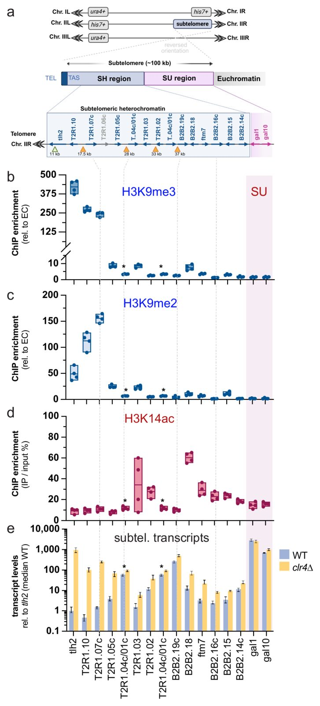
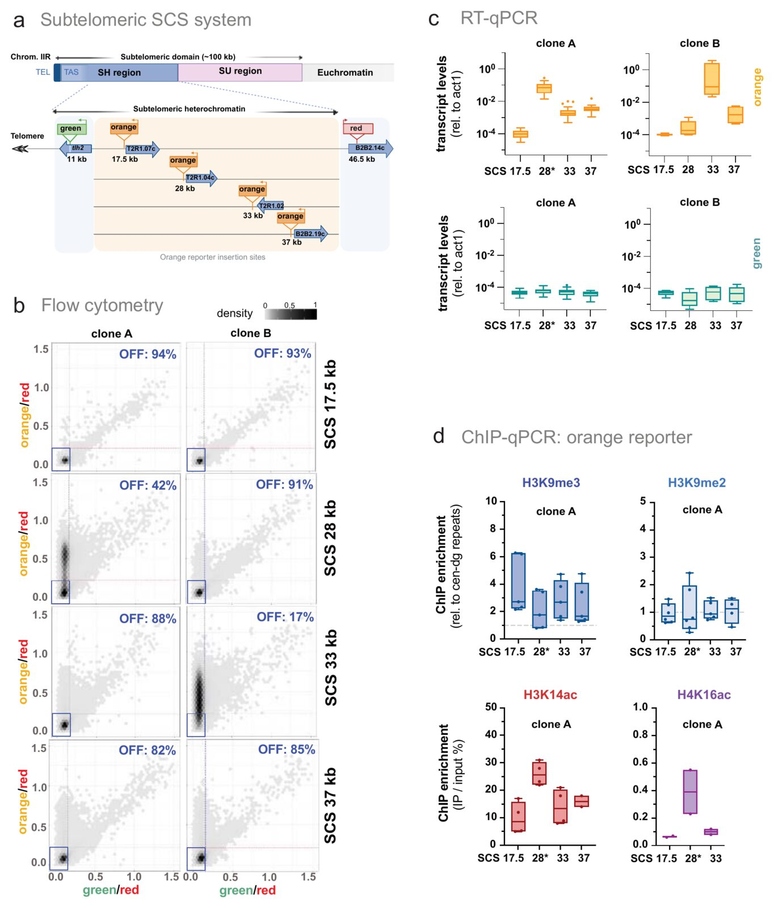
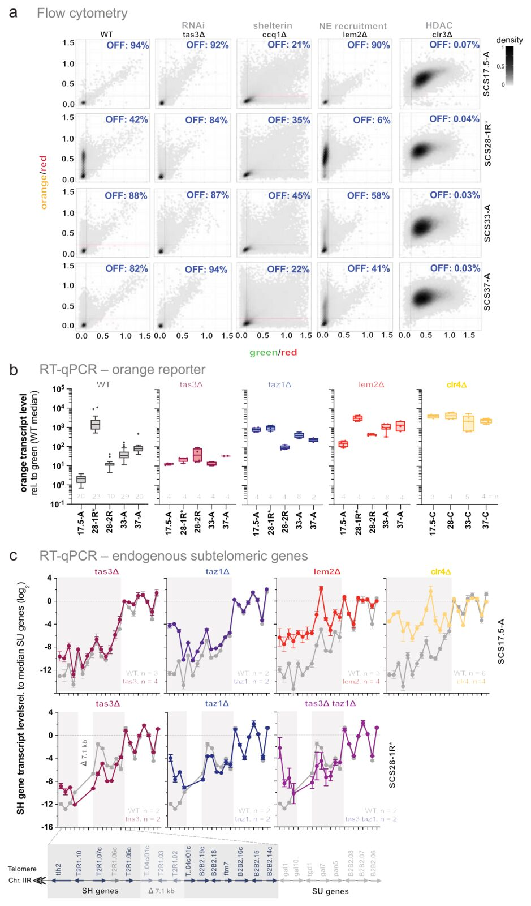
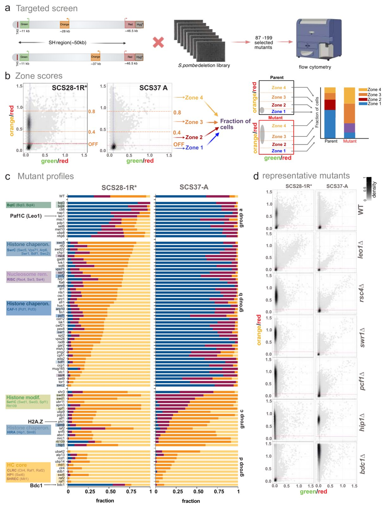
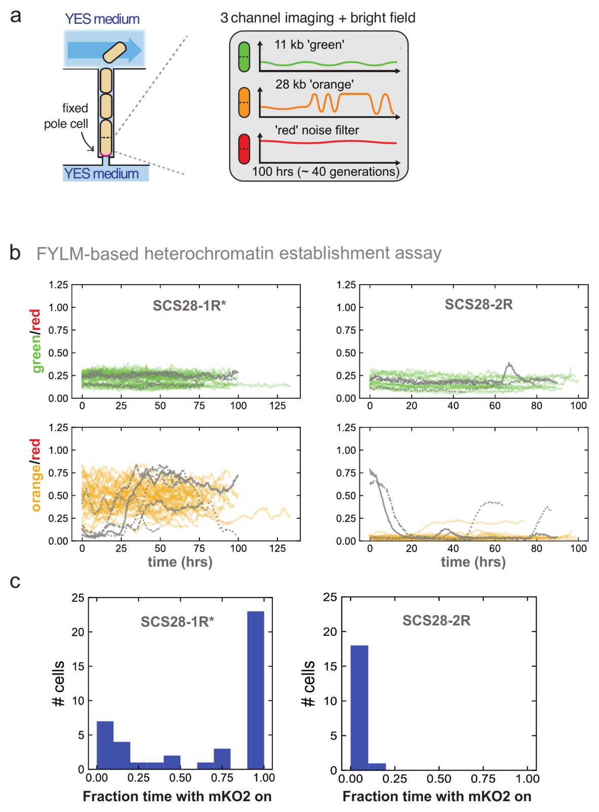
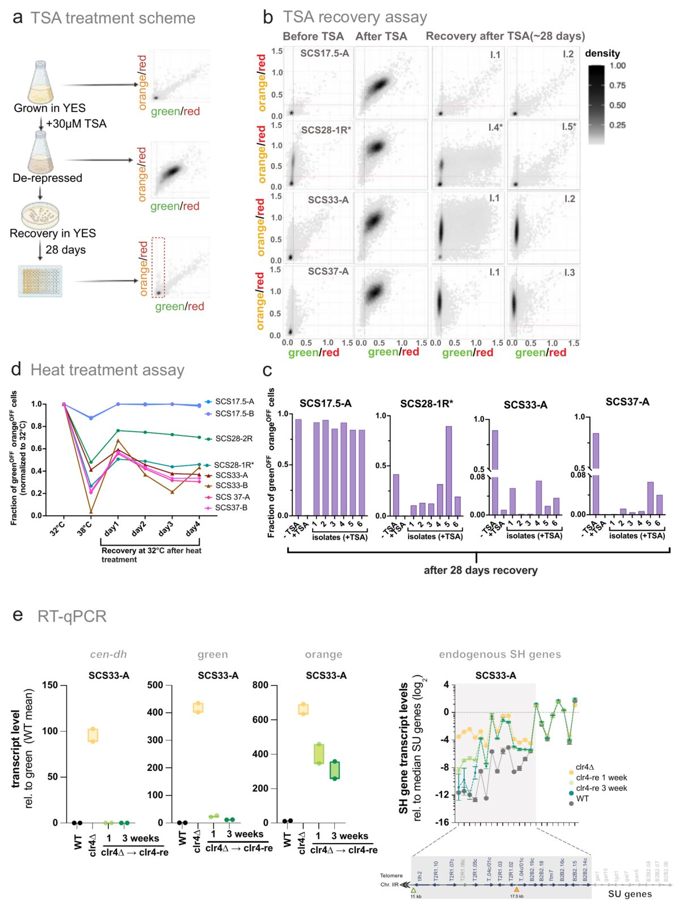

**Agnisrota Mazumder, John Cooper, Can Goksal, Jasbeer S. Khanduja, Richard I. Joh, Johannes J. Groos, Rosario Y. J. Brockhausen, Junko Kanoh, Mo Motamedi, Ilya J. Finkelstein, Bassem Al-Sady†, and Sigurd Braun† († co-corresponding)**

*bioRxiv* 2025.09.25.678047 (preprint, posted 25 September 2025)

DOI: [10.1101/2025.09.25.678047](https://doi.org/10.1101/2025.09.25.678047)

---

## Table of Contents

- [Abstract](#abstract)
- [Introduction](#introduction)
- [Results](#results)
- [Discussion](#discussion)
- [Material and Methods](#material-and-methods)
- [Source code availability](#source-code-availability)
- [Acknowledgements](#acknowledgements)
- [Author contributions](#author-contributions)
- [Competing interests](#competing-interests)
- [Supplementary Figure Legends](#supplementary-figure-legends)
- [References](#references)

---

## Abstract

Subtelomeres are imperfect repeats adjacent to telomeres that are repressed by heterochromatin. Although essential for genome integrity, their repetitive nature has thwarted dissection of local heterochromatin assembly and maintenance mechanisms. Here, we engineered *Schizosaccharomyces pombe* strains carrying fluorescent reporters at a single subtelomere. We find that subtelomeric heterochromatin is organized into discrete subdomains that nucleate at telomere-proximal and cryptic internal sites. Telomere-proximal regions depend on canonical shelterin or RNA interference nucleation pathways, while telomere-distal regions require nucleosome remodelers, histone chaperones, and boundary-associated factors. Using multi-generational live imaging and targeted perturbations, we show that subtelomeric subdomains display position-specific, clonally variable silencing across a spectrum of robust to fragile epigenetic states. This clonal variegation is also induced by naturally occurring subtelomeric structural variants. These findings demonstrate that subtelomeric heterochromatin maintenance is not uniform but rather governed by local chromatin context and architecture.

**Keywords:** subtelomeric heterochromatin; epigenetic variegation; H3K9 methylation; nucleation and spreading; *Schizosaccharomyces pombe*

---

## Introduction

Gene-repressing heterochromatin is a highly conserved feature marked by the methylation (me) of histone 3 (H3) at lysine 9 (K9). This histone modification is deposited by Suv39-family methyltransferases, such as Clr4 in *S. pombe* (Padeken et al., 2022). Heterochromatin formation is initiated when Clr4 is guided to specific sites by non-coding RNAs or DNA-bound factors. Once nucleated by this mechanism, heterochromatin expands into adjacent regions via a DNA sequence-independent mechanism termed spreading. This expansion depends on positive feedback involving Clr4, its enzymatic product, and reader proteins recognizing H3K9me, including members of the Heterochromatin Protein 1 (HP1) family ([Allshire and Madhani 2018](#ref2); [Bell et al. 2023](#ref8); [Grewal 2023](#ref26); [Moazed 2009](#ref44)). Local three-dimensional (3D) contacts between nucleosomes are critical for this positive feedback, facilitating both spreading and maintenance of the heterochromatic domains ([Erdel and Greene 2016](#ref19); [Owen et al. 2023](#ref50)). In both yeast and metazoans, such mechanisms typically support only short-range spreading, rarely exceeding 10 kb ([Abdulla et al. 2022](#ref1); [Dodd et al. 2007](#ref15); [Erdel and Greene 2016](#ref19); [Hamali et al. 2023](#ref29)). In *S. pombe*, this limit is evident when heterochromatin spreads within a euchromatic region, either through ectopic heterochromatin assembly ([Audergon et al. 2015](#ref3); [Greenstein et al. 2018](#ref24), [2020](#ref23); [Ragunathan et al. 2015](#ref51)) or at native heterochromatin islands ([Zofall et al. 2012](#ref76)). However, assessing spreading in constitutive heterochromatin is more complex, as these domains often contain multiple distinct nucleation sites ([Hansen et al. 2011](#ref30); [Jia et al. 2004](#ref35); [Khanduja et al. 2024](#ref40)) and are insulated by defined DNA elements ([Cam et al. 2005](#ref11)), as observed at pericentromeres and the silent mating-type (MAT) locus. Consequently, it remains unclear whether spreading in these regions is limited or whether it can propagate more extensively than in euchromatic environments.

Unlike MAT and pericentromeric domains, subtelomeric regions in *S. pombe* lack known internal nucleation sites and instead rely on nucleation near chromosome ends, from which H3K9me-marked domains are thought to extend over 50 kb ([Cam et al. 2005](#ref11); [Kanoh et al. 2005](#ref37); [Tashiro et al. 2017](#ref61)). Subtelomeres lie adjacent to telomeres but are structurally distinct, consisting of mosaic-like common sequence segments present in variable copy numbers rather than the short tandem repeats found in telomeric regions. Although they are hotspots of genome evolution, subtelomeric heterochromatin plays a protective role by suppressing excessive recombination and restricting the expression of transcripts whose misregulation has been linked to disease ([Kanoh 2023](#ref36)). In *S. pombe*, these heterochromatin domains correspond to the subtelomeric homologous (SH) sequences, which are present on most chromosomal arms. Ranging from 33-55 kb, the SH sequences are composed of imperfect repeats and multiple gene-containing segments that share ~90% identity between chromosomal arms, with occasional insertions and deletions ([Kanoh 2023](#ref36); [Oizumi et al. 2021](#ref49); [Yadav et al. 2021](#ref73)). SH regions also lack DNA-encoded boundary elements and exhibit gradual transitions into adjacent subtelomeric unique (SU) regions, which are devoid of heterochromatic marks ([Tashiro et al. 2017](#ref61); [Yadav et al. 2021](#ref73)). Two distinct nucleation pathways initiate heterochromatin formation near the telomeric repeats through the recruitment of Clr4. The first relies on RNA interference (RNAi) and nucleates at elements present in *tlh1–4* genes, ancient duplications of RecQ helicase-derived genes ([Hansen et al. 2006](#ref31)). These elements drive RNAi-mediated nucleation at pericentromeres, the MAT locus, and subtelomeres via the RNA-induced transcriptional silencing (RITS) complex ([Cam et al. 2005](#ref11); [Hansen et al. 2006](#ref31); [Kanoh et al. 2005](#ref37); [Oizumi et al. 2021](#ref49)). The second pathway depends on the telomere-protecting shelterin complex, which is targeted to telomere-proximal sequences by Taz1 and recruits Clr4 and the Snf2-like remodeler/HDAC-containing repressor complex (SHREC) via Ccq1 ([van Emden et al. 2019](#ref64); [Kanoh et al. 2005](#ref37); [Sugiyama et al. 2007](#ref56); [Miyoshi et al. 2008](#ref43); [Zofall et al. 2016](#ref75); [Wang et al. 2016](#ref67); [Cooper et al. 1997](#ref13)). In addition, the inner nuclear membrane protein Lem2 facilitates SHREC recruitment and acts redundantly with shelterin and RNAi ([Barrales et al. 2016](#ref7); [Tange et al. 2016](#ref60); [Banday et al. 2016](#ref6)).

The relatively large size and the absence of known boundary elements raise key questions about how such extended heterochromatin is assembled and maintained. SH may form a single continuous domain. In this model, RNAi- and shelterin-dependent pathways seed heterochromatin at the telomere-proximal end, resulting in its propagation toward the SH/SU boundary. This process potentially requires mechanisms that exclude heterochromatin antagonists such as Epe1 ([Ayoub et al. 2003](#ref5)). Alternatively, multiple independent nucleation events may occur along the SH region, generating distinct subdomains. In addition to the unresolved mechanisms governing SH heterochromatin formation, the epigenetic properties of SH domains remain poorly understood. However, efforts to dissect SH heterochromatin assembly have been hindered by the repetitive nature and similarity between SH sequences among different chromosomal arms, which precludes sequence-based analysis of domain structure and propagation ([Oizumi et al. 2021](#ref49)). To overcome these challenges, we integrated a series of gene silencing reporters into a previously generated yeast strain, which only contains a single SH domain ([Tashiro et al. 2017](#ref61)). This approach enabled the detailed dissection of the molecular characteristics, epigenetic behavior, and genetic requirements governing SH heterochromatin. Unexpectedly, we find evidence for multiple, epigenetically distinct subdomains within the SH region that initiate heterochromatin formation independently of previously described, canonical molecular mechanisms.

## Results

### The SH domain carries a heterogeneous chromatin landscape

To determine whether the ~50 kb heterochromatin domain assembled over SH sequences forms a contiguous domain or comprises discrete domains with independent nucleation sites, we analyzed a fission yeast strain in which all but one SH domain were replaced by marker genes (*his7*, *ura4*) ([Tashiro et al. 2017](#ref61)). Specifically, we used the *SD4[2R+]* strain, which carries an SH domain on the right arm of chromosome II, while the remaining SH sequences have been removed ([Figure 1a](#fig1)). Heterochromatin dosage is not altered in this strain, as SH-independent heterochromatin of comparable size is still formed on the other arms ([Tashiro et al. 2017](#ref61)). Chromatin immunoprecipitation followed by quantitative PCR (ChIP–qPCR) across individual subtelomeric genes revealed strong enrichment of tri- and dimethylated H3K9 (H3K9me3, H3K9me2) within a ~10 kb region near the telomere ([Figure 1b, c](#fig1)). This region includes the RNAi-dependent nucleation site at *tlh2*, which shares sequence similarity with pericentromeric *dg-dh* repeats and the *cenH* element at the mating type locus ([Kanoh et al. 2005](#ref37)). We find that H3K9me3 levels peak near the *tlh2* nucleation site, while H3K9me2 reaches maximum levels more distally. Beyond this region, we also observed that H3K9me levels decline sharply but remain detectable, consistent with previous observations ([Kanoh et al. 2005](#ref37); [Tashiro et al. 2017](#ref61)). To examine euchromatic features, we measured acetylation of histone H3 at lysine 14 (H3K14ac), a mark associated with active transcription (Wiren 2005). H3K14ac displays an inverse pattern to H3K9me, with higher levels in telomere-distal regions and sporadic enrichment at individual SH genes ([Figure 1d](#fig1)). These chromatin profiles suggest a non-uniform landscape within the SH domain.

<figure class="paper-figure" id="fig1">

<figcaption><strong>Figure 1. The SH domain carries a heterogeneous chromatin landscape.</strong> <b>(1a)</b> Schematic representation of the <em>SD4[2R+]</em> strain with engineered subtelomeric deletions. The 100 kb subtelomeric domain is demarcated into a ~50 kb subtelomeric homology (SH) region and a subtelomeric unique (SU) region. All SH sequences were replaced with <em>ura4</em> or <em>his7</em> markers, leaving only the native subtelomere on the right arm of chromosome II. Genes within SH region included in the analysis are shown in blue; those excluded are shown in grey. Representative examples of SU genes are shown in pink. Created by BioRender. <b>(1b–d)</b> ChIP–qPCR analysis of histone modifications across genes in the SH region and a portion of the SU region. (b) Enrichment of H3K9me3 and (c) H3K9me2; input-adjusted IP signals were normalized to the average of two sites of the euchromatic <em>act1</em>⁺ coding region. (d) Enrichment of H3K14ac; signals represent percent IP relative to input. Data represent 4 independent biological replicates (<em>n</em> = 4). The SU region is shaded in pink. Primer pairs for amplifying unique target sequences are described in Lei et al 2020. The asterisks denote the gene pair SPBCPT2R1.04c/SPBCPT2R1.01c displaying 99.9% sequence identity, which cannot be distinguished. <b>(1e)</b> RT–qPCR analysis of transcript levels from genes in the SH region and a portion of the SU region in wild-type (WT; blue) and <em>clr4Δ</em> (yellow) strains. Transcript levels were normalized to <em>act1</em> and are presented relative to the <em>tlh2</em> median expression level of WT samples. Data represent median with range (<em>n</em> = 4). The SU region is shaded in pink.</figcaption>
</figure>

We next assessed whether these chromatin features correlate with transcriptional output by performing quantitative reverse transcriptase (RT-qPCR) assays in *SD4[2R+]* and in a derivative lacking Clr4, the sole H3K9 methyltransferase in *S. pombe*. Most SH genes exhibit low transcript levels in the WT background that are strongly dependent on Clr4, with telomere-proximal genes such as *tlh2* repressed by up to 1000-fold ([Figure 1e](#fig1)). The variation in gene expression likely reflects intrinsic differences in promoter strength. In contrast, genes in the adjacent SU region display 500 to 1000-fold higher expression that is Clr4-independent ([Figure 1e](#fig1); Suppl. Figure S1a). Notably, two SH genes, *SPBCPT2R1.04c* and *SPBB2B2.19c*, located ~28 and ~38 kb from the telomere, also show high expression and only weak dependence on Clr4, indicating a distinct chromatin context.

To assess whether these features are strain-specific, we compared *SD4[2R+]* to FY1193, a derivative of the commonly used laboratory strain 972 ([Ekwall et al. 1999](#ref17)). Although SH sequences vary in DNA sequence and segment copy numbers across different laboratory and wild strains ([Oizumi et al. 2021](#ref49)), such variation is primarily confined to the telomere-proximal SH-P region, which is excluded from our analysis. We found that SH gene repression is generally stronger in *SD4[2R+]* than in FY1193, but the overall expression pattern is conserved (Suppl. Figure S1b). These findings indicate that the observed heterogeneity in *SD4[2R+]* is not due to strain-specific variation or the loss of SH sequences on the other chromosome arms.

### Position-specific single-cell reporters identify distinct silencing states across the SH domain

To dissect position-specific heterogeneity in silencing across the SH domain, we developed a single-cell sensor (SCS) reporter system that overcomes the confounding effects of variable promoter strength in endogenous genes and high sequence similarity among the SH genes themselves (Suppl. Figure S2a). This system builds on our previously established single-cell heterochromatin spreading sensor (HSS) ([Greenstein et al. 2018](#ref24)), with specific adaptations for the SH region. It comprises three transcriptionally encoded fluorescent reporters integrated at defined loci in and outside the SH domain, enabling precise, locus-specific quantification of heterochromatin-mediated silencing in single cells under a uniform promoter context. To monitor telomere-proximal silencing, we integrated a green fluorescent reporter (superfolder GFP under the *ade6* promoter, *ade6p*, 'green') 11 kb from the telomere of *SD4[2R+]*, adjacent to the RNAi-dependent *tlh2* nucleation site ([Kanoh et al. 2005](#ref37)). Additional 'orange' reporters (monomeric Kusabira Orange 2 under *ade6p*) were inserted at increasing distances (17.5 kb, 28 kb, 33 kb, and 37 kb) to survey nucleation-distal regions ([Figure 2a](#fig2)). A third reporter (E2Crimson under the *act1* promoter, 'red') was integrated at 46.5 kb, marking the SH-SU transition and serving as an internal control to correct for cell-to-cell transcriptional variability caused by intrinsic and extrinsic noise.

<figure class="paper-figure" id="fig2">

<figcaption><strong>Figure 2. Position-specific single-cell reporters identify distinct silencing states across the SH domain.</strong> <b>(2a)</b> Schematic of the subtelomeric SCS reporter system integrated into the SH region (~50 kb) of the right arm of chromosome (Chrom. IIR). Each strain contains three reporters: a 'green' reporter inserted at 11 kb with the <em>tlh2</em> ORF, a 'red' reporter at 46.5 kb close to SPBPB2B2.14c, and an 'orange' reporter inserted at one of four distinct positions within the SH region (17.5 kb, 28 kb, 33 kb, or 37 kb). The positions of 'green' and 'red' reporters are consistent across all constructs. Reporter orientation is indicated by arrows, and adjacent genes are labeled. Created by BioRender. <b>(2b)</b> Two-dimensional hexbin density plots showing red-normalized green and orange fluorescence for different SCS reporters. The x-axis represents green fluorescence normalized to red, and the y-axis represents orange fluorescence normalized to red. OFF-state thresholds for 'green' and 'orange' reporters are indicated by blue and red dashed lines, respectively. Data from two clones, A (left) and B (right), are presented for all SCS constructs. The scale bar at the top right indicates relative cell density, with bin cutoffs plotted as fractions of the most populated bin. <b>(2c)</b> RT–qPCR analysis of transcript levels from 'orange' (top) and 'green' (bottom) reporters in the SCS reporter constructs. Transcript levels were normalized to <em>act1</em>. Data from both clones, A (left) and B (right), are shown. Data are represented as box-whisker plots (Tukey) from independent biological replicates with <em>n</em> = 20 (SCS17.5-A), 5 (17.5-B), 22 (28-A&#42;), 10 (28-B), 29 (33-A), 6 (33-B), 18 (37-A), and 6 (37-B). The asterisk in SCS28-A&#42; denotes a 7.1 kb deletion next to the reporter insertion (see text for details). <b>(2d)</b> ChIP–qPCR analysis of histone modifications at 'orange' reporter insertion sites in SCS constructs (clone A). (Top left and top right) Enrichment of H3K9me3 and H3K9me2, respectively, input-adjusted IP signals were normalized to the average signal at two euchromatic loci (<em>act1</em>, <em>tef3</em>) and presented relative to constitutive heterochromatin (<em>cen</em>-<em>dg</em>). (Bottom left and bottom right) H3K14ac and H4K16ac enrichment shown as percent IP relative to input. Data points and box plots represent independent biological replicates (for all ChIP experiments <em>n</em> = 4-6, except for H314ac, 37-A: <em>n</em> = 2; for H3K16ac, all reporters: <em>n</em> = 2).</figcaption>
</figure>

We quantified silencing across thousands of cells during logarithmic growth by flow cytometry, analyzing two independent clones for each reporter (A and B; see Materials and Methods). Fluorescence signals from 'green' and 'orange' reporters were normalized to the 'red' control and scaled to the fully derepressed state in *clr4Δ* cells, as described previously ([Greenstein et al. 2018](#ref24)). Hexbin plots of normalized fluorescence intensities revealed non-uniform silencing distributed across the SH region, consistent with the transcriptional heterogeneity of endogenous genes ([Figure 1](#fig1)). The 'green' and 'orange' reporters at 11 kb and 17.5 kb, respectively, exhibited strong silencing in both clones, with over 90% of cells in the OFF states, consistent with their proximity to the *tlh2* nucleation site ([Figure 2b](#fig2)). At 28 kb, silencing became heterogeneous, particularly in clone A, which displayed a bimodal distribution of transcriptionally silenced and active cells. We also observed clone-specific differences at 33 kb, whereas silencing at 37 kb was robust in both clones (82–85%), though weaker than at telomere-proximal sites. To validate the chromatin-dependent behavior of the reporters, we measured transcript levels by RT-qPCR ([Figure 2c](#fig2)). Consistent with flow cytometry data, the 'orange' reporter at 17.5 kb shows low expression similar to the 'green' reporter at 11 kb ([Figure 2c](#fig2), compare bottom and top panels). The 'orange' reporter at 28 kb (clone A) is ~1000-fold more active, and reporters at 33 kb and 37 kb show intermediate expression levels (~50–100-fold above green). Conversely, transcript levels of the 'green' reporter are not affected by the varying insertion positions of the 'orange' reporter. Similarly, while the 'red' reporter is located close to the silent SH region, its expression is robust and largely unaffected by the presence of heterochromatin (Suppl. Figure S2b). These findings demonstrate that our position-dependent reporters accurately capture the spatial heterogeneity of subtelomeric gene silencing with greater resolution than endogenous gene readouts.

To test whether reporter insertion perturbs local gene expression, we profiled the transcript levels of endogenous genes. Overall expression patterns were preserved across reporter strains in both wild-type and *clr4∆* backgrounds (Suppl. Fig. S2c), with only minor changes for genes near the reporter insertion sites. However, in SCS28 clone A, three genes adjacent to the 28 kb reporter (SPBCPT2R1.04c, SPBCPT2R1.03, and SPBCPT2R1.02) were completely absent. These genes belong to a common sequence block (VI) flanked by two nearly identical Ω homologous box sequences (Suppl. Fig. S2d). Upon further investigation, we found that this 7.1 kb sequence is also naturally absent from the Tel1R arm of the reference laboratory strain 972, likely due to a historical recombination event between the Ω elements ([Oizumi et al. 2021](#ref49)). While this structural variant may contribute to the altered silencing profile in clone A, additional evidence indicates that epigenetic mechanisms are also involved (see below). Because this clone models a naturally truncated Tel1R arm, we analyzed it in subsequent experiments and hereafter refer to clone A and B as SCS28-1R\* and SCS28-2R, respectively.

We next examined histone modifications at the reporter loci using ChIP-qPCR. All reporters display high H3K9me2 and H3K9me3 levels, comparable to pericentromeric *cen-dg* repeats ([Figure 2d](#fig2)). Despite substantial differences in expression levels, we observed minimal variation in H3K9me2 and -me3 across reporters. Even at the orange reporter of SCS28-1R\*, where expression exceeds other reporter sites by over 100-fold, H3K9me3 shows only a slight, statistically non-significant reduction. In contrast, H3K14ac levels increase markedly at the 'orange' reporter in SCS28-1R\* ([Figure 2d](#fig2)), consistent with expression data from RT-qPCR ([Figure 2c](#fig2)) and flow cytometry ([Figure 2b](#fig2)). We observed a similar pattern for H4K16ac, a euchromatic histone mark present at several active promoters and reported to antagonize heterochromatin spreading ([Wang et al. 2013](#ref68)). Collectively, these findings suggest that although H3K9me enrichment is necessary for silencing, it is not sufficient to account for positional and structural variation across reporter sites. Rather than reflecting a simple, distance-dependent gradient, silencing across the SH region appears to result from a complex chromatin architecture influenced by additional regulatory inputs.

### Silencing of telomere-distal SH regions is maintained independently of common nucleation pathways

Next, we examined whether previously defined SH heterochromatin nucleation and silencing pathways impact our SCS reporters. We deleted components of the RNAi- and shelterin-dependent pathways, as well as the inner nuclear membrane protein Lem2 (Suppl. Figure S3a). Loss of the RITS subunit Tas3, the shelterin component Ccq1, or Lem2 results in modest derepression of the 'green' and most 'orange' reporters, consistent with their overlapping roles at subtelomeres ([Figure 3a](#fig3)). Despite these similarities, each mutant displays a distinct phenotype: *tas3∆* modestly affects only the telomere-proximal 17.5 reporter ([Figure 3a](#fig3); Suppl. Figure S3b), *lem2*∆ primarily impairs telomere-distal silencing, and *ccq1*∆ causes intermediate defects. In contrast, deletion of the HDAC Clr3, a component of SHREC redundantly recruited by Ccq1 and Lem2, leads to full derepression at every locus. Intriguingly, whereas the 'orange' reporter in SCS28-1R\* displays a bimodal repression pattern in WT cells, silencing is enhanced in both the *tas3*∆ and *ccq1*∆ mutants. This suggests that loss of RNAi and shelterin redirects silencing factors from regions dependent on these pathways, such as telomere-proximal and pericentromeric loci, to the orange reporter in SCS28-1R\*.

<figure class="paper-figure" id="fig3">

<figcaption><strong>Figure 3. Silencing of telomere-distal SH regions is maintained independently of common nucleation pathways.</strong> <b>(3a)</b> Two-dimensional hexbin density plots showing red-normalized green (x-axis) and orange (y-axis) fluorescence for SCS reporters in various genetic backgrounds. Blue and red dashed lines indicate OFF thresholds for green and orange reporters, respectively. (see <a href="#fig2">Figure 2</a> for details). Columns represent wild type (WT), <em>tas3Δ</em>, <em>ccq1Δ</em>, <em>lem2Δ</em>, and <em>clr3Δ</em>. Rows correspond to SCS constructs (clone A) with variable 'orange' reporter positions (17.5, 28, 33, or 37 kb). Data for WT reporter strains are identical to those shown in <a href="#fig2">Figure 2b</a>. Experiments with <em>tas3∆</em> reporters were conducted independently, with the corresponding WT controls shown in Supplementary Figure S3b. <b>(3b)</b> RT–qPCR analysis of transcript levels from 'orange' reporters in SCS reporters across genetic backgrounds. Data are shown for SCS17.5 (clone A), SCS28 (clones 1R&#42; and 2R), SCS33 (clone A), and SCS37 (clone A) in wild type (WT), <em>tas3Δ</em>, <em>taz1Δ</em>, and <em>lem2Δ</em>. The final column shows <em>clr4Δ</em> in SCS constructs (clone C). Transcript levels were normalized to <em>act1</em> and presented relative to the median green reporter expression in WT samples. The number of independent biological replicates is indicated below each plot. <b>(3c)</b> RT–qPCR analysis of transcript levels for endogenous genes within the SH and SU region in the across genetic backgrounds. Expression profiles are shown for wild type (WT) and <em>tas3Δ</em>, <em>taz1Δ</em>, <em>lem2Δ</em>, and <em>clr4Δ</em> (SCS17.5, clone A; top panel) and <em>tas3Δ</em>, <em>taz1Δ</em>, and <em>tas3Δ taz1Δ</em> (SCS28-R1&#42;; bottom panel), with WT values plotted in grey for comparison. Transcript levels were normalized to <em>act1</em> and presented relative to the median of SU-region genes in WT (log₂ scale). The number of independent biological replicates is indicated at the bottom right of each panel. The schematic (below left panel) shows the organization of genes in the SH and SU regions; grey-marked SH genes were excluded from analysis, and all SU-region genes are shown in grey.</figcaption>
</figure>

We confirmed these position-specific requirements by RT-qPCR ([Figure 3b](#fig3)). Deletion of *tas3* induces a modest (~10-fold) increase in transcripts at 17.5 kb, consistent with previous findings ([Hansen et al. 2006](#ref31); [Kanoh et al. 2005](#ref37)), while reporters at 33 and 37 kb remain unchanged or become slightly suppressed. Notably, *tas3*∆ reduces SCS28-1R\* transcript levels by 100-fold, mirroring the behavior of SCS28-2R and resulting in a more uniform expression pattern across reporter sites compared to the distinct silencing profile in WT strains. Loss of *taz1* leads to strong derepression of the 17.5 kb 'orange' reporter and extends this effect to SCS33 and SCS37 at comparable levels, while SCS28-1R\* remains unaffected or slightly suppressed. Remarkably, although RNAi and Taz1 have been reported to act redundantly at several subtelomeric loci ([Kanoh et al. 2005](#ref37); [Barrales et al. 2016](#ref7)), the 'orange' reporter in SCS28-1R\* is suppressed in the *tas3∆ taz1∆* double mutant compared to the *taz1*∆ single mutant (Suppl. Figure S3c). Deletion of *lem2* elevates expression across all orange reporters, with a stronger impact at telomere-distal sites than *taz1*∆, indicating a broader subtelomeric role ([Figure 3b](#fig3)). Consistent with elevated H3K14ac levels at telomere-distal genes ([Figure 2d](#fig2)) and previous reports ([Gómez et al. 2005](#ref21)), deletion of *mst2*, which encodes a H3K14 histone acetyltransferase, suppressed 'orange' expression at SCS28-1R\* and, to a lesser extent, at SCS33 and SCS37 (Suppl. Figure S3d,e). Finally, *clr4*∆ abolishes silencing at every reporter, confirming that the observed expression patterns in WT cells reflect distinct heterochromatin states rather than sequence-dependent effects. These locus-dependent requirements also apply to endogenous subtelomeric SH genes, both in the presence and absence of reporter integration ([Figure 3c](#fig3), top panels; Suppl. Figure S3f). Tas3 and Taz1 primarily affect telomere-proximal genes, while Lem2 supports silencing across the entire subtelomere, paralleling Clr4's role at telomere-distal regions. Moreover, SH genes flanking the 7.1 kb fragment absent in SCS28-1R\* are suppressed in *tas3*∆ and *taz1*∆ single and double mutants relative to the WT strain ([Figure 3c](#fig3), bottom panels).

The elevated expression of the 'orange' reporter and adjacent endogenous SH genes in SCS28-1R\* suggests that the 7.1 kb DNA segment (block VI) contains elements critical for local silencing. We investigated two possible mechanisms by which silencing might be influenced by deletions within this segment: the presence of DNA elements that either insulate heterochromatin from spreading or that support its nucleation. Notably, next to the Ω homologous box sequences, this segment is also flanked by two LTRs, SPLTRB.69 and SPLTRB.68; the latter is absent in SCS28-1R\*. Because LTRs have been proposed to act as boundary elements separating euchromatin from heterochromatin domains ([Steglich et al. 2015](#ref55); [Cam et al. 2005](#ref11)), we hypothesized that the loss of SPLTRB.68 might underlie the altered silencing phenotype. To test this, we deleted SPLTRB.68 using CRISPR in the sister clone SCS28-2R and another reporter strain, SCS33. Neither deletion substantially affects 'orange' expression (Suppl. Figure S3g), indicating that loss of SPLTRB.68 alone is insufficient to explain the phenotype. However, removing a different LTR (SPLTRB.67) located further downstream caused a >10-fold increase in 'orange' expression relative to the corresponding WT strain (Suppl. Figure. S3g). These findings suggest that while SPLTRB.68 is largely dispensable for repression, specific LTR elements, such as SPLTRB.67, can modulate local silencing and contribute to the organization of SH heterochromatin.

Because LTR-dependent heterochromatin insulation appears to play only a minor role in shaping locus-specific silencing patterns, we focused instead on potential nucleation mechanisms. SH genes adjacent to the 7.1 kb fragment in SCS28-1R\* maintain silencing independently of RNAi and the shelterin complex, suggesting that this segment or nearby sequences may function as a cryptic heterochromatin nucleation site. Previous studies have described additional nucleation pathways in which the RNA-processing factors Mtl1-Red1-core (MTREC) complex, Mmi1, and Erh1 promote Clr4 recruitment to heterochromatic islands and pericentromeric regions ([Khanduja et al. 2024](#ref40); [Sugiyama et al. 2016](#ref57); [Zofall et al. 2012](#ref76); [Vo et al. 2019](#ref66); [Hiriart et al. 2012](#ref32)). Notably, *de novo* Clr4 recruitment to pericentromeres overlaps with two non-coding RNAs (lncRNAs) containing Mmi1 recognition elements and occurs independently of RNAi and pre-existing H3K9me ([Khanduja et al. 2024](#ref40)). Guided by these findings, we examined Clr4 enrichment in an *ago1*∆ *H3K9R* strain at subtelomeric regions and detected a small but distinct Clr4 peak near the 7.1 segment in the SH common sequence block V (Suppl. Figure S4a). These peaks are present on both Tel1L and Tel2R at similar, though not identical, positions and coincided with ncRNAs (SPNCRNA.2012, SPNCRNA.6640, SPNCRNA.6641) containing multiple Mmi1 recognition elements. Intriguingly, the Clr4 binding site on Tel2R further overlaps with H3K9me3 peaks that persist in *swi6HP1* mutants deficient in heterochromatin spreading (Suppl. Figure S4b) ([Kennedy et al. 2024](#ref39)). These findings support the notion that this telomere-distal region contains a cryptic, ncRNA-dependent nucleation site.

Together, these data delineate functionally autonomous silenced subdomains within the SH region, each characterized by distinct spreading modes shaped by pathway-specific nucleation mechanisms and position-dependent chromatin features. Telomere-proximal subdomains depend primarily on RNAi- and shelterin-mediated nucleation, whereas more distal domains rely on Lem2 and may be seeded by additional, cryptic nucleators dependent on ncRNAs. Moreover, individual LTR elements modulate the epigenetic state of the SH region, revealing a previously unrecognized position-specific mechanism operating at SH heterochromatin.

### Silencing at distal subtelomeric subdomains has unique genetic requirements

The phenotypic differences among core pathway mutants support the idea that silencing at each locus relies on distinct genetic requirements, potentially involving different sets of *trans*-acting factors that act across the subtelomeric region. To explore this further, we performed a targeted screen using the SCS28-1R\* and SCS37 reporters, which represent different structural variants and display distinct epigenetic behaviors. SCS28-1R\* additionally has the advantage that it allows the detection of silencing antagonists. We crossed these reporters to a curated set of chromatin factor mutants (partial list from [Greenstein et al., 2022](#ref25); see Supplemental Tables S4 and S5) and examined the resulting strains by flow cytometry ([Figure 4a](#fig4)). We prioritized genes that affect the silencing at 'orange', as factors leading to de-repression of 'green' overlapped with known, general regulators of heterochromatin (Suppl. Figure S5a, b). To assess altered silencing behavior of the SCS28-1R\* and SCS37 reporters, we analyzed the distribution of the individual cells by dividing the population into four zones based on the level of 'orange' repression and quantified the fraction of cells in each zone in WT and mutant strains ([Figure 4b](#fig4)). For SCS37, in which the 'orange' reporter is strongly repressed in WT cells, most mutants exhibit loss of silencing, whereas mutants in SCS28-1R\*display both loss and gain of silencing (Suppl. Figure S5a, b). Based on the results from the individual reporter screens and overlapping mutants between the two datasets, we performed k-means clustering (Suppl. Figure S5c), which identified four major groups: (a) mutants with enhanced silencing, primarily in SCS28-1R\*; (b) mutants with silencing defects exclusively in SCS28-1R\*, (c) mutants with strong silencing loss in SCS28-1R\*and partial silencing defects in SCS37; and (d) mutants with pronounced silencing defects in both backgrounds.

<figure class="paper-figure" id="fig4">

<figcaption><strong>Figure 4. Silencing at distal subtelomeric subdomains has unique genetic requirements.</strong> <b>(a)</b> Schematic illustrating the fluorescence-based targeted screen. SCS28-1R&#42; and SCS37 reporter constructs contain orange reporters inserted at 28 kb or 37 kb, respectively, with 'green' and 'red' reporters fixed at 11 kb and 46.5 kb. Both reporters were crossed with a deletion library of ~3000 non-essential genes. A subset of 87–199 mutants was selected for flow cytometry analysis. <b>(b)</b> Two-dimensional hexbin density plots showing green (x-axis) and orange (y-axis) fluorescence normalized to red for SCS reporter constructs. Blue and red dashed lines indicate OFF thresholds for 'green' and 'orange' reporters, respectively, which are based on fluorescence in either channel in a 'red' only strain (see methods). Orange fluorescence was further stratified into four zones (zone 1–4) based on increasing orange/red ratios using cutoffs at the OFF threshold, 0.4, and 0.8. The fraction of cells within each zone was quantified to assess the distribution of 'orange' reporter expression. This zonal classification was applied to identify mutants that promote activation of the orange reporter, as indicated by increased cell fractions in Zones 3 and 4. <b>(c)</b> Stacked bar plots showing the distribution of cells across four fluorescence expression zones (zone 1–4, increasing orange fluorescence normalized to red) in wild-type and mutant strains in the SCS28-1R&#42; (left panel) or SCS37-A (right panel) reporter. The shared set of genes identified in both screens was grouped into four clusters (a-d) based on zone distribution using optimal k-means clustering (k = 4; see Supplementary Figure S5c). Each horizontal bar represents one mutant strain. For each group, mutants are ordered top to bottom by the increasing fraction of cells in zones 3 and 4 in the SCS28-1R&#42; screen (left). Corresponding zone distributions for the same mutants are shown in the SCS37-A screen (right). Wild-type distributions are included at the top for comparison. Gene names are annotated on the left and grouped by functional categories, including transcriptional regulators (e.g., Paf1C), chromatin remodelers (e.g., SwrC, RISC), histone chaperones (e.g., CAF-1, HIRA), histone modifiers (e.g., Set1C, Rtt109), and heterochromatin core components (e.g., CLRC, SHREC, HP1). This classification facilitates systematic identification of regulators influencing silencing or derepression of the orange reporter. <b>(d)</b> Two-dimensional hexbin density plots showing green (x-axis) and orange (y-axis) fluorescence normalized to 'red' for SCS28-1R&#42; and SCS37-A reporter constructs. Wild-type profiles are shown at the top for reference. Representative mutants are displayed below. The left panel shows wild-type and mutants in the SCS28-1R&#42; background; the right panel shows wild-type and mutants in the SCS37-A background.</figcaption>
</figure>

Noteworthy examples from group (a) (mutants that enhance silencing of SCS28-1R\*) include the Paf1C subunit Leo1, which also partially enhances silencing in SCS37 ([Figure 4c](#fig4)). This finding is consistent with previous reports that revealed a role of Paf1C in promoting nucleosome turnover while antagonizing heterochromatin assembly and spreading ([Verrier et al. 2015](#ref65); [Kowalik et al. 2015](#ref41); [Sadeghi et al. 2015](#ref52)). Additional SCS28-1R\* specific factors include the NE-bound protein Bqt3 and Bqt4 implicated in telomere tethering ([Figure 4c](#fig4)). We also identified members of Ino80C (Ies2, Ies4, Iec1 Iec3) and two jumonji proteins, Jmj2 and Jmj4, that are potentially involved in H3K4me3 methylation ([Huarte et al. 2007](#ref34)) (Suppl. Figure S5a). This may be related to the formation of H3K4me-dependent boundaries in open chromatin (see discussion).

Group (b) contains mutants with silencing defects in SCS28-1R\*. Among those, chromatin remodeling gene mutants have unusual behaviors. Previously, mutations in these genes have been implicated in restricting heterochromatin spreading ([Greenstein et al. 2022](#ref25)) and assembly ([Sahu et al. 2024](#ref53)). Surprisingly, we found that several remodeling complex members are required for 'orange' silencing in SCS28-1R\* but not SCS37, including Swr1C, which is involved in H2A.Z deposition (Swr1, Swc2, Swc5, Arp6, Vps71, Bdf1), and RSC (Rsc4, Ssr3, Ssr4). We also found that members of the histone chaperones CAF1 (Pcf1, Pcf3) specifically affect SCS28-1R\*. This contrast between the behavior of subtelomeres versus, for example, the MAT locus, likely reflects the role of SH as a buffering sink for free heterochromatin factors ([Murphy and Berger 2023](#ref46); [Tadeo et al. 2013](#ref58); [Tashiro et al. 2017](#ref61)). In this scenario, the gain of silencing observed in remodelers at pericentromeric and MAT loci comes at the expense of factors lost from the SH region, with the SCS28-1R\* reporter exhibiting a much wider sensitivity to remodeling complex members. Oher factors uniquely required for SCS28-1R\* include Hus1 (checkpoint clamp complex component), Rad8 (E3 ubiquitin ligase/remodeler), and Ccp1 (CENP-A disassembly factor).

Group (c) mutants exhibit silencing loss at 'orange' in both reporters but have a stronger effect in SCS28-1R\*. Notably, members of this group overlap with mutants we previously demonstrated to disrupt ectopic heterochromatin at the euchromatic *ura4* locus, while leaving constitutive sites largely intact ([Greenstein et al. 2022](#ref25)). Additionally, both 'orange' reporters require H2A.Z, linked to the Swr1C, and depend on the histone chaperone HIRA (Hip1, Slm9) and the Swi/Snf complex subunit Snf5. The overlapping requirement for silencing at both reporter loci and at equivalent euchromatin-insertions, together with the heightened sensitivity to euchromatic remodelers, suggest that SH regions and ectopic heterochromatin share chromatin features not typically associated with constitutive heterochromatin.

Group (d) mutants that disrupted 'orange' silencing in both reporters have previously been shown to impact silencing, and include the Clr6 deacetylase complex ([Greenstein et al., 2022](#ref25)), the replication fork-associated protein Mrc1 ([Charlton et al. 2024](#ref12); [Toda et al. 2024](#ref62); [Yu et al. 2024](#ref74); [Kawakami et al. 2024](#ref38)), the E3 ubiquitin ligase adapter protein Ddb1 ([Braun et al. 2011](#ref9)), the CAF1 histone chaperone ([Dohke et al. 2008](#ref16)), and the H3K4 methyltransferase Set1 complex ([Greenstein et al. 2020](#ref23); [Muhammad et al. 2024](#ref45)).

In addition to factors matching the general behaviors of groups (a)-(d), we uncovered some unusual cases that do not fit into these groups. The most striking example is *bdc1,* encoding a bromodomain protein that is part of the NuA4 HAT complex, which antagonizes silencing at 28 kb but is essential for silencing at 37 kb. We confirmed its requirement for repression of telomere-distal genes in the parental *SD4[2R+]* strain lacking the reporters (Suppl. Figure S5d). Bdc1 has not previously been implicated in heterochromatin regulation and may perform a unique, context-dependent role at SH domains. While factors required specifically for SCS37 silencing are not numerous enough to form a group, Rtt109*,* the H3K56 acetyltransferase in *S. pombe* ([Xhemalce et al. 2007](#ref72)), is such a factor. Although genes such as *rtt109*, *bdc1*, and group and c members beyond remodelers and histone chaperones do not define a single molecular pathway, their distinct effects underscore the modular nature of SH heterochromatin and the diverse regulatory mechanisms acting on individual subdomains.

The genes identified in our screen indicate that SH sequences occupy a chromatin environment distinct from constitutive heterochromatin and, in some respects, closer to euchromatin. The unique requirements for heterochromatin regulation at SH sequences, and their potential parallels with ectopic heterochromatin, provide the basis for future investigation. Together, our targeted screen highlights a set of factors that act as specialized regulators, whose requirement at the SCS28-1R\* and SCS37 reporters extends beyond the canonical factors involved in heterochromatin assembly and spreading factors.

### SH chromatin undergoes unique dynamic changes not seen at other constitutive heterochromatin loci

Previously, we documented widespread fluctuation in silencing over time at the MAT locus using a sensor positioned 4 kb distal to the constitutive *cenH* nucleation site, even as the sensor at the nucleation site remained silent ([Greenstein et al. 2018](#ref24)). To determine whether SH heterochromatin exhibits similar temporal dynamics, we monitored the 28 kb 'orange' reporter using the Fission Yeast Lifespan Microdissector (FYLM,([Spivey et al. 2017](#ref54))), which enables single-cell tracking of reporter expression over more than 40 generations ([Figure 5a](#fig5)). We selected the SCS28-1R\* and -2R reporters due to their distinct silencing ground states. A *clr4∆* strain served as a control to scale 'green' and 'orange' fluorescence in the absence of heterochromatin. Live-cell imaging showed that the 'green' reporter, located near the *tlh2* nucleation site, remains fully repressed throughout the experiment in both clones, as expected ([Figure 5b](#fig5), top traces). In contrast, as predicted from flow cytometry, the 'orange' reporter displays clone-specific behavior: the majority of cells occupy fully or intermediate ON states in SCS28-1R\*, whereas those in SCS28-2R are predominantly OFF. Nonetheless, both clones show moderate switching activity, with infrequent transitions between the ON and OFF states observed in a small number of cells (see example traces in [Figure 5b](#fig5), depicted in grey). Quantification confirmed that the majority of SCS28-1R\* cells remain ON and most SCS28-2R cells remain OFF for the duration of the experiment, indicating low frequency transitions ([Figure 5c](#fig5)).

<figure class="paper-figure" id="fig5">

<figcaption><strong>Figure 5. Intergenerational tracking reveals unique dynamic changes in SH chromatin.</strong> <b>(a)</b> Schematic of FYLM experiment. <b>(b)</b> Normalized fluorescence traces for cells that maintained the nucleation sensor ('green') in the OFF state throughout an experiment. Thresholds for ON and OFF states were determined within each experiment using signals from <em>clr4Δ</em> cells (see Methods). Cells were pooled from three independent experiments (total number: SCS28-1R&#42;, n=42 cells; SCS28-2R, n=19 cells). Grey stylized lines indicate cells whose orange-to-red ratio crossed between ON and OFF states during the experiment. <b>(c)</b> Histograms of time spent in 'orange' ON and OFF states for each cell. For each cell, the number of hours where the cell's orange-to-red ratio was above the ON threshold was divided by the total number of hours collected for that cell.</figcaption>
</figure>

The temporal behavior of both 28 kb reporters differs markedly from that observed at the MAT locus ([Greenstein et al. 2018](#ref24)). There, we observe either extreme fluctuations at 'orange' in all cells, or no fluctuations at all, across the entire time course depending on the heterochromatin nucleator. In contrast, cells carrying the SCS28 reporters remain stably ON or OFF throughout the experiment, with only infrequent fluctuation. These findings demonstrate that SH heterochromatin at the ~28 kb region, independent of its precise genetic context, adopts a distinct, metastable epigenetic state.

### The SH-domain contains subdomains with unique epigenetic behaviors

While the low-level fluctuation between ON and OFF states suggests that silencing in the SCS28 reporter is metastable, this does not directly address the epigenetic stability of the SH region. Given the differences in the steady-state distributions of the 'orange' reporters ([Figure 2](#fig2)), we next examined whether these patterns reflect epigenetic states. To test this, we used a classic approach that assesses recovery following perturbation of a heterochromatin domain. One established method for transiently disrupting heterochromatin involves applying a pulse of histone deacetylase inhibitors, such as trichostatin A (TSA) ([Hall et al. 2002](#ref28); [Greenstein et al. 2018](#ref24)).

To globally reset heterochromatin states, we cultured our reporter strains (SCS17.5, 28-1R, 33, and 37) overnight in the presence of TSA, followed by inhibitor removal and continuous growth for up to 28 days ([Figure 6a](#fig6)). For the 28 kb and 33 kb sensors, we examined both clones (A and B). After TSA withdrawal, we propagated multiple isolates of each sensor strain on YES plates and monitored silencing dynamics over time. All sensors exhibited complete derepression of the 'orange' reporter, while the 'green' reporter at 11 kb shows partial derepression across all strains ([Figure 6b](#fig6), Suppl. Figure 6a). For examining re-establishment, we chose day 12 and 28, as silencing profiles had stabilized by that time (Suppl. Figure 6a, b).

<figure class="paper-figure" id="fig6">

<figcaption><strong>Figure 6. The SH-domain contains subdomains with unique epigenetic behaviors.</strong> <b>(a)</b> Schematic illustrating trichostatin A (TSA) treatment and recovery assay. <b>(b)</b> Two-dimensional hexbin density plots showing green (x-axis) and orange (y-axis) fluorescence normalized to 'red' for SCS reporter constructs. Blue and red dashed lines denote OFF thresholds for green and orange reporters, respectively, as in <a href="#fig4">Figure 4b</a>. Columns show fluorescence profiles in untreated wild-type (WT), following treatment with 30 μM TSA, and in two independent isolates after 28 days of recovery in nutrient-rich media. Rows correspond to SCS strains containing 'orange' reporters inserted at 17.5, 28, 33, or 37 kb; 'green' and 'red' reporters are as above. <b>(c)</b> Bar plots showing recovery dynamics of SCS reporter clones after TSA treatment. The y-axis indicates the fraction of cells in the 'orange' OFF / 'green' OFF fluorescence state. Conditions include untreated cells, 30 µM TSA-treated cells, and isolates recovered for 28 days in nutrient-rich medium. Six independent post-recovery isolates are shown for each SCS construct. <b>(d)</b> Line plot showing the recovery dynamics of SCS reporter clones after 38 °C heat treatment and return to 32 °C. The y-axis indicates the fraction of cells exhibiting an 'orange' OFF / 'green' OFF fluorescence state. Timepoints correspond to baseline, post-heat treatment, and four days of recovery. Each line represents an individual SCS reporter clone (A, B, or -1R&#42;/-2R for SCS28) with 'orange' reporters inserted at 17.5, 28, 33, or 37 kb. This time course illustrates the kinetics of chromatin state re-establishment following transient disruption. <b>(e)</b> Transcript-level recovery following <em>clr4</em> reintroduction in SCS33 (clone A). <b>Left panel:</b> RT–qPCR analysis of transcripts from pericentromeric <em>cen</em>-<em>dg</em> repeats, the 'green' reporter (11 kb), and the 'orange' reporter (33 kb). After <em>clr4</em> deletion, the gene was reintroduced, and cells were sampled after 1 and 3 weeks of recovery. Transcript levels were normalized to <em>act1</em> and shown relative to the mean green reporter expression in wild-type. Each data point represents an independent biological replicate (<em>n</em> = 2). <b>Right panel:</b> RT–qPCR analysis of transcript levels across the SH region and the SU region in SCS33 (clone A). The line plot shows gene expression in wild-type (grey), <em>clr4Δ</em> (yellow), and after <em>clr4</em> reintroduction with 1 week (light green) or 3 weeks (dark green) of recovery. Transcript levels were normalized to <em>act1</em> and shown relative to the median expression of SU-region genes in wild type (log₂ scale). Data are from two independent biological replicates, as in the left panel. The schematic below illustrates the SH and SU regions; SH genes excluded from analysis are shown in grey, and the shaded area denotes the SH region.</figcaption>
</figure>

In all strains, we observed rapid re-establishment of silencing of the 'green' reporter, indicating that *tlh2*-proximal heterochromatin is quickly restored ([Figure 6b](#fig6) and quantified in [Figure 6c](#fig6)). In contrast, the silencing dynamics of the 'orange' reporter vary depending on its genomic position. At 17.5 kb, silencing is uniformly restored, indicating that rapid restoration of *tlh2*-proximal heterochromatin extends to this site. However, at 28 kb, recovery is heterogeneous. Isolates derived from the bimodal parental clone SCS28-1R\* adopted a range of states following recovery, from derepressed to fully silenced states. Similarly, TSA-recovered isolates from clone 28-B exhibit both repressed and bimodal silencing profiles, the latter being reminiscent of SCS28-1R\* (Suppl. Figure S6a and quantified in [Figure 6b](#fig6)). These results suggest that the region around 28 kb can adopt at least two distinct epigenetic states—fully repressed or bimodal—that can emerge spontaneously and persist over time. This further implies that the variability in SCS28-1R\* is not solely attributable to genetic difference, but is instead also influenced by the specific chromatin context at this locus.

The 'orange' reporters at 33 and 37 kb behaved distinctly from both 17.5 and 28 kb. In the unperturbed state, both reporters are stably repressed ([Figure 2b](#fig2)) except for SCS33-B. However, neither locus fully regained silencing following TSA treatment ([Figure 6b](#fig6), quantified in [Figure 6c](#fig6), Suppl. Figure S6a-c), indicating that regions distal to 28 kb harbor a more fragile epigenetic state. One possible explanation is that chromatin in this region is more susceptible to the loss of H3K9-methylated nucleosomes. If so, re-establishing its repressed state may require genetic conditions that stabilize H3K9 methylation. Epe1, a known antagonist of heterochromatin, promotes nucleosome turnover at H3K9 methylated regions ([Aygun et al. 2013](#ref4)). To test its role, we repeated the TSA recovery experiment in the *epe1Δ* background. Indeed, silencing of the 'orange' reporters at 33 kb and 37 kb was partially restored under this condition (Suppl. Figure 6d), indicating that chromatin at these positions is particularly sensitive to disruption of H3K9 methylation and requires protection from Epe1-mediated turnover.

To expand the above findings, we disrupted gene silencing using transient heat stress, a perturbation orthogonal to HDAC inhibition with TSA. We previously found that transient heat exposure weakened heterochromatin ([Greenstein et al. 2018](#ref24)), consistent with the relocalization of Dcr1 from the nucleus to the cytoplasm under elevated temperature ([Woolcock et al. 2012](#ref71)). SCS strains were grown at 32 °C, shifted to 38 °C overnight, and then returned to 32 °C to monitor the re-establishment of silencing. Both clones of SCS17.5 experienced minimal perturbation of 'orange' expression upon temperature upshift and rapidly recovered silencing upon return to baseline temperature ([Figure 6d](#fig6)). In contrast, the 28, 33, and 37 kb reporters displayed substantial loss of silencing at 38 °C. Of these, only SCS28-1R\* partially restored silencing, whereas the 33 and 37 kb strains showed no detectable repression. These results further demonstrate location-dependent differences in heterochromatin stability, with *tlh2*-proximal loci exhibiting rapid recovery and distal loci showing reduced resilience. Notably, the 28 kb sensor re-establishes silencing after TSA treatment, indicating a context-dependent capacity for heterochromatin recovery. By comparison, the 33 kb and 37 kb sensors, although able to robustly silence 'orange' in the ground state, are highly susceptible to either heat or HDAC inhibition.

Finally, to probe the generality of the above findings, we temporarily disrupted the *clr4* gene and measured the silencing status of reporters and endogenous genes in the SCS33 strain using RT-qPCR ([Figure 6e](#fig6)). Upon *clr4* deletion and subsequent re-integration into its endogenous locus using CRISPR, we found that pericentromeric and subtelomeric loci dependent on RNAi quickly re-established silencing, particularly at the *dh* repeats. In contrast, silencing at the 'orange' reporter at 33 kb was not fully restored, even 3 weeks after *clr4* re-integration. Analysis of individual subtelomeric genes revealed intermediate states at telomere-proximal loci, while telomere-distal genes downstream of the reporter insertion site exhibited minimal or no repression. These results further demonstrate that heterochromatin re-establishment is inefficient at SH domain loci distant from known nucleation sites. Together, these results reveal different subdomains at the subtelomere with unique epigenetic states, which are likely the result of the distinct genetic requirements for nucleation and local silencing.

## Discussion

By deploying a system that tracks a single SH domain in *S. pombe* together with single-cell sensors, we probed both the establishment and epigenetic behavior of SH heterochromatin. Three central findings emerge from this work: (1) Heterochromatin assembles within discrete SH subdomains, possibly through additional cryptic nucleation sites, each exhibiting distinct genetic dependencies and dynamic behaviors; (2) despite uniform enrichment of canonical heterochromatin marks, SH heterochromatin displays a spectrum of maintenance profiles across individual cells; (3) SH heterochromatin harbors characteristics that set it apart from constitutive heterochromatin at other genomic loci.

### Formation of SH heterochromatin likely occurs in unique subdomains

Our findings indicate that the genetic requirements for subtelomeric silencing vary substantially across SCS sites, underscoring the position-specific organization of heterochromatin. The RNAi pathway exerts a short-range effect at endogenous SH genes, selectively increasing the expression of the telomere-proximal 'orange' reporter, SCS17.5. Shelterin acts over a broader region but has weaker effects on the 28–37 kb reporters and no detectable role near the SH/SU border. Finally, silencing of SCS28-1R\* and SCS37 depends on distinct sets of factors. Notably, silencing of 'orange' in SCS28-1R\*, which mimics the naturally truncated Tel1R arm lacking the 7.1 kb fragment, is restored in *tas3∆* to levels comparable to SCS28-2R, which retains the complete SH sequence.

We propose two models that can explain these observations: (a) Heterochromatin nucleation occurs exclusively via telomere-proximal RNAi and shelterin pathways, with local chromatin structures modulating silencing efficiency and thereby producing apparently distinct genetic dependencies; or (b) heterochromatin in the SH region is nucleated at multiple, independent sites. In the first model, RNAi or shelterin pathways trigger heterochromatin spreading across the entire SH domain up to the SH/SU boundary. Supporting this, heterochromatin has been shown to spread efficiently over comparable distances when the entire SH region has been removed ([Tashiro et al. 2017](#ref61)), implying that spreading can occur independently of SH sequences. Similarly, in budding yeast, functional segregation of the nucleation and spreading pathways suggests that spreading can emerge from a single telomere-proximal site ([Brothers and Rine 2022](#ref10)). Model (b), by contrast, would require previously overlooked cryptic nucleation sites internal to SH.

We currently favor this second model for several reasons: First, several non-coding RNAs expressed near the Clr4 recruitment sites, identified through re-analysis of published data, contain multiple recognition motifs for the RNA-binding factor Mmi1. Mmi1 has been implicated in recruiting Clr4 to other heterochromatic domains, including pericentromeres ([Khanduja et al. 2024](#ref40)) and heterochromatin islands ([Zofall et al. 2012](#ref76); [Hiriart et al. 2012](#ref32)). Second, Clr4 recruitment can occur independently of RNAi and pre-existing H3K9me, either through *H3K9R* mutations or deletion of *sir2* and *clr3*, which encode the two main heterochromatic H3K9 deacetylases. Third, these Clr4 binding sites overlap with persistent H3K9me3 marks in a spreading-deficient *swi6* mutant (Suppl. Figure S4) ([Khanduja et al. 2024](#ref40); [Kennedy et al. 2024](#ref39)). Collectively, these findings support a model in which RNA-based Mmi1-Erh1-dependent recruitment of Clr4 enables heterochromatin nucleation within the SH domain.

### Multiple epigenetic states co-exist at the subtelomere

A hallmark of heterochromatin is epigenetic variegation, in which multiple gene expression states can be inherited in a metastable manner. One early example is Telomere Position Effect (TPE), first documented in flies ([Levis et al. 1985](#ref42)) and later studied extensively in budding yeast ([Gottschling et al. 1990](#ref22)). Early studies using artificial minichromosomes ([Nimmo et al. 1994](#ref47)) demonstrated TPE in *S. pombe*, and a more recent study showed metastable maintenance of subtelomeric heterochromatin using *ade6* reporters ([Kawakami et al. 2024](#ref38)). Our results identify at least three distinct epigenetic behaviors at subtelomeres: First, the region surrounding SCS17.5 is tightly silenced and rapidly recovers from perturbations. We interpret this to mean that this *tlh2*-proximal site strongly recruits heterochromatin assembly factors and that the local chromatin state cannot be perturbed. It also implies robust nucleosome assembly, high density, and low turnover ([Aygun et al. 2013](#ref4); [Cutter DiPiazza et al. 2021](#ref14); [Taneja et al. 2017](#ref59)). Second, SCS28-1R\* behaves in a manner most consistent with metastable epigenetic inheritance. Silencing at this site can adopt multiple states that are stably propagated across generations, and perturbations regenerate the same clonal distribution observed during initial reporter characterization. This type of metastable behavior is somewhat reminiscent of PEV in flies ([Elgin and Reuter 2013](#ref18)). The observation that the 7.1 kb fragment missing in this reporter is also absent in the natural Tel1R structural variant suggests that this region frequently undergoes recombination. It further implies that different epigenetic states on individual chromosomal arms may co-exist, even in strains with native SH sequences. Finally, the more distal reporters, SCS33 and SCS37 show strong silencing overall but lose it completely upon perturbation. Notably, silencing fails to return even after a month in recovery, or upon re-introduction of *clr4* into *clr4*∆ cells without chemical or environmental perturbation. This indicates a highly fragile epigenetic state: Silencing can be maintained, but only under steady-state conditions. This suggests a situation where the establishment of silencing is highly labile, but maintenance is robust once established. A similar situation is seen at the MAT locus when RNAi factors are lost ([Hall et al. 2002](#ref28)) where silencing is robust but cannot be re-established upon a perturbation ([Greenstein et al. 2018](#ref24); [Jia et al. 2004](#ref35); [Wang and Moazed 2017](#ref69)). This is explained by the failed *de novo* recruitment of Clr4 in the absence of the RNA machinery, while steady-state maintenance is still possible. It is possible that near the 33 and 37kb region, either factors supporting nucleation or heterochromatin spreading act rarely, or transiently, or cannot rebind chromatin once it has been acetylated.

### Unique aspects of SH heterochromatin point to a more euchromatic and unstable chromatin environment

When comparing subtelomeres with other heterochromatin loci, several aspects of SH heterochromatin stand out. One is their dynamic behavior, which occupies an intermediate position between the stable MAT locus and the highly unstable states of RNAi-driven domains ([Greenstein et al. 2018](#ref24); [Obersriebnig et al. 2016](#ref48)). At SCS28-1R\* and SCS28-2R, we observe infrequent ON ⟷ OFF fluctuations that appear like switches between metastable states. Their detection in even a small cell population suggests switching rates much higher than those of classic bistable systems such as delta K MAT, which occur at 10⁻⁴ per generation ([Grewal and Klar 1996](#ref27)). These findings place SH heterochromatin in an intermediate, metastable category, consistent with previous reports.

SH-heterochromatin also displays genetic requirements more reminiscent of ectopically assembled heterochromatin in euchromatin than of constitutive heterochromatin. In prior screens, we found that heterochromatin spreading in euchromatin depends on the HIRA histone chaperone, the histone variant H2A.Z, and the Swr1 complex, and is strongly antagonized by chromatin remodelers ([Greenstein et al. 2022](#ref25)). A similar pattern emerges for SCS28-1R\* and SCS37, although here remodeler subunits can either promote or oppose silencing. We interpret this as evidence of greater nucleosome instability compared to constitutive heterochromatin sites, consistent with a more euchromatin-like setting. Another parallel with ectopic spreading is sensitivity to H3K4 methylation: H3K4me3 deposited by Set1 acts as a barrier to spreading when heterochromatin boundaries are removed ([Greenstein et al. 2020](#ref23)). At SH heterochromatin, loss of the H3K4me3 demethylase Jmj2 ([Huarte et al. 2007](#ref34)) enhances silencing of SCS28-1R\* and 37, which suggest that failure to remove H3K4 methylation imposes a barrier to spreading. Since SH heterochromatin domains lack defined DNA-encoded boundaries ([Wood et al. 2002](#ref70); [Cam et al. 2005](#ref11)), such epigenetic barriers may redirect H3K9 methylation to internal sites such as the 28 kb region, thereby enhancing silencing.

Finally, SH heterochromatin competes with other heterochromatin domains for limiting silencing factors. This is evident from our observation that *tas3∆* enhances silencing at SCS28-1R\*, indicating that factors released from RNAi-dependent heterochromatin sites elsewhere are redirected to SH heterochromatin. Further, our genetic screen uniquely identified chromatin remodelers that promote silencing at SCS28-1R\* and SCS37, in contrast to their usual antagonistic role at other heterochromatin regions ([Greenstein et al. 2022](#ref25); [Sahu et al. 2024](#ref53)). We propose that, in their absence, silencing is strengthened at constitutive heterochromatin sites, thereby diverting limiting factors away from SH regions. In line with this model, we observed that RNAi- and shelterin-dependent silencing is concentrated at telomere-proximal regions but becomes more uniformly distributed across SH in their absence. Such spatial buffering may stabilize silencing at internal SH sites while preventing heterochromatin from spreading into the adjacent SU domain, thereby protecting stress-responsive genes from inappropriate silencing ([Tashiro et al. 2017](#ref61)).

SH heterochromatin, while divergent in sequence across species, has globally conserved features such as its "mosaic" and repetitive nature and lack of defined boundaries, representing an example of "convergent" chromosome evolution. In *S. pombe*, we show that SH heterochromatin harbors multiple, epigenetically distinct behaviors. These differences are not dictated by the overall presence of repressive H3K9 methylation but rather reflect variation in histone acetylation and the activity of yet-to-be-defined cryptic nucleators that operate independently of RNAi or shelterin. Notably, subtelomeres are hotspots of structural variation and genome innovation, with similar alterations reported at individual subtelomeric loci in humans. Whether similar epigenetic fragmentation of subtelomeric heterochromatin occurs in other eukaryotes remains an open question. Elucidating how these position-specific silencing behaviors influence genome stability, gene regulation, and long-term adaptation will be a key goal for future studies.

## Material and Methods

### Yeast strains and media

All *S. pombe* strains, plasmids and oligonucleotides used in this study are listed in Supplementary Tables S1, S2, and S3, respectively. Gene deletions were generated by standard genome engineering procedures using transformation with polymerase chain reaction (PCR) products and genomic integration via homologous recombination, as described earlier ([doi:10.1002/yea.1142](https://doi.org/10.1002/yea.1142)). Generated strains were validated by colony PCR. Reporter strains for monitoring silencing by FC were generated by inserting three transcriptionally encoded fluorescent reporters as described in [Greenstein R., 2018](#ref24) into the subtelomere of chromosome arm IIR into the SD4[2R+] strain from Junko Kanoh's laboratory ([Tashiro et al. 2017](#ref61)) using a CRISPR/Cas9-based method (SpEDIT) ([Torres-Garcia et al. 2020](#ref63)).

Superfolder GFP (SF-GFPs.p., 'green') driven by the *ade6* promoter was integrated proximal to the *tlh2* gene approximately 11 kb downstream of the telomeric repeats; *ade6p*-driven Kusabira orange (mKO2s.p., 'orange') was integrated at 17.5, 28, 33 or 37 kb from the telomeric repeats; *act1p*-driven E2Crimson (E2Cs.p., 'red') was inserted at the nearest euchromatic region ∼46.5 kb (note: subtelomeric positions are corrected for the ∼4 kb sequence missing at the end of chromosome IIR in the annotated chromosome sequence on www.pombase.org). For reverse transcriptase combined with quantitative PCR (RT-qPCR), chromatin immunoprecipitation (ChIP)-qPCR and flow-cytometry experiments, cells were grown in rich medium (Yeast Extract Supplemented, YES) at 32 °C.

### RNA extraction and cDNA synthesis

RNA extraction and cDNA synthesis were carried out as previously described ([Braun et al. 2011](#ref9); [Holla et al. 2020](#ref33); [Muhammad et al. 2024](#ref45)). As previously described, yeast cultures (50 ml, OD₆₀₀ = 0.4–0.8) were harvested at 4 °C and frozen in liquid nitrogen. Cell pellets were resuspended in Trizol with zirconia beads and lysed by bead beating (4 × 30 s, 5 min rests on ice). After centrifugation, RNA was extracted twice with chloroform, precipitated using isopropanol, washed twice with 75% ethanol, air-dried, and resuspended in 60 μl RNase-free water. Concentration and purity were assessed with a NanoDrop™ spectrophotometer. A 20 μg aliquot of RNA was treated with DNaseI (Ambion) for 1 h at 37 °C, and the reaction was stopped with 6 μl of inactivation reagent. For cDNA synthesis, 5 μg of DNase-treated RNA was reverse-transcribed using oligo(dT)₂₀ primers (50 μM) and 0.25 μl SuperScript IV (Invitrogen), following the manufacturer's instructions. cDNA was quantified by real-time PCR using PowerTrack™ SYBR Green Mastermix (Applied Biosystems™) on a QuantStudio 5 Real-Time PCR System. Primers used for qPCR are listed in Supplementary Table

### Chromatin immunoprecipitation (ChIP)

ChIP-qPCR was performed as described previously ([Braun et al. 2011](#ref9); [Muhammad et al. 2024](#ref45); [Georgescu et al. 2020](#ref20)). As previously described, yeast cultures (OD₆₀₀ = 0.6–0.8) were cross-linked with 1% formaldehyde for 10 min and quenched with 150 mM glycine. Cells were washed twice with 50 ml ice-cold PBS (phosphate-buffered saline) and cell pellets were frozen in liquid nitrogen. Cells were lysed in ice-cold lysis buffer A (50 mM HEPES-KOH pH 7.5, 140 mM NaCl, 1 mM EDTA, 1% Triton X-100, 0.1% sodium deoxycholate) containing protease inhibitors and zirconia beads. Chromatin was sheared by sonication (30 s on/off cycles, 30 min, 4 °C) and incubated overnight with antibodies against H3K9me2 (Abcam ab1220), H3K9me3 (Active Motif 39161), H3K14ac (Abcam ab52946), or H4K16ac (Active Motif 39167), followed by capture with Dynabeads Protein G. Beads were washed, de-crosslinked, treated with proteinase K, and DNA was purified using a ChIP DNA Clean and Concentrator kit (Zymo Research). Input (1:100) and IP (1:20) DNA samples were quantified by real-time PCR using PowerTrack™ SYBR Green Mastermix (Applied Biosystems™) on a QuantStudio 5 system. Primers used for qPCR are listed in (Supplementary Table).

### Flow cytometry

For gene expression analysis in single cells, flow cytometry (FC) analysis was performed according to a previously described protocol ([Greenstein et al. 2018](#ref24)). *S. pombe* cells were grown to stationary phase in YES media and then diluted to a concentration of OD₆₀₀ = 0.1 in YES, followed by incubation at 32 °C for 4 – 5 h prior to FC analysis. The Fortessa X-50 instrument (BD), equipped with a high-throughput sampler (HTS) module, was employed for flow cytometry analysis. Sample sizes ranged from approximately 2000 to 100,000 cells, depending on the growth conditions of the respective strain. Compensation was performed using strains expressing no fluorescent proteins (XFP) and a single-color control XFP (SF-GFPsp ('Green'), mKO2sp ('Orange') or E2Csp('Red')). Compensated 'Green' and "Orange" signals were normalized to ('Red') expressed from a euchromatic control locus in each single cell. Additionally, a maximum expression value for 'Green' and 'Orange' was set based on their expression in a heterochromatin-deficient control strain (*clr4Δ*), where reporters should be in an ON state. However, since the reporters are inserted at heterochromatin domains, which are prone to recombination in *clr4Δ* strains, there is a risk of losing these reporters. To overcome this issue, color-negative cells were excluded by setting a minimum cutoff for 'Green' and 'Orange' This threshold was determined using a control strain expressing only the 'Red' reporter, which represents a fully repressed state for both 'Green' and 'Orange'. Specifically, the "OFF threshold" was calculated as the median fluorescence intensity of the 'Red'-only control plus 15 times the median absolute deviation (MAD). 'Max' expression values for 'Green' and 'Orange' were then calculated from these color-positive cells in the no-heterochromatin control strain. Subsequently, 'Red' normalized 'Green' and 'Orange' signals were scaled to the corresponding 'max' values in our analysis strains, and the scaled, normalized signals were plotted in 2D hexbin or density plots for visualization. To estimate the fraction of fully nucleated cells, cells falling below the defined 'Green' and 'Orange' OFF thresholds were gated and isolated. The fraction of these fully repressed cells was then calculated and reported as the OFF percentage in the corresponding hexbin plots.

### Flow cytometry-based screen

Scaled and normalized fluorescence intensity values for the 'Orange' reporter, as described above, were stratified into four discrete expression zones (Zones 1–4) using custom-defined thresholds along the Y-axis. These thresholds included an experimentally determined "OFF threshold" (orangeOFF), 0.4 and 0.8. The orangeOFF threshold was established based on a control strain expressing only the 'Red' reporter, which represents a fully repressed baseline state for both 'Green' and 'Orange' reporters. The "OFF threshold" was calculated as the median fluorescence intensity of the 'Red'-only control plus 8 times the median absolute deviation (MAD). Cells were assigned to one of four zones corresponding to increasing levels of 'Orange' expression: OFF (Zone 1), mid-low (Zone 2), mid-high (Zone 3), and ON (Zone 4). Samples containing fewer than 1000 cells were excluded from further analysis. The fraction of cells within each zone were calculated for each sample, and the data were visualized as stacked bar plots to represent the distribution of 'Orange' expression states.

Mutants were clustered based on fractions obtained from zone analysis using k-means clustering. The optimal number of clusters (k) was determined in Python, with data handling performed using NumPy v2.2.6 and pandas v2.3.0. Within-cluster sum of squares (WCSS) and silhouette scores were calculated across a range of k values with scikit-learn v1.6.1 and visualized using matplotlib v3.10.3. The KneeLocator method from kneed v0.8.5 was used to identify the optimal k according to the elbow method.

### Fission Yeast Lifespan Micro-dissector (FYLM)

FYLM experiments were performed as previously described ([Greenstein et al. 2018](#ref24)). Fluorescence was quantified as mean intensity within a region of interest. For each fluorophore (SF-GFPsp, mKOsp, and E2Csp), an empty catch tube was used to measure autofluorescence across the entire experiment. The autofluorescence was subtracted from the fluorescence traces for each cell at each frame and the 'Green' and 'Orange' to 'Red' ratios were calculated from these background-subtracted values. A *clr4*∆ mutant was included in each experiment to define the ON/OFF state threshold for each fluorophore ratio. The threshold for ON was defined as mean minus three standard deviations of the maximum ratio attained by *clr4*∆ cells. In [Figure 4](#fig4), ratios were normalized to the mean of the maximum ratios attained by each *clr4*Δ mutant cell within each experiment.

### Heat recovery assay

Freshly plated cells were inoculated into 96-well plates containing 200 µL of YES medium per well and incubated overnight with shaking (Elmi) at either 32 °C or 38 °C (Day −1). The next morning, cultures were diluted into fresh YES medium (200 µL) and maintained at the same temperature for approximately 6 h before being analyzed by flow cytometry (Day 0). Following this measurement, cultures were diluted again into YES medium and incubated overnight at 32 °C. On Day 1, cells from the overnight cultures were re-diluted into YES medium at 32 °C, grown for 6 h, analyzed by flow cytometry, and returned to the same temperature for overnight growth. This cycle was repeated for three additional days (Days 2–4).

### Trichostatin A (TSA) recovery assay

Cells from freshly streaked plates were inoculated into 96-well plates containing 200 μL YES medium supplemented with 30 μM TSA and incubated overnight with shaking (Elmi) (Day −1). On the following day (Day 0), cultures were diluted into fresh YES medium containing 30 μM TSA and analyzed by flow cytometry. Subsequently, cells were plated onto YES agar and incubated at 32 °C for 2–3 days to allow recovery. Single colonies were picked, patched onto YES plates, and incubated for an additional 2–3 days at 32 °C. These isolates were maintained on YES plates for a total of 12 days. On Day 12, cultures grown overnight in 96-well plates containing 200 μL YES were diluted into fresh YES medium, incubated for approximately 6 h, and analyzed by flow cytometry. Isolates were continuously maintained on YES plates, and the same growth and measurement procedure was repeated on Days 19 and 28.

## Source code availability

Scripts for flow cytometry analysis have been deposited on Zenodo under the accession number [doi:10.5281/zenodo.17123344](https://doi.org/10.5281/zenodo.17123344).

## Acknowledgements

We thank members of the Braun lab, Al-Sady lab, K. Ragunathan and S. Hake for fruitful discussions during the study. We thank S. Lall (Life Science Editors) for editorial assistance and critical comments on the manuscript. Furthermore, we thank M. Wilhelm for technical assistance. Schemes in figures were created with BioRender.com. S.B. was supported by the German Research Foundation (DFG) through the Heisenberg Programme (project ID 464293512) and by the European Union through the MSCA ITN Cell2Cell fellowship to A.M. (project ID: 860675). B.A.-S. and I.J.F. were supported by National Science Foundation grant 2113319. B.A.-S. Was additionally supported by National Institutes of Health grant R35GM141888. J.K. was supported by the Japan Society for the Promotion of Science (JSPS) KAKENHI [JP23H02408].

## Author contributions

Conceived and designed the study: A.M., J.K., M.M., I.J.F., B.A.- S., and S.B. Collected the data: A.M., J.C., C.G., and R.Y.J.B. Contributed reagents: J.K. Performed the data analysis: A.M., J.C., J.S.K., R.I.J., J.J.G., B.A.-S., and S.B. Wrote the manuscript: A.M., B.A.-S., and S.B. with input from all authors.

## Competing interests

The authors declare that they have no competing interests.

---

## Supplementary Figure Legends

*Supplementary figures are available with the preprint on bioRxiv; the legends are reproduced here.*

**Supplementary Figure S1. SH gene expression patterns are not impacted by number of total subtelomeres.**

RT–qPCR analysis of transcript levels of endogenous genes across SH and SU regions in subtelomeric SH deletion strains.

**(a)** Bar plots showing transcript levels of *tlh2* and SU-region genes in *SD4[2R+]* (blue) and *SD4[2R+]* clr4Δ* (yellow). Transcript levels were normalized to *act1* and are presented relative to the *tlh2* median expression level of WT samples. Data represent median with range of independent biological replicates (*n* = 4).

**(b)** Line plot showing transcript levels of SH and SU genes in the *SD4[2R+]* (blue) and FY1193 (grey). FY1193 ([Ekwall et al., 1999](#ref17)) is a derivative of the common laboratory strain 972 and retains all native subtelomeric arms). Transcript levels were normalized to *act1* and are presented relative to the *tlh2* median expression level of WT samples. Data represent median with range of independent biological replicates (*n* = 4).

**Supplementary Figure S2. Characterization of gene silencing and genetic architecture of single-cell reporter strains.**

**(a)** Similarity matrix of SH-region genes on chromosome arm Tel2R. The matrix displays pairwise nucleotide similarity scores (%) among SH genes based on sequence alignment. Rows and columns represent individual genes. The two right columns (and bottom row) display the mean and maximum similarity value, respectively, for each gene across all pairwise comparisons.

**(b)** RT–qPCR analysis of reporter transcript levels in wild-type and *clr4Δ* strains across all SCS constructs. Transcript abundance was measured for the green reporter (11 kb), orange reporters (17.5, 28, 33, and 37 kb), and red reporter (46.5 kb), and normalized to *act1*. Each data point represents an independent biological replicate (*n* = 3).

**(c)** RT–qPCR analysis of transcript levels for genes within the SH and SU regions in SCS17.5 (yellow), SCS28 (blue), SCS33 (orange), and SCS37 (red) reporter strains (Clone A) in wild-type (left panel) and *clr4Δ* (right panel) backgrounds. Transcript levels were normalized to *act1* and presented relative to the median expression of SU-region genes (log₂ scale). Data represent independent biological replicates (WT: *n* = 14; *clr4∆*: *n* = 4). The schematic (below left panel) displays the gene positions in the SH and SU regions; LTR69, LTR68, and LTR67 present within the SH region are indicated. The ~7.1 kb region absent in SCS28 clone A is shaded in blue in each plot.

**(d)** Schematic of the ~7.1 kb region deleted in the SCS28 clone A reporter, with 29 bp of flanking sequences shown on each side. Below, subtelomeric SH regions of Tel1R and Tel2R are depicted based on common sequence blocks (modified from [Oizumi et al. 2021](#ref49)). The 7.1 kb fragment corresponds to the SH common sequence block VI, which is absent in the naturally occurring SH1R structural variant of chromosomal Tel1R. Ψ and Ω homologous box sequences, which share high sequence similarity, are indicated by pink, red and brown boxes, respectively. The reporter insertion within the Ω sequence is marked by an orange box. Created by BioRender.

**Supplementary Figure S3. Dependence of gene silencing on major heterochromatin regulators and Long Terminal Repeats.**

**(a)** Schematic representation of heterochromatin nucleation pathways at the telomeric and subtelomeric SH region (~50 kb). The diagram illustrates the Shelterin-dependent pathway (blue), RNAi-mediated pathway (red), and Lem2-dependent nuclear tethering pathway (pink). Heterochromatin spreading is indicated as Swi6-dependent. Created by BioRender.

**(b)** RT–qPCR analysis of reporter transcript levels in the SCS28-1R\* strain across different genetic backgrounds. Transcript levels of the 'green' reporter (11 kb) and 'orange' reporter (28 kb) were measured in wild-type (grey), *tas3Δ* (red), *taz1Δ* (blue), *tas3Δ taz1Δ* (red and blue), and *clr4Δ* (yellow) strains. Transcript levels were normalized to *act1* and presented relative to the median green reporter expression in WT samples. Data are represented as box-whisker plots (Tukey) from independent biological replicates with *n* = 22 (WT), 4 (*tas3*∆), 4 (*taz1*∆), 2 (*tas3*∆ *taz1*∆), and 4 (*clr4*∆). Data for WT, *tas3*∆, *taz1*∆, and *clr4*∆ single mutants are replicated from [Figure 3b](#fig3).

**(c)** RT–qPCR analysis of reporter transcript levels in WT and *mst2*∆ cells. Transcript levels of the 'green' reporter (11 kb) and 'orange' reporter (17.5, 28-1R\*, 33, and 37 kb) were measured in wild-type (grey) and *mst2Δ* (green) strains. Transcript levels were normalized to *act1* and presented relative to the median green reporter expression in WT samples. Data from independent biological replicates are represented as box-whisker plots (Tukey) for 'green' (*n* = 16) and individual data points for the individual 'orange' reporters (*n* = 2), respectively.

**(d)** RT–qPCR analysis of transcript levels across the SH and SU regions in different genetic backgrounds. The line plots show gene expression in SCS17.5 (left) and *SD4[2R+]* (right) strains. Transcript levels were measured in wild-type (grey), *tas3Δ* (red), and *taz1Δ* (blue). Transcript levels were normalized to *act1* and presented relative to the median expression of SU-region genes (log₂ scale). Data represent independent biological replicates (*n* = as indicated). The schematic (below left panel) shows the organization of SH and SU genes. LTR69, LTR68, and LTR67 within the SH region are labeled in red; green (11 kb) and orange (17.5 kb) reporter positions are also indicated. The SH region is shaded in grey.

**(e)** RT–qPCR analysis of 'orange' reporter transcript levels in SCS28-1R\*, SCS28-2R and SCS33-A strains in presence and absence of SPLTRB.68 and SPLTRB.67. Transcript levels were normalized to *act1* and shown relative to the median green reporter expression in WT (log₁₀ scale). Data are displayed as Tukey box-whisker plots from independent biological replicates (*n* = 22 for SCS28-1R\*, 14 for SCS28-2R, 4 for SCS28-2R SPLTRB.68∆, 18 for SCS33-A, 6 for SCS33-A SPLTRB.68∆, and 3 for SCS33-A SPLTRB.67∆). Data for SCS28-1R\*, SCS28-2R, and SCS33-A are identical to those in [Figure 2c](#fig2).

**Supplementary Figure S4. Identification of cryptic Clr4 nucleation sites.**

(**a**) 3xFLAG-Clr4 ChIP-seq profiles at Tel1L (left) and Tel2R (right) in WT and mutant strains. Schematics of SH regions are shown below with common sequence blocks ([Oizumi et al. 2021](#ref49)) and the positions of Clr4 peaks and ncRNAs containing potential Mmi1-recognition sites. ChIP-seq data are from [Khanduja et al. 2024](#ref40) (NCBI GEO submission GSE 223202, GSE 223203). The Clr4 ChIP signal is plotted after subtracting the ChIP signal of the 3xFLAG tag alone (*clr4∆::3xflag*).

**(b)** H3K9me3 ChIP-seq enrichment at subtelomeric regions on Tel2R in wild-type and *swi6-S18A,S24A* mutant strains. Input-normalized ChIP–seq data from [Kennedy et al. 2025](#ref39) (NCBI GEO submission GSE271394) are shown for three biological replicates per genotype. The *swi6-S18A,S24A* mutant exhibits a defect in heterochromatin spreading but retains nucleation at specific loci. Chromosomal coordinates follow annotation in PomBase. A light pink box marks H3K9me3 peaks retained in the mutant background near the SPBCPT2R1.07c. Normalized bigWig tracks were visualized using Integrative Genomics Viewer (IGV); grey denotes wild-type, pink denotes the *swi6-S18A,S24A* mutant.

**Supplementary Figure S5. Validation of targeted fluorescence-based screen and clustering.**

**(a)** and **(b)** Stacked bar plots showing the distribution of cells across four fluorescence expression zones (zone 1–4, increasing orange fluorescence normalized to red) in wild-type and mutant strains in the SCS28-1R\* (a) or SCS37-A (b) reporter. The genes identified the individual screens was grouped into three clusters each based on zone distribution using optimal k-means clustering (k = 3; see c). For each cluster group, horizontal bars represent individual mutants, ordered from top to bottom by increasing fraction of cells in zones 3 and 4 for each cluster group. Wild-type is indicated with an arrow.

**(c)** Determination of the optimal number of clusters for k-means clustering based on expression profiles from individual SCS28-1R\*, SCS37-A screen, and the combined dataset. Left panels show the within-cluster sum of squares (WCSS) plotted against the number of clusters (k) using the Elbow method. The optimal number of clusters is indicated by a red dashed line. The right panels show the average silhouette score for each k, assessing clustering quality. The top, middle, and bottom rows correspond to SCS28-1R\*, SCS37-A, and the merged dataset (SCS28-1R\* and SCS37-A), respectively. Both methods support k = 3 as optimal for SCS28-1R\* and SCS37-A individual screens, while k = 4 is optimal for the combined dataset.

**(d)** RT–qPCR analysis of selected endogenous SH genes in WT and *bdc1*∆ cells in the *SD4[2R+]* strain background. Transcript levels were normalized to *act1* and presented relative to *tlh2* expression in WT samples. Data presents 3 independent biological replicates for WT and two independent bdc1 deletion (#1 and #2). The position of the SH genes is indicated.

**Supplementary Figure S6. Epe1 is required for the apparent fragility of telomere-distal SH heterochromatin.**

**(a)** Two-dimensional hexbin density plots showing green (x-axis) and orange (y-axis) fluorescence normalized to 'red' for SCS reporter constructs. Blue and red dashed lines denote OFF thresholds for green and orange reporters, respectively, as in [Figure 4b](#fig4). Columns show fluorescence profiles in untreated wild-type (WT), following treatment with 30 μM TSA, and in two independent isolates after 28 days of recovery in nutrient-rich media. Rows correspond to SCS constructs (clone B) containing orange reporters inserted at 28 or 33 kb; green and red reporters are fixed at 11 kb and 46.5 kb, respectively.

**(b)** and **(c)** Bar plots showing recovery dynamics of SCS reporter clones following TSA treatment. The y-axis represents the fraction of cells in the 'orange' OFF / 'green' OFF fluorescence state. Conditions include untreated cells, cells treated with 30 μM TSA, and isolates recovered for 28 days (b) and 12 days (c) in nutrient-rich medium in the reporter strains as indicated. For each SCS reporter, 6 independent post-recovery isolates are shown. **(d)** Two-dimensional hexbin density plots showing green (x-axis) and orange (y-axis) fluorescence normalized to 'red'. Blue and red dashed lines mark OFF thresholds for the 'green' and 'orange' reporters, respectively, as in [Figure 6b](#fig6). Columns show distributions in untreated cells, after treatment with 60 μM trichostatin A (TSA), and in two independent isolates following 28 days of recovery in nutrient-rich media. Rows correspond to SCS37-A ('orange' reporter inserted at 37 kb) and the corresponding *epe1Δ* mutant. 'Green' and 'red' reporters are located at 11 kb and 46.5 kb, respectively.

---

## References

1. Abdulla AZ, Vaillant C, Jost D. 2022. Painters in chromatin: a unified quantitative framework to systematically characterize epigenome regulation and memory. *Nucleic Acids Res* **50**: 9083–9104.

2. Allshire RC, Madhani HD. 2018. Ten principles of heterochromatin formation and function. *Nat Rev Mol Cell Biol* **19**: 229–244.

3. Audergon PN, Catania S, Kagansky A, Tong P, Shukla M, Pidoux AL, Allshire RC. 2015. Epigenetics. Restricted epigenetic inheritance of H3K9 methylation. *Science* **348**: 132–5.

4. Aygun O, Mehta S, Grewal SI. 2013. HDAC-mediated suppression of histone turnover promotes epigenetic stability of heterochromatin. *Nat Struct Mol Biol* **20**: 547–54.

5. Ayoub N, Noma K, Isaac S, Kahan T, Grewal SIS, Cohen A. 2003. A novel jmjC domain protein modulates heterochromatization in fission yeast. *Mol Cell Biol* **23**: 4356–70.

6. Banday S, Farooq Z, Rashid R, Abdullah E, Altaf M. 2016. Role of Inner Nuclear Membrane Protein Complex Lem2-Nur1 in Heterochromatic Gene Silencing. *J Biol Chem* **291**: 20021–20029.

7. Barrales RR, Forn M, Georgescu PR, Sarkadi Z, Braun S. 2016. Control of heterochromatin localization and silencing by the nuclear membrane protein Lem2. *Genes Dev* **30**: 133–148.

8. Bell O, Burton A, Dean C, Gasser SM, Torres-Padilla M-E. 2023. Heterochromatin definition and function. *Nat Rev Mol Cell Biol* **24**: 691–694.

9. Braun S, Garcia JF, Rowley M, Rougemaille M, Shankar S, Madhani HD. 2011. The Cul4-Ddb1(Cdt)(2) ubiquitin ligase inhibits invasion of a boundary-associated antisilencing factor into heterochromatin. *Cell* **144**: 41–54.

10. Brothers M, Rine J. 2022. Distinguishing between recruitment and spread of silent chromatin structures in Saccharomyces cerevisiae. *eLife* **11**: e75653.

11. Cam HP, Sugiyama T, Chen ES, Chen X, FitzGerald PC, Grewal SIS. 2005. Comprehensive analysis of heterochromatin- and RNAi-mediated epigenetic control of the fission yeast genome. *Nat Genet* **37**: 809–819.

12. Charlton SJ, Flury V, Kanoh Y, Genzor AV, Kollenstart L, Ao W, Brøgger P, Weisser MB, Adamus M, Alcaraz N, et al. 2024. The fork protection complex promotes parental histone recycling and epigenetic memory. *Cell* **187**: 5029-5047.e21.

13. Cooper JP, Nimmo ER, Allshire RC, Cech TR. 1997. Regulation of telomere length and function by a Myb-domain protein in fission yeast. *Nature* **385**: 744–7.

14. Cutter DiPiazza AR, Taneja N, Dhakshnamoorthy J, Wheeler D, Holla S, Grewal SIS. 2021. Spreading and epigenetic inheritance of heterochromatin require a critical density of histone H3 lysine 9 tri-methylation. *Proc Natl Acad Sci U S A* **118**: e2100699118.

15. Dodd IB, Micheelsen MA, Sneppen K, Thon G. 2007. Theoretical analysis of epigenetic cell memory by nucleosome modification. *Cell* **129**: 813–22.

16. Dohke K, Miyazaki S, Tanaka K, Urano T, Grewal SIS, Murakami Y. 2008. Fission yeast chromatin assembly factor 1 assists in the replication-coupled maintenance of heterochromatin. *Genes Cells Devoted Mol Cell Mech* **13**: 1027–1043.

17. Ekwall K, Cranston G, Allshire RC. 1999. Fission yeast mutants that alleviate transcriptional silencing in centromeric flanking repeats and disrupt chromosome segregation. *Genetics* **153**: 1153–69.

18. Elgin SC, Reuter G. 2013. Position-effect variegation, heterochromatin formation, and gene silencing in Drosophila. *Cold Spring Harb Perspect Biol* **5**: a017780.

19. Erdel F, Greene EC. 2016. Generalized nucleation and looping model for epigenetic memory of histone modifications. *Proc Natl Acad Sci U A* **113**: E4180-9.

20. Georgescu PR, Capella M, Fischer-Burkart S, Braun S. 2020. The euchromatic histone mark H3K36me3 preserves heterochromatin through sequestration of an acetyltransferase complex in fission yeast. *Microb Cell Graz Austria* **7**: 80–92.

21. Gómez EB, Espinosa JM, Forsburg SL. 2005. *Schizosaccharomyces pombe mst2*+ Encodes a MYST Family Histone Acetyltransferase That Negatively Regulates Telomere Silencing. *Mol Cell Biol* **25**: 8887–8903.

22. Gottschling DE, Aparicio OM, Billington BL, Zakian VA. 1990. Position effect at S. cerevisiae telomeres: reversible repression of Pol II transcription. *Cell* **63**: 751–62.

23. Greenstein RA, Barrales RR, Sanchez NA, Bisanz JE, Braun S, Al-Sady B. 2020. Set1/COMPASS repels heterochromatin invasion at euchromatic sites by disrupting Suv39/Clr4 activity and nucleosome stability. *Genes Dev* **34**: 99–117.

24. Greenstein RA, Jones SK, Spivey EC, Rybarski JR, Finkelstein IJ, Al-Sady B. 2018. Noncoding RNA-nucleated heterochromatin spreading is intrinsically labile and requires accessory elements for epigenetic stability. *eLife* **7**: e32948.

25. Greenstein RA, Ng H, Barrales RR, Tan C, Braun S, Al-Sady B. 2022. Local chromatin context regulates the genetic requirements of the heterochromatin spreading reaction. *PLoS Genet* **18**: e1010201.

26. Grewal SIS. 2023. The molecular basis of heterochromatin assembly and epigenetic inheritance. *Mol Cell* **83**: 1767–1785.

27. Grewal SIS, Klar AJS. 1996. Chromosomal inheritance of epigenetic states in fission yeast during mitosis and meiosis. *Cell* **86**: 95–101.

28. Hall IM, Shankaranarayana GD, Noma KI, Ayoub N, Cohen A, Grewal SIS. 2002. Establishment and maintenance of a heterochromatin domain. *Science* **297**: 2232–2237.

29. Hamali B, Amine AAA, Al-Sady B. 2023. Regulation of the heterochromatin spreading reaction by trans-acting factors. *Open Biol* **13**: 230271.

30. Hansen KR, Hazan I, Shanker S, Watt S, Verhein-Hansen J, Bahler J, Martienssen RA, Partridge JF, Cohen A, Thon G. 2011. H3K9me-independent gene silencing in fission yeast heterochromatin by Clr5 and histone deacetylases. *PLoS Genet* **7**: e1001268.

31. Hansen KR, Ibarra PT, Thon G. 2006. Evolutionary-conserved telomere-linked helicase genes of fission yeast are repressed by silencing factors, RNAi components and the telomerebinding protein Taz1. *Nucleic Acids Res* **34**: 78–88.

32. Hiriart E, Vavasseur A, Touat-Todeschini L, Yamashita A, Gilquin B, Lambert E, Perot J, Shichino Y, Nazaret N, Boyault C, et al. 2012. Mmi1 RNA surveillance machinery directs RNAi complex RITS to specific meiotic genes in fission yeast. *EMBO J* **31**: 2296–2308.

33. Holla S, Dhakshnamoorthy J, Folco HD, Balachandran V, Xiao H, Sun L, Wheeler D, Zofall M, Grewal SIS. 2020. Positioning Heterochromatin at the Nuclear Periphery Suppresses Histone Turnover to Promote Epigenetic Inheritance. *Cell* **180**: 150-164.e15.

34. Huarte M, Lan F, Kim T, Vaughn MW, Zaratiegui M, Martienssen RA, Buratowski S, Shi Y. 2007. The fission yeast Jmj2 reverses histone H3 Lysine 4 trimethylation. *J Biol Chem* **282**: 21662–21670.

35. Jia S, Noma K, Grewal SI. 2004. RNAi-independent heterochromatin nucleation by the stress-activated ATF/CREB family proteins. *Science* **304**: 1971–6.

36. Kanoh J. 2023. Roles of Specialized Chromatin and DNA Structures at Subtelomeres in Schizosaccharomyces pombe. *Biomolecules* **13**: 810.

37. Kanoh J, Sadaie M, Urano T, Ishikawa F. 2005. Telomere binding protein Taz1 establishes Swi6 heterochromatin independently of RNAi at telomeres. *Curr Biol* **15**: 1808–19.

38. Kawakami K, Ueno Y, Hayama N, Tanaka K. 2024. Mrc1Claspin is essential for heterochromatin maintenance in Schizosaccharomyces pombe. *Genes Cells Devoted Mol Cell Mech* **29**: 1207–1224.

39. Kennedy DR, Lemiere J, Tan C, Simental E, Braxton J, Maxwell RA, Amine AA, Al-Sady B. 2024. Phosphorylation of HP1/Swi6 relieves competition with Suv39/Clr4 on nucleosomes and enables H3K9 trimethyl spreading. *BioRxiv Prepr Serv Biol* 2024.10.25.620326.

40. Khanduja JS, Joh RI, Perez MM, Paulo JA, Palmieri CM, Zhang J, Gulka AOD, Haas W, Gygi SP, Motamedi M. 2024. RNA quality control factors nucleate Clr4/SUV39H and trigger constitutive heterochromatin assembly. *Cell* **187**: 3262-3283.e23.

41. Kowalik KM, Shimada Y, Flury V, Stadler MB, Batki J, Bühler M. 2015. The Paf1 complex represses small-RNA-mediated epigenetic gene silencing. *Nature* **520**: 248–252.

42. Levis R, Hazelrigg T, Rubin GM. 1985. Effects of genomic position on the expression of transduced copies of the white gene of Drosophila. *Science* **229**: 558–561.

43. Miyoshi T, Kanoh J, Saito M, Ishikawa F. 2008. Fission Yeast Pot1-Tpp1 Protects Telomeres and Regulates Telomere Length. *Science* **320**: 1341–1344.

44. Moazed D. 2009. Small RNAs in transcriptional gene silencing and genome defence. *Nature* **457**: 413–20.

45. Muhammad A, Sarkadi Z, Mazumder A, Ait Saada A, van Emden T, Capella M, Fekete G, Suma Sreechakram VN, Al-Sady B, Lambert SAE, et al. 2024. A systematic quantitative approach comprehensively defines domain-specific functional pathways linked to Schizosaccharomyces pombe heterochromatin regulation. *Nucleic Acids Res* **52**: 13665–13689.

46. Murphy PJ, Berger F. 2023. The chromatin source-sink hypothesis: a shared mode of chromatin-mediated regulations. *Dev Camb Engl* **150**: dev201989.

47. Nimmo ER, Cranston G, Allshire RC. 1994. Telomere-associated chromosome breakage in fission yeast results in variegated expression of adjacent genes. *EMBO J* **13**: 3801–11.

48. Obersriebnig MJ, Pallesen EM, Sneppen K, Trusina A, Thon G. 2016. Nucleation and spreading of a heterochromatic domain in fission yeast. *Nat Commun* **7**: 11518.

49. Oizumi Y, Kaji T, Tashiro S, Takeshita Y, Date Y, Kanoh J. 2021. Complete sequences of Schizosaccharomyces pombe subtelomeres reveal multiple patterns of genome variation. *Nat Commun* **12**: 611.

50. Owen JA, Osmanović D, Mirny L. 2023. Design principles of 3D epigenetic memory systems. *Science* **382**: eadg3053.

51. Ragunathan K, Jih G, Moazed D. 2015. Epigenetics. Epigenetic inheritance uncoupled from sequence-specific recruitment. *Science* **348**: 1258699.

52. Sadeghi L, Prasad P, Ekwall K, Cohen A, Svensson JP. 2015. The Paf1 complex factors Leo1 and Paf1 promote local histone turnover to modulate chromatin states in fission yeast. *EMBO Rep* **16**: 1673–1687.

53. Sahu RK, Dhakshnamoorthy J, Jain S, Folco HD, Wheeler D, Grewal SIS. 2024. Nucleosome remodeler exclusion by histone deacetylation enforces heterochromatic silencing and epigenetic inheritance. *Mol Cell* **84**: 3175-3191.e8.

54. Spivey EC, Jones SK, Rybarski JR, Saifuddin FA, Finkelstein IJ. 2017. An aging-independent replicative lifespan in a symmetrically dividing eukaryote. *Elife* **6**.

55. Steglich B, Strålfors A, Khorosjutina O, Persson J, Smialowska A, Javerzat J-P, Ekwall K. 2015. The Fun30 Chromatin Remodeler Fft3 Controls Nuclear Organization and Chromatin Structure of Insulators and Subtelomeres in Fission Yeast ed. H.D. Madhani. *PLOS Genet* **11**: e1005101.

56. Sugiyama T, Cam HP, Sugiyama R, Noma K, Zofall M, Kobayashi R, Grewal SIS. 2007. SHREC, an effector complex for heterochromatic transcriptional silencing. *Cell* **128**: 491–504.

57. Sugiyama T, Thillainadesan G, Chalamcharla VR, Meng Z, Balachandran V, Dhakshnamoorthy J, Zhou M, Grewal SIS. 2016. Enhancer of Rudimentary Cooperates with Conserved RNA-Processing Factors to Promote Meiotic mRNA Decay and Facultative Heterochromatin Assembly. *Mol Cell* **61**: 747–759.

58. Tadeo X, Wang J, Kallgren SP, Liu J, Reddy BD, Qiao F, Jia S. 2013. Elimination of shelterin components bypasses RNAi for pericentric heterochromatin assembly. *Genes Dev* **27**: 2489–2499.

59. Taneja N, Zofall M, Balachandran V, Thillainadesan G, Sugiyama T, Wheeler D, Zhou M, Grewal SI. 2017. SNF2 Family Protein Fft3 Suppresses Nucleosome Turnover to Promote Epigenetic Inheritance and Proper Replication. *Mol Cell* **66**: 50-62.e6.

60. Tange Y, Chikashige Y, Takahata S, Kawakami K, Higashi M, Mori C, Kojidani T, Hirano Y, Asakawa H, Murakami Y, et al. 2016. Inner nuclear membrane protein Lem2 augments heterochromatin formation in response to nutritional conditions. *Genes Cells Devoted Mol Cell Mech* **21**: 812–832.

61. Tashiro S, Nishihara Y, Kugou K, Ohta K, Kanoh J. 2017. Subtelomeres constitute a safeguard for gene expression and chromosome homeostasis. *Nucleic Acids Res* **45**: 10333–10349.

62. Toda T, Fang Y, Shan C-M, Hua X, Kim J-K, Tang LC, Jovanovic M, Tong L, Qiao F, Zhang Z, et al. 2024. Mrc1 regulates parental histone segregation and heterochromatin inheritance. *Mol Cell* **84**: 3223-3236.e4.

63. Torres-Garcia S, Di Pompeo L, Eivers L, Gaborieau B, White SA, Pidoux AL, Kanigowska P, Yaseen I, Cai Y, Allshire RC. 2020. SpEDIT: A fast and efficient CRISPR/Cas9 method for fission yeast. *Wellcome Open Res* **5**: 274.

64. van Emden TS, Forn M, Forné I, Sarkadi Z, Capella M, Martín Caballero L, Fischer-Burkart S, Brönner C, Simonetta M, Toczyski D, et al. 2019. Shelterin and subtelomeric DNA sequences control nucleosome maintenance and genome stability. *EMBO Rep* **20**: e47181.

65. Verrier L, Taglini F, Barrales RR, Webb S, Urano T, Braun S, Bayne EH. 2015. Global regulation of heterochromatin spreading by Leo1. *Open Biol* **5**.

66. Vo TV, Dhakshnamoorthy J, Larkin M, Zofall M, Thillainadesan G, Balachandran V, Holla S, Wheeler D, Grewal SIS. 2019. CPF Recruitment to Non-canonical Transcription Termination Sites Triggers Heterochromatin Assembly and Gene Silencing. *Cell Rep* **28**: 267-281.e5.

67. Wang J, Cohen AL, Letian A, Tadeo X, Moresco JJ, Liu J, Yates JR, Qiao F, Jia S. 2016. The proper connection between shelterin components is required for telomeric heterochromatin assembly. *Genes Dev* **30**: 827–839.

68. Wang J, Tadeo X, Hou H, Tu PG, Thompson J, Yates JR, Jia S. 2013. Epe1 recruits BET family bromodomain protein Bdf2 to establish heterochromatin boundaries. *Genes Dev* **27**: 1886–1902.

69. Wang X, Moazed D. 2017. DNA sequence-dependent epigenetic inheritance of gene silencing and histone H3K9 methylation. *Science* **356**: 88–91.

70. Wood V, Gwilliam R, Rajandream M-A, Lyne M, Lyne R, Stewart A, Sgouros J, Peat N, Hayles J, Baker S, et al. 2002. The genome sequence of Schizosaccharomyces pombe. *Nature* **415**: 871–880.

71. Woolcock KJ, Stunnenberg R, Gaidatzis D, Hotz HR, Emmerth S, Barraud P, Buhler M. 2012. RNAi keeps Atf1-bound stress response genes in check at nuclear pores. *Genes Dev* **26**: 683–92.

72. Xhemalce B, Miller KM, Driscoll R, Masumoto H, Jackson SP, Kouzarides T, Verreault A, Arcangioli B. 2007. Regulation of histone H3 lysine 56 acetylation in Schizosaccharomyces pombe. *J Biol Chem* **282**: 15040–15047.

73. Yadav RK, Matsuda A, Lowe BR, Hiraoka Y, Partridge JF. 2021. Subtelomeric Chromatin in the Fission Yeast S. pombe. *Microorganisms* **9**: 1977.

74. Yu J, Zhang Y, Fang Y, Paulo JA, Yaghoubi D, Hua X, Shipkovenska G, Toda T, Zhang Z, Gygi SP, et al. 2024. A replisome-associated histone H3-H4 chaperone required for epigenetic inheritance. *Cell* **187**: 5010-5028.e24.

75. Zofall M, Smith DR, Mizuguchi T, Dhakshnamoorthy J, Grewal SIS. 2016. Taz1-Shelterin Promotes Facultative Heterochromatin Assembly at Chromosome-Internal Sites Containing Late Replication Origins. *Mol Cell* **62**: 862–874.

76. Zofall M, Yamanaka S, Reyes-Turcu FE, Zhang K, Rubin C, Grewal SI. 2012. RNA elimination machinery targeting meiotic mRNAs promotes facultative heterochromatin formation. *Science* **335**: 96–100.
