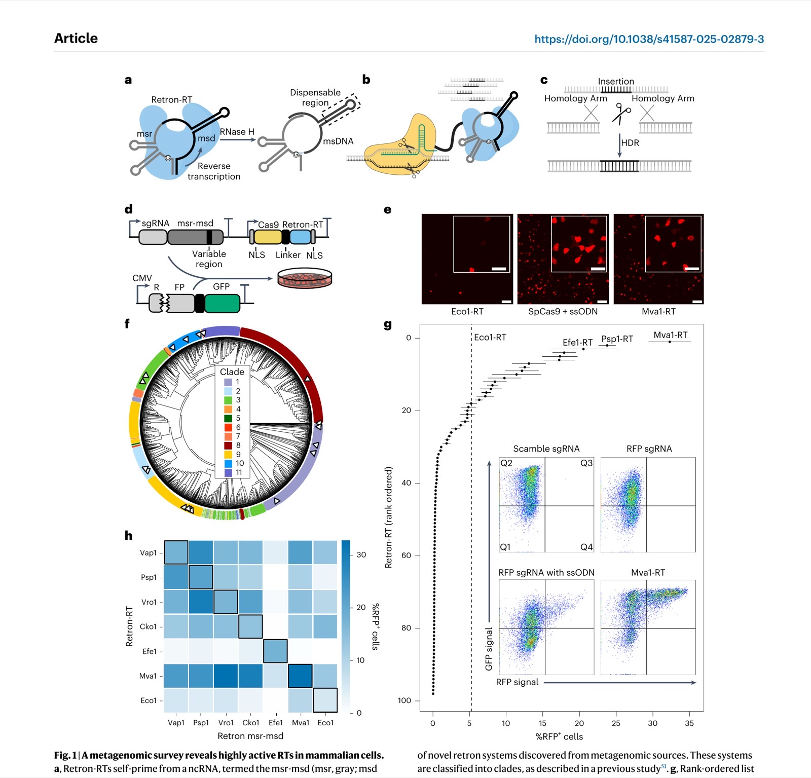
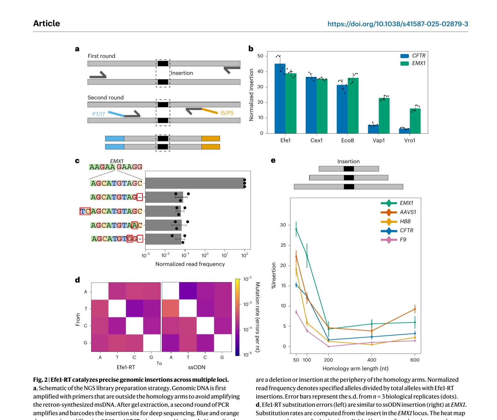
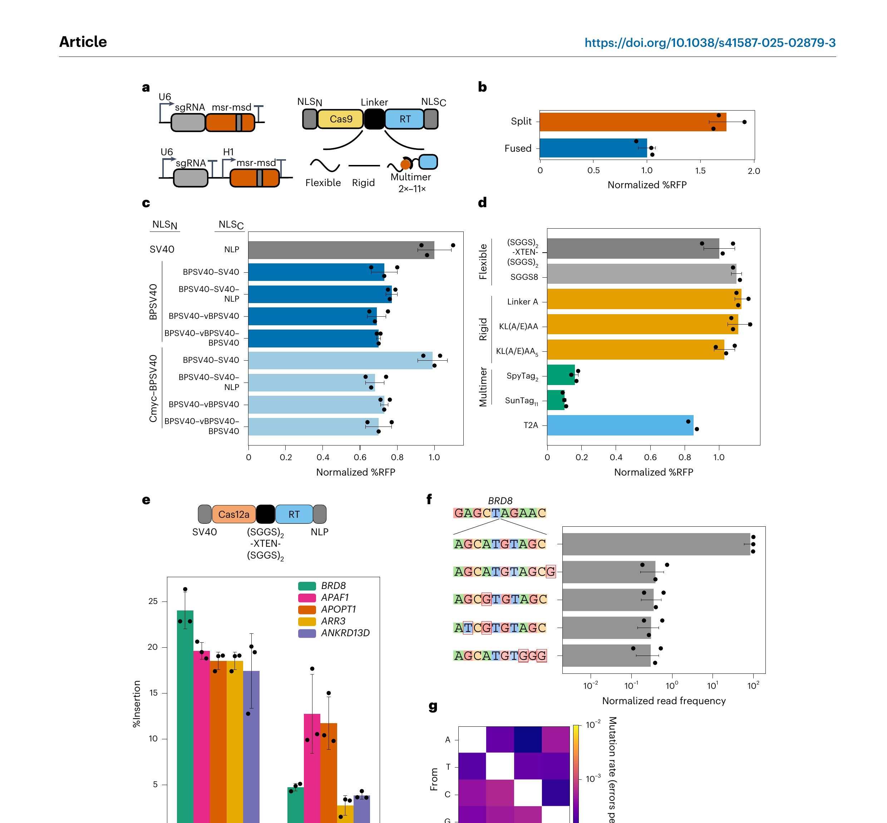
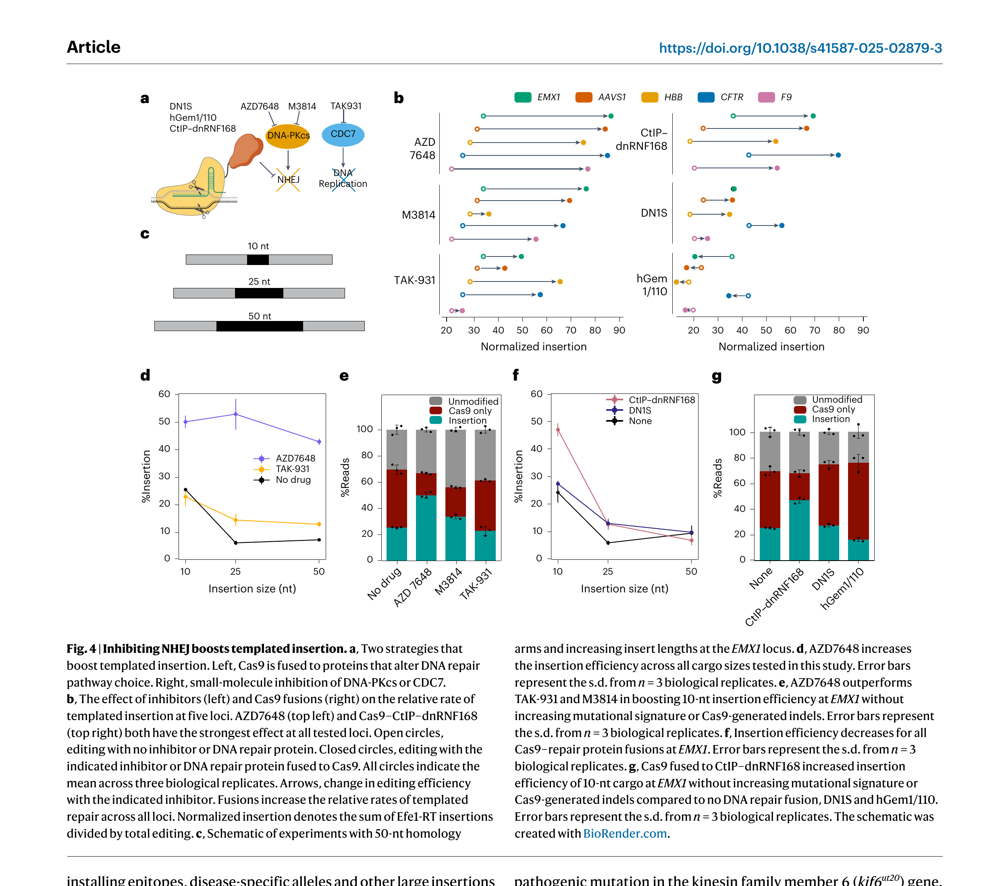
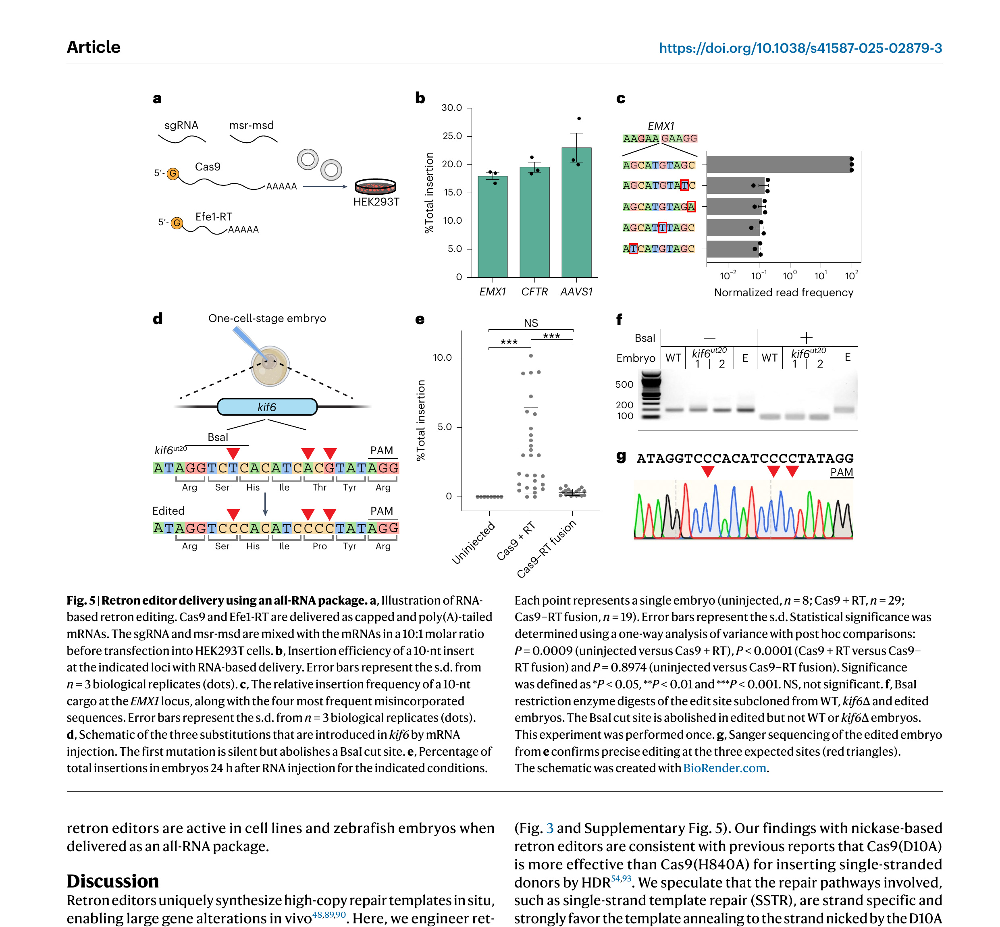

**Jesse D. Buffington\*, Hung-Che Kuo\*, Kuang Hu\*, You-Chiun Chang\*, Kamyab Javanmardi, Brittney Voigt, Yi-Ru Li, Mary E. Little, Sravan K. Devanathan, Blerta Xhemalçe, Ryan S. Gray, and Ilya J. Finkelstein† (\* co-first authors) († corresponding)**

*Nature Biotechnology, 2025*

DOI: [10.1038/s41587-025-02879-3](https://doi.org/10.1038/s41587-025-02879-3)

---

## Abstract

Retrons can produce multicopy single-stranded DNA in cells through self-primed reverse transcription. However, their potential for inserting genetic cargos in eukaryotes remains largely unexplored. Here we report the discovery and engineering of highly efficient retron-based gene editors for mammalian cells and vertebrates. Through bioinformatic analysis of metagenomic data and functional screening, we identify retron reverse transcriptases that are highly active in mammalian cells. Rational design further improves the editing efficiency to levels comparable with conventional single-stranded oligodeoxynucleotide donors but from a genetically encoded cassette. Retron editors exhibit robust activity with Cas12a nuclease and Cas9 nickase, expanding the genomic target scope and bypassing the need for a DNA double-stranded break. Using a rationally engineered retron editor, we incorporate a split GFP epitope tag for live-cell imaging. Lastly, we develop an all-RNA delivery strategy to enable DNA-free gene editing in cells and vertebrate embryos. This work establishes retron editors as a versatile and efficient tool for precise gene editing.

---

## Introduction

Precise genome editing is a cornerstone of biomedicine and gene therapy. However, installing specific edits using templated homology-directed repair (HDR) is limited by the challenge of delivering and integrating an exogenous template DNA into the genome[1–3](#ref1). The most efficient delivery methods are viral vectors and synthetic DNA donors[4–7](#ref4). Viral vectors can induce genotoxicity by insertional mutagenesis, are depleted during the gene-editing window and are not suitable for multiplexed applications[5,7,8](#ref5). Synthetic DNA templates must be transfected or electroporated into cells, do not target the nucleus and are incompatible with RNA-based delivery in cells and organisms[4,6](#ref4). Therefore, recent gene-editing technologies have begun to harness reverse transcriptases (RTs) that can continuously generate the template DNA near its edit site[9–35](#ref9). Among these approaches, retron-RTs are especially promising tools because they are self-priming and can generate high copies of long single-stranded DNAs (ssDNAs) *in vivo*. Notably, retron-RTs direct the ssDNA synthesis machinery to the nucleus rather than relying on passive nuclear import of the single-stranded oligodeoxynucleotide (ssODN).

Retrons are bacterial antiphage defense systems that consist of a self-priming RT, a cognate noncoding (ncRNA) that primes and templates reverse transcription and an accessory protein that participates in anti-viral immunity[36–44](#ref36). The ncRNA encodes two regions including the msDNA-specific region (msr) and the multicopy ssDNA-coding region (msd) ([Fig. 1a](#fig1)). The msr is located at the 5′ end of the ncRNA and forms a specific structure that is recognized by the RT[45,46](#ref45). This region typically contains one to three stable stem loops with 7–10-bp stems and 3–10-nt loops. The msr also includes a highly conserved guanosine residue at the 5′ end, which serves as the branching point for initiating reverse transcription ([Fig. 1a](#fig1)). The msd is positioned downstream of the msr and can be divided into two parts: a dispensable region that can be replaced with a desired sequence (that is, the donor DNA for genome editing) and a conserved region that is essential for the proper folding and function of the ncRNA. The RT primes from the msr and uses the msd as a template[45,46](#ref45). The resulting msDNA remains covalently linked to the ncRNA through a 2′,5′-phosphodiester bond formed between the branching guanosine residue in the msr and the 5′ end of the msDNA[45,46](#ref45). The host RNase H degrades the RNA–DNA hybrid to expose the ssDNA ([Fig. 1a](#fig1), right)[41](#ref41). By replacing the msd with a user-programmable sequence, retron-RTs can generate templates for HDR in cells.

Recent studies have demonstrated the potential of retrons coupled with Cas9 to enhance precise genome editing in bacteria, yeast, plants and mammalian cells[20,21,23,27,29,31,35](#ref20) ([Fig. 1b](#fig1)). Early studies fused the Cas9 single guide RNA (sgRNA) to a retron ncRNA with a modified donor msd[31](#ref31). This increases the local concentration of the donor template at a double-stranded DNA break (DSB), biasing repair toward templated HDR ([Fig. 1c](#fig1)). Alternative designs fused the retron-RT to Cas9 (refs. [21](#ref21),[35](#ref35)). Despite these advances, the potential of retrons for precise genome editing has yet to be fully realized. To date, only a handful of retron-RTs have been benchmarked in mammalian cells. Further engineering of the retron editor system, along with the ncRNA and delivery methods, can further improve editing efficiency. Developing a flexible framework for retron editor optimization will greatly expand the use of this tool across all domains of life.

Here, we report the discovery and engineering of a highly efficient retron gene editor. We bioinformatically identified >500 high-confidence retrons from metagenomic sources. Using a functional reporter system, we screened 98 variants in mammalian cells and identified 17 RTs that were more active than the previously established Eco1-RT. Further rational design achieved editing efficiencies that are comparable to conventional ssODN donors but from a genetically encoded editor. Furthermore, steering DNA repair outcomes toward HDR using small-molecule inhibitors and Cas9–DNA repair protein fusions boosted targeted DNA insertion. Retron editors also function with Cas12a, greatly broadening their genomic target range. The nickase Cas9(D10A) also supports retron editing, and this activity can be improved with DNA repair protein fusions. We apply retron editors for installing in-frame epitopes for live-cell imaging in U2OS cells. Lastly, we demonstrate all-RNA-based retron editing in cell lines and vertebrates. Broadly, this work establishes retron editors as a powerful tool for templated cargo insertion, opening additional gene-editing modalities.

---

## Results

### A metagenomic survey identifies retron-RTs active in mammalian cells

We hypothesized that a metagenomic survey of retron-RTs would uncover variants that improve HDR in heterologous hosts. Toward this goal, we developed a pipeline to phenotypically assess retron-RTs using fluorescent proteins in HEK293T cells ([Fig. 1d](#fig1)). The reporter expresses RFP and GFP that are separated by a ribosomal skipping T2A sequence[47](#ref47). RFP has a 9-bp deletion (∆9) adjacent to a Y64L substitution[48](#ref48). This variant, RFP(∆9), is dark until the wild-type (WT) sequence is restored by templated HDR following a Cas9-generated DSB. GFP serves as a transfection control and also reports on Cas9-generated insertions and/or deletions (indels) that shift the open reading frame out of frame. As expected, transfecting Cas9 and an ssODN restored RFP fluorescence ([Fig. 1e](#fig1), middle). The well-characterized Eco1-RT also repaired RFP, although HDR activity was substantially lower than the ssODN ([Fig. 1e](#fig1), left). The dispensable msd region included 29 nt of homology flanking a 9-nt insertion that paired with the target strand and also reverted the Y64L substitution. Having established this assay, we proceeded to test additional RTs from diverse microorganisms.

Retron-RTs are ubiquitous in bacteria but only a handful have been tested experimentally[32](#ref32). Therefore, we developed a bioinformatics pipeline to identify new retron-RTs from metagenomic sources (Supplementary Fig. 1a). We first annotated all RTs in the National Center for Biotechnology Information (NCBI) database of nonredundant bacterial and archaeal genomes, as well as 2 million partially assembled bacterial genomes from the human microbiome[49,50](#ref49). We reasoned that human microbiome-derived RTs would also be active under physiological conditions. After identifying likely retron-RTs, we searched for the msr-msd ncRNA and accessory proteins. This search identified >500 high-confidence, nonredundant retrons with well-annotated msr-msds (Supplementary Fig. 1b). We classified these systems into a phylogenetic tree and sorted them into 11 clades following a prior bioinformatic survey ([Fig. 1f](#fig1))[51](#ref51). The highest-confidence systems across multiple clades were prioritized for experimental characterization in mammalian cells.

Next, we screened 98 retron-RTs using flow cytometry and the RFP(∆9) reporter ([Fig. 1g](#fig1)). As expected, transfecting the Cas9–sgRNA plasmid with an ssODN partially restored the RFP signal ([Fig. 1g](#fig1), inset). A total of 31 RTs (32% of all tested systems) restored RFP fluorescence (defined as >1% RFP⁺ cells). Eco1-RT restored the RFP⁺ signal in 5% of the cells. Ten RTs had >2-fold higher repair activity than Eco1-RT ([Fig. 1g](#fig1)). Mva1-RT, derived from *Myxococcus vastator*, had an editing efficiency that was sixfold higher than Eco1-RT in this transient repair assay ([Fig. 1g](#fig1), inset). The best-performing RTs all belonged to clade 9, indicating that these enzymes are especially active in mammalian cells and/or our bioinformatics workflow was most accurate in predicting the msr-msd sequences from this clade. The top systems also showed mostly RFP⁺ cells through confocal microscopy ([Fig. 1e](#fig1) and Supplementary Fig. 2a). To test these RTs in a genomic reporter, we also integrated the RFP cassette into the AAVS1 locus of HEK293T cells[52](#ref52). While Eco1-RT was minimally able to restore RFP, the top six RTs were all active in the genomically integrated assay (Supplementary Fig. 2b). *Escherichia fergusonii* (Efe1)-RT was the most active in the genomic reporter, restoring RFP ∼10-fold better than Eco1-RT.

Retron-RTs coevolve with a cognate msr-msd but their ability to reverse-transcribe from the msr-msd of other retrons is unknown. Therefore, we explored the feasibility of using two or more orthogonal RTs for multiplexed retron editing ([Fig. 1h](#fig1)). We tested the RFP repair activity of six active novel RTs, along with Eco1-RT, when coexpressed with the msr-msd from other systems. Mva1-RT, the most broadly cross-reactive RT, only shared 33–36% amino acid sequence identity and 49–59% msr-msd nucleotide identity with all other systems (Supplementary Fig. 3a). In contrast, Efe1-RT shared 44–46% amino acid sequence identity but remained exclusive to its cognate msr-msd. The remaining RTs could use a broad range of msr-msds, including those from Eco1-RT. *Vibrio rotiferianus* (Vro1)-RT and *Vibrio aphrogenes* (Vap1)-RT showed comparable activity with *Proteus* sp. (Psp1) msr-msd and their native msr-msds. Notably, all RTs shared a similar msr-msd secondary structure, including a palindromic repeat and an extended msd hairpin (Supplementary Fig. 3b). We conclude that retron-RTs are more flexible in msr-msd use than previously appreciated and that caution should be taken when combining multiple systems in a single cell line. Furthermore, Efe1-RT is the most active enzyme in the genomic reporter assay and strikes an excellent balance between high activity and specificity for gene-editing applications.

Next, we tested the top-performing RTs for their ability to integrate a 10-nt cargo into native genomic loci ([Fig. 2](#fig2)). Two rounds of PCR were used to generate libraries for next-generation DNA sequencing (NGS) ([Fig. 2a](#fig2)). The first PCR reaction was primed outside the homology arms to avoid amplifying the reverse-transcribed ssDNA. The second PCR reaction barcoded the amplicons for short-read NGS. Cas9 and an ssODN were used as a positive control and to benchmark the RT fidelity. We distinguished retron editing efficiency from Cas9-generated indels by scoring the percentage of modified reads that had the intended insert relative to all modified reads. Efe1-RT showed the highest editing activity at *EMX1* and *CFTR*, consistent with the genomically integrated RFP(∆9) assay ([Fig. 2b](#fig2)). Thus, we selected Efe1-RT for all subsequent experiments.

<figure class="paper-figure" id="fig1">

<figcaption><strong>Figure 1. A metagenomic survey reveals highly active RTs in mammalian cells.</strong> <strong>a</strong>, Retron-RTs self-prime from a ncRNA, termed the msr-msd (msr, gray; msd stem, black; variable region, black, in dotted box). The arrow indicates the direction of reverse transcription. <strong>b</strong>, Schematic of a retron editor. The RT is linked to Cas9 (shown) or another nuclease. <strong>c</strong>, Reverse transcription of the variable region of the msd generates an ssDNA template for HDR of the cleavage site. <strong>d</strong>, A plasmid-encoded fluorescent reporter assay. The RFP has a 9-bp deletion proximal to a Y64L substitution to completely turn off RFP fluorescence. The reporter is cotransfected with a plasmid that encodes the retron editor, along with an msd that repairs the broken RFP. RFP⁺ cells are imaged by confocal microscopy and quantified by flow cytometry. Scale bars, 100 and 50 µm (inset). <strong>e</strong>, Confocal microscopy images of cells transfected with Cas9–Eco1-RT (left), Cas9 + ssODN (middle) and Cas9–Mva1-RT (right). <strong>f</strong>, Phylogenetic classification of novel retron systems discovered from metagenomic sources. These systems are classified into clades, as described in a previous study. <strong>g</strong>, Rank-ordered list of RFP repair efficiency with 98 metagenomically discovered retron-RTs using flow cytometry. Dashed line, RFP⁺ repair with Eco1-RT. Inset, flow cytometry data for Cas9 with a scrambled sgRNA (top left), RFP-targeting sgRNA (top right), RFP sgRNA and an ssODN repair template (bottom left) and RFP sgRNA and Mva1-RT (bottom right). Error bars represent the s.d. from <em>n</em> = 3 biological replicates. The three most active RTs are labeled. <strong>h</strong>, Gene-editing activity of the six most active retron-RTs, along with Eco1-RT with a cognate (diagonal) or noncognate msr-msd. Flow cytometry was used to score activity with the transient RFP reporter. The heat map represents the mean of <em>n</em> = 3 biological replicates. The schematic was created with BioRender.com.</figcaption>
</figure>

Deep sequencing of the insert at the *EMX1* locus showed that >99% of Efe1-RT driven insertion events contained the intended 10-nt cargo ([Fig. 2c,d](#fig2)). The most frequent imperfect insertions included indels and single-nucleotide substitutions that are the signature of alternative end-joining pathways[53,54](#ref53). To determine whether RT fidelity is contributing to this error, we conducted a similar analysis for the Cas9 + ssODN experiment at *EMX1* ([Fig. 2d](#fig2)). Efe1-RT error rates were ∼10⁻³–10⁻⁴ errors per nt, consistent with the substitution rates measured for high-fidelity RTs ([Fig. 2d](#fig2)) *in vitro*[55,56](#ref55). ssODN substitution rates were nearly identical at the same locus. These results indicate that RT-based editing fidelity matches that of chemically synthesized ssODNs and repair fidelity may be limited by cell-intrinsic repair pathways, as discussed below.

We next tested retron editing across five native loci and as a function of the homology arm length. In all cases, inserting 10 nt was most efficient with 50-nt homology arms (7–28% insertion rates across five loci) ([Fig. 2e](#fig2)). Editing efficiency was strongly correlated with Cas9 cleavage activity at each locus. Insertion efficiency generally matched and, in the case of *EMX1* and *HBB*, exceeded the edit rates with Cas9 + ssODN. We conclude that short homology arms support the highest insertion rates.

<figure class="paper-figure" id="fig2">

<figcaption><strong>Figure 2. Efe1-RT catalyzes precise genomic insertions across multiple loci.</strong> <strong>a</strong>, Schematic of the NGS library preparation strategy. Genomic DNA is first amplified with primers that are outside the homology arms to avoid amplifying the retron-synthesized msDNA. After gel extraction, a second round of PCR amplifies and barcodes the insertion site for deep sequencing. Blue and orange denote universal Illumina P5/I5 and P7/I7 adaptors and indices. <strong>b</strong>, Normalized insertion efficiency for the top five retron-RTs at the <em>CFTR</em> and <em>EMX1</em> loci. Error bars represent the s.d. from <em>n</em> = 6 biological replicates (dots). Normalized insertion denotes the sum of retron-RT insertions divided by total editing. <strong>c</strong>, The relative insertion frequency of a 10-nt cargo at the <em>EMX1</em> locus, along with the four most frequent misincorporated sequences. The most common errors are a deletion or insertion at the periphery of the homology arms. Normalized read frequency denotes specified alleles divided by total alleles with Efe1-RT insertions. Error bars represent the s.d. from <em>n</em> = 3 biological replicates (dots). <strong>d</strong>, Efe1-RT substitution errors (left) are similar to ssODN insertion (right) at <em>EMX1</em>. Substitution rates are computed from the insert in the <em>EMX1</em> locus. The heat map represents the sum of substitutions divided by sum of total reads across three biological replicates. <strong>e</strong>, Schematic (top) and results (bottom) of the insertion efficiency with Efe1-RT as a function of the homology arm length. Templated insertion is most active with 50-nt homology arms at five genomic loci. Error bars represent the s.d. from <em>n</em> = 3 biological replicates (dots).</figcaption>
</figure>

### Rational engineering of retron editors increases insertion activity

To further improve insertion activity, we optimized ncRNA expression, nuclear localization signals (NLSs) and the nuclease–RT linker in an Efe1-RT-based retron editor ([Fig. 3](#fig3)). The integrated RFP(∆9) reporter was used for rapid iterative screens. Splitting the sgRNA and msr-msd into two transcripts increased editing efficiency ([Fig. 3a,b](#fig3)). In the 'split' design, sgRNA expression was driven by a U6 promoter and the msr-msd was transcribed by an H1 promoter ([Fig. 3a](#fig3)). These results suggest that fusing the sgRNA and the msr-msd may impact Cas9 and/or RT activity, possibly by misfolding the structural elements of each ncRNA or by imposing additional steric constraints. All subsequent experiments used the split design.

Nuclear import can be a rate-limiting factor in mammalian gene editing[57–62](#ref57). Therefore, we tested 25 N-terminal and C-terminal NLS combinations that were previously reported to improve Cas9-based gene editing ([Fig. 3c](#fig3) and Supplementary Table 5). A combination of N-terminal and C-terminal bipartite SV40 (BP-SV40) NLSs showed the highest RFP repair activity. Adding cMyc-SV40 to the N terminus and two or more SV40s to the C terminus increased Cas9 cleavage 1.6-fold relative to an N-terminal SV40 and C-terminal NLP signal, as measured by a reduction in GFP⁺ cells. However, this did not increase templated DNA insertion ([Fig. 3c](#fig3)). Retron-RTs interact extensively with their ncRNA and msDNA through their C-terminal domains[43,63](#ref43). An extended C-terminal NLS may impair this interaction, reducing overall repair activity but not Cas9-catalyzed DNA cleavage. We conclude that nuclear import is likely not the limiting factor for templated insertion.

The linker between the nuclease and the RT can also impact editing outcomes. We tested 15 linkers with various physical properties, including a ribosomal skipping T2A sequence between Cas9 and Efe1-RT ([Fig. 3d](#fig3) and Supplementary Table 6). Separating the two enzymes by a T2A sequence reduced RFP⁺ cells by 20% relative to the reference linker, (SGGS)₂-XTEN-(SGGS)₂ (ref. [64](#ref64)). Next, we tested a panel of flexible (for example, (GGS)ₙ) and rigid (for example, (KL(A/E)AA)ₙ) linkers. Retron editors accommodated a broad range of linker designs (Supplementary Table 6). However, multimerizing the RT on Cas9 using SpyTags or SunTags reduced the RFP⁺ signal by 85–90%[65](#ref65). As Cas9–SunTag and SpyTag–Cas9 fusions are reportedly active in mammalian cells, we speculate that multimerization disrupts RT activity[65,66](#ref65). We conclude that retron editors can accommodate a broad range of linker geometries and even split enzyme designs.

To expand the retron editor target range, we tested Efe1-RT with WT AsCas12a and AsCas12a Ultra at five genomic loci ([Fig. 3e–g](#fig3))[67](#ref67). Cas12a and Efe1-RT were fused by an (SGGS)₂-XTEN-(SGGS)₂ linker and the CRISPR RNA (crRNA) and msr-msd were expressed from independent promoters. In all cases, AsCas12a Ultra–RT fusions had higher insertion activity than WT AsCas12a ([Fig. 3e](#fig3)). This higher activity is due to the increased cleavage by AsCas12a Ultra relative to WT enzyme (Supplementary Fig. 4). Deep sequencing of the *BRD8* locus confirmed that 99% of the inserts had the insert sequence ([Fig. 3f](#fig3)). The most frequent error was an indel outside of the immediate insert site, followed by mismatches within the insert. Base substitution rates across five genomic loci closely matched the pattern that was observed at *EMX1* and were nearly identical to Cas9 + ssODN donor ([Figs. 2d](#fig2) and [3g](#fig3)). In sum, retron editors can be assembled from a broad range of ncRNA, NLS and linker configurations and can be paired with Cas9 and Cas12a nucleases to expand their target range.

<figure class="paper-figure" id="fig3">

<figcaption><strong>Figure 3. Rational engineering of an Efe1-RT-based retron editor.</strong> <strong>a</strong>, Left, we tested the effect of splitting the sgRNA and msr-msd. Bottom, the identity of the NLSs and the linker between the Cas9 and Efe1-RT. <strong>b</strong>, Expressing the sgRNA and msr-msd increased gene editing by 60% relative to a fused sgRNA–msr-msd design. Normalized %RFP denotes the percentage of RFP⁺ cells normalized to a fused sgRNA–ncRNA retron editor. Error bars represent the s.d. from <em>n</em> = 3 biological replicates (dots). <strong>c</strong>, Optimization of the N-terminal and C-terminal NLSs. Gray, reference design used for normalization. Normalized %RFP denotes the percentage of RFP⁺ cells normalized to SV40-NLP NLSs. Error bars represent the s.d. from <em>n</em> = 3 biological replicates (dots). <strong>d</strong>, Optimization of the linker peptide between Cas9 and Efe1-RT. Retron editors tolerate a broad range of flexible (light gray) and rigid (orange) linkers. However, multimerization domains abrogate activity (green). Dark gray, reference design used for normalization. Normalized %RFP denotes the percentage of RFP⁺ cells normalized to the (SGGS)₂-XTEN-(SGGS)₂ peptide linker. Error bars represent the s.d. from <em>n</em> = 3 biological replicates (dots). T2A linker, <em>n</em> = 2 biological replicates (dots). <strong>e</strong>, Schematic (top) and editing activity (bottom) of a Cas12a-based retron editor at five genomic loci. Error bars represent the s.d. from <em>n</em> = 3 biological replicates (dots). <strong>f</strong>, The relative insertion frequency of a 10-nt cargo at the <em>BRD8</em> locus, along with the four most frequent misincorporated sequences. In contrast to Cas9-based retron editors, Cas12a retron editors generate substitution errors in the insert. Normalized read frequency denotes specified alleles divided by total alleles with Efe1-RT insertions. Error bars represent the s.d. from <em>n</em> = 3 biological replicates (dots). <strong>g</strong>, Insert substitution frequencies across five loci. The heat map represents the sum of substitutions divided by sum of total reads (<em>n</em> = 15).</figcaption>
</figure>

### Channeling repair pathway choice increases insertion efficiency

DNA repair by nonhomologous end joining (NHEJ) limits templated DNA insertion in mammalian cells[54,68](#ref54). To further increase retron editing efficiency, we sought to channel repair away from NHEJ through two approaches ([Fig. 4a](#fig4)). First, we focused on small-molecule inhibitors that inhibit NHEJ or enhance HDR. AZD7648 and M3814 inhibit the DNA-dependent protein kinase catalytic subunit (DNA-PKcs) to improve templated repair of Cas9 breaks[69–72](#ref69). TAK-931 is a CDC7-selective inhibitor that arrests cells in the S phase, thereby increasing the HDR time window[73](#ref73). We first established the optimal working concentrations for each inhibitor (Supplementary Fig. 5a). All three inhibitors improved insertion activity, with the strongest improvements with AZD7648 at all loci ([Fig. 4b](#fig4), left). In contrast, M3814 showed strong improvements at all loci except *HBB*.

Next, we tested whether retron editors can insert larger cargos with 50-nt homology arms and how this is modulated by inhibitors or DNA repair proteins ([Fig. 4c](#fig4)). Without any drugs, insertion activity declined rapidly beyond 10-nt cargos. To understand the mechanism of this decline, we directly quantified ssDNA production by Efe1-RT (Supplementary Fig. 7). The inverse relationship between template length and ssDNA copy number confirmed that longer templates are produced at lower concentrations and/or rapidly degraded *in vivo* (Supplementary Fig. 7c).

AZD7648 stimulated insertion of 25-nt and 50-nt cargos by 8.8-fold and 6.0-fold respectively at *EMX1* ([Fig. 4d](#fig4)). TAK-931 showed more modest 2.4-fold and 1.8-fold editing increases for 25-nt and 50-nt cargos, respectively. A comparison of Cas9-generated indels and retron-driven insertions confirmed that AZD7648 does not increase Cas9 cleavage but increases the use of a template ssDNA for genomic repair. Furthermore, AZD7648 reduced the mutational signature at the target site, further highlighting the utility of repair pathway modulation in retron editing applications.

Cas9 fusion proteins can improve templated DNA insertion locally without perturbing repair pathways globally[54](#ref54). We focused on three fusions that have been previously characterized across multiple loci and cell types ([Fig. 4a,b](#fig4), right)[74–76](#ref74). Fusing Cas9 with the HDR-promoting CtIP and a dominant-negative RNF168 (dnRNF168) increased retron editing efficiency 1.8–2.5-fold across five loci. A dominant-negative mutant of 53BP1 (DN1S) had variable effects across the five loci, with no improvements at *EMX1* ([Fig. 4b](#fig4), right)[75](#ref75). Fusion of Cas9 to the N-terminal region of human Geminin limits Cas9 expression to the S, G2 and M phases of the cell cycle when HDR is most active[77](#ref77). However, Cas9–hGem1/110 fusions either decreased or had no effect on retron editing activity ([Fig. 4b](#fig4), right). This result may reflect the mechanistic differences between ssODN and double-stranded donor DNA repair pathways (Discussion). Combining Cas9–CtIP–dnRNF168 fusions with AZD7648 and TAK-931 did not improve editing any further at *EMX1* (Supplementary Fig. 5b). This finding is consistent with the hypothesis that Cas9–CtIP–dnRNF168 and AZD7648 both downregulate NHEJ, albeit through different mechanisms. In contrast, retron-mediated insertion with Cas9–DN1S and Cas9–hGem1/110 fusions was higher with AZD7648 and TAK-931 but never exceeded AZD7648 or Cas9–CtIP–dnRNF168 alone. We conclude that selective inhibition of DNA-PKcs greatly improves retron-mediated gene editing.

Next, we tested retron editing activity with the nickases Cas9(D10A) and Cas9(H840A) and their fusions with DNA repair proteins (Supplementary Fig. 5c–e). On their own, both nCas9(D10A) and nCas9(H840A) paired with Efe1-RT yielded a baseline insertion rate of 1% at the *EMX1* locus. However, their performance diverged substantially when fused to DNA repair proteins. Fusions of Cas9(D10A) to CtIP–dnRNF168, the ATPase deficient recombinase hRad51(K133R) and the processive helicase Rep-X all increased templated insertion rates by 3.3, 2.5 and 3.3-fold, respectively[78,79](#ref78). In contrast, the equivalent fusions with Cas9(H840A) did not improve editing efficiency. These results suggest that Cas9(D10A) but not Cas9(H840A) retron editors can be used for DSB-free editing.

<figure class="paper-figure" id="fig4">

<figcaption><strong>Figure 4. Inhibiting NHEJ boosts templated insertion.</strong> <strong>a</strong>, Two strategies that boost templated insertion. Left, Cas9 is fused to proteins that alter DNA repair pathway choice. Right, small-molecule inhibition of DNA-PKcs or CDC7. <strong>b</strong>, The effect of inhibitors (left) and Cas9 fusions (right) on the relative rate of templated insertion at five loci. AZD7648 (top left) and Cas9–CtIP–dnRNF168 (top right) both have the strongest effect at all tested loci. Open circles, editing with no inhibitor or DNA repair protein. Closed circles, editing with the indicated inhibitor or DNA repair protein fused to Cas9. All circles indicate the mean across three biological replicates. Arrows, change in editing efficiency with the indicated inhibitor. Fusions increase the relative rates of templated repair across all loci. Normalized insertion denotes the sum of Efe1-RT insertions divided by total editing. <strong>c</strong>, Schematic of experiments with 50-nt homology arms and increasing insert lengths at the <em>EMX1</em> locus. <strong>d</strong>, AZD7648 increases the insertion efficiency across all cargo sizes tested in this study. Error bars represent the s.d. from <em>n</em> = 3 biological replicates. <strong>e</strong>, AZD7648 outperforms TAK-931 and M3814 in boosting 10-nt insertion efficiency at <em>EMX1</em> without increasing mutational signature or Cas9-generated indels. Error bars represent the s.d. from <em>n</em> = 3 biological replicates. <strong>f</strong>, Insertion efficiency decreases for all Cas9–repair protein fusions at <em>EMX1</em>. Error bars represent the s.d. from <em>n</em> = 3 biological replicates. <strong>g</strong>, Cas9 fused to CtIP–dnRNF168 increased insertion efficiency of 10-nt cargo at <em>EMX1</em> without increasing mutational signature or Cas9-generated indels compared to no DNA repair fusion, DN1S and hGem1/110. Error bars represent the s.d. from <em>n</em> = 3 biological replicates. The schematic was created with BioRender.com.</figcaption>
</figure>

### Retron editing in other cell lines and vertebrates

As a proof of principle, we next used retron editors to insert a split GFP for live-cell imaging of endogenously expressed proteins in U2OS cells. GFP1–10, comprising the first ten GFP β-strands, is expressed from an integrated and inducible promoter (Supplementary Fig. 8). The 11th β-strand is fused to the protein of interest by a short linker. GFP1–10 is not fluorescent until it is complemented by GFP11 because chromophore maturation requires a critical GFP11-encoded glutamic acid[80](#ref80). Thus, fusing GFP11 to a target protein allows visualization of subcellular localization in live cells[81–83](#ref81).

We targeted two proteins for endogenous GFP11 tagging by retron editors. The dispensable msd region was replaced with a 197-nt DNA template that included 70-nt homology arms, a 9-nt linker encoding Gly-Gly-Gly and the 48-nt GFP11 epitope. To maximize the integration efficiency, cells were transfected with Cas9–CtIP–dnRNF168. Then, 72 h after transfection, GFP1–10 was induced for 48 h and GFP⁺ cells were collected using fluorescence-activated cell sorting (FACS). Confocal imaging of the insertion region confirmed the genomic edit (Supplementary Fig. 8c). These results demonstrate that Efe1-RT can synthesize 200-nt ssDNAs. More broadly, this approach can be readily used for installing epitopes, disease-specific alleles and other large insertions across the entire proteome from a genetically encoded cassette.

To expand retron editors beyond plasmid-based expression, we tested delivery in an all-RNA format ([Fig. 5](#fig5)). In these experiments, Cas9 and Efe1-RT mRNAs were transcribed, 5′-capped and 3′-poly(A)-tailed *in vitro*. The msr-msd was *in vitro* transcribed and the sgRNAs were chemically synthesized ([Fig. 5a](#fig5)). To optimize our four-component RNA cocktail, we first fixed the Cas9 mRNA to sgRNA mass ratio at 2:1 on the basis of prior studies, while varying the ratio of Efe1-RT mRNA to the msr-msd RNA template[84–87](#ref84). We then determined the optimal amount of each component by testing insertions of a 10-nt cargo with 50-nt homology arms at the *EMX1* locus (Supplementary Fig. 6). Maximum insertion efficiency was achieved with 150 ng of Efe1-RT mRNA and 600 ng of msr-msd. Using this optimized formulation, we obtained insertion efficiencies of 23.0%, 19.6% and 17.9% at the *AAVS1*, *CFTR* and *EMX1* loci, respectively. Optimizing the untranslated regions, chemical modifications and mRNA-to-ncRNA ratio may further boost editing at therapeutically relevant loci. We conclude that retron editors are compatible with direct RNA delivery.

We next tested the repair of a pathogenic mutation by mRNA-based retron editing in zebrafish. We designed an sgRNA to target a pathogenic mutation in the kinesin family member 6 (*kif6*ut20) gene. Mutations in *kif6*ut20 cause scoliosis in zebrafish and are linked to neurological defects in humans[88](#ref88). The msd was designed to correct two base mutations that reverted a pathogenic Pro→Thr substitution. In addition, we introduced a silent T→C mutation that abolished a BsaI cleavage site for downstream restriction enzyme analysis ([Fig. 5e,f](#fig5)). Embryos were injected with the sgRNA, msr-msd and a fused Cas9–RT or split Cas9 and Efe1-RT mRNAs. Genomic DNA was isolated 24 h after injection and submitted to NGS, restriction enzyme digestion and Sanger sequencing ([Fig. 5d–f](#fig5)). As expected, untreated controls did not show any editing. Injecting Cas9 and Efe1-RT mRNAs, along with the two ncRNAs, induced edits up to 10% of all reads from crude genomic preparations. The fused Cas9–RT mRNA showed reduced editing as compared to the split mRNAs ([Fig. 5e](#fig5)). This may be because of the stability of the fusion mRNA in zebrafish. To further confirm retron editing, we subcloned the genomic DNA and subjected it to restriction enzyme and Sanger sequencing analysis ([Fig. 5f,g](#fig5)). BsaI treatment of the edited but not WT and *kif6*ut20 embryos resulted in a single band, indicating the expected cleavage pattern. Sanger sequencing of the insert site subcloned from an edited embryo also showed the expected edits. Collectively, these results indicate that retron editors are active in cell lines and zebrafish embryos when delivered as an all-RNA package.

<figure class="paper-figure" id="fig5">

<figcaption><strong>Figure 5. Retron editor delivery using an all-RNA package.</strong> <strong>a</strong>, Illustration of RNA-based retron editing. Cas9 and Efe1-RT are delivered as capped and poly(A)-tailed mRNAs. The sgRNA and msr-msd are mixed with the mRNAs in a 10:1 molar ratio before transfection into HEK293T cells. <strong>b</strong>, Insertion efficiency of a 10-nt insert at the indicated loci with RNA-based delivery. Error bars represent the s.d. from <em>n</em> = 3 biological replicates (dots). <strong>c</strong>, The relative insertion frequency of a 10-nt cargo at the <em>EMX1</em> locus, along with the four most frequent misincorporated sequences. Error bars represent the s.d. from <em>n</em> = 3 biological replicates (dots). <strong>d</strong>, Schematic of the three substitutions that are introduced in <em>kif6</em> by mRNA injection. The first mutation is silent but abolishes a BsaI cut site. <strong>e</strong>, Percentage of total insertions in embryos 24 h after RNA injection for the indicated conditions. Each point represents a single embryo (uninjected, <em>n</em> = 8; Cas9 + RT, <em>n</em> = 29; Cas9–RT fusion, <em>n</em> = 19). Error bars represent the s.d. Statistical significance was determined using a one-way analysis of variance with post hoc comparisons: <em>P</em> = 0.0009 (uninjected versus Cas9 + RT), <em>P</em> < 0.0001 (Cas9 + RT versus Cas9–RT fusion) and <em>P</em> = 0.8974 (uninjected versus Cas9–RT fusion). Significance was defined as &#42;<em>P</em> < 0.05, &#42;&#42;<em>P</em> < 0.01 and &#42;&#42;&#42;<em>P</em> < 0.001. NS, not significant. <strong>f</strong>, BsaI restriction enzyme digests of the edit site subcloned from WT, <em>kif6</em>∆ and edited embryos. The BsaI cut site is abolished in edited but not WT or <em>kif6</em>∆ embryos. This experiment was performed once. <strong>g</strong>, Sanger sequencing of the edited embryo from <strong>e</strong> confirms precise editing at the three expected sites (red triangles). The schematic was created with BioRender.com.</figcaption>
</figure>

---

## Discussion

Retron editors uniquely synthesize high-copy repair templates *in situ*, enabling large gene alterations *in vivo*[48,89,90](#ref48). Here, we engineer retron editors for precise genome engineering in mammalian cells and zebrafish embryos. Our metagenomic survey yielded 17 RTs that outperform Eco1-RT in mammalian cells. Efe1-RT, the lead candidate, is highly active, specific for its cognate RNA and capable of generating at least ∼200-nt ssDNAs *in vivo* ([Fig. 1](#fig1)). The most active RTs in our survey were all derived from clade 9. A recent bacterial functional screen also concluded that RTs in this clade generate high ssDNA levels in *Escherichia coli*[20](#ref20). Additional structure–function studies will be required to dissect the mechanistic basis for this higher activity. Lastly, we demonstrated retron editor delivery in an all-RNA format ([Fig. 5](#fig5)). We anticipate that further optimizations, such as increasing mRNA and ncRNA stability will further improve editing efficiency, as discussed below.

We iteratively improved on prior designs by optimizing the NLS, nuclease–RT linkers and nuclease combinations ([Fig. 3](#fig3)). The linker and NLS are key design components for both base and prime editors[91,92](#ref91). In contrast, we show that retron editors can accommodate diverse NLS and linker combinations. Importantly, retron editors are compatible with Cas9, Cas12a and even the nickase Cas9(D10A) ([Fig. 3](#fig3) and Supplementary Fig. 5). Our findings with nickase-based retron editors are consistent with previous reports that Cas9(D10A) is more effective than Cas9(H840A) for inserting single-stranded donors by HDR[54,93](#ref54). We speculate that the repair pathways involved, such as single-strand template repair (SSTR), are strand specific and strongly favor the template annealing to the strand nicked by the D10A variant. Further studies will be required to fully dissect the machinery involved in repairing single-stranded breaks generated by different nickases. Cas12a-based retron editors further expand the potential target range and create opportunities for multiplexed retron editing because of Cas12a's ability to process its crRNA[91](#ref91). To facilitate broader adoption by the gene-editing community, we developed a plasmid system that simplifies retron editor assembly by a single Golden Gate cloning step (Supplementary Fig. 9)[94](#ref94). We also anticipate that retron-RTs will be compatible with other established methods, such as transcription-activator-like effectors and emerging RNA–DNA-guided nucleases. Importantly, further development of nickase-based retron editors promises to avoid the induction of DSBs (Supplementary Fig. 5).

We found that ssDNA concentration directly correlates with the decrease in insertion efficiency observed for longer cargos (Supplementary Fig. 7). Engineering the RT and ncRNA to increase ssDNA production may facilitate larger edits. For example, rational engineering of a retron-RT-based prime editor boosted editing efficiency >8-fold[12](#ref12). Additional key design parameters include the msr-msd structure, homology arm length, strand selection and template sequence. Optimizing these features, along with ncRNA stabilization strategies (for example, circularization, pseudoknots and chemical modifications)[95](#ref95), will establish retron editors as versatile tools for precision genome engineering.

The repair of DSBs with an ssODN proceeds through single-strand template repair (SSTR)[96–98](#ref96). Our results are also consistent with an SSTR-based repair mechanism for retron editors. First, NHEJ inhibitors increase retron editing and reduce NHEJ-associated indels for both Cas9 and Cas12a across all tested target sites ([Fig. 4](#fig4)). Second, fusing Cas9 with a dominant-negative allele of 53BP1 or with the DNA resection-promoting CtIP also increases retron editor efficiency. Third, we observed that 36–50-nt homology arms are optimal for retron editors ([Fig. 2](#fig2)). Similarly, SSTR is maximized with 30–60-nt homology arms[99,100](#ref99). SSTR is a RAD52-dependent process in yeast and human cells, suggesting that nuclease–RAD52 and/or RT–RAD52 fusions may boost retron editing[74,101](#ref74). SSTR competes with two error-prone DSB repair pathways: classical NHEJ and polymerase θ-mediated end joining (TMEJ)[53,102](#ref53). Dual inhibition of NHEJ and TMEJ may further synergize with RAD52 fusions[47,72](#ref47). Rational design of asymmetric templates, cleavage-blocking mutations and dual Cas9 nickases are additional avenues for maximizing editing efficiency[100,103](#ref100). Mechanistic studies of retron editor-mediated repair will further improve editing outcomes across all domains of life.

In conclusion, retron editors are emerging as a highly promising gene-editing tool. Their unique ability to accurately insert or replace sizeable DNA segments opens up possibilities for correcting complex genetic mutations that were previously challenging to address. Compatibility with an all-RNA formulation opens additional avenues for therapeutic delivery into cells and organisms. Additionally, retron editors are poised to broaden the scope of high-throughput functional screens, allowing for the characterization of complex genetic variants with single-base resolution. Integration of retron editors into existing screening pipelines holds great promise for advancing our understanding of gene function and regulation, ultimately paving the way for improved therapeutic interventions and biotechnological applications.

---

## Methods

### Oligonucleotides and plasmids

Retron-RT and ncRNA gene blocks were ordered from Integrated DNA Technologies or Twist Biosciences and cloned into a GFP dropout entry vector by Golden Gate assembly. mRNAs were purchased from Cisterna Biologics. Retron editor expression plasmids were assembled by combining the sgRNA, retron msr-msd, RT and SpCas9 or AsCas12a in a ccdB-dropout mammalian expression vector using Golden Gate assembly. A plasmid encoding SpCas9 and Efe1-RT is available on Addgene (237445), where the user can clone in a gene block containing a gRNA–H1 promoter–ncRNA (containing user-defined cargo).

### Tissue culture

HEK293T cells were generously provided by X. A. Cambronne. HEK293T and U2OS cells were cultured in DMEM with 10% FBS (Gibco) and 1% penicillin–streptomycin (Gibco). All cell lines were cultured and maintained at 37 °C and 5% CO₂. U2OS FlpIn TREx GFP1–10 were generated by stably integrating a GFP1–10 construct at the single FRT locus through dual transfection of pcDNA5/FRT/TO/Intron-eGFP1–10 and pOG44 plasmids in a 1:10 ratio and subsequent selection with hygromycin at 200 µg ml⁻¹ and blasticidin at 15 µg ml⁻¹.

### Metagenomic discovery

To find new retrons, we searched the NCBI genome and metagenomic contigs for the retron-RT gene using hidden Markov models (HMMER) and a database containing all experimentally validated retron-RT with a permissive e-value threshold of 10⁻⁴. We next established a pipeline to detect structured RNAs near retron-RT sequences. Initially, each experimentally validated msr-msd transcript and its close counterparts served as seeds for CMfinder 0.4.1, an RNA motif predictor that leverages both folding energy and sequence covariation. Covariate models were then crafted with Infernal suite's cmbuild and used to search for analogous structures around the start of the RT open reading frame. We manually inspected the msr-msd regions of all retron candidates, especially those that did not return any hits using the automated pipeline. RNAfold was used to inspect structured regions and to compare them to known msr-msd transcripts. We then used MAFFT-Q-INS-i for multiple alignments, focusing on identifying conserved sequences in related genomes. Subsequently, we pruned the alignments at the a1 and a2 areas, cycling back to earlier pipeline steps to acquire more sequences from both ends. R-scape was used to pinpoint covarying base pairs in the suggested consensus structures, mitigating the influence of phylogenetic correlations and base composition biases not attributed to conserved RNA structure. Accessory retron genes adjacent to the RT were annotated using the Pfam database as a query and HMMER. High-confidence retron systems were manually inspected to confirm the expected protein domains, catalytic residues and ncRNA structure. To remove redundant sequences, all putative hits were clustered with CD-HIT, setting a sequence identity threshold at 90% and an alignment overlap of 80%. The clustered datasets were then transformed into phylogenetic trees and candidates for validation were selected on the basis of their positioning in the tree.

To organize the retron-RTs into phylogenetic groups, we used MAFFT software and progressive methods for multiple-sequence alignments (MSAs). An MSA was constructed from the RT0–7 domain of 1,912 sequences, sourced from a dataset of 9,141 entries previously categorized as retron or retron-like RTs and an additional 16 RTs from experimentally verified retrons. Phylogenetic trees were generated using FastTree, applying the WAG evolutionary model, combined with a discrete gamma model featuring 20 rate categories. Specifically, the RT tree was crafted using IQ-TREE version 1.6.12, incorporating 1,000 ultrafast bootstraps (UFBoot) and the SH-like approximate likelihood ratio test (SH-aLRT) with 1,000 iterations. The best-fit model, identified by Modelfinder as LG+F+R10 because of its minimal Bayesian information criterion value among 546 protein models, was used. The RT clades' internal nodes exhibited UFBoot and SH-aLRT support values exceeding 85%.

### Plasmid-based fluorescent reporter assays

A total of 1.2 × 10⁵ HEK293T cells were seeded in a 24-well plate 18–24 h before transfection. Then, 0.35 µg of the retron editor plasmid and 0.35 µg of the fluorescent reporter plasmid were cotransfected using Lipofectamine 2000 (Invitrogen). Cells were trypsinized and collected for flow analysis 72 h after transfection. Flow analysis was conducted on a Novocyte flow cytometer (ACEA Biosciences). Cells were gated to exclude dead cells and doublet and 10,000 cells were analyzed in all samples. Cells were then gated by FITC-A (x axis) and PE–Texas Red-A (y axis). The editing efficiency was reported as the percentage of cells in the quadrant of FITC-A and PE–Texas Red-A.

### Genomic reporter assays

The fluorescent reporter was cloned in a plasmid designed for Bxb1 recombinase-driven landing pad system. This plasmid was transfected into landing pad HEK293T cells followed by doxycycline induction and AP1903 selection to generate stably integrated reporter cells. A total of 1.2 × 10⁵ HEK293T reporter cells were seeded in a 24-well plate 18–24 h before transfection. Next, 1 µg of the retron editor plasmid was transfected using Lipofectamine 2000. Then, 48–72 h after transfection, cells were treated with doxycycline to induce the expression of the fluorescent reporter. Cells were trypsinized and collected for flow analysis and genomic DNA extraction (Qiagen DNeasy blood and tissue kit). Normalized insertion is defined as total insertion/total editing. Normalized read frequency is defined as the frequency of an insertion event/total insertion events.

### Confocal imaging

HEK293T cells were seeded and transfected as described for the plasmid-based fluorescent reporter assay. Then, 48 h after transfection, cells were seeded into 15-mm glass-bottom cell culture dishes (NEST) and incubated for an additional 24 h. Cells were then imaged with a Nikon Ti2 spinning disk confocal microscope at ×20 magnification. Images (8,858 × 8,858 pixels) were acquired and processed using ImageJ.

U2OS FlpIn TREx GFP1–10 cells were transfected with 1 µg of retron editor plasmids that target the N or C terminus of the protein of interest to insert a GFP11 fragment. Then, 48–72 h after transfection, cells were expanded into 10-cm plates. Cells with high GFP intensities were then sorted by a cell sorter (Sony MA900). For confocal imaging, cells were incubated with doxycycline for 48–72 h before imaging to induce the expression of the GFP1–10 construct. Image acquisition was performed with live cells under a spinning disk confocal microscope (Olympus).

### NGS

Genomic samples were subjected to two rounds of PCR for NGS library preparation (Supplementary Table 2). The first round of PCR was performed using the KOD One PCR master mix (Toyobo). Primers were designed ∼600 bp away from the cut site on each side to avoid amplifying the RT-generated ssDNA. PCR products were gel-purified and barcoded by a second round of PCR with Illumina P5/P7 adaptors using Q5 HotStart high-fidelity master mix (New England Biolabs). PCR amplicons were sequenced on an Illumina Novaseq. Reads were demultiplexed using NovaSeq Reporter (Illumina). Alignment of amplicon sequences to a reference sequence was performed using CRISPResso2. The aligned sequences were first checked for the expected cargo insertion. Next, the homology arms and insertion sequences were further checked for any mismatches or deletions. We considered a 'perfect edit' any sequence that had the expected insertion only, with no additional mismatches and deletions. If these events also had a mismatch or deletion, we counted it as an 'imperfect' edit. Any insertions, deletions or mismatches that did not have the intended cargo were surmised to be from nuclease-only activity.

### *In vitro* transcription of the msr-msd

The msr-msd was PCR-amplified from a plasmid or gene block with a T7 promoter. The ncRNA was generated using the HiScribe T7 high-yield RNA synthesis kit (New England Biolabs) according to the manufacturer's protocol. RNA products were purified using the RNeasy Mini Kit (Qiagen).

### mRNA transfection

A total of 2 × 10⁴ HEK293T cells were seeded in a 96-well plate 18–24 h before transfection. Then, 772 ng of RNA cocktail containing *in vitro* transcribed ncRNA and capped and poly(A)-tailed mRNAs were transfected using Lipofectamine MessengerMAX (Thermo Fisher Scientific) following the manufacturer's protocol. Cells were harvested 72 h after transfection for downstream analyses including fluorescence imaging, ssDNA purification or NGS.

### ssDNA purification and detection

ssDNAs were expressed in HEK293T cells by mRNA transfection as described above. Then, 72 h after transfection, cells were harvested and total genomic DNA was extracted using a genomic DNA purification kit. ssDNAs were subsequently enriched and purified following the protocol provided with the ssDNA purification kit (Zymo Research, D7011). ssDNAs were amplified by PCR using a 5′ end-labeled oligonucleotide primer prepared as described above. Amplification was carried out under standard cycling conditions for 30 cycles. PCR products were analyzed on a denaturing polyacrylamide gel and imaged using a Typhoon FLA 9500 phosphorimager.

### [γ-³²P]ATP 5′ end labeling of DNA oligonucleotides

DNA oligonucleotides were 5′ end-labeled with T4 polynucleotide kinase (PNK) and [γ-³²P]ATP. Then, 50 µM of DNA oligonucleotides were incubated in a 5-µl reaction containing 1× T4 PNK buffer (New England Biolabs), 10 U of T4 PNK and 5 mCi of [γ-³²P]ATP. The labeling reaction was incubated at 37 °C for 60 min. To quench the reaction, 1 µl of quench buffer was added to each sample (60% glycerol, 0.025% bromophenol blue and 10 mM EDTA). Labeled DNA samples were separated on a 12% denaturing polyacrylamide gel. After electrophoresis, the gel was imaged using a Typhoon FLA 9500 phosphorimager (500 photomultiplier tube, 100-µm resolution) and bands were identified and excised with razor blades. To elute labeled DNA, slices were placed in 1.6-ml tubes with 200 µl of TE buffer and incubated overnight at 4 °C for passive elution. All radioactive procedures were carried out in accordance with University of Texas at Austin radiation safety guidelines.

### Zebrafish maintenance and gene editing

All zebrafish experiments were performed according to University of Texas at Austin Institutional Animal Care and Use Committee standards. Embryos were raised at 28.5 °C in fish water (0.15% Instant Ocean in reverse osmosis water). WT and *kif6*ut20(P293T) mutants were in-crossed and one-cell-stage embryos were injected with 1 nl of the injection mix using a microinjector-pump system (World Precision Instruments nanoliter injector and PV 820 pneumatic picopump). Injected embryos and uninjected sibling controls were incubated at 28.5 °C in fish water until 24 h after fertilization, at which point surviving embryos were killed in excess Tricaine (0.4% MS-222). Genomic DNA was extracted from individual embryos using the HotSHOT method. Briefly, embryos were transferred into 50 mM NaOH and heated to 95 °C for 20 min. The samples were neutralized with 0.25 volumes of 1 M Tris-HCl pH 8 before downstream analysis. For NGS sequencing, genomic DNA was PCR-amplified to extend the amplicon with Illumina adaptors using the KOD One PCR master mix (Toyobo). PCR amplicons were directly sequenced on an Illumina NovaSeq sequencer.

### Data analysis

Flow cytometry data were acquired using an ACEA Biosciences Novocyte 3000 with NovaExpress software and analyzed with FlowJo version 10.10.0. High-throughput sequencing reads were processed using CRISPResso2 (version 2.3.2) for alignment and adaptor trimming. Editing efficiency was quantified using custom Python scripts (Python version 3.9.19). Image analysis was performed in Fiji (version 2.14.0). Figures were assembled with BioRender.com and Adobe Illustrator (version 29.7.1).

---

## Acknowledgements

We thank D. Sahaya for cloning assistance and all members of the I.J.F. lab for discussions. X. A. Cambronne provided access to a flow cytometer and the analysis software. Confocal imaging was conducted at the Center for Biomedical Research Support with the assistance of P. Oliphint. This work was supported by a sponsored research agreement from Retronix (to I.J.F.), the Welch Foundation (grant F-1808, to I.J.F.) and the College of Natural Sciences Catalyst grant for seed funding.

## Author contributions

K.J., H.-C.K., K.H. and I.J.F. conceptualized the project. K.H. carried out the bioinformatic discovery and NGS data analysis. J.B., H.-C.K., Y.-C.C. and K.J. performed all cell line experiments and analyzed the data. B.V. and R.S.G. performed the zebrafish experiments. Y.-R.L., S.K.D. and B.X. established the U2OS cell lines and performed some experiments. M.E.L. assisted with cloning. J.B., H.-C.K., K.H., Y.-C.C. and I.J.F. prepared the figures and wrote the manuscript with input from all coauthors. I.J.F. secured the funding and supervised the project.

## Competing interests

The authors have filed patent applications related to retron editors. I.J.F. is a scientific consultant for Retronix.

---

## References

1. Fichter, K. M., Setayesh, T. & Malik, P. Strategies for precise gene edits in mammalian cells. *Mol. Ther. Nucleic Acids* **32**, 536–552 (2023).
2. Jacinto, F. V., Link, W. & Ferreira, B. I. CRISPR/Cas9-mediated genome editing: from basic research to translational medicine. *J. Cell. Mol. Med.* **24**, 3766–3778 (2020).
3. Jang, H.-K., Song, B., Hwang, G.-H. & Bae, S. Current trends in gene recovery mediated by the CRISPR–Cas system. *Exp. Mol. Med.* **52**, 1016–1027 (2020).
4. Li, L., Hu, S. & Chen, X. Non-viral delivery systems for CRISPR/Cas9-based genome editing: challenges and opportunities. *Biomaterials* **171**, 207–218 (2018).
5. Luther, D. C., Lee, Y. W., Nagaraj, H., Scaletti, F. & Rotello, V. M. Delivery approaches for CRISPR/Cas9 therapeutics *in vivo*: advances and challenges. *Expert Opin. Drug Deliv.* **15**, 905–913 (2018).
6. Wang, H.-X. et al. CRISPR/Cas9-based genome editing for disease modeling and therapy: challenges and opportunities for nonviral delivery. *Chem. Rev.* **117**, 9874–9906 (2017).
7. Yip, B. H. Recent advances in CRISPR/Cas9 delivery strategies. *Biomolecules* **10**, 839 (2020).
8. David, R. M. & Doherty, A. T. Viral vectors: the road to reducing genotoxicity. *Toxicol. Sci.* **155**, 315–325 (2017).
9. Anzalone, A. V. et al. Search-and-replace genome editing without double-strand breaks or donor DNA. *Nature* **576**, 149–157 (2019).
10. Bhattarai-Kline, S. et al. Recording gene expression order in DNA by CRISPR addition of retron barcodes. *Nature* **608**, 217–225 (2022).
11. Chen, P. J. et al. Enhanced prime editing systems by manipulating cellular determinants of editing outcomes. *Cell* **184**, 5635–5652 (2021).
12. Doman, J. L. et al. Phage-assisted evolution and protein engineering yield compact, efficient prime editors. *Cell* **186**, 3983–4002 (2023).
13. Ellington, A. J. & Reisch, C. R. Efficient and iterative retron-mediated *in vivo* recombineering in *Escherichia coli*. *Synth. Biol.* **7**, ysac007 (2022).
14. Farzadfard, F. & Lu, T. K. Genomically encoded analog memory with precise *in vivo* DNA writing in living cell populations. *Science* **346**, 1256272 (2014).
15. Fishman, C. B. et al. Continuous multiplexed phage genome editing using recombitrons. *Nat. Biotechnol.* **43**, 1299–1310 (2025).
16. González-Delgado, A., Lopez, S. C., Rojas-Montero, M., Fishman, C. B. & Shipman, S. L. Simultaneous multi-site editing of individual genomes using retron arrays. *Nat. Chem. Biol.* **20**, 1482–1492 (2024).
17. Hwang, J., Ye, D.-Y., Jung, G. Y. & Jang, S. Mobile genetic element-based gene editing and genome engineering: recent advances and applications. *Biotechnol. Adv.* **72**, 108343 (2024).
18. Jiang, W. et al. High-efficiency retron-mediated single-stranded DNA production in plants. *Synth. Biol.* **7**, ysac025 (2022).
19. Kaur, N. & Pati, P. K. Retron library recombineering: next powerful tool for genome editing after CRISPR/Cas. *ACS Synth. Biol.* **13**, 1019–1025 (2024).
20. Khan, A. G. et al. An experimental census of retrons for DNA production and genome editing. *Nat. Biotechnol.* **43**, 914–922 (2025).
21. Kong, X. et al. Precise genome editing without exogenous donor DNA via retron editing system in human cells. *Protein Cell* **12**, 899–902 (2021).
22. Lee, G. and Kim, J. Engineered retrons generate genome-independent protein-binding DNA for cellular control. Preprint at *bioRxiv* https://doi.org/10.1101/2023.09.27.556556 (2023).
23. Lim, H. et al. Multiplex generation, tracking, and functional screening of substitution mutants using a CRISPR/retron system. *ACS Synth. Biol.* **9**, 1003–1009 (2020).
24. Lin, Q. et al. Prime genome editing in rice and wheat. *Nat. Biotechnol.* **38**, 582–585 (2020).
25. Liu, J. et al. Generation of DNAzyme in bacterial cells by a bacterial retron system. *ACS Synth. Biol.* **13**, 300–309 (2024).
26. Liu, W. et al. Retron-mediated multiplex genome editing and continuous evolution in *Escherichia coli*. *Nucleic Acids Res.* **51**, 8293–8307 (2023).
27. Lopez, S. C., Crawford, K. D., Lear, S. K., Bhattarai-Kline, S. & Shipman, S. L. Precise genome editing across kingdoms of life using retron-derived DNA. *Nat. Chem. Biol.* **18**, 199–206 (2022).
28. Ramirez-Chamorro, L., Boulanger, P. & Rossier, O. Strategies for bacteriophage T5 mutagenesis: expanding the toolbox for phage genome engineering. *Front. Microbiol.* **12**, 667332 (2021).
29. Roy, K. R. et al. Dissecting quantitative trait nucleotides by saturation genome editing. Preprint at *bioRxiv* https://doi.org/10.1101/2024.02.02.577784 (2024).
30. Schubert, M. G. et al. High-throughput functional variant screens via *in vivo* production of single-stranded DNA. *Proc. Natl Acad. Sci. USA* **118**, e2018181118 (2021).
31. Sharon, E. et al. Functional genetic variants revealed by massively parallel precise genome editing. *Cell* **175**, 544–557 (2018).
32. Simon, A. J., Ellington, A. D. & Finkelstein, I. J. Retrons and their applications in genome engineering. *Nucleic Acids Res.* **47**, 11007–11019 (2019).
33. Simon, A. J., Morrow, B. R. & Ellington, A. D. Retroelement-based genome editing and evolution. *ACS Synth. Biol.* **7**, 2600–2611 (2018).
34. Tang, S. & Sternberg, S. H. Genome editing with retroelements. *Science* **382**, 370–371 (2023).
35. Zhao, B., Chen, S.-A. A., Lee, J. & Fraser, H. B. Bacterial retrons enable precise gene editing in human cells. *CRISPR J.* **5**, 31–39 (2022).
36. Azam, A. H. et al. Evasion of antiviral bacterial immunity by phage tRNAs. *Nat. Commun.* **15**, 9586 (2024).
37. Bobonis, J. et al. Bacterial retrons encode phage-defending tripartite toxin–antitoxin systems. *Nature* **609**, 144–150 (2022).
38. Carabias, A. et al. Retron-eco1 assembles NAD⁺-hydrolyzing filaments that provide immunity against bacteriophages. *Mol. Cell* **84**, 2185–2202 (2024).
39. Gao, L. et al. Diverse enzymatic activities mediate antiviral immunity in prokaryotes. *Science* **369**, 1077–1084 (2020).
40. Millman, A. et al. Bacterial retrons function in anti-phage defense. *Cell* **183**, 1551–1561 (2020).
41. Palka, C., Fishman, C. B., Bhattarai-Kline, S., Myers, S. A. & Shipman, S. L. Retron reverse transcriptase termination and phage defense are dependent on host RNase H1. *Nucleic Acids Res.* **50**, 3490–3504 (2022).
42. Rychlik, I., Sebkova, A., Gregorova, D. & Karpiskova, R. Low-molecular-weight plasmid of *Salmonella enterica* serovar Enteritidis codes for retron reverse transcriptase and influences phage resistance. *J. Bacteriol.* **183**, 2852–2858 (2001).
43. Wang, Y. et al. Cryo-EM structures of *Escherichia coli* Ec86 retron complexes reveal architecture and defence mechanism. *Nat. Microbiol.* **7**, 1480–1489 (2022).
44. Wang, Y. et al. DNA methylation activates retron Ec86 filaments for antiphage defense. *Cell Rep.* **43**, 114857 (2024).
45. Hsu, M. Y., Eagle, S. G., Inouye, M. & Inouye, S. Cell-free synthesis of the branched RNA-linked msDNA from retron-Ec67 of *Escherichia coli*. *J. Biol. Chem.* **267**, 13823–13829 (1992).
46. Shimamoto, T., Inouye, M. & Inouye, S. The formation of the 2′,5′-phosphodiester linkage in the cDNA priming reaction by bacterial reverse transcriptase in a cell-free system. *J. Biol. Chem.* **270**, 581–588 (1995).
47. Schimmel, J. et al. Modulating mutational outcomes and improving precise gene editing at CRISPR–Cas9-induced breaks by chemical inhibition of end-joining pathways. *Cell Rep.* **42**, 112019 (2023).
48. Savic, N. et al. Covalent linkage of the DNA repair template to the CRISPR-Cas9 nuclease enhances homology-directed repair. *Elife* **7**, e33761 (2018).
49. Almeida, A. et al. A unified catalog of 204,938 reference genomes from the human gut microbiome. *Nat. Biotechnol.* **39**, 105–114 (2021).
50. Pruitt, K. D., Tatusova, T. & Maglott, D. R. NCBI reference sequences (RefSeq): a curated non-redundant sequence database of genomes, transcripts and proteins. *Nucleic Acids Res.* **35**, D61–D65 (2007).
51. Mestre, M. R., González-Delgado, A., Gutiérrez-Rus, L. I., Martínez-Abarca, F. & Toro, N. Systematic prediction of genes functionally associated with bacterial retrons and classification of the encoded tripartite systems. *Nucleic Acids Res.* **48**, 12632–12647 (2020).
52. Matreyek, K. A., Stephany, J. J., Chiasson, M. A., Hasle, N. & Fowler, D. M. An improved platform for functional assessment of large protein libraries in mammalian cells. *Nucleic Acids Res.* **48**, e1 (2020).
53. Hussmann, J. A. et al. Mapping the genetic landscape of DNA double-strand break repair. *Cell* **184**, 5653–5669 (2021).
54. Nambiar, T. S., Baudrier, L., Billon, P. & Ciccia, A. CRISPR-based genome editing through the lens of DNA repair. *Mol. Cell* **82**, 348–388 (2022).
55. Potapov, V. et al. Base modifications affecting RNA polymerase and reverse transcriptase fidelity. *Nucleic Acids Res.* **46**, 5753–5763 (2018).
56. Yasukawa, K. et al. Next-generation sequencing-based analysis of reverse transcriptase fidelity. *Biochem. Biophys. Res. Commun.* **492**, 147–153 (2017).
57. Goeckel, M. E. et al. Modulating CRISPR gene drive activity through nucleocytoplasmic localization of Cas9 in *S. cerevisiae*. *Fungal Biol. Biotechnol.* **6**, 2 (2019).
58. Liu, P. et al. Improved prime editors enable pathogenic allele correction and cancer modelling in adult mice. *Nat. Commun.* **12**, 2121 (2021).
59. Luk, K. et al. Optimization of nuclear localization signal composition improves CRISPR–Cas12a editing rates in human primary cells. *GEN Biotechnol.* **1**, 271–284 (2022).
60. Maggio, I. et al. Integrating gene delivery and gene-editing technologies by adenoviral vector transfer of optimized CRISPR–Cas9 components. *Gene Ther.* **27**, 209–225 (2020).
61. Suzuki, K. et al. *In vivo* genome editing via CRISPR/Cas9 mediated homology-independent targeted integration. *Nature* **540**, 144–149 (2016).
62. Wu, Y. et al. Highly efficient therapeutic gene editing of human hematopoietic stem cells. *Nat. Med.* **25**, 776–783 (2019).
63. Inouye, S., Hsu, M.-Y., Xu, A. & Inouye, M. Highly specific recognition of primer RNA structures for 2-OH priming reaction by bacterial reverse transcriptases. *J. Biol. Chem.* **274**, 31236–31244 (1999).
64. Tan, J., Zhang, F., Karcher, D. & Bock, R. Engineering of high-precision base editors for site-specific single nucleotide replacement. *Nat. Commun.* **10**, 439 (2019).
65. Tanenbaum, M. E., Gilbert, L. A., Qi, L. S., Weissman, J. S. & Vale, R. D. A protein-tagging system for signal amplification in gene expression and fluorescence imaging. *Cell* **159**, 635–646 (2014).
66. Hinrichsen, M. et al. A new method for post-translationally labeling proteins in live cells for fluorescence imaging and tracking. *Protein Eng., Des. Sel.* **30**, 771–780 (2017).
67. Zhang, L. et al. AsCas12a ultra nuclease facilitates the rapid generation of therapeutic cell medicines. *Nat. Commun.* **12**, 3908 (2021).
68. Carusillo, A. & Mussolino, C. DNA damage: from threat to treatment. *Cells* **9**, 1665 (2020).
69. Fok, J. H. L. et al. AZD7648 is a potent and selective DNA-PK inhibitor that enhances radiation, chemotherapy and olaparib activity. *Nat. Commun.* **10**, 5065 (2019).
70. Fu, Y.-W. et al. Dynamics and competition of CRISPR–Cas9 ribonucleoproteins and AAV donor-mediated NHEJ, MMEJ and HDR editing. *Nucleic Acids Res.* **49**, 969 (2021).
71. Riesenberg, S. et al. Simultaneous precise editing of multiple genes in human cells. *Nucleic Acids Res.* **47**, e116 (2019).
72. Wimberger, S. et al. Simultaneous inhibition of DNA-PK and Polθ improves integration efficiency and precision of genome editing. *Nat. Commun.* **14**, 4761 (2023).
73. Iwai, K. et al. Molecular mechanism and potential target indication of TAK-931, a novel CDC7-selective inhibitor. *Sci. Adv.* **5**, eaav3660 (2019).
74. Carusillo, A. et al. A novel Cas9 fusion protein promotes targeted genome editing with reduced mutational burden in primary human cells. *Nucleic Acids Res.* **51**, 4660–4673 (2023).
75. Jayavaradhan, R. et al. CRISPR–Cas9 fusion to dominant-negative 53BP1 enhances HDR and inhibits NHEJ specifically at Cas9 target sites. *Nat. Commun.* **10**, 2866 (2019).
76. Reint, G. et al. Rapid genome editing by CRISPR–Cas9–POLD3 fusion. *Elife* **10**, e75415 (2021).
77. Gutschner, T., Haemmerle, M., Genovese, G., Draetta, G. F. & Chin, L. Post-translational regulation of Cas9 during G1 enhances homology-directed repair. *Cell Rep.* **14**, 1555–1566 (2016).
78. Arslan, S., Khafizov, R., Thomas, C. D., Chemla, Y. R. & Ha, T. Engineering of a superhelicase through conformational control. *Science* **348**, 344–347 (2015).
79. Morrison, C. et al. The essential functions of human RAD51 are independent of ATP hydrolysis. *Mol. Cell. Biol.* **19**, 6891–6897 (1999).
80. Barondeau, D. P., Putnam, C. D., Kassmann, C. J., Tainer, J. A. & Getzoff, E. D. Mechanism and energetics of green fluorescent protein chromophore synthesis revealed by trapped intermediate structures. *Proc. Natl Acad. Sci. USA* **100**, 12111–12116 (2003).
81. Cabantous, S., Terwilliger, T. C. & Waldo, G. S. Protein tagging and detection with engineered self-assembling fragments of green fluorescent protein. *Nat. Biotechnol.* **23**, 102–107 (2005).
82. Kamiyama, D. et al. Versatile protein tagging in cells with split fluorescent protein. *Nat. Commun.* **7**, 11046 (2016).
83. Pinaud, F. & Dahan, M. Targeting and imaging single biomolecules in living cells by complementation-activated light microscopy with split-fluorescent proteins. *Proc. Natl Acad. Sci. USA* **108**, E201–E210 (2011).
84. Feng, J. et al. Generation and characterization of tamoxifen-inducible Pax9-CreER knock-in mice using CRISPR/Cas9. *Genesis* **54**, 490–496 (2016).
85. Kehler, J. et al. RNA-generated and gene-edited induced pluripotent stem cells for disease modeling and therapy. *J. Cell. Physiol.* **232**, 1262–1269 (2017).
86. Stadelmann, C. et al. mRNA-mediated delivery of gene editing tools to human primary muscle stem cells. *Mol. Ther. Nucleic Acids* **28**, 47–57 (2022).
87. Yin, H. et al. Structure-guided chemical modification of guide RNA enables potent non-viral *in vivo* genome editing. *Nat. Biotechnol.* **35**, 1179–1187 (2017).
88. Konjikusic, M. J. et al. Mutations in kinesin family member 6 reveal specific role in ependymal cell ciliogenesis and human neurological development. *PLoS Genet.* **14**, e1007817 (2018).
89. Aird, E. J., Lovendahl, K. N., St. Martin, A., Harris, R. S. & Gordon, W. R. Increasing Cas9-mediated homology-directed repair efficiency through covalent tethering of DNA repair template. *Commun. Biol.* **1**, 1–6 (2018).
90. Carlson-Stevermer, J. et al. Assembly of CRISPR ribonucleoproteins with biotinylated oligonucleotides via an RNA aptamer for precise gene editing. *Nat. Commun.* **8**, 1711 (2017).
91. Rees, H. A. & Liu, D. R. Base editing: precision chemistry on the genome and transcriptome of living cells. *Nat. Rev. Genet.* **19**, 770–788 (2018).
92. Zhao, Z., Shang, P., Mohanraju, P. & Geijsen, N. Prime editing: advances and therapeutic applications. *Trends Biotechnol.* **41**, 1000–1012 (2023).
93. Bothmer, A. et al. Characterization of the interplay between DNA repair and CRISPR/Cas9-induced DNA lesions at an endogenous locus. *Nat. Commun.* **8**, 13905 (2017).
94. Engler, C. et al. A golden gate modular cloning toolbox for plants. *ACS Synth. Biol.* **3**, 839–843 (2014).
95. Chen, P. J. & Liu, D. R. Prime editing for precise and highly versatile genome manipulation. *Nat. Rev. Genet.* **24**, 161–177 (2023).
96. Gallagher, D. N. & Haber, J. E. Single-strand template repair: key insights to increase the efficiency of gene editing. *Curr. Genet.* **67**, 747–753 (2021).
97. Gallagher, D. N. et al. A RAD51-independent pathway promotes single-strand template repair in gene editing. *PLoS Genet.* **16**, e1008689 (2020).
98. Richardson, C. D. et al. CRISPR–Cas9 genome editing in human cells occurs via the fanconi anemia pathway. *Nat. Genet.* **50**, 1132–1139 (2018).
99. Okamoto, S., Amaishi, Y., Maki, I., Enoki, T. & Mineno, J. Highly efficient genome editing for single-base substitutions using optimized ssODNs with Cas9-RNPs. *Sci. Rep.* **9**, 4811 (2019).
100. Schubert, M. S. et al. Optimized design parameters for CRISPR Cas9 and Cas12a homology-directed repair. *Sci. Rep.* **11**, 19482 (2021).
101. Paulsen, B. S. et al. Ectopic expression of RAD52 and dn53BP1 improves homology-directed repair during CRISPR–Cas9 genome editing. *Nat. Biomed. Eng.* **1**, 878–888 (2017).
102. Wyatt, D. W. et al. Essential roles for polymerase θ-mediated end joining in the repair of chromosome breaks. *Mol. Cell* **63**, 662–673 (2016).
103. Richardson, C. D., Ray, G. J., DeWitt, M. A., Curie, G. L. & Corn, J. E. Enhancing homology-directed genome editing by catalytically active and inactive CRISPR–Cas9 using asymmetric donor DNA. *Nat. Biotechnol.* **34**, 339–344 (2016).
104. Eddy, S. R. Accelerated profile HMM searches. *PLoS Comput. Biol.* **7**, e1002195 (2011).
105. Finn, R. D., Clements, J. & Eddy, S. R. HMMER web server: interactive sequence similarity searching. *Nucleic Acids Res.* **39**, W29–W37 (2011).
106. Yao, Z., Weinberg, Z. & Ruzzo, W. L. CMfinder—a covariance model based RNA motif finding algorithm. *Bioinformatics* **22**, 445–452 (2006).
107. Lorenz, R. et al. ViennaRNA Package 2.0. *Algorithms Mol. Biol.* **6**, 26 (2011).
108. Fu, L., Niu, B., Zhu, Z., Wu, S. & Li, W. CD-HIT: accelerated for clustering the next-generation sequencing data. *Bioinformatics* **28**, 3150–3152 (2012).
109. Katoh, K. & Standley, D. M. MAFFT multiple sequence alignment software version 7: improvements in performance and usability. *Mol. Biol. Evol.* **30**, 772–780 (2013).
110. Nguyen, L.-T., Schmidt, H. A., Von Haeseler, A. & Minh, B. Q. IQ-TREE: a fast and effective stochastic algorithm for estimating maximum-likelihood phylogenies. *Mol. Biol. Evol.* **32**, 268–274 (2015).
111. Clement, K. et al. CRISPResso2 provides accurate and rapid genome editing sequence analysis. *Nat. Biotechnol.* **37**, 224–226 (2019).
112. Meeker, N. D., Hutchinson, S. A., Ho, L. & Trede, N. S. Method for isolation of PCR-ready genomic DNA from zebrafish tissues. *Biotechniques* **43**, 610–614 (2007).
