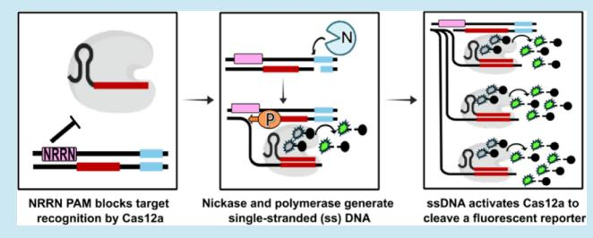
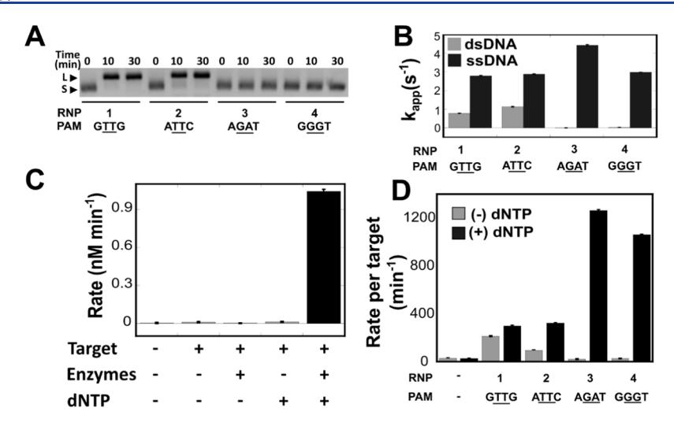
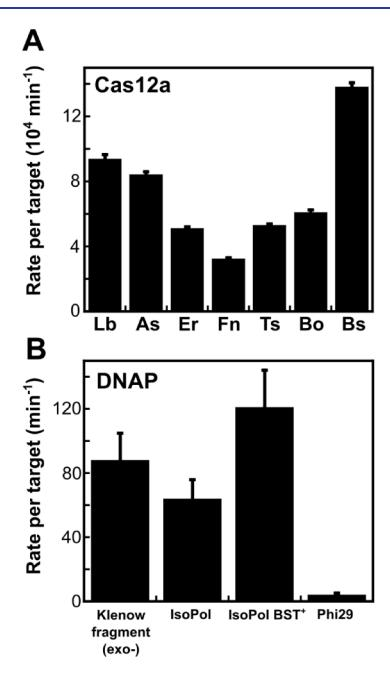
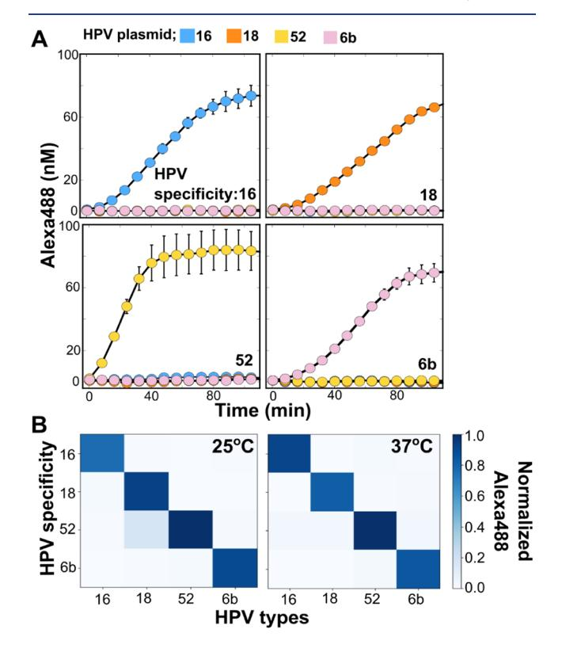
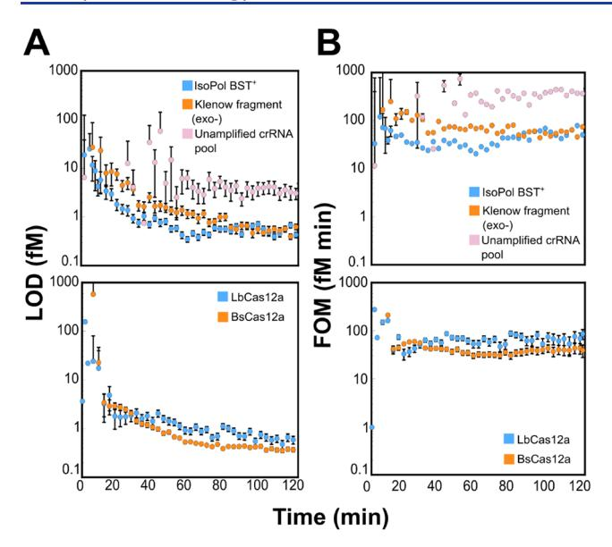
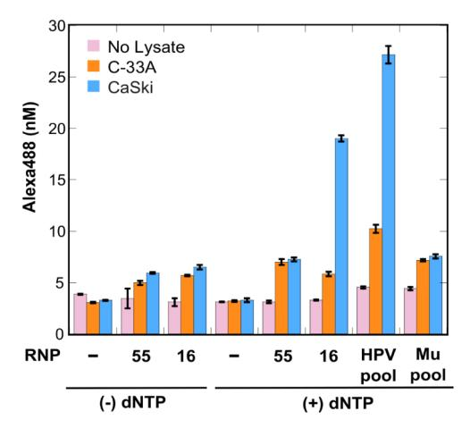

**Selma Sinan#, Remy M. Kooistra#, Karunya Rajaraman, Zeba Islam, Damian Madan, Eric A. Nalefski, and Ilya J. Finkelstein**

*ACS Synthetic Biology, Vol. 14, Issue 12, pp. 4714–4722, 2025*

DOI: [10.1021/acssynbio.5c00463](https://doi.org/10.1021/acssynbio.5c00463)

---

## Table of Contents

- [Abstract](#abstract)
- [Introduction](#introduction)
- [Results](#results)
- [Discussion](#discussion)
- [Materials and Methods](#materials-and-methods)
- [Associated Content](#associated-content)
- [Author Information](#author-information)
- [Acknowledgments](#acknowledgments)
- [References](#references)

---

## Abstract

CRISPR-based nucleic acid diagnostics are a promising class of point-of-care tools that could dramatically improve healthcare outcomes for millions worldwide. However, these diagnostics require nucleic acid preamplification, an additional step that complicates deployment to low resource settings. Here, we developed CATNAP (Cas *trans*-nuclease detection of amplified products), a method that integrates isothermal linear DNA amplification with Cas12a detection in a single reaction. CATNAP uses a nicking enzyme and DNA polymerase to continuously generate single-stranded DNA, activating Cas12a's *trans*-cleavage activity without damaging the template. We optimized enzyme combinations, buffer conditions, and target selection to achieve high catalytic efficiency. CATNAP successfully distinguished between high- and low-risk HPV strains and detects HPV-16 in crude cell lysates of cervical cancer cells with minimal equipment, offering advantages over PCR-based approaches. We conclude that CATNAP bridges the sensitivity gap in CRISPR diagnostics while maintaining simplicity, making accurate disease detection more accessible in resource-limited settings.

**Keywords:** molecular diagnostics, strand displacement amplification, genotyping

---

## Introduction

Rapid and accurate clinical tests are essential for effective patient care in low-resource settings where access to sophisticated diagnostic infrastructure is limited. CRISPR-based point-of-care tests that follow REASSURED criteria (real-time connectivity, equipment-free, affordable, sensitive, specific, user-friendly, rapid, environmentally friendly, deliverable) are emerging as powerful tools that can detect pathogen nucleic acids with high sensitivity in complex samples.[[1,2](#ref1)] These assays leverage the *trans*-cleavage activity of Cas12a and related CRISPR nucleases, wherein target recognition triggers collateral cleavage of nearby single-stranded DNA molecules.[[1,3,4](#ref1)] The binding of Cas12a to a target sequence adjacent to a protospacer-adjacent motif (PAM) activates the enzyme's nonspecific nuclease activity, resulting in the degradation of labeled reporter molecules and generation of detectable fluorescent signals.[[5](#ref5)] This mechanism enables the development of highly specific and sensitive detection platforms for pathogen identification in low-resource settings.[[6,7](#ref6)]

Most pathogens exist at attomolar to femtomolar concentrations in patient-derived specimens, but Cas12a-based diagnostics [[8,9](#ref8)] are typically sensitive to nucleic acids that are in the picomolar to nanomolar range.[[1,10](#ref1)] This sensitivity gap necessitates preamplification of target nucleic acids prior to CRISPR-based detection. Common preamplification strategies include Polymerase Chain Reaction (PCR)-based methods and isothermal techniques such as Loop-Mediated Isothermal Amplification (LAMP) or Recombinase Polymerase Amplification (RPA). However, these approaches present significant challenges in low resource settings.[[11,12](#ref11)] Specialized equipment, trained personnel, and reliable power sources are often unavailable. Reagent costs and cold-chain requirements further restrict accessibility. PCR requires thermal cycling, restricting its utility for point-of-care applications. While isothermal exponential methods can achieve remarkable sensitivity and rapid signal generation, they also require complex primer design, suffer from nonspecific amplification, and are challenging to convert into a quantitative assay.[[13–17](#ref13)] These protocols increase complexity and time demands, thus reducing the feasibility of rapid testing. Further, contamination risks during exponential amplification are particularly problematic in settings with limited laboratory infrastructure.

Here, we introduce CATNAP (Cas *trans*-nuclease detection of amplified products), a one-pot diagnostic assay that combines isothermal linear DNA amplification with Cas12a-based detection. Linear amplification reduces contamination risk, has higher specificity, and is simpler to quantify at the cost of lower overall DNA production relative to exponential methods. CATNAP uses a site-specific nicking endonuclease and strand-displacing DNA polymerase to continuously generate single-stranded DNA from double-stranded templates. These ssDNAs activate Cas12a's *trans*-cleavage activity [[18](#ref18)] without damaging the original template DNA, thereby resulting in continuous signal amplification. By strategically designing crRNAs that target regions with dipurine (e.g., NRRN, where N is any nucleotide and R is an A or a G) PAMs near nicking sites, we achieved rapid and specific detection of HPV-16 DNA with high catalytic efficiency. We demonstrated CATNAP's ability to discriminate between oncogenic and low-risk HPV strains and successfully detected HPV-16 in cervical cancer cell lysates. The method's compatibility with room temperature operation and simplified workflow makes it particularly suitable for point-of-care diagnostics in resource-limited settings where sophisticated equipment and technical expertise are unavailable. More broadly, combining linear preamplification with sensitive detection will accelerate the development of point-of-care diagnostics in resource-limited settings.

---

## Results

**Development of a Cas12a-Based One-Pot Amplification and Detection Assay.** [Figure 1](#fig1) illustrates CATNAP (Cas *trans*-nuclease detection of amplified products). CATNAP integrates isothermal linear amplification with CRISPR RNA (crRNA)-guided Cas12a ribonucleoprotein (RNP) based detection. Targeted nucleic acid amplification relies on the coordinated activities of a site-specific nicking endonuclease (nickase) and a strand-displacing DNA polymerase (DNAP). First, the nickase cuts the target DNA strand downstream of the Cas12a target. A DNA polymerase with strand displacement activity then extends from this nick, synthesizing a new DNA strand while displacing the downstream target single-stranded DNA (ssDNA). Polymerase activity also regenerates the nick site for subsequent renicking and resynthesis. The crRNA guides Cas12a to this ssDNA target, activating Cas12a's *trans*-cleavage activity.[[19](#ref19)] Once activated, Cas12a cleaves fluorescently labeled *trans*-substrates in the reaction mixture, producing a detectable signal. We designed protospacers containing central dipurines in their nontarget strand (NTS) PAMs (NRRN) because Cas12a can be activated on these targets, but only when they are ssDNA (see below).[[20](#ref20)] Multiple rounds of concurrent nicking and strand displacement linearly amplify the ssDNA, enabling detection of low-abundance DNA sequences with high specificity and sensitivity.

<figure class="paper-figure" id="fig1">

<figcaption><strong>Figure 1. Schematic of linear DNA amplification and detection.</strong> A Cas12a target (red) is downstream of a nicking site (blue) and is flanked by a nonideal PAM containing central dipurines (NRRN, pink). This PAM prevents Cas12a binding to the double-stranded DNA. A nicking enzyme (N, blue) creates a nick upstream of the target site (red) on the bottom strand, generating a priming site. A DNA polymerase (orange, P) extends from the nick via strand displacement synthesis, producing single-stranded DNA (ssDNA). This ssDNA activates the crRNA-Cas12a ribonuclear protein (RNP, gray), inducing the RNP to cleave the reporter substrate in *trans* (green-black). Further DNA polymerase activity restores the nicking site, allowing the cycle to repeat and amplify the reporter signal.</figcaption>
</figure>

**Benchmarking CATNAP for Detecting Human Papillomavirus.** We first tested whether Cas12a RNPs could cleave plasmid DNA at HPV-16 target sites containing either dipurine or dipyrimidine PAMs (Table S1). For this study, the four nucleotide Cas12a PAMs contain two central purines (A or G), while dipyrimidine PAMs contain central pyrimidines (C or T). We targeted conserved viral genes in HPV-16 because this type is strongly linked with cervical cancer and is an important target for developing a fieldable diagnostic.[[21,22](#ref21)] Because CATNAP continuously resynthesizes the target strand, we also selected targets that were upstream of a Nt.BsmAI nickase site (Table S1).

We incubated the RNPs with plasmids encoding HPV targets containing different PAMs at 37 °C. RNPs targeting dipyrimidine PAMs (GTTG and ATTC) cleaved the plasmid and produced a linear DNA band ([Fig. 2A](#fig2)). In contrast, RNPs targeting dipurine PAMs (AGAT and GGGT) did not cleave the plasmid, even after 30 min. This result confirms that dipurine PAMs do not support Cas12a activation on plasmid DNA. We previously reported RNPs targeting dipurine PAMs are efficiently activated by short ssDNA but not dsDNA targets [[20](#ref20)] and used this insight to prioritize HPV target sites that selectively trigger Cas12a activity as ssDNA but not in double-stranded form. As expected, RNPs targeting dipurine PAMs were activated by ssDNA but not dsDNA ([Fig. 2B](#fig2), Figure S1B and Table S2).[[20](#ref20)] In contrast, RNPs targeting dipyrimidine PAMs were activated by both dsDNA and ssDNA ([Fig. 2B](#fig2), Figure S1A and Table S2).

Next, we implemented the CATNAP reaction using Nt.BsmAI nicking enzyme and the *E. coli* Klenow Fragment (exo-) of DNA polymerase I (DNAP; [Fig. 2C,D](#fig2), Figure S2, Tables S3,S4). We selected *E. coli* Klenow Fragment (exo-), a variant of DNA Polymerase I lacking 3′–5′ exonuclease activity, because it possesses moderate strand displacement capability.[[23](#ref23)] Quantitative PCR confirmed efficient production of at least six ssDNA copies per template within 30 min in two different reaction buffers (Figure S3). As expected, efficient Cas12a activation required all enzymes and dNTPs to amplify the target ssDNA. Both the established *trans*-cleavage buffer [[20](#ref20)] and rCutSmart buffer supported effective ssDNA synthesis (Figure S3B). The rCutSmart buffer was specifically formulated to accommodate the enzymatic activities of both the nicking enzyme and polymerase, making it particularly suitable for CATNAP. Both buffers proved to be more effective than NEBuffer2, which is recommended for use with DNAP, in promoting Cas12a *trans*-substrate cleavage (Figure S4).

<figure class="paper-figure" id="fig2">

<figcaption><strong>Figure 2. CATNAP validation and assay requirements.</strong> (A) Cas12a efficiently cuts targets with dipyrimidine, but not dipurine PAMs. RNPs were incubated with plasmid DNA containing target sequences, and at the indicated times, reactions were quenched and subjected to electrophoresis on a 1.5% agarose gel containing ethidium bromide followed by visualization. Linear (L) and uncleaved supercoiled (S) DNA bands are indicated by arrowheads. (B) RNPs using dipurine PAMs are efficiently activated by ssDNA but not by dsDNA targets. Bars (±SE) represent apparent turnover (*k*app) of *trans*-substrate FQ-C10 for RNPs reacted in triplicate with plasmid DNA or short, 40-nt ssDNA (see Figure S1 and Table S2). (C) CATNAP signals are generated with the correct combination of target DNA, reaction enzymes and dNTPs. Cleavage of FQ-C10 in one-pot reactions by RNP-4 with the indicated CATNAP components, where bars represent mean (±SE) *trans*-cleavage rates for triplicates (see Figure S2 and Table S3). (D) CATNAP activates *trans*-substrate cleavage by RNPs utilizing dipurine PAMs. CATNAP reactions were performed in the presence of a plasmid encoding the complete HPV-16 genome. Bars represent reporter cleavage rates (±SE) for triplicates (see Figure S2B and Table S4) normalized to the concentration of input target DNA. Signals generated from RNPs utilizing dipyrimidine PAMs in reactions lacking dNTPs reflect the expected direct activation by input target DNA.</figcaption>
</figure>

We next tested the relationship between RNP activity and distance separating the targeting sequences from the nicking site. Two-step reactions were performed using a panel of RNPs targeting nonoverlapping sequences adjacent to a common nicking site in HPV-16 (Table S5). The first step consisted of ssDNA generation by nicking-polymerase reactions without added RNP, and in the second, *trans*-cleavage by the RNPs in response to the reaction products was measured (Figure S5). Rates of *trans*-cleavage correlated directly with proximity of the Cas12a targeting sequence to the nicking site, suggesting the efficiency of DNA synthesis decreases as distance from the nicking site increases, consistent with the limited strand displacement activity of Klenow (exo-) DNAP.

We reasoned that the rates of both Cas12a *trans* cleavage and DNAP synthesis are the two critical parameters for efficient CATNAP amplification and detection. Cas12a orthologs exhibit significant diversity in their collateral DNase activities upon target recognition.[[24,25](#ref24)] Therefore, we tested six additional Cas12a orthologs in the full CATNAP reaction ([Fig. 3A](#fig3) and Figure S6).[[24](#ref24)] These orthologs encompass five enzymes from mammalian microbiota — *Butyrivibrio sp.* NC3005 (BsCas12a), *Bacteroidetes oral* taxon 274 (BoCas12a), *Eubacterium rectale* (ErCas12a), *Francisella novicida* U112 (FnCas12), and *Acidaminococcus sp.* BV3L6 (AsCas12a) — as well as *Thiomicrospira sp.* XS5 (TsCas12a), isolated from a brine-seawater interface. We tested each ortholog in the full CATNAP reaction with the FQ-C10 *trans*-substrate ([Fig. 3A](#fig3)). CATNAP *trans*-cleavage rates varied over a ~4-fold range, with BsCas12a showing the highest rate, 1.5-fold higher than LbCas12a, the next best ([Fig. 3A](#fig3)). The superior performance of BsCas12a in the CATNAP assay likely stems from an optimal balance between its target DNA binding affinity, *trans*-cleavage activation kinetics, and compatibility with the DNAP in the reaction buffer. To find the best RNP concentration for CATNAP, we ran reactions with different RNP amounts and crRNAs at a limiting level (Figure S7). RNP concentrations above 6 nM caused inhibition of CATNAP detection.

<figure class="paper-figure" id="fig3">

<figcaption><strong>Figure 3. CATNAP component optimization.</strong> CATNAP reactions were carried out with RNPs assembled from different orthologs of Cas12a (A) or with different DNA polymerases (B). Symbols represent reporter cleavage rates (±SE) for triplicates normalized to the concentration of input target DNA from time courses in Figures S6 and S8. All reactions were conducted with RNP-3 and HPV-16 plasmid at 37 °C.</figcaption>
</figure>

We compared the performance of Klenow (exo-) against three other DNAPs in the full CATNAP reactions ([Fig. 3B](#fig3) and Figures S8,S9). All reactions included a Cas12a RNP targeting the HPV-16 genome (Table S1). IsoPol and IsoPol BST+ are two engineered DNAPs that exhibit excellent isothermal strand displacement activity in high ionic strength buffers, with IsoPol BST+ more heat-resistant above 37 °C. We also tested Phi29 DNAP for its excellent strand-displacement activity at 30 °C. Klenow (exo-) and IsoPol BST+ DNAPs performed similarly within the full CATNAP reaction ([Fig. 3B](#fig3)). IsoPol BST+ showed the highest activity at 37 °C, consistent with its mesophilic characteristics. Surprisingly, Phi29 DNAP completely inhibited the CATNAP reaction, likely due to competition with Cas12a for the generated ssDNA or its 3′–5′ exonuclease activity.[[26](#ref26)] Based on these results and additional experiments that optimized both Cas12a and DNAP concentration (Figures S7 and S9), all further CATNAP experiments were conducted with 1–6 nM RNP and 62–100 U/mL DNAP.

**Discriminating between Oncogenic and Low-Risk HPV Types.** We evaluated whether CATNAP could distinguish closely related HPV types ([Figure 4](#fig4)), including three high-risk types associated with cervical cancer (HPV-16, -18, and -52) and one low-risk type (HPV-6b). To achieve this, we identified distinct Nt.BsmAI restriction sites in the genomes of each type and designed crRNAs targeting dipurine PAM-associated protospacers near the nicking sites. As expected for CATNAP RNPs, each crRNA-guided complex demonstrated strong *trans*-cleavage activity when exposed to ssDNA sequences containing the correct protospacers, while showing no significant activity against plasmids encoding the respective full HPV genomes (Figure S1). In one-pot CATNAP reactions, each RNP demonstrated high *trans*-cleavage activity specifically in response to its cognate HPV plasmid, confirming accurate viral genotyping ([Figure 4](#fig4) and Tables S6,S7). We conclude that CATNAP can distinguish between highly related pathogenic DNA targets.

<figure class="paper-figure" id="fig4">

<figcaption><strong>Figure 4. Type-specific HPV detection by CATNAP.</strong> (A) Time course for CATNAP reactions performed at 37 °C with RNPs designed to HPV-16, -18, -52, and -6b using plasmids containing each type. Symbols represent mean (±SE) of background-corrected product measured in triplicate. (B) Normalized product accumulated at 2 h from CATNAP reactions, represented as a heat-map for 25 and 37 °C (Tables S6,S7), demonstrating specificity of each RNP (*y*-axis) for its intended target (*x*-axis).</figcaption>
</figure>

Additionally, we observed that the specificity of these reactions was retained at 25 °C ([Figure 4](#fig4) and Figure S10), although the overall assay signal was reduced (Figures S10 and S11). Notably, BsCas12a, the top performer at 37 °C, remained the most active ortholog at 25 °C, yielding the highest *trans*-cleavage rate under our CATNAP conditions (Figure S11). The preservation of activity across this temperature range suggests that CATNAP can be deployed in settings without the need for external heating equipment, thereby extending its potential utility for strain-specific viral detection in low-resource settings.

Next, we tested whether CATNAP is sensitive to single nucleotide mutations by introducing single-base mismatches 1, 2, 3, 10, and 20 nucleotides away from the PAM in the HPV-16 plasmid (Figure S12). Prior studies have shown that mutations in the PAM-proximal "seed" region (positions 1–6) ablate Cas12a activation by dsDNA, but not ssDNA.[[5,27](#ref5)] Consistent with this mechanism, mismatches in the ssDNA generated during the linear amplification step only mildly altered Cas12a's catalytic rates (Figure S12). We conclude that CATNAP is insensitive to single nucleotide variation along the target ssDNA strand but can readily discriminate between HPV subtypes.

**Measuring Analytical Sensitivity of CATNAP.** We measured the analytical sensitivity of CATNAP for detection of HPV-16 and compared it to amplification-free detection ([Figure 5](#fig5), top panels, Figure S13). Two of the highest activity polymerases (IsoPol BST+ and Klenow fragment (exo-)) were used in CATNAP reactions with pools of 12 HPV-16-specific RNPs that utilize dipurine PAMs. For amplification-free detection, a pool of 20 HPV-16-specific RNPs that utilize dipyrimidine PAMs were used. LODs were calculated at each time point using a logistic fit of the raw fluorescence data ([Fig. 5A](#fig5)), and figure of merit [[28](#ref28)] (FOM) was calculated from each LOD ([Fig. 5B](#fig5)). For CATNAP reactions employing different polymerases, IsoPol BST+ yielded slightly greater sensitivity at 60 min (0.57 ± 0.07 fM) over Klenow (exo-) (0.93 ± 0.16 fM), with both surpassing the performance of the amplification-free RNP pool (2.7 ± 1.1 fM). The superior performance of the CATNAP reactions resulted from >8-fold greater rates of signal generation per input (Figure S13D,E).

The performance of the two highest activity Cas12a orthologs (BsCas12a or LbCas12a) were tested in CATNAP reactions with the same polymerase ([Figure 5](#fig5), bottom panels, and Figure S14). BsCas12a yielded slightly greater sensitivity at 60 min (0.41 ± 0.03 fM) over LbCas12a (0.74 ± 0.11 fM), owing to a 5-fold higher rate of signal generation (Figure S14C,D). Moreover, when CATNAP assays were performed at 25 °C with BsCas12a and either IsoPol BST+ and Klenow fragment (exo-), we again observed slightly greater sensitivity for reactions using IsoPol BST+ (1.23 ± 0.15 fM) over Klenow (exo-) (2.1 ± 0.5 fM). Overall LODs and rates of signal generation were only slightly reduced at the lower temperature compared to those at 37 °C, demonstrating that high analytical sensitivity is maintained under reduced-temperature conditions (Figure S15).

<figure class="paper-figure" id="fig5">

<figcaption><strong>Figure 5. Limit of detection (LOD) and figure of merit (FOM).</strong> (A) CATNAP shows greater sensitivity for target detection than amplification-free detection by RNP pools. *Trans*-substrate reporter cleavage was measured in response to a titration of HPV-16 plasmid by either CATNAP employing two different DNA polymerases and pools of 12 CATNAP RNPs or by amplification-free detection using a pool of 20 non-CATNAP RNPs (top) or CATNAP using pools of 12 CATNAP RNPs formed from two different Cas12a orthologs (bottom). Symbols and bars represent mean (±SE) of LODs calculated at each time point based on the fluorescent signal (see Figures S13,S14). (B) Figure of Merit (FOM) comparison for HPV-16 plasmid detection by CATNAP versus amplification-free RNP pools. Symbols and bars represent the mean (±SE) of FOM values determined from LOD at each time point in A.</figcaption>
</figure>

**HPV Detection in Cervical Cancer Cells and Clinical Samples.** To evaluate CATNAP's ability to detect HPV in a biologically relevant context, we tested lysates from two cervical cancer cell lines. CaSki cells contain integrated HPV-16 DNA, while C-33A cells are HPV-negative. Two different RNPs were used in CATNAP: RNP-16, which generated the highest CATNAP signal against HPV-16 (Figure S16), and RNP-55, a nontargeting control specific for *Mycobacterium ulcerans* (Table S1). Reactions were performed with and without dNTPs to assess the impact of polymerase-driven amplification. As expected, the targeting RNP-16 generated a high CATNAP signal in the presence of CaSki lysates, but only with preamplification ([Figure 6](#fig6) and Figure S17). Lower signals from amplification-free reactions performed on both CaSki and C-33A lysates using RNP-16 matched the responses of the nontargeting control RNP-55, regardless of amplification ([Figure 6](#fig6) and Figure S17). This indicates amplification-independent signals are generated from nonspecific responses of RNPs to genomic DNA. Despite the nonspecific interactions with genomic DNA, CATNAP shows >4-fold discrimination between HPV-positive and HPV-negative cells. As expected, a pool of 12 HPV-16-specific RNPs improved the CATNAP signal from CaSki lysates, suggesting an avenue for further optimization ([Figure 6](#fig6) and Figure S17).

<figure class="paper-figure" id="fig6">

<figcaption><strong>Figure 6. CATNAP-based HPV detection in crude cell lysates.</strong> CATNAP reactions were performed on crude lysates prepared from C-33A or CaSki cells using an HPV-16-specific CATNAP RNP (RNP-16) or a pool of 12 CATNAP RNPs (HPV pool). As controls, we omitted the RNP or used a single RNP (RNP-55) or pool of 20 RNPs specific to *M. ulcerans* (Mu pool) (Table S1). CaSki cervical cancer cells harbor HPV-16, whereas C-33A cervical cancer cells do not. Bars represent the mean (±SD) of product from triplicates recorded at 2 h (Figure S17). Signals in RNP reactions conducted without dNTPs represent RNP-nonspecific background responses to lysates in the absence of CATNAP-mediated amplification.</figcaption>
</figure>

To test whether CATNAP can be used in clinical samples, we performed reactions on HPV-16 plasmid spiked into increasing concentrations of saliva (Figure S18). One-pot CATNAP amplification retained full sensitivity up to 20% saliva, as compared to optimized CATNAP reaction buffer. Consistent with the effect of genomic DNA in cell lysates above, nonspecific response also increased at higher saliva concentrations. Nonetheless, CATNAP shows ~6-fold discrimination between HPV-positive and HPV-negative oral samples at the highest (20% v/v) saliva concentrations. These results show that CATNAP can detect target DNA directly in cell lysates and oral samples.

---

## Discussion

Here, we developed a novel one-pot nucleic acid diagnostic [[29](#ref29)] approach that integrates isothermal linear DNA amplification with CRISPR-Cas12a detection. Our method uses a nicking endonuclease and a strand-displacing polymerase to continuously generate single-stranded DNA targets from a double-stranded template. These ssDNAs activate the *trans*-cleavage activity of a Cas12a-crRNA complex specifically designed to recognize targets adjacent to noncanonical dipurine PAMs, avoiding cleavage of the original template. We demonstrated the system's efficacy by rapidly detecting HPV-16 DNA, achieving high specificity capable of discriminating between different oncogenic and low-risk HPV strains, and successfully detecting HPV-16 within complex cervical cancer cell lysates, highlighting its potential for point-of-care diagnostics.

The combination of isothermal linear amplification and CRISPR-based detection addresses significant challenges faced by nucleic acid diagnostics in low-resource settings.[[30,31](#ref30)] While CRISPR systems offer high specificity, their sensitivity often requires target preamplification.[[1,16](#ref1)] Conventional exponential amplification methods like PCR, LAMP, and RPA, although sensitive, suffer from drawbacks that limit their point-of-care applicability.[[32,33](#ref32)] They often require specialized equipment (thermocyclers for PCR), complex primer design (LAMP), are prone to contamination leading to false positives (especially in settings with limited infrastructure), and can make quantification difficult due to saturation effects.[[11,34,35](#ref11)] Our linear amplification approach mitigates contamination risk as it avoids exponential product accumulation, potentially simplifies quantification, and operates isothermally, eliminating the need for thermocycling equipment.[[11](#ref11)] The one-pot format further simplifies the workflow, reducing hands-on time and the need for multiple reaction steps, aligning well with the REASSURED criteria for point-of-care diagnostics in resource-limited environments.[[36–39](#ref36)]

The limit of detection (LOD) is intrinsically linked to the rate at which activated Cas12a accumulates and cleaves the reporter substrate. CATNAP with IsoPol BST+ and Klenow fragment (exo-) polymerases reached LODs of 0.57 ± 0.07 fM and 0.93 ± 0.16 fM, respectively, within 60 min. A systematic review of 36 CRISPR-based preamplification and nucleic acid-sensing systems concluded that LODs ranged from ~0.6 to 1000 aM (1 fM).[[40](#ref40)] CATNAP falls well within this range, demonstrating that linear amplification can achieve subfemtomolar sensitivity, a level that is typically associated with exponential amplification strategies such as PCR, LAMP, or RPA.[[41](#ref41)] The LOD is also limited by background noise, which can arise from nonspecific Cas12a activation by off-target sequences, which can be potentially exacerbated in cell lysates and clinical samples. Further optimization to improve the LOD will involve exploring engineered strand-displacing polymerases with enhanced processivity, refining buffer components for optimal coordinated enzymatic function, and Cas12a protein engineering to boost catalytic rates, enhance activity at room temperature, and minimize nonspecific activation.[[42](#ref42)] Alternatively, for applications where maximum sensitivity is critical, an isothermal exponential amplification mechanism can increase signal output, albeit with increased reaction complexity.

This study uses a fluorescence-based readout for rapid assay development. However, alternative detection schemes are necessary for low-resource settings. Lateral flow assays (LFAs) offer a simple, equipment-free, and cost-effective visual detection method well-suited for point-of-care applications.[[43](#ref43)] CRISPR-Cas systems have already been successfully coupled with LFA strips.[[44,45](#ref44)] In these systems, Cas *trans*-cleavage activity releases tagged reporter molecules, which then generate a visible signal on the strip.[[1,43](#ref1)] Ongoing work in our laboratories aims to integrate CATNAP-based linear amplification and Cas12a detection with an LFA readout.[[46](#ref46)] Future work will also establish the LOD in more challenging clinical matrices such as saliva or urine, which may contain inhibitors and high background DNA/RNA concentrations.[[1](#ref1)] Further, streamlining sample preparation and integrating it with the one-pot CATNAP reaction will ultimately result in a rapid, cost-effective, and widespread "sample-to-answer" device.[[43,47](#ref43)] Addressing these areas will accelerate the deployment of CRISPR-based diagnostics globally.

---

## Materials and Methods

**Reagents.** Nt.BsmAI (cat. no. R0121S), Klenow Fragment (3′ → 5′ exo-; cat. no. M0212S), dNTPs (cat. no. N0447S), NEBuffer 2 (cat. no. B7002S), and rCutSmart Buffer (cat. no. B6004S) were purchased from NEB. For all experiments except when comparing orthologs, LbCas12a (cat. no. M0653S) from NEB was used. 1× Cas12a assay buffer (CAB) was composed of 10 mM Tris-HCl, pH 7.5, 10 mM MgCl2, 1.0 mM TCEP, 0.01% IGEPAL CA-630, and 40 μg/mL BSA. 858-bp HPV-16 E6E7 gBlock, ssDNA targets, reporters, and qPCR primers and probes were purchased from IDT (Table S1). Plasmids encoding HPV types were purchased from ATCC: 16 (cat. no. 45113D); 18 (cat. no. 45152D); 52 (cat. no. VRMC-29); 6b (cat. no. 45150D). Tissue culture cell lines were purchased from ATCC: CaSki (cat. no. CRL-1550) and C-33a (cat. no. HTB-31).

**Amplification of DNA Targets.** Amplification components consisting of 0.13 U/μL Nt.BsmAI, 0.13 U/μL Klenow Fragment (exo-), 50 mM dNTPs, and various amounts of template in 1× Cas12a assay buffer (CAB) or rCutSmart, were mixed at room temperature, then incubated at 37 °C (unless indicated) for the desired time. Amplification products were quantified by qPCR (Figure S3) or used as targets for activating RNP cleavage of *trans*-substrate FQ-C10 (Figure S5). For "one-pot" CATNAP reactions, RNP, amplification components, and FQ-C10 *trans*-substrate were mixed at room temperature, then incubated at 37 °C or room temperature, and reaction products were monitored continuously (Figure S2), as described below. Control reactions were carried out in amplification reactions lacking dNTPs or templates or in which enzymes were replaced with equivalent volumes of their respective storage buffers.

**Quantification of Amplification Products.** 100 fM of the 858-bp HPV-16 E6E7 gBlock fragment and dNTPs, diluted into 1× Cas12a assay buffer, were incubated at 37 °C with or without nicking enzyme (Nt.BsmAI) and DNA polymerase (Klenow fragment (exo-)). At the indicated times, aliquots were removed and heat-inactivated by incubation at 80 °C for 20 min. Quantitative PCR was performed on the aliquots using PrimeTime Gene Expression Master Mix and PrimeTime Std qPCR primers and probes (IDT) on a CFX Real-Time PCR Detection System (Bio-Rad) instrument. The cycling protocol consisted of 95 °C for 3 min followed by 40 repeats of 95 °C for 5 s and 60 °C for 60 s (data collection). Linear 858-bp HPV-16 DNA fragment was used as a PCR Standard. The number of copies observed in samples lacking nicking enzyme/polymerase, representing the input material, was subtracted from copies observed in their presence to obtain the number of copies amplified in the reactions.

***Trans*-Substrate Cleavage Reactions (Non-CATNAP).** Cleavage reactions were performed essentially as described.[[20](#ref20)] Briefly, RNP was formed by mixing 200 nM Cas12a with 100 nM crRNA in 1× CAB followed by incubation for 30 min at room temperature. RNPs were diluted to 2 nM in 1× CAB and immediately mixed with target and *trans*-substrate at final concentrations of 1 nM RNP, 0 or 2.5–5 pM target, and 100 nM FQ-C10 *trans*-substrate. Targets consisted of 40-nt ssDNA, 858-bp gBlock or plasmids. Reactions were incubated at 37 °C in a fluorescence plate reader.

**One-Pot CATNAP Reactions.** For general CATNAP reactions, RNP complexes were assembled by combining 7 μL of 1× rCutSmart buffer, 1 μL of 1 μM crRNA, and 2 μL of 1 μM LbCas12a in a 0.5 mL Eppendorf tube. This mixture was incubated at room temperature for 30 min. Immediately before reaction setup, a 4× solutions of the FQ-C10 *trans*-substrate (400 nM) and dNTP mix (1 mM each) were prepared on ice. Separately, 2× nicking-polymerase (NP) mix was prepared by combining 125 U/mL (v/v) Nt.BsmAI, 125 U/mL (v/v) Klenow fragment (exo-) or IsoPol BST+, and varying concentration of gBlock or plasmid in 1× rCutSmart buffer, adjusting the total volume with nuclease-free water. One-pot CATNAP reactions (20 μL total) were assembled in black-bottom 384-well plates by adding 10 μL of the 2× NP mix, 5 μL of the 4× crRNA RNP stock, and 5 μL of the 4× *trans*-substrate stock. The final assay conditions were 6.3 nM BsCas12a, 3.1 nM guide RNA, 100 nM FQ-C10 reporter, 125 U/mL Nt.BsmAI, 125 U/mL Klenow fragment (exo-), and 50 μM each dNTP in 1× rCutSmart buffer. Assembled CATNAP reactions were incubated at 37 °C, except where noted, in a fluorescence plate.

**Quantification of *trans*-Substrate Cleavage Products.** Fluorescence measurements were carried out in black 384-well plates on an Agilent BioTek Synergy microplate reader (λex = 490 nm, λem = 525 nm). When indicated, fluorescence traces obtained from reactions containing RNP and *trans* substrate but lacking target were subtracted from the corresponding test traces. When necessary, fluorescence values were converted to molar concentrations of cleaved *trans*-substrate using calibration curves based on equivalent volumes of Cas12a-digested standard run in parallel. The calibration standard was prepared as follows. First, RNP-55 was formed by mixing 1 μL of 1 μM crRNA, 7 μL of 1× rCutSmart buffer, and 2 μL of 1 μM LbCas12a, followed by incubation at room temperature for 30 min. Next, the RNP was activated by adding 0.5 μL of its target at 100 nM, followed by incubation at 37 °C for 60 min. Then, 4 μL of activated RNP was diluted into 176 μL of 1× buffer, followed by addition of 20 μL 10 μM FQ-C10 reporter to achieve final concentrations of 2 nM RNP, 0.1 nM target, and 1 μM reporter. Finally, this mixture was incubated at 37 °C for 2 h to ensure complete cleavage, then aliquoted and stored at −20 °C. After thawing, the digested reporter was serially diluted 2-fold in 1× buffer across the sample plate starting with 100 nM, with 1× buffer serving as the blank. The resulting relative fluorescence signal (RFU) was plotted against standard concentration, as shown in a representative calibration curve (Figure S19), and linear fitting yielded the calibration factor (RFU per nM) used to convert fluorescence of unknowns into molarity of cleaved reporter. Values of unknown replicates are reported as means (±SD).

**Expression and Purification of Cas12a Orthologs.** Full length Cas12a orthologs (Table S8) were produced in *E. coli* as N-terminal His₆, TwinStrep, SUMO fusions and induced with IPTG. Cleared lysates were applied to StrepTactin resin, the SUMO tag removed by protease, and the proteins polished by Superdex 200 size-exclusion chromatography. Peak fractions were pooled, flash-frozen in liquid nitrogen, stored at −80 °C, and quantified by Bradford assay using BSA as a standard.

**Preparation of Crude Cell Lysates.** Tissue culture cells (C-33A, CaSki) were grown to confluency in Eagle's Minimum Essential Medium containing 10% fetal bovine serum, penicillin (100 U/mL), and streptomycin (100 μg/mL). Adherent cells were harvested, resuspended in 10 mM Tris-HCl, pH 7.5, 1.0 mM EDTA, and incubated at 95 °C for 20 min. Proteinase K (60 μg/mL) was added, followed by incubation at 65 °C for 20 min. Finally, samples were incubated at 95 °C for 20 min, then stored at −80 °C until use. DNA content was quantified by Qubit 1× dsDNA High Sensitivity Kit (Thermo Fisher, cat. no. Q33230). Cell lysate material corresponding to 1.0 ng DNA were subjected to "one pot" CATNAP reactions as described below.

**One-Pot CATNAP Reactions in Cell Lysates.** BsCas12a crRNA RNP complexes were prepared at 4× (12.5 nM) as described above. Immediately before CATNAP reaction setup, 4× stocks of the FQ-C10 *trans*-substrate (400 nM) and dNTPs (1 mM of each nucleotide) were prepared on ice. Separately, 2× nicking-polymerase (NP) mixes were prepared by combining 125 U/mL (v/v) Nt.BsmAI, 125 U/mL (v/v) Klenow fragment (exo-), and sufficient volumes of cell lysate containing 1 ng DNA in 1× rCutSmart buffer, adjusting the total volume with nuclease-free water. Final one-pot CATNAP reactions (20 μL total) were assembled in black 384-well plates by mixing 10 μL of the 2× NP mix, 5 μL of the 4× BsCas12a crRNA RNP, and 5 μL of the 4× *trans*-substrate to achieve 6.3 nM BsCas12a, 3.1 nM guide RNA, 100 nM FQ-C10 reporter, 125 U/mL Nt.BsmAI, 125 U/mL Klenow fragment (exo-), and 50 μM each dNTP in 1× Cas12a assay buffer. Assembled CATNAP reactions were incubated at 37 °C in a fluorescence plate reader with continuous readings.

**One-Pot CATNAP Reactions in Saliva.** To assess CATNAP activity in saliva, 20 μL reactions were assembled in 384-well black plates containing LbCas12a-crRNA RNP complexes (final concentrations: 6.3 nM BsCas12a, 3.1 nM crRNA), 100 nM FQ-C10 reporter, 125 U/mL Nt.BsmAI, 125 U/mL Klenow fragment (exo-), and 50 μM each dNTP in 1× CutSmart buffer. Saliva (Innovative Research, catalog #: IRHUSLS) was incorporated into the CATNAP reaction mixture at the indicated volume, up to 20% v/v.[[48](#ref48)] Plates were sealed and incubated at 37 °C for 2 h. Fluorescence was measured at λex 490 nm and λem 525 nm, and product formation was quantified as a function of time.

---

## Associated Content

**Supporting Information.** The Supporting Information is available free of charge at [https://pubs.acs.org/doi/10.1021/acssynbio.5c00463](https://pubs.acs.org/doi/10.1021/acssynbio.5c00463).

Figures showing CATNAP mechanism and optimization, including RNP activation by different DNA targets, component requirements, ssDNA amplification, and optimizations for buffer, RNP concentration, Cas12a orthologs, and DNA polymerases (Figures S1–S9, S11); figures demonstrating CATNAP performance for type-specific HPV detection, including sensitivity, specificity, cleavage kinetics, LOD determination, and detection in complex samples such as cell lysates and saliva (Figures S10, S12–S18); a representative standard curve for quantification (Figure S19); tables with sequences of all synthetic nucleic acids, amplification loci, and plasmids used (Tables S1, S5, S8); tables detailing results for *trans*-substrate cleavage, component requirements, PAM targeting, and HPV-type-specific detection under various conditions (Tables S2–S4, S6–S7) (PDF)

---

## Author Information

**Corresponding Authors**

Eric A. Nalefski — Global Health Laboratories, Inc, Bellevue, Washington 98007, United States; Email: [enalefski@hotmail.com](mailto:enalefski@hotmail.com)

Ilya J. Finkelstein — Department of Molecular Biosciences and Institute for Cellular and Molecular Biology, University of Texas at Austin, Austin, Texas 78712, United States; Center for Systems and Synthetic Biology, University of Texas at Austin, Austin, Texas 78712, United States; [orcid.org/0000-0002-9371-2431](https://orcid.org/0000-0002-9371-2431); Email: [ilya@finkelsteinlab.org](mailto:ilya@finkelsteinlab.org)

**Authors**

Selma Sinan — Department of Molecular Biosciences and Institute for Cellular and Molecular Biology, University of Texas at Austin, Austin, Texas 78712, United States

Remy M. Kooistra — Global Health Laboratories, Inc, Bellevue, Washington 98007, United States

Karunya Rajaraman — Global Health Laboratories, Inc, Bellevue, Washington 98007, United States; Institute for Protein Innovation, Boston, Massachusetts 02125, United States

Zeba Islam — Global Health Laboratories, Inc, Bellevue, Washington 98007, United States; Inari Agriculture Inc., Cambridge, Massachusetts 02139, United States

Damian Madan — Global Health Laboratories, Inc, Bellevue, Washington 98007, United States

Complete contact information is available at: [https://pubs.acs.org/10.1021/acssynbio.5c00463](https://pubs.acs.org/doi/10.1021/acssynbio.5c00463)

**Author Contributions**

#S.S. and R.M.K. contributed equally. S.S. purified proteins, S.S., R.K., K.R., and E.N. performed biochemical experiments, and analyzed the data. S.S., E.A.N., and I.J.F. prepared figures and wrote the manuscript with input from all coauthors.

**Funding**

This work was supported by a sponsored research agreement from Global Health Laboratories, a generous gift from Tito's Handmade Vodka, a College of Natural Sciences Catalyst award (to I.J.F.), and the Welch Foundation (F-1808 to I.J.F.). The content is solely the responsibility of the authors and does not necessarily represent the official views of the sponsors.

**Notes**

The authors declare no competing financial interest.

---

## Acknowledgments

We thank members of the Finkelstein laboratory for carefully reading the manuscript.

---

## References

1. Kaminski, M. M.; Abudayyeh, O. O.; Gootenberg, J. S.; Zhang, F.; Collins, J. J. [CRISPR-Based Diagnostics.](https://doi.org/10.1038/s41551-021-00760-7) *Nat. Biomed. Eng.* 2021, *5* (7), 643–656.

2. Li, S.-Y.; Cheng, Q.-X.; Wang, J.-M.; Li, X.-Y.; Zhang, Z.-L.; Gao, S.; Cao, R.-B.; Zhao, G.-P.; Wang, J. [CRISPR-Cas12a-Assisted Nucleic Acid Detection.](https://doi.org/10.1038/s41421-018-0028-z) *Cell Discovery* 2018, *4* (1), 20.

3. Yan, W. X.; Hunnewell, P.; Alfonse, L. E.; Carte, J. M.; Keston-Smith, E.; Sothiselvam, S.; Garrity, A. J.; Chong, S.; Makarova, K. S.; Koonin, E. V.; et al. [Functionally Diverse Type V CRISPR-Cas Systems.](https://doi.org/10.1126/science.aav7271) *Science* 2019, *363* (6422), 88–91.

4. Swarts, D. C.; van der Oost, J.; Jinek, M. [Structural Basis for Guide RNA Processing and Seed-Dependent DNA Targeting by CRISPR-Cas12a.](https://doi.org/10.1016/j.molcel.2017.03.016) *Mol. Cell* 2017, *66* (2), 221–233.e4.

5. Chen, J. S.; Ma, E.; Harrington, L. B.; Da Costa, M.; Tian, X.; Palefsky, J. M.; Doudna, J. A. [CRISPR-Cas12a Target Binding Unleashes Indiscriminate Single-Stranded DNase Activity.](https://doi.org/10.1126/science.aar6245) *Science* 2018, *360* (6387), 436–439.

6. Chen, Y.; Wang, X.; Zhang, J.; Jiang, Q.; Qiao, B.; He, B.; Yin, W.; Qiao, J.; Liu, Y. [Split crRNA with CRISPR-Cas12a Enabling Highly Sensitive and Multiplexed Detection of RNA and DNA.](https://doi.org/10.1038/s41467-024-52691-x) *Nat. Commun.* 2024, *15* (1), 8342.

7. Han, J.; Shin, J.; Lee, E. S.; Cha, B. S.; Kim, S.; Jang, Y.; Kim, S.; Park, K. S. [Cas12a/Blocker DNA-Based Multiplex Nucleic Acid Detection System for Diagnosis of High-Risk Human Papillomavirus Infection.](https://doi.org/10.1016/j.bios.2023.115323) *Biosens. Bioelectron.* 2023, *232*, 115323.

8. Sashital, D. G. [Pathogen Detection in the CRISPR–Cas Era.](https://doi.org/10.1186/s13073-018-0543-4) *Genome Med.* 2018, *10* (1), 32.

9. Nemudraia, A.; Nemudryi, A.; Buyukyoruk, M.; Scherffius, A. M.; Zahl, T.; Wiegand, T.; Pandey, S.; Nichols, J. E.; Hall, L. N.; McVey, A.; et al. [Sequence-Specific Capture and Concentration of Viral RNA by Type III CRISPR System Enhances Diagnostic.](https://doi.org/10.1038/s41467-022-35445-5) *Nat. Commun.* 2022, *13* (1), 7762.

10. Shao, F.; Hu, J.; Zhang, P.; Akarapipad, P.; Park, J. S.; Lei, H.; Hsieh, K.; Wang, T.-H. [Enhanced CRISPR/Cas-Based Immunoassay through Magnetic Proximity Extension and Detection.](https://doi.org/10.1101/2024.09.06.24313206) *medRxiv.* 2024.

11. Gulati, S.; Maiti, S.; Chakraborty, D. [Low-Cost CRISPR Diagnostics for Resource-Limited Settings.](https://doi.org/10.1016/j.tig.2021.05.001) *Trends Genet.* 2021, *37* (9), 776–779.

12. Myhrvold, C.; Freije, C. A.; Gootenberg, J. S.; Abudayyeh, O. O.; Metsky, H. C.; Durbin, A. F.; Kellner, M. J.; Tan, A. L.; Paul, L. M.; Parham, L. A.; et al. [Field-Deployable Viral Diagnostics Using CRISPR-Cas13.](https://doi.org/10.1126/science.aas8836) *Science* 2018, *360* (6387), 444–448.

13. Yuan, C.; Fang, J.; Luo, X.; Zhang, Y.; Huang, G.; Zeng, X.; Xia, K.; Li, M.; Chen, X.; Yang, X.; et al. [One-Step Isothermal Amplification Strategy for microRNA Specific and Ultrasensitive Detection Based on Nicking-Assisted Entropy-Driven DNA Circuit Triggered Exponential Amplification Reaction.](https://doi.org/10.1016/j.aca.2022.339706) *Anal. Chim. Acta* 2022, *1203*, 339706.

14. Xu, D.; Zeng, H.; Wu, W.; Liu, H.; Wang, J. [Isothermal Amplification and CRISPR/Cas12a-System-Based Assay for Rapid, Sensitive and Visual Detection of *Staphylococcus aureus*.](https://doi.org/10.3390/foods12244432) *Foods* 2023, *12* (24), 4432.

15. Qi, H.; Yue, S.; Bi, S.; Ding, C.; Song, W. [Isothermal Exponential Amplification Techniques: From Basic Principles to Applications in Electrochemical Biosensors.](https://doi.org/10.1016/j.bios.2018.03.065) *Biosens. Bioelectron.* 2018, *110*, 207–217.

16. Zhou, Y.; Yan, Z.; Zhou, S.; Li, W.; Yang, H.; Chen, H.; Deng, Z.; Zeng, Q.; Sun, P.; Wu, Y. [ERA-CRISPR/Cas12a-Based, Fast and Specific Diagnostic Detection for Chlamydia Pneumoniae.](https://doi.org/10.3389/fcimb.2024.1477422) *Front. Cell. Infect. Microbiol.* 2024, *14*, 1477422.

17. Zhou, W.; Hu, L.; Ying, L.; Zhao, Z.; Chu, P. K.; Yu, X.-F. [A CRISPR–Cas9-Triggered Strand Displacement Amplification Method for Ultrasensitive DNA Detection.](https://doi.org/10.1038/s41467-018-07324-5) *Nat. Commun.* 2018, *9* (1), 5012.

18. Gootenberg, J. S.; Abudayyeh, O. O.; Kellner, M. J.; Joung, J.; Collins, J. J.; Zhang, F. [Multiplexed and Portable Nucleic Acid Detection Platform with Cas13, Cas12a, and Csm6.](https://doi.org/10.1126/science.aaq0179) *Science* 2018, *360* (6387), 439–444.

19. Feng, W.; Zhang, H.; Le, X. C. [Signal Amplification by the Trans-Cleavage Activity of CRISPR-Cas Systems: Kinetics and Performance.](https://doi.org/10.1021/acs.analchem.2c04555) *Anal. Chem.* 2023, *95* (1), 206–217.

20. Nalefski, E. A.; Kooistra, R. M.; Parikh, I.; Hedley, S.; Rajaraman, K.; Madan, D. [Determinants of CRISPR Cas12a Nuclease Activation by DNA and RNA Targets.](https://doi.org/10.1093/nar/gkae152) *Nucleic Acids Res.* 2024, *52* (8), 4502–4522.

21. Agorastos, T.; Chatzistamatiou, K.; Katsamagkas, T.; Koliopoulos, G.; Daponte, A.; Constantinidis, T.; Constantinidis, T. C. Group, and the H. study. [Primary Screening for Cervical Cancer Based on High-Risk Human Papillomavirus (HPV) Detection and HPV 16 and HPV 18 Genotyping, in Comparison to Cytology.](https://doi.org/10.1371/journal.pone.0119755) *PLoS One* 2015, *10* (3), e0119755.

22. Chang, M. M.; Ma, A.; Novak, E. N.; Barra, M.; Kundrod, K. A.; Montealegre, J. R.; Scheurer, M. E.; Castle, P. E.; Schmeler, K.; Richards-Kortum, R. [A Novel Tailed Primer Nucleic Acid Test for Detection of HPV 16, 18 and 45 DNA at the Point of Care.](https://doi.org/10.1038/s41598-023-47582-y) *Sci. Rep.* 2023, *13* (1), 20397.

23. Datta, K.; Wowor, A. J.; Richard, A. J.; LiCata, V. J. [Temperature Dependence and Thermodynamics of Klenow Polymerase Binding to Primed-Template DNA.](https://doi.org/10.1529/biophysj.105.071837) *Biophys. J.* 2006, *90* (5), 1739–1751.

24. Nguyen, L. T.; Macaluso, N. C.; Jain, P. K. [A Combinatorial Approach towards Adaptability of 22 Functional Cas12a Orthologs for Nucleic Acid Detection in Clinical Sample.](https://doi.org/10.1101/2021.07.21.21260653) *MedRxiv.* 2021.

25. Wu, Q.; Yi, Z.; Li, H.; Han, G.; Du, J.; Xiong, J.; Hu, K.; Gao, H. [Harnessing Noncanonical Trans-Cleavage Characteristics of Cas12 and Cas13a to Enhance CRISPR-Based Diagnostics.](https://doi.org/10.1038/s42003-024-07000-z) *Commun. Biol.* 2024, *7* (1), 1312.

26. Del Prado, A.; Rodríguez, I.; Lázaro, J. M.; Moreno-Morcillo, M.; de Vega, M.; Salas, M. [New Insights into the Coordination between the Polymerization and 3′-5′ Exonuclease Activities in Φ29 DNA Polymerase.](https://doi.org/10.1038/s41598-018-37513-7) *Sci. Rep.* 2019, *9* (1), 923.

27. Dai, Y.; Somoza, R. A.; Wang, L.; Welter, J. F.; Li, Y.; Caplan, A. I.; Liu, C. C. [Exploring the Trans-Cleavage Activity of CRISPR-Cas12a (Cpf1) for the Development of a Universal Electrochemical Biosensor.](https://doi.org/10.1002/anie.201910772) *Angew. Chem., Int. Ed.* 2019, *58* (48), 17399–17405.

28. Nouri, R.; Dong, M.; Politza, A. J.; Guan, W. [Figure of Merit for CRISPR-Based Nucleic Acid-Sensing Systems: Improvement Strategies and Performance Comparison.](https://doi.org/10.1021/acssensors.2c00024) *ACS Sens.* 2022, *7* (3), 900–911.

29. Fan, Z.; Xu, L.; Cao, Y.; Liu, T.; Tian, Y.; Pan, Z.; Mo, Y.; Wang, X.; Zhu, X.; Gao, Y.; et al. [One-Pot Assay Based on CRISPR/Cas13a Technology for HEV RNA Point-of-Care Testing.](https://doi.org/10.1002/jmv.70115) *J. Med. Virol.* 2024, *96* (12), e70115.

30. Xiao, H.; Hu, J.; Huang, C.; Feng, W.; Liu, Y.; Kumblathan, T.; Tao, J.; Xu, J.; Le, X. C.; Zhang, H. [CRISPR Techniques and Potential for the Detection and Discrimination of SARS-CoV-2 Variants of Concern.](https://doi.org/10.1016/j.trac.2023.117000) *TrAC, Trends Anal. Chem.* 2023, *161*, 117000.

31. Sahel, D. K.; Giriprasad, G.; Jatyan, R.; Guha, S.; Korde, A.; Mittal, A.; Bhand, S.; Chitkara, D. [Next-Generation CRISPR/Cas-Based Ultrasensitive Diagnostic Tools: Current Progress and Prospects.](https://doi.org/10.1039/D4RA04838E) *RSC Adv.* 2024, *14* (44), 32411–32435.

32. Notomi, T.; Okayama, H.; Masubuchi, H.; Yonekawa, T.; Watanabe, K.; Amino, N.; Hase, T. [Loop-Mediated Isothermal Amplification of DNA.](https://doi.org/10.1093/nar/28.12.e63) *Nucleic Acids Res.* 2000, *28* (12), 63e.

33. Sciaudone, M.; Carpena, R.; Calderón, M.; Sheen, P.; Zimic, M.; Coronel, J.; Gilman, R. H.; Bowman, N. M. [Rapid Detection of *Mycobacterium tuberculosis* Using Recombinase Polymerase Amplification: A Pilot Study.](https://doi.org/10.1371/journal.pone.0295610) *PLoS One* 2023, *18* (12), e0295610.

34. Yuan, B.; Yuan, C.; Li, L.; Long, M.; Chen, Z. [Application of the CRISPR/Cas System in Pathogen Detection: A Review.](https://doi.org/10.3390/molecules27206999) *Molecules* 2022, *27* (20), 6999.

35. Huang, Z.; LaCourse, S. M.; Kay, A. W.; Stern, J.; Escudero, J. N.; Youngquist, B. M.; Zheng, W.; Vambe, D.; Dlamini, M.; Mtetwa, G.; et al. [CRISPR Detection of Circulating Cell-Free *Mycobacterium tuberculosis* DNA in Adults and Children, Including Children with HIV: A Molecular Diagnostics Study.](https://doi.org/10.1016/S2666-5247(22)00087-8) *Lancet Microbe* 2022, *3* (7), e482–e492.

36. Hassan, Y. M.; Mohamed, A. S.; Hassan, Y. M.; El-Sayed, W. M. [Recent Developments and Future Directions in Point-of-Care next-Generation CRISPR-Based Rapid Diagnosis.](https://doi.org/10.1007/s10238-024-01540-8) *Clin. Exp. Med.* 2025, *25* (1), 33.

37. Ghouneimy, A.; Ali, Z.; Aman, R.; Jiang, W.; Aouida, M.; Mahfouz, M. [CRISPR-Based Multiplex Detection of Human Papillomaviruses for One-Pot Point-of-Care Diagnostics.](https://doi.org/10.1021/acssynbio.3c00655) *ACS Synth. Biol.* 2024, *13* (3), 837–850.

38. Peng, J.; Li, B.; Ma, Z.; Qiu, Z.; Hu, H.; Jiang, Y.; Gao, D. [A Microfluidic-Based Chemiluminescence Biosensor for Sensitive Multiplex Detection of Exosomal microRNAs Based on Hybridization Chain Reaction.](https://doi.org/10.1016/j.talanta.2024.126838) *Talanta* 2025, *281*, 126838.

39. Chen, H.; Zhuang, Z.; Chen, Y.; Qiu, C.; Qin, Y.; Tan, C.; Tan, Y.; Jiang, Y. [A Universal Platform for One-Pot Detection of Circulating Non-Coding RNA Combining CRISPR-Cas12a and Branched Rolling Circle Amplification.](https://doi.org/10.1016/j.aca.2023.340896) *Anal. Chim. Acta* 2023, *1246*, 340896.

40. Nouri, R.; Dong, M.; Politza, A. J.; Guan, W. [Figure of Merit for CRISPR-Based Nucleic Acid-Sensing System: Improvement Strategies and Performance Comparison.](https://doi.org/10.1021/acssensors.2c00024) *ACS Sens.* 2022, *7* (3), 900–911.

41. Song, J.; Kim, S.; Kim, H. Y.; Hur, K. H.; Kim, Y.; Park, H. G. [A Novel Method to Detect Mutation in DNA by Utilizing Exponential Amplification Reaction Triggered by the CRISPR-Cas9 System.](https://doi.org/10.1039/D1NR00438G) *Nanoscale* 2021, *13* (15), 7193–7201.

42. Fozouni, P.; Son, S.; de León Derby, M. D.; Knott, G. J.; Gray, C. N.; D'Ambrosio, M. V.; Zhao, C.; Switz, N. A.; Kumar, G. R.; et al. [Amplification-Free Detection of SARS-CoV-2 with CRISPR-Cas13a and Mobile Phone Microscopy.](https://doi.org/10.1016/j.cell.2020.12.001) *Cell* 2021, *184* (2), 323–333.e9.

43. Yue, H.; Huang, M.; Tian, T.; Xiong, E.; Zhou, X. [Advances in Clustered, Regularly Interspaced Short Palindromic Repeats (CRISPR)-Based Diagnostic Assays Assisted by Micro/Nanotechnologies.](https://doi.org/10.1021/acsnano.1c02372) *ACS Nano* 2021, *15* (5), 7848–7859.

44. Hao, L.; Zhao, R. T.; Welch, N. L.; Tan, E. K. W.; Zhong, Q.; Harzallah, N. S.; Ngambenjawong, C.; Ko, H.; Fleming, H. E.; Sabeti, P. C.; et al. [CRISPR-Cas-Amplified Urinary Biomarkers for Multiplexed and Portable Cancer Diagnostics.](https://doi.org/10.1038/s41565-023-01372-9) *Nat. Nanotechnol.* 2023, *18* (7), 798–807.

45. Osborn, M. J.; Bhardwaj, A.; Bingea, S. P.; Knipping, F.; Feser, C. J.; Lees, C. J.; Collins, D. P.; Steer, C. J.; Blazar, B. R.; Tolar, J. [CRISPR/Cas9-Based Lateral Flow and Fluorescence Diagnostics.](https://doi.org/10.3390/bioengineering8020023) *Bioengineering* 2021, *8* (2), 23.

46. Sun, H.; Fan, J.; Chu, H.; Gao, Y.; Fang, J.; Wu, Q.; Ding, H.; Zhuo, X.; Kong, Q.; Lv, H.; et al. [RPA-CRISPR/Cas12a-LFA Combined with a Digital Visualization Instrument to Detect *Toxoplasma gondii* in Stray Dogs and Cats in Zhejiang Province, China.](https://doi.org/10.1128/spectrum.03998-23) *Microbiol. Spectrum* 2024, *12* (7), e03998–23.

47. Chen, L.; Hu, M.; Zhou, X. [Trends in Developing One-Pot CRISPR Diagnostics Strategies.](https://doi.org/10.1016/j.tibtech.2024.07.007) *Trends Biotechnol.* 2025, *43* (1), 98–110.

48. Du, Y.; Hughes, R. A.; Bhadra, S.; Jiang, Y. S.; Ellington, A. D.; Li, B. [A Sweet Spot for Molecular Diagnostics: Coupling Isothermal Amplification and Strand Exchange Circuits to Glucometers.](https://doi.org/10.1038/srep11039) *Sci. Rep.* 2015, *5* (1), 11039.

---

*Converted from PDF on 2026-04-11.*
