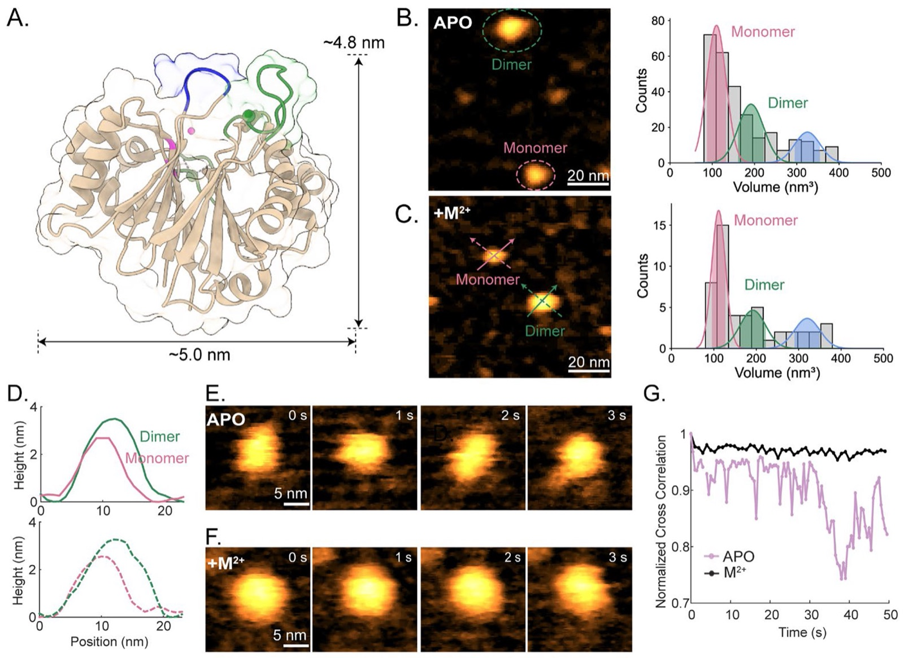
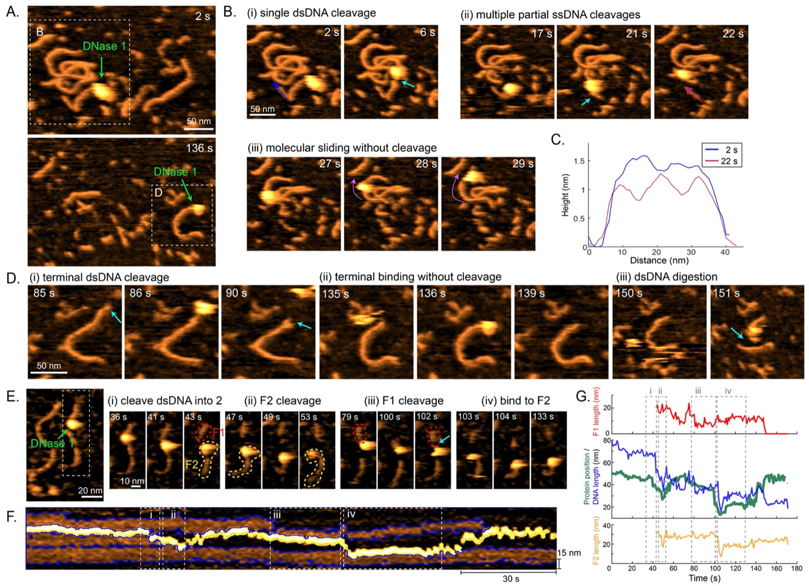
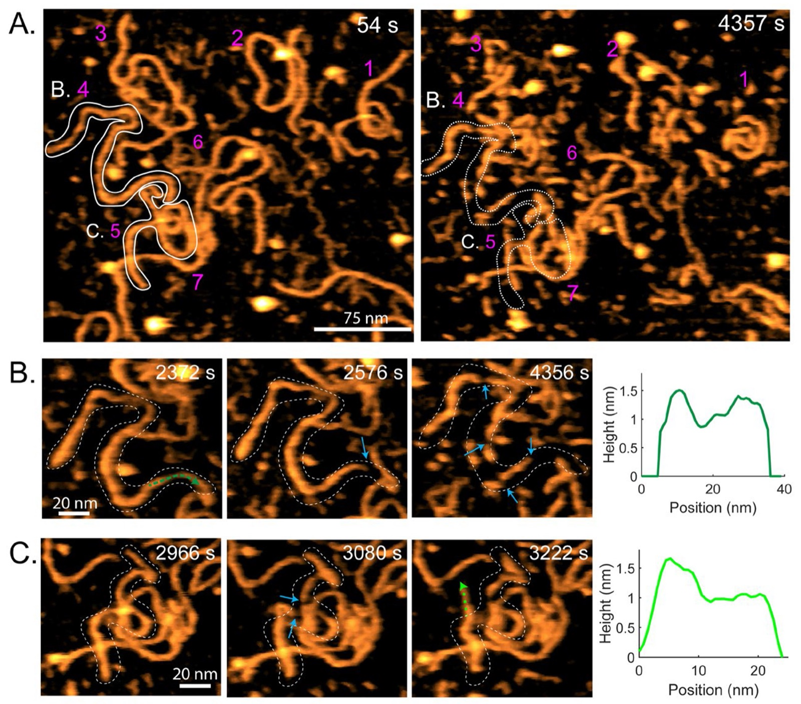
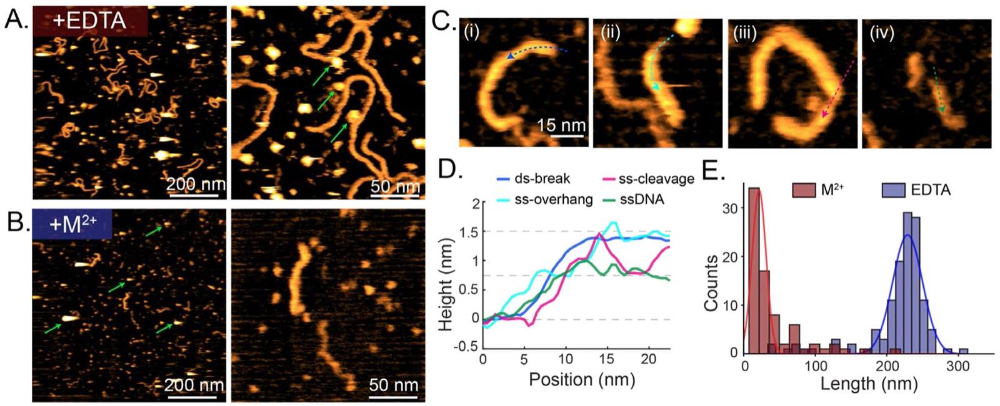
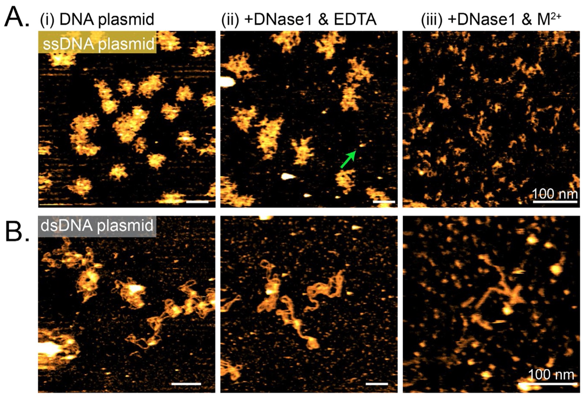

**Nada Elessawy, Selma Sinan, Hongshan Zhang, Zhenglin Yang, Yi Lu, Ilya J. Finkelstein, and Yi-Chih Lin† († corresponding)**

*ACS Chemical Biology*, 21(6): 1260-1268, 2026

DOI: [10.1021/acschembio.6c00195](https://doi.org/10.1021/acschembio.6c00195)

---

## Table of Contents

- [Abstract](#abstract)
- [Supplementary Material](#supplementary-material)
- [Acknowledgements](#acknowledgements)
- [Footnotes](#footnotes)
- [References](#references)

---

## Abstract

DNase I is a nonspecific endonuclease that preferentially cleaves double-stranded DNA (dsDNA) over single-stranded DNA (ssDNA) in the presence of Ca²⁺ and Mg²⁺. Although the structure and biochemical properties of DNase I are well-characterized, the catalytic process remains poorly understood, as earlier studies primarily inferred cleavage from endpoint fragments or time-averaged measurements rather than direct visualization. Here, we employ high-speed atomic force microscopy (HS-AFM) to directly visualize DNase I activity on linear dsDNA, circular dsDNA plasmids, and circular ssDNA plasmids. DNase I, observed as monomeric particles, dimers, and trimeric or higher-order aggregates, dynamically binds to and slides along DNA substrates while inducing both single-strand and double-strand cleavage events. These observations reveal that DNase I-mediated cleavage is not restricted to an isolated monomeric state and that sliding-like DNA-bound motion can accompany nonspecific nuclease activity. DNase I exhibits significantly higher cleavage efficiency toward dsDNA than ssDNA. Together, these results provide direct mechanistic insights into DNase I-mediated nucleic acid degradation, with implications for its biochemical functions and therapeutic applications.

**Keywords:** DNase I, high-speed atomic force microscopy, nucleic acid degradation, protein-DNA interactions

---

DNase I is the first discovered endonuclease that exclusively cleaves DNA. [[1](#ref1)] Physiologically, it plays a crucial role in degrading extracellular self-DNA, thereby maintaining immune homeostasis and preventing the harmful accumulation of nucleic acids. [[2](#ref2)] Deficiency or dysregulation of DNase I has been associated with several autoimmune disorders, most notably systemic lupus erythematosus. [[3,4](#ref3)] In the presence of Ca²⁺ and Mg²⁺, DNase I cleaves double-stranded DNA (dsDNA) with 100-500-fold higher efficiency than single-stranded DNA (ssDNA). [[5](#ref5)] This non-sequence-specific nuclease activity has enabled widespread therapeutic and biochemical applications, including clinical use in the treatment of cystic fibrosis [[6](#ref6)] and Alzheimer’s disease [[7](#ref7)]. In biochemical research, DNase I footprinting is a classic method for mapping protein-DNA interactions, as proteins bound to DNA protect specific regions from DNase I cleavage, leaving characteristic “footprints” of these sites. [[8,9](#ref8)] DNase I sensitivity is also modulated by local DNA flexibility and minor-groove accessibility, giving rise to DNase-hypersensitive sites that often correspond to regulatory elements in chromatin. [[10](#ref10)] However, despite extensive biochemical and structural characterization, the real-time, single-molecule mechanism by which DNase I dynamically engages DNA and converts transient encounters into strand cleavage outcomes remains poorly defined. Defining this process is important because DNase I remains widely used in molecular biology, sequencing-related workflows, DNA footprinting, therapeutic applications, and other biochemical protocols, where cleavage efficiency and pathway selection can directly affect experimental outcomes.

DNase I has traditionally been characterized within a monomer-centered structural framework; functionally, its catalytic activity requires divalent metal ions, with distinct binding sites for Ca²⁺ and Mg²⁺/Mn²⁺ ([Fig. 1A](#fig1)). [[11](#ref11)] Previous studies demonstrate that Mg²⁺ supports strand processing that yields single-strand breaks (SSBs) and ss-overhang intermediates, whereas Mn²⁺ increases the frequency of double-strand breaks (DSBs) and accelerates digestion. [[12](#ref12)] Structural studies (Table S1) indicate that Ca²⁺ binding primarily stabilizes the protein conformation ([Fig. 1A](#fig1), green pockets), while a distinct Mg²⁺/Mn²⁺-binding site contributes to DNA binding and catalysis ([Fig. 1A](#fig1), pink pocket). [[13,14](#ref13)] DNase I engages both strands of DNA and maintains contact with ~six consecutive base pairs via an exposed loop ([Fig. 1A](#fig1), blue loop), deforming the grooves to facilitate phosphodiester bond cleavage. [[14](#ref14)] Consistent with this metal dependence, EDTA inhibits DNase I activity by chelating essential divalent cations.

<figure class="paper-figure" id="fig1">

<figcaption><strong>Figure 1. Structural characterization of DNase I molecules in buffers.</strong> <strong>(A)</strong> Structure of DNase I endonuclease (PDB: 4awn, from X-Ray diffraction) with two calcium binding pockets (green), a magnesium binding site (pink), and the exposed DNA binding loop (blue). <strong>(B-C)</strong> Representative HS-AFM images (left) and volume histograms (right) of DNase I molecules observed in buffers <strong>(B)</strong> without cations (EDTA treatment; APO condition) and <strong>(C)</strong> with Ca²⁺ and Mg²⁺. Total analyzed particle number are 48 and 283 for (<strong>B)</strong> and (<strong>C),</strong> respectively. Buffer conditions are summarized in Table S2. The Gaussian fits of each volume distribution are summarized in Table S3. <strong>(D)</strong> Structural height comparisons between DNase1 monomer (pink) and dimer (green), as highlighted in <strong>(C).</strong> (<strong>E-F)</strong> Time-lapsing high-resolution images of DNase I monomers observed in buffers <strong>(E)</strong> without cations and <strong>(F)</strong> with Ca²⁺ and Mg²⁺. <strong>(G)</strong> The normalized cross correlation scores of DNase I molecules, as shown in <strong>(E)</strong> and <strong>(F)</strong>, after translational and rotational alignment.</figcaption>
</figure>

The kinetics and substrate dependence of DNase I-mediated DNA digestion have been investigated using various techniques. [[13,14](#ref13)] In particular, conventional atomic force microscopy (AFM) has visualized the degradation of diverse DNA substrates, including linear dsDNA [[15](#ref15)] and DNA origami [[16](#ref16)]. These studies highlighted that rigid or topologically constrained DNA geometries can be more resistant to DNase I digestion. [[16,17](#ref16)] However, directly resolving enzyme-DNA interactions at the moment of cleavage has remained challenging, largely because DNase I is highly diffusive in aqueous buffer and cleavage events are short-lived and heterogeneous. As a result, many AFM-based analyses emphasize substrate fragmentation without directly coupling it to DNase I activities.

High-speed atomic force microscopy (HS-AFM) provides the spatial and temporal resolution needed to observe such short-lived dynamics under near-physiological conditions [[18](#ref18)] and has been applied to study protein-nucleic acid interactions, including Cas9-mediated DNA cleavage [[19](#ref19)], G2L4 reverse transcriptase-mediated DNA repair intermediates [[20](#ref20)], and DNA-histone interactions [[21](#ref21)]. Importantly, dsDNA and ssDNA are readily distinguishable in AFM by their characteristic apparent heights (~1.2-1.5 nm for dsDNA [[22](#ref22)] and ~0.6-0.8 nm for ssDNA [[23](#ref23)]) enabling strand-processing outcomes to be read out directly from topography. Here, we use HS-AFM to directly visualize DNase I cleaving DNA substrates in real-time, classify enzyme-DNA interactions into distinct functional modes, including binding, sliding-like motion, nonproductive encounters, and cleavage, and assess the impact of divalent cations and substrate topology/mechanics on pathway selection across linear dsDNA and circular ss-/dsDNA plasmids. Rather than using HS-AFM only to observe DNA fragmentation, this study focuses on the functional behavior of DNase I itself during DNA degradation. These measurements directly identify catalytically active DNase I species, including monomeric particles, dimers, and trimeric or higher-order aggregates, during dsDNA cleavage. Although the current dataset does not support a quantitative comparison of activity among stoichiometric states, it demonstrates that DNase I particles with different apparent stoichiometries can participate in dsDNA cleavage under our HS-AFM imaging conditions. In addition, the observed sliding-like motion provides a dynamic view of how a non-sequence-specific nuclease samples dsDNA before or during cleavage. Together, these observations expand the conventional monomer-centered view of DNase I catalysis and establish HS-AFM as a platform for studying transient nuclease-substrate interactions.

To establish a structural and functional baseline for interpreting these cleavage movies, where rapid diffusion and short residence times can bias what is captured, we first characterized the oligomeric state and conformational dynamics of DNase I under defined biochemical conditions. DNase I adopts a Ca²⁺-stabilized sandwich-like structure fold and features an exposed surface loop spanning Arg 70 to Lys 74 ([Fig. 1A](#fig1), blue loop) that mediates binding to the minor groove of dsDNA. Upon DNA engagement, cleavage occurs at the active site that coordinates a primary catalytic Mg²⁺ cation ([Fig. 1A](#fig1), pink ion). [[24](#ref24)] We therefore performed HS-AFM measurements under two imaging conditions: an APO condition containing 1 mM EDTA and an functionally activated condition supplemented with divalent cations to support cleavage ([Fig. 1B-1G](#fig1) & Table S2).

Based on HS-AFM images ([Fig. 1B-1C](#fig1), left images), DNase I was observed predominantly as a monomer, with an apparent height of 2.3-3.0 nm ([Fig. 1D](#fig1), pink profiles), although a substantial fraction of particles appeared as dimers or higher-order aggregates. The expected monomer volume was estimated as 92.1 ± 3.5 nm³ by convoluting the DNase I PDB model with a simulated AFM tip (Fig. S1D; 2.0 nm apex radius). To quantify aggregation, we measured the particle volumes and fit the resulting volume histograms with Gaussian components corresponding to monomers, dimers, and trimers ([Fig. 1B-C](#fig1), right; Table S3). Because volume analysis remains susceptible to minor tip-convolution, even with the specialized HS-AFM tip used here (~1 nm apex radius), we further cross-validated oligomer assignments for representative particles using two diagonal cross-sectional height profiles ([Fig. 1D](#fig1)). Along both diagonal profiles, the particle assigned as a DNase I dimer exhibited greater apparent height and broader lateral dimensions than the monomer. These profile-based comparisons support the dimer assignment and indicate that the increased particle volume reflects a larger DNase I assembly rather than a tip-convolution artifact. Across conditions, ~52-54% of particles were monomeric, indicating a significant tendency to aggregate that was independent of divalent cations.

DNase I monomers closely resemble the simulated AFM image derived from the PDB structure (Fig. S1), although the lack of prominent topographic features prevented reliable assignment of molecular orientation. Time-lapse HS-AFM images revealed a clear biochemical dependence of conformational stability, where monomers were more structurally stable and rigid under functionally activated conditions (Ca²⁺ and Mg²⁺; [Fig. 1F](#fig1) and Supplemental Movie 2) than under APO conditions (EDTA; [Fig. 1E](#fig1) and Supplemental Movie 1). We quantified these dynamics using normalized cross-correlation (NCC) to the initial-frame topology ([Fig. 1G](#fig1)). In EDTA, DNase I exhibited larger NCC fluctuations, consistent with its increased conformational variability, whereas Ca²⁺ and Mg²⁺ stabilized a more compact conformation and persistent topology. This stabilization is consistent with divalent cations promoting a cleavage-competent conformational ensemble that supports productive and sustained enzyme-DNA engagement.

To capture DNase I activity on dsDNA, we employed a stepwise incubation strategy in which a linear, 800 bp dsDNA sample (~264 nm in length; native HPV-16 or synthetic) was first deposited onto APTES-treated mica, followed by DNase I addition prior to HS-AFM imaging. Experiments were performed in Ca²⁺ and Mg²⁺-containing buffer (Table S2), and initial frames therefore contained a mixture of intact dsDNA and partially digested fragments ([Fig. 2](#fig2)). For the HPV-16 dsDNA, trimeric DNase I aggregates, assigned by cross-sectional height-profile analysis (Fig. S2), were repeatedly observed binding to, diffusing along, and digesting dsDNA in real-time in two distinct scanning regions ([Fig. 2A-2D](#fig2), Fig. S3-S4, and Supplementary Movie 3). Notably, these trimeric assemblies remained catalytically active, and both DSBs and SSBs were readily observed along the dsDNA backbone during aggregate engagement ([Fig. 2A-2D](#fig2)).

<figure class="paper-figure" id="fig2">

<figcaption><strong>Figure 2. Real-time HS-AFM observations of DNase I cleavage activity on linear 800bp dsDNA samples.</strong> <strong>(A-D)</strong> Representative HS-AFM images of two trimeric DNase I aggregate demonstrating their functional activities, including binding, sliding, and cleavage events, on a linear 800 bp dsDNA sample, purified from a HPV-16 plasmid. <strong>(B, D)</strong> Zoomed-in images of local regions highlighted in <strong>(A)</strong>. Briefly, the observed functional events include the DNase I aggregate undergoes <strong>(B)</strong>-(i) DSB, -(ii) partial SSBs, and -(iii) sliding without cleavage on dsDNA fragments. (<strong>C</strong>) Height cross-section profiles along the same DNA fragment before (2 s) and after (22 s) ss-cleavages by a trimeric DNase I aggregate. <strong>(D)</strong> A trimeric DNase I aggregate binds to the terminal of dsDNA (i) with or (ii) without ds-cleavage, and (iii) continuously digests the dsDNA fragment. <strong>(E)</strong> Representative HS-AFM images showing the functional dynamics of a DNase I dimer during digestion of a synthetic, linear 800 bp dsDNA fragment, which is cleaved at 43 s into fragment 1 (F1, red) and 2 (F2, yellow). <strong>(F)</strong> Time-lapse kymograph of the DNase I dimer on the dsDNA fragment. The regions of DNase I dimer and DNA fragment are highlighted in yellow and blue, respectively. Along the kymograph, regions of interest, including (i) cleavage into two smaller fragments and (ii-iv) separately interacting with/cleaving each fragment, have been highlighted. (<strong>G)</strong> Correlation plots between the DNase I’s position (green) and lengths of DNA fragments measured over time.</figcaption>
</figure>

Two frequent modes were evident. In one, an aggregate remained bound for several seconds before cleavage occurred, producing either a DSB ([Fig. 2B-i](#fig2)) or a localized SSB (Fig. S3B-ii). In the other, aggregates sliding along dsDNA were frequently associated with cleavage events, yielding DSBs (Fig. S3B-i) and SSBs ([Fig. 2B-ii](#fig2)) that progressively fragmented the substrate. SSBs were accompanied by significant local height reductions along the backbone (from ~1.5 nm to ~0.7 nm; [Fig. 2C](#fig2), Fig. S3B), consistent with a transition from dsDNA-like to ssDNA-like apparent height during real-time DNase I activity. We therefore interpret these features as SSB-like or partial single-strand cleavage events, rather than base-pair-resolution images of an individual nick. We also observed non-productive encounters, binding ([Fig. 2D-ii](#fig2)) or diffusion without detectable cleavage ([Fig. 2B-iii](#fig2)), highlighting heterogeneity in transient enzyme-DNA interactions. The presence of ss-like segments generated during digestion is consistent with prior biochemical observations that Mg²⁺ supports partial strand processing, in terms of nicking, during DNase I-mediated dsDNA degradation. [[12](#ref12)]

To probe DNase I activity beyond larger aggregates, we performed analogous experiments with a synthetic 800 bp dsDNA substrate using Mn²⁺ as the catalytic cation to increase the efficiency of cleavage. Under these conditions, functional monomeric and dimeric DNase I species directly cleaving and processing a dsDNA fragment were visualized in real-time (Fig. S5 and Supplemental Movie 4). These DNase I particles were classified as monomers and dimers by cross-sectional height profile analysis (Fig. S5C-E). In contrast to the more stable trajectories captured for dimers and trimeric aggregates, monomer-mediated cleavage events were transient and therefore more difficult to capture and characterize. We note that, despite multiple trials, only a few movies successfully captured DNase I monomers cleaving dsDNA, potentially due to their high diffusivity and relatively smaller size.

For further characterization of the functional modes of DNase I on dsDNA, we preformed similar experiments using the same synthetic dsDNA substrate, but replaced Mn²⁺ with Mg²⁺, which supports lower cleavage efficiency and therefore enabled longer-lived trajectories to be captured. Under this condition, we visualized a DNase I dimer sliding along and cleaving a dsDNA fragment ([Fig. 2E-2G](#fig2), Fig. S6-8, and Supplementary Movie 5). Cross-sectional height profile analysis supported assignment of this functional particle as a DNase I dimer rather than a monomer (Fig. S6). This functionally active DNase I dimer initially bound near the center of a short dsDNA fragment (~80 nm) and induced a DSB that separated the substrate into two fragments ([Fig. 2E](#fig2), 43 s; F1 and F2). After this cleavage, the dimer underwent oscillatory diffusion between the ends of F1 (55-101 s and 148-161 s) and F2 (44-53 s and 104-140 s), with progressive shortening that coincided with molecular repositioning along the DNA. When fragment F1 was fully degraded (~150 s), the dimer diffused away and cleaved a nearby dsDNA fragment (Fig. S7A, 172-179 s). The same molecule later revisited fragment F2 (~181 s) before diffusing away again (Fig. S7 & Supplementary Movie 5). Notably, F2 continued to shorten even after the functionally active molecule was no longer visible (Fig. S7B), consistent with cleavage occurring during brief interactions that can fall below the imaging capture window. Closer inspection further suggested a transient two-lobed morphology during processing, including transitions from a compact globular morphology to a two-lobed-like shape, in which two monomeric units of the DNase I dimer became distinguishable during DNA sliding/cleavage (Fig. S8).

To quantify this trajectory, we constructed a two-dimensional kymograph of its trajectory along a dsDNA fragment over time ([Fig. 2F](#fig2)), and extracted both DNase I dimer’s position and fragment length versus time ([Fig. 2G](#fig2)). This analysis revealed a sequence in which the dimer (i) first traversed the fragment without detectable cleavage, then induced a DSB (36-43 s), (ii) shortened the end of fragment two while repositioning (47-53 s), (iii) returned to digest the fragment one (76-93 s), and (iv) translocated again to fragment two without additional cleavage (100-130 s). Across these data, dimers exhibited functional modes paralleling those of aggregates, including stable binding coupled to DSBs or SSBs, and non-productive binding/diffusion, although sliding-associated cleavage was not captured for this dimer, likely reflecting preferential end engagement in this dataset. Together, these real-time observations indicate that efficient dsDNA degradation arises from a dynamic balance among transient binding, one-dimensional motion along the substrate, and cleavage events that can occur on timescales comparable to, or faster than, image acquisition. Importantly, the functionally active particles captured in the main cleavage trajectories were assigned as a DNase I dimer and trimeric DNase I aggregates, indicating that multimeric DNase I species can remain catalytically competent under our HS-AFM conditions.

Together with the monomer-mediated cleavage event captured in Fig. S5, these observations show that DNase I particles with different apparent stoichiometries can participate in dsDNA cleavage. Across our movies, we identified approximately 25-30 cleavage-associated events; however, ~12-16 events occurred too rapidly to support high-resolution particle classification. Therefore, these data do not establish a quantitative dependence of DNase I activity on enzyme stoichiometry, but they support the conclusion that monomeric and oligomeric DNase I particles can be catalytically active under our HS-AFM imaging conditions.

In addition to the stepwise incubation, we performed live-addition experiments in which DNase I (with Ca²⁺ and Mg²⁺) was introduced into the liquid cell while imaging seven full-length dsDNA molecules in a single scanning area over 4357 s ([Fig. 3A](#fig3)). Over time, all dsDNA molecules were degraded into fragments ([Fig. 3A](#fig3); Fig. S9C), yet DNase I was only rarely resolved directly, consistent with its rapid diffusion in solution. Instead, cleavage events were occasionally accompanied by transient horizontal stripe-like features on dsDNA, consistent with partial, short-lived enzyme footprints captured by HS-AFM during catalysis. Across the trajectories, SSBs were observed as localized height decreases along the backbone and frequently preceded later fragmentation into shorter products. For example, dsDNA#4 exhibited an initial SSB-associated height decrease ([Fig. 3B](#fig3), 2372 s; green dashed arrow; Supplementary Movie 6), followed by a second SSB within the ss-like region (2576 s; blue arrow) and subsequent fragmentation into two large segments. Because these features appeared during continuous imaging after DNase I addition, they provide time-dependent evidence for local single-strand processing before later duplex fragmentation. At later time points, progressive DSBs further degraded these segments into shorter fragments ([Fig. 3B](#fig3), 4356 s). In addition, we observed the time-dependent formation of a ss-overhang at a DNA terminus ([Fig. 3C](#fig3), 3222 s; first appeared at ~3050 s), identified by reduced terminal height and increased flexibility relative to adjacent dsDNA. Once formed, this overhang persisted without further degradation over the remainder of the observation. These live-addition datasets support a model in which strand-local processing events can appear first and set the stage for later fragmentation, while the enzyme itself may remain difficult to capture continuously because catalytic encounters are transient.

<figure class="paper-figure" id="fig3">

<figcaption><strong>Figure 3. Live addition of DNase I to synthetic linear 800bp dsDNA.</strong> <strong>(A)</strong> Representative HS-AFM images of seven dsDNA molecules monitored before (left, 54 s) and after supplementing the DNase I (right, 4357 s) into the liquid cell. We added DNase I twice at 90 s & 878 s reaching a final concentration of ~ 0.38 nM. The imaging buffer contains both Ca²⁺ and Mg²⁺ for activating the function of DNase I in dsDNA digestion. Two closely inspected dsDNA molecules are highlighted in white. <strong>(B and C)</strong> Zoomed-in HS-AFM images of individual dsDNA molecules digested by DNase I over time. Blue arrows indicate SSBs or DSBs along the dsDNA with a gap left between two ends of newly formed fragments. Green dashed arrows correspond to the height profiles measured along the DNA backbone, where the height reduction from dsDNA (~1.2-1.5 nm) to ssDNA (~0.6-0.8 nm) is consistent with SSB-like or partial single-strand cleavage events mediated by DNase I.</figcaption>
</figure>

Because the real-time cleavage events observed in [Fig. 2](#fig2) and [Fig. 3](#fig3) were collected at the liquid-surface interface, we considered the possibility that surface adsorption could influence DNA conformation, DNase I diffusion, enzyme-substrate encounter frequency, or the distribution of observed cleavage pathways. Therefore, we used solution preincubation experiments to validate that our HS-AFM readouts reproduce well-established biochemical features of DNase I activity. In these experiments, DNase I and DNA reacted in solution before surface deposition, allowing us to test whether the product classes detected by HS-AFM were consistent with established DNase I biochemistry rather than being generated solely by the imaging interface.

To define how divalent cations regulate DNase I activity under our imaging conditions and to validate the AFM-based readouts against established DNase I biochemistry,, we preincubated DNase I with linear dsDNA for 30 min in buffers containing EDTA, Ca²⁺ only, Mg²⁺ only, or both Ca²⁺ and Mg²⁺ before depositing the reaction products onto mica for HS-AFM imaging ([Fig. 4](#fig4); Fig. S10; Table S4). In EDTA, DNase I still associated with dsDNA ([Fig. 4A](#fig4), green arrows; Supplementary Movie 7), but cleavage was strongly suppressed. Only rare DSBs were detected, and ~10% of molecules appeared as shortened fragments ([Fig. 4E](#fig4); Fig. S10E). Notably, we did not observe SSBs along the dsDNA backbone in this condition, indicating that enzyme-substrate association can be decoupled from productive phosphodiester hydrolysis when divalent ions are chelated. The small residual fragmentation likely reflects a minor fraction of DNase I molecules retaining tightly bound metal ions that are not fully sequestered by EDTA. [[25,26](#ref25)] We also considered whether this residual fragmentation could arise from tip-induced DNA damage during continuous HS-AFM scanning. However, the imaging force used in our HS-AFM experiments was maintained at a low level, approximately 20-40 pN [[27](#ref27)], and we did not observe tip-induced cleavage in ssDNA or dsDNA samples imaged without DNase I under comparable conditions. Moreover, the strong dependence of fragmentation on divalent-cation conditions argues that the dominant cleavage activity is enzymatic rather than mechanically induced by the AFM tip.

<figure class="paper-figure" id="fig4">

<figcaption><strong>Figure 4. Effect of divalent cations on DNase I digestion of synthetic 800bp linear dsDNA.</strong> <strong>(A, B)</strong> Representative HS-AFM images of DNA fragments degraded by DNase I in buffers <strong>(A)</strong> lacking divalent cations (with EDTA) and <strong>(B)</strong> containing Mg²⁺ and Ca²⁺, following a 30 min preincubation of DNase I with dsDNA in solution. <strong>(C)</strong> Classification of four distinct cleavage product types observed in the presence of Mg²⁺ and Ca²⁺: (i) DNA fragment produced by DSBs, (ii) fragment with a ss-overhang, (iii) partially single-stranded or locally disrupted product along the dsDNA, and (iv) fully ssDNA fragments. <strong>(D)</strong> Height profiles measured along the backbone of cleavage products, as highlighted by arrows in <strong>(C). (E)</strong> Length distribution of observed DNA products in EDTA (red) and Mg²⁺/Ca²⁺ buffer (blue), showing cation-dependent differences in cleavage outcomes. The Gaussian fits are summarized in Table S4.</figcaption>
</figure>

Adding Ca²⁺ or Mg²⁺ alone partially restored digestion (Fig. S10E and Table S4), resulting in 49 % and 38%, respectively, of DNA molecules observed to be shortened. The mean contour lengths of under Ca²⁺-only and Mg²⁺-only conditions were 42.6 nm and 23.5 nm, respectively, shorter than the 80 nm mean fragment length observed under EDTA conditions (Fig. S10E and Table S4). The presence of both Ca²⁺ and Mg²⁺ produced robust degradation, reflected by a remarkable reduction in both the number and contour length of surviving DNA fragments, with 77% of observed DNA molecules exhibiting a mean length of 21.5 nm and the remaining molecules with a mean length of 98.2 nm ([Fig. 4E](#fig4) and Table S4). When both Ca²⁺ and Mg²⁺ were present during solution incubation of DNA with DNase I, no full-length DNA molecules were observed, in direct contrast to incubation in solution with EDTA, Ca²⁺ alone, or Mg²⁺ alone (Table S4). We further used the height contrast between dsDNA (~1.5 nm) and ssDNA (~0.75 nm) to classify cleavage products ([Fig. 4D](#fig4) and Fig. S10C).

Under Ca²⁺ alone and both Ca²⁺ and Mg²⁺ conditions, we consistently observed four product classes ordered by observed frequency: (1) DSBs at dsDNA termini, (2) ss-overhangs, (3) SSBs along the dsDNA backbone, and (4) fully ssDNA products ([Fig. 4C](#fig4); Fig. S10B). These ss-overhang-containing and partially single-stranded products are consistent with strand-processing intermediates that can precede complete duplex cleavage, as observed dynamically in [Fig. 2](#fig2) and [Fig. 3](#fig3). In HS-AFM images, these intermediates were identified by local height reductions along the DNA backbone, reflecting the apparent height difference between dsDNA and ssDNA. Thus, rather than serving as the primary evidence for real-time nick formation, [Fig. 4](#fig4) provides endpoint/product-level support for the SSB-like and DSB pathways observed in the real-time HS-AFM movies. Classes 2 and 3 were further characterized by their reduced apparent height and altered local backbone morphology ([Fig. 4C-D](#fig4)), providing a useful nanoscale readout for resolving strand-processed cleavage products within individual DNA molecules.

Together, these single-molecule characterizations demonstrate that efficient DNase I catalysis requires a cooperative cation environment and provides a mechanistic picture of how metal availability controls not only overall activity but also the distribution of ss- versus ds-cleavage products ([Fig. 4](#fig4)). These solution-preincubation experiments reproduce well-established DNase I behaviors, including inhibition by EDTA, partial activity with Ca²⁺ or Mg²⁺ alone, and stronger digestion in the presence of both Ca²⁺ and Mg²⁺. Because these reactions occurred in solution before deposition, the resulting product distributions provide an independent validation that the height- and morphology-based HS-AFM readouts reflect DNase I-mediated DNA processing rather than surface effects alone.

The presence of Ca²⁺ and Mg²⁺ significantly enhanced DNase I-mediated degradation of linear dsDNA and resulted in the formation of four distinct classes of cleavage products ([Fig. 4B-C](#fig4)). To test whether these cation-dependent behaviors generalize across DNA topology and strand state, we next examined DNase I digestion of circular ssDNA and circular dsDNA plasmids ([Fig. 5A-5B](#fig5)). Each plasmid was first imaged on APTES-treated mica in the absence of enzyme ([Fig. 5A&B-i](#fig5)), and then re-imaged after 30 min of preincubation in solution with DNase I in either EDTA ([Fig. 5A&B-ii](#fig5)) or Ca²⁺+Mg²⁺ ([Fig. 5A&B-iii](#fig5)). Consistent with their distinct topological constraints, circular dsDNA adopted closed-loop, often compact/supercoiled conformations ([Fig. 5B-i](#fig5)), whereas ssDNA plasmids predominantly collapsed into irregular, compact structures with reduced apparent heights (~0.6-0.8 nm; [Fig. 5A-i](#fig5)). These distinct surface-adsorbed DNA geometries are consistent with previous AFM studies that report topological constraints in circular DNA and enhanced flexibility of ssDNA. [[28–30](#ref28)] Under EDTA, plasmid morphologies were largely unchanged relative to enzyme-free controls ([Fig. 5A&B-i](#fig5)), indicating that DNase I binding is insufficient to drive efficient cleavage when divalent cations are chelated. However, the compact conformations of circular plasmids limited reliable contour-length quantification in these measurements.

<figure class="paper-figure" id="fig5">

<figcaption><strong>Figure 5. DNase I digestion activity on circular ssDNA and dsDNA plasmid.</strong> <strong>(A-B)</strong> Representative HS-AFM images of circular <strong>(A)</strong> M13 ssDNA plasmid and <strong>(B)</strong> dsDNA plasmid imaged (i) before DNase I digestion, or after 30 minutes incubation of circular DNA plasmid sample with buffers containing (<strong>ii</strong>) EDTA or (<strong>iii</strong>) Mg²⁺ and Ca²⁺.</figcaption>
</figure>

In contrast, in the presence of Ca²⁺ and Mg²⁺, both plasmid substrates were degraded by DNase I ([Fig. 5A&B-iii](#fig5)). Cleavage products derived from ssDNA plasmids appeared as small, clustered structures and short ssDNA fragments that were relatively homogeneously distributed across different scanning areas ([Fig. 5A-iii](#fig5)). In comparison, dsDNA plasmids were predominantly degraded into dot-like structures ([Fig. 5B-iii](#fig5)) with a small number of short DNA fragments, resembling the cleavage products observed for linear dsDNA ([Fig. 4C](#fig4)). Notably, fewer residual DNA fragments remained for dsDNA plasmids than for ssDNA plasmids under the same biochemical conditions (Fig. S11). In addition, the contour lengths of residual DNA fragments for the dsDNA plasmid were shorter than those of the ssDNA plasmid (Table S4). Our results support more efficient DNase I-mediated cleavage of dsDNA.

In this work, we used HS-AFM to directly visualize DNase I-mediated DNA cleavage at the single-molecule level under near-physiological conditions. Although AFM and HS-AFM have previously been used to visualize DNA degradation, the main contribution of this study is to resolve the dynamic behavior of DNase I particles during cleavage, including their binding, sliding-like motion, apparent stoichiometry, and cleavage outcomes. While DNase I has been extensively characterized through ensemble biochemical assays [[1,12,13](#ref1)] and static structural methods [[11,13–17](#ref11)], cleavage activity has largely been interpreted from endpoint fragment distributions or time-averaged measurements rather than by observing the catalytic process as it occurs. Our HS-AFM approach resolves transient, heterogeneous enzyme-substrate interactions in real-time and reveals a set of functional modes, including binding, sliding-like motion, nonproductive encounters, SSB-like strand processing, DSB formation, and progressive fragment shortening arising from short-lived DNase I engagements with the DNA backbone ([Figs. 2](#fig2) and [3](#fig3)). Notably, our HS-AFM observations directly visualize catalytically active DNase I species during dsDNA cleavage at the single-molecule level, including monomers, dimers, and trimeric aggregates. In the main cleavage trajectories ([Fig. 2](#fig2)), the functionally active particles were assigned as a dimer and trimeric aggregates, whereas monomer-mediated cleavage events were captured less frequently (Fig. S5). Together, these observations expand the conventional monomer-centered view of DNase I catalysis by showing that both monomeric and oligomeric DNase I species can remain catalytically competent under HS-AFM imaging conditions. We note that these data do not establish a quantitative relationship between DNase I stoichiometry and catalytic efficiency. Instead, they demonstrate that catalytically active DNase I particles with different apparent stoichiometries can be captured during dsDNA cleavage.

The sliding-like motion observed here also provides a useful framework for interpreting DNase I activity on DNA. Berg and von Hippel proposed that DNA-binding proteins can interact with DNA through three-dimensional diffusion, hopping, intersegment transfer, and one-dimensional sliding. Although DNase I is a non-sequence specific endonuclease, previous studies have suggested that its cleavage activity is influenced by DNA flexibility and accessible minor-groove geometry. [[31–34](#ref31)] Our observations suggest that a related sliding-like mode can also occur for DNase I. In this context, DNase I sliding should not be interpreted as a search for a defined sequence motif. Instead, sliding-like motion may allow DNase I to locally sample the DNA contour geometry, increase transient catalytic engagement, and contribute to the heterogeneous distribution of SSB-like and DSB cleavage outcomes observed in our movies.

Because HS-AFM measurements are performed at a liquid-solid interface, we do not conclude that multimeric DNase I species dominate all DNase I activity in bulk solution. Surface immobilization may influence DNA conformation, enzyme residence time, local diffusion, and the probability of capturing specific cleavage intermediates. Therefore, our HS-AFM assay should not be interpreted as a complete substitute for unrestricted free-solution reactions. However, the DNA remains hydrated and accessible to DNase I in the liquid cell, and DNase I retains the ability to bind, diffuse along the DNA contour, dissociate, reassociate, and mediate cleavage. These dynamic behaviors argue against a purely static surface-adsorption artifact. In addition, the solution-preincubation experiments reproduced established DNase I cation dependence before deposition, including EDTA inhibition and enhanced cleavage in the presence of both Ca²⁺ and Mg²⁺. Thus, our data demonstrate that DNase I dimers and trimeric aggregates can remain catalytically competent during dsDNA cleavage under surface-supported but liquid-accessible conditions, revealing functional states that are difficult to access from static structures or endpoint digestion assays alone.

Divalent cation controls establish the essential and cooperative roles of Ca²⁺ and Mg²⁺ in enabling efficient cleavage under our imaging conditions ([Fig. 4](#fig4)). EDTA chelation largely suppressed DNA cleavage despite persistent enzyme-DNA interactions ([Fig. 4A](#fig4)), confirming that substrate binding alone is insufficient for catalysis. While the presence of either Ca²⁺ or Mg²⁺ partially restored DNase I activity, the combination of both cations resulted in robust and efficient DNA degradation, producing a diverse spectrum of ss- and ds-cleavage products. These real-time HS-AFM observations provide dynamic confirmation of long-standing biochemical models describing the metal-ion dependence of DNase I.

Extending these measurements across substrate architectures demonstrates that DNase I efficiency is strongly modulated by DNA mechanics and topology. The dsDNA is preferentially and more efficiently degraded across both linear and circular substrates, whereas ssDNA, despite increased flexibility, undergoes slower and less complete digestion ([Fig. 5](#fig5)). Altogether, DNase I is a crucial enzyme used in molecular biology, sequencing-related workflows, DNA footprinting, therapeutic applications, and biochemical sample preparation. This study captures the real-time behavior of catalytically active DNase I particles with different apparent stoichiometries during DNA digestion, advancing our understanding of its functional mechanisms.

This study demonstrates HS-AFM as a nanoscale approach for resolving nuclease reaction pathways and for connecting enzyme motion, ionic activation, and substrate mechanics to cleavage outcomes with high spatiotemporal resolution. It also provides mechanistic insights relevant to DNase I’s biological functions, therapeutic applications, and the rational design of nuclease-based tools. More broadly, this approach provides a framework for studying emerging nucleases and other DNA/RNA-binding enzymes whose transient substrate interactions are difficult to resolve using static structures or endpoint assays alone.

## Supplementary Material

**Supporting Information.** Supporting Information is available free of charge: materials and methods, data analysis, supporting images, analysis and tables, and supporting movie captions (PDF).

Supplementary movies S1 to S7 (AVI) accompany the article.

## Acknowledgements

This work was supported by start-up fund from the University of Texas at Austin to Y.-C. L. and the US National Institute of Health (GM150528 to Y.-C. L.; GM141931 to Y. L.). S. S., H. Z., and I.J.F. acknowledge the Welch Foundation (F-1808). Special thanks to Nicholas Primanis-Erickson for the AFM simulation platform.

## Footnotes

**Competing interests.** The authors declare no competing interests.

## References

1. Kishi K; Yasuda T; Takeshita H. DNase I: structure, function, and use in medicine and forensic science. Leg Med (Tokyo) 2001, 3 (2), 69–83. [doi:10.1016/s1344-6223(01)00004-9](https://doi.org/10.1016/s1344-6223(01)00004-9)

2. Mori G; Delfino D; Pibiri P; Rivetti C; Percudani R. Origin and significance of the human DNase repertoire. Sci Rep 2022, 12 (1), 10364. [doi:10.1038/s41598-022-14133-w](https://doi.org/10.1038/s41598-022-14133-w)

3. Leffler J; Ciacma K; Gullstrand B; Bengtsson AA; Martin M; Blom AM. A subset of patients with systemic lupus erythematosus fails to degrade DNA from multiple clinically relevant sources. Arthritis Res Ther 2015, 17 (1), 205. [doi:10.1186/s13075-015-0726-y](https://doi.org/10.1186/s13075-015-0726-y)

4. Martinez Valle F; Balada E; Ordi-Ros J; Vilardell-Tarres M. DNase 1 and systemic lupus erythematosus. Autoimmun Rev 2008, 7 (5), 359–363. [doi:10.1016/j.autrev.2008.02.002](https://doi.org/10.1016/j.autrev.2008.02.002)

5. Laukova L; Konecna B; Janovicova L; Vlkova B; Celec P. Deoxyribonucleases and Their Applications in Biomedicine. Biomolecules 2020, 10 (7). [doi:10.3390/biom10071036](https://doi.org/10.3390/biom10071036)

6. Shak S; Capon DJ; Hellmiss R; Marsters SA; Baker CL. Recombinant human DNase I reduces the viscosity of cystic fibrosis sputum. Proc Natl Acad Sci U S A 1990, 87 (23), 9188–9192. [doi:10.1073/pnas.87.23.9188](https://doi.org/10.1073/pnas.87.23.9188)

7. Tetz V; Tetz G. Effect of deoxyribonuclease I treatment for dementia in end-stage Alzheimer’s disease: a case report. J Med Case Rep 2016, 10 (1), 131. [doi:10.1186/s13256-016-0931-6](https://doi.org/10.1186/s13256-016-0931-6)

8. Galas DJ; Schmitz A. DNAse footprinting: a simple method for the detection of protein-DNA binding specificity. Nucleic Acids Res 1978, 5 (9), 3157–3170. [doi:10.1093/nar/5.9.3157](https://doi.org/10.1093/nar/5.9.3157)

9. Carey MF; Peterson CL; Smale ST. DNase I footprinting. Cold Spring Harb Protoc 2013, 2013 (5), 469–478. [doi:10.1101/pdb.prot074328](https://doi.org/10.1101/pdb.prot074328)

10. Cockerill PN. Structure and function of active chromatin and DNase I hypersensitive sites. FEBS J 2011, 278 (13), 2182–2210. [doi:10.1111/j.1742-4658.2011.08128.x](https://doi.org/10.1111/j.1742-4658.2011.08128.x)

11. Oefner C; Suck D. Crystallographic refinement and structure of DNase I at 2 A resolution. J Mol Biol 1986, 192 (3), 605–632. [doi:10.1016/0022-2836(86)90280-9](https://doi.org/10.1016/0022-2836(86)90280-9)

12. Campbell VW; Jackson DA. The effect of divalent cations on the mode of action of DNase I. The initial reaction products produced from covalently closed circular DNA. J Biol Chem 1980, 255 (8), 3726–3735. [doi:10.1016/S0021-9258(19)85765-4](https://doi.org/10.1016/S0021-9258(19)85765-4)

13. Pan CQ; Lazarus RA. Ca²⁺-dependent activity of human DNase I and its hyperactive variants. Protein Sci 1999, 8 (9), 1780–1788. [doi:10.1110/ps.8.9.1780](https://doi.org/10.1110/ps.8.9.1780)

14. Lahm A; Suck D. DNase I-induced DNA conformation. 2 A structure of a DNase I-octamer complex. J Mol Biol 1991, 222 (3), 645–667. [doi:10.1016/0022-2836(91)90502-w](https://doi.org/10.1016/0022-2836(91)90502-w)

15. Bezanilla M; Drake B; Nudler E; Kashlev M; Hansma PK; Hansma HG. Motion and enzymatic degradation of DNA in the atomic force microscope. Biophys J 1994, 67 (6), 2454–2459. [doi:10.1016/S0006-3495(94)80733-7](https://doi.org/10.1016/S0006-3495(94)80733-7)

16. Ramakrishnan S; Shen B; Kostiainen MA; Grundmeier G; Keller A; Linko V. Real-Time Observation of Superstructure-Dependent DNA Origami Digestion by DNase I Using High-Speed Atomic Force Microscopy. Chembiochem 2019, 20 (22), 2818–2823. [doi:10.1002/cbic.201900369](https://doi.org/10.1002/cbic.201900369)

17. Abdelhady HG; Allen S; Davies MC; Roberts CJ; Tendler SJ; Williams PM. Direct real-time molecular scale visualisation of the degradation of condensed DNA complexes exposed to DNase I. Nucleic Acids Res 2003, 31 (14), 4001–4005. [doi:10.1093/nar/gkg462](https://doi.org/10.1093/nar/gkg462)

18. Ando T. High-speed atomic force microscopy and its future prospects. Biophys Rev 2018, 10 (2), 285–292. [doi:10.1007/s12551-017-0356-5](https://doi.org/10.1007/s12551-017-0356-5)

19. Shibata M; Nishimasu H; Kodera N; Hirano S; Ando T; Uchihashi T; Nureki O. Real-space and real-time dynamics of CRISPR-Cas9 visualized by high-speed atomic force microscopy. Nat Commun 2017, 8 (1), 1430. [doi:10.1038/s41467-017-01466-8](https://doi.org/10.1038/s41467-017-01466-8)

20. Zhang P; Guo M; Zhang YJ; Lambowitz AM; Lin YC. Real-Time Visualization of G2L4 Reverse Transcriptase in DNA Repair via Microhomology-Mediated End Joining. bioRxiv 2026, 2026.2003.2013.711756. [doi:10.64898/2026.03.13.711756](https://doi.org/10.64898/2026.03.13.711756)

21. Nishide G; Lim K; Mohamed MS; Kobayashi A; Hazawa M; Watanabe-Nakayama T; Kodera N; Ando T; Wong RW. High-Speed Atomic Force Microscopy Reveals Spatiotemporal Dynamics of Histone Protein H2A Involution by DNA Inchworming. J Phys Chem Lett 2021, 12 (15), 3837–3846. [doi:10.1021/acs.jpclett.1c00697](https://doi.org/10.1021/acs.jpclett.1c00697)

22. Hansma HG; Bezanilla M; Zenhausern F; Adrian M; Sinsheimer RL. Atomic force microscopy of DNA in aqueous solutions. Nucleic Acids Res 1993, 21 (3), 505–512. [doi:10.1093/nar/21.3.505](https://doi.org/10.1093/nar/21.3.505)

23. Uchihashi T; Kodera N; Ando T. Guide to video recording of structure dynamics and dynamic processes of proteins by high-speed atomic force microscopy. Nat Protoc 2012, 7 (6), 1193–1206. [doi:10.1038/nprot.2012.047](https://doi.org/10.1038/nprot.2012.047)

24. Parsiegla G; Noguere C; Santell L; Lazarus RA; Bourne Y. The structure of human DNase I bound to magnesium and phosphate ions points to a catalytic mechanism common to members of the DNase I-like superfamily. Biochemistry 2012, 51 (51), 10250–10258. [doi:10.1021/bi300873f](https://doi.org/10.1021/bi300873f)

25. Shoemaker RC; Atherly AG; Palmer RG. Inhibition of deoxyribonuclease activity associated with soybean chloroplasts. Plant Cell Rep 1983, 2 (2), 98–100. [doi:10.1007/BF00270176](https://doi.org/10.1007/BF00270176)

26. Shire SJ. Stability characterization and formulation development of recombinant human deoxyribonuclease I [Pulmozyme, (dornase alpha)]. Pharm Biotechnol 1996, 9, 393–426. [doi:10.1007/0-306-47452-2_11](https://doi.org/10.1007/0-306-47452-2_11)

27. Lin YC; Guo YR; Miyagi A; Levring J; MacKinnon R; Scheuring S. Force-induced conformational changes in PIEZO1. Nature 2019, 573 (7773), 230–234. [doi:10.1038/s41586-019-1499-2](https://doi.org/10.1038/s41586-019-1499-2)

28. Akpinar B; Haynes PJ; Bell NAW; Brunner K; Pyne ALB; Hoogenboom BW. PEGylated surfaces for the study of DNA-protein interactions by atomic force microscopy. Nanoscale 2019, 11 (42), 20072–20080. [doi:10.1039/c9nr07104k](https://doi.org/10.1039/c9nr07104k)

29. Lyubchenko YL; Shlyakhtenko LS. Visualization of supercoiled DNA with atomic force microscopy in situ. Proc Natl Acad Sci U S A 1997, 94 (2), 496–501. [doi:10.1073/pnas.94.2.496](https://doi.org/10.1073/pnas.94.2.496)

30. Hamon L; Pastre D; Dupaigne P; Le Breton C; Le Cam E; Pietrement O. High-resolution AFM imaging of single-stranded DNA-binding (SSB) protein--DNA complexes. Nucleic Acids Res 2007, 35 (8), e58. [doi:10.1093/nar/gkm147](https://doi.org/10.1093/nar/gkm147)

31. Brukner I; Jurukovski V; Savic A. Sequence-dependent structural variations of DNA revealed by DNase I. Nucleic Acids Res 1990, 18 (4), 891–894. [doi:10.1093/nar/18.4.891](https://doi.org/10.1093/nar/18.4.891)

32. Heddi B; Abi-Ghanem J; Lavigne M; Hartmann B. Sequence-dependent DNA flexibility mediates DNase I cleavage. J Mol Biol 2010, 395 (1), 123–133. [doi:10.1016/j.jmb.2009.10.023](https://doi.org/10.1016/j.jmb.2009.10.023)

33. Hogan ME; Roberson MW; Austin RH. DNA flexibility variation may dominate DNase I cleavage. Proc Natl Acad Sci U S A 1989, 86 (23), 9273–9277. [doi:10.1073/pnas.86.23.9273](https://doi.org/10.1073/pnas.86.23.9273)

34. Lazarovici A; Zhou T; Shafer A; Dantas Machado AC; Riley TR; Sandstrom R; Sabo PJ; Lu Y; Rohs R; Stamatoyannopoulos JA; et al. Probing DNA shape and methylation state on a genomic scale with DNase I. Proc Natl Acad Sci U S A 2013, 110 (16), 6376–6381. [doi:10.1073/pnas.1216822110](https://doi.org/10.1073/pnas.1216822110)
