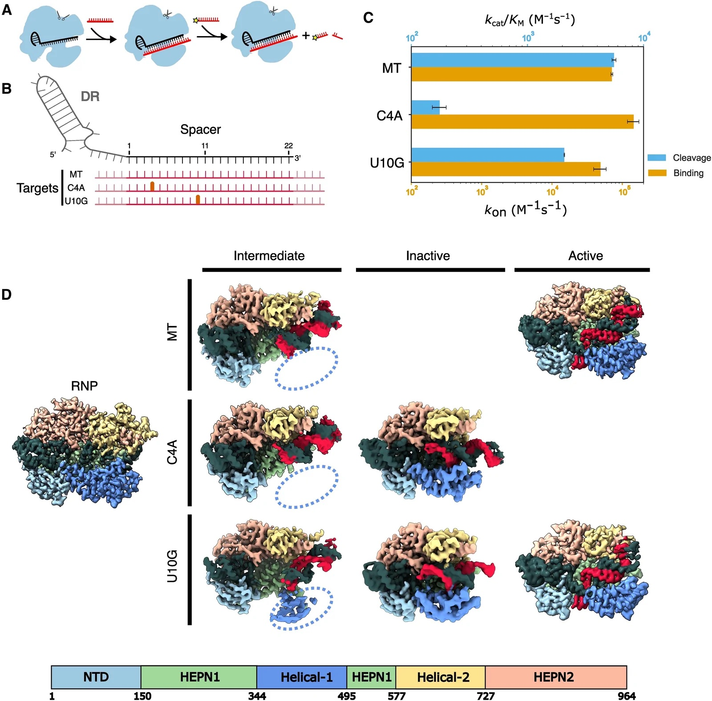
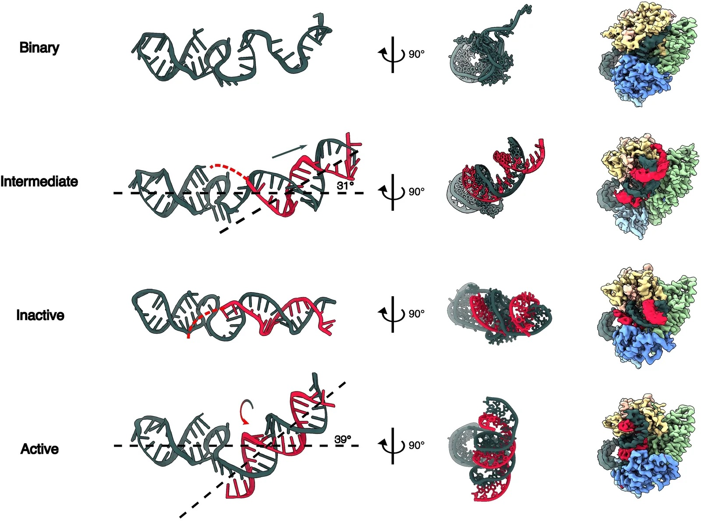
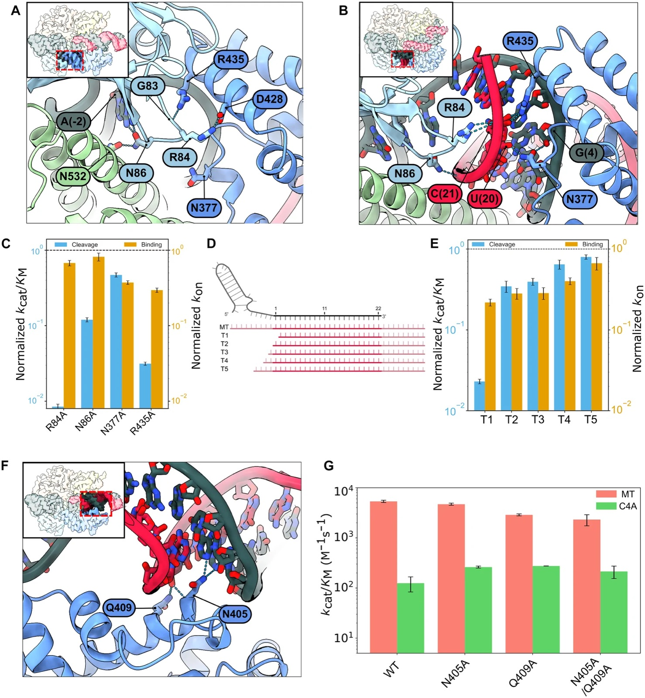
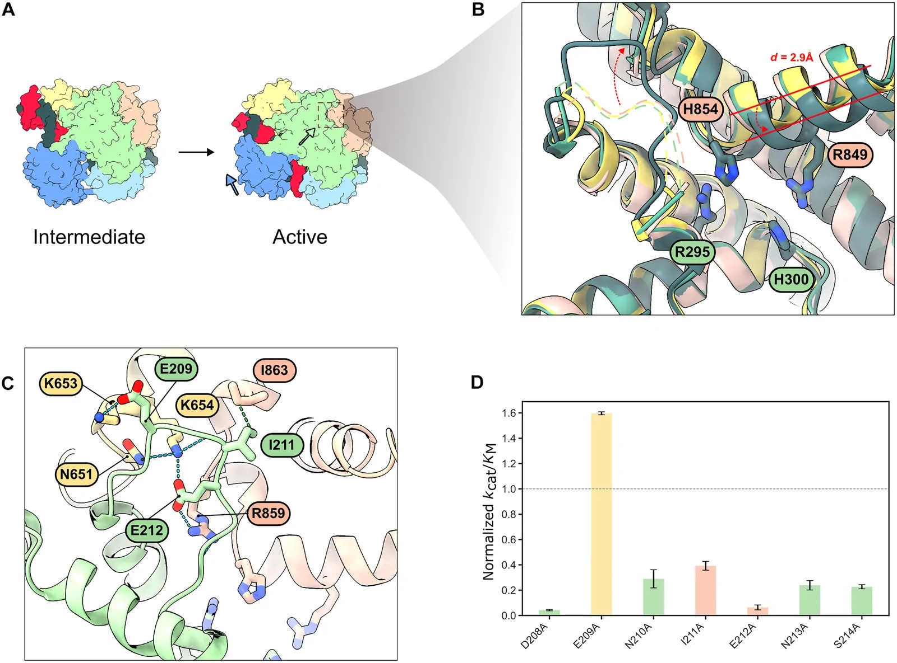
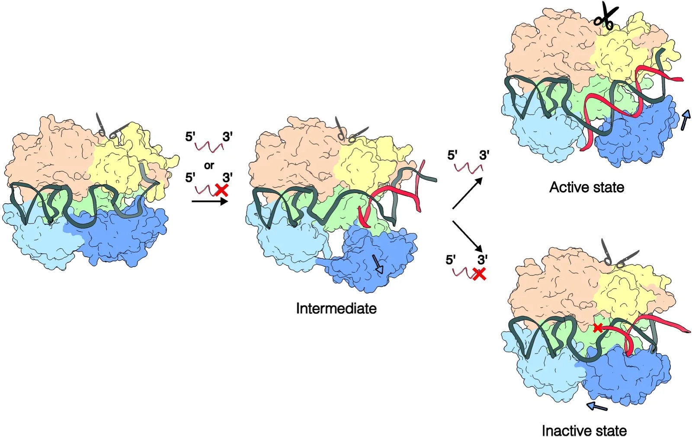

**Chia-Wei Chou, Selma Sinan, Hung-Che Kuo, You-Chiun Chang, Carlos Arguello, Daphne Sahaya, Rick Russell, and Ilya J. Finkelstein † († corresponding)**

*Science Advances*, 12(34): eaec4221, 2026

DOI: [10.1126/sciadv.aec4221](https://doi.org/10.1126/sciadv.aec4221)

---

## Table of Contents

- [Abstract](#abstract)
- [Introduction](#introduction)
- [Results](#results)
- [Discussion](#discussion)
- [Materials and Methods](#materials-and-methods)
- [Acknowledgments](#acknowledgments)
- [Supplementary Materials](#supplementary-materials)
- [References](#references)

---

## Abstract

CRISPR-Cas13d is increasingly used for RNA knockdowns, but off-target cleavage of near-cognate RNAs hinders its broader adoption. Here, we solve seven cryo–electron microscopy structures of wild-type Cas13d in complex with matched and mismatched targets. These structures reveal active, intermediate, and inactive states that illustrate a detailed activation mechanism. Upon target RNA binding, the CRISPR RNA undergoes marked conformational changes. The Helical-1 domain transitions from a docked state with the amino-terminal domain to an allosterically switched conformation that stabilizes the RNA duplex. Quantitative kinetics show that a single proximal mismatch preserves the binding rate constant but abolishes nuclease activity by trapping Cas13d in an inactive state. We also identify an active site loop in the higher eukaryotes and prokaryotes nucleotide-binding (HEPN) domains that regulates substrate accessibility and can be mutated to generate both hypo- and hyperactivated variants. These findings establish the structural basis for Cas13d mismatch surveillance and provide a framework for engineering HEPN nuclease specificity and activity.

---

## Introduction

Among all class 2 CRISPR-Cas nucleases, Cas13-family enzymes are unique in exclusively targeting and cleaving RNA [[1–7](#ref1)]. Cas13 must first search for a target RNA that is complementary to the spacer of the CRISPR RNA (crRNA) via a poorly understood mechanism. After binding the target RNA, the ribonucleoprotein (RNP) is activated to cleave the target (*in cis*) and other RNAs nonspecifically (*in trans*) [[1, 5, 8–10](#ref1)]. The ability to exclusively bind and target RNA has spurred intensive development of Cas13 for biotechnology applications, including RNA knockdown, tracking, editing, and nucleic acid detection [[3, 11–16](#ref3)]. Despite the broad adoption of Cas13 enzymes across many applications, how Cas13 discriminates between partially matched targets and how target binding activates the nuclease domain remain poorly understood.

Cas13-family enzymes differ in how they recognize the target RNA, but all use two higher eukaryotes and prokaryotes nucleotide-binding (HEPN) domains to cleave the phosphate backbone [[2, 5, 8, 14, 17–19](#ref2)]. For example, LshCas13a and BzCas13b require one or two specific nucleotides, termed the protospacer flanking sequence (PFS), immediately adjacent to the spacer complement on the target RNA for binding and nuclease activation [[1, 3, 4, 14, 15, 18, 20, 21](#ref1)]. The PFS may help these enzymes to identify the matched target (MT) RNA, akin to the protospacer adjacent sequence for DNA-cleaving CRISPR enzymes [[22, 23](#ref22)]. By contrast, Cas13d-family enzymes have an unexpectedly high specificity for their target RNAs despite not requiring any PFS for target recognition [[3, 12, 24, 25](#ref3)]. Moreover, Cas13d has a high binding affinity to partially matched targets *in vitro*, but these sequences only weakly activate the HEPN domains [[26, 27](#ref26)]. Thus, Cas13d is frequently used for RNA knockdown, editing, and diagnostics applications [[28–34](#ref28)].

Here, we investigated the molecular mechanisms of Cas13d mismatch surveillance and nuclease activation using a combination of cryo–electron microscopy (cryo-EM) structural analysis and quantitative kinetics. We describe seven Cas13d ternary complex structures, five of which we solve with partially matched targets. These structures revealed two previously uncharacterized states: an intermediate state that precedes the active complex and an inactive state that occurs when activation fails. A mismatch proximal to the direct repeat constrains the Cas13d complex in an inactive conformation. An active site loop (ASL) regulates Cas13d nuclease activity by interfering with the substrate-binding pocket. Alanine scanning mutagenesis across the ASL identified key residues that further tune nuclease activity. Together, our structural and quantitative kinetics data unveil a previously unrecognized activation pathway for Cas13d. More broadly, this study establishes the structural and mechanistic foundation for improved off-target prediction and rational engineering of Cas13d variants with tunable RNA binding and cleavage activity.

## Results

### Cas13d binding and cleavage are uncoupled at mismatched targets

We previously showed that *Eubacterium siraeum* DSM 15702 (Es)Cas13d nuclease activity is sensitive to mismatches positioned at critical sites along the target RNA [[16, 26](#ref16)]. Such mismatches inhibit cleavage without significantly impairing target RNA binding. To better understand the mechanism of this mismatch-dependent nuclease inactivation, we first tested RNA binding and cleavage using quantitative biophysical approaches and three MT RNAs (fig. S1). As expected, the cleavage rate of a ³²P-labeled RNA substrate was nearly identical for three matched crRNA-target RNAs (fig. S1, I and J). *Trans*-cleavage substrates showed a strong preference for UU, with a secondary preference for AU dinucleotides (fig. S2A). Therefore, all subsequent experiments use a 10–nucleotide (nt) substrate with two central uridines. Substituting both uridines with deoxyuridines (dUs) inhibited nuclease activity. Substituting U₅ with dU did not inhibit nuclease activity. However, a dU₄ inhibited all cleavage activity, indicating that this 2′-OH participates in the reaction mechanism (fig. S2B).

Next, we investigated Cas13d nucleolytic activity when the RNP binds a partially matched target RNA ([Fig. 1A](#fig1)). Consistent with our earlier study, a C→A substitution in the fourth position (C4A) of the target RNA largely inhibited RNA cleavage ([Fig. 1, B and C](#fig1)). By contrast, a U10G mismatch resulted in moderate cleavage. Both mismatched target RNAs have nearly identical binding rate constants, *k*on ([Fig. 1C](#fig1)) [[1, 2, 5, 35, 36](#ref1)]. Together, these data indicate that partially matched target RNAs bind but fail to activate the Cas13d nuclease.

<figure class="paper-figure" id="fig1">

<figcaption><strong>Figure 1. Mismatched RNA targets abrogate RNA cleavage and induce previously uncharacterized Cas13d states.</strong> (<strong>A</strong>) Schematic of the Cas13d cleavage assay. Cleavage of a ³²P-labeled RNA substrate is triggered by the binding of an RNA target complementary to the crRNA. Black: crRNA; red: target RNA; yellow: ³²P. (<strong>B</strong>) Diagram of the mismatched targets investigated in this study. Red: target RNA; thick ticks: mismatches at the 4th and 10th positions; pink: 5′ and 3′ flanking sequences. (<strong>C</strong>) Second-order cleavage rates (blue bars) of a <em>trans</em>-substrate when Cas13d is activated by an MT or mismatched targets. Orange bars: on-rates (<em>k</em>on) measured for the same substrates. Error bars: mean ± SD from at least three biological replicates. (<strong>D</strong>) Cryo-EM density maps of seven Cas13d ternary structures with the indicated mismatched target RNAs. Dashed oval: missing Helical-1 domain density.</figcaption>
</figure>

### Two new Cas13d ternary complexes revealed by partially matched target RNAs

To elucidate the molecular basis for Cas13d nuclease activation, we determined cryo-EM structures of a binary wild-type (WT) Cas13d complex, as well as ternary complexes with an MT, a C4A mismatch, or a U10G mismatch ([Fig. 1D](#fig1) and figs. S3 to S6). The binary structure closely resembled that of a previously-published Cas13d [Protein Data Bank (PDB) ID: 6E9E] with a Cα-Cα RMSD (root mean square deviation) of 1.33 Å (fig. S7) [[18](#ref18)]. A central hallmark of this structure is a kinked crRNA and a Helical-1 domain that is docked and interacting with the N-terminal domain (NTD). The 5′-end of the crRNA spacer is clamped between the Helical-1 and Helical-2 domains, but the 3′-distal end of the spacer is solvent-exposed and wedged between the Helical-2 and HEPN1 domains. These results are broadly consistent with an earlier study and support a model where the target RNA first hybridizes with the 3′-distal end of the crRNA spacer [[26](#ref26)].

The ternary structures also revealed a new conformation with a kinked crRNA-target RNA duplex and a flexible Helical-1 domain ([Fig. 1D](#fig1), intermediate state). Notably, the target RNA is not resolved after the 23rd nucleotide in our models, indicating that it remains flexible. Three lines of evidence suggest that this complex represents an intermediate “checkpoint” that precedes HEPN nuclease domain activation and subsequent cleavage of the target RNA. First, this state is populated in about half of the MT complexes, as well as half of the C4A and one-third of U10G complexes in the cryo-EM single-particle analysis, indicating that this is an intermediate along the nuclease activation pathway (figs. S3 to S5). Second, the crRNA in this state extends toward the 3′ end to be more exposed to the solvent and form a complete RNA duplex. Although the crRNA is slightly kinked, as in the MT Cas13d structure, the RNA duplex inclines toward the crevice between the Helical-2 and HEPN1 domains instead of binding between the Helical-2 domain and the HEPN2 domain ([Fig. 2](#fig2)). Last, the U10G structure captures some density for the flexible Helical-1 domain, indicating that it is no longer docked with the NTD ([Fig. 1D](#fig1), dashed oval). Rearranging NTD-Helical-1 interactions is essential for establishing the active ternary structure (see below). However, the active site is conformationally similar to the binary complex, indicating that this state is not yet poised for target RNA cleavage.

<figure class="paper-figure" id="fig2">

<figcaption><strong>Figure 2. Conformational changes in RNA duplexes across different states.</strong> (<strong>Left</strong>) Front view of crRNA and RNA duplexes across all states. (<strong>Middle</strong>) Side view of crRNA and RNA duplexes across all states. (<strong>Right</strong>) Side view of cryo-EM density maps across all states.</figcaption>
</figure>

The C4A and U10G RNPs also reveal a second conformation, which we term an “inactive” state on the basis of our quantitative kinetic assays and structural considerations ([Fig. 1D](#fig1), middle row). This conformation is characterized by a linear crRNA-target duplex with a Helical-1 domain stably anchored to the NTD. The RNA duplex stops at position 5 in the C4A complex, indicating that this mismatch locks the complex into a state that cannot mobilize Helical-1 for subsequent conformational changes. We defined the linear conformation as an inactive state of Cas13d for the following reasons. First, we only observed this state with mismatched ternary complexes that ablate or markedly reduce nuclease activity ([Fig. 1C](#fig1)). Second, this state has a straight helix in the HEPN2 domain, in contrast to the kinked conformation observed in the active state (fig. S8) [[18](#ref18)]. Third, the active site of Cas13d has a conformation similar to that of binary Cas13d. In particular, the Helical-1 domain still interacts with the NTD, similar to the binary complex (see below).

We also solved the structure of WT Cas13d in complex with an MT RNA. The overall structure is very similar to the previously published catalytically inactive Cas13d (R295A, H300A, R849A, and H854A), termed dCas13d (fig. S7) [[18](#ref18)]. The overall Cα-Cα RMSD between our structure and the ternary dCas13d structure (6E9F) is 0.7 Å. However, steric clashes between the native residues in the HEPN1 and HEPN2 domains reduce the local alignment to 2.6 Å in the nuclease active site and will be discussed below. As noted above, one of the two U10G structures is identical to that of the MT, with one exception. To accommodate the U10G mismatch, the crRNA and target RNAs form a non–A-form RNA duplex at the distal part of the crRNA and a canonical A-form duplex in the proximal crRNA region. This makes the N-terminal HEPN1 α helix bent relative to the active MT structure. Below, we discuss the structural implications of these distortions on HEPN domain activation.

### Global domain motions required for target RNA recognition and nuclease activation

The crRNA must undergo global rearrangements as Cas13d transitions from the binary to active state ([Fig. 2](#fig2) and fig. S9). In the binary state, the crRNA is bulged toward its 3′-end and makes the distal spacer more exposed to the solvent. In the intermediate state, the crRNA engages with the target RNA and extends toward the 3′ end. The Helical-1 domain undocks from the NTD to accommodate further pairing of the spacer and target RNAs. The nascent RNA duplex stays in the cleft that was previously occupied by the spacer in the binary state. RNA base pairing stops at position 5 in the intermediate state, indicating that Cas13d imposes an energy barrier to further base pairing in the proximal positions. The weak EM density around the proximal spacer suggests that the RNA is heterogeneous or dynamic in this region. In the inactive state, the RNA duplex does not continue into the proximal bases, allowing the Helical-1 domain to stabilize the partial RNA duplex. This tilts the RNA duplex ∼30° relative to the plane. In the MT structure, RNA base pairing extends along the entire spacer. This forces the crRNA to rotate clockwise and insert between the NTD and Helical-1 domains. The RNA duplex tilts back ∼40° and moves forward from the Helical-2/HEPN1 cleft to the HEPN1/HEPN2 crevice, opening the original charge surface on the HEPN1 and Helical-2 domains for substrate binding (fig. S10A). Mutations of charged residues in the HEPN1 domain reduced cleavage activity by 30 to 70%, indicating that this surface is critical for substrate binding (fig. S10, B and C).

To better characterize the intermediate state as a potential checkpoint, we performed structure-guided alanine substitutions at residues implicated in intermediate state stabilization (R735, Q676, N641, D639, S635, and N631) (fig. S11). All six substitutions reduced *trans*-cleavage rates relative to WT, indicating that their contacts stabilize the intermediate state during target-dependent activation. Thus, we conclude that this state is a transient but stable intermediate in the Cas13d activation pathway.

### The crRNA undergoes a marked conformational change upon nuclease activation

Extensive interactions between the Helical-1 and NTD domains in the inactive state sterically block the formation of the RNA duplex ([Fig. 3A](#fig3)). Helical-1 residues Arg435 (R435) and Asp428 (D428) form hydrophilic interactions with G83 and R84 in the NTD. However, the active state disrupts these interactions to make room for the RNA duplex, which forms hydrogen bonds with R84, N86, N377, and R435 ([Fig. 3B](#fig3)). Arginines R435 and R84 interact directly with target RNA bases and are essential for cleavage. N86 interacts with A (−2) in the direct repeat and N532 in the HEPN1 domain in the inactive state, while it interacts with the target backbone in the active state. N377 has no interaction in the inactive state but binds in the minor groove of the proximal RNA duplex. Disrupting any of these four residues via alanine substitutions significantly reduces cleavage but not the binding rate constant ([Fig. 3C](#fig3)). In summary, proximal mismatches disrupt nuclease activation by preventing the RNA duplex from reorganizing NTD-Helical-1 interactions.

<figure class="paper-figure" id="fig3">

<figcaption><strong>Figure 3. RNA-Cas13d interactions that change between the inactive and active states.</strong> Enlarged view of NTD-Helical-1 domain interactions in the (<strong>A</strong>) inactive and (<strong>B</strong>) nuclease-active states. Key changes between the two states include disruption of R435-G83 and D428-R84 interactions; formation of new RNA-protein contacts with R84, N86, N377, and R435; and displacement of the Helical-1 domain to accommodate the extended RNA duplex. (<strong>C</strong>) Second-order cleavage rates of a <em>trans</em>-substrate by Cas13d mutants, normalized to the WT Cas13d rates shown in the dashed line. Error bars: SD from three biological replicates. (<strong>D</strong>) Schematic of a series of progressively truncated RNA targets, labeled T1 to T5. Light red: 5′ and 3′ flanking sequences. (<strong>E</strong>) Second-order cleavage rates activated with the indicated RNAs. The rates are normalized to the extended MT RNA (dashed line). Error bars: SD from three biological replicates. (<strong>F</strong>) Enlarged view of N405/Q409 interactions with crRNA positions 10 and 11 in the inactive state that stabilize the linear RNA duplex conformation. (<strong>G</strong>) Second-order cleavage rates of N405A and Q409A mutants with MT and C4A targets, showing partial rescue of C4A cleavage activity. Error bars: SD from three biological replicates.</figcaption>
</figure>

On the basis of these mutagenesis studies, we hypothesized that the target RNA duplex must also be sufficiently long to disrupt these interactions, even when it is fully matched to the crRNA. To test this hypothesis, we measured the cleavage rates and binding rate constants for a series of truncated MT RNAs ([Fig. 3, D and E](#fig3)). Even a single nucleotide truncation relative to the spacer completely ablates nuclease activity (T1). Truncations T2 to T5, which partially extended the target RNA, also showed reduced activation that was proportional to the length of the truncation. These results confirm that the RNA duplex must extend beyond the spacer to fully liberate the Helical-1 domain for nuclease activation. Moreover, nuclease activation can be tuned *in vitro* and in cells via judicious selection of mismatches and target RNAs (see Discussion).

The RNA duplex is linear in the inactive state. This structure is partially stabilized by hydrogen bonds between N405/Q409 and positions 10 and 11 of the crRNA. These interactions do not exist in the active and intermediate MT and U10G structures ([Fig. 3F](#fig3)). Thus, we tested whether the alanine substitutions N405A and Q409A can reactivate the cleavage of the C4A target. Cleavage of the C4A target increased 1.6-fold relative to WT Cas13d for both N405A and Q409A, with no synergistic effect for the N405A/Q409A double mutant ([Fig. 3G](#fig3)). However, both mutants also reduced the cleavage rate of the MT substrate by up to 40%, revealing a sharp trade-off between enzyme promiscuity and nuclease activation.

### An ASL regulates *trans*-substrate accessibility by the HEPN domains

To understand how the HEPN nuclease is activated upon target RNA binding, we solved all structures with the fully WT active site residues. These structures are in contrast with prior Cas13d studies that used the nuclease-inactive Cas13d (H854/H300A/R295A/R849A) [[18, 37](#ref18)]. The binary, intermediate, and inactive states retained the same overall active site architecture ([Fig. 4, A and B](#fig4)). However, the HEPN2 α helix moved 2.9 Å from the binary to the active state.

<figure class="paper-figure" id="fig4">

<figcaption><strong>Figure 4. Stabilization of the ASL regulates <em>trans</em>-cleavage rates.</strong> (<strong>A</strong>) Back view of global domain movements between the intermediate and active states. The arrows indicate global domain movements from the intermediate state to the active state. (<strong>B</strong>) An enlarged view shows the superposition of the active sites in the binary (pink), intermediate (yellow), inactive (light green), and active (dark green) states. (<strong>C</strong>) Detailed interactions with ASL residues. Green: HEPN1 domain; pink: HEPN2; yellow: Helical-2. (<strong>D</strong>) Second-order cleavage rates with the indicated Cas13d mutants, activated with an MT RNA and normalized to WT Cas13d (dashed line). Error bars: SD of three biological replicates.</figcaption>
</figure>

We also resolved a loop positioned peripheral to the active site that mainly interacts with HEPN2 but also weakly interacts with the Helical-2 domain. Because of its proximity to the active site, we termed it the ASL ([Fig. 4C](#fig4)). The ASL is only stabilized by the HEPN2 and Helical-2 domains in the active state. All other reported structures, including our own, do not resolve this loop. AlphaFold models of four additional Cas13d orthologs confirmed that the ASL is a broadly conserved feature of this family of enzymes (fig. S12) [[38](#ref38)].

We reasoned that the ASL may regulate substrate access into an electrostatic binding pocket for nucleolytic cleavage. Alanine substitutions along the ASL significantly reduced cleavage activity relative to WT enzymes ([Fig. 4D](#fig4)). Electrostatic surface potential analysis reveals that the negatively charged ASL may also obstruct *trans*-substrate entry into the catalytic groove when the enzyme is not properly stabilized in the active state (fig. S13). While E209 only interacts with the Helical-2 domain, E212 forms a salt bridge with K654 in Helical-2 and additionally coordinates with R859 in the HEPN2 domain. The E209A mutation enhanced cleavage activity by ∼1.6-fold. We hypothesize that the hyperactivating E209A mutation loosens this gate by weakening the anchoring of the ASL to Helical-2, thereby freeing adjacent lysine residues (K653/K654) to better engage the RNA substrate. We conclude that the ASL regulates the accessibility of the RNA for the HEPN active site and that engineering this region may be a fruitful avenue for further hyperactivating Cas13d.

We further investigated whether the increased catalytic activity of ASL variants comes at the cost of reduced target selectivity (fig. S14). While all variants maintain similar binding rate constants (*k*on) for MTs and mismatched targets, their cleavage efficiencies (*k*cat/*K*M) differ significantly. Notably, Cas13d (E209A) retains a higher relative activity on the proximal C4A mismatch compared to WT, suggesting that hyperactivating mutations may increase the risk of off-target cleavage.

## Discussion

Here, we report the structural basis for Cas13d nuclease activation and mismatch surveillance ([Fig. 5](#fig5)). Among Cas13 family members, this structure retains all the WT residues in the HEPN active site. A growing body of evidence suggests that the target RNA first base-pairs with the hairpin-distal side of the crRNA [[3, 4, 24, 26, 39](#ref3)]. Mismatches between the target RNA and the distal side of the crRNA impede target recognition and reduce the overall RNA binding affinity [[24](#ref24)]. Base pairing proceeds toward the proximal end of the crRNA via an intermediate state that weakens the Helical-1-NTD interactions in advance of an extending double-stranded RNA. To activate the nuclease, the NTD and Helical-1 domains must separate and make sufficient room for RNA duplex formation. Mismatches toward the middle of the spacer, i.e., the U10G in this study, can be partially bypassed via non–Watson-Crick base pairing, as has been observed for Cas9 and other CRISPR-Cas proteins [[40–43](#ref40)]. Mismatches near the proximal end fail to disrupt the NTD-helical-1 interactions, locking the RNP in an inactive state. Displacement of the Helical-1 domain is crucial for allosteric activation of the catalytic site by bringing the two HEPN domains in closer proximity than in the inactive state. This multistep verification process ultimately activates the nuclease and explains Cas13d’s ability to discriminate against partially complementary off-target RNAs [[25, 26](#ref25)].

<figure class="paper-figure" id="fig5">

<figcaption><strong>Figure 5. Proposed Cas13d activation model.</strong> Cas13d RNP recognizes distal mismatches with low binding affinity, which may prevent the initiation of RNA duplex formation (target with red cross). By contrast, an RNA with a partial match at the distal end can initiate duplex formation, progressing the ternary complex to an intermediate state. The formation of a proximal RNA duplex must separate multiple contacts between the NTD and Helical-1 domains, creating an energy barrier for mismatch surveillance. A perfectly matched target activates Cas13d’s HEPN nuclease domain (top, scissors). Target RNAs with a proximal mismatch trap Cas13d in an inactive state (broken scissors).</figcaption>
</figure>

Cas13d’s high specificity for its target RNA may have evolved to minimize autoimmunity in bacteria. Unlike other type VI CRISPR nucleases, Cas13d does not require a PFS [[4](#ref4)]. This lack of stringent PFS requirements lets Cas13d target almost any RNA. By contrast, Cas13a requires a non-G PFS; BzCas13b favors non-C 5′-PFS and 3′-PFS of NNA or NAN [[1, 2, 5](#ref1)]. Furthermore, Cas13d does not require an antitag, further broadening its target range [[24, 44](#ref24)]. Cas13d activation is toxic to cells, leading to growth inhibition and potential cell death [[45](#ref45)]. Thus, Cas13d must rely on the overall complementarity between the crRNA guide and the target RNA, with mismatches blocking nuclease activation ([Fig. 5](#fig5)).

HEPN nucleases are metal ion–independent and catalyze RNA cleavage via a 2′-O-transesterification mechanism [[5, 46–49](#ref5)]. However, our biochemical assays and prior reports concluded that Cas13 strictly requires a divalent metal ion (fig. S15) [[1, 5, 8](#ref1)]. This suggests either that the Cas13 HEPN domain has evolved a catalytic requirement for metal ions or that the metal ions stabilize the substrate for metal-independent cleavage. We observed active site electron density consistent with a potential cation coordinated by two conserved histidines (H300 and H854), although we cannot rule out a structured water molecule. Because this coordination geometry lacks nearby acidic residues, which is atypical for a direct catalytic Mg²⁺ cofactor, the ion likely does not participate in the chemical cleavage step. Future studies will need to address the precise role of metal ions in HEPN nuclease activation.

The inactive, intermediate, and active Cas13d structures only differ by a 2.9-Å movement between HEPN1 and HEPN2 domains. These results are in contrast to prior structural studies in Cas13bt3, where the HEPN domains shift together by about 24 Å [[17, 19](#ref17)]. LbuCas13a also shows large rearrangements in the nuclease active site, with HEPN1 moving 6.5 to 9.6 Å toward the HEPN2 domain after the crRNA-target RNA duplex forms [[50](#ref50)]. We speculate that in Cas13d, the ASL regulates access to the HEPN nuclease active site. This mechanism is reminiscent of how some proteases and kinases regulate access to their active sites [[51, 52](#ref51)]. A single mutation (E209A) hyperactivates the Cas13d nuclease, possibly by opening the positively charged substrate-binding pocket and pulling the HEPN1 and HEPN2 domains together. Notably, the hyperactivating E209A mutant increases catalytic activity at both MTs and mismatched targets. Hyperactivation by engineering the ASL may come at the cost of reduced mismatch discrimination. Further engineering of the ASL may boost ribonuclease activity for both diagnostics and RNA editing applications.

Nonspecific nuclease activation and subsequent indiscriminate RNA cleavage have limited Cas13-family nuclease use for biotechnological applications in cells [[53–55](#ref53)]. Widespread RNA degradation can lead to cellular stress, altered gene expression, and cell death. In RNA diagnostics, this collateral activity can result in false positives or overly sensitive detection, complicating experiment interpretation. To address these issues, researchers have explored strategies to modulate Cas13 activity. One approach is to attenuate nuclease activity via Cas13d engineering [[54](#ref54)]. A simpler approach is to introduce programmed mismatches between the crRNA and its target to reduce the number of active nucleases, thereby minimizing nonspecific effects [[24](#ref24)]. Our study provides a mechanistic basis for installing such mismatches. A proximal mismatch can effectively down-regulate nuclease activity without changing the RNA binding rate constant. In contrast, for applications requiring high sensitivity such as in viral RNA detection, hyperactive mutations in ASL hyperactivate the nuclease. Future protein engineering studies will focus on further engineering Cas13d-based tools for mammalian systems, particularly in therapeutic contexts where precise but rapid RNA targeting is crucial.

## Materials and Methods

### Protein cloning and purification

Oligonucleotides were purchased from IDT. WT EsCas13d was cloned into a pET19 vector with an N-terminal 6× His-TwinStrep-SUMO purification tag to generate plasmid pIF1023 (table S1) [[26](#ref26)]. Nuclease-dead dCas13d was cloned by introducing R295A, H300A, R849A, and H854A mutations into plasmid pIF1024 via the Q5 Site-Directed Mutagenesis Kit (NEB) (table S1). Variant Cas13d proteins were cloned using the same kit.

To purify the WT protein, pIF1023 was transformed into *Escherichia coli* BL21 (DE3) cells. Cells were induced with 0.5 mM isopropyl β-d-1-thiogalactopyranoside (IPTG) at an optical density at 600 nm of ∼0.6 to 0.8 and grown at 18°C for 16 to 20 hours. Cells were pelleted and stored at −80°C. For purification, pellets were thawed and resolubilized in Lysis Buffer [50 mM Hepes (pH 7.4), 500 mM NaCl, 1 mM EDTA, 5% glycerol, 1 mM dithiothreitol (DTT), EDTA-free protease inhibitor cocktail (cOmplete), ribonuclease-free deoxyribonuclease I (NEB), and salt active nuclease (NEB)]. The resuspended pellet was sonicated, and cell debris was pelleted at 4°C via centrifugation at 20,000*g* for 45 min. The supernatant was incubated with Strep-Tactin resin (IBA) and further washed with Wash Buffer [50 mM Hepes (pH 7.4), 500 mM NaCl, 1 mM DTT, and 5% glycerol] and eluted with elution buffer [50 mM Hepes (pH 7.4), 500 mM NaCl, 1 mM DTT, 10% glycerol, and 7.5 mM DTT]. Elutions were treated with homemade SUMO protease overnight at 4°C. ApoCas13d was further purified by size exclusion chromatography (SEC) using a Superdex 200 Increase (GE Healthcare) in SEC Buffer1 [50 mM tris (pH 7.5), 100 mM NaCl, 5% glycerol, 1 mM MgCl₂, and 1 mM DTT] for structural studies and in SEC Buffer2 [25 mM tris (pH 7.5), 200 mM NaCl, 5% glycerol, 1 mM MgCl₂, and 1 mM DTT] for kinetic assays. Fractions were further pooled, concentrated, flash-frozen, and stored at −80°C. All variants were purified using the same protocol.

### Binary and ternary complex assembly and purification

Cas13d-RNA complexes were assembled by incubating purified Cas13d with crRNA (IDT) at a 1:3 molar ratio in RNP Formation Buffer [50 mM tris-HCl (pH 7.5), 100 mM NaCl, 6 mM MgCl₂, and 1 mM DTT] at 37°C for 1 hour. The binary complex was separated from excess crRNA and further purified by SEC using a Superdex 200 Increase 10/300 GL column (GE Life Sciences) equilibrated with SEC buffer [50 mM tris-HCl (pH 7.5), 150 mM NaCl, 1 mM MgCl₂, 10% glycerol, and 1 mM DTT]. RNP-containing fractions were pooled and concentrated with Amicon Ultra-15 centrifugal filters (30-kDa molecular weight cutoff, Millipore). For ternary complex formation, the binary RNP was incubated with target RNA (IDT) at a 1:5 molar ratio and purified by SEC under identical conditions. The purified complexes were concentrated, flash-frozen in liquid nitrogen as single-use aliquots, and stored at −80°C.

### Nuclease assays

The Cas13d-crRNA complex was assembled daily for experiments using purified Cas13d and a crRNA purchased from IDT (table S2). Assembly reactions were carried out by incubating Cas13d with a crRNA concentration that varied and was lower than that of Cas13d for 30 min at 37°C in a buffer containing 50 mM tris-HCl, 100 mM NaCl, 6 mM MgCl₂, and 1 mM DTT.

For *trans*-cleavage reactions, the target RNA (10 nt) was 5′-radiolabeled with [γ-³²P] ATP (adenosine 5′-triphosphate) (PerkinElmer) using T4 polynucleotide kinase (New England Biolabs). The Cas13d-crRNA complex was incubated with varying concentrations of different sizes of target RNA for 30 min at 37°C in a reaction buffer containing 50 mM tris-HCl, 150 mM NaCl, 6 mM MgCl₂, 1 mM DTT, and molecular-grade bovine serum albumin (0.2 mg/ml) (table S2). *Trans*-cleavage reactions were initiated by adding a trace amount of labeled target RNA to varying concentrations of the ternary complex. At different time points, 2-μl samples were quenched in 4 μl of denaturing solution [20 mM EDTA, 90% formamide, proteinase K (1.5 mg/ml), and 0.05% xylene cyanol]. Samples were analyzed by denaturing polyacrylamide gel electrophoresis (20% acrylamide and 7 M urea). The gels were exposed to a phosphorimager screen overnight, scanned with a Typhoon FLA 9500 (GE Healthcare), and quantified using ImageQuant 5.2 (GE Healthcare).

### Binding analysis

Target binding kinetics were assessed by adding a trace amount of radiolabeled target RNA to varying concentrations (10 to 25 nM) of the assembled dCas13d-crRNA complex. These reactions were performed in a buffer containing 50 mM tris-HCl, 150 mM NaCl, 1 mM DTT, 20 mM EDTA, and molecular-grade bovine serum albumin (0.2 mg/ml), similar to the cleavage reaction conditions. At various time points, 2-μl aliquots were taken and added to 4 μl of an ice-cold chase solution (reaction buffer with 100 nM unlabeled target RNA, 15% glycerol, and xylene cyanol) and placed on ice. Control reactions, where chase target RNA and labeled target RNA were premixed and then added to the Cas13d complex, confirmed that the chase solution effectively competed against the labeled target RNA. After adding the chase solution, aliquots were kept on ice and then loaded onto a 15% native gel run at 4°C. The gels were exposed overnight and analyzed as previously described. The association rate constant (*k*on) was determined from the slope of the observed rate constant versus Cas13d concentration. In the binding reactions for mutant Cas13d proteins, measurements were performed under Mg²⁺-free conditions without preparing a dead variant, and the binding rates were normalized to the Mg²⁺-free binding rate of the WT Cas13d.

### Cryo-EM sample preparation and data acquisition

Purified Cas13d complexes were diluted to 1 μM in 25 mM tris (pH 7.5), 200 mM NaCl, 5% glycerol, and 1 mM DTT. Samples were deposited on an Ultra Au foil R 1.2//1.3 grid (Quantifoil) that was plasma cleaned for 1.5 min (Gatan Solarus 950). Excess liquid was blotted away for 4 s in a Vitrobot Mark IV (FEI) operating at 4°C and 100% humidity before being plunge-frozen into liquid ethane. Data were collected on a Krios cryo–transmission electron microscope (Thermo Fisher Scientific) operating at 300 kV, equipped with a Gatan Biocontinuum Imaging Filter and a K3 direct electron detector camera (Gatan). Movies were collected using SerialEM at a pixel size of 0.8332 Å with a total exposure dose of 80 *e*⁻/Ų and a defocus range of −1.2 to −2.2 μm [[56](#ref56)]. To address a preferred orientation noticed during the collection of the C4A mismatch sample, subsequent datasets were gathered at a 30° tilt.

### Data analysis and model building

Real-time CTF (contrast transfer function) correction, motion correction, and particle picking were executed using cryoSPARC Live [[57](#ref57)]. Further data processing, including two-dimensional (2D) classification; 3D ab initio, heterogeneous refinements; 3D variation analysis; 3D classification; and homogeneous refinements, occurred with cryoSPARC. A full description of the cryo-EM data processing workflows can be found in figs. S3 to S6. A published EsdCas13d structure [PDB ID: [6E9F](https://doi.org/10.2210/pdb6E9F/pdb)] was docked into cryo-EM density maps using Chimera before being refined in Coot, ISOLDE, and PHENIX [[18, 58–60](#ref18)]. Full cryo-EM data collection and refinement statistics can be found in tables S3 to S6.

## Acknowledgments

We thank all members of the Finkelstein lab for helpful discussions. Cryo-EM data collection was performed at the University of Texas at Austin Cryo-EM Facility.

### Funding

This work was supported by the Welch Foundation grant F-1808 (to I.J.F.), NIH grant R35 GM131777 (to R.R.), a gift from Tito’s Handmade Vodka, and a Spark Catalyst grant from the College of Natural Sciences at the University of Texas at Austin.

### Author contributions

Conceptualization: C.-W.C., D.S., S.S., H.-C.K., and I.J.F. Data curation: C.-W.C., Y.-C.C., and S.S. Formal analysis: C.-W.C., Y.-C.C., S.S., and R.R. Funding acquisition: I.J.F. Investigation: C.-W.C., H.-C.K., Y.-C.C., D.S., C.A., and S.S. Methodology: C.-W.C., Y.-C.C., S.S., and R.R. Project administration: C.-W.C., S.S., and I.J.F. Resources: C.-W.C., Y.-C.C., C.A., S.S., R.R., and I.J.F. Software: S.S. Supervision: C.-W.C., S.S., R.R., and I.J.F. Validation: C.-W.C., Y.-C.C., D.S., and S.S. Visualization: C.-W.C., Y.-C.C., S.S., and I.J.F. Writing—original draft: C.-W.C., S.S., and I.J.F. Writing—review and editing: C.-W.C., Y.-C.C., S.S., and I.J.F.

### Competing interests

The authors declare that they have no competing interests.

### Data, code, and materials availability

All data and code needed to evaluate and reproduce the results in the paper are present in the paper and/or the Supplementary Materials. Cryo-EM maps and atomic coordinates have been deposited in the Electron Microscopy Data Bank (EMDB) and PDB under the following accession numbers: binary Cas13d (EMDB-47892, PDB-9EBU), MT intermediate (EMDB-47903, PDB-9EC9), MT active (EMDB-47902, PDB-9EC8), C4A intermediate (EMDB-47904, PDB-9ECA), C4A inactive (EMDB-47908, PDB-9ECE), U10G intermediate (EMDB-47905, PDB-9ECB), U10G inactive (EMDB-47906, PDB-9ECC), and U10G active (EMDB-47907, PDB-9ECD). This study did not generate new materials.

## Supplementary Materials

### This PDF file includes

Figs. S1 to S15

Tables S1 to S6

References

sciadv.aec4221_sm.pdf (7.6MB, pdf)

## References

1. Abudayyeh O. O., Gootenberg J. S., Konermann S., Joung J., Slaymaker I. M., Cox D. B. T., Shmakov S., Makarova K. S., Semenova E., Minakhin L., Severinov K., Regev A., Lander E. S., Koonin E. V., Zhang F., C2c2 is a single-component programmable RNA-guided RNA-targeting CRISPR effector. Science 353, aaf5573 (2016). [doi:10.1126/science.aaf5573](https://doi.org/10.1126/science.aaf5573)

2. Smargon A. A., Cox D. B. T., Pyzocha N. K., Zheng K., Slaymaker I. M., Gootenberg J. S., Abudayyeh O. A., Essletzbichler P., Shmakov S., Makarova K. S., Koonin E. V., Zhang F., Cas13b is a type VI-B CRISPR-associated RNA-guided RNase differentially regulated by accessory proteins Csx27 and Csx28. Mol. Cell 65, 618–630.e7 (2017). [doi:10.1016/j.molcel.2016.12.023](https://doi.org/10.1016/j.molcel.2016.12.023)

3. Konermann S., Lotfy P., Brideau N. J., Oki J., Shokhirev M. N., Hsu P. D., Transcriptome engineering with RNA-targeting type VI-D CRISPR effectors. Cell 173, 665–676.e14 (2018). [doi:10.1016/j.cell.2018.02.033](https://doi.org/10.1016/j.cell.2018.02.033)

4. Yan W. X., Chong S., Zhang H., Makarova K. S., Koonin E. V., Cheng D. R., Scott D. A., Cas13d is a compact RNA-targeting type VI CRISPR effector positively modulated by a WYL-domain-containing accessory protein. Mol. Cell 70, 327–339.e5 (2018). [doi:10.1016/j.molcel.2018.02.028](https://doi.org/10.1016/j.molcel.2018.02.028)

5. East-Seletsky A., O’Connell M. R., Knight S. C., Burstein D., Cate J. H. D., Tjian R., Doudna J. A., Two distinct RNase activities of CRISPR-C2c2 enable guide-RNA processing and RNA detection. Nature 538, 270–273 (2016). [doi:10.1038/nature19802](https://doi.org/10.1038/nature19802)

6. Kannan S., Altae-Tran H., Jin X., Madigan V. J., Oshiro R., Makarova K. S., Koonin E. V., Zhang F., Compact RNA editors with small Cas13 proteins. Nat. Biotechnol. 40, 194–197 (2022). [doi:10.1038/s41587-021-01030-2](https://doi.org/10.1038/s41587-021-01030-2)

7. Adler B. A., Trinidad M. I., Bellieny-Rabelo D., Zhang E., Karp H. M., Skopintsev P., Thornton B. W., Weissman R. F., Yoon P. H., Chen L., Hessler T., Eggers A. R., Colognori D., Boger R., Doherty E. E., Tsuchida C. A., Tran R. V., Hofman L., Shi H., Wasko K. M., Zhou Z., Xia C., Al-Shimary M. J., Patel J. R., Thomas V. C. J. X., Pattali R., Kan M. J., Vardapetyan A., Yang A., Lahiri A., Maxwell M. F., Murdock A. G., Ramit G. C., Henderson H. R., Calvert R. W., Bamert R. S., Knott G. J., Lapinaite A., Pausch P., Cofsky J. C., Sontheimer E. J., Wiedenheft B., Fineran P. C., Brouns S. J. J., Sashital D. G., Thomas B. C., Brown C. T., Goltsman D. S. A., Barrangou R., Siksnys V., Banfield J. F., Savage D. F., Doudna J. A., CasPEDIA Database: A functional classification system for class 2 CRISPR-Cas enzymes. Nucleic Acids Res. 52, D590–D596 (2024). [doi:10.1093/nar/gkad890](https://doi.org/10.1093/nar/gkad890)

8. O’Connell M. R., Molecular mechanisms of RNA targeting by Cas13-containing type VI CRISPR-Cas systems. J. Mol. Biol. 431, 66–87 (2019). [doi:10.1016/j.jmb.2018.06.029](https://doi.org/10.1016/j.jmb.2018.06.029)

9. Ai Y., Liang D., Wilusz J. E., CRISPR/Cas13 effectors have differing extents of off-target effects that limit their utility in eukaryotic cells. Nucleic Acids Res. 50, e65 (2022). [doi:10.1093/nar/gkac159](https://doi.org/10.1093/nar/gkac159)

10. Mahas A., Aman R., Mahfouz M., CRISPR-Cas13d mediates robust RNA virus interference in plants. Genome Biol. 20, 263 (2019). [doi:10.1186/s13059-019-1881-2](https://doi.org/10.1186/s13059-019-1881-2)

11. Zhang K., Zhang Z., Kang J., Chen J., Liu J., Gao N., Fan L., Zheng P., Wang Y., Sun J., CRISPR/Cas13d-mediated microbial RNA knockdown. Front. Bioeng. Biotechnol. 8, 856 (2020). [doi:10.3389/fbioe.2020.00856](https://doi.org/10.3389/fbioe.2020.00856)

12. Gupta R., Ghosh A., Chakravarti R., Singh R., Ravichandiran V., Swarnakar S., Ghosh D., Cas13d: A new molecular scissor for transcriptome engineering. Front. Cell Dev. Biol. 10, 866800 (2022). [doi:10.3389/fcell.2022.866800](https://doi.org/10.3389/fcell.2022.866800)

13. Tang T., Han Y., Wang Y., Huang H., Qian P., Programmable system of Cas13-mediated RNA modification and its biological and biomedical applications. Front. Cell Dev. Biol. 9, 677587 (2021). [doi:10.3389/fcell.2021.677587](https://doi.org/10.3389/fcell.2021.677587)

14. Cox D. B. T., Gootenberg J. S., Abudayyeh O. O., Franklin B., Kellner M. J., Joung J., Zhang F., RNA editing with CRISPR-Cas13. Science 358, 1019–1027 (2017). [doi:10.1126/science.aaq0180](https://doi.org/10.1126/science.aaq0180)

15. Abudayyeh O. O., Gootenberg J. S., Essletzbichler P., Han S., Joung J., Belanto J. J., Verdine V., Cox D. B. T., Kellner M. J., Regev A., Lander E. S., Voytas D. F., Ting A. Y., Zhang F., RNA targeting with CRISPR–Cas13. Nature 550, 280–284 (2017). [doi:10.1038/nature24049](https://doi.org/10.1038/nature24049)

16. Qiao X., Gao Y., Li J., Wang Z., Qiao H., Qi H., Sensitive analysis of single nucleotide variation by Cas13d orthologs, EsCas13d and RspCas13d. Biotechnol. Bioeng. 118, 3037–3045 (2021). [doi:10.1002/bit.27813](https://doi.org/10.1002/bit.27813)

17. Nakagawa R., Kannan S., Altae-Tran H., Takeda S. N., Tomita A., Hirano H., Kusakizako T., Nishizawa T., Yamashita K., Zhang F., Nishimasu H., Nureki O., Structure and engineering of the minimal type VI CRISPR-Cas13bt3. Mol. Cell 82, 3178–3192.e5 (2022). [doi:10.1016/j.molcel.2022.08.001](https://doi.org/10.1016/j.molcel.2022.08.001)

18. Zhang C., Konermann S., Brideau N. J., Lotfy P., Wu X., Novick S. J., Strutzenberg T., Griffin P. R., Hsu P. D., Lyumkis D., Structural basis for the RNA-guided ribonuclease activity of CRISPR-Cas13d. Cell 175, 212–223.e17 (2018). [doi:10.1016/j.cell.2018.09.001](https://doi.org/10.1016/j.cell.2018.09.001)

19. Deng X., Osikpa E., Yang J., Oladeji S. J., Smith J., Gao X., Gao Y., Structural basis for the activation of a compact CRISPR-Cas13 nuclease. Nat. Commun. 14, 5845 (2023). [doi:10.1038/s41467-023-41501-5](https://doi.org/10.1038/s41467-023-41501-5)

20. Xu C., Zhou Y., Xiao Q., He B., Geng G., Wang Z., Cao B., Dong X., Bai W., Wang Y., Wang X., Zhou D., Yuan T., Huo X., Lai J., Yang H., Programmable RNA editing with compact CRISPR–Cas13 systems from uncultivated microbes. Nat. Methods 18, 499–506 (2021). [doi:10.1038/s41592-021-01124-4](https://doi.org/10.1038/s41592-021-01124-4)

21. Molina Vargas A. M., Sinha S., Osborn R., Arantes P. R., Patel A., Dewhurst S., Hardy D. J., Cameron A., Palermo G., O'Connell M. R., New design strategies for ultra-specific CRISPR-Cas13a-based RNA detection with single-nucleotide mismatch sensitivity. Nucleic Acids Res. 52, 921–939 (2024). [doi:10.1093/nar/gkad1132](https://doi.org/10.1093/nar/gkad1132)

22. Mojica F. J. M., Díez-Villaseñor C., García-Martínez J., Almendros C., Short motif sequences determine the targets of the prokaryotic CRISPR defence system. Microbiology 155, 733–740 (2009). [doi:10.1099/mic.0.023960-0](https://doi.org/10.1099/mic.0.023960-0)

23. Shah S. A., Erdmann S., Mojica F. J., Garrett R. A., Protospacer recognition motifs: Mixed identities and functional diversity. RNA Biol. 10, 891–899 (2013). [doi:10.4161/rna.23764](https://doi.org/10.4161/rna.23764)

24. Wessels H.-H., Méndez-Mancilla A., Guo X., Legut M., Daniloski Z., Sanjana N. E., Massively parallel Cas13 screens reveal principles for guide RNA design. Nat. Biotechnol. 38, 722–727 (2020). [doi:10.1038/s41587-020-0456-9](https://doi.org/10.1038/s41587-020-0456-9)

25. Wessels H.-H., Stirn A., Méndez-Mancilla A., Kim E. J., Hart S. K., Knowles D. A., Sanjana N. E., Prediction of on-target and off-target activity of CRISPR–Cas13d guide RNAs using deep learning. Nat. Biotechnol. 42, 628–637 (2024). [doi:10.1038/s41587-023-01830-8](https://doi.org/10.1038/s41587-023-01830-8)

26. Kuo H.-C., Prupes J., Chou C.-W., Finkelstein I. J., Massively parallel profiling of RNA-targeting CRISPR-Cas13d. Nat. Commun. 15, 498 (2024). [doi:10.1038/s41467-024-44738-w](https://doi.org/10.1038/s41467-024-44738-w)

27. Otoupal P. B., Cress B. F., Doudna J. A., Schoeniger J. S., CRISPR-RNAa: Targeted activation of translation using dCas13 fusions to translation initiation factors. Nucleic Acids Res. 50, 8986–8998 (2022). [doi:10.1093/nar/gkac680](https://doi.org/10.1093/nar/gkac680)

28. Tieu V., Sotillo E., Bjelajac J. R., Chen C., Malipatlolla M., Guerrero J. A., Xu P., Quinn P. J., Fisher C., Klysz D., Mackall C. L., Qi L. S., A versatile CRISPR-Cas13d platform for multiplexed transcriptomic regulation and metabolic engineering in primary human T cells. Cell 187, 1278–1295.e20 (2024). [doi:10.1016/j.cell.2024.01.035](https://doi.org/10.1016/j.cell.2024.01.035)

29. Cui Z., Zeng C., Huang F., Yuan F., Yan J., Zhao Y., Zhou Y., Hankey W., Jin V. X., Huang J., Staats H. F., Everitt J. I., Sempowski G. D., Wang H., Dong Y., Liu S.-L., Wang Q., Cas13d knockdown of lung protease Ctsl prevents and treats SARS-CoV-2 infection. Nat. Chem. Biol. 18, 1056–1064 (2022). [doi:10.1038/s41589-022-01094-4](https://doi.org/10.1038/s41589-022-01094-4)

30. Yang P., Lou Y., Geng Z., Guo Z., Wu S., Li Y., Song K., Shi T., Zhang S., Xiong J., Chen A. F., Li D., Pu W. T., Da L., Zhang Y., Sun K., Zhang B., Allele-specific suppression of variant MHC with high-precision RNA nuclease CRISPR-Cas13d prevents hypertrophic cardiomyopathy. Circulation 150, 283–298 (2024). [doi:10.1161/CIRCULATIONAHA.123.067890](https://doi.org/10.1161/CIRCULATIONAHA.123.067890)

31. Powell J. E., Lim C. K. W., Krishnan R., McCallister T. X., Saporito-Magriña C., Zeballos M. A., McPheron G. D., Gaj T., Targeted gene silencing in the nervous system with CRISPR-Cas13. Sci. Adv. 8, eabk2485 (2022). [doi:10.1126/sciadv.abk2485](https://doi.org/10.1126/sciadv.abk2485)

32. Shen C.-C., Lin M.-W., Nguyen B. K. T., Chang C.-W., Shih J.-R., Nguyen M. T. T., Chang Y.-H., Hu Y.-C., CRISPR-Cas13d for gene knockdown and engineering of CHO cells. ACS Synth. Biol. 9, 2808–2818 (2020). [doi:10.1021/acssynbio.0c00338](https://doi.org/10.1021/acssynbio.0c00338)

33. Schertzer M. D., Stirn A., Isaev K., Pereira L., Park S. H., Das A., Réal A., Jeffery E. D., Harbison C., Wessels H., Sheynkman G. M., Sanjana N. E., Knowles D. A., Cas13d-mediated isoform-specific RNA knockdown with a unified computational and experimental toolbox. Nat. Commun. 16, 6948 (2025). [doi:10.1038/s41467-025-62066-5](https://doi.org/10.1038/s41467-025-62066-5)

34. Hart S. K., Müller S., Wessels H.-H., Méndez-Mancilla A., Drabavicius G., Choi O., Sanjana N. E., Precise RNA targeting with CRISPR-Cas13d. Nat. Biotechnol. 44, 64–69 (2026). [doi:10.1038/s41587-025-02558-3](https://doi.org/10.1038/s41587-025-02558-3)

35. Tambe A., East-Seletsky A., Knott G. J., Doudna J. A., O’Connell M. R., RNA binding and HEPN-nuclease activation are decoupled in CRISPR-Cas13a. Cell Rep. 24, 1025–1036 (2018). [doi:10.1016/j.celrep.2018.06.105](https://doi.org/10.1016/j.celrep.2018.06.105)

36. Yang J., Song Y., Deng X., Vanegas J. A., You Z., Zhang Y., Weng Z., Avery L., Dieckhaus K. D., Peddi A., Gao Y., Zhang Y., Gao X., Engineered LwaCas13a with enhanced collateral activity for nucleic acid detection. Nat. Chem. Biol. 19, 45–54 (2023). [doi:10.1038/s41589-022-01135-y](https://doi.org/10.1038/s41589-022-01135-y)

37. Zhang B., Ye Y., Ye W., Perčulija V., Jiang H., Chen Y., Li Y., Chen J., Lin J., Wang S., Chen Q., Han Y.-S., Ouyang S., Two HEPN domains dictate CRISPR RNA maturation and target cleavage in Cas13d. Nat. Commun. 10, 2544 (2019). [doi:10.1038/s41467-019-10507-3](https://doi.org/10.1038/s41467-019-10507-3)

38. Wei J., Lotfy P., Faizi K., Baungaard S., Gibson E., Wang E., Slabodkin H., Kinnaman E., Chandrasekaran S., Kitano H., Durrant M. G., Duffy C. V., Pawluk A., Hsu P. D., Konermann S., Deep learning and CRISPR-Cas13d ortholog discovery for optimized RNA targeting. Cell Syst. 14, 1087–1102.e13 (2023). [doi:10.1016/j.cels.2023.11.006](https://doi.org/10.1016/j.cels.2023.11.006)

39. Yang H., Patel D. J., Structures, mechanisms and applications of RNA-centric CRISPR–Cas13. Nat. Chem. Biol. 20, 673–688 (2024). [doi:10.1038/s41589-024-01593-6](https://doi.org/10.1038/s41589-024-01593-6)

40. Pacesa M., Lin C.-H., Cléry A., Saha A., Arantes P. R., Bargsten K., Irby M. J., Allain F. H., Palermo G., Cameron P., Donohoue P. D., Jinek M., Structural basis for Cas9 off-target activity. Cell 185, 4067–4081.e21 (2022). [doi:10.1016/j.cell.2022.09.026](https://doi.org/10.1016/j.cell.2022.09.026)

41. Nikolova E. N., Zhou H., Gottardo F. L., Alvey H. S., Kimsey I. J., Al-Hashimi H. M., A historical account of Hoogsteen base-pairs in duplex DNA. Biopolymers 99, 955–968 (2013). [doi:10.1002/bip.22334](https://doi.org/10.1002/bip.22334)

42. Leontis N. B., Stombaugh J., Westhof E., The non-Watson–Crick base pairs and their associated isostericity matrices. Nucleic Acids Res. 30, 3497–3531 (2002). [doi:10.1093/nar/gkf481](https://doi.org/10.1093/nar/gkf481)

43. Gao S., Guan H., Bloomer H., Wich D., Song D., Khirallah J., Ye Z., Zhao Y., Chen M., Xu C., Liu L., Xu Q., Harnessing non-Watson-Crick’s base pairing to enhance CRISPR effectors cleavage activities and enable gene editing in mammalian cells. Proc. Natl. Acad. Sci. U.S.A. 121, e2308415120 (2023). [doi:10.1073/pnas.2308415120](https://doi.org/10.1073/pnas.2308415120)

44. Wang B., Zhang T., Yin J., Yu Y., Xu W., Ding J., Patel D. J., Yang H., Structural basis for self-cleavage prevention by tag:anti-tag pairing complementarity in type VI Cas13 CRISPR systems. Mol. Cell 81, 1100–1115.e5 (2021). [doi:10.1016/j.molcel.2020.12.033](https://doi.org/10.1016/j.molcel.2020.12.033)

45. Meeske A. J., Nakandakari-Higa S., Marraffini L. A., Cas13-induced cellular dormancy prevents the rise of CRISPR-resistant bacteriophage. Nature 570, 241–245 (2019). [doi:10.1038/s41586-019-1257-5](https://doi.org/10.1038/s41586-019-1257-5)

46. Pillon M. C., Gordon J., Frazier M. N., Stanley R. E., HEPN RNases—An emerging class of functionally distinct RNA processing and degradation enzymes. Crit. Rev. Biochem. Mol. Biol. 56, 88–108 (2021). [doi:10.1080/10409238.2020.1856769](https://doi.org/10.1080/10409238.2020.1856769)

47. Pillon M. C., Sobhany M., Stanley R. E., Characterization of the molecular crosstalk within the essential Grc3/Las1 pre-rRNA processing complex. RNA 24, 721–738 (2018). [doi:10.1261/rna.065037.117](https://doi.org/10.1261/rna.065037.117)

48. Shigematsu M., Kawamura T., Kirino Y., Generation of 2′,3′-cyclic phosphate-containing RNAs as a hidden layer of the transcriptome. Front. Genet. 9, 562 (2018). [doi:10.3389/fgene.2018.00562](https://doi.org/10.3389/fgene.2018.00562)

49. Anantharaman V., Makarova K. S., Burroughs A. M., Koonin E. V., Aravind L., Comprehensive analysis of the HEPN superfamily: Identification of novel roles in intra-genomic conflicts, defense, pathogenesis and RNA processing. Biol. Direct 8, 15 (2013). [doi:10.1186/1745-6150-8-15](https://doi.org/10.1186/1745-6150-8-15)

50. Liu L., Li X., Ma J., Li Z., You L., Wang J., Wang M., Zhang X., Wang Y., The molecular architecture for RNA-guided RNA cleavage by Cas13a. Cell 170, 714–726.e10 (2017). [doi:10.1016/j.cell.2017.06.050](https://doi.org/10.1016/j.cell.2017.06.050)

51. Shen A., Allosteric regulation of protease activity by small molecules. Mol. Biosyst. 6, 1431–1443 (2010). [doi:10.1039/c003913f](https://doi.org/10.1039/c003913f)

52. Hu J., Ahuja L. G., Meharena H. S., Kannan N., Kornev A. P., Taylor S. S., Shaw A. S., Kinase regulation by hydrophobic spine assembly in cancer. Mol. Cell. Biol. 35, 264–276 (2015). [doi:10.1128/MCB.00943-14](https://doi.org/10.1128/MCB.00943-14)

53. Shi P., Murphy M. R., Aparicio A. O., Kesner J. S., Fang Z., Chen Z., Trehan A., Guo Y., Wu X., Collateral activity of the CRISPR/RfxCas13d system in human cells. Commun. Biol. 6, 334 (2023). [doi:10.1038/s42003-023-04708-2](https://doi.org/10.1038/s42003-023-04708-2)

54. Kelley C. P., Haerle M. C., Wang E. T., Negative autoregulation mitigates collateral RNase activity of repeat-targeting CRISPR-Cas13d in mammalian cells. Cell Rep. 40, 111226 (2022). [doi:10.1016/j.celrep.2022.111226](https://doi.org/10.1016/j.celrep.2022.111226)

55. Tong H., Huang J., Xiao Q., He B., Dong X., Liu Y., Yang X., Han D., Wang Z., Wang X., Ying W., Zhang R., Wei Y., Xu C., Zhou Y., Li Y., Cai M., Wang Q., Xue M., Li G., Fang K., Zhang H., Yang H., High-fidelity Cas13 variants for targeted RNA degradation with minimal collateral effects. Nat. Biotechnol. 41, 108–119 (2023). [doi:10.1038/s41587-022-01419-7](https://doi.org/10.1038/s41587-022-01419-7)

56. Mastronarde D. N., SerialEM: A program for automated tilt series acquisition on Tecnai microscopes using prediction of specimen position. Microsc. Microanal. 9, 1182–1183 (2003).

57. Punjani A., Rubinstein J. L., Fleet D. J., Brubaker M. A., cryoSPARC: Algorithms for rapid unsupervised cryo-EM structure determination. Nat. Methods 14, 290–296 (2017). [doi:10.1038/nmeth.4169](https://doi.org/10.1038/nmeth.4169)

58. Adams P. D., Afonine P. V., Bunkóczi G., Chen V. B., Davis I. W., Echols N., Headd J. J., Hung L.-W., Kapral G. J., Grosse-Kunstleve R. W., McCoy A. J., Moriarty N. W., Oeffner R., Read R. J., Richardson D. C., Richardson J. S., Terwilliger T. C., Zwart P. H., PHENIX: A comprehensive Python-based system for macromolecular structure solution. Acta Crystallogr. D Biol. Crystallogr. 66, 213–221 (2010). [doi:10.1107/S0907444909052925](https://doi.org/10.1107/S0907444909052925)

59. Croll T. I., ISOLDE: A physically realistic environment for model building into low-resolution electron-density maps. Acta Crystallogr. D Struct. Biol. 74, 519–530 (2018). [doi:10.1107/S2059798318002425](https://doi.org/10.1107/S2059798318002425)

60. Emsley P., Lohkamp B., Scott W. G., Cowtan K., Features and development of Coot. Acta Crystallogr. D Biol. Crystallogr. 66, 486–501 (2010). [doi:10.1107/S0907444910007493](https://doi.org/10.1107/S0907444910007493)

61. Punjani A., Zhang H., Fleet D. J., Non-uniform refinement: Adaptive regularization improves single-particle cryo-EM reconstruction. Nat. Methods 17, 1214–1221 (2020). [doi:10.1038/s41592-020-00990-8](https://doi.org/10.1038/s41592-020-00990-8)
