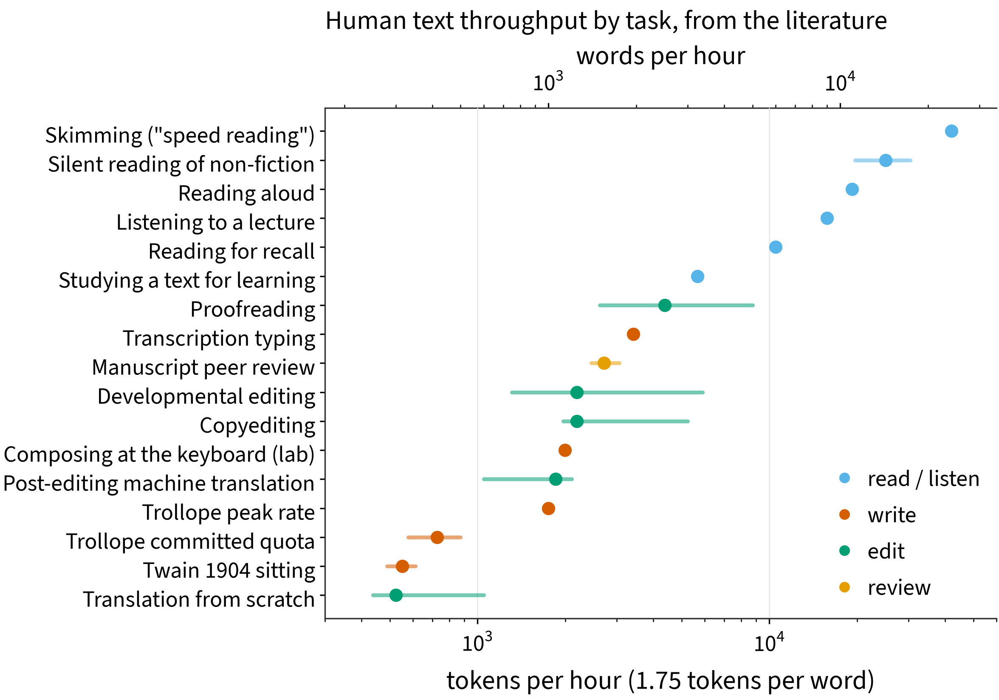
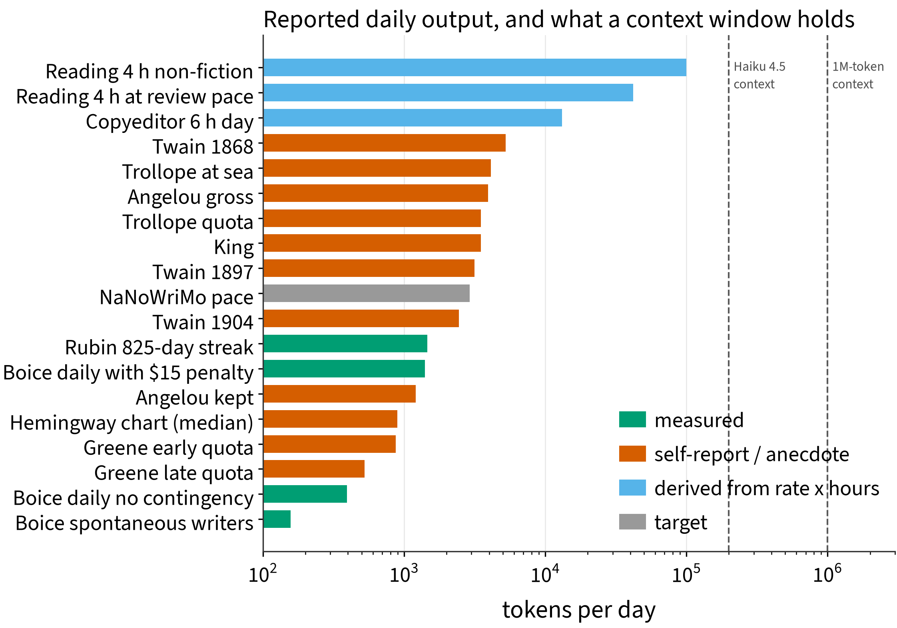
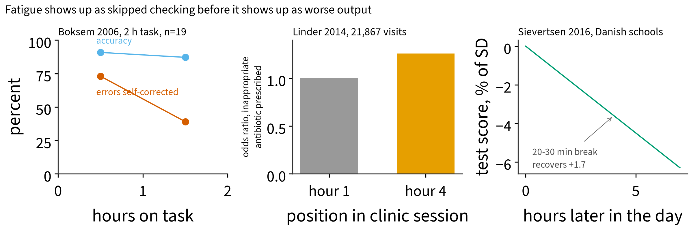
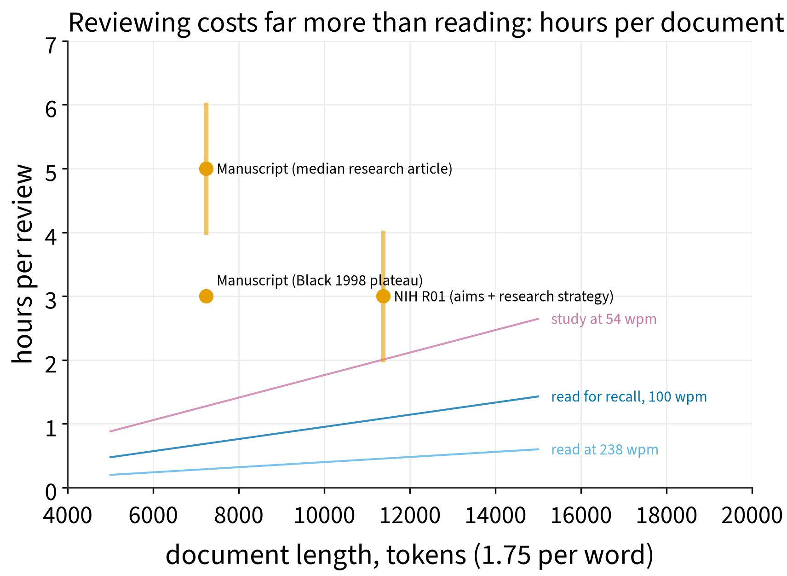

# -*- mode: org -*-
#+TITLE: My Token Limit
#+DATE: 2026-09-04
#+DESCRIPTION: How many words can one professor write, edit, or review in a day before quality drops? Nobody has measured it. I am going to try.
#+TAGS: academia, productivity, ai
#+OPTIONS: ^:{}

# Draft, 2026-09-04. Logging starts this week; results section to follow.
# Sources: notes.md in this folder. Figures: scripts/plots.py reads data/*.csv
# and writes figures/; scripts/sessions.py mines the Claude Code transcripts
# into data/sessions.csv and data/prompts.csv, plotted by plots_sessions.py.
# Reference a figure as [[file:figures/NAME.png]] and the converter copies it
# into assets/images/blog/my-token-limit/.

Language models ship with a context window. So do I. Every day is a budget of text I can write, read carefully, or judge, and it runs out well before the day does. I want to know how big the budget is, whether it depends on the kind of work, and what the quality curve looks like as it drains.

The work falls into four kinds, and they feel different. Writing new prose. Editing existing prose, increasingly a model's draft, which makes me the reviewer rather than the author. Reviewing, where the input is large, the output is a verdict, and the cost is judgment. And teaching, where the output is spoken. I suspect they draw on the same pool but at different rates.

* What the literature says

Surprisingly little. Nobody has measured writing or reviewing quality against hours on task. The popular numbers are mostly folklore.

The four-hour day comes from Ericsson's violinists, who practiced about 3.5 hours a day in 60 to 90 minute blocks. That was ten people per group and one week of diaries, and the direct replication reversed the result. Boice's "daily writers out-produce bingers" rests on 27 faculty, a control arm told not to write, and 36% dropout, nearly all of whom quit because of "the nuisance of charting." Helen Sword surveyed 1,300 academics and found that one in eight writes every weekday, exemplary writers included. The one preregistered trial of scheduled writing improved confidence and nothing measurable.

The famous writers' quotas are no better. Trollope's 250 words per quarter hour was his peak rate; his committed quota was 40 pages a week, less than half that pace. Hemingway's 500 words a day is the mean of five numbers a visitor read off a chart on his wall. Graham Greene's most-quoted line about averaging 500 words a day is spoken by a fictional narrator in The End of the Affair. Maya Angelou is the only one who reports yield: nine pages written, two and a half kept.

What does replicate is more interesting. Fatigue is not a drained battery. Ego depletion failed two multi-lab replications. What survives is Hockey's compensatory control: under fatigue you protect the main output and quietly stop checking. In Boksem's two-hour task, accuracy fell four points while self-corrected errors dropped from 73% to 39%, and a small cash incentive restored hour-one performance. Clinicians show the same pattern across a clinic session: inappropriate antibiotics rise, screening orders fall from 64% to 48%, and opioid prescriptions climb while NSAIDs stay flat. The failure mode is the shortcut, not the error.

For throughput there are a few anchors. Careful reading runs about 100 words per minute, so a 7,000-word manuscript is 70 minutes before any judgment. One proofreading pass catches about two thirds of word-level errors, and under 60% in your own text. Professional copyeditors run about 1,250 words an hour. Reviewers report a median of five hours per manuscript, and review quality stops improving after about three. An R01 is about 6,500 words of aims and strategy, reviewed in two to four hours, with six to fifteen of them per round. In peer review, who the reviewer is explains far more variance than anything about the paper.

And the analogy is closer than it sounds. Zheng and Meister put human behavioral throughput at about 10 bits per second, reading at 28 to 45. To put the literature on a model's scale I ran my own manuscripts through the GPT-4 tokenizer: scientific prose costs about 1.75 tokens per word, well above the 1.3 usually quoted for plain English, because jargon fragments. At that rate a million-token context window is about 570,000 words, 40 hours of continuous reading at normal speed or 95 hours at review speed.

# Figures to place, all already rendered in figures/. Uncomment and caption:
#
# fig1: tokens per hour by task, log scale
# #+CAPTION: ...
# 
#
# fig2: reported daily output vs context windows
# #+CAPTION: ...
# 
#
# fig3: what degrades (Boksem, Linder, Sievertsen)
# #+CAPTION: ...
# 
#
# fig4: hours per review vs document tokens, against reading-rate lines
# #+CAPTION: ...
# 
#
# Supplementary, from my own transcripts: figS1-sessions-per-day,
# figS2-visible-tokens-per-day, figS3-session-distribution, figS4-concurrency.

* How I will measure it

One line per work session, in a plain text file I own: task type, start, stop, the document, the git commit at each end, and a fatigue rating from 1 to 5. The output for writing and editing is the word-level diff between the two commits, bibliography and figures excluded. For review, it is the document length and the critique. For teaching, contact minutes.

Quality is the hard part, and the literature says word counts alone will mislead. Three cheap measures. Revision survival: what fraction of the words written in a session are still in the submitted version. A blind re-read a week later, rating a random paragraph without knowing when it was written. And for editing sessions, seeded errors: a model plants a known number of mistakes before I start, and the fraction I catch as a function of session number in the day is a direct vigilance measure. That last one is the only clean dose-response curve, and it is the one Hockey's model says should bend first.

One semester. Predictions, written before the data: about 2,000 net words a day of prose I keep, in two or three sessions, with a knee after four hours. Editing churns faster than writing, but the catch rate falls after 90 minutes. The third grant in a sitting gets a shorter critique than the first.

Two things I expect to go wrong, because they always do. The logging itself changes the behavior, and the first month is not a baseline. And the instrument breaks: Boice lost a third of his subjects to charting, and Sarnecka lost 39% of her tracker data when the app silently stopped after an OS update. One line a day, by hand, checked weekly.

* Results

# Dec 2026
